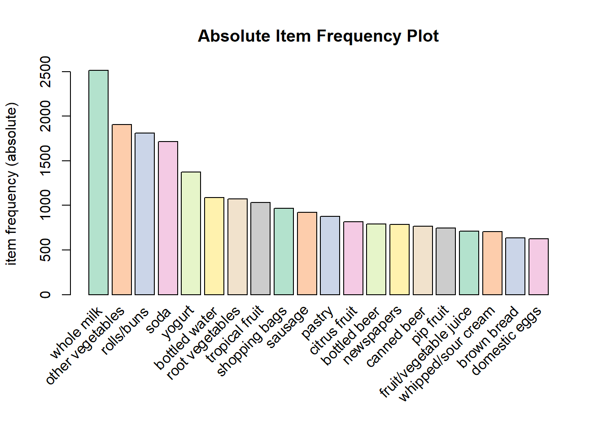
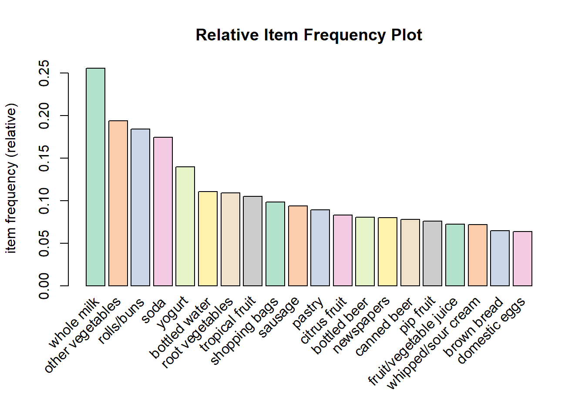
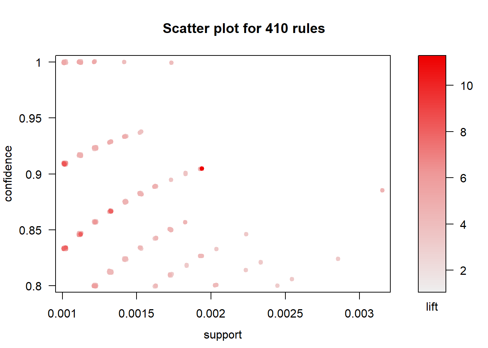
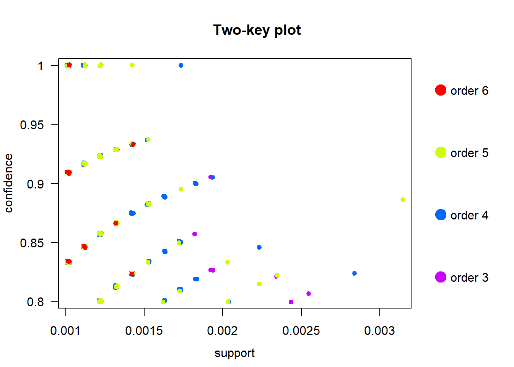
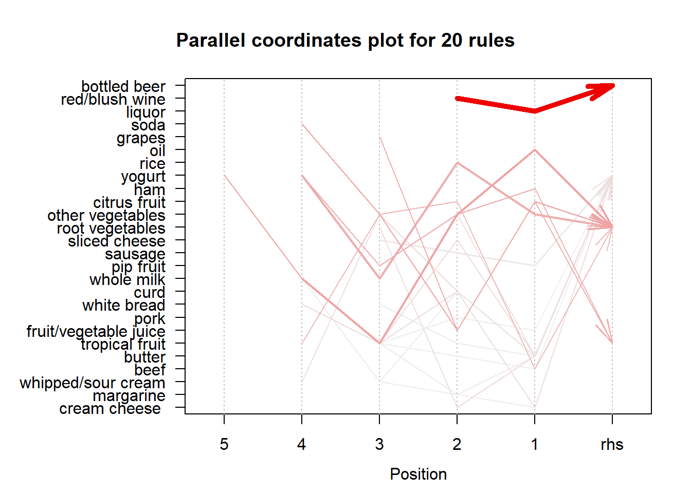

Rule Mining
================

The dataset “Groceries” contains all transactions that consists of items
bought in the store by several customers over a period of time. As
business analysts, we hope to identify trends in customer purchase
behavior by analyzing their basket data.

**Association Rule Mining**  
Association Rule Mining is used when you want to find an association
between different objects in a set, find frequent patterns in a
transaction database, relational databases or any other information
repository. The applications of Association Rule Mining are found in
Marketing, Basket Data Analysis (or Market Basket Analysis) in
retailing, clustering and classification. It can tell you what items do
customers frequently buy together by generating a set of rules called
Association Rules. In simple words, it gives you output as rules in form
of this then
that.

## Pre-processing data to make the data readable for the Association Rules Mining.

The functions in the *arules* package only accept transaction data.
Hence the flat file needs to processed to ensure that the input to the
functions is as
expected.

``` r
retail = scan('C:/Users/namit/Desktop/MSBA/Intro to Predictive Analytics/STA380-master/data/groceries.txt',what="", sep='\n')
head(retail)
```

    ## [1] "citrus fruit,semi-finished bread,margarine,ready soups"             
    ## [2] "tropical fruit,yogurt,coffee"                                       
    ## [3] "whole milk"                                                         
    ## [4] "pip fruit,yogurt,cream cheese ,meat spreads"                        
    ## [5] "other vegetables,whole milk,condensed milk,long life bakery product"
    ## [6] "whole milk,butter,yogurt,rice,abrasive cleaner"

``` r
str(retail)
```

    ##  chr [1:9835] "citrus fruit,semi-finished bread,margarine,ready soups" ...

``` r
summary(retail)
```

    ##    Length     Class      Mode 
    ##      9835 character character

``` r
groceries = strsplit(retail,",")

groctrans=as(groceries, "transactions")
summary(groctrans)
```

    ## transactions as itemMatrix in sparse format with
    ##  9835 rows (elements/itemsets/transactions) and
    ##  169 columns (items) and a density of 0.02609146 
    ## 
    ## most frequent items:
    ##       whole milk other vegetables       rolls/buns             soda 
    ##             2513             1903             1809             1715 
    ##           yogurt          (Other) 
    ##             1372            34055 
    ## 
    ## element (itemset/transaction) length distribution:
    ## sizes
    ##    1    2    3    4    5    6    7    8    9   10   11   12   13   14   15 
    ## 2159 1643 1299 1005  855  645  545  438  350  246  182  117   78   77   55 
    ##   16   17   18   19   20   21   22   23   24   26   27   28   29   32 
    ##   46   29   14   14    9   11    4    6    1    1    1    1    3    1 
    ## 
    ##    Min. 1st Qu.  Median    Mean 3rd Qu.    Max. 
    ##   1.000   2.000   3.000   4.409   6.000  32.000 
    ## 
    ## includes extended item information - examples:
    ##             labels
    ## 1 abrasive cleaner
    ## 2 artif. sweetener
    ## 3   baby cosmetics

Now we want to try to understand which items in the baskets are most
frequently purchased. For this, we plot the itemFrequencyPlot calculated
with type ‘absolute’ and ‘relative’. If absolute it will plot numeric
frequencies of each item independently. If relative it will plot how
many times these items have appeared as compared to others.

``` r
# Create an item frequency plot for the top 20 items
if (!require("RColorBrewer")) {
  # install color package of R
install.packages("RColorBrewer")
#include library RColorBrewer
library(RColorBrewer)
}
```

    ## Loading required package: RColorBrewer

``` r
itemFrequencyPlot(groctrans,topN=20,type="absolute",col=brewer.pal(8,'Pastel2'), main="Absolute Item Frequency Plot")
```

<!-- -->

``` r
itemFrequencyPlot(groctrans,topN=20,type="relative",col=brewer.pal(8,'Pastel2'),main="Relative Item Frequency Plot")
```

<!-- -->

From the graphs above, it is evident that the top 5 items being
purchased are:  
1\. whole milk  
2\. vegetables  
3\. rolls/buns  
4\. soda  
5\. yogurt

(Basic survival kit\!)

The next step is generating rules using the Apriori Algorithm\! We can
mine rules using **apriori()** function from the **arules** package.

The apriori will take ‘groctrans’ as the transaction object on which
mining is to be applied. parameter will allow you to set min\_sup and
min\_confidence. The default values for parameter are minimum support of
0.001, the minimum confidence of 0.8, maximum of 10 items (maxlen).

We arrived at these values by trial and error. While a lower confidence
value helped result in more number of mining rules, we wanted to make
sure that we are confident with the predictions we were making from the
rules.

``` r
association.rules <- apriori(groctrans, parameter = list(supp=0.001, conf=0.8,maxlen=10))
```

    ## Apriori
    ## 
    ## Parameter specification:
    ##  confidence minval smax arem  aval originalSupport maxtime support minlen
    ##         0.8    0.1    1 none FALSE            TRUE       5   0.001      1
    ##  maxlen target   ext
    ##      10  rules FALSE
    ## 
    ## Algorithmic control:
    ##  filter tree heap memopt load sort verbose
    ##     0.1 TRUE TRUE  FALSE TRUE    2    TRUE
    ## 
    ## Absolute minimum support count: 9 
    ## 
    ## set item appearances ...[0 item(s)] done [0.00s].
    ## set transactions ...[169 item(s), 9835 transaction(s)] done [0.00s].
    ## sorting and recoding items ... [157 item(s)] done [0.00s].
    ## creating transaction tree ... done [0.00s].
    ## checking subsets of size 1 2 3 4 5 6 done [0.01s].
    ## writing ... [410 rule(s)] done [0.00s].
    ## creating S4 object  ... done [0.00s].

``` r
summary(association.rules)
```

    ## set of 410 rules
    ## 
    ## rule length distribution (lhs + rhs):sizes
    ##   3   4   5   6 
    ##  29 229 140  12 
    ## 
    ##    Min. 1st Qu.  Median    Mean 3rd Qu.    Max. 
    ##   3.000   4.000   4.000   4.329   5.000   6.000 
    ## 
    ## summary of quality measures:
    ##     support           confidence          lift            count      
    ##  Min.   :0.001017   Min.   :0.8000   Min.   : 3.131   Min.   :10.00  
    ##  1st Qu.:0.001017   1st Qu.:0.8333   1st Qu.: 3.312   1st Qu.:10.00  
    ##  Median :0.001220   Median :0.8462   Median : 3.588   Median :12.00  
    ##  Mean   :0.001247   Mean   :0.8663   Mean   : 3.951   Mean   :12.27  
    ##  3rd Qu.:0.001322   3rd Qu.:0.9091   3rd Qu.: 4.341   3rd Qu.:13.00  
    ##  Max.   :0.003152   Max.   :1.0000   Max.   :11.235   Max.   :31.00  
    ## 
    ## mining info:
    ##       data ntransactions support confidence
    ##  groctrans          9835   0.001        0.8

``` r
inspect(association.rules[1:10])
```

    ##      lhs                         rhs                    support confidence      lift count
    ## [1]  {liquor,                                                                             
    ##       red/blush wine}         => {bottled beer}     0.001931876  0.9047619 11.235269    19
    ## [2]  {cereals,                                                                            
    ##       curd}                   => {whole milk}       0.001016777  0.9090909  3.557863    10
    ## [3]  {cereals,                                                                            
    ##       yogurt}                 => {whole milk}       0.001728521  0.8095238  3.168192    17
    ## [4]  {butter,                                                                             
    ##       jam}                    => {whole milk}       0.001016777  0.8333333  3.261374    10
    ## [5]  {bottled beer,                                                                       
    ##       soups}                  => {whole milk}       0.001118454  0.9166667  3.587512    11
    ## [6]  {house keeping products,                                                             
    ##       napkins}                => {whole milk}       0.001321810  0.8125000  3.179840    13
    ## [7]  {house keeping products,                                                             
    ##       whipped/sour cream}     => {whole milk}       0.001220132  0.9230769  3.612599    12
    ## [8]  {pastry,                                                                             
    ##       sweet spreads}          => {whole milk}       0.001016777  0.9090909  3.557863    10
    ## [9]  {curd,                                                                               
    ##       turkey}                 => {other vegetables} 0.001220132  0.8000000  4.134524    12
    ## [10] {rice,                                                                               
    ##       sugar}                  => {whole milk}       0.001220132  1.0000000  3.913649    12

From the above information, we can deduce that 100% of the customers who
bought Rice and sugar also bought Whole Milk.  
The confidence values of other rules in the above summary are also
pretty high (\>0.8).

You can also remove redundant rules by creating a subset of unique
rules.

``` r
# Min Support as 0.005, confidence as 0.8.
association.rules <- apriori(groctrans, parameter = list(supp=0.001, conf=0.8,maxlen=10))
```

    ## Apriori
    ## 
    ## Parameter specification:
    ##  confidence minval smax arem  aval originalSupport maxtime support minlen
    ##         0.8    0.1    1 none FALSE            TRUE       5   0.001      1
    ##  maxlen target   ext
    ##      10  rules FALSE
    ## 
    ## Algorithmic control:
    ##  filter tree heap memopt load sort verbose
    ##     0.1 TRUE TRUE  FALSE TRUE    2    TRUE
    ## 
    ## Absolute minimum support count: 9 
    ## 
    ## set item appearances ...[0 item(s)] done [0.00s].
    ## set transactions ...[169 item(s), 9835 transaction(s)] done [0.00s].
    ## sorting and recoding items ... [157 item(s)] done [0.00s].
    ## creating transaction tree ... done [0.00s].
    ## checking subsets of size 1 2 3 4 5 6 done [0.02s].
    ## writing ... [410 rule(s)] done [0.00s].
    ## creating S4 object  ... done [0.00s].

``` r
summary(association.rules)
```

    ## set of 410 rules
    ## 
    ## rule length distribution (lhs + rhs):sizes
    ##   3   4   5   6 
    ##  29 229 140  12 
    ## 
    ##    Min. 1st Qu.  Median    Mean 3rd Qu.    Max. 
    ##   3.000   4.000   4.000   4.329   5.000   6.000 
    ## 
    ## summary of quality measures:
    ##     support           confidence          lift            count      
    ##  Min.   :0.001017   Min.   :0.8000   Min.   : 3.131   Min.   :10.00  
    ##  1st Qu.:0.001017   1st Qu.:0.8333   1st Qu.: 3.312   1st Qu.:10.00  
    ##  Median :0.001220   Median :0.8462   Median : 3.588   Median :12.00  
    ##  Mean   :0.001247   Mean   :0.8663   Mean   : 3.951   Mean   :12.27  
    ##  3rd Qu.:0.001322   3rd Qu.:0.9091   3rd Qu.: 4.341   3rd Qu.:13.00  
    ##  Max.   :0.003152   Max.   :1.0000   Max.   :11.235   Max.   :31.00  
    ## 
    ## mining info:
    ##       data ntransactions support confidence
    ##  groctrans          9835   0.001        0.8

``` r
inspect(association.rules[1:10])
```

    ##      lhs                         rhs                    support confidence      lift count
    ## [1]  {liquor,                                                                             
    ##       red/blush wine}         => {bottled beer}     0.001931876  0.9047619 11.235269    19
    ## [2]  {cereals,                                                                            
    ##       curd}                   => {whole milk}       0.001016777  0.9090909  3.557863    10
    ## [3]  {cereals,                                                                            
    ##       yogurt}                 => {whole milk}       0.001728521  0.8095238  3.168192    17
    ## [4]  {butter,                                                                             
    ##       jam}                    => {whole milk}       0.001016777  0.8333333  3.261374    10
    ## [5]  {bottled beer,                                                                       
    ##       soups}                  => {whole milk}       0.001118454  0.9166667  3.587512    11
    ## [6]  {house keeping products,                                                             
    ##       napkins}                => {whole milk}       0.001321810  0.8125000  3.179840    13
    ## [7]  {house keeping products,                                                             
    ##       whipped/sour cream}     => {whole milk}       0.001220132  0.9230769  3.612599    12
    ## [8]  {pastry,                                                                             
    ##       sweet spreads}          => {whole milk}       0.001016777  0.9090909  3.557863    10
    ## [9]  {curd,                                                                               
    ##       turkey}                 => {other vegetables} 0.001220132  0.8000000  4.134524    12
    ## [10] {rice,                                                                               
    ##       sugar}                  => {whole milk}       0.001220132  1.0000000  3.913649    12

``` r
subset.rules <- which(colSums(is.subset(association.rules, association.rules)) > 1) # get subset rules in vector
length(subset.rules)  #410 ----> 91
```

    ## [1] 91

``` r
subset.association.rules. <- association.rules[-subset.rules] # remove subset rules.
```

## Finding rules related to a given item:

We can find trends in the way people shop ingredients by finding
relationships between the different association rules.

``` r
# What did people buy before buying beer?
beer.association.rules <- apriori(groctrans, parameter = list(supp=0.001, conf=0.8),appearance = list(default="lhs",rhs="bottled beer"))
```

    ## Apriori
    ## 
    ## Parameter specification:
    ##  confidence minval smax arem  aval originalSupport maxtime support minlen
    ##         0.8    0.1    1 none FALSE            TRUE       5   0.001      1
    ##  maxlen target   ext
    ##      10  rules FALSE
    ## 
    ## Algorithmic control:
    ##  filter tree heap memopt load sort verbose
    ##     0.1 TRUE TRUE  FALSE TRUE    2    TRUE
    ## 
    ## Absolute minimum support count: 9 
    ## 
    ## set item appearances ...[1 item(s)] done [0.00s].
    ## set transactions ...[169 item(s), 9835 transaction(s)] done [0.00s].
    ## sorting and recoding items ... [157 item(s)] done [0.00s].
    ## creating transaction tree ... done [0.00s].
    ## checking subsets of size 1 2 3 4 5 6 done [0.01s].
    ## writing ... [1 rule(s)] done [0.00s].
    ## creating S4 object  ... done [0.00s].

``` r
inspect(head(beer.association.rules))
```

    ##     lhs                        rhs            support     confidence
    ## [1] {liquor,red/blush wine} => {bottled beer} 0.001931876 0.9047619 
    ##     lift     count
    ## [1] 11.23527 19

``` r
# What did people buy before buying milk?
wholemilk.association.rules <- apriori(groctrans, parameter = list(supp=0.001, conf=0.6),appearance = list(default="lhs",rhs="whole milk"))
```

    ## Apriori
    ## 
    ## Parameter specification:
    ##  confidence minval smax arem  aval originalSupport maxtime support minlen
    ##         0.6    0.1    1 none FALSE            TRUE       5   0.001      1
    ##  maxlen target   ext
    ##      10  rules FALSE
    ## 
    ## Algorithmic control:
    ##  filter tree heap memopt load sort verbose
    ##     0.1 TRUE TRUE  FALSE TRUE    2    TRUE
    ## 
    ## Absolute minimum support count: 9 
    ## 
    ## set item appearances ...[1 item(s)] done [0.00s].
    ## set transactions ...[169 item(s), 9835 transaction(s)] done [0.00s].
    ## sorting and recoding items ... [157 item(s)] done [0.00s].
    ## creating transaction tree ... done [0.00s].
    ## checking subsets of size 1 2 3 4 5 6 done [0.01s].
    ## writing ... [1585 rule(s)] done [0.00s].
    ## creating S4 object  ... done [0.00s].

``` r
inspect(head(wholemilk.association.rules))
```

    ##     lhs                           rhs          support     confidence
    ## [1] {honey}                    => {whole milk} 0.001118454 0.7333333 
    ## [2] {cereals}                  => {whole milk} 0.003660397 0.6428571 
    ## [3] {rice}                     => {whole milk} 0.004677173 0.6133333 
    ## [4] {liver loaf,yogurt}        => {whole milk} 0.001016777 0.6666667 
    ## [5] {curd cheese,rolls/buns}   => {whole milk} 0.001016777 0.6250000 
    ## [6] {cleaner,other vegetables} => {whole milk} 0.001016777 0.6250000 
    ##     lift     count
    ## [1] 2.870009 11   
    ## [2] 2.515917 36   
    ## [3] 2.400371 46   
    ## [4] 2.609099 10   
    ## [5] 2.446031 10   
    ## [6] 2.446031 10

``` r
# What did people buy along with milk?
milk.association.rules <- apriori(groctrans, parameter = list(supp=0.001, conf=0.8),appearance = list(lhs="butter",default="rhs"))
```

    ## Apriori
    ## 
    ## Parameter specification:
    ##  confidence minval smax arem  aval originalSupport maxtime support minlen
    ##         0.8    0.1    1 none FALSE            TRUE       5   0.001      1
    ##  maxlen target   ext
    ##      10  rules FALSE
    ## 
    ## Algorithmic control:
    ##  filter tree heap memopt load sort verbose
    ##     0.1 TRUE TRUE  FALSE TRUE    2    TRUE
    ## 
    ## Absolute minimum support count: 9 
    ## 
    ## set item appearances ...[1 item(s)] done [0.00s].
    ## set transactions ...[169 item(s), 9835 transaction(s)] done [0.00s].
    ## sorting and recoding items ... [157 item(s)] done [0.00s].
    ## creating transaction tree ... done [0.00s].
    ## checking subsets of size 1 2 done [0.00s].
    ## writing ... [0 rule(s)] done [0.00s].
    ## creating S4 object  ... done [0.00s].

``` r
inspect(head(milk.association.rules))
```

## Visualizations

A straight-forward visualization of association rules is to use a
scatter plot using plot() of the arulesViz package. It uses Support and
Confidence on the axes. In addition, third measure Lift is used by
default to color (grey levels) of the points.

``` r
subRules<-association.rules[quality(association.rules)$confidence>0.4]
#Plot SubRules
plot(subRules)
```

    ## To reduce overplotting, jitter is added! Use jitter = 0 to prevent jitter.

<!-- -->

Rules with high lift tend to have low
    support.

``` r
plot(subRules,method="two-key plot")
```

    ## To reduce overplotting, jitter is added! Use jitter = 0 to prevent jitter.

<!-- -->

The two-key plot uses support and confidence on x and y-axis
respectively. It uses order for coloring. The order is the number of
items in the rule.

### Filtering rules with the highest lift

Here is a parallel coordinates plot for 20 rules. For example, the arrow
in red denotes that if a customer purchases red/blush wine they will
also buy bottled beer.

``` r
# Filter top 20 rules with highest lift
subRules2<-head(subRules, n=20, by="lift")
plot(subRules2, method="paracoord")
```

<!-- -->

Given below are a few interactive visualizations to see more details
between the rules and the items.

``` r
plotly_arules(subRules)
```

    ## Warning: 'plotly_arules' is deprecated.
    ## Use 'plot' instead.
    ## See help("Deprecated")

    ## To reduce overplotting, jitter is added! Use jitter = 0 to prevent jitter.

    ## PhantomJS not found. You can install it with webshot::install_phantomjs(). If it is installed, please make sure the phantomjs executable can be found via the PATH variable.

<!--html_preserve-->

<div id="htmlwidget-e56c4b4c993ca9c0bcc2" class="plotly html-widget" style="width:672px;height:480px;">

</div>

<script type="application/json" data-for="htmlwidget-e56c4b4c993ca9c0bcc2">{"x":{"visdat":{"455c6e8526cb":["function () ","plotlyVisDat"]},"cur_data":"455c6e8526cb","attrs":{"455c6e8526cb":{"x":[0.00244208840179577,0.00121888508709567,0.0012200277271573,0.00162780707704309,0.00162558679721745,0.00122172558057691,0.00121875366352351,0.00122018307338454,0.00121912834899013,0.00122016551521801,0.00121812057891309,0.0012215790196764,0.0016251191021344,0.00121920605984441,0.00122214265904953,0.0012189043120011,0.00122166388094962,0.00121984844120807,0.00121895279976647,0.00121929078991022,0.00254331346155015,0.00172965721944641,0.00172739973796871,0.00172859575106205,0.00172956975539349,0.00172897614933722,0.00132053346923395,0.00132154044218799,0.00132320826223244,0.0013200821976388,0.00132178625059238,0.00132219848964431,0.00132306067629288,0.00132359730264512,0.00132274305238536,0.00132240935221154,0.00132368121273895,0.00132077435758635,0.00132323412577568,0.00132052889610725,0.00132176689795989,0.00132185019763564,0.00132095992342148,0.00132269222066563,0.00132070051480426,0.00223632710047192,0.0018297850985097,0.00182915250880822,0.00233861192573629,0.00233779716128205,0.00142531957106049,0.00142529320415387,0.00284535176109377,0.00142197459999426,0.00142470328330078,0.00142361733218889,0.00142534677264687,0.00142375738284274,0.00142187939627427,0.00101804062539279,0.00152584226087524,0.00101520114250713,0.00101488603444482,0.00101818317439507,0.00101621272536579,0.00152650928669181,0.00101811367685466,0.00101669440038598,0.00101670491487316,0.00101781079906978,0.00101628050632205,0.00101616790011547,0.00101782898788464,0.00101768190378086,0.00101642580499185,0.00101594759701506,0.00101755066274661,0.00101676898467598,0.00101783530459925,0.0010187771840697,0.00101766941580779,0.00101651532066081,0.00101513496075778,0.00101715511223682,0.00152632349046017,0.00101688975798864,0.00101538189127107,0.00101698656109896,0.00101823342921534,0.00101537365116507,0.00101481576843507,0.0010153605346554,0.00101585867542062,0.00101544097813663,0.00152568375696654,0.00203535957454447,0.00101502490477382,0.0016285377698192,0.00162562419678117,0.00162753946562925,0.00111713603903115,0.00111876877387383,0.00111765114532942,0.00111686358970728,0.00111695600536676,0.00111833096698351,0.00111959151563266,0.00112039179278022,0.00111867860234373,0.00111885922796152,0.00112012609456034,0.00112022565106779,0.00111672105039919,0.00111982255824479,0.00111954276513078,0.00223664305058199,0.0011194134575706,0.0011166589190417,0.00111739422525546,0.00111687222017055,0.00111999248409366,0.00111918031304287,0.001118440436165,0.00111881695602381,0.0011179421494084,0.00111731398046284,0.00172770453264425,0.00172806686509458,0.00121998167684454,0.00121976228307934,0.00121906310780791,0.00121857131302988,0.00121818395175087,0.00121837233588042,0.00121847555658854,0.00121845164057528,0.00121954384315175,0.00121898485273561,0.00121912915828589,0.00122130820366689,0.00122102840528062,0.00121922082014618,0.00122113838798152,0.00121921673364237,0.00121854549594746,0.00121951789108245,0.0012220731305829,0.00122207043976814,0.0012204618565219,0.0012192544405532,0.00122134002759215,0.0013218750484838,0.00132352939381318,0.0013235082543809,0.00132195725750175,0.00132164101268672,0.00132231082893984,0.0014245652152015,0.00142281501773895,0.00142417705368034,0.00152451297910277,0.00152662472431468,0.00152579781144467,0.00152536438364481,0.00162538742124217,0.00162631319613035,0.00172739042418902,0.00182957218388057,0.00182904351006692,0.00101560781078839,0.00101559680778295,0.00101865252464439,0.0010166285657604,0.00101827078398787,0.00101503974189543,0.00101815094719478,0.00101597114683598,0.00101734136554879,0.00101598179657153,0.00101578450684932,0.00101582702104872,0.0010147659579815,0.00101635801487285,0.00101618780202941,0.00101756106332749,0.00101518341258145,0.00101669209070087,0.00101878548546659,0.0010156757239322,0.00101831146867415,0.00101496267866514,0.0010163456058925,0.00101806569978399,0.00101601212347398,0.00101767299071014,0.00101515456131929,0.00101851888385256,0.00111653449002701,0.00111646056515657,0.00111771374733027,0.00111644243305077,0.00111677867470871,0.0011181011048505,0.00111748956437432,0.00111663910926867,0.0011178727774297,0.00111682261727298,0.00111960602849831,0.00112037425349696,0.0011179930393168,0.00112030281351446,0.001218653037991,0.00122133620649531,0.00122203396422295,0.00121907114043411,0.00121817617911264,0.00122055612038681,0.00122062950949461,0.00122022169770969,0.0012199600257807,0.00122004283899254,0.00121912007384168,0.00121965937142275,0.00122039565503048,0.00122126289411424,0.00132184493057652,0.00132007585766697,0.00132055133862864,0.00142202469926159,0.00142387284416305,0.00152382559566713,0.00152485915723001,0.00121922410806243,0.00111801279643303,0.00101812371013232,0.00172673547621138,0.0010185542618545,0.00101779726496202,0.00101757708429477,0.0010179213833703,0.00111659953889812,0.00101752178490302,0.00111964307080762,0.00111822177466971,0.00142225749153626,0.00101646083320143,0.00101691589899217,0.00122179605982598,0.00101744996948738,0.00111984600437002,0.00101741335586908,0.00101761082688755,0.00122018361740125,0.00121843019842477,0.00121864786002796,0.00121894767236637,0.00122208961660709,0.00121977896379539,0.00203168150518247,0.001219560726461,0.00121896712159933,0.00121946696613818,0.00122145793432286,0.0012194239348346,0.0012189672367642,0.00203485865108319,0.00162658756932251,0.00122022771636598,0.00121937545252115,0.00172674992890173,0.00132131832541006,0.00132340404932094,0.00132036198456437,0.00132365261017148,0.00132357841149419,0.00132345959382638,0.00132103215350983,0.00132370083025542,0.00132048057504324,0.0014219528670302,0.00142492240550537,0.0014224777658645,0.00193022087816586,0.00193323460480437,0.00152445640067303,0.00101850742119603,0.00101875805794513,0.00101767441203341,0.00101815420694745,0.00101610586127515,0.00101840592778025,0.00101798560901108,0.00101547253767363,0.00101703233640649,0.00101694151810462,0.00101768740476388,0.00101576580591942,0.00101718905756014,0.00101777736378836,0.00101757300140487,0.00101537679304385,0.00101865905117628,0.00101610211782404,0.00101744098457278,0.0010175685919046,0.00101479898704841,0.00101830890630134,0.00162703678480538,0.00111740572574248,0.00111862192080996,0.00111812107155544,0.00111908173909818,0.00111679850746147,0.00111673273395557,0.00111675161744219,0.00111764385500972,0.00111939315986251,0.00111850278693708,0.00111732171421236,0.00111729104572179,0.00111707929409946,0.00112044300381039,0.00111900703355929,0.00111771823035535,0.00173009146887659,0.00173021395808862,0.00172712703091439,0.00172690142345958,0.00182911313024931,0.00121972327897906,0.00122050239357069,0.00121838368983425,0.00122097279266091,0.00122211346628107,0.00121959598203731,0.00121934777533802,0.00121966880734118,0.00132325884183073,0.00132051897140625,0.00142198857842357,0.00142166920935539,0.00142269934644898,0.00142296070551874,0.00152614048400006,0.0015245034735171,0.00152513303167168,0.00315309179189361,0.00162483374777742,0.00162728459753253,0.00193182383315542,0.00101571373564477,0.00101600908436625,0.00101829087726194,0.00101563275487895,0.00101609169535644,0.00101578715005379,0.00101482887943168,0.00101605763352127,0.00101508148962998,0.00101827468451482,0.00101771792894775,0.00101847432810945,0.00101619409987017,0.00101775257932369,0.00101805203428446,0.00111885523282918,0.00111869578605914,0.00111848457525066,0.00111703688290721,0.00111747545245092,0.00122113389776247,0.00121972532414987,0.00122075224038137,0.00131997409206318,0.00132237635176724,0.0013202908706862,0.00142240565886493,0.0014248332712915,0.00101545735110581,0.0011202508724211,0.00101494903345701,0.00101606164928739,0.00112038169997819,0.00101503974898501,0.0010180517048691,0.00121984709599917,0.00121973911555914,0.00122166146062504,0.00101841652250272,0.00101725418182133,0.00101721563380244,0.00101750738185472,0.00101543396968504,0.00111774334159313,0.00111742370127381,0.00111763562783652,0.00122076897229059,0.00122215158959255,0.00101571030543761,0.00101523440542927,0.00101775806905106,0.00101789691212889,0.00101823554634478,0.00101780242724749,0.00132084175364573,0.0013228852902827,0.0011198769411732,0.0010171336240864,0.00101542964000617,0.0019303892140872],"y":[0.799968457248036,0.800009312727958,0.799967216493911,0.800005523688322,0.799978726720162,0.799977925524975,0.799996091182864,0.800037930824548,0.79996742898543,0.799984103555456,0.800002482054928,0.799969665038471,0.80002300783142,0.800005271206025,0.800001470049409,0.799973495417433,0.799992882505447,0.799968344055678,0.800033435132748,0.79997343310216,0.806450392335012,0.809503355145124,0.809538730643401,0.809520446717813,0.809560690108544,0.809511246852978,0.812498765863991,0.812538070312412,0.812506300581996,0.812539917493498,0.812471203845562,0.812493928321507,0.812514407557693,0.812473395631694,0.812491011024765,0.812541651322244,0.812489583061964,0.812465275679453,0.812502670635171,0.812520519155188,0.812487952927089,0.812470402288342,0.812458582956479,0.812517955761257,0.812484756897723,0.814805627567912,0.818207968862728,0.818187378428529,0.821411763651114,0.821429524902992,0.823525893061815,0.823541968886997,0.823513973228223,0.823550722393751,0.823489738551424,0.823545577278045,0.82350615508586,0.823500139135112,0.823492154083772,0.833309093974912,0.833362900272203,0.833366384341327,0.833356788637393,0.833337175326347,0.833346428644671,0.833364460164198,0.833333109962666,0.833319296977263,0.833343343124708,0.83333698052327,0.833337604835523,0.833373291935903,0.833326305602274,0.833333144026891,0.83332376829327,0.833297737202008,0.833330559897769,0.833305979296244,0.833310188659571,0.833318341841448,0.833360029828886,0.833305983318398,0.833335877739345,0.833371317574152,0.833347827027317,0.833306454294768,0.833344362417317,0.83329995113814,0.833302066300746,0.833327908178935,0.833349306145939,0.833366748659474,0.833367177754769,0.833368541128666,0.833301009381992,0.833354393211082,0.833372654052492,0.842067108066366,0.84212362416683,0.842100600862649,0.84619498164948,0.846134614368992,0.846126652645989,0.846176712322871,0.846159784500344,0.846175689489406,0.846165112110833,0.846169811104814,0.846185636638776,0.846124510546264,0.846192791007771,0.846141324952752,0.846157590549186,0.846112551706276,0.846185703056957,0.846168755563377,0.846154263278296,0.846159166681311,0.846152793697081,0.846184430875308,0.84614616289973,0.846141704477968,0.846178194319831,0.846115114434323,0.846112418244495,0.846155953289707,0.849967443864065,0.849973076787953,0.857164591897312,0.857163823401668,0.857146678537994,0.857118364054411,0.857179237099152,0.857166813982954,0.8571351918878,0.857101951757109,0.857135792451693,0.857136380609581,0.857101469519626,0.857160493851711,0.85714918304116,0.857127743767139,0.857146452864067,0.85713364645516,0.857123933165801,0.857137398707542,0.857180580772972,0.857173807198551,0.857170496162413,0.857114858241561,0.857122721262659,0.866695230447622,0.866691576990494,0.866625605715919,0.866704053532253,0.866685631782073,0.866630236687492,0.875010247376692,0.874973690316323,0.875018491808336,0.882379174207637,0.882349287305246,0.882368269053366,0.882361818696313,0.888877541660237,0.888924977689364,0.894761171912561,0.899975982478232,0.89998947791984,0.90906273433002,0.909077236311395,0.909107903406367,0.909124027082695,0.909111634129728,0.909084923658601,0.909065754935306,0.909070749275066,0.909078942976504,0.909102465740685,0.90912952777436,0.909112432909197,0.909077164414299,0.909062160547408,0.909128300016845,0.909091706481757,0.909077031173677,0.909073313826641,0.909109624847239,0.90906981913172,0.909088260199739,0.909125372182531,0.909073241645996,0.909128792645549,0.909069713074155,0.909099731747792,0.90911927284426,0.909068051517193,0.916687129772735,0.91662529905186,0.916689295167783,0.916645382959386,0.916686325338508,0.916686651897478,0.916661337234645,0.916701087226604,0.916703416529176,0.916696258186646,0.916645706580133,0.916683558757395,0.916692038079471,0.916658048108142,0.923042582458449,0.923068715936653,0.923070933584519,0.923040296685497,0.923038071811074,0.923112990519918,0.923066325718911,0.923064331057794,0.92310006415358,0.923035340620692,0.923055223943394,0.923084997467941,0.923056366025263,0.923041050389949,0.928609037655553,0.928555271777062,0.928555215435829,0.9333432160353,0.933359653503986,0.93748964941183,0.937478327078308,0.999970241134239,1.00002384549446,1.00001629291798,1.00002793958448,1.00003326914261,0.999978443467189,1.00000529077422,0.999958688367268,1.00002953130408,0.999969252026825,0.999993880719586,0.999979277146391,1.00000160001457,0.999990021085245,1.00000905159496,0.999986770030552,0.999980102237754,1.00000920439594,0.999998898824585,0.999988714653084,0.799974303547239,0.800010956231373,0.800039703948226,0.800019460260277,0.79997645519413,0.799993331834412,0.79998761338342,0.799976610249101,0.799999322491541,0.800039480198314,0.800004218234421,0.800015960053936,0.799995934241565,0.79998562117342,0.799979425211707,0.799964914628002,0.799988024448872,0.809545442043384,0.812487098750656,0.812468429676953,0.812490252271043,0.812474826217329,0.812521600216606,0.81246721320668,0.812487360089221,0.812522343437465,0.812488435842327,0.823562339710687,0.823507879597537,0.82356282361455,0.826080404784128,0.826103553461797,0.833317575457594,0.833330146776814,0.83334316079026,0.833322141636765,0.833296660580928,0.833338882250186,0.833368757512162,0.83334653048247,0.833320151266408,0.833358510558837,0.833330360303624,0.833352566863699,0.833357177259321,0.833310262303626,0.833344672659549,0.833320924852101,0.833363878471406,0.833309615364711,0.83329633549769,0.833373185199508,0.833355296249035,0.833315651309058,0.833325311161142,0.842102789436006,0.846176290801384,0.84618489551938,0.84617765400638,0.846134716895831,0.846136985861985,0.846149441870232,0.846189481366377,0.846134324476565,0.84618956183717,0.846149757587076,0.846122368890247,0.846132857969773,0.846162014423568,0.846128107558756,0.846118189142514,0.846159997527746,0.850026709144602,0.84999143698929,0.849986252373569,0.849995864071244,0.857153943354552,0.857174833726285,0.857181272265397,0.857138808048154,0.857138378646976,0.857145707432436,0.857141206222312,0.857149977538826,0.857159949729305,0.866671348983616,0.866646122911965,0.874986347670818,0.875009669171363,0.87498157907553,0.875020415552436,0.882366743948041,0.882393347651148,0.882347680643221,0.885721113989669,0.888873527376455,0.888910856995341,0.904752868786229,0.909091432530285,0.909078688448347,0.909096921830173,0.909097569215905,0.909100258460376,0.909095461257326,0.909128724391284,0.909114009665039,0.909051465721703,0.909131906753326,0.909099938465074,0.909118143700915,0.909078347144497,0.909118010345607,0.909059568759442,0.916637344344505,0.916707098261505,0.91663826935728,0.916687011580726,0.916636072143689,0.923068121114082,0.923090564680622,0.923056495483274,0.928592827387807,0.928560983355335,0.928581761246066,0.933315057778884,0.933348566524923,0.999981630527614,1.00001048357558,1.00004080460209,1.00000142961913,1.00001671840768,0.999988713763636,1.00000947986019,0.999984253613886,0.800005720152128,0.800031097181494,0.833363450408684,0.833351774353338,0.833319970469749,0.833331242987665,0.833341250581079,0.846162268409271,0.846117116729387,0.846157966417842,0.857120438300336,0.857139801579478,0.90910625454864,0.909060083903975,0.909050908391795,0.909126349384053,0.833307659235988,0.833364024838775,0.866685797723137,0.866680515573696,0.846142193793233,0.909103768192801,0.909072885362261,0.904768423815581],"hoverinfo":"text","text":["[20]<BR> <B>{herbs,<BR>&nbsp;&nbsp;rolls/buns}<\/B><BR>&nbsp;&nbsp; => <B>{whole milk}<\/B> <BR><BR>support: 0.00244 <BR>confidence: 0.8 <BR>lift: 3.13","[63]<BR> <B>{butter,<BR>&nbsp;&nbsp;soft cheese,<BR>&nbsp;&nbsp;yogurt}<\/B><BR>&nbsp;&nbsp; => <B>{whole milk}<\/B> <BR><BR>support: 0.00122 <BR>confidence: 0.8 <BR>lift: 3.13","[79]<BR> <B>{frankfurter,<BR>&nbsp;&nbsp;frozen meals,<BR>&nbsp;&nbsp;other vegetables}<\/B><BR>&nbsp;&nbsp; => <B>{whole milk}<\/B> <BR><BR>support: 0.00122 <BR>confidence: 0.8 <BR>lift: 3.13","[82]<BR> <B>{frozen meals,<BR>&nbsp;&nbsp;tropical fruit,<BR>&nbsp;&nbsp;yogurt}<\/B><BR>&nbsp;&nbsp; => <B>{whole milk}<\/B> <BR><BR>support: 0.00163 <BR>confidence: 0.8 <BR>lift: 3.13","[119]<BR> <B>{curd,<BR>&nbsp;&nbsp;hamburger meat,<BR>&nbsp;&nbsp;other vegetables}<\/B><BR>&nbsp;&nbsp; => <B>{whole milk}<\/B> <BR><BR>support: 0.00163 <BR>confidence: 0.8 <BR>lift: 3.13","[120]<BR> <B>{butter,<BR>&nbsp;&nbsp;hamburger meat,<BR>&nbsp;&nbsp;whipped/sour cream}<\/B><BR>&nbsp;&nbsp; => <B>{whole milk}<\/B> <BR><BR>support: 0.00122 <BR>confidence: 0.8 <BR>lift: 3.13","[124]<BR> <B>{hygiene articles,<BR>&nbsp;&nbsp;napkins,<BR>&nbsp;&nbsp;tropical fruit}<\/B><BR>&nbsp;&nbsp; => <B>{whole milk}<\/B> <BR><BR>support: 0.00122 <BR>confidence: 0.8 <BR>lift: 3.13","[185]<BR> <B>{butter,<BR>&nbsp;&nbsp;chicken,<BR>&nbsp;&nbsp;whipped/sour cream}<\/B><BR>&nbsp;&nbsp; => <B>{whole milk}<\/B> <BR><BR>support: 0.00122 <BR>confidence: 0.8 <BR>lift: 3.13","[195]<BR> <B>{chocolate,<BR>&nbsp;&nbsp;napkins,<BR>&nbsp;&nbsp;root vegetables}<\/B><BR>&nbsp;&nbsp; => <B>{whole milk}<\/B> <BR><BR>support: 0.00122 <BR>confidence: 0.8 <BR>lift: 3.13","[211]<BR> <B>{butter,<BR>&nbsp;&nbsp;curd,<BR>&nbsp;&nbsp;pip fruit}<\/B><BR>&nbsp;&nbsp; => <B>{whole milk}<\/B> <BR><BR>support: 0.00122 <BR>confidence: 0.8 <BR>lift: 3.13","[215]<BR> <B>{bottled beer,<BR>&nbsp;&nbsp;napkins,<BR>&nbsp;&nbsp;rolls/buns}<\/B><BR>&nbsp;&nbsp; => <B>{whole milk}<\/B> <BR><BR>support: 0.00122 <BR>confidence: 0.8 <BR>lift: 3.13","[234]<BR> <B>{domestic eggs,<BR>&nbsp;&nbsp;margarine,<BR>&nbsp;&nbsp;whipped/sour cream}<\/B><BR>&nbsp;&nbsp; => <B>{whole milk}<\/B> <BR><BR>support: 0.00122 <BR>confidence: 0.8 <BR>lift: 3.13","[245]<BR> <B>{butter,<BR>&nbsp;&nbsp;citrus fruit,<BR>&nbsp;&nbsp;tropical fruit}<\/B><BR>&nbsp;&nbsp; => <B>{whole milk}<\/B> <BR><BR>support: 0.00163 <BR>confidence: 0.8 <BR>lift: 3.13","[254]<BR> <B>{pip fruit,<BR>&nbsp;&nbsp;sausage,<BR>&nbsp;&nbsp;whipped/sour cream}<\/B><BR>&nbsp;&nbsp; => <B>{whole milk}<\/B> <BR><BR>support: 0.00122 <BR>confidence: 0.8 <BR>lift: 3.13","[294]<BR> <B>{chicken,<BR>&nbsp;&nbsp;domestic eggs,<BR>&nbsp;&nbsp;other vegetables,<BR>&nbsp;&nbsp;root vegetables}<\/B><BR>&nbsp;&nbsp; => <B>{whole milk}<\/B> <BR><BR>support: 0.00122 <BR>confidence: 0.8 <BR>lift: 3.13","[317]<BR> <B>{butter,<BR>&nbsp;&nbsp;curd,<BR>&nbsp;&nbsp;tropical fruit,<BR>&nbsp;&nbsp;yogurt}<\/B><BR>&nbsp;&nbsp; => <B>{whole milk}<\/B> <BR><BR>support: 0.00122 <BR>confidence: 0.8 <BR>lift: 3.13","[349]<BR> <B>{butter,<BR>&nbsp;&nbsp;tropical fruit,<BR>&nbsp;&nbsp;whipped/sour cream,<BR>&nbsp;&nbsp;yogurt}<\/B><BR>&nbsp;&nbsp; => <B>{whole milk}<\/B> <BR><BR>support: 0.00122 <BR>confidence: 0.8 <BR>lift: 3.13","[352]<BR> <B>{butter,<BR>&nbsp;&nbsp;other vegetables,<BR>&nbsp;&nbsp;rolls/buns,<BR>&nbsp;&nbsp;whipped/sour cream}<\/B><BR>&nbsp;&nbsp; => <B>{whole milk}<\/B> <BR><BR>support: 0.00122 <BR>confidence: 0.8 <BR>lift: 3.13","[381]<BR> <B>{citrus fruit,<BR>&nbsp;&nbsp;other vegetables,<BR>&nbsp;&nbsp;sausage,<BR>&nbsp;&nbsp;whipped/sour cream}<\/B><BR>&nbsp;&nbsp; => <B>{whole milk}<\/B> <BR><BR>support: 0.00122 <BR>confidence: 0.8 <BR>lift: 3.13","[384]<BR> <B>{citrus fruit,<BR>&nbsp;&nbsp;tropical fruit,<BR>&nbsp;&nbsp;whipped/sour cream,<BR>&nbsp;&nbsp;yogurt}<\/B><BR>&nbsp;&nbsp; => <B>{whole milk}<\/B> <BR><BR>support: 0.00122 <BR>confidence: 0.8 <BR>lift: 3.13","[28]<BR> <B>{curd,<BR>&nbsp;&nbsp;hamburger meat}<\/B><BR>&nbsp;&nbsp; => <B>{whole milk}<\/B> <BR><BR>support: 0.00254 <BR>confidence: 0.806 <BR>lift: 3.16","[3]<BR> <B>{cereals,<BR>&nbsp;&nbsp;yogurt}<\/B><BR>&nbsp;&nbsp; => <B>{whole milk}<\/B> <BR><BR>support: 0.00173 <BR>confidence: 0.81 <BR>lift: 3.17","[29]<BR> <B>{bottled beer,<BR>&nbsp;&nbsp;hamburger meat}<\/B><BR>&nbsp;&nbsp; => <B>{whole milk}<\/B> <BR><BR>support: 0.00173 <BR>confidence: 0.81 <BR>lift: 3.17","[156]<BR> <B>{rolls/buns,<BR>&nbsp;&nbsp;waffles,<BR>&nbsp;&nbsp;whipped/sour cream}<\/B><BR>&nbsp;&nbsp; => <B>{whole milk}<\/B> <BR><BR>support: 0.00173 <BR>confidence: 0.81 <BR>lift: 3.17","[164]<BR> <B>{long life bakery product,<BR>&nbsp;&nbsp;whipped/sour cream,<BR>&nbsp;&nbsp;yogurt}<\/B><BR>&nbsp;&nbsp; => <B>{whole milk}<\/B> <BR><BR>support: 0.00173 <BR>confidence: 0.81 <BR>lift: 3.17","[244]<BR> <B>{butter,<BR>&nbsp;&nbsp;pip fruit,<BR>&nbsp;&nbsp;root vegetables}<\/B><BR>&nbsp;&nbsp; => <B>{whole milk}<\/B> <BR><BR>support: 0.00173 <BR>confidence: 0.81 <BR>lift: 3.17","[6]<BR> <B>{house keeping products,<BR>&nbsp;&nbsp;napkins}<\/B><BR>&nbsp;&nbsp; => <B>{whole milk}<\/B> <BR><BR>support: 0.00132 <BR>confidence: 0.812 <BR>lift: 3.18","[30]<BR> <B>{other vegetables,<BR>&nbsp;&nbsp;specialty cheese,<BR>&nbsp;&nbsp;yogurt}<\/B><BR>&nbsp;&nbsp; => <B>{whole milk}<\/B> <BR><BR>support: 0.00132 <BR>confidence: 0.812 <BR>lift: 3.18","[50]<BR> <B>{citrus fruit,<BR>&nbsp;&nbsp;herbs,<BR>&nbsp;&nbsp;root vegetables}<\/B><BR>&nbsp;&nbsp; => <B>{whole milk}<\/B> <BR><BR>support: 0.00132 <BR>confidence: 0.812 <BR>lift: 3.18","[54]<BR> <B>{herbs,<BR>&nbsp;&nbsp;other vegetables,<BR>&nbsp;&nbsp;tropical fruit}<\/B><BR>&nbsp;&nbsp; => <B>{whole milk}<\/B> <BR><BR>support: 0.00132 <BR>confidence: 0.812 <BR>lift: 3.18","[83]<BR> <B>{butter,<BR>&nbsp;&nbsp;hard cheese,<BR>&nbsp;&nbsp;yogurt}<\/B><BR>&nbsp;&nbsp; => <B>{whole milk}<\/B> <BR><BR>support: 0.00132 <BR>confidence: 0.812 <BR>lift: 3.18","[87]<BR> <B>{butter milk,<BR>&nbsp;&nbsp;dessert,<BR>&nbsp;&nbsp;yogurt}<\/B><BR>&nbsp;&nbsp; => <B>{whole milk}<\/B> <BR><BR>support: 0.00132 <BR>confidence: 0.812 <BR>lift: 3.18","[114]<BR> <B>{butter,<BR>&nbsp;&nbsp;onions,<BR>&nbsp;&nbsp;yogurt}<\/B><BR>&nbsp;&nbsp; => <B>{whole milk}<\/B> <BR><BR>support: 0.00132 <BR>confidence: 0.812 <BR>lift: 3.18","[134]<BR> <B>{hygiene articles,<BR>&nbsp;&nbsp;pip fruit,<BR>&nbsp;&nbsp;sausage}<\/B><BR>&nbsp;&nbsp; => <B>{whole milk}<\/B> <BR><BR>support: 0.00132 <BR>confidence: 0.812 <BR>lift: 3.18","[154]<BR> <B>{bottled water,<BR>&nbsp;&nbsp;other vegetables,<BR>&nbsp;&nbsp;sugar}<\/B><BR>&nbsp;&nbsp; => <B>{whole milk}<\/B> <BR><BR>support: 0.00132 <BR>confidence: 0.812 <BR>lift: 3.18","[179]<BR> <B>{cream cheese ,<BR>&nbsp;&nbsp;domestic eggs,<BR>&nbsp;&nbsp;yogurt}<\/B><BR>&nbsp;&nbsp; => <B>{whole milk}<\/B> <BR><BR>support: 0.00132 <BR>confidence: 0.812 <BR>lift: 3.18","[194]<BR> <B>{root vegetables,<BR>&nbsp;&nbsp;whipped/sour cream,<BR>&nbsp;&nbsp;white bread}<\/B><BR>&nbsp;&nbsp; => <B>{whole milk}<\/B> <BR><BR>support: 0.00132 <BR>confidence: 0.812 <BR>lift: 3.18","[201]<BR> <B>{frozen vegetables,<BR>&nbsp;&nbsp;napkins,<BR>&nbsp;&nbsp;other vegetables}<\/B><BR>&nbsp;&nbsp; => <B>{whole milk}<\/B> <BR><BR>support: 0.00132 <BR>confidence: 0.812 <BR>lift: 3.18","[207]<BR> <B>{beef,<BR>&nbsp;&nbsp;tropical fruit,<BR>&nbsp;&nbsp;whipped/sour cream}<\/B><BR>&nbsp;&nbsp; => <B>{whole milk}<\/B> <BR><BR>support: 0.00132 <BR>confidence: 0.812 <BR>lift: 3.18","[208]<BR> <B>{curd,<BR>&nbsp;&nbsp;margarine,<BR>&nbsp;&nbsp;rolls/buns}<\/B><BR>&nbsp;&nbsp; => <B>{whole milk}<\/B> <BR><BR>support: 0.00132 <BR>confidence: 0.812 <BR>lift: 3.18","[219]<BR> <B>{domestic eggs,<BR>&nbsp;&nbsp;napkins,<BR>&nbsp;&nbsp;tropical fruit}<\/B><BR>&nbsp;&nbsp; => <B>{whole milk}<\/B> <BR><BR>support: 0.00132 <BR>confidence: 0.812 <BR>lift: 3.18","[243]<BR> <B>{bottled water,<BR>&nbsp;&nbsp;butter,<BR>&nbsp;&nbsp;pip fruit}<\/B><BR>&nbsp;&nbsp; => <B>{whole milk}<\/B> <BR><BR>support: 0.00132 <BR>confidence: 0.812 <BR>lift: 3.18","[250]<BR> <B>{domestic eggs,<BR>&nbsp;&nbsp;pastry,<BR>&nbsp;&nbsp;tropical fruit}<\/B><BR>&nbsp;&nbsp; => <B>{whole milk}<\/B> <BR><BR>support: 0.00132 <BR>confidence: 0.812 <BR>lift: 3.18","[304]<BR> <B>{frozen vegetables,<BR>&nbsp;&nbsp;other vegetables,<BR>&nbsp;&nbsp;root vegetables,<BR>&nbsp;&nbsp;whipped/sour cream}<\/B><BR>&nbsp;&nbsp; => <B>{whole milk}<\/B> <BR><BR>support: 0.00132 <BR>confidence: 0.812 <BR>lift: 3.18","[388]<BR> <B>{other vegetables,<BR>&nbsp;&nbsp;pip fruit,<BR>&nbsp;&nbsp;root vegetables,<BR>&nbsp;&nbsp;soda}<\/B><BR>&nbsp;&nbsp; => <B>{whole milk}<\/B> <BR><BR>support: 0.00132 <BR>confidence: 0.812 <BR>lift: 3.18","[398]<BR> <B>{rolls/buns,<BR>&nbsp;&nbsp;root vegetables,<BR>&nbsp;&nbsp;tropical fruit,<BR>&nbsp;&nbsp;yogurt}<\/B><BR>&nbsp;&nbsp; => <B>{whole milk}<\/B> <BR><BR>support: 0.00224 <BR>confidence: 0.815 <BR>lift: 3.19","[37]<BR> <B>{other vegetables,<BR>&nbsp;&nbsp;rice,<BR>&nbsp;&nbsp;root vegetables}<\/B><BR>&nbsp;&nbsp; => <B>{whole milk}<\/B> <BR><BR>support: 0.00183 <BR>confidence: 0.818 <BR>lift: 3.2","[214]<BR> <B>{curd,<BR>&nbsp;&nbsp;pip fruit,<BR>&nbsp;&nbsp;whipped/sour cream}<\/B><BR>&nbsp;&nbsp; => <B>{whole milk}<\/B> <BR><BR>support: 0.00183 <BR>confidence: 0.818 <BR>lift: 3.2","[19]<BR> <B>{herbs,<BR>&nbsp;&nbsp;tropical fruit}<\/B><BR>&nbsp;&nbsp; => <B>{whole milk}<\/B> <BR><BR>support: 0.00234 <BR>confidence: 0.821 <BR>lift: 3.21","[394]<BR> <B>{citrus fruit,<BR>&nbsp;&nbsp;other vegetables,<BR>&nbsp;&nbsp;root vegetables,<BR>&nbsp;&nbsp;yogurt}<\/B><BR>&nbsp;&nbsp; => <B>{whole milk}<\/B> <BR><BR>support: 0.00234 <BR>confidence: 0.821 <BR>lift: 3.21","[86]<BR> <B>{hard cheese,<BR>&nbsp;&nbsp;tropical fruit,<BR>&nbsp;&nbsp;yogurt}<\/B><BR>&nbsp;&nbsp; => <B>{whole milk}<\/B> <BR><BR>support: 0.00142 <BR>confidence: 0.824 <BR>lift: 3.22","[130]<BR> <B>{butter,<BR>&nbsp;&nbsp;hygiene articles,<BR>&nbsp;&nbsp;root vegetables}<\/B><BR>&nbsp;&nbsp; => <B>{whole milk}<\/B> <BR><BR>support: 0.00142 <BR>confidence: 0.824 <BR>lift: 3.22","[213]<BR> <B>{curd,<BR>&nbsp;&nbsp;domestic eggs,<BR>&nbsp;&nbsp;other vegetables}<\/B><BR>&nbsp;&nbsp; => <B>{whole milk}<\/B> <BR><BR>support: 0.00285 <BR>confidence: 0.824 <BR>lift: 3.22","[216]<BR> <B>{butter,<BR>&nbsp;&nbsp;napkins,<BR>&nbsp;&nbsp;whipped/sour cream}<\/B><BR>&nbsp;&nbsp; => <B>{whole milk}<\/B> <BR><BR>support: 0.00142 <BR>confidence: 0.824 <BR>lift: 3.22","[222]<BR> <B>{butter,<BR>&nbsp;&nbsp;pork,<BR>&nbsp;&nbsp;yogurt}<\/B><BR>&nbsp;&nbsp; => <B>{whole milk}<\/B> <BR><BR>support: 0.00142 <BR>confidence: 0.824 <BR>lift: 3.22","[249]<BR> <B>{domestic eggs,<BR>&nbsp;&nbsp;pip fruit,<BR>&nbsp;&nbsp;sausage}<\/B><BR>&nbsp;&nbsp; => <B>{whole milk}<\/B> <BR><BR>support: 0.00142 <BR>confidence: 0.824 <BR>lift: 3.22","[313]<BR> <B>{beef,<BR>&nbsp;&nbsp;rolls/buns,<BR>&nbsp;&nbsp;root vegetables,<BR>&nbsp;&nbsp;tropical fruit}<\/B><BR>&nbsp;&nbsp; => <B>{whole milk}<\/B> <BR><BR>support: 0.00142 <BR>confidence: 0.824 <BR>lift: 3.22","[331]<BR> <B>{frankfurter,<BR>&nbsp;&nbsp;other vegetables,<BR>&nbsp;&nbsp;tropical fruit,<BR>&nbsp;&nbsp;yogurt}<\/B><BR>&nbsp;&nbsp; => <B>{whole milk}<\/B> <BR><BR>support: 0.00142 <BR>confidence: 0.824 <BR>lift: 3.22","[409]<BR> <B>{citrus fruit,<BR>&nbsp;&nbsp;other vegetables,<BR>&nbsp;&nbsp;root vegetables,<BR>&nbsp;&nbsp;tropical fruit,<BR>&nbsp;&nbsp;yogurt}<\/B><BR>&nbsp;&nbsp; => <B>{whole milk}<\/B> <BR><BR>support: 0.00142 <BR>confidence: 0.824 <BR>lift: 3.22","[4]<BR> <B>{butter,<BR>&nbsp;&nbsp;jam}<\/B><BR>&nbsp;&nbsp; => <B>{whole milk}<\/B> <BR><BR>support: 0.00102 <BR>confidence: 0.833 <BR>lift: 3.26","[11]<BR> <B>{butter,<BR>&nbsp;&nbsp;rice}<\/B><BR>&nbsp;&nbsp; => <B>{whole milk}<\/B> <BR><BR>support: 0.00153 <BR>confidence: 0.833 <BR>lift: 3.26","[34]<BR> <B>{other vegetables,<BR>&nbsp;&nbsp;rice,<BR>&nbsp;&nbsp;tropical fruit}<\/B><BR>&nbsp;&nbsp; => <B>{whole milk}<\/B> <BR><BR>support: 0.00102 <BR>confidence: 0.833 <BR>lift: 3.26","[44]<BR> <B>{domestic eggs,<BR>&nbsp;&nbsp;herbs,<BR>&nbsp;&nbsp;other vegetables}<\/B><BR>&nbsp;&nbsp; => <B>{whole milk}<\/B> <BR><BR>support: 0.00102 <BR>confidence: 0.833 <BR>lift: 3.26","[45]<BR> <B>{fruit/vegetable juice,<BR>&nbsp;&nbsp;herbs,<BR>&nbsp;&nbsp;other vegetables}<\/B><BR>&nbsp;&nbsp; => <B>{whole milk}<\/B> <BR><BR>support: 0.00102 <BR>confidence: 0.833 <BR>lift: 3.26","[53]<BR> <B>{herbs,<BR>&nbsp;&nbsp;tropical fruit,<BR>&nbsp;&nbsp;yogurt}<\/B><BR>&nbsp;&nbsp; => <B>{whole milk}<\/B> <BR><BR>support: 0.00102 <BR>confidence: 0.833 <BR>lift: 3.26","[55]<BR> <B>{herbs,<BR>&nbsp;&nbsp;rolls/buns,<BR>&nbsp;&nbsp;root vegetables}<\/B><BR>&nbsp;&nbsp; => <B>{whole milk}<\/B> <BR><BR>support: 0.00153 <BR>confidence: 0.833 <BR>lift: 3.26","[57]<BR> <B>{detergent,<BR>&nbsp;&nbsp;other vegetables,<BR>&nbsp;&nbsp;whipped/sour cream}<\/B><BR>&nbsp;&nbsp; => <B>{whole milk}<\/B> <BR><BR>support: 0.00102 <BR>confidence: 0.833 <BR>lift: 3.26","[65]<BR> <B>{domestic eggs,<BR>&nbsp;&nbsp;root vegetables,<BR>&nbsp;&nbsp;soft cheese}<\/B><BR>&nbsp;&nbsp; => <B>{whole milk}<\/B> <BR><BR>support: 0.00102 <BR>confidence: 0.833 <BR>lift: 3.26","[98]<BR> <B>{frankfurter,<BR>&nbsp;&nbsp;sliced cheese,<BR>&nbsp;&nbsp;yogurt}<\/B><BR>&nbsp;&nbsp; => <B>{whole milk}<\/B> <BR><BR>support: 0.00102 <BR>confidence: 0.833 <BR>lift: 3.26","[104]<BR> <B>{oil,<BR>&nbsp;&nbsp;root vegetables,<BR>&nbsp;&nbsp;shopping bags}<\/B><BR>&nbsp;&nbsp; => <B>{whole milk}<\/B> <BR><BR>support: 0.00102 <BR>confidence: 0.833 <BR>lift: 3.26","[111]<BR> <B>{bottled water,<BR>&nbsp;&nbsp;butter,<BR>&nbsp;&nbsp;onions}<\/B><BR>&nbsp;&nbsp; => <B>{whole milk}<\/B> <BR><BR>support: 0.00102 <BR>confidence: 0.833 <BR>lift: 3.26","[117]<BR> <B>{berries,<BR>&nbsp;&nbsp;butter,<BR>&nbsp;&nbsp;whipped/sour cream}<\/B><BR>&nbsp;&nbsp; => <B>{whole milk}<\/B> <BR><BR>support: 0.00102 <BR>confidence: 0.833 <BR>lift: 3.26","[122]<BR> <B>{hamburger meat,<BR>&nbsp;&nbsp;root vegetables,<BR>&nbsp;&nbsp;whipped/sour cream}<\/B><BR>&nbsp;&nbsp; => <B>{whole milk}<\/B> <BR><BR>support: 0.00102 <BR>confidence: 0.833 <BR>lift: 3.26","[125]<BR> <B>{hygiene articles,<BR>&nbsp;&nbsp;margarine,<BR>&nbsp;&nbsp;rolls/buns}<\/B><BR>&nbsp;&nbsp; => <B>{whole milk}<\/B> <BR><BR>support: 0.00102 <BR>confidence: 0.833 <BR>lift: 3.26","[127]<BR> <B>{butter,<BR>&nbsp;&nbsp;citrus fruit,<BR>&nbsp;&nbsp;hygiene articles}<\/B><BR>&nbsp;&nbsp; => <B>{whole milk}<\/B> <BR><BR>support: 0.00102 <BR>confidence: 0.833 <BR>lift: 3.26","[132]<BR> <B>{hygiene articles,<BR>&nbsp;&nbsp;tropical fruit,<BR>&nbsp;&nbsp;whipped/sour cream}<\/B><BR>&nbsp;&nbsp; => <B>{whole milk}<\/B> <BR><BR>support: 0.00102 <BR>confidence: 0.833 <BR>lift: 3.26","[138]<BR> <B>{long life bakery product,<BR>&nbsp;&nbsp;other vegetables,<BR>&nbsp;&nbsp;salty snack}<\/B><BR>&nbsp;&nbsp; => <B>{whole milk}<\/B> <BR><BR>support: 0.00102 <BR>confidence: 0.833 <BR>lift: 3.26","[148]<BR> <B>{butter,<BR>&nbsp;&nbsp;sugar,<BR>&nbsp;&nbsp;whipped/sour cream}<\/B><BR>&nbsp;&nbsp; => <B>{whole milk}<\/B> <BR><BR>support: 0.00102 <BR>confidence: 0.833 <BR>lift: 3.26","[163]<BR> <B>{long life bakery product,<BR>&nbsp;&nbsp;sausage,<BR>&nbsp;&nbsp;whipped/sour cream}<\/B><BR>&nbsp;&nbsp; => <B>{whole milk}<\/B> <BR><BR>support: 0.00102 <BR>confidence: 0.833 <BR>lift: 3.26","[170]<BR> <B>{cream cheese ,<BR>&nbsp;&nbsp;pork,<BR>&nbsp;&nbsp;yogurt}<\/B><BR>&nbsp;&nbsp; => <B>{whole milk}<\/B> <BR><BR>support: 0.00102 <BR>confidence: 0.833 <BR>lift: 3.26","[171]<BR> <B>{cream cheese ,<BR>&nbsp;&nbsp;frankfurter,<BR>&nbsp;&nbsp;yogurt}<\/B><BR>&nbsp;&nbsp; => <B>{whole milk}<\/B> <BR><BR>support: 0.00102 <BR>confidence: 0.833 <BR>lift: 3.26","[196]<BR> <B>{chocolate,<BR>&nbsp;&nbsp;domestic eggs,<BR>&nbsp;&nbsp;sausage}<\/B><BR>&nbsp;&nbsp; => <B>{whole milk}<\/B> <BR><BR>support: 0.00102 <BR>confidence: 0.833 <BR>lift: 3.26","[197]<BR> <B>{bottled beer,<BR>&nbsp;&nbsp;coffee,<BR>&nbsp;&nbsp;yogurt}<\/B><BR>&nbsp;&nbsp; => <B>{whole milk}<\/B> <BR><BR>support: 0.00102 <BR>confidence: 0.833 <BR>lift: 3.26","[204]<BR> <B>{beef,<BR>&nbsp;&nbsp;butter,<BR>&nbsp;&nbsp;curd}<\/B><BR>&nbsp;&nbsp; => <B>{whole milk}<\/B> <BR><BR>support: 0.00102 <BR>confidence: 0.833 <BR>lift: 3.26","[227]<BR> <B>{brown bread,<BR>&nbsp;&nbsp;domestic eggs,<BR>&nbsp;&nbsp;root vegetables}<\/B><BR>&nbsp;&nbsp; => <B>{whole milk}<\/B> <BR><BR>support: 0.00153 <BR>confidence: 0.833 <BR>lift: 3.26","[235]<BR> <B>{bottled water,<BR>&nbsp;&nbsp;margarine,<BR>&nbsp;&nbsp;whipped/sour cream}<\/B><BR>&nbsp;&nbsp; => <B>{whole milk}<\/B> <BR><BR>support: 0.00102 <BR>confidence: 0.833 <BR>lift: 3.26","[263]<BR> <B>{herbs,<BR>&nbsp;&nbsp;other vegetables,<BR>&nbsp;&nbsp;rolls/buns,<BR>&nbsp;&nbsp;root vegetables}<\/B><BR>&nbsp;&nbsp; => <B>{whole milk}<\/B> <BR><BR>support: 0.00102 <BR>confidence: 0.833 <BR>lift: 3.26","[268]<BR> <B>{butter milk,<BR>&nbsp;&nbsp;other vegetables,<BR>&nbsp;&nbsp;root vegetables,<BR>&nbsp;&nbsp;yogurt}<\/B><BR>&nbsp;&nbsp; => <B>{whole milk}<\/B> <BR><BR>support: 0.00102 <BR>confidence: 0.833 <BR>lift: 3.26","[274]<BR> <B>{root vegetables,<BR>&nbsp;&nbsp;sliced cheese,<BR>&nbsp;&nbsp;tropical fruit,<BR>&nbsp;&nbsp;yogurt}<\/B><BR>&nbsp;&nbsp; => <B>{whole milk}<\/B> <BR><BR>support: 0.00102 <BR>confidence: 0.833 <BR>lift: 3.26","[301]<BR> <B>{pip fruit,<BR>&nbsp;&nbsp;root vegetables,<BR>&nbsp;&nbsp;white bread,<BR>&nbsp;&nbsp;yogurt}<\/B><BR>&nbsp;&nbsp; => <B>{whole milk}<\/B> <BR><BR>support: 0.00102 <BR>confidence: 0.833 <BR>lift: 3.26","[302]<BR> <B>{citrus fruit,<BR>&nbsp;&nbsp;frozen vegetables,<BR>&nbsp;&nbsp;fruit/vegetable juice,<BR>&nbsp;&nbsp;other vegetables}<\/B><BR>&nbsp;&nbsp; => <B>{whole milk}<\/B> <BR><BR>support: 0.00102 <BR>confidence: 0.833 <BR>lift: 3.26","[307]<BR> <B>{bottled water,<BR>&nbsp;&nbsp;frozen vegetables,<BR>&nbsp;&nbsp;other vegetables,<BR>&nbsp;&nbsp;root vegetables}<\/B><BR>&nbsp;&nbsp; => <B>{whole milk}<\/B> <BR><BR>support: 0.00102 <BR>confidence: 0.833 <BR>lift: 3.26","[321]<BR> <B>{curd,<BR>&nbsp;&nbsp;other vegetables,<BR>&nbsp;&nbsp;pip fruit,<BR>&nbsp;&nbsp;whipped/sour cream}<\/B><BR>&nbsp;&nbsp; => <B>{whole milk}<\/B> <BR><BR>support: 0.00102 <BR>confidence: 0.833 <BR>lift: 3.26","[328]<BR> <B>{frankfurter,<BR>&nbsp;&nbsp;other vegetables,<BR>&nbsp;&nbsp;pip fruit,<BR>&nbsp;&nbsp;root vegetables}<\/B><BR>&nbsp;&nbsp; => <B>{whole milk}<\/B> <BR><BR>support: 0.00102 <BR>confidence: 0.833 <BR>lift: 3.26","[367]<BR> <B>{domestic eggs,<BR>&nbsp;&nbsp;root vegetables,<BR>&nbsp;&nbsp;tropical fruit,<BR>&nbsp;&nbsp;yogurt}<\/B><BR>&nbsp;&nbsp; => <B>{whole milk}<\/B> <BR><BR>support: 0.00153 <BR>confidence: 0.833 <BR>lift: 3.26","[376]<BR> <B>{fruit/vegetable juice,<BR>&nbsp;&nbsp;other vegetables,<BR>&nbsp;&nbsp;root vegetables,<BR>&nbsp;&nbsp;yogurt}<\/B><BR>&nbsp;&nbsp; => <B>{whole milk}<\/B> <BR><BR>support: 0.00203 <BR>confidence: 0.833 <BR>lift: 3.26","[406]<BR> <B>{citrus fruit,<BR>&nbsp;&nbsp;other vegetables,<BR>&nbsp;&nbsp;root vegetables,<BR>&nbsp;&nbsp;whipped/sour cream,<BR>&nbsp;&nbsp;yogurt}<\/B><BR>&nbsp;&nbsp; => <B>{whole milk}<\/B> <BR><BR>support: 0.00102 <BR>confidence: 0.833 <BR>lift: 3.26","[157]<BR> <B>{rolls/buns,<BR>&nbsp;&nbsp;root vegetables,<BR>&nbsp;&nbsp;waffles}<\/B><BR>&nbsp;&nbsp; => <B>{whole milk}<\/B> <BR><BR>support: 0.00163 <BR>confidence: 0.842 <BR>lift: 3.3","[203]<BR> <B>{citrus fruit,<BR>&nbsp;&nbsp;frozen vegetables,<BR>&nbsp;&nbsp;fruit/vegetable juice}<\/B><BR>&nbsp;&nbsp; => <B>{whole milk}<\/B> <BR><BR>support: 0.00163 <BR>confidence: 0.842 <BR>lift: 3.3","[237]<BR> <B>{butter,<BR>&nbsp;&nbsp;domestic eggs,<BR>&nbsp;&nbsp;whipped/sour cream}<\/B><BR>&nbsp;&nbsp; => <B>{whole milk}<\/B> <BR><BR>support: 0.00163 <BR>confidence: 0.842 <BR>lift: 3.3","[12]<BR> <B>{domestic eggs,<BR>&nbsp;&nbsp;rice}<\/B><BR>&nbsp;&nbsp; => <B>{whole milk}<\/B> <BR><BR>support: 0.00112 <BR>confidence: 0.846 <BR>lift: 3.31","[58]<BR> <B>{baking powder,<BR>&nbsp;&nbsp;tropical fruit,<BR>&nbsp;&nbsp;yogurt}<\/B><BR>&nbsp;&nbsp; => <B>{whole milk}<\/B> <BR><BR>support: 0.00112 <BR>confidence: 0.846 <BR>lift: 3.31","[76]<BR> <B>{curd,<BR>&nbsp;&nbsp;frozen meals,<BR>&nbsp;&nbsp;yogurt}<\/B><BR>&nbsp;&nbsp; => <B>{whole milk}<\/B> <BR><BR>support: 0.00112 <BR>confidence: 0.846 <BR>lift: 3.31","[81]<BR> <B>{frozen meals,<BR>&nbsp;&nbsp;root vegetables,<BR>&nbsp;&nbsp;tropical fruit}<\/B><BR>&nbsp;&nbsp; => <B>{whole milk}<\/B> <BR><BR>support: 0.00112 <BR>confidence: 0.846 <BR>lift: 3.31","[92]<BR> <B>{butter milk,<BR>&nbsp;&nbsp;sausage,<BR>&nbsp;&nbsp;yogurt}<\/B><BR>&nbsp;&nbsp; => <B>{whole milk}<\/B> <BR><BR>support: 0.00112 <BR>confidence: 0.846 <BR>lift: 3.31","[107]<BR> <B>{curd,<BR>&nbsp;&nbsp;onions,<BR>&nbsp;&nbsp;yogurt}<\/B><BR>&nbsp;&nbsp; => <B>{whole milk}<\/B> <BR><BR>support: 0.00112 <BR>confidence: 0.846 <BR>lift: 3.31","[110]<BR> <B>{butter,<BR>&nbsp;&nbsp;domestic eggs,<BR>&nbsp;&nbsp;onions}<\/B><BR>&nbsp;&nbsp; => <B>{whole milk}<\/B> <BR><BR>support: 0.00112 <BR>confidence: 0.846 <BR>lift: 3.31","[140]<BR> <B>{pip fruit,<BR>&nbsp;&nbsp;salty snack,<BR>&nbsp;&nbsp;yogurt}<\/B><BR>&nbsp;&nbsp; => <B>{whole milk}<\/B> <BR><BR>support: 0.00112 <BR>confidence: 0.846 <BR>lift: 3.31","[152]<BR> <B>{citrus fruit,<BR>&nbsp;&nbsp;sugar,<BR>&nbsp;&nbsp;whipped/sour cream}<\/B><BR>&nbsp;&nbsp; => <B>{whole milk}<\/B> <BR><BR>support: 0.00112 <BR>confidence: 0.846 <BR>lift: 3.31","[173]<BR> <B>{butter,<BR>&nbsp;&nbsp;cream cheese ,<BR>&nbsp;&nbsp;whipped/sour cream}<\/B><BR>&nbsp;&nbsp; => <B>{whole milk}<\/B> <BR><BR>support: 0.00112 <BR>confidence: 0.846 <BR>lift: 3.31","[177]<BR> <B>{cream cheese ,<BR>&nbsp;&nbsp;domestic eggs,<BR>&nbsp;&nbsp;pip fruit}<\/B><BR>&nbsp;&nbsp; => <B>{whole milk}<\/B> <BR><BR>support: 0.00112 <BR>confidence: 0.846 <BR>lift: 3.31","[200]<BR> <B>{citrus fruit,<BR>&nbsp;&nbsp;frozen vegetables,<BR>&nbsp;&nbsp;napkins}<\/B><BR>&nbsp;&nbsp; => <B>{whole milk}<\/B> <BR><BR>support: 0.00112 <BR>confidence: 0.846 <BR>lift: 3.31","[217]<BR> <B>{bottled water,<BR>&nbsp;&nbsp;butter,<BR>&nbsp;&nbsp;napkins}<\/B><BR>&nbsp;&nbsp; => <B>{whole milk}<\/B> <BR><BR>support: 0.00112 <BR>confidence: 0.846 <BR>lift: 3.31","[218]<BR> <B>{butter,<BR>&nbsp;&nbsp;napkins,<BR>&nbsp;&nbsp;yogurt}<\/B><BR>&nbsp;&nbsp; => <B>{whole milk}<\/B> <BR><BR>support: 0.00112 <BR>confidence: 0.846 <BR>lift: 3.31","[220]<BR> <B>{bottled beer,<BR>&nbsp;&nbsp;pork,<BR>&nbsp;&nbsp;rolls/buns}<\/B><BR>&nbsp;&nbsp; => <B>{whole milk}<\/B> <BR><BR>support: 0.00112 <BR>confidence: 0.846 <BR>lift: 3.31","[223]<BR> <B>{butter,<BR>&nbsp;&nbsp;other vegetables,<BR>&nbsp;&nbsp;pork}<\/B><BR>&nbsp;&nbsp; => <B>{whole milk}<\/B> <BR><BR>support: 0.00224 <BR>confidence: 0.846 <BR>lift: 3.31","[286]<BR> <B>{cream cheese ,<BR>&nbsp;&nbsp;curd,<BR>&nbsp;&nbsp;whipped/sour cream,<BR>&nbsp;&nbsp;yogurt}<\/B><BR>&nbsp;&nbsp; => <B>{whole milk}<\/B> <BR><BR>support: 0.00112 <BR>confidence: 0.846 <BR>lift: 3.31","[288]<BR> <B>{citrus fruit,<BR>&nbsp;&nbsp;cream cheese ,<BR>&nbsp;&nbsp;domestic eggs,<BR>&nbsp;&nbsp;other vegetables}<\/B><BR>&nbsp;&nbsp; => <B>{whole milk}<\/B> <BR><BR>support: 0.00112 <BR>confidence: 0.846 <BR>lift: 3.31","[289]<BR> <B>{citrus fruit,<BR>&nbsp;&nbsp;cream cheese ,<BR>&nbsp;&nbsp;other vegetables,<BR>&nbsp;&nbsp;whipped/sour cream}<\/B><BR>&nbsp;&nbsp; => <B>{whole milk}<\/B> <BR><BR>support: 0.00112 <BR>confidence: 0.846 <BR>lift: 3.31","[332]<BR> <B>{brown bread,<BR>&nbsp;&nbsp;pip fruit,<BR>&nbsp;&nbsp;tropical fruit,<BR>&nbsp;&nbsp;yogurt}<\/B><BR>&nbsp;&nbsp; => <B>{whole milk}<\/B> <BR><BR>support: 0.00112 <BR>confidence: 0.846 <BR>lift: 3.31","[337]<BR> <B>{brown bread,<BR>&nbsp;&nbsp;other vegetables,<BR>&nbsp;&nbsp;soda,<BR>&nbsp;&nbsp;yogurt}<\/B><BR>&nbsp;&nbsp; => <B>{whole milk}<\/B> <BR><BR>support: 0.00112 <BR>confidence: 0.846 <BR>lift: 3.31","[339]<BR> <B>{margarine,<BR>&nbsp;&nbsp;rolls/buns,<BR>&nbsp;&nbsp;root vegetables,<BR>&nbsp;&nbsp;yogurt}<\/B><BR>&nbsp;&nbsp; => <B>{whole milk}<\/B> <BR><BR>support: 0.00112 <BR>confidence: 0.846 <BR>lift: 3.31","[340]<BR> <B>{margarine,<BR>&nbsp;&nbsp;other vegetables,<BR>&nbsp;&nbsp;rolls/buns,<BR>&nbsp;&nbsp;root vegetables}<\/B><BR>&nbsp;&nbsp; => <B>{whole milk}<\/B> <BR><BR>support: 0.00112 <BR>confidence: 0.846 <BR>lift: 3.31","[350]<BR> <B>{butter,<BR>&nbsp;&nbsp;root vegetables,<BR>&nbsp;&nbsp;whipped/sour cream,<BR>&nbsp;&nbsp;yogurt}<\/B><BR>&nbsp;&nbsp; => <B>{whole milk}<\/B> <BR><BR>support: 0.00112 <BR>confidence: 0.846 <BR>lift: 3.31","[402]<BR> <B>{beef,<BR>&nbsp;&nbsp;other vegetables,<BR>&nbsp;&nbsp;rolls/buns,<BR>&nbsp;&nbsp;root vegetables,<BR>&nbsp;&nbsp;tropical fruit}<\/B><BR>&nbsp;&nbsp; => <B>{whole milk}<\/B> <BR><BR>support: 0.00112 <BR>confidence: 0.846 <BR>lift: 3.31","[405]<BR> <B>{butter,<BR>&nbsp;&nbsp;other vegetables,<BR>&nbsp;&nbsp;root vegetables,<BR>&nbsp;&nbsp;tropical fruit,<BR>&nbsp;&nbsp;yogurt}<\/B><BR>&nbsp;&nbsp; => <B>{whole milk}<\/B> <BR><BR>support: 0.00112 <BR>confidence: 0.846 <BR>lift: 3.31","[113]<BR> <B>{butter,<BR>&nbsp;&nbsp;onions,<BR>&nbsp;&nbsp;root vegetables}<\/B><BR>&nbsp;&nbsp; => <B>{whole milk}<\/B> <BR><BR>support: 0.00173 <BR>confidence: 0.85 <BR>lift: 3.33","[379]<BR> <B>{other vegetables,<BR>&nbsp;&nbsp;pip fruit,<BR>&nbsp;&nbsp;root vegetables,<BR>&nbsp;&nbsp;whipped/sour cream}<\/B><BR>&nbsp;&nbsp; => <B>{whole milk}<\/B> <BR><BR>support: 0.00173 <BR>confidence: 0.85 <BR>lift: 3.33","[15]<BR> <B>{mustard,<BR>&nbsp;&nbsp;oil}<\/B><BR>&nbsp;&nbsp; => <B>{whole milk}<\/B> <BR><BR>support: 0.00122 <BR>confidence: 0.857 <BR>lift: 3.35","[21]<BR> <B>{chocolate,<BR>&nbsp;&nbsp;pickled vegetables}<\/B><BR>&nbsp;&nbsp; => <B>{whole milk}<\/B> <BR><BR>support: 0.00122 <BR>confidence: 0.857 <BR>lift: 3.35","[41]<BR> <B>{frozen fish,<BR>&nbsp;&nbsp;root vegetables,<BR>&nbsp;&nbsp;yogurt}<\/B><BR>&nbsp;&nbsp; => <B>{whole milk}<\/B> <BR><BR>support: 0.00122 <BR>confidence: 0.857 <BR>lift: 3.35","[42]<BR> <B>{frozen fish,<BR>&nbsp;&nbsp;other vegetables,<BR>&nbsp;&nbsp;yogurt}<\/B><BR>&nbsp;&nbsp; => <B>{whole milk}<\/B> <BR><BR>support: 0.00122 <BR>confidence: 0.857 <BR>lift: 3.35","[43]<BR> <B>{curd,<BR>&nbsp;&nbsp;herbs,<BR>&nbsp;&nbsp;root vegetables}<\/B><BR>&nbsp;&nbsp; => <B>{whole milk}<\/B> <BR><BR>support: 0.00122 <BR>confidence: 0.857 <BR>lift: 3.35","[59]<BR> <B>{flour,<BR>&nbsp;&nbsp;other vegetables,<BR>&nbsp;&nbsp;sugar}<\/B><BR>&nbsp;&nbsp; => <B>{whole milk}<\/B> <BR><BR>support: 0.00122 <BR>confidence: 0.857 <BR>lift: 3.35","[112]<BR> <B>{butter,<BR>&nbsp;&nbsp;onions,<BR>&nbsp;&nbsp;tropical fruit}<\/B><BR>&nbsp;&nbsp; => <B>{whole milk}<\/B> <BR><BR>support: 0.00122 <BR>confidence: 0.857 <BR>lift: 3.35","[128]<BR> <B>{bottled water,<BR>&nbsp;&nbsp;butter,<BR>&nbsp;&nbsp;hygiene articles}<\/B><BR>&nbsp;&nbsp; => <B>{whole milk}<\/B> <BR><BR>support: 0.00122 <BR>confidence: 0.857 <BR>lift: 3.35","[136]<BR> <B>{citrus fruit,<BR>&nbsp;&nbsp;hygiene articles,<BR>&nbsp;&nbsp;root vegetables}<\/B><BR>&nbsp;&nbsp; => <B>{whole milk}<\/B> <BR><BR>support: 0.00122 <BR>confidence: 0.857 <BR>lift: 3.35","[137]<BR> <B>{hygiene articles,<BR>&nbsp;&nbsp;root vegetables,<BR>&nbsp;&nbsp;yogurt}<\/B><BR>&nbsp;&nbsp; => <B>{whole milk}<\/B> <BR><BR>support: 0.00122 <BR>confidence: 0.857 <BR>lift: 3.35","[160]<BR> <B>{long life bakery product,<BR>&nbsp;&nbsp;napkins,<BR>&nbsp;&nbsp;other vegetables}<\/B><BR>&nbsp;&nbsp; => <B>{whole milk}<\/B> <BR><BR>support: 0.00122 <BR>confidence: 0.857 <BR>lift: 3.35","[176]<BR> <B>{cream cheese ,<BR>&nbsp;&nbsp;domestic eggs,<BR>&nbsp;&nbsp;whipped/sour cream}<\/B><BR>&nbsp;&nbsp; => <B>{whole milk}<\/B> <BR><BR>support: 0.00122 <BR>confidence: 0.857 <BR>lift: 3.35","[186]<BR> <B>{chicken,<BR>&nbsp;&nbsp;domestic eggs,<BR>&nbsp;&nbsp;sausage}<\/B><BR>&nbsp;&nbsp; => <B>{whole milk}<\/B> <BR><BR>support: 0.00122 <BR>confidence: 0.857 <BR>lift: 3.35","[238]<BR> <B>{butter,<BR>&nbsp;&nbsp;domestic eggs,<BR>&nbsp;&nbsp;pip fruit}<\/B><BR>&nbsp;&nbsp; => <B>{whole milk}<\/B> <BR><BR>support: 0.00122 <BR>confidence: 0.857 <BR>lift: 3.35","[240]<BR> <B>{bottled water,<BR>&nbsp;&nbsp;butter,<BR>&nbsp;&nbsp;whipped/sour cream}<\/B><BR>&nbsp;&nbsp; => <B>{whole milk}<\/B> <BR><BR>support: 0.00122 <BR>confidence: 0.857 <BR>lift: 3.35","[284]<BR> <B>{long life bakery product,<BR>&nbsp;&nbsp;other vegetables,<BR>&nbsp;&nbsp;whipped/sour cream,<BR>&nbsp;&nbsp;yogurt}<\/B><BR>&nbsp;&nbsp; => <B>{whole milk}<\/B> <BR><BR>support: 0.00122 <BR>confidence: 0.857 <BR>lift: 3.35","[303]<BR> <B>{frozen vegetables,<BR>&nbsp;&nbsp;fruit/vegetable juice,<BR>&nbsp;&nbsp;other vegetables,<BR>&nbsp;&nbsp;root vegetables}<\/B><BR>&nbsp;&nbsp; => <B>{whole milk}<\/B> <BR><BR>support: 0.00122 <BR>confidence: 0.857 <BR>lift: 3.35","[320]<BR> <B>{curd,<BR>&nbsp;&nbsp;domestic eggs,<BR>&nbsp;&nbsp;other vegetables,<BR>&nbsp;&nbsp;root vegetables}<\/B><BR>&nbsp;&nbsp; => <B>{whole milk}<\/B> <BR><BR>support: 0.00122 <BR>confidence: 0.857 <BR>lift: 3.35","[324]<BR> <B>{citrus fruit,<BR>&nbsp;&nbsp;curd,<BR>&nbsp;&nbsp;other vegetables,<BR>&nbsp;&nbsp;yogurt}<\/B><BR>&nbsp;&nbsp; => <B>{whole milk}<\/B> <BR><BR>support: 0.00122 <BR>confidence: 0.857 <BR>lift: 3.35","[335]<BR> <B>{brown bread,<BR>&nbsp;&nbsp;citrus fruit,<BR>&nbsp;&nbsp;other vegetables,<BR>&nbsp;&nbsp;root vegetables}<\/B><BR>&nbsp;&nbsp; => <B>{whole milk}<\/B> <BR><BR>support: 0.00122 <BR>confidence: 0.857 <BR>lift: 3.35","[360]<BR> <B>{citrus fruit,<BR>&nbsp;&nbsp;domestic eggs,<BR>&nbsp;&nbsp;other vegetables,<BR>&nbsp;&nbsp;whipped/sour cream}<\/B><BR>&nbsp;&nbsp; => <B>{whole milk}<\/B> <BR><BR>support: 0.00122 <BR>confidence: 0.857 <BR>lift: 3.35","[364]<BR> <B>{domestic eggs,<BR>&nbsp;&nbsp;other vegetables,<BR>&nbsp;&nbsp;pip fruit,<BR>&nbsp;&nbsp;root vegetables}<\/B><BR>&nbsp;&nbsp; => <B>{whole milk}<\/B> <BR><BR>support: 0.00122 <BR>confidence: 0.857 <BR>lift: 3.35","[387]<BR> <B>{pip fruit,<BR>&nbsp;&nbsp;root vegetables,<BR>&nbsp;&nbsp;soda,<BR>&nbsp;&nbsp;yogurt}<\/B><BR>&nbsp;&nbsp; => <B>{whole milk}<\/B> <BR><BR>support: 0.00122 <BR>confidence: 0.857 <BR>lift: 3.35","[202]<BR> <B>{frozen vegetables,<BR>&nbsp;&nbsp;margarine,<BR>&nbsp;&nbsp;rolls/buns}<\/B><BR>&nbsp;&nbsp; => <B>{whole milk}<\/B> <BR><BR>support: 0.00132 <BR>confidence: 0.867 <BR>lift: 3.39","[281]<BR> <B>{butter,<BR>&nbsp;&nbsp;onions,<BR>&nbsp;&nbsp;other vegetables,<BR>&nbsp;&nbsp;root vegetables}<\/B><BR>&nbsp;&nbsp; => <B>{whole milk}<\/B> <BR><BR>support: 0.00132 <BR>confidence: 0.867 <BR>lift: 3.39","[346]<BR> <B>{butter,<BR>&nbsp;&nbsp;other vegetables,<BR>&nbsp;&nbsp;pip fruit,<BR>&nbsp;&nbsp;whipped/sour cream}<\/B><BR>&nbsp;&nbsp; => <B>{whole milk}<\/B> <BR><BR>support: 0.00132 <BR>confidence: 0.867 <BR>lift: 3.39","[371]<BR> <B>{fruit/vegetable juice,<BR>&nbsp;&nbsp;other vegetables,<BR>&nbsp;&nbsp;pip fruit,<BR>&nbsp;&nbsp;root vegetables}<\/B><BR>&nbsp;&nbsp; => <B>{whole milk}<\/B> <BR><BR>support: 0.00132 <BR>confidence: 0.867 <BR>lift: 3.39","[390]<BR> <B>{bottled water,<BR>&nbsp;&nbsp;citrus fruit,<BR>&nbsp;&nbsp;other vegetables,<BR>&nbsp;&nbsp;tropical fruit}<\/B><BR>&nbsp;&nbsp; => <B>{whole milk}<\/B> <BR><BR>support: 0.00132 <BR>confidence: 0.867 <BR>lift: 3.39","[408]<BR> <B>{other vegetables,<BR>&nbsp;&nbsp;pip fruit,<BR>&nbsp;&nbsp;root vegetables,<BR>&nbsp;&nbsp;tropical fruit,<BR>&nbsp;&nbsp;yogurt}<\/B><BR>&nbsp;&nbsp; => <B>{whole milk}<\/B> <BR><BR>support: 0.00132 <BR>confidence: 0.867 <BR>lift: 3.39","[36]<BR> <B>{rice,<BR>&nbsp;&nbsp;root vegetables,<BR>&nbsp;&nbsp;yogurt}<\/B><BR>&nbsp;&nbsp; => <B>{whole milk}<\/B> <BR><BR>support: 0.00142 <BR>confidence: 0.875 <BR>lift: 3.42","[221]<BR> <B>{butter,<BR>&nbsp;&nbsp;pork,<BR>&nbsp;&nbsp;whipped/sour cream}<\/B><BR>&nbsp;&nbsp; => <B>{whole milk}<\/B> <BR><BR>support: 0.00142 <BR>confidence: 0.875 <BR>lift: 3.42","[231]<BR> <B>{brown bread,<BR>&nbsp;&nbsp;pip fruit,<BR>&nbsp;&nbsp;root vegetables}<\/B><BR>&nbsp;&nbsp; => <B>{whole milk}<\/B> <BR><BR>support: 0.00142 <BR>confidence: 0.875 <BR>lift: 3.42","[52]<BR> <B>{herbs,<BR>&nbsp;&nbsp;root vegetables,<BR>&nbsp;&nbsp;tropical fruit}<\/B><BR>&nbsp;&nbsp; => <B>{whole milk}<\/B> <BR><BR>support: 0.00153 <BR>confidence: 0.882 <BR>lift: 3.45","[93]<BR> <B>{butter milk,<BR>&nbsp;&nbsp;root vegetables,<BR>&nbsp;&nbsp;yogurt}<\/B><BR>&nbsp;&nbsp; => <B>{whole milk}<\/B> <BR><BR>support: 0.00153 <BR>confidence: 0.882 <BR>lift: 3.45","[255]<BR> <B>{citrus fruit,<BR>&nbsp;&nbsp;pastry,<BR>&nbsp;&nbsp;whipped/sour cream}<\/B><BR>&nbsp;&nbsp; => <B>{whole milk}<\/B> <BR><BR>support: 0.00153 <BR>confidence: 0.882 <BR>lift: 3.45","[315]<BR> <B>{beef,<BR>&nbsp;&nbsp;other vegetables,<BR>&nbsp;&nbsp;rolls/buns,<BR>&nbsp;&nbsp;tropical fruit}<\/B><BR>&nbsp;&nbsp; => <B>{whole milk}<\/B> <BR><BR>support: 0.00153 <BR>confidence: 0.882 <BR>lift: 3.45","[178]<BR> <B>{citrus fruit,<BR>&nbsp;&nbsp;cream cheese ,<BR>&nbsp;&nbsp;domestic eggs}<\/B><BR>&nbsp;&nbsp; => <B>{whole milk}<\/B> <BR><BR>support: 0.00163 <BR>confidence: 0.889 <BR>lift: 3.48","[236]<BR> <B>{margarine,<BR>&nbsp;&nbsp;rolls/buns,<BR>&nbsp;&nbsp;whipped/sour cream}<\/B><BR>&nbsp;&nbsp; => <B>{whole milk}<\/B> <BR><BR>support: 0.00163 <BR>confidence: 0.889 <BR>lift: 3.48","[354]<BR> <B>{butter,<BR>&nbsp;&nbsp;root vegetables,<BR>&nbsp;&nbsp;tropical fruit,<BR>&nbsp;&nbsp;yogurt}<\/B><BR>&nbsp;&nbsp; => <B>{whole milk}<\/B> <BR><BR>support: 0.00173 <BR>confidence: 0.895 <BR>lift: 3.5","[239]<BR> <B>{butter,<BR>&nbsp;&nbsp;pip fruit,<BR>&nbsp;&nbsp;whipped/sour cream}<\/B><BR>&nbsp;&nbsp; => <B>{whole milk}<\/B> <BR><BR>support: 0.00183 <BR>confidence: 0.9 <BR>lift: 3.52","[248]<BR> <B>{domestic eggs,<BR>&nbsp;&nbsp;tropical fruit,<BR>&nbsp;&nbsp;whipped/sour cream}<\/B><BR>&nbsp;&nbsp; => <B>{whole milk}<\/B> <BR><BR>support: 0.00183 <BR>confidence: 0.9 <BR>lift: 3.52","[2]<BR> <B>{cereals,<BR>&nbsp;&nbsp;curd}<\/B><BR>&nbsp;&nbsp; => <B>{whole milk}<\/B> <BR><BR>support: 0.00102 <BR>confidence: 0.909 <BR>lift: 3.56","[8]<BR> <B>{pastry,<BR>&nbsp;&nbsp;sweet spreads}<\/B><BR>&nbsp;&nbsp; => <B>{whole milk}<\/B> <BR><BR>support: 0.00102 <BR>confidence: 0.909 <BR>lift: 3.56","[78]<BR> <B>{frankfurter,<BR>&nbsp;&nbsp;frozen meals,<BR>&nbsp;&nbsp;tropical fruit}<\/B><BR>&nbsp;&nbsp; => <B>{whole milk}<\/B> <BR><BR>support: 0.00102 <BR>confidence: 0.909 <BR>lift: 3.56","[80]<BR> <B>{butter,<BR>&nbsp;&nbsp;frozen meals,<BR>&nbsp;&nbsp;tropical fruit}<\/B><BR>&nbsp;&nbsp; => <B>{whole milk}<\/B> <BR><BR>support: 0.00102 <BR>confidence: 0.909 <BR>lift: 3.56","[97]<BR> <B>{frankfurter,<BR>&nbsp;&nbsp;root vegetables,<BR>&nbsp;&nbsp;sliced cheese}<\/B><BR>&nbsp;&nbsp; => <B>{whole milk}<\/B> <BR><BR>support: 0.00102 <BR>confidence: 0.909 <BR>lift: 3.56","[118]<BR> <B>{berries,<BR>&nbsp;&nbsp;butter,<BR>&nbsp;&nbsp;sausage}<\/B><BR>&nbsp;&nbsp; => <B>{whole milk}<\/B> <BR><BR>support: 0.00102 <BR>confidence: 0.909 <BR>lift: 3.56","[123]<BR> <B>{butter,<BR>&nbsp;&nbsp;hygiene articles,<BR>&nbsp;&nbsp;napkins}<\/B><BR>&nbsp;&nbsp; => <B>{whole milk}<\/B> <BR><BR>support: 0.00102 <BR>confidence: 0.909 <BR>lift: 3.56","[155]<BR> <B>{pork,<BR>&nbsp;&nbsp;rolls/buns,<BR>&nbsp;&nbsp;waffles}<\/B><BR>&nbsp;&nbsp; => <B>{whole milk}<\/B> <BR><BR>support: 0.00102 <BR>confidence: 0.909 <BR>lift: 3.56","[158]<BR> <B>{long life bakery product,<BR>&nbsp;&nbsp;napkins,<BR>&nbsp;&nbsp;whipped/sour cream}<\/B><BR>&nbsp;&nbsp; => <B>{whole milk}<\/B> <BR><BR>support: 0.00102 <BR>confidence: 0.909 <BR>lift: 3.56","[162]<BR> <B>{butter,<BR>&nbsp;&nbsp;long life bakery product,<BR>&nbsp;&nbsp;sausage}<\/B><BR>&nbsp;&nbsp; => <B>{whole milk}<\/B> <BR><BR>support: 0.00102 <BR>confidence: 0.909 <BR>lift: 3.56","[175]<BR> <B>{butter,<BR>&nbsp;&nbsp;cream cheese ,<BR>&nbsp;&nbsp;root vegetables}<\/B><BR>&nbsp;&nbsp; => <B>{whole milk}<\/B> <BR><BR>support: 0.00102 <BR>confidence: 0.909 <BR>lift: 3.56","[183]<BR> <B>{cream cheese ,<BR>&nbsp;&nbsp;pip fruit,<BR>&nbsp;&nbsp;sausage}<\/B><BR>&nbsp;&nbsp; => <B>{whole milk}<\/B> <BR><BR>support: 0.00102 <BR>confidence: 0.909 <BR>lift: 3.56","[199]<BR> <B>{coffee,<BR>&nbsp;&nbsp;domestic eggs,<BR>&nbsp;&nbsp;root vegetables}<\/B><BR>&nbsp;&nbsp; => <B>{whole milk}<\/B> <BR><BR>support: 0.00102 <BR>confidence: 0.909 <BR>lift: 3.56","[226]<BR> <B>{bottled beer,<BR>&nbsp;&nbsp;domestic eggs,<BR>&nbsp;&nbsp;margarine}<\/B><BR>&nbsp;&nbsp; => <B>{whole milk}<\/B> <BR><BR>support: 0.00102 <BR>confidence: 0.909 <BR>lift: 3.56","[262]<BR> <B>{herbs,<BR>&nbsp;&nbsp;other vegetables,<BR>&nbsp;&nbsp;root vegetables,<BR>&nbsp;&nbsp;tropical fruit}<\/B><BR>&nbsp;&nbsp; => <B>{whole milk}<\/B> <BR><BR>support: 0.00102 <BR>confidence: 0.909 <BR>lift: 3.56","[265]<BR> <B>{frozen meals,<BR>&nbsp;&nbsp;pip fruit,<BR>&nbsp;&nbsp;tropical fruit,<BR>&nbsp;&nbsp;yogurt}<\/B><BR>&nbsp;&nbsp; => <B>{whole milk}<\/B> <BR><BR>support: 0.00102 <BR>confidence: 0.909 <BR>lift: 3.56","[272]<BR> <B>{butter,<BR>&nbsp;&nbsp;sliced cheese,<BR>&nbsp;&nbsp;tropical fruit,<BR>&nbsp;&nbsp;yogurt}<\/B><BR>&nbsp;&nbsp; => <B>{whole milk}<\/B> <BR><BR>support: 0.00102 <BR>confidence: 0.909 <BR>lift: 3.56","[283]<BR> <B>{other vegetables,<BR>&nbsp;&nbsp;root vegetables,<BR>&nbsp;&nbsp;waffles,<BR>&nbsp;&nbsp;yogurt}<\/B><BR>&nbsp;&nbsp; => <B>{whole milk}<\/B> <BR><BR>support: 0.00102 <BR>confidence: 0.909 <BR>lift: 3.56","[291]<BR> <B>{cream cheese ,<BR>&nbsp;&nbsp;other vegetables,<BR>&nbsp;&nbsp;pip fruit,<BR>&nbsp;&nbsp;root vegetables}<\/B><BR>&nbsp;&nbsp; => <B>{whole milk}<\/B> <BR><BR>support: 0.00102 <BR>confidence: 0.909 <BR>lift: 3.56","[306]<BR> <B>{citrus fruit,<BR>&nbsp;&nbsp;frozen vegetables,<BR>&nbsp;&nbsp;other vegetables,<BR>&nbsp;&nbsp;yogurt}<\/B><BR>&nbsp;&nbsp; => <B>{whole milk}<\/B> <BR><BR>support: 0.00102 <BR>confidence: 0.909 <BR>lift: 3.56","[322]<BR> <B>{citrus fruit,<BR>&nbsp;&nbsp;curd,<BR>&nbsp;&nbsp;tropical fruit,<BR>&nbsp;&nbsp;yogurt}<\/B><BR>&nbsp;&nbsp; => <B>{whole milk}<\/B> <BR><BR>support: 0.00102 <BR>confidence: 0.909 <BR>lift: 3.56","[325]<BR> <B>{butter,<BR>&nbsp;&nbsp;napkins,<BR>&nbsp;&nbsp;other vegetables,<BR>&nbsp;&nbsp;whipped/sour cream}<\/B><BR>&nbsp;&nbsp; => <B>{whole milk}<\/B> <BR><BR>support: 0.00102 <BR>confidence: 0.909 <BR>lift: 3.56","[327]<BR> <B>{butter,<BR>&nbsp;&nbsp;other vegetables,<BR>&nbsp;&nbsp;pork,<BR>&nbsp;&nbsp;root vegetables}<\/B><BR>&nbsp;&nbsp; => <B>{whole milk}<\/B> <BR><BR>support: 0.00102 <BR>confidence: 0.909 <BR>lift: 3.56","[336]<BR> <B>{brown bread,<BR>&nbsp;&nbsp;other vegetables,<BR>&nbsp;&nbsp;rolls/buns,<BR>&nbsp;&nbsp;root vegetables}<\/B><BR>&nbsp;&nbsp; => <B>{whole milk}<\/B> <BR><BR>support: 0.00102 <BR>confidence: 0.909 <BR>lift: 3.56","[353]<BR> <B>{bottled water,<BR>&nbsp;&nbsp;butter,<BR>&nbsp;&nbsp;citrus fruit,<BR>&nbsp;&nbsp;other vegetables}<\/B><BR>&nbsp;&nbsp; => <B>{whole milk}<\/B> <BR><BR>support: 0.00102 <BR>confidence: 0.909 <BR>lift: 3.56","[365]<BR> <B>{citrus fruit,<BR>&nbsp;&nbsp;domestic eggs,<BR>&nbsp;&nbsp;other vegetables,<BR>&nbsp;&nbsp;tropical fruit}<\/B><BR>&nbsp;&nbsp; => <B>{whole milk}<\/B> <BR><BR>support: 0.00102 <BR>confidence: 0.909 <BR>lift: 3.56","[389]<BR> <B>{pastry,<BR>&nbsp;&nbsp;root vegetables,<BR>&nbsp;&nbsp;tropical fruit,<BR>&nbsp;&nbsp;yogurt}<\/B><BR>&nbsp;&nbsp; => <B>{whole milk}<\/B> <BR><BR>support: 0.00102 <BR>confidence: 0.909 <BR>lift: 3.56","[403]<BR> <B>{butter,<BR>&nbsp;&nbsp;domestic eggs,<BR>&nbsp;&nbsp;other vegetables,<BR>&nbsp;&nbsp;tropical fruit,<BR>&nbsp;&nbsp;yogurt}<\/B><BR>&nbsp;&nbsp; => <B>{whole milk}<\/B> <BR><BR>support: 0.00102 <BR>confidence: 0.909 <BR>lift: 3.56","[5]<BR> <B>{bottled beer,<BR>&nbsp;&nbsp;soups}<\/B><BR>&nbsp;&nbsp; => <B>{whole milk}<\/B> <BR><BR>support: 0.00112 <BR>confidence: 0.917 <BR>lift: 3.59","[48]<BR> <B>{citrus fruit,<BR>&nbsp;&nbsp;herbs,<BR>&nbsp;&nbsp;tropical fruit}<\/B><BR>&nbsp;&nbsp; => <B>{whole milk}<\/B> <BR><BR>support: 0.00112 <BR>confidence: 0.917 <BR>lift: 3.59","[150]<BR> <B>{domestic eggs,<BR>&nbsp;&nbsp;sugar,<BR>&nbsp;&nbsp;tropical fruit}<\/B><BR>&nbsp;&nbsp; => <B>{whole milk}<\/B> <BR><BR>support: 0.00112 <BR>confidence: 0.917 <BR>lift: 3.59","[191]<BR> <B>{butter,<BR>&nbsp;&nbsp;root vegetables,<BR>&nbsp;&nbsp;white bread}<\/B><BR>&nbsp;&nbsp; => <B>{whole milk}<\/B> <BR><BR>support: 0.00112 <BR>confidence: 0.917 <BR>lift: 3.59","[210]<BR> <B>{butter,<BR>&nbsp;&nbsp;curd,<BR>&nbsp;&nbsp;domestic eggs}<\/B><BR>&nbsp;&nbsp; => <B>{whole milk}<\/B> <BR><BR>support: 0.00112 <BR>confidence: 0.917 <BR>lift: 3.59","[212]<BR> <B>{butter,<BR>&nbsp;&nbsp;citrus fruit,<BR>&nbsp;&nbsp;curd}<\/B><BR>&nbsp;&nbsp; => <B>{whole milk}<\/B> <BR><BR>support: 0.00112 <BR>confidence: 0.917 <BR>lift: 3.59","[233]<BR> <B>{domestic eggs,<BR>&nbsp;&nbsp;fruit/vegetable juice,<BR>&nbsp;&nbsp;margarine}<\/B><BR>&nbsp;&nbsp; => <B>{whole milk}<\/B> <BR><BR>support: 0.00112 <BR>confidence: 0.917 <BR>lift: 3.59","[292]<BR> <B>{cream cheese ,<BR>&nbsp;&nbsp;other vegetables,<BR>&nbsp;&nbsp;pip fruit,<BR>&nbsp;&nbsp;yogurt}<\/B><BR>&nbsp;&nbsp; => <B>{whole milk}<\/B> <BR><BR>support: 0.00112 <BR>confidence: 0.917 <BR>lift: 3.59","[319]<BR> <B>{curd,<BR>&nbsp;&nbsp;domestic eggs,<BR>&nbsp;&nbsp;tropical fruit,<BR>&nbsp;&nbsp;yogurt}<\/B><BR>&nbsp;&nbsp; => <B>{whole milk}<\/B> <BR><BR>support: 0.00112 <BR>confidence: 0.917 <BR>lift: 3.59","[344]<BR> <B>{butter,<BR>&nbsp;&nbsp;domestic eggs,<BR>&nbsp;&nbsp;root vegetables,<BR>&nbsp;&nbsp;yogurt}<\/B><BR>&nbsp;&nbsp; => <B>{whole milk}<\/B> <BR><BR>support: 0.00112 <BR>confidence: 0.917 <BR>lift: 3.59","[362]<BR> <B>{domestic eggs,<BR>&nbsp;&nbsp;tropical fruit,<BR>&nbsp;&nbsp;whipped/sour cream,<BR>&nbsp;&nbsp;yogurt}<\/B><BR>&nbsp;&nbsp; => <B>{whole milk}<\/B> <BR><BR>support: 0.00112 <BR>confidence: 0.917 <BR>lift: 3.59","[363]<BR> <B>{domestic eggs,<BR>&nbsp;&nbsp;other vegetables,<BR>&nbsp;&nbsp;tropical fruit,<BR>&nbsp;&nbsp;whipped/sour cream}<\/B><BR>&nbsp;&nbsp; => <B>{whole milk}<\/B> <BR><BR>support: 0.00112 <BR>confidence: 0.917 <BR>lift: 3.59","[370]<BR> <B>{fruit/vegetable juice,<BR>&nbsp;&nbsp;pip fruit,<BR>&nbsp;&nbsp;root vegetables,<BR>&nbsp;&nbsp;yogurt}<\/B><BR>&nbsp;&nbsp; => <B>{whole milk}<\/B> <BR><BR>support: 0.00112 <BR>confidence: 0.917 <BR>lift: 3.59","[397]<BR> <B>{bottled water,<BR>&nbsp;&nbsp;rolls/buns,<BR>&nbsp;&nbsp;root vegetables,<BR>&nbsp;&nbsp;tropical fruit}<\/B><BR>&nbsp;&nbsp; => <B>{whole milk}<\/B> <BR><BR>support: 0.00112 <BR>confidence: 0.917 <BR>lift: 3.59","[7]<BR> <B>{house keeping products,<BR>&nbsp;&nbsp;whipped/sour cream}<\/B><BR>&nbsp;&nbsp; => <B>{whole milk}<\/B> <BR><BR>support: 0.00122 <BR>confidence: 0.923 <BR>lift: 3.61","[13]<BR> <B>{bottled water,<BR>&nbsp;&nbsp;rice}<\/B><BR>&nbsp;&nbsp; => <B>{whole milk}<\/B> <BR><BR>support: 0.00122 <BR>confidence: 0.923 <BR>lift: 3.61","[67]<BR> <B>{root vegetables,<BR>&nbsp;&nbsp;soft cheese,<BR>&nbsp;&nbsp;whipped/sour cream}<\/B><BR>&nbsp;&nbsp; => <B>{whole milk}<\/B> <BR><BR>support: 0.00122 <BR>confidence: 0.923 <BR>lift: 3.61","[99]<BR> <B>{butter,<BR>&nbsp;&nbsp;sliced cheese,<BR>&nbsp;&nbsp;whipped/sour cream}<\/B><BR>&nbsp;&nbsp; => <B>{whole milk}<\/B> <BR><BR>support: 0.00122 <BR>confidence: 0.923 <BR>lift: 3.61","[129]<BR> <B>{butter,<BR>&nbsp;&nbsp;hygiene articles,<BR>&nbsp;&nbsp;tropical fruit}<\/B><BR>&nbsp;&nbsp; => <B>{whole milk}<\/B> <BR><BR>support: 0.00122 <BR>confidence: 0.923 <BR>lift: 3.61","[131]<BR> <B>{domestic eggs,<BR>&nbsp;&nbsp;hygiene articles,<BR>&nbsp;&nbsp;tropical fruit}<\/B><BR>&nbsp;&nbsp; => <B>{whole milk}<\/B> <BR><BR>support: 0.00122 <BR>confidence: 0.923 <BR>lift: 3.61","[153]<BR> <B>{root vegetables,<BR>&nbsp;&nbsp;sugar,<BR>&nbsp;&nbsp;whipped/sour cream}<\/B><BR>&nbsp;&nbsp; => <B>{whole milk}<\/B> <BR><BR>support: 0.00122 <BR>confidence: 0.923 <BR>lift: 3.61","[159]<BR> <B>{long life bakery product,<BR>&nbsp;&nbsp;napkins,<BR>&nbsp;&nbsp;tropical fruit}<\/B><BR>&nbsp;&nbsp; => <B>{whole milk}<\/B> <BR><BR>support: 0.00122 <BR>confidence: 0.923 <BR>lift: 3.61","[198]<BR> <B>{butter,<BR>&nbsp;&nbsp;coffee,<BR>&nbsp;&nbsp;whipped/sour cream}<\/B><BR>&nbsp;&nbsp; => <B>{whole milk}<\/B> <BR><BR>support: 0.00122 <BR>confidence: 0.923 <BR>lift: 3.61","[267]<BR> <B>{hard cheese,<BR>&nbsp;&nbsp;other vegetables,<BR>&nbsp;&nbsp;root vegetables,<BR>&nbsp;&nbsp;yogurt}<\/B><BR>&nbsp;&nbsp; => <B>{whole milk}<\/B> <BR><BR>support: 0.00122 <BR>confidence: 0.923 <BR>lift: 3.61","[330]<BR> <B>{frankfurter,<BR>&nbsp;&nbsp;root vegetables,<BR>&nbsp;&nbsp;tropical fruit,<BR>&nbsp;&nbsp;yogurt}<\/B><BR>&nbsp;&nbsp; => <B>{whole milk}<\/B> <BR><BR>support: 0.00122 <BR>confidence: 0.923 <BR>lift: 3.61","[333]<BR> <B>{brown bread,<BR>&nbsp;&nbsp;other vegetables,<BR>&nbsp;&nbsp;pip fruit,<BR>&nbsp;&nbsp;root vegetables}<\/B><BR>&nbsp;&nbsp; => <B>{whole milk}<\/B> <BR><BR>support: 0.00122 <BR>confidence: 0.923 <BR>lift: 3.61","[343]<BR> <B>{butter,<BR>&nbsp;&nbsp;domestic eggs,<BR>&nbsp;&nbsp;tropical fruit,<BR>&nbsp;&nbsp;yogurt}<\/B><BR>&nbsp;&nbsp; => <B>{whole milk}<\/B> <BR><BR>support: 0.00122 <BR>confidence: 0.923 <BR>lift: 3.61","[358]<BR> <B>{domestic eggs,<BR>&nbsp;&nbsp;other vegetables,<BR>&nbsp;&nbsp;pip fruit,<BR>&nbsp;&nbsp;whipped/sour cream}<\/B><BR>&nbsp;&nbsp; => <B>{whole milk}<\/B> <BR><BR>support: 0.00122 <BR>confidence: 0.923 <BR>lift: 3.61","[180]<BR> <B>{cream cheese ,<BR>&nbsp;&nbsp;pip fruit,<BR>&nbsp;&nbsp;whipped/sour cream}<\/B><BR>&nbsp;&nbsp; => <B>{whole milk}<\/B> <BR><BR>support: 0.00132 <BR>confidence: 0.929 <BR>lift: 3.63","[259]<BR> <B>{other vegetables,<BR>&nbsp;&nbsp;rice,<BR>&nbsp;&nbsp;root vegetables,<BR>&nbsp;&nbsp;yogurt}<\/B><BR>&nbsp;&nbsp; => <B>{whole milk}<\/B> <BR><BR>support: 0.00132 <BR>confidence: 0.929 <BR>lift: 3.63","[314]<BR> <B>{beef,<BR>&nbsp;&nbsp;rolls/buns,<BR>&nbsp;&nbsp;tropical fruit,<BR>&nbsp;&nbsp;yogurt}<\/B><BR>&nbsp;&nbsp; => <B>{whole milk}<\/B> <BR><BR>support: 0.00132 <BR>confidence: 0.929 <BR>lift: 3.63","[149]<BR> <B>{citrus fruit,<BR>&nbsp;&nbsp;domestic eggs,<BR>&nbsp;&nbsp;sugar}<\/B><BR>&nbsp;&nbsp; => <B>{whole milk}<\/B> <BR><BR>support: 0.00142 <BR>confidence: 0.933 <BR>lift: 3.65","[151]<BR> <B>{domestic eggs,<BR>&nbsp;&nbsp;sugar,<BR>&nbsp;&nbsp;yogurt}<\/B><BR>&nbsp;&nbsp; => <B>{whole milk}<\/B> <BR><BR>support: 0.00142 <BR>confidence: 0.933 <BR>lift: 3.65","[144]<BR> <B>{cream cheese ,<BR>&nbsp;&nbsp;other vegetables,<BR>&nbsp;&nbsp;sugar}<\/B><BR>&nbsp;&nbsp; => <B>{whole milk}<\/B> <BR><BR>support: 0.00153 <BR>confidence: 0.938 <BR>lift: 3.67","[395]<BR> <B>{root vegetables,<BR>&nbsp;&nbsp;sausage,<BR>&nbsp;&nbsp;tropical fruit,<BR>&nbsp;&nbsp;yogurt}<\/B><BR>&nbsp;&nbsp; => <B>{whole milk}<\/B> <BR><BR>support: 0.00153 <BR>confidence: 0.938 <BR>lift: 3.67","[10]<BR> <B>{rice,<BR>&nbsp;&nbsp;sugar}<\/B><BR>&nbsp;&nbsp; => <B>{whole milk}<\/B> <BR><BR>support: 0.00122 <BR>confidence: 1 <BR>lift: 3.91","[16]<BR> <B>{canned fish,<BR>&nbsp;&nbsp;hygiene articles}<\/B><BR>&nbsp;&nbsp; => <B>{whole milk}<\/B> <BR><BR>support: 0.00112 <BR>confidence: 1 <BR>lift: 3.91","[33]<BR> <B>{butter,<BR>&nbsp;&nbsp;rice,<BR>&nbsp;&nbsp;root vegetables}<\/B><BR>&nbsp;&nbsp; => <B>{whole milk}<\/B> <BR><BR>support: 0.00102 <BR>confidence: 1 <BR>lift: 3.91","[60]<BR> <B>{flour,<BR>&nbsp;&nbsp;root vegetables,<BR>&nbsp;&nbsp;whipped/sour cream}<\/B><BR>&nbsp;&nbsp; => <B>{whole milk}<\/B> <BR><BR>support: 0.00173 <BR>confidence: 1 <BR>lift: 3.91","[62]<BR> <B>{butter,<BR>&nbsp;&nbsp;domestic eggs,<BR>&nbsp;&nbsp;soft cheese}<\/B><BR>&nbsp;&nbsp; => <B>{whole milk}<\/B> <BR><BR>support: 0.00102 <BR>confidence: 1 <BR>lift: 3.91","[126]<BR> <B>{butter,<BR>&nbsp;&nbsp;hygiene articles,<BR>&nbsp;&nbsp;pip fruit}<\/B><BR>&nbsp;&nbsp; => <B>{whole milk}<\/B> <BR><BR>support: 0.00102 <BR>confidence: 1 <BR>lift: 3.91","[133]<BR> <B>{hygiene articles,<BR>&nbsp;&nbsp;root vegetables,<BR>&nbsp;&nbsp;whipped/sour cream}<\/B><BR>&nbsp;&nbsp; => <B>{whole milk}<\/B> <BR><BR>support: 0.00102 <BR>confidence: 1 <BR>lift: 3.91","[135]<BR> <B>{hygiene articles,<BR>&nbsp;&nbsp;pip fruit,<BR>&nbsp;&nbsp;root vegetables}<\/B><BR>&nbsp;&nbsp; => <B>{whole milk}<\/B> <BR><BR>support: 0.00102 <BR>confidence: 1 <BR>lift: 3.91","[143]<BR> <B>{cream cheese ,<BR>&nbsp;&nbsp;domestic eggs,<BR>&nbsp;&nbsp;sugar}<\/B><BR>&nbsp;&nbsp; => <B>{whole milk}<\/B> <BR><BR>support: 0.00112 <BR>confidence: 1 <BR>lift: 3.91","[146]<BR> <B>{curd,<BR>&nbsp;&nbsp;domestic eggs,<BR>&nbsp;&nbsp;sugar}<\/B><BR>&nbsp;&nbsp; => <B>{whole milk}<\/B> <BR><BR>support: 0.00102 <BR>confidence: 1 <BR>lift: 3.91","[169]<BR> <B>{cream cheese ,<BR>&nbsp;&nbsp;domestic eggs,<BR>&nbsp;&nbsp;napkins}<\/B><BR>&nbsp;&nbsp; => <B>{whole milk}<\/B> <BR><BR>support: 0.00112 <BR>confidence: 1 <BR>lift: 3.91","[276]<BR> <B>{oil,<BR>&nbsp;&nbsp;root vegetables,<BR>&nbsp;&nbsp;tropical fruit,<BR>&nbsp;&nbsp;yogurt}<\/B><BR>&nbsp;&nbsp; => <B>{whole milk}<\/B> <BR><BR>support: 0.00112 <BR>confidence: 1 <BR>lift: 3.91","[279]<BR> <B>{oil,<BR>&nbsp;&nbsp;other vegetables,<BR>&nbsp;&nbsp;root vegetables,<BR>&nbsp;&nbsp;yogurt}<\/B><BR>&nbsp;&nbsp; => <B>{whole milk}<\/B> <BR><BR>support: 0.00142 <BR>confidence: 1 <BR>lift: 3.91","[297]<BR> <B>{butter,<BR>&nbsp;&nbsp;other vegetables,<BR>&nbsp;&nbsp;root vegetables,<BR>&nbsp;&nbsp;white bread}<\/B><BR>&nbsp;&nbsp; => <B>{whole milk}<\/B> <BR><BR>support: 0.00102 <BR>confidence: 1 <BR>lift: 3.91","[326]<BR> <B>{butter,<BR>&nbsp;&nbsp;other vegetables,<BR>&nbsp;&nbsp;pork,<BR>&nbsp;&nbsp;whipped/sour cream}<\/B><BR>&nbsp;&nbsp; => <B>{whole milk}<\/B> <BR><BR>support: 0.00102 <BR>confidence: 1 <BR>lift: 3.91","[341]<BR> <B>{butter,<BR>&nbsp;&nbsp;domestic eggs,<BR>&nbsp;&nbsp;other vegetables,<BR>&nbsp;&nbsp;whipped/sour cream}<\/B><BR>&nbsp;&nbsp; => <B>{whole milk}<\/B> <BR><BR>support: 0.00122 <BR>confidence: 1 <BR>lift: 3.91","[380]<BR> <B>{citrus fruit,<BR>&nbsp;&nbsp;pastry,<BR>&nbsp;&nbsp;rolls/buns,<BR>&nbsp;&nbsp;whipped/sour cream}<\/B><BR>&nbsp;&nbsp; => <B>{whole milk}<\/B> <BR><BR>support: 0.00102 <BR>confidence: 1 <BR>lift: 3.91","[386]<BR> <B>{bottled water,<BR>&nbsp;&nbsp;other vegetables,<BR>&nbsp;&nbsp;pip fruit,<BR>&nbsp;&nbsp;root vegetables}<\/B><BR>&nbsp;&nbsp; => <B>{whole milk}<\/B> <BR><BR>support: 0.00112 <BR>confidence: 1 <BR>lift: 3.91","[396]<BR> <B>{rolls/buns,<BR>&nbsp;&nbsp;root vegetables,<BR>&nbsp;&nbsp;sausage,<BR>&nbsp;&nbsp;tropical fruit}<\/B><BR>&nbsp;&nbsp; => <B>{whole milk}<\/B> <BR><BR>support: 0.00102 <BR>confidence: 1 <BR>lift: 3.91","[399]<BR> <B>{oil,<BR>&nbsp;&nbsp;other vegetables,<BR>&nbsp;&nbsp;root vegetables,<BR>&nbsp;&nbsp;tropical fruit,<BR>&nbsp;&nbsp;yogurt}<\/B><BR>&nbsp;&nbsp; => <B>{whole milk}<\/B> <BR><BR>support: 0.00102 <BR>confidence: 1 <BR>lift: 3.91","[9]<BR> <B>{curd,<BR>&nbsp;&nbsp;turkey}<\/B><BR>&nbsp;&nbsp; => <B>{other vegetables}<\/B> <BR><BR>support: 0.00122 <BR>confidence: 0.8 <BR>lift: 4.13","[17]<BR> <B>{fruit/vegetable juice,<BR>&nbsp;&nbsp;herbs}<\/B><BR>&nbsp;&nbsp; => <B>{other vegetables}<\/B> <BR><BR>support: 0.00122 <BR>confidence: 0.8 <BR>lift: 4.13","[27]<BR> <B>{onions,<BR>&nbsp;&nbsp;waffles}<\/B><BR>&nbsp;&nbsp; => <B>{other vegetables}<\/B> <BR><BR>support: 0.00122 <BR>confidence: 0.8 <BR>lift: 4.13","[31]<BR> <B>{root vegetables,<BR>&nbsp;&nbsp;tropical fruit,<BR>&nbsp;&nbsp;turkey}<\/B><BR>&nbsp;&nbsp; => <B>{other vegetables}<\/B> <BR><BR>support: 0.00122 <BR>confidence: 0.8 <BR>lift: 4.13","[32]<BR> <B>{root vegetables,<BR>&nbsp;&nbsp;turkey,<BR>&nbsp;&nbsp;whole milk}<\/B><BR>&nbsp;&nbsp; => <B>{other vegetables}<\/B> <BR><BR>support: 0.00122 <BR>confidence: 0.8 <BR>lift: 4.13","[71]<BR> <B>{grapes,<BR>&nbsp;&nbsp;root vegetables,<BR>&nbsp;&nbsp;tropical fruit}<\/B><BR>&nbsp;&nbsp; => <B>{other vegetables}<\/B> <BR><BR>support: 0.00122 <BR>confidence: 0.8 <BR>lift: 4.13","[73]<BR> <B>{grapes,<BR>&nbsp;&nbsp;tropical fruit,<BR>&nbsp;&nbsp;whole milk}<\/B><BR>&nbsp;&nbsp; => <B>{other vegetables}<\/B> <BR><BR>support: 0.00203 <BR>confidence: 0.8 <BR>lift: 4.13","[109]<BR> <B>{napkins,<BR>&nbsp;&nbsp;onions,<BR>&nbsp;&nbsp;whole milk}<\/B><BR>&nbsp;&nbsp; => <B>{other vegetables}<\/B> <BR><BR>support: 0.00122 <BR>confidence: 0.8 <BR>lift: 4.13","[139]<BR> <B>{salty snack,<BR>&nbsp;&nbsp;tropical fruit,<BR>&nbsp;&nbsp;whipped/sour cream}<\/B><BR>&nbsp;&nbsp; => <B>{other vegetables}<\/B> <BR><BR>support: 0.00122 <BR>confidence: 0.8 <BR>lift: 4.13","[161]<BR> <B>{butter,<BR>&nbsp;&nbsp;long life bakery product,<BR>&nbsp;&nbsp;whipped/sour cream}<\/B><BR>&nbsp;&nbsp; => <B>{other vegetables}<\/B> <BR><BR>support: 0.00122 <BR>confidence: 0.8 <BR>lift: 4.13","[293]<BR> <B>{cream cheese ,<BR>&nbsp;&nbsp;tropical fruit,<BR>&nbsp;&nbsp;whole milk,<BR>&nbsp;&nbsp;yogurt}<\/B><BR>&nbsp;&nbsp; => <B>{other vegetables}<\/B> <BR><BR>support: 0.00122 <BR>confidence: 0.8 <BR>lift: 4.13","[348]<BR> <B>{butter,<BR>&nbsp;&nbsp;tropical fruit,<BR>&nbsp;&nbsp;whipped/sour cream,<BR>&nbsp;&nbsp;yogurt}<\/B><BR>&nbsp;&nbsp; => <B>{other vegetables}<\/B> <BR><BR>support: 0.00122 <BR>confidence: 0.8 <BR>lift: 4.13","[359]<BR> <B>{domestic eggs,<BR>&nbsp;&nbsp;pip fruit,<BR>&nbsp;&nbsp;whipped/sour cream,<BR>&nbsp;&nbsp;whole milk}<\/B><BR>&nbsp;&nbsp; => <B>{other vegetables}<\/B> <BR><BR>support: 0.00122 <BR>confidence: 0.8 <BR>lift: 4.13","[377]<BR> <B>{fruit/vegetable juice,<BR>&nbsp;&nbsp;root vegetables,<BR>&nbsp;&nbsp;whole milk,<BR>&nbsp;&nbsp;yogurt}<\/B><BR>&nbsp;&nbsp; => <B>{other vegetables}<\/B> <BR><BR>support: 0.00203 <BR>confidence: 0.8 <BR>lift: 4.13","[378]<BR> <B>{pip fruit,<BR>&nbsp;&nbsp;tropical fruit,<BR>&nbsp;&nbsp;whipped/sour cream,<BR>&nbsp;&nbsp;whole milk}<\/B><BR>&nbsp;&nbsp; => <B>{other vegetables}<\/B> <BR><BR>support: 0.00163 <BR>confidence: 0.8 <BR>lift: 4.13","[382]<BR> <B>{citrus fruit,<BR>&nbsp;&nbsp;sausage,<BR>&nbsp;&nbsp;whipped/sour cream,<BR>&nbsp;&nbsp;whole milk}<\/B><BR>&nbsp;&nbsp; => <B>{other vegetables}<\/B> <BR><BR>support: 0.00122 <BR>confidence: 0.8 <BR>lift: 4.13","[385]<BR> <B>{rolls/buns,<BR>&nbsp;&nbsp;root vegetables,<BR>&nbsp;&nbsp;tropical fruit,<BR>&nbsp;&nbsp;whipped/sour cream}<\/B><BR>&nbsp;&nbsp; => <B>{other vegetables}<\/B> <BR><BR>support: 0.00122 <BR>confidence: 0.8 <BR>lift: 4.13","[391]<BR> <B>{citrus fruit,<BR>&nbsp;&nbsp;root vegetables,<BR>&nbsp;&nbsp;tropical fruit,<BR>&nbsp;&nbsp;yogurt}<\/B><BR>&nbsp;&nbsp; => <B>{other vegetables}<\/B> <BR><BR>support: 0.00173 <BR>confidence: 0.81 <BR>lift: 4.18","[25]<BR> <B>{butter milk,<BR>&nbsp;&nbsp;onions}<\/B><BR>&nbsp;&nbsp; => <B>{other vegetables}<\/B> <BR><BR>support: 0.00132 <BR>confidence: 0.812 <BR>lift: 4.2","[49]<BR> <B>{citrus fruit,<BR>&nbsp;&nbsp;herbs,<BR>&nbsp;&nbsp;root vegetables}<\/B><BR>&nbsp;&nbsp; => <B>{other vegetables}<\/B> <BR><BR>support: 0.00132 <BR>confidence: 0.812 <BR>lift: 4.2","[56]<BR> <B>{semi-finished bread,<BR>&nbsp;&nbsp;tropical fruit,<BR>&nbsp;&nbsp;yogurt}<\/B><BR>&nbsp;&nbsp; => <B>{other vegetables}<\/B> <BR><BR>support: 0.00132 <BR>confidence: 0.812 <BR>lift: 4.2","[85]<BR> <B>{hard cheese,<BR>&nbsp;&nbsp;root vegetables,<BR>&nbsp;&nbsp;whipped/sour cream}<\/B><BR>&nbsp;&nbsp; => <B>{other vegetables}<\/B> <BR><BR>support: 0.00132 <BR>confidence: 0.812 <BR>lift: 4.2","[141]<BR> <B>{salty snack,<BR>&nbsp;&nbsp;tropical fruit,<BR>&nbsp;&nbsp;yogurt}<\/B><BR>&nbsp;&nbsp; => <B>{other vegetables}<\/B> <BR><BR>support: 0.00132 <BR>confidence: 0.812 <BR>lift: 4.2","[181]<BR> <B>{citrus fruit,<BR>&nbsp;&nbsp;cream cheese ,<BR>&nbsp;&nbsp;whipped/sour cream}<\/B><BR>&nbsp;&nbsp; => <B>{other vegetables}<\/B> <BR><BR>support: 0.00132 <BR>confidence: 0.812 <BR>lift: 4.2","[230]<BR> <B>{brown bread,<BR>&nbsp;&nbsp;pip fruit,<BR>&nbsp;&nbsp;root vegetables}<\/B><BR>&nbsp;&nbsp; => <B>{other vegetables}<\/B> <BR><BR>support: 0.00132 <BR>confidence: 0.812 <BR>lift: 4.2","[256]<BR> <B>{bottled water,<BR>&nbsp;&nbsp;sausage,<BR>&nbsp;&nbsp;whipped/sour cream}<\/B><BR>&nbsp;&nbsp; => <B>{other vegetables}<\/B> <BR><BR>support: 0.00132 <BR>confidence: 0.812 <BR>lift: 4.2","[372]<BR> <B>{citrus fruit,<BR>&nbsp;&nbsp;fruit/vegetable juice,<BR>&nbsp;&nbsp;tropical fruit,<BR>&nbsp;&nbsp;whole milk}<\/B><BR>&nbsp;&nbsp; => <B>{other vegetables}<\/B> <BR><BR>support: 0.00132 <BR>confidence: 0.812 <BR>lift: 4.2","[72]<BR> <B>{grapes,<BR>&nbsp;&nbsp;tropical fruit,<BR>&nbsp;&nbsp;yogurt}<\/B><BR>&nbsp;&nbsp; => <B>{other vegetables}<\/B> <BR><BR>support: 0.00142 <BR>confidence: 0.824 <BR>lift: 4.26","[115]<BR> <B>{citrus fruit,<BR>&nbsp;&nbsp;onions,<BR>&nbsp;&nbsp;root vegetables}<\/B><BR>&nbsp;&nbsp; => <B>{other vegetables}<\/B> <BR><BR>support: 0.00142 <BR>confidence: 0.824 <BR>lift: 4.26","[374]<BR> <B>{citrus fruit,<BR>&nbsp;&nbsp;fruit/vegetable juice,<BR>&nbsp;&nbsp;whole milk,<BR>&nbsp;&nbsp;yogurt}<\/B><BR>&nbsp;&nbsp; => <B>{other vegetables}<\/B> <BR><BR>support: 0.00142 <BR>confidence: 0.824 <BR>lift: 4.26","[14]<BR> <B>{rice,<BR>&nbsp;&nbsp;yogurt}<\/B><BR>&nbsp;&nbsp; => <B>{other vegetables}<\/B> <BR><BR>support: 0.00193 <BR>confidence: 0.826 <BR>lift: 4.27","[18]<BR> <B>{herbs,<BR>&nbsp;&nbsp;shopping bags}<\/B><BR>&nbsp;&nbsp; => <B>{other vegetables}<\/B> <BR><BR>support: 0.00193 <BR>confidence: 0.826 <BR>lift: 4.27","[38]<BR> <B>{rice,<BR>&nbsp;&nbsp;whole milk,<BR>&nbsp;&nbsp;yogurt}<\/B><BR>&nbsp;&nbsp; => <B>{other vegetables}<\/B> <BR><BR>support: 0.00153 <BR>confidence: 0.833 <BR>lift: 4.31","[39]<BR> <B>{frozen fish,<BR>&nbsp;&nbsp;pip fruit,<BR>&nbsp;&nbsp;tropical fruit}<\/B><BR>&nbsp;&nbsp; => <B>{other vegetables}<\/B> <BR><BR>support: 0.00102 <BR>confidence: 0.833 <BR>lift: 4.31","[47]<BR> <B>{citrus fruit,<BR>&nbsp;&nbsp;herbs,<BR>&nbsp;&nbsp;tropical fruit}<\/B><BR>&nbsp;&nbsp; => <B>{other vegetables}<\/B> <BR><BR>support: 0.00102 <BR>confidence: 0.833 <BR>lift: 4.31","[61]<BR> <B>{flour,<BR>&nbsp;&nbsp;rolls/buns,<BR>&nbsp;&nbsp;root vegetables}<\/B><BR>&nbsp;&nbsp; => <B>{other vegetables}<\/B> <BR><BR>support: 0.00102 <BR>confidence: 0.833 <BR>lift: 4.31","[64]<BR> <B>{domestic eggs,<BR>&nbsp;&nbsp;root vegetables,<BR>&nbsp;&nbsp;soft cheese}<\/B><BR>&nbsp;&nbsp; => <B>{other vegetables}<\/B> <BR><BR>support: 0.00102 <BR>confidence: 0.833 <BR>lift: 4.31","[69]<BR> <B>{grapes,<BR>&nbsp;&nbsp;pork,<BR>&nbsp;&nbsp;whole milk}<\/B><BR>&nbsp;&nbsp; => <B>{other vegetables}<\/B> <BR><BR>support: 0.00102 <BR>confidence: 0.833 <BR>lift: 4.31","[74]<BR> <B>{meat,<BR>&nbsp;&nbsp;tropical fruit,<BR>&nbsp;&nbsp;whole milk}<\/B><BR>&nbsp;&nbsp; => <B>{other vegetables}<\/B> <BR><BR>support: 0.00102 <BR>confidence: 0.833 <BR>lift: 4.31","[94]<BR> <B>{candy,<BR>&nbsp;&nbsp;rolls/buns,<BR>&nbsp;&nbsp;root vegetables}<\/B><BR>&nbsp;&nbsp; => <B>{other vegetables}<\/B> <BR><BR>support: 0.00102 <BR>confidence: 0.833 <BR>lift: 4.31","[95]<BR> <B>{frozen vegetables,<BR>&nbsp;&nbsp;ham,<BR>&nbsp;&nbsp;whole milk}<\/B><BR>&nbsp;&nbsp; => <B>{other vegetables}<\/B> <BR><BR>support: 0.00102 <BR>confidence: 0.833 <BR>lift: 4.31","[147]<BR> <B>{butter,<BR>&nbsp;&nbsp;sugar,<BR>&nbsp;&nbsp;whipped/sour cream}<\/B><BR>&nbsp;&nbsp; => <B>{other vegetables}<\/B> <BR><BR>support: 0.00102 <BR>confidence: 0.833 <BR>lift: 4.31","[166]<BR> <B>{dessert,<BR>&nbsp;&nbsp;sausage,<BR>&nbsp;&nbsp;whipped/sour cream}<\/B><BR>&nbsp;&nbsp; => <B>{other vegetables}<\/B> <BR><BR>support: 0.00102 <BR>confidence: 0.833 <BR>lift: 4.31","[187]<BR> <B>{chicken,<BR>&nbsp;&nbsp;pastry,<BR>&nbsp;&nbsp;root vegetables}<\/B><BR>&nbsp;&nbsp; => <B>{other vegetables}<\/B> <BR><BR>support: 0.00102 <BR>confidence: 0.833 <BR>lift: 4.31","[190]<BR> <B>{butter,<BR>&nbsp;&nbsp;root vegetables,<BR>&nbsp;&nbsp;white bread}<\/B><BR>&nbsp;&nbsp; => <B>{other vegetables}<\/B> <BR><BR>support: 0.00102 <BR>confidence: 0.833 <BR>lift: 4.31","[209]<BR> <B>{butter,<BR>&nbsp;&nbsp;curd,<BR>&nbsp;&nbsp;domestic eggs}<\/B><BR>&nbsp;&nbsp; => <B>{other vegetables}<\/B> <BR><BR>support: 0.00102 <BR>confidence: 0.833 <BR>lift: 4.31","[229]<BR> <B>{brown bread,<BR>&nbsp;&nbsp;sausage,<BR>&nbsp;&nbsp;whipped/sour cream}<\/B><BR>&nbsp;&nbsp; => <B>{other vegetables}<\/B> <BR><BR>support: 0.00102 <BR>confidence: 0.833 <BR>lift: 4.31","[266]<BR> <B>{hard cheese,<BR>&nbsp;&nbsp;root vegetables,<BR>&nbsp;&nbsp;whipped/sour cream,<BR>&nbsp;&nbsp;whole milk}<\/B><BR>&nbsp;&nbsp; => <B>{other vegetables}<\/B> <BR><BR>support: 0.00102 <BR>confidence: 0.833 <BR>lift: 4.31","[282]<BR> <B>{onions,<BR>&nbsp;&nbsp;root vegetables,<BR>&nbsp;&nbsp;tropical fruit,<BR>&nbsp;&nbsp;whole milk}<\/B><BR>&nbsp;&nbsp; => <B>{other vegetables}<\/B> <BR><BR>support: 0.00102 <BR>confidence: 0.833 <BR>lift: 4.31","[299]<BR> <B>{butter,<BR>&nbsp;&nbsp;white bread,<BR>&nbsp;&nbsp;whole milk,<BR>&nbsp;&nbsp;yogurt}<\/B><BR>&nbsp;&nbsp; => <B>{other vegetables}<\/B> <BR><BR>support: 0.00102 <BR>confidence: 0.833 <BR>lift: 4.31","[308]<BR> <B>{bottled water,<BR>&nbsp;&nbsp;frozen vegetables,<BR>&nbsp;&nbsp;root vegetables,<BR>&nbsp;&nbsp;whole milk}<\/B><BR>&nbsp;&nbsp; => <B>{other vegetables}<\/B> <BR><BR>support: 0.00102 <BR>confidence: 0.833 <BR>lift: 4.31","[311]<BR> <B>{beef,<BR>&nbsp;&nbsp;citrus fruit,<BR>&nbsp;&nbsp;root vegetables,<BR>&nbsp;&nbsp;tropical fruit}<\/B><BR>&nbsp;&nbsp; => <B>{other vegetables}<\/B> <BR><BR>support: 0.00102 <BR>confidence: 0.833 <BR>lift: 4.31","[329]<BR> <B>{frankfurter,<BR>&nbsp;&nbsp;pip fruit,<BR>&nbsp;&nbsp;root vegetables,<BR>&nbsp;&nbsp;whole milk}<\/B><BR>&nbsp;&nbsp; => <B>{other vegetables}<\/B> <BR><BR>support: 0.00102 <BR>confidence: 0.833 <BR>lift: 4.31","[355]<BR> <B>{citrus fruit,<BR>&nbsp;&nbsp;newspapers,<BR>&nbsp;&nbsp;root vegetables,<BR>&nbsp;&nbsp;whole milk}<\/B><BR>&nbsp;&nbsp; => <B>{other vegetables}<\/B> <BR><BR>support: 0.00102 <BR>confidence: 0.833 <BR>lift: 4.31","[404]<BR> <B>{butter,<BR>&nbsp;&nbsp;domestic eggs,<BR>&nbsp;&nbsp;tropical fruit,<BR>&nbsp;&nbsp;whole milk,<BR>&nbsp;&nbsp;yogurt}<\/B><BR>&nbsp;&nbsp; => <B>{other vegetables}<\/B> <BR><BR>support: 0.00102 <BR>confidence: 0.833 <BR>lift: 4.31","[246]<BR> <B>{citrus fruit,<BR>&nbsp;&nbsp;newspapers,<BR>&nbsp;&nbsp;root vegetables}<\/B><BR>&nbsp;&nbsp; => <B>{other vegetables}<\/B> <BR><BR>support: 0.00163 <BR>confidence: 0.842 <BR>lift: 4.35","[40]<BR> <B>{frozen fish,<BR>&nbsp;&nbsp;pip fruit,<BR>&nbsp;&nbsp;whole milk}<\/B><BR>&nbsp;&nbsp; => <B>{other vegetables}<\/B> <BR><BR>support: 0.00112 <BR>confidence: 0.846 <BR>lift: 4.37","[51]<BR> <B>{herbs,<BR>&nbsp;&nbsp;root vegetables,<BR>&nbsp;&nbsp;shopping bags}<\/B><BR>&nbsp;&nbsp; => <B>{other vegetables}<\/B> <BR><BR>support: 0.00112 <BR>confidence: 0.846 <BR>lift: 4.37","[102]<BR> <B>{citrus fruit,<BR>&nbsp;&nbsp;fruit/vegetable juice,<BR>&nbsp;&nbsp;oil}<\/B><BR>&nbsp;&nbsp; => <B>{other vegetables}<\/B> <BR><BR>support: 0.00112 <BR>confidence: 0.846 <BR>lift: 4.37","[145]<BR> <B>{beef,<BR>&nbsp;&nbsp;root vegetables,<BR>&nbsp;&nbsp;sugar}<\/B><BR>&nbsp;&nbsp; => <B>{other vegetables}<\/B> <BR><BR>support: 0.00112 <BR>confidence: 0.846 <BR>lift: 4.37","[165]<BR> <B>{long life bakery product,<BR>&nbsp;&nbsp;root vegetables,<BR>&nbsp;&nbsp;tropical fruit}<\/B><BR>&nbsp;&nbsp; => <B>{other vegetables}<\/B> <BR><BR>support: 0.00112 <BR>confidence: 0.846 <BR>lift: 4.37","[189]<BR> <B>{butter,<BR>&nbsp;&nbsp;tropical fruit,<BR>&nbsp;&nbsp;white bread}<\/B><BR>&nbsp;&nbsp; => <B>{other vegetables}<\/B> <BR><BR>support: 0.00112 <BR>confidence: 0.846 <BR>lift: 4.37","[225]<BR> <B>{pip fruit,<BR>&nbsp;&nbsp;pork,<BR>&nbsp;&nbsp;soda}<\/B><BR>&nbsp;&nbsp; => <B>{other vegetables}<\/B> <BR><BR>support: 0.00112 <BR>confidence: 0.846 <BR>lift: 4.37","[258]<BR> <B>{pastry,<BR>&nbsp;&nbsp;root vegetables,<BR>&nbsp;&nbsp;shopping bags}<\/B><BR>&nbsp;&nbsp; => <B>{other vegetables}<\/B> <BR><BR>support: 0.00112 <BR>confidence: 0.846 <BR>lift: 4.37","[300]<BR> <B>{root vegetables,<BR>&nbsp;&nbsp;whipped/sour cream,<BR>&nbsp;&nbsp;white bread,<BR>&nbsp;&nbsp;whole milk}<\/B><BR>&nbsp;&nbsp; => <B>{other vegetables}<\/B> <BR><BR>support: 0.00112 <BR>confidence: 0.846 <BR>lift: 4.37","[310]<BR> <B>{beef,<BR>&nbsp;&nbsp;tropical fruit,<BR>&nbsp;&nbsp;whipped/sour cream,<BR>&nbsp;&nbsp;whole milk}<\/B><BR>&nbsp;&nbsp; => <B>{other vegetables}<\/B> <BR><BR>support: 0.00112 <BR>confidence: 0.846 <BR>lift: 4.37","[323]<BR> <B>{citrus fruit,<BR>&nbsp;&nbsp;curd,<BR>&nbsp;&nbsp;root vegetables,<BR>&nbsp;&nbsp;whole milk}<\/B><BR>&nbsp;&nbsp; => <B>{other vegetables}<\/B> <BR><BR>support: 0.00112 <BR>confidence: 0.846 <BR>lift: 4.37","[342]<BR> <B>{butter,<BR>&nbsp;&nbsp;domestic eggs,<BR>&nbsp;&nbsp;tropical fruit,<BR>&nbsp;&nbsp;yogurt}<\/B><BR>&nbsp;&nbsp; => <B>{other vegetables}<\/B> <BR><BR>support: 0.00112 <BR>confidence: 0.846 <BR>lift: 4.37","[347]<BR> <B>{butter,<BR>&nbsp;&nbsp;root vegetables,<BR>&nbsp;&nbsp;tropical fruit,<BR>&nbsp;&nbsp;whipped/sour cream}<\/B><BR>&nbsp;&nbsp; => <B>{other vegetables}<\/B> <BR><BR>support: 0.00112 <BR>confidence: 0.846 <BR>lift: 4.37","[356]<BR> <B>{newspapers,<BR>&nbsp;&nbsp;soda,<BR>&nbsp;&nbsp;tropical fruit,<BR>&nbsp;&nbsp;whole milk}<\/B><BR>&nbsp;&nbsp; => <B>{other vegetables}<\/B> <BR><BR>support: 0.00112 <BR>confidence: 0.846 <BR>lift: 4.37","[375]<BR> <B>{fruit/vegetable juice,<BR>&nbsp;&nbsp;root vegetables,<BR>&nbsp;&nbsp;tropical fruit,<BR>&nbsp;&nbsp;yogurt}<\/B><BR>&nbsp;&nbsp; => <B>{other vegetables}<\/B> <BR><BR>support: 0.00112 <BR>confidence: 0.846 <BR>lift: 4.37","[392]<BR> <B>{citrus fruit,<BR>&nbsp;&nbsp;rolls/buns,<BR>&nbsp;&nbsp;root vegetables,<BR>&nbsp;&nbsp;tropical fruit}<\/B><BR>&nbsp;&nbsp; => <B>{other vegetables}<\/B> <BR><BR>support: 0.00112 <BR>confidence: 0.846 <BR>lift: 4.37","[23]<BR> <B>{margarine,<BR>&nbsp;&nbsp;meat}<\/B><BR>&nbsp;&nbsp; => <B>{other vegetables}<\/B> <BR><BR>support: 0.00173 <BR>confidence: 0.85 <BR>lift: 4.39","[105]<BR> <B>{oil,<BR>&nbsp;&nbsp;root vegetables,<BR>&nbsp;&nbsp;tropical fruit}<\/B><BR>&nbsp;&nbsp; => <B>{other vegetables}<\/B> <BR><BR>support: 0.00173 <BR>confidence: 0.85 <BR>lift: 4.39","[168]<BR> <B>{cream cheese ,<BR>&nbsp;&nbsp;curd,<BR>&nbsp;&nbsp;root vegetables}<\/B><BR>&nbsp;&nbsp; => <B>{other vegetables}<\/B> <BR><BR>support: 0.00173 <BR>confidence: 0.85 <BR>lift: 4.39","[192]<BR> <B>{tropical fruit,<BR>&nbsp;&nbsp;whipped/sour cream,<BR>&nbsp;&nbsp;white bread}<\/B><BR>&nbsp;&nbsp; => <B>{other vegetables}<\/B> <BR><BR>support: 0.00173 <BR>confidence: 0.85 <BR>lift: 4.39","[26]<BR> <B>{butter milk,<BR>&nbsp;&nbsp;pork}<\/B><BR>&nbsp;&nbsp; => <B>{other vegetables}<\/B> <BR><BR>support: 0.00183 <BR>confidence: 0.857 <BR>lift: 4.43","[75]<BR> <B>{meat,<BR>&nbsp;&nbsp;root vegetables,<BR>&nbsp;&nbsp;yogurt}<\/B><BR>&nbsp;&nbsp; => <B>{other vegetables}<\/B> <BR><BR>support: 0.00122 <BR>confidence: 0.857 <BR>lift: 4.43","[90]<BR> <B>{butter milk,<BR>&nbsp;&nbsp;pip fruit,<BR>&nbsp;&nbsp;root vegetables}<\/B><BR>&nbsp;&nbsp; => <B>{other vegetables}<\/B> <BR><BR>support: 0.00122 <BR>confidence: 0.857 <BR>lift: 4.43","[103]<BR> <B>{fruit/vegetable juice,<BR>&nbsp;&nbsp;oil,<BR>&nbsp;&nbsp;tropical fruit}<\/B><BR>&nbsp;&nbsp; => <B>{other vegetables}<\/B> <BR><BR>support: 0.00122 <BR>confidence: 0.857 <BR>lift: 4.43","[142]<BR> <B>{root vegetables,<BR>&nbsp;&nbsp;salty snack,<BR>&nbsp;&nbsp;yogurt}<\/B><BR>&nbsp;&nbsp; => <B>{other vegetables}<\/B> <BR><BR>support: 0.00122 <BR>confidence: 0.857 <BR>lift: 4.43","[247]<BR> <B>{domestic eggs,<BR>&nbsp;&nbsp;pastry,<BR>&nbsp;&nbsp;whipped/sour cream}<\/B><BR>&nbsp;&nbsp; => <B>{other vegetables}<\/B> <BR><BR>support: 0.00122 <BR>confidence: 0.857 <BR>lift: 4.43","[251]<BR> <B>{domestic eggs,<BR>&nbsp;&nbsp;pastry,<BR>&nbsp;&nbsp;root vegetables}<\/B><BR>&nbsp;&nbsp; => <B>{other vegetables}<\/B> <BR><BR>support: 0.00122 <BR>confidence: 0.857 <BR>lift: 4.43","[334]<BR> <B>{brown bread,<BR>&nbsp;&nbsp;pip fruit,<BR>&nbsp;&nbsp;root vegetables,<BR>&nbsp;&nbsp;whole milk}<\/B><BR>&nbsp;&nbsp; => <B>{other vegetables}<\/B> <BR><BR>support: 0.00122 <BR>confidence: 0.857 <BR>lift: 4.43","[366]<BR> <B>{citrus fruit,<BR>&nbsp;&nbsp;domestic eggs,<BR>&nbsp;&nbsp;root vegetables,<BR>&nbsp;&nbsp;whole milk}<\/B><BR>&nbsp;&nbsp; => <B>{other vegetables}<\/B> <BR><BR>support: 0.00122 <BR>confidence: 0.857 <BR>lift: 4.43","[106]<BR> <B>{frozen vegetables,<BR>&nbsp;&nbsp;onions,<BR>&nbsp;&nbsp;root vegetables}<\/B><BR>&nbsp;&nbsp; => <B>{other vegetables}<\/B> <BR><BR>support: 0.00132 <BR>confidence: 0.867 <BR>lift: 4.48","[277]<BR> <B>{oil,<BR>&nbsp;&nbsp;root vegetables,<BR>&nbsp;&nbsp;tropical fruit,<BR>&nbsp;&nbsp;whole milk}<\/B><BR>&nbsp;&nbsp; => <B>{other vegetables}<\/B> <BR><BR>support: 0.00132 <BR>confidence: 0.867 <BR>lift: 4.48","[35]<BR> <B>{rice,<BR>&nbsp;&nbsp;root vegetables,<BR>&nbsp;&nbsp;yogurt}<\/B><BR>&nbsp;&nbsp; => <B>{other vegetables}<\/B> <BR><BR>support: 0.00142 <BR>confidence: 0.875 <BR>lift: 4.52","[182]<BR> <B>{cream cheese ,<BR>&nbsp;&nbsp;tropical fruit,<BR>&nbsp;&nbsp;whipped/sour cream}<\/B><BR>&nbsp;&nbsp; => <B>{other vegetables}<\/B> <BR><BR>support: 0.00142 <BR>confidence: 0.875 <BR>lift: 4.52","[193]<BR> <B>{root vegetables,<BR>&nbsp;&nbsp;whipped/sour cream,<BR>&nbsp;&nbsp;white bread}<\/B><BR>&nbsp;&nbsp; => <B>{other vegetables}<\/B> <BR><BR>support: 0.00142 <BR>confidence: 0.875 <BR>lift: 4.52","[206]<BR> <B>{beef,<BR>&nbsp;&nbsp;tropical fruit,<BR>&nbsp;&nbsp;whipped/sour cream}<\/B><BR>&nbsp;&nbsp; => <B>{other vegetables}<\/B> <BR><BR>support: 0.00142 <BR>confidence: 0.875 <BR>lift: 4.52","[257]<BR> <B>{citrus fruit,<BR>&nbsp;&nbsp;pastry,<BR>&nbsp;&nbsp;root vegetables}<\/B><BR>&nbsp;&nbsp; => <B>{other vegetables}<\/B> <BR><BR>support: 0.00153 <BR>confidence: 0.882 <BR>lift: 4.56","[305]<BR> <B>{frozen vegetables,<BR>&nbsp;&nbsp;whipped/sour cream,<BR>&nbsp;&nbsp;whole milk,<BR>&nbsp;&nbsp;yogurt}<\/B><BR>&nbsp;&nbsp; => <B>{other vegetables}<\/B> <BR><BR>support: 0.00153 <BR>confidence: 0.882 <BR>lift: 4.56","[309]<BR> <B>{frozen vegetables,<BR>&nbsp;&nbsp;root vegetables,<BR>&nbsp;&nbsp;whole milk,<BR>&nbsp;&nbsp;yogurt}<\/B><BR>&nbsp;&nbsp; => <B>{other vegetables}<\/B> <BR><BR>support: 0.00153 <BR>confidence: 0.882 <BR>lift: 4.56","[393]<BR> <B>{citrus fruit,<BR>&nbsp;&nbsp;root vegetables,<BR>&nbsp;&nbsp;tropical fruit,<BR>&nbsp;&nbsp;whole milk}<\/B><BR>&nbsp;&nbsp; => <B>{other vegetables}<\/B> <BR><BR>support: 0.00315 <BR>confidence: 0.886 <BR>lift: 4.58","[96]<BR> <B>{ham,<BR>&nbsp;&nbsp;pip fruit,<BR>&nbsp;&nbsp;tropical fruit}<\/B><BR>&nbsp;&nbsp; => <B>{other vegetables}<\/B> <BR><BR>support: 0.00163 <BR>confidence: 0.889 <BR>lift: 4.59","[116]<BR> <B>{onions,<BR>&nbsp;&nbsp;root vegetables,<BR>&nbsp;&nbsp;tropical fruit}<\/B><BR>&nbsp;&nbsp; => <B>{other vegetables}<\/B> <BR><BR>support: 0.00163 <BR>confidence: 0.889 <BR>lift: 4.59","[253]<BR> <B>{fruit/vegetable juice,<BR>&nbsp;&nbsp;tropical fruit,<BR>&nbsp;&nbsp;whipped/sour cream}<\/B><BR>&nbsp;&nbsp; => <B>{other vegetables}<\/B> <BR><BR>support: 0.00193 <BR>confidence: 0.905 <BR>lift: 4.68","[46]<BR> <B>{fruit/vegetable juice,<BR>&nbsp;&nbsp;herbs,<BR>&nbsp;&nbsp;whole milk}<\/B><BR>&nbsp;&nbsp; => <B>{other vegetables}<\/B> <BR><BR>support: 0.00102 <BR>confidence: 0.909 <BR>lift: 4.7","[77]<BR> <B>{frankfurter,<BR>&nbsp;&nbsp;frozen meals,<BR>&nbsp;&nbsp;tropical fruit}<\/B><BR>&nbsp;&nbsp; => <B>{other vegetables}<\/B> <BR><BR>support: 0.00102 <BR>confidence: 0.909 <BR>lift: 4.7","[84]<BR> <B>{hard cheese,<BR>&nbsp;&nbsp;tropical fruit,<BR>&nbsp;&nbsp;whipped/sour cream}<\/B><BR>&nbsp;&nbsp; => <B>{other vegetables}<\/B> <BR><BR>support: 0.00102 <BR>confidence: 0.909 <BR>lift: 4.7","[88]<BR> <B>{butter milk,<BR>&nbsp;&nbsp;pork,<BR>&nbsp;&nbsp;whole milk}<\/B><BR>&nbsp;&nbsp; => <B>{other vegetables}<\/B> <BR><BR>support: 0.00102 <BR>confidence: 0.909 <BR>lift: 4.7","[89]<BR> <B>{butter milk,<BR>&nbsp;&nbsp;fruit/vegetable juice,<BR>&nbsp;&nbsp;pip fruit}<\/B><BR>&nbsp;&nbsp; => <B>{other vegetables}<\/B> <BR><BR>support: 0.00102 <BR>confidence: 0.909 <BR>lift: 4.7","[101]<BR> <B>{coffee,<BR>&nbsp;&nbsp;oil,<BR>&nbsp;&nbsp;yogurt}<\/B><BR>&nbsp;&nbsp; => <B>{other vegetables}<\/B> <BR><BR>support: 0.00102 <BR>confidence: 0.909 <BR>lift: 4.7","[108]<BR> <B>{napkins,<BR>&nbsp;&nbsp;onions,<BR>&nbsp;&nbsp;root vegetables}<\/B><BR>&nbsp;&nbsp; => <B>{other vegetables}<\/B> <BR><BR>support: 0.00102 <BR>confidence: 0.909 <BR>lift: 4.7","[121]<BR> <B>{hamburger meat,<BR>&nbsp;&nbsp;tropical fruit,<BR>&nbsp;&nbsp;whipped/sour cream}<\/B><BR>&nbsp;&nbsp; => <B>{other vegetables}<\/B> <BR><BR>support: 0.00102 <BR>confidence: 0.909 <BR>lift: 4.7","[275]<BR> <B>{oil,<BR>&nbsp;&nbsp;root vegetables,<BR>&nbsp;&nbsp;tropical fruit,<BR>&nbsp;&nbsp;yogurt}<\/B><BR>&nbsp;&nbsp; => <B>{other vegetables}<\/B> <BR><BR>support: 0.00102 <BR>confidence: 0.909 <BR>lift: 4.7","[295]<BR> <B>{butter,<BR>&nbsp;&nbsp;tropical fruit,<BR>&nbsp;&nbsp;white bread,<BR>&nbsp;&nbsp;yogurt}<\/B><BR>&nbsp;&nbsp; => <B>{other vegetables}<\/B> <BR><BR>support: 0.00102 <BR>confidence: 0.909 <BR>lift: 4.7","[298]<BR> <B>{butter,<BR>&nbsp;&nbsp;root vegetables,<BR>&nbsp;&nbsp;white bread,<BR>&nbsp;&nbsp;whole milk}<\/B><BR>&nbsp;&nbsp; => <B>{other vegetables}<\/B> <BR><BR>support: 0.00102 <BR>confidence: 0.909 <BR>lift: 4.7","[351]<BR> <B>{butter,<BR>&nbsp;&nbsp;soda,<BR>&nbsp;&nbsp;whipped/sour cream,<BR>&nbsp;&nbsp;whole milk}<\/B><BR>&nbsp;&nbsp; => <B>{other vegetables}<\/B> <BR><BR>support: 0.00102 <BR>confidence: 0.909 <BR>lift: 4.7","[369]<BR> <B>{fruit/vegetable juice,<BR>&nbsp;&nbsp;tropical fruit,<BR>&nbsp;&nbsp;whipped/sour cream,<BR>&nbsp;&nbsp;whole milk}<\/B><BR>&nbsp;&nbsp; => <B>{other vegetables}<\/B> <BR><BR>support: 0.00102 <BR>confidence: 0.909 <BR>lift: 4.7","[400]<BR> <B>{oil,<BR>&nbsp;&nbsp;root vegetables,<BR>&nbsp;&nbsp;tropical fruit,<BR>&nbsp;&nbsp;whole milk,<BR>&nbsp;&nbsp;yogurt}<\/B><BR>&nbsp;&nbsp; => <B>{other vegetables}<\/B> <BR><BR>support: 0.00102 <BR>confidence: 0.909 <BR>lift: 4.7","[407]<BR> <B>{citrus fruit,<BR>&nbsp;&nbsp;root vegetables,<BR>&nbsp;&nbsp;whipped/sour cream,<BR>&nbsp;&nbsp;whole milk,<BR>&nbsp;&nbsp;yogurt}<\/B><BR>&nbsp;&nbsp; => <B>{other vegetables}<\/B> <BR><BR>support: 0.00102 <BR>confidence: 0.909 <BR>lift: 4.7","[22]<BR> <B>{grapes,<BR>&nbsp;&nbsp;onions}<\/B><BR>&nbsp;&nbsp; => <B>{other vegetables}<\/B> <BR><BR>support: 0.00112 <BR>confidence: 0.917 <BR>lift: 4.74","[24]<BR> <B>{hard cheese,<BR>&nbsp;&nbsp;oil}<\/B><BR>&nbsp;&nbsp; => <B>{other vegetables}<\/B> <BR><BR>support: 0.00112 <BR>confidence: 0.917 <BR>lift: 4.74","[167]<BR> <B>{dessert,<BR>&nbsp;&nbsp;tropical fruit,<BR>&nbsp;&nbsp;whipped/sour cream}<\/B><BR>&nbsp;&nbsp; => <B>{other vegetables}<\/B> <BR><BR>support: 0.00112 <BR>confidence: 0.917 <BR>lift: 4.74","[290]<BR> <B>{citrus fruit,<BR>&nbsp;&nbsp;cream cheese ,<BR>&nbsp;&nbsp;whipped/sour cream,<BR>&nbsp;&nbsp;whole milk}<\/B><BR>&nbsp;&nbsp; => <B>{other vegetables}<\/B> <BR><BR>support: 0.00112 <BR>confidence: 0.917 <BR>lift: 4.74","[368]<BR> <B>{fruit/vegetable juice,<BR>&nbsp;&nbsp;tropical fruit,<BR>&nbsp;&nbsp;whipped/sour cream,<BR>&nbsp;&nbsp;yogurt}<\/B><BR>&nbsp;&nbsp; => <B>{other vegetables}<\/B> <BR><BR>support: 0.00112 <BR>confidence: 0.917 <BR>lift: 4.74","[66]<BR> <B>{soft cheese,<BR>&nbsp;&nbsp;tropical fruit,<BR>&nbsp;&nbsp;whipped/sour cream}<\/B><BR>&nbsp;&nbsp; => <B>{other vegetables}<\/B> <BR><BR>support: 0.00122 <BR>confidence: 0.923 <BR>lift: 4.77","[184]<BR> <B>{citrus fruit,<BR>&nbsp;&nbsp;cream cheese ,<BR>&nbsp;&nbsp;root vegetables}<\/B><BR>&nbsp;&nbsp; => <B>{other vegetables}<\/B> <BR><BR>support: 0.00122 <BR>confidence: 0.923 <BR>lift: 4.77","[361]<BR> <B>{citrus fruit,<BR>&nbsp;&nbsp;domestic eggs,<BR>&nbsp;&nbsp;whipped/sour cream,<BR>&nbsp;&nbsp;whole milk}<\/B><BR>&nbsp;&nbsp; => <B>{other vegetables}<\/B> <BR><BR>support: 0.00122 <BR>confidence: 0.923 <BR>lift: 4.77","[241]<BR> <B>{butter,<BR>&nbsp;&nbsp;soda,<BR>&nbsp;&nbsp;whipped/sour cream}<\/B><BR>&nbsp;&nbsp; => <B>{other vegetables}<\/B> <BR><BR>support: 0.00132 <BR>confidence: 0.929 <BR>lift: 4.8","[242]<BR> <B>{butter,<BR>&nbsp;&nbsp;pastry,<BR>&nbsp;&nbsp;pip fruit}<\/B><BR>&nbsp;&nbsp; => <B>{other vegetables}<\/B> <BR><BR>support: 0.00132 <BR>confidence: 0.929 <BR>lift: 4.8","[260]<BR> <B>{rice,<BR>&nbsp;&nbsp;root vegetables,<BR>&nbsp;&nbsp;whole milk,<BR>&nbsp;&nbsp;yogurt}<\/B><BR>&nbsp;&nbsp; => <B>{other vegetables}<\/B> <BR><BR>support: 0.00132 <BR>confidence: 0.929 <BR>lift: 4.8","[280]<BR> <B>{oil,<BR>&nbsp;&nbsp;root vegetables,<BR>&nbsp;&nbsp;whole milk,<BR>&nbsp;&nbsp;yogurt}<\/B><BR>&nbsp;&nbsp; => <B>{other vegetables}<\/B> <BR><BR>support: 0.00142 <BR>confidence: 0.933 <BR>lift: 4.82","[410]<BR> <B>{citrus fruit,<BR>&nbsp;&nbsp;root vegetables,<BR>&nbsp;&nbsp;tropical fruit,<BR>&nbsp;&nbsp;whole milk,<BR>&nbsp;&nbsp;yogurt}<\/B><BR>&nbsp;&nbsp; => <B>{other vegetables}<\/B> <BR><BR>support: 0.00142 <BR>confidence: 0.933 <BR>lift: 4.82","[68]<BR> <B>{citrus fruit,<BR>&nbsp;&nbsp;root vegetables,<BR>&nbsp;&nbsp;soft cheese}<\/B><BR>&nbsp;&nbsp; => <B>{other vegetables}<\/B> <BR><BR>support: 0.00102 <BR>confidence: 1 <BR>lift: 5.17","[228]<BR> <B>{brown bread,<BR>&nbsp;&nbsp;pip fruit,<BR>&nbsp;&nbsp;whipped/sour cream}<\/B><BR>&nbsp;&nbsp; => <B>{other vegetables}<\/B> <BR><BR>support: 0.00112 <BR>confidence: 1 <BR>lift: 5.17","[264]<BR> <B>{grapes,<BR>&nbsp;&nbsp;tropical fruit,<BR>&nbsp;&nbsp;whole milk,<BR>&nbsp;&nbsp;yogurt}<\/B><BR>&nbsp;&nbsp; => <B>{other vegetables}<\/B> <BR><BR>support: 0.00102 <BR>confidence: 1 <BR>lift: 5.17","[269]<BR> <B>{ham,<BR>&nbsp;&nbsp;pip fruit,<BR>&nbsp;&nbsp;tropical fruit,<BR>&nbsp;&nbsp;yogurt}<\/B><BR>&nbsp;&nbsp; => <B>{other vegetables}<\/B> <BR><BR>support: 0.00102 <BR>confidence: 1 <BR>lift: 5.17","[271]<BR> <B>{ham,<BR>&nbsp;&nbsp;pip fruit,<BR>&nbsp;&nbsp;tropical fruit,<BR>&nbsp;&nbsp;whole milk}<\/B><BR>&nbsp;&nbsp; => <B>{other vegetables}<\/B> <BR><BR>support: 0.00112 <BR>confidence: 1 <BR>lift: 5.17","[345]<BR> <B>{butter,<BR>&nbsp;&nbsp;fruit/vegetable juice,<BR>&nbsp;&nbsp;tropical fruit,<BR>&nbsp;&nbsp;whipped/sour cream}<\/B><BR>&nbsp;&nbsp; => <B>{other vegetables}<\/B> <BR><BR>support: 0.00102 <BR>confidence: 1 <BR>lift: 5.17","[357]<BR> <B>{newspapers,<BR>&nbsp;&nbsp;rolls/buns,<BR>&nbsp;&nbsp;soda,<BR>&nbsp;&nbsp;whole milk}<\/B><BR>&nbsp;&nbsp; => <B>{other vegetables}<\/B> <BR><BR>support: 0.00102 <BR>confidence: 1 <BR>lift: 5.17","[383]<BR> <B>{citrus fruit,<BR>&nbsp;&nbsp;root vegetables,<BR>&nbsp;&nbsp;tropical fruit,<BR>&nbsp;&nbsp;whipped/sour cream}<\/B><BR>&nbsp;&nbsp; => <B>{other vegetables}<\/B> <BR><BR>support: 0.00122 <BR>confidence: 1 <BR>lift: 5.17","[91]<BR> <B>{butter milk,<BR>&nbsp;&nbsp;other vegetables,<BR>&nbsp;&nbsp;pastry}<\/B><BR>&nbsp;&nbsp; => <B>{yogurt}<\/B> <BR><BR>support: 0.00122 <BR>confidence: 0.8 <BR>lift: 5.73","[252]<BR> <B>{fruit/vegetable juice,<BR>&nbsp;&nbsp;pastry,<BR>&nbsp;&nbsp;whipped/sour cream}<\/B><BR>&nbsp;&nbsp; => <B>{yogurt}<\/B> <BR><BR>support: 0.00122 <BR>confidence: 0.8 <BR>lift: 5.73","[172]<BR> <B>{cream cheese ,<BR>&nbsp;&nbsp;margarine,<BR>&nbsp;&nbsp;whipped/sour cream}<\/B><BR>&nbsp;&nbsp; => <B>{yogurt}<\/B> <BR><BR>support: 0.00102 <BR>confidence: 0.833 <BR>lift: 5.97","[205]<BR> <B>{beef,<BR>&nbsp;&nbsp;butter,<BR>&nbsp;&nbsp;tropical fruit}<\/B><BR>&nbsp;&nbsp; => <B>{yogurt}<\/B> <BR><BR>support: 0.00102 <BR>confidence: 0.833 <BR>lift: 5.97","[224]<BR> <B>{fruit/vegetable juice,<BR>&nbsp;&nbsp;pork,<BR>&nbsp;&nbsp;tropical fruit}<\/B><BR>&nbsp;&nbsp; => <B>{yogurt}<\/B> <BR><BR>support: 0.00102 <BR>confidence: 0.833 <BR>lift: 5.97","[316]<BR> <B>{butter,<BR>&nbsp;&nbsp;curd,<BR>&nbsp;&nbsp;other vegetables,<BR>&nbsp;&nbsp;tropical fruit}<\/B><BR>&nbsp;&nbsp; => <B>{yogurt}<\/B> <BR><BR>support: 0.00102 <BR>confidence: 0.833 <BR>lift: 5.97","[338]<BR> <B>{margarine,<BR>&nbsp;&nbsp;root vegetables,<BR>&nbsp;&nbsp;tropical fruit,<BR>&nbsp;&nbsp;whole milk}<\/B><BR>&nbsp;&nbsp; => <B>{yogurt}<\/B> <BR><BR>support: 0.00102 <BR>confidence: 0.833 <BR>lift: 5.97","[188]<BR> <B>{butter,<BR>&nbsp;&nbsp;tropical fruit,<BR>&nbsp;&nbsp;white bread}<\/B><BR>&nbsp;&nbsp; => <B>{yogurt}<\/B> <BR><BR>support: 0.00112 <BR>confidence: 0.846 <BR>lift: 6.07","[232]<BR> <B>{butter,<BR>&nbsp;&nbsp;margarine,<BR>&nbsp;&nbsp;tropical fruit}<\/B><BR>&nbsp;&nbsp; => <B>{yogurt}<\/B> <BR><BR>support: 0.00112 <BR>confidence: 0.846 <BR>lift: 6.07","[287]<BR> <B>{cream cheese ,<BR>&nbsp;&nbsp;curd,<BR>&nbsp;&nbsp;whipped/sour cream,<BR>&nbsp;&nbsp;whole milk}<\/B><BR>&nbsp;&nbsp; => <B>{yogurt}<\/B> <BR><BR>support: 0.00112 <BR>confidence: 0.846 <BR>lift: 6.07","[100]<BR> <B>{pip fruit,<BR>&nbsp;&nbsp;sausage,<BR>&nbsp;&nbsp;sliced cheese}<\/B><BR>&nbsp;&nbsp; => <B>{yogurt}<\/B> <BR><BR>support: 0.00122 <BR>confidence: 0.857 <BR>lift: 6.14","[318]<BR> <B>{butter,<BR>&nbsp;&nbsp;curd,<BR>&nbsp;&nbsp;tropical fruit,<BR>&nbsp;&nbsp;whole milk}<\/B><BR>&nbsp;&nbsp; => <B>{yogurt}<\/B> <BR><BR>support: 0.00122 <BR>confidence: 0.857 <BR>lift: 6.14","[174]<BR> <B>{butter,<BR>&nbsp;&nbsp;cream cheese ,<BR>&nbsp;&nbsp;root vegetables}<\/B><BR>&nbsp;&nbsp; => <B>{yogurt}<\/B> <BR><BR>support: 0.00102 <BR>confidence: 0.909 <BR>lift: 6.52","[273]<BR> <B>{butter,<BR>&nbsp;&nbsp;sliced cheese,<BR>&nbsp;&nbsp;tropical fruit,<BR>&nbsp;&nbsp;whole milk}<\/B><BR>&nbsp;&nbsp; => <B>{yogurt}<\/B> <BR><BR>support: 0.00102 <BR>confidence: 0.909 <BR>lift: 6.52","[285]<BR> <B>{cream cheese ,<BR>&nbsp;&nbsp;curd,<BR>&nbsp;&nbsp;other vegetables,<BR>&nbsp;&nbsp;whipped/sour cream}<\/B><BR>&nbsp;&nbsp; => <B>{yogurt}<\/B> <BR><BR>support: 0.00102 <BR>confidence: 0.909 <BR>lift: 6.52","[296]<BR> <B>{butter,<BR>&nbsp;&nbsp;other vegetables,<BR>&nbsp;&nbsp;tropical fruit,<BR>&nbsp;&nbsp;white bread}<\/B><BR>&nbsp;&nbsp; => <B>{yogurt}<\/B> <BR><BR>support: 0.00102 <BR>confidence: 0.909 <BR>lift: 6.52","[312]<BR> <B>{beef,<BR>&nbsp;&nbsp;citrus fruit,<BR>&nbsp;&nbsp;other vegetables,<BR>&nbsp;&nbsp;tropical fruit}<\/B><BR>&nbsp;&nbsp; => <B>{root vegetables}<\/B> <BR><BR>support: 0.00102 <BR>confidence: 0.833 <BR>lift: 7.65","[270]<BR> <B>{ham,<BR>&nbsp;&nbsp;other vegetables,<BR>&nbsp;&nbsp;pip fruit,<BR>&nbsp;&nbsp;yogurt}<\/B><BR>&nbsp;&nbsp; => <B>{tropical fruit}<\/B> <BR><BR>support: 0.00102 <BR>confidence: 0.833 <BR>lift: 7.94","[261]<BR> <B>{other vegetables,<BR>&nbsp;&nbsp;rice,<BR>&nbsp;&nbsp;whole milk,<BR>&nbsp;&nbsp;yogurt}<\/B><BR>&nbsp;&nbsp; => <B>{root vegetables}<\/B> <BR><BR>support: 0.00132 <BR>confidence: 0.867 <BR>lift: 7.95","[278]<BR> <B>{oil,<BR>&nbsp;&nbsp;other vegetables,<BR>&nbsp;&nbsp;tropical fruit,<BR>&nbsp;&nbsp;whole milk}<\/B><BR>&nbsp;&nbsp; => <B>{root vegetables}<\/B> <BR><BR>support: 0.00132 <BR>confidence: 0.867 <BR>lift: 7.95","[70]<BR> <B>{citrus fruit,<BR>&nbsp;&nbsp;fruit/vegetable juice,<BR>&nbsp;&nbsp;grapes}<\/B><BR>&nbsp;&nbsp; => <B>{tropical fruit}<\/B> <BR><BR>support: 0.00112 <BR>confidence: 0.846 <BR>lift: 8.06","[373]<BR> <B>{citrus fruit,<BR>&nbsp;&nbsp;fruit/vegetable juice,<BR>&nbsp;&nbsp;other vegetables,<BR>&nbsp;&nbsp;soda}<\/B><BR>&nbsp;&nbsp; => <B>{root vegetables}<\/B> <BR><BR>support: 0.00102 <BR>confidence: 0.909 <BR>lift: 8.34","[401]<BR> <B>{oil,<BR>&nbsp;&nbsp;other vegetables,<BR>&nbsp;&nbsp;tropical fruit,<BR>&nbsp;&nbsp;whole milk,<BR>&nbsp;&nbsp;yogurt}<\/B><BR>&nbsp;&nbsp; => <B>{root vegetables}<\/B> <BR><BR>support: 0.00102 <BR>confidence: 0.909 <BR>lift: 8.34","[1]<BR> <B>{liquor,<BR>&nbsp;&nbsp;red/blush wine}<\/B><BR>&nbsp;&nbsp; => <B>{bottled beer}<\/B> <BR><BR>support: 0.00193 <BR>confidence: 0.905 <BR>lift: 11.2"],"mode":"markers","marker":[],"color":[3.13091922005571,3.13091922005571,3.13091922005571,3.13091922005571,3.13091922005571,3.13091922005571,3.13091922005571,3.13091922005571,3.13091922005571,3.13091922005571,3.13091922005571,3.13091922005571,3.13091922005571,3.13091922005571,3.13091922005571,3.13091922005571,3.13091922005571,3.13091922005571,3.13091922005571,3.13091922005571,3.15616856860455,3.16819206791352,3.16819206791352,3.16819206791352,3.16819206791352,3.16819206791352,3.17983983286908,3.17983983286908,3.17983983286908,3.17983983286908,3.17983983286908,3.17983983286908,3.17983983286908,3.17983983286908,3.17983983286908,3.17983983286908,3.17983983286908,3.17983983286908,3.17983983286908,3.17983983286908,3.17983983286908,3.17983983286908,3.17983983286908,3.17983983286908,3.17983983286908,3.1888992056123,3.20207647505698,3.20207647505698,3.21478312773577,3.21478312773577,3.22300507946911,3.22300507946911,3.22300507946911,3.22300507946911,3.22300507946911,3.22300507946911,3.22300507946911,3.22300507946911,3.22300507946911,3.26137418755803,3.26137418755803,3.26137418755803,3.26137418755803,3.26137418755803,3.26137418755803,3.26137418755803,3.26137418755803,3.26137418755803,3.26137418755803,3.26137418755803,3.26137418755803,3.26137418755803,3.26137418755803,3.26137418755803,3.26137418755803,3.26137418755803,3.26137418755803,3.26137418755803,3.26137418755803,3.26137418755803,3.26137418755803,3.26137418755803,3.26137418755803,3.26137418755803,3.26137418755803,3.26137418755803,3.26137418755803,3.26137418755803,3.26137418755803,3.26137418755803,3.26137418755803,3.26137418755803,3.26137418755803,3.26137418755803,3.26137418755803,3.26137418755803,3.26137418755803,3.29570444216391,3.29570444216391,3.29570444216391,3.31154917505892,3.31154917505892,3.31154917505892,3.31154917505892,3.31154917505892,3.31154917505892,3.31154917505892,3.31154917505892,3.31154917505892,3.31154917505892,3.31154917505892,3.31154917505892,3.31154917505892,3.31154917505892,3.31154917505892,3.31154917505892,3.31154917505892,3.31154917505892,3.31154917505892,3.31154917505892,3.31154917505892,3.31154917505892,3.31154917505892,3.31154917505892,3.31154917505892,3.31154917505892,3.32660167130919,3.32660167130919,3.35455630720255,3.35455630720255,3.35455630720255,3.35455630720255,3.35455630720255,3.35455630720255,3.35455630720255,3.35455630720255,3.35455630720255,3.35455630720255,3.35455630720255,3.35455630720255,3.35455630720255,3.35455630720255,3.35455630720255,3.35455630720255,3.35455630720255,3.35455630720255,3.35455630720255,3.35455630720255,3.35455630720255,3.35455630720255,3.35455630720255,3.39182915506035,3.39182915506035,3.39182915506035,3.39182915506035,3.39182915506035,3.39182915506035,3.42444289693593,3.42444289693593,3.42444289693593,3.45321972800262,3.45321972800262,3.45321972800262,3.45321972800262,3.47879913339523,3.47879913339523,3.50168596979915,3.52228412256267,3.52228412256267,3.55786275006331,3.55786275006331,3.55786275006331,3.55786275006331,3.55786275006331,3.55786275006331,3.55786275006331,3.55786275006331,3.55786275006331,3.55786275006331,3.55786275006331,3.55786275006331,3.55786275006331,3.55786275006331,3.55786275006331,3.55786275006331,3.55786275006331,3.55786275006331,3.55786275006331,3.55786275006331,3.55786275006331,3.55786275006331,3.55786275006331,3.55786275006331,3.55786275006331,3.55786275006331,3.55786275006331,3.55786275006331,3.58751160631383,3.58751160631383,3.58751160631383,3.58751160631383,3.58751160631383,3.58751160631383,3.58751160631383,3.58751160631383,3.58751160631383,3.58751160631383,3.58751160631383,3.58751160631383,3.58751160631383,3.58751160631383,3.61259910006428,3.61259910006428,3.61259910006428,3.61259910006428,3.61259910006428,3.61259910006428,3.61259910006428,3.61259910006428,3.61259910006428,3.61259910006428,3.61259910006428,3.61259910006428,3.61259910006428,3.61259910006428,3.63410266613609,3.63410266613609,3.63410266613609,3.652739090065,3.652739090065,3.66904596100279,3.66904596100279,3.91364902506964,3.91364902506964,3.91364902506964,3.91364902506964,3.91364902506964,3.91364902506964,3.91364902506964,3.91364902506964,3.91364902506964,3.91364902506964,3.91364902506964,3.91364902506964,3.91364902506964,3.91364902506964,3.91364902506964,3.91364902506964,3.91364902506964,3.91364902506964,3.91364902506964,3.91364902506964,4.13452443510247,4.13452443510247,4.13452443510247,4.13452443510247,4.13452443510247,4.13452443510247,4.13452443510247,4.13452443510247,4.13452443510247,4.13452443510247,4.13452443510247,4.13452443510247,4.13452443510247,4.13452443510247,4.13452443510247,4.13452443510247,4.13452443510247,4.18374496409178,4.19912637940095,4.19912637940095,4.19912637940095,4.19912637940095,4.19912637940095,4.19912637940095,4.19912637940095,4.19912637940095,4.19912637940095,4.25612809495842,4.25612809495842,4.25612809495842,4.2693458840732,4.2693458840732,4.30679628656507,4.30679628656507,4.30679628656507,4.30679628656507,4.30679628656507,4.30679628656507,4.30679628656507,4.30679628656507,4.30679628656507,4.30679628656507,4.30679628656507,4.30679628656507,4.30679628656507,4.30679628656507,4.30679628656507,4.30679628656507,4.30679628656507,4.30679628656507,4.30679628656507,4.30679628656507,4.30679628656507,4.30679628656507,4.30679628656507,4.35213098431839,4.37305469097377,4.37305469097377,4.37305469097377,4.37305469097377,4.37305469097377,4.37305469097377,4.37305469097377,4.37305469097377,4.37305469097377,4.37305469097377,4.37305469097377,4.37305469097377,4.37305469097377,4.37305469097377,4.37305469097377,4.37305469097377,4.39293221229637,4.39293221229637,4.39293221229637,4.39293221229637,4.42984760903836,4.42984760903836,4.42984760903836,4.42984760903836,4.42984760903836,4.42984760903836,4.42984760903836,4.42984760903836,4.42984760903836,4.47906813802768,4.47906813802768,4.52213610089333,4.52213610089333,4.52213610089333,4.52213610089333,4.56013724459831,4.56013724459831,4.56013724459831,4.57750919600631,4.59391603900274,4.59391603900274,4.67595025398494,4.69832322170735,4.69832322170735,4.69832322170735,4.69832322170735,4.69832322170735,4.69832322170735,4.69832322170735,4.69832322170735,4.69832322170735,4.69832322170735,4.69832322170735,4.69832322170735,4.69832322170735,4.69832322170735,4.69832322170735,4.73747591522158,4.73747591522158,4.73747591522158,4.73747591522158,4.73747591522158,4.77060511742593,4.77060511742593,4.77060511742593,4.79900157645822,4.79900157645822,4.79900157645822,4.82361184095288,4.82361184095288,5.16815554387809,5.16815554387809,5.16815554387809,5.16815554387809,5.16815554387809,5.16815554387809,5.16815554387809,5.16815554387809,5.73469387755102,5.73469387755102,5.97363945578231,5.97363945578231,5.97363945578231,5.97363945578231,5.97363945578231,6.06554160125589,6.06554160125589,6.06554160125589,6.14431486880467,6.14431486880467,6.51669758812616,6.51669758812616,6.51669758812616,6.51669758812616,7.64536691542289,7.94169896640827,7.9511815920398,7.9511815920398,8.06387895050686,8.34040027137042,8.34040027137042,11.2352693602694],"colors":["#EEEEEEFF","#EE0000FF"],"alpha_stroke":1,"sizes":[10,100],"spans":[1,20],"type":"scatter"}},"layout":{"margin":{"b":40,"l":60,"t":25,"r":10},"xaxis":{"domain":[0,1],"automargin":true,"title":"support"},"yaxis":{"domain":[0,1],"automargin":true,"title":"confidence"},"hovermode":"closest","showlegend":false,"legend":{"yanchor":"top","y":0.5}},"source":"A","config":{"showSendToCloud":false},"data":[{"x":[0.00244208840179577,0.00121888508709567,0.0012200277271573,0.00162780707704309,0.00162558679721745,0.00122172558057691,0.00121875366352351,0.00122018307338454,0.00121912834899013,0.00122016551521801,0.00121812057891309,0.0012215790196764,0.0016251191021344,0.00121920605984441,0.00122214265904953,0.0012189043120011,0.00122166388094962,0.00121984844120807,0.00121895279976647,0.00121929078991022,0.00254331346155015,0.00172965721944641,0.00172739973796871,0.00172859575106205,0.00172956975539349,0.00172897614933722,0.00132053346923395,0.00132154044218799,0.00132320826223244,0.0013200821976388,0.00132178625059238,0.00132219848964431,0.00132306067629288,0.00132359730264512,0.00132274305238536,0.00132240935221154,0.00132368121273895,0.00132077435758635,0.00132323412577568,0.00132052889610725,0.00132176689795989,0.00132185019763564,0.00132095992342148,0.00132269222066563,0.00132070051480426,0.00223632710047192,0.0018297850985097,0.00182915250880822,0.00233861192573629,0.00233779716128205,0.00142531957106049,0.00142529320415387,0.00284535176109377,0.00142197459999426,0.00142470328330078,0.00142361733218889,0.00142534677264687,0.00142375738284274,0.00142187939627427,0.00101804062539279,0.00152584226087524,0.00101520114250713,0.00101488603444482,0.00101818317439507,0.00101621272536579,0.00152650928669181,0.00101811367685466,0.00101669440038598,0.00101670491487316,0.00101781079906978,0.00101628050632205,0.00101616790011547,0.00101782898788464,0.00101768190378086,0.00101642580499185,0.00101594759701506,0.00101755066274661,0.00101676898467598,0.00101783530459925,0.0010187771840697,0.00101766941580779,0.00101651532066081,0.00101513496075778,0.00101715511223682,0.00152632349046017,0.00101688975798864,0.00101538189127107,0.00101698656109896,0.00101823342921534,0.00101537365116507,0.00101481576843507,0.0010153605346554,0.00101585867542062,0.00101544097813663,0.00152568375696654,0.00203535957454447,0.00101502490477382,0.0016285377698192,0.00162562419678117,0.00162753946562925,0.00111713603903115,0.00111876877387383,0.00111765114532942,0.00111686358970728,0.00111695600536676,0.00111833096698351,0.00111959151563266,0.00112039179278022,0.00111867860234373,0.00111885922796152,0.00112012609456034,0.00112022565106779,0.00111672105039919,0.00111982255824479,0.00111954276513078,0.00223664305058199,0.0011194134575706,0.0011166589190417,0.00111739422525546,0.00111687222017055,0.00111999248409366,0.00111918031304287,0.001118440436165,0.00111881695602381,0.0011179421494084,0.00111731398046284,0.00172770453264425,0.00172806686509458,0.00121998167684454,0.00121976228307934,0.00121906310780791,0.00121857131302988,0.00121818395175087,0.00121837233588042,0.00121847555658854,0.00121845164057528,0.00121954384315175,0.00121898485273561,0.00121912915828589,0.00122130820366689,0.00122102840528062,0.00121922082014618,0.00122113838798152,0.00121921673364237,0.00121854549594746,0.00121951789108245,0.0012220731305829,0.00122207043976814,0.0012204618565219,0.0012192544405532,0.00122134002759215,0.0013218750484838,0.00132352939381318,0.0013235082543809,0.00132195725750175,0.00132164101268672,0.00132231082893984,0.0014245652152015,0.00142281501773895,0.00142417705368034,0.00152451297910277,0.00152662472431468,0.00152579781144467,0.00152536438364481,0.00162538742124217,0.00162631319613035,0.00172739042418902,0.00182957218388057,0.00182904351006692,0.00101560781078839,0.00101559680778295,0.00101865252464439,0.0010166285657604,0.00101827078398787,0.00101503974189543,0.00101815094719478,0.00101597114683598,0.00101734136554879,0.00101598179657153,0.00101578450684932,0.00101582702104872,0.0010147659579815,0.00101635801487285,0.00101618780202941,0.00101756106332749,0.00101518341258145,0.00101669209070087,0.00101878548546659,0.0010156757239322,0.00101831146867415,0.00101496267866514,0.0010163456058925,0.00101806569978399,0.00101601212347398,0.00101767299071014,0.00101515456131929,0.00101851888385256,0.00111653449002701,0.00111646056515657,0.00111771374733027,0.00111644243305077,0.00111677867470871,0.0011181011048505,0.00111748956437432,0.00111663910926867,0.0011178727774297,0.00111682261727298,0.00111960602849831,0.00112037425349696,0.0011179930393168,0.00112030281351446,0.001218653037991,0.00122133620649531,0.00122203396422295,0.00121907114043411,0.00121817617911264,0.00122055612038681,0.00122062950949461,0.00122022169770969,0.0012199600257807,0.00122004283899254,0.00121912007384168,0.00121965937142275,0.00122039565503048,0.00122126289411424,0.00132184493057652,0.00132007585766697,0.00132055133862864,0.00142202469926159,0.00142387284416305,0.00152382559566713,0.00152485915723001,0.00121922410806243,0.00111801279643303,0.00101812371013232,0.00172673547621138,0.0010185542618545,0.00101779726496202,0.00101757708429477,0.0010179213833703,0.00111659953889812,0.00101752178490302,0.00111964307080762,0.00111822177466971,0.00142225749153626,0.00101646083320143,0.00101691589899217,0.00122179605982598,0.00101744996948738,0.00111984600437002,0.00101741335586908,0.00101761082688755,0.00122018361740125,0.00121843019842477,0.00121864786002796,0.00121894767236637,0.00122208961660709,0.00121977896379539,0.00203168150518247,0.001219560726461,0.00121896712159933,0.00121946696613818,0.00122145793432286,0.0012194239348346,0.0012189672367642,0.00203485865108319,0.00162658756932251,0.00122022771636598,0.00121937545252115,0.00172674992890173,0.00132131832541006,0.00132340404932094,0.00132036198456437,0.00132365261017148,0.00132357841149419,0.00132345959382638,0.00132103215350983,0.00132370083025542,0.00132048057504324,0.0014219528670302,0.00142492240550537,0.0014224777658645,0.00193022087816586,0.00193323460480437,0.00152445640067303,0.00101850742119603,0.00101875805794513,0.00101767441203341,0.00101815420694745,0.00101610586127515,0.00101840592778025,0.00101798560901108,0.00101547253767363,0.00101703233640649,0.00101694151810462,0.00101768740476388,0.00101576580591942,0.00101718905756014,0.00101777736378836,0.00101757300140487,0.00101537679304385,0.00101865905117628,0.00101610211782404,0.00101744098457278,0.0010175685919046,0.00101479898704841,0.00101830890630134,0.00162703678480538,0.00111740572574248,0.00111862192080996,0.00111812107155544,0.00111908173909818,0.00111679850746147,0.00111673273395557,0.00111675161744219,0.00111764385500972,0.00111939315986251,0.00111850278693708,0.00111732171421236,0.00111729104572179,0.00111707929409946,0.00112044300381039,0.00111900703355929,0.00111771823035535,0.00173009146887659,0.00173021395808862,0.00172712703091439,0.00172690142345958,0.00182911313024931,0.00121972327897906,0.00122050239357069,0.00121838368983425,0.00122097279266091,0.00122211346628107,0.00121959598203731,0.00121934777533802,0.00121966880734118,0.00132325884183073,0.00132051897140625,0.00142198857842357,0.00142166920935539,0.00142269934644898,0.00142296070551874,0.00152614048400006,0.0015245034735171,0.00152513303167168,0.00315309179189361,0.00162483374777742,0.00162728459753253,0.00193182383315542,0.00101571373564477,0.00101600908436625,0.00101829087726194,0.00101563275487895,0.00101609169535644,0.00101578715005379,0.00101482887943168,0.00101605763352127,0.00101508148962998,0.00101827468451482,0.00101771792894775,0.00101847432810945,0.00101619409987017,0.00101775257932369,0.00101805203428446,0.00111885523282918,0.00111869578605914,0.00111848457525066,0.00111703688290721,0.00111747545245092,0.00122113389776247,0.00121972532414987,0.00122075224038137,0.00131997409206318,0.00132237635176724,0.0013202908706862,0.00142240565886493,0.0014248332712915,0.00101545735110581,0.0011202508724211,0.00101494903345701,0.00101606164928739,0.00112038169997819,0.00101503974898501,0.0010180517048691,0.00121984709599917,0.00121973911555914,0.00122166146062504,0.00101841652250272,0.00101725418182133,0.00101721563380244,0.00101750738185472,0.00101543396968504,0.00111774334159313,0.00111742370127381,0.00111763562783652,0.00122076897229059,0.00122215158959255,0.00101571030543761,0.00101523440542927,0.00101775806905106,0.00101789691212889,0.00101823554634478,0.00101780242724749,0.00132084175364573,0.0013228852902827,0.0011198769411732,0.0010171336240864,0.00101542964000617,0.0019303892140872],"y":[0.799968457248036,0.800009312727958,0.799967216493911,0.800005523688322,0.799978726720162,0.799977925524975,0.799996091182864,0.800037930824548,0.79996742898543,0.799984103555456,0.800002482054928,0.799969665038471,0.80002300783142,0.800005271206025,0.800001470049409,0.799973495417433,0.799992882505447,0.799968344055678,0.800033435132748,0.79997343310216,0.806450392335012,0.809503355145124,0.809538730643401,0.809520446717813,0.809560690108544,0.809511246852978,0.812498765863991,0.812538070312412,0.812506300581996,0.812539917493498,0.812471203845562,0.812493928321507,0.812514407557693,0.812473395631694,0.812491011024765,0.812541651322244,0.812489583061964,0.812465275679453,0.812502670635171,0.812520519155188,0.812487952927089,0.812470402288342,0.812458582956479,0.812517955761257,0.812484756897723,0.814805627567912,0.818207968862728,0.818187378428529,0.821411763651114,0.821429524902992,0.823525893061815,0.823541968886997,0.823513973228223,0.823550722393751,0.823489738551424,0.823545577278045,0.82350615508586,0.823500139135112,0.823492154083772,0.833309093974912,0.833362900272203,0.833366384341327,0.833356788637393,0.833337175326347,0.833346428644671,0.833364460164198,0.833333109962666,0.833319296977263,0.833343343124708,0.83333698052327,0.833337604835523,0.833373291935903,0.833326305602274,0.833333144026891,0.83332376829327,0.833297737202008,0.833330559897769,0.833305979296244,0.833310188659571,0.833318341841448,0.833360029828886,0.833305983318398,0.833335877739345,0.833371317574152,0.833347827027317,0.833306454294768,0.833344362417317,0.83329995113814,0.833302066300746,0.833327908178935,0.833349306145939,0.833366748659474,0.833367177754769,0.833368541128666,0.833301009381992,0.833354393211082,0.833372654052492,0.842067108066366,0.84212362416683,0.842100600862649,0.84619498164948,0.846134614368992,0.846126652645989,0.846176712322871,0.846159784500344,0.846175689489406,0.846165112110833,0.846169811104814,0.846185636638776,0.846124510546264,0.846192791007771,0.846141324952752,0.846157590549186,0.846112551706276,0.846185703056957,0.846168755563377,0.846154263278296,0.846159166681311,0.846152793697081,0.846184430875308,0.84614616289973,0.846141704477968,0.846178194319831,0.846115114434323,0.846112418244495,0.846155953289707,0.849967443864065,0.849973076787953,0.857164591897312,0.857163823401668,0.857146678537994,0.857118364054411,0.857179237099152,0.857166813982954,0.8571351918878,0.857101951757109,0.857135792451693,0.857136380609581,0.857101469519626,0.857160493851711,0.85714918304116,0.857127743767139,0.857146452864067,0.85713364645516,0.857123933165801,0.857137398707542,0.857180580772972,0.857173807198551,0.857170496162413,0.857114858241561,0.857122721262659,0.866695230447622,0.866691576990494,0.866625605715919,0.866704053532253,0.866685631782073,0.866630236687492,0.875010247376692,0.874973690316323,0.875018491808336,0.882379174207637,0.882349287305246,0.882368269053366,0.882361818696313,0.888877541660237,0.888924977689364,0.894761171912561,0.899975982478232,0.89998947791984,0.90906273433002,0.909077236311395,0.909107903406367,0.909124027082695,0.909111634129728,0.909084923658601,0.909065754935306,0.909070749275066,0.909078942976504,0.909102465740685,0.90912952777436,0.909112432909197,0.909077164414299,0.909062160547408,0.909128300016845,0.909091706481757,0.909077031173677,0.909073313826641,0.909109624847239,0.90906981913172,0.909088260199739,0.909125372182531,0.909073241645996,0.909128792645549,0.909069713074155,0.909099731747792,0.90911927284426,0.909068051517193,0.916687129772735,0.91662529905186,0.916689295167783,0.916645382959386,0.916686325338508,0.916686651897478,0.916661337234645,0.916701087226604,0.916703416529176,0.916696258186646,0.916645706580133,0.916683558757395,0.916692038079471,0.916658048108142,0.923042582458449,0.923068715936653,0.923070933584519,0.923040296685497,0.923038071811074,0.923112990519918,0.923066325718911,0.923064331057794,0.92310006415358,0.923035340620692,0.923055223943394,0.923084997467941,0.923056366025263,0.923041050389949,0.928609037655553,0.928555271777062,0.928555215435829,0.9333432160353,0.933359653503986,0.93748964941183,0.937478327078308,0.999970241134239,1.00002384549446,1.00001629291798,1.00002793958448,1.00003326914261,0.999978443467189,1.00000529077422,0.999958688367268,1.00002953130408,0.999969252026825,0.999993880719586,0.999979277146391,1.00000160001457,0.999990021085245,1.00000905159496,0.999986770030552,0.999980102237754,1.00000920439594,0.999998898824585,0.999988714653084,0.799974303547239,0.800010956231373,0.800039703948226,0.800019460260277,0.79997645519413,0.799993331834412,0.79998761338342,0.799976610249101,0.799999322491541,0.800039480198314,0.800004218234421,0.800015960053936,0.799995934241565,0.79998562117342,0.799979425211707,0.799964914628002,0.799988024448872,0.809545442043384,0.812487098750656,0.812468429676953,0.812490252271043,0.812474826217329,0.812521600216606,0.81246721320668,0.812487360089221,0.812522343437465,0.812488435842327,0.823562339710687,0.823507879597537,0.82356282361455,0.826080404784128,0.826103553461797,0.833317575457594,0.833330146776814,0.83334316079026,0.833322141636765,0.833296660580928,0.833338882250186,0.833368757512162,0.83334653048247,0.833320151266408,0.833358510558837,0.833330360303624,0.833352566863699,0.833357177259321,0.833310262303626,0.833344672659549,0.833320924852101,0.833363878471406,0.833309615364711,0.83329633549769,0.833373185199508,0.833355296249035,0.833315651309058,0.833325311161142,0.842102789436006,0.846176290801384,0.84618489551938,0.84617765400638,0.846134716895831,0.846136985861985,0.846149441870232,0.846189481366377,0.846134324476565,0.84618956183717,0.846149757587076,0.846122368890247,0.846132857969773,0.846162014423568,0.846128107558756,0.846118189142514,0.846159997527746,0.850026709144602,0.84999143698929,0.849986252373569,0.849995864071244,0.857153943354552,0.857174833726285,0.857181272265397,0.857138808048154,0.857138378646976,0.857145707432436,0.857141206222312,0.857149977538826,0.857159949729305,0.866671348983616,0.866646122911965,0.874986347670818,0.875009669171363,0.87498157907553,0.875020415552436,0.882366743948041,0.882393347651148,0.882347680643221,0.885721113989669,0.888873527376455,0.888910856995341,0.904752868786229,0.909091432530285,0.909078688448347,0.909096921830173,0.909097569215905,0.909100258460376,0.909095461257326,0.909128724391284,0.909114009665039,0.909051465721703,0.909131906753326,0.909099938465074,0.909118143700915,0.909078347144497,0.909118010345607,0.909059568759442,0.916637344344505,0.916707098261505,0.91663826935728,0.916687011580726,0.916636072143689,0.923068121114082,0.923090564680622,0.923056495483274,0.928592827387807,0.928560983355335,0.928581761246066,0.933315057778884,0.933348566524923,0.999981630527614,1.00001048357558,1.00004080460209,1.00000142961913,1.00001671840768,0.999988713763636,1.00000947986019,0.999984253613886,0.800005720152128,0.800031097181494,0.833363450408684,0.833351774353338,0.833319970469749,0.833331242987665,0.833341250581079,0.846162268409271,0.846117116729387,0.846157966417842,0.857120438300336,0.857139801579478,0.90910625454864,0.909060083903975,0.909050908391795,0.909126349384053,0.833307659235988,0.833364024838775,0.866685797723137,0.866680515573696,0.846142193793233,0.909103768192801,0.909072885362261,0.904768423815581],"hoverinfo":["text","text","text","text","text","text","text","text","text","text","text","text","text","text","text","text","text","text","text","text","text","text","text","text","text","text","text","text","text","text","text","text","text","text","text","text","text","text","text","text","text","text","text","text","text","text","text","text","text","text","text","text","text","text","text","text","text","text","text","text","text","text","text","text","text","text","text","text","text","text","text","text","text","text","text","text","text","text","text","text","text","text","text","text","text","text","text","text","text","text","text","text","text","text","text","text","text","text","text","text","text","text","text","text","text","text","text","text","text","text","text","text","text","text","text","text","text","text","text","text","text","text","text","text","text","text","text","text","text","text","text","text","text","text","text","text","text","text","text","text","text","text","text","text","text","text","text","text","text","text","text","text","text","text","text","text","text","text","text","text","text","text","text","text","text","text","text","text","text","text","text","text","text","text","text","text","text","text","text","text","text","text","text","text","text","text","text","text","text","text","text","text","text","text","text","text","text","text","text","text","text","text","text","text","text","text","text","text","text","text","text","text","text","text","text","text","text","text","text","text","text","text","text","text","text","text","text","text","text","text","text","text","text","text","text","text","text","text","text","text","text","text","text","text","text","text","text","text","text","text","text","text","text","text","text","text","text","text","text","text","text","text","text","text","text","text","text","text","text","text","text","text","text","text","text","text","text","text","text","text","text","text","text","text","text","text","text","text","text","text","text","text","text","text","text","text","text","text","text","text","text","text","text","text","text","text","text","text","text","text","text","text","text","text","text","text","text","text","text","text","text","text","text","text","text","text","text","text","text","text","text","text","text","text","text","text","text","text","text","text","text","text","text","text","text","text","text","text","text","text","text","text","text","text","text","text","text","text","text","text","text","text","text","text","text","text","text","text","text","text","text","text","text","text","text","text","text","text","text","text","text","text","text","text","text","text","text","text","text","text","text","text","text","text","text","text","text","text","text","text","text","text","text","text","text","text","text","text","text","text"],"text":["[20]<BR> <B>{herbs,<BR>&nbsp;&nbsp;rolls/buns}<\/B><BR>&nbsp;&nbsp; => <B>{whole milk}<\/B> <BR><BR>support: 0.00244 <BR>confidence: 0.8 <BR>lift: 3.13","[63]<BR> <B>{butter,<BR>&nbsp;&nbsp;soft cheese,<BR>&nbsp;&nbsp;yogurt}<\/B><BR>&nbsp;&nbsp; => <B>{whole milk}<\/B> <BR><BR>support: 0.00122 <BR>confidence: 0.8 <BR>lift: 3.13","[79]<BR> <B>{frankfurter,<BR>&nbsp;&nbsp;frozen meals,<BR>&nbsp;&nbsp;other vegetables}<\/B><BR>&nbsp;&nbsp; => <B>{whole milk}<\/B> <BR><BR>support: 0.00122 <BR>confidence: 0.8 <BR>lift: 3.13","[82]<BR> <B>{frozen meals,<BR>&nbsp;&nbsp;tropical fruit,<BR>&nbsp;&nbsp;yogurt}<\/B><BR>&nbsp;&nbsp; => <B>{whole milk}<\/B> <BR><BR>support: 0.00163 <BR>confidence: 0.8 <BR>lift: 3.13","[119]<BR> <B>{curd,<BR>&nbsp;&nbsp;hamburger meat,<BR>&nbsp;&nbsp;other vegetables}<\/B><BR>&nbsp;&nbsp; => <B>{whole milk}<\/B> <BR><BR>support: 0.00163 <BR>confidence: 0.8 <BR>lift: 3.13","[120]<BR> <B>{butter,<BR>&nbsp;&nbsp;hamburger meat,<BR>&nbsp;&nbsp;whipped/sour cream}<\/B><BR>&nbsp;&nbsp; => <B>{whole milk}<\/B> <BR><BR>support: 0.00122 <BR>confidence: 0.8 <BR>lift: 3.13","[124]<BR> <B>{hygiene articles,<BR>&nbsp;&nbsp;napkins,<BR>&nbsp;&nbsp;tropical fruit}<\/B><BR>&nbsp;&nbsp; => <B>{whole milk}<\/B> <BR><BR>support: 0.00122 <BR>confidence: 0.8 <BR>lift: 3.13","[185]<BR> <B>{butter,<BR>&nbsp;&nbsp;chicken,<BR>&nbsp;&nbsp;whipped/sour cream}<\/B><BR>&nbsp;&nbsp; => <B>{whole milk}<\/B> <BR><BR>support: 0.00122 <BR>confidence: 0.8 <BR>lift: 3.13","[195]<BR> <B>{chocolate,<BR>&nbsp;&nbsp;napkins,<BR>&nbsp;&nbsp;root vegetables}<\/B><BR>&nbsp;&nbsp; => <B>{whole milk}<\/B> <BR><BR>support: 0.00122 <BR>confidence: 0.8 <BR>lift: 3.13","[211]<BR> <B>{butter,<BR>&nbsp;&nbsp;curd,<BR>&nbsp;&nbsp;pip fruit}<\/B><BR>&nbsp;&nbsp; => <B>{whole milk}<\/B> <BR><BR>support: 0.00122 <BR>confidence: 0.8 <BR>lift: 3.13","[215]<BR> <B>{bottled beer,<BR>&nbsp;&nbsp;napkins,<BR>&nbsp;&nbsp;rolls/buns}<\/B><BR>&nbsp;&nbsp; => <B>{whole milk}<\/B> <BR><BR>support: 0.00122 <BR>confidence: 0.8 <BR>lift: 3.13","[234]<BR> <B>{domestic eggs,<BR>&nbsp;&nbsp;margarine,<BR>&nbsp;&nbsp;whipped/sour cream}<\/B><BR>&nbsp;&nbsp; => <B>{whole milk}<\/B> <BR><BR>support: 0.00122 <BR>confidence: 0.8 <BR>lift: 3.13","[245]<BR> <B>{butter,<BR>&nbsp;&nbsp;citrus fruit,<BR>&nbsp;&nbsp;tropical fruit}<\/B><BR>&nbsp;&nbsp; => <B>{whole milk}<\/B> <BR><BR>support: 0.00163 <BR>confidence: 0.8 <BR>lift: 3.13","[254]<BR> <B>{pip fruit,<BR>&nbsp;&nbsp;sausage,<BR>&nbsp;&nbsp;whipped/sour cream}<\/B><BR>&nbsp;&nbsp; => <B>{whole milk}<\/B> <BR><BR>support: 0.00122 <BR>confidence: 0.8 <BR>lift: 3.13","[294]<BR> <B>{chicken,<BR>&nbsp;&nbsp;domestic eggs,<BR>&nbsp;&nbsp;other vegetables,<BR>&nbsp;&nbsp;root vegetables}<\/B><BR>&nbsp;&nbsp; => <B>{whole milk}<\/B> <BR><BR>support: 0.00122 <BR>confidence: 0.8 <BR>lift: 3.13","[317]<BR> <B>{butter,<BR>&nbsp;&nbsp;curd,<BR>&nbsp;&nbsp;tropical fruit,<BR>&nbsp;&nbsp;yogurt}<\/B><BR>&nbsp;&nbsp; => <B>{whole milk}<\/B> <BR><BR>support: 0.00122 <BR>confidence: 0.8 <BR>lift: 3.13","[349]<BR> <B>{butter,<BR>&nbsp;&nbsp;tropical fruit,<BR>&nbsp;&nbsp;whipped/sour cream,<BR>&nbsp;&nbsp;yogurt}<\/B><BR>&nbsp;&nbsp; => <B>{whole milk}<\/B> <BR><BR>support: 0.00122 <BR>confidence: 0.8 <BR>lift: 3.13","[352]<BR> <B>{butter,<BR>&nbsp;&nbsp;other vegetables,<BR>&nbsp;&nbsp;rolls/buns,<BR>&nbsp;&nbsp;whipped/sour cream}<\/B><BR>&nbsp;&nbsp; => <B>{whole milk}<\/B> <BR><BR>support: 0.00122 <BR>confidence: 0.8 <BR>lift: 3.13","[381]<BR> <B>{citrus fruit,<BR>&nbsp;&nbsp;other vegetables,<BR>&nbsp;&nbsp;sausage,<BR>&nbsp;&nbsp;whipped/sour cream}<\/B><BR>&nbsp;&nbsp; => <B>{whole milk}<\/B> <BR><BR>support: 0.00122 <BR>confidence: 0.8 <BR>lift: 3.13","[384]<BR> <B>{citrus fruit,<BR>&nbsp;&nbsp;tropical fruit,<BR>&nbsp;&nbsp;whipped/sour cream,<BR>&nbsp;&nbsp;yogurt}<\/B><BR>&nbsp;&nbsp; => <B>{whole milk}<\/B> <BR><BR>support: 0.00122 <BR>confidence: 0.8 <BR>lift: 3.13","[28]<BR> <B>{curd,<BR>&nbsp;&nbsp;hamburger meat}<\/B><BR>&nbsp;&nbsp; => <B>{whole milk}<\/B> <BR><BR>support: 0.00254 <BR>confidence: 0.806 <BR>lift: 3.16","[3]<BR> <B>{cereals,<BR>&nbsp;&nbsp;yogurt}<\/B><BR>&nbsp;&nbsp; => <B>{whole milk}<\/B> <BR><BR>support: 0.00173 <BR>confidence: 0.81 <BR>lift: 3.17","[29]<BR> <B>{bottled beer,<BR>&nbsp;&nbsp;hamburger meat}<\/B><BR>&nbsp;&nbsp; => <B>{whole milk}<\/B> <BR><BR>support: 0.00173 <BR>confidence: 0.81 <BR>lift: 3.17","[156]<BR> <B>{rolls/buns,<BR>&nbsp;&nbsp;waffles,<BR>&nbsp;&nbsp;whipped/sour cream}<\/B><BR>&nbsp;&nbsp; => <B>{whole milk}<\/B> <BR><BR>support: 0.00173 <BR>confidence: 0.81 <BR>lift: 3.17","[164]<BR> <B>{long life bakery product,<BR>&nbsp;&nbsp;whipped/sour cream,<BR>&nbsp;&nbsp;yogurt}<\/B><BR>&nbsp;&nbsp; => <B>{whole milk}<\/B> <BR><BR>support: 0.00173 <BR>confidence: 0.81 <BR>lift: 3.17","[244]<BR> <B>{butter,<BR>&nbsp;&nbsp;pip fruit,<BR>&nbsp;&nbsp;root vegetables}<\/B><BR>&nbsp;&nbsp; => <B>{whole milk}<\/B> <BR><BR>support: 0.00173 <BR>confidence: 0.81 <BR>lift: 3.17","[6]<BR> <B>{house keeping products,<BR>&nbsp;&nbsp;napkins}<\/B><BR>&nbsp;&nbsp; => <B>{whole milk}<\/B> <BR><BR>support: 0.00132 <BR>confidence: 0.812 <BR>lift: 3.18","[30]<BR> <B>{other vegetables,<BR>&nbsp;&nbsp;specialty cheese,<BR>&nbsp;&nbsp;yogurt}<\/B><BR>&nbsp;&nbsp; => <B>{whole milk}<\/B> <BR><BR>support: 0.00132 <BR>confidence: 0.812 <BR>lift: 3.18","[50]<BR> <B>{citrus fruit,<BR>&nbsp;&nbsp;herbs,<BR>&nbsp;&nbsp;root vegetables}<\/B><BR>&nbsp;&nbsp; => <B>{whole milk}<\/B> <BR><BR>support: 0.00132 <BR>confidence: 0.812 <BR>lift: 3.18","[54]<BR> <B>{herbs,<BR>&nbsp;&nbsp;other vegetables,<BR>&nbsp;&nbsp;tropical fruit}<\/B><BR>&nbsp;&nbsp; => <B>{whole milk}<\/B> <BR><BR>support: 0.00132 <BR>confidence: 0.812 <BR>lift: 3.18","[83]<BR> <B>{butter,<BR>&nbsp;&nbsp;hard cheese,<BR>&nbsp;&nbsp;yogurt}<\/B><BR>&nbsp;&nbsp; => <B>{whole milk}<\/B> <BR><BR>support: 0.00132 <BR>confidence: 0.812 <BR>lift: 3.18","[87]<BR> <B>{butter milk,<BR>&nbsp;&nbsp;dessert,<BR>&nbsp;&nbsp;yogurt}<\/B><BR>&nbsp;&nbsp; => <B>{whole milk}<\/B> <BR><BR>support: 0.00132 <BR>confidence: 0.812 <BR>lift: 3.18","[114]<BR> <B>{butter,<BR>&nbsp;&nbsp;onions,<BR>&nbsp;&nbsp;yogurt}<\/B><BR>&nbsp;&nbsp; => <B>{whole milk}<\/B> <BR><BR>support: 0.00132 <BR>confidence: 0.812 <BR>lift: 3.18","[134]<BR> <B>{hygiene articles,<BR>&nbsp;&nbsp;pip fruit,<BR>&nbsp;&nbsp;sausage}<\/B><BR>&nbsp;&nbsp; => <B>{whole milk}<\/B> <BR><BR>support: 0.00132 <BR>confidence: 0.812 <BR>lift: 3.18","[154]<BR> <B>{bottled water,<BR>&nbsp;&nbsp;other vegetables,<BR>&nbsp;&nbsp;sugar}<\/B><BR>&nbsp;&nbsp; => <B>{whole milk}<\/B> <BR><BR>support: 0.00132 <BR>confidence: 0.812 <BR>lift: 3.18","[179]<BR> <B>{cream cheese ,<BR>&nbsp;&nbsp;domestic eggs,<BR>&nbsp;&nbsp;yogurt}<\/B><BR>&nbsp;&nbsp; => <B>{whole milk}<\/B> <BR><BR>support: 0.00132 <BR>confidence: 0.812 <BR>lift: 3.18","[194]<BR> <B>{root vegetables,<BR>&nbsp;&nbsp;whipped/sour cream,<BR>&nbsp;&nbsp;white bread}<\/B><BR>&nbsp;&nbsp; => <B>{whole milk}<\/B> <BR><BR>support: 0.00132 <BR>confidence: 0.812 <BR>lift: 3.18","[201]<BR> <B>{frozen vegetables,<BR>&nbsp;&nbsp;napkins,<BR>&nbsp;&nbsp;other vegetables}<\/B><BR>&nbsp;&nbsp; => <B>{whole milk}<\/B> <BR><BR>support: 0.00132 <BR>confidence: 0.812 <BR>lift: 3.18","[207]<BR> <B>{beef,<BR>&nbsp;&nbsp;tropical fruit,<BR>&nbsp;&nbsp;whipped/sour cream}<\/B><BR>&nbsp;&nbsp; => <B>{whole milk}<\/B> <BR><BR>support: 0.00132 <BR>confidence: 0.812 <BR>lift: 3.18","[208]<BR> <B>{curd,<BR>&nbsp;&nbsp;margarine,<BR>&nbsp;&nbsp;rolls/buns}<\/B><BR>&nbsp;&nbsp; => <B>{whole milk}<\/B> <BR><BR>support: 0.00132 <BR>confidence: 0.812 <BR>lift: 3.18","[219]<BR> <B>{domestic eggs,<BR>&nbsp;&nbsp;napkins,<BR>&nbsp;&nbsp;tropical fruit}<\/B><BR>&nbsp;&nbsp; => <B>{whole milk}<\/B> <BR><BR>support: 0.00132 <BR>confidence: 0.812 <BR>lift: 3.18","[243]<BR> <B>{bottled water,<BR>&nbsp;&nbsp;butter,<BR>&nbsp;&nbsp;pip fruit}<\/B><BR>&nbsp;&nbsp; => <B>{whole milk}<\/B> <BR><BR>support: 0.00132 <BR>confidence: 0.812 <BR>lift: 3.18","[250]<BR> <B>{domestic eggs,<BR>&nbsp;&nbsp;pastry,<BR>&nbsp;&nbsp;tropical fruit}<\/B><BR>&nbsp;&nbsp; => <B>{whole milk}<\/B> <BR><BR>support: 0.00132 <BR>confidence: 0.812 <BR>lift: 3.18","[304]<BR> <B>{frozen vegetables,<BR>&nbsp;&nbsp;other vegetables,<BR>&nbsp;&nbsp;root vegetables,<BR>&nbsp;&nbsp;whipped/sour cream}<\/B><BR>&nbsp;&nbsp; => <B>{whole milk}<\/B> <BR><BR>support: 0.00132 <BR>confidence: 0.812 <BR>lift: 3.18","[388]<BR> <B>{other vegetables,<BR>&nbsp;&nbsp;pip fruit,<BR>&nbsp;&nbsp;root vegetables,<BR>&nbsp;&nbsp;soda}<\/B><BR>&nbsp;&nbsp; => <B>{whole milk}<\/B> <BR><BR>support: 0.00132 <BR>confidence: 0.812 <BR>lift: 3.18","[398]<BR> <B>{rolls/buns,<BR>&nbsp;&nbsp;root vegetables,<BR>&nbsp;&nbsp;tropical fruit,<BR>&nbsp;&nbsp;yogurt}<\/B><BR>&nbsp;&nbsp; => <B>{whole milk}<\/B> <BR><BR>support: 0.00224 <BR>confidence: 0.815 <BR>lift: 3.19","[37]<BR> <B>{other vegetables,<BR>&nbsp;&nbsp;rice,<BR>&nbsp;&nbsp;root vegetables}<\/B><BR>&nbsp;&nbsp; => <B>{whole milk}<\/B> <BR><BR>support: 0.00183 <BR>confidence: 0.818 <BR>lift: 3.2","[214]<BR> <B>{curd,<BR>&nbsp;&nbsp;pip fruit,<BR>&nbsp;&nbsp;whipped/sour cream}<\/B><BR>&nbsp;&nbsp; => <B>{whole milk}<\/B> <BR><BR>support: 0.00183 <BR>confidence: 0.818 <BR>lift: 3.2","[19]<BR> <B>{herbs,<BR>&nbsp;&nbsp;tropical fruit}<\/B><BR>&nbsp;&nbsp; => <B>{whole milk}<\/B> <BR><BR>support: 0.00234 <BR>confidence: 0.821 <BR>lift: 3.21","[394]<BR> <B>{citrus fruit,<BR>&nbsp;&nbsp;other vegetables,<BR>&nbsp;&nbsp;root vegetables,<BR>&nbsp;&nbsp;yogurt}<\/B><BR>&nbsp;&nbsp; => <B>{whole milk}<\/B> <BR><BR>support: 0.00234 <BR>confidence: 0.821 <BR>lift: 3.21","[86]<BR> <B>{hard cheese,<BR>&nbsp;&nbsp;tropical fruit,<BR>&nbsp;&nbsp;yogurt}<\/B><BR>&nbsp;&nbsp; => <B>{whole milk}<\/B> <BR><BR>support: 0.00142 <BR>confidence: 0.824 <BR>lift: 3.22","[130]<BR> <B>{butter,<BR>&nbsp;&nbsp;hygiene articles,<BR>&nbsp;&nbsp;root vegetables}<\/B><BR>&nbsp;&nbsp; => <B>{whole milk}<\/B> <BR><BR>support: 0.00142 <BR>confidence: 0.824 <BR>lift: 3.22","[213]<BR> <B>{curd,<BR>&nbsp;&nbsp;domestic eggs,<BR>&nbsp;&nbsp;other vegetables}<\/B><BR>&nbsp;&nbsp; => <B>{whole milk}<\/B> <BR><BR>support: 0.00285 <BR>confidence: 0.824 <BR>lift: 3.22","[216]<BR> <B>{butter,<BR>&nbsp;&nbsp;napkins,<BR>&nbsp;&nbsp;whipped/sour cream}<\/B><BR>&nbsp;&nbsp; => <B>{whole milk}<\/B> <BR><BR>support: 0.00142 <BR>confidence: 0.824 <BR>lift: 3.22","[222]<BR> <B>{butter,<BR>&nbsp;&nbsp;pork,<BR>&nbsp;&nbsp;yogurt}<\/B><BR>&nbsp;&nbsp; => <B>{whole milk}<\/B> <BR><BR>support: 0.00142 <BR>confidence: 0.824 <BR>lift: 3.22","[249]<BR> <B>{domestic eggs,<BR>&nbsp;&nbsp;pip fruit,<BR>&nbsp;&nbsp;sausage}<\/B><BR>&nbsp;&nbsp; => <B>{whole milk}<\/B> <BR><BR>support: 0.00142 <BR>confidence: 0.824 <BR>lift: 3.22","[313]<BR> <B>{beef,<BR>&nbsp;&nbsp;rolls/buns,<BR>&nbsp;&nbsp;root vegetables,<BR>&nbsp;&nbsp;tropical fruit}<\/B><BR>&nbsp;&nbsp; => <B>{whole milk}<\/B> <BR><BR>support: 0.00142 <BR>confidence: 0.824 <BR>lift: 3.22","[331]<BR> <B>{frankfurter,<BR>&nbsp;&nbsp;other vegetables,<BR>&nbsp;&nbsp;tropical fruit,<BR>&nbsp;&nbsp;yogurt}<\/B><BR>&nbsp;&nbsp; => <B>{whole milk}<\/B> <BR><BR>support: 0.00142 <BR>confidence: 0.824 <BR>lift: 3.22","[409]<BR> <B>{citrus fruit,<BR>&nbsp;&nbsp;other vegetables,<BR>&nbsp;&nbsp;root vegetables,<BR>&nbsp;&nbsp;tropical fruit,<BR>&nbsp;&nbsp;yogurt}<\/B><BR>&nbsp;&nbsp; => <B>{whole milk}<\/B> <BR><BR>support: 0.00142 <BR>confidence: 0.824 <BR>lift: 3.22","[4]<BR> <B>{butter,<BR>&nbsp;&nbsp;jam}<\/B><BR>&nbsp;&nbsp; => <B>{whole milk}<\/B> <BR><BR>support: 0.00102 <BR>confidence: 0.833 <BR>lift: 3.26","[11]<BR> <B>{butter,<BR>&nbsp;&nbsp;rice}<\/B><BR>&nbsp;&nbsp; => <B>{whole milk}<\/B> <BR><BR>support: 0.00153 <BR>confidence: 0.833 <BR>lift: 3.26","[34]<BR> <B>{other vegetables,<BR>&nbsp;&nbsp;rice,<BR>&nbsp;&nbsp;tropical fruit}<\/B><BR>&nbsp;&nbsp; => <B>{whole milk}<\/B> <BR><BR>support: 0.00102 <BR>confidence: 0.833 <BR>lift: 3.26","[44]<BR> <B>{domestic eggs,<BR>&nbsp;&nbsp;herbs,<BR>&nbsp;&nbsp;other vegetables}<\/B><BR>&nbsp;&nbsp; => <B>{whole milk}<\/B> <BR><BR>support: 0.00102 <BR>confidence: 0.833 <BR>lift: 3.26","[45]<BR> <B>{fruit/vegetable juice,<BR>&nbsp;&nbsp;herbs,<BR>&nbsp;&nbsp;other vegetables}<\/B><BR>&nbsp;&nbsp; => <B>{whole milk}<\/B> <BR><BR>support: 0.00102 <BR>confidence: 0.833 <BR>lift: 3.26","[53]<BR> <B>{herbs,<BR>&nbsp;&nbsp;tropical fruit,<BR>&nbsp;&nbsp;yogurt}<\/B><BR>&nbsp;&nbsp; => <B>{whole milk}<\/B> <BR><BR>support: 0.00102 <BR>confidence: 0.833 <BR>lift: 3.26","[55]<BR> <B>{herbs,<BR>&nbsp;&nbsp;rolls/buns,<BR>&nbsp;&nbsp;root vegetables}<\/B><BR>&nbsp;&nbsp; => <B>{whole milk}<\/B> <BR><BR>support: 0.00153 <BR>confidence: 0.833 <BR>lift: 3.26","[57]<BR> <B>{detergent,<BR>&nbsp;&nbsp;other vegetables,<BR>&nbsp;&nbsp;whipped/sour cream}<\/B><BR>&nbsp;&nbsp; => <B>{whole milk}<\/B> <BR><BR>support: 0.00102 <BR>confidence: 0.833 <BR>lift: 3.26","[65]<BR> <B>{domestic eggs,<BR>&nbsp;&nbsp;root vegetables,<BR>&nbsp;&nbsp;soft cheese}<\/B><BR>&nbsp;&nbsp; => <B>{whole milk}<\/B> <BR><BR>support: 0.00102 <BR>confidence: 0.833 <BR>lift: 3.26","[98]<BR> <B>{frankfurter,<BR>&nbsp;&nbsp;sliced cheese,<BR>&nbsp;&nbsp;yogurt}<\/B><BR>&nbsp;&nbsp; => <B>{whole milk}<\/B> <BR><BR>support: 0.00102 <BR>confidence: 0.833 <BR>lift: 3.26","[104]<BR> <B>{oil,<BR>&nbsp;&nbsp;root vegetables,<BR>&nbsp;&nbsp;shopping bags}<\/B><BR>&nbsp;&nbsp; => <B>{whole milk}<\/B> <BR><BR>support: 0.00102 <BR>confidence: 0.833 <BR>lift: 3.26","[111]<BR> <B>{bottled water,<BR>&nbsp;&nbsp;butter,<BR>&nbsp;&nbsp;onions}<\/B><BR>&nbsp;&nbsp; => <B>{whole milk}<\/B> <BR><BR>support: 0.00102 <BR>confidence: 0.833 <BR>lift: 3.26","[117]<BR> <B>{berries,<BR>&nbsp;&nbsp;butter,<BR>&nbsp;&nbsp;whipped/sour cream}<\/B><BR>&nbsp;&nbsp; => <B>{whole milk}<\/B> <BR><BR>support: 0.00102 <BR>confidence: 0.833 <BR>lift: 3.26","[122]<BR> <B>{hamburger meat,<BR>&nbsp;&nbsp;root vegetables,<BR>&nbsp;&nbsp;whipped/sour cream}<\/B><BR>&nbsp;&nbsp; => <B>{whole milk}<\/B> <BR><BR>support: 0.00102 <BR>confidence: 0.833 <BR>lift: 3.26","[125]<BR> <B>{hygiene articles,<BR>&nbsp;&nbsp;margarine,<BR>&nbsp;&nbsp;rolls/buns}<\/B><BR>&nbsp;&nbsp; => <B>{whole milk}<\/B> <BR><BR>support: 0.00102 <BR>confidence: 0.833 <BR>lift: 3.26","[127]<BR> <B>{butter,<BR>&nbsp;&nbsp;citrus fruit,<BR>&nbsp;&nbsp;hygiene articles}<\/B><BR>&nbsp;&nbsp; => <B>{whole milk}<\/B> <BR><BR>support: 0.00102 <BR>confidence: 0.833 <BR>lift: 3.26","[132]<BR> <B>{hygiene articles,<BR>&nbsp;&nbsp;tropical fruit,<BR>&nbsp;&nbsp;whipped/sour cream}<\/B><BR>&nbsp;&nbsp; => <B>{whole milk}<\/B> <BR><BR>support: 0.00102 <BR>confidence: 0.833 <BR>lift: 3.26","[138]<BR> <B>{long life bakery product,<BR>&nbsp;&nbsp;other vegetables,<BR>&nbsp;&nbsp;salty snack}<\/B><BR>&nbsp;&nbsp; => <B>{whole milk}<\/B> <BR><BR>support: 0.00102 <BR>confidence: 0.833 <BR>lift: 3.26","[148]<BR> <B>{butter,<BR>&nbsp;&nbsp;sugar,<BR>&nbsp;&nbsp;whipped/sour cream}<\/B><BR>&nbsp;&nbsp; => <B>{whole milk}<\/B> <BR><BR>support: 0.00102 <BR>confidence: 0.833 <BR>lift: 3.26","[163]<BR> <B>{long life bakery product,<BR>&nbsp;&nbsp;sausage,<BR>&nbsp;&nbsp;whipped/sour cream}<\/B><BR>&nbsp;&nbsp; => <B>{whole milk}<\/B> <BR><BR>support: 0.00102 <BR>confidence: 0.833 <BR>lift: 3.26","[170]<BR> <B>{cream cheese ,<BR>&nbsp;&nbsp;pork,<BR>&nbsp;&nbsp;yogurt}<\/B><BR>&nbsp;&nbsp; => <B>{whole milk}<\/B> <BR><BR>support: 0.00102 <BR>confidence: 0.833 <BR>lift: 3.26","[171]<BR> <B>{cream cheese ,<BR>&nbsp;&nbsp;frankfurter,<BR>&nbsp;&nbsp;yogurt}<\/B><BR>&nbsp;&nbsp; => <B>{whole milk}<\/B> <BR><BR>support: 0.00102 <BR>confidence: 0.833 <BR>lift: 3.26","[196]<BR> <B>{chocolate,<BR>&nbsp;&nbsp;domestic eggs,<BR>&nbsp;&nbsp;sausage}<\/B><BR>&nbsp;&nbsp; => <B>{whole milk}<\/B> <BR><BR>support: 0.00102 <BR>confidence: 0.833 <BR>lift: 3.26","[197]<BR> <B>{bottled beer,<BR>&nbsp;&nbsp;coffee,<BR>&nbsp;&nbsp;yogurt}<\/B><BR>&nbsp;&nbsp; => <B>{whole milk}<\/B> <BR><BR>support: 0.00102 <BR>confidence: 0.833 <BR>lift: 3.26","[204]<BR> <B>{beef,<BR>&nbsp;&nbsp;butter,<BR>&nbsp;&nbsp;curd}<\/B><BR>&nbsp;&nbsp; => <B>{whole milk}<\/B> <BR><BR>support: 0.00102 <BR>confidence: 0.833 <BR>lift: 3.26","[227]<BR> <B>{brown bread,<BR>&nbsp;&nbsp;domestic eggs,<BR>&nbsp;&nbsp;root vegetables}<\/B><BR>&nbsp;&nbsp; => <B>{whole milk}<\/B> <BR><BR>support: 0.00153 <BR>confidence: 0.833 <BR>lift: 3.26","[235]<BR> <B>{bottled water,<BR>&nbsp;&nbsp;margarine,<BR>&nbsp;&nbsp;whipped/sour cream}<\/B><BR>&nbsp;&nbsp; => <B>{whole milk}<\/B> <BR><BR>support: 0.00102 <BR>confidence: 0.833 <BR>lift: 3.26","[263]<BR> <B>{herbs,<BR>&nbsp;&nbsp;other vegetables,<BR>&nbsp;&nbsp;rolls/buns,<BR>&nbsp;&nbsp;root vegetables}<\/B><BR>&nbsp;&nbsp; => <B>{whole milk}<\/B> <BR><BR>support: 0.00102 <BR>confidence: 0.833 <BR>lift: 3.26","[268]<BR> <B>{butter milk,<BR>&nbsp;&nbsp;other vegetables,<BR>&nbsp;&nbsp;root vegetables,<BR>&nbsp;&nbsp;yogurt}<\/B><BR>&nbsp;&nbsp; => <B>{whole milk}<\/B> <BR><BR>support: 0.00102 <BR>confidence: 0.833 <BR>lift: 3.26","[274]<BR> <B>{root vegetables,<BR>&nbsp;&nbsp;sliced cheese,<BR>&nbsp;&nbsp;tropical fruit,<BR>&nbsp;&nbsp;yogurt}<\/B><BR>&nbsp;&nbsp; => <B>{whole milk}<\/B> <BR><BR>support: 0.00102 <BR>confidence: 0.833 <BR>lift: 3.26","[301]<BR> <B>{pip fruit,<BR>&nbsp;&nbsp;root vegetables,<BR>&nbsp;&nbsp;white bread,<BR>&nbsp;&nbsp;yogurt}<\/B><BR>&nbsp;&nbsp; => <B>{whole milk}<\/B> <BR><BR>support: 0.00102 <BR>confidence: 0.833 <BR>lift: 3.26","[302]<BR> <B>{citrus fruit,<BR>&nbsp;&nbsp;frozen vegetables,<BR>&nbsp;&nbsp;fruit/vegetable juice,<BR>&nbsp;&nbsp;other vegetables}<\/B><BR>&nbsp;&nbsp; => <B>{whole milk}<\/B> <BR><BR>support: 0.00102 <BR>confidence: 0.833 <BR>lift: 3.26","[307]<BR> <B>{bottled water,<BR>&nbsp;&nbsp;frozen vegetables,<BR>&nbsp;&nbsp;other vegetables,<BR>&nbsp;&nbsp;root vegetables}<\/B><BR>&nbsp;&nbsp; => <B>{whole milk}<\/B> <BR><BR>support: 0.00102 <BR>confidence: 0.833 <BR>lift: 3.26","[321]<BR> <B>{curd,<BR>&nbsp;&nbsp;other vegetables,<BR>&nbsp;&nbsp;pip fruit,<BR>&nbsp;&nbsp;whipped/sour cream}<\/B><BR>&nbsp;&nbsp; => <B>{whole milk}<\/B> <BR><BR>support: 0.00102 <BR>confidence: 0.833 <BR>lift: 3.26","[328]<BR> <B>{frankfurter,<BR>&nbsp;&nbsp;other vegetables,<BR>&nbsp;&nbsp;pip fruit,<BR>&nbsp;&nbsp;root vegetables}<\/B><BR>&nbsp;&nbsp; => <B>{whole milk}<\/B> <BR><BR>support: 0.00102 <BR>confidence: 0.833 <BR>lift: 3.26","[367]<BR> <B>{domestic eggs,<BR>&nbsp;&nbsp;root vegetables,<BR>&nbsp;&nbsp;tropical fruit,<BR>&nbsp;&nbsp;yogurt}<\/B><BR>&nbsp;&nbsp; => <B>{whole milk}<\/B> <BR><BR>support: 0.00153 <BR>confidence: 0.833 <BR>lift: 3.26","[376]<BR> <B>{fruit/vegetable juice,<BR>&nbsp;&nbsp;other vegetables,<BR>&nbsp;&nbsp;root vegetables,<BR>&nbsp;&nbsp;yogurt}<\/B><BR>&nbsp;&nbsp; => <B>{whole milk}<\/B> <BR><BR>support: 0.00203 <BR>confidence: 0.833 <BR>lift: 3.26","[406]<BR> <B>{citrus fruit,<BR>&nbsp;&nbsp;other vegetables,<BR>&nbsp;&nbsp;root vegetables,<BR>&nbsp;&nbsp;whipped/sour cream,<BR>&nbsp;&nbsp;yogurt}<\/B><BR>&nbsp;&nbsp; => <B>{whole milk}<\/B> <BR><BR>support: 0.00102 <BR>confidence: 0.833 <BR>lift: 3.26","[157]<BR> <B>{rolls/buns,<BR>&nbsp;&nbsp;root vegetables,<BR>&nbsp;&nbsp;waffles}<\/B><BR>&nbsp;&nbsp; => <B>{whole milk}<\/B> <BR><BR>support: 0.00163 <BR>confidence: 0.842 <BR>lift: 3.3","[203]<BR> <B>{citrus fruit,<BR>&nbsp;&nbsp;frozen vegetables,<BR>&nbsp;&nbsp;fruit/vegetable juice}<\/B><BR>&nbsp;&nbsp; => <B>{whole milk}<\/B> <BR><BR>support: 0.00163 <BR>confidence: 0.842 <BR>lift: 3.3","[237]<BR> <B>{butter,<BR>&nbsp;&nbsp;domestic eggs,<BR>&nbsp;&nbsp;whipped/sour cream}<\/B><BR>&nbsp;&nbsp; => <B>{whole milk}<\/B> <BR><BR>support: 0.00163 <BR>confidence: 0.842 <BR>lift: 3.3","[12]<BR> <B>{domestic eggs,<BR>&nbsp;&nbsp;rice}<\/B><BR>&nbsp;&nbsp; => <B>{whole milk}<\/B> <BR><BR>support: 0.00112 <BR>confidence: 0.846 <BR>lift: 3.31","[58]<BR> <B>{baking powder,<BR>&nbsp;&nbsp;tropical fruit,<BR>&nbsp;&nbsp;yogurt}<\/B><BR>&nbsp;&nbsp; => <B>{whole milk}<\/B> <BR><BR>support: 0.00112 <BR>confidence: 0.846 <BR>lift: 3.31","[76]<BR> <B>{curd,<BR>&nbsp;&nbsp;frozen meals,<BR>&nbsp;&nbsp;yogurt}<\/B><BR>&nbsp;&nbsp; => <B>{whole milk}<\/B> <BR><BR>support: 0.00112 <BR>confidence: 0.846 <BR>lift: 3.31","[81]<BR> <B>{frozen meals,<BR>&nbsp;&nbsp;root vegetables,<BR>&nbsp;&nbsp;tropical fruit}<\/B><BR>&nbsp;&nbsp; => <B>{whole milk}<\/B> <BR><BR>support: 0.00112 <BR>confidence: 0.846 <BR>lift: 3.31","[92]<BR> <B>{butter milk,<BR>&nbsp;&nbsp;sausage,<BR>&nbsp;&nbsp;yogurt}<\/B><BR>&nbsp;&nbsp; => <B>{whole milk}<\/B> <BR><BR>support: 0.00112 <BR>confidence: 0.846 <BR>lift: 3.31","[107]<BR> <B>{curd,<BR>&nbsp;&nbsp;onions,<BR>&nbsp;&nbsp;yogurt}<\/B><BR>&nbsp;&nbsp; => <B>{whole milk}<\/B> <BR><BR>support: 0.00112 <BR>confidence: 0.846 <BR>lift: 3.31","[110]<BR> <B>{butter,<BR>&nbsp;&nbsp;domestic eggs,<BR>&nbsp;&nbsp;onions}<\/B><BR>&nbsp;&nbsp; => <B>{whole milk}<\/B> <BR><BR>support: 0.00112 <BR>confidence: 0.846 <BR>lift: 3.31","[140]<BR> <B>{pip fruit,<BR>&nbsp;&nbsp;salty snack,<BR>&nbsp;&nbsp;yogurt}<\/B><BR>&nbsp;&nbsp; => <B>{whole milk}<\/B> <BR><BR>support: 0.00112 <BR>confidence: 0.846 <BR>lift: 3.31","[152]<BR> <B>{citrus fruit,<BR>&nbsp;&nbsp;sugar,<BR>&nbsp;&nbsp;whipped/sour cream}<\/B><BR>&nbsp;&nbsp; => <B>{whole milk}<\/B> <BR><BR>support: 0.00112 <BR>confidence: 0.846 <BR>lift: 3.31","[173]<BR> <B>{butter,<BR>&nbsp;&nbsp;cream cheese ,<BR>&nbsp;&nbsp;whipped/sour cream}<\/B><BR>&nbsp;&nbsp; => <B>{whole milk}<\/B> <BR><BR>support: 0.00112 <BR>confidence: 0.846 <BR>lift: 3.31","[177]<BR> <B>{cream cheese ,<BR>&nbsp;&nbsp;domestic eggs,<BR>&nbsp;&nbsp;pip fruit}<\/B><BR>&nbsp;&nbsp; => <B>{whole milk}<\/B> <BR><BR>support: 0.00112 <BR>confidence: 0.846 <BR>lift: 3.31","[200]<BR> <B>{citrus fruit,<BR>&nbsp;&nbsp;frozen vegetables,<BR>&nbsp;&nbsp;napkins}<\/B><BR>&nbsp;&nbsp; => <B>{whole milk}<\/B> <BR><BR>support: 0.00112 <BR>confidence: 0.846 <BR>lift: 3.31","[217]<BR> <B>{bottled water,<BR>&nbsp;&nbsp;butter,<BR>&nbsp;&nbsp;napkins}<\/B><BR>&nbsp;&nbsp; => <B>{whole milk}<\/B> <BR><BR>support: 0.00112 <BR>confidence: 0.846 <BR>lift: 3.31","[218]<BR> <B>{butter,<BR>&nbsp;&nbsp;napkins,<BR>&nbsp;&nbsp;yogurt}<\/B><BR>&nbsp;&nbsp; => <B>{whole milk}<\/B> <BR><BR>support: 0.00112 <BR>confidence: 0.846 <BR>lift: 3.31","[220]<BR> <B>{bottled beer,<BR>&nbsp;&nbsp;pork,<BR>&nbsp;&nbsp;rolls/buns}<\/B><BR>&nbsp;&nbsp; => <B>{whole milk}<\/B> <BR><BR>support: 0.00112 <BR>confidence: 0.846 <BR>lift: 3.31","[223]<BR> <B>{butter,<BR>&nbsp;&nbsp;other vegetables,<BR>&nbsp;&nbsp;pork}<\/B><BR>&nbsp;&nbsp; => <B>{whole milk}<\/B> <BR><BR>support: 0.00224 <BR>confidence: 0.846 <BR>lift: 3.31","[286]<BR> <B>{cream cheese ,<BR>&nbsp;&nbsp;curd,<BR>&nbsp;&nbsp;whipped/sour cream,<BR>&nbsp;&nbsp;yogurt}<\/B><BR>&nbsp;&nbsp; => <B>{whole milk}<\/B> <BR><BR>support: 0.00112 <BR>confidence: 0.846 <BR>lift: 3.31","[288]<BR> <B>{citrus fruit,<BR>&nbsp;&nbsp;cream cheese ,<BR>&nbsp;&nbsp;domestic eggs,<BR>&nbsp;&nbsp;other vegetables}<\/B><BR>&nbsp;&nbsp; => <B>{whole milk}<\/B> <BR><BR>support: 0.00112 <BR>confidence: 0.846 <BR>lift: 3.31","[289]<BR> <B>{citrus fruit,<BR>&nbsp;&nbsp;cream cheese ,<BR>&nbsp;&nbsp;other vegetables,<BR>&nbsp;&nbsp;whipped/sour cream}<\/B><BR>&nbsp;&nbsp; => <B>{whole milk}<\/B> <BR><BR>support: 0.00112 <BR>confidence: 0.846 <BR>lift: 3.31","[332]<BR> <B>{brown bread,<BR>&nbsp;&nbsp;pip fruit,<BR>&nbsp;&nbsp;tropical fruit,<BR>&nbsp;&nbsp;yogurt}<\/B><BR>&nbsp;&nbsp; => <B>{whole milk}<\/B> <BR><BR>support: 0.00112 <BR>confidence: 0.846 <BR>lift: 3.31","[337]<BR> <B>{brown bread,<BR>&nbsp;&nbsp;other vegetables,<BR>&nbsp;&nbsp;soda,<BR>&nbsp;&nbsp;yogurt}<\/B><BR>&nbsp;&nbsp; => <B>{whole milk}<\/B> <BR><BR>support: 0.00112 <BR>confidence: 0.846 <BR>lift: 3.31","[339]<BR> <B>{margarine,<BR>&nbsp;&nbsp;rolls/buns,<BR>&nbsp;&nbsp;root vegetables,<BR>&nbsp;&nbsp;yogurt}<\/B><BR>&nbsp;&nbsp; => <B>{whole milk}<\/B> <BR><BR>support: 0.00112 <BR>confidence: 0.846 <BR>lift: 3.31","[340]<BR> <B>{margarine,<BR>&nbsp;&nbsp;other vegetables,<BR>&nbsp;&nbsp;rolls/buns,<BR>&nbsp;&nbsp;root vegetables}<\/B><BR>&nbsp;&nbsp; => <B>{whole milk}<\/B> <BR><BR>support: 0.00112 <BR>confidence: 0.846 <BR>lift: 3.31","[350]<BR> <B>{butter,<BR>&nbsp;&nbsp;root vegetables,<BR>&nbsp;&nbsp;whipped/sour cream,<BR>&nbsp;&nbsp;yogurt}<\/B><BR>&nbsp;&nbsp; => <B>{whole milk}<\/B> <BR><BR>support: 0.00112 <BR>confidence: 0.846 <BR>lift: 3.31","[402]<BR> <B>{beef,<BR>&nbsp;&nbsp;other vegetables,<BR>&nbsp;&nbsp;rolls/buns,<BR>&nbsp;&nbsp;root vegetables,<BR>&nbsp;&nbsp;tropical fruit}<\/B><BR>&nbsp;&nbsp; => <B>{whole milk}<\/B> <BR><BR>support: 0.00112 <BR>confidence: 0.846 <BR>lift: 3.31","[405]<BR> <B>{butter,<BR>&nbsp;&nbsp;other vegetables,<BR>&nbsp;&nbsp;root vegetables,<BR>&nbsp;&nbsp;tropical fruit,<BR>&nbsp;&nbsp;yogurt}<\/B><BR>&nbsp;&nbsp; => <B>{whole milk}<\/B> <BR><BR>support: 0.00112 <BR>confidence: 0.846 <BR>lift: 3.31","[113]<BR> <B>{butter,<BR>&nbsp;&nbsp;onions,<BR>&nbsp;&nbsp;root vegetables}<\/B><BR>&nbsp;&nbsp; => <B>{whole milk}<\/B> <BR><BR>support: 0.00173 <BR>confidence: 0.85 <BR>lift: 3.33","[379]<BR> <B>{other vegetables,<BR>&nbsp;&nbsp;pip fruit,<BR>&nbsp;&nbsp;root vegetables,<BR>&nbsp;&nbsp;whipped/sour cream}<\/B><BR>&nbsp;&nbsp; => <B>{whole milk}<\/B> <BR><BR>support: 0.00173 <BR>confidence: 0.85 <BR>lift: 3.33","[15]<BR> <B>{mustard,<BR>&nbsp;&nbsp;oil}<\/B><BR>&nbsp;&nbsp; => <B>{whole milk}<\/B> <BR><BR>support: 0.00122 <BR>confidence: 0.857 <BR>lift: 3.35","[21]<BR> <B>{chocolate,<BR>&nbsp;&nbsp;pickled vegetables}<\/B><BR>&nbsp;&nbsp; => <B>{whole milk}<\/B> <BR><BR>support: 0.00122 <BR>confidence: 0.857 <BR>lift: 3.35","[41]<BR> <B>{frozen fish,<BR>&nbsp;&nbsp;root vegetables,<BR>&nbsp;&nbsp;yogurt}<\/B><BR>&nbsp;&nbsp; => <B>{whole milk}<\/B> <BR><BR>support: 0.00122 <BR>confidence: 0.857 <BR>lift: 3.35","[42]<BR> <B>{frozen fish,<BR>&nbsp;&nbsp;other vegetables,<BR>&nbsp;&nbsp;yogurt}<\/B><BR>&nbsp;&nbsp; => <B>{whole milk}<\/B> <BR><BR>support: 0.00122 <BR>confidence: 0.857 <BR>lift: 3.35","[43]<BR> <B>{curd,<BR>&nbsp;&nbsp;herbs,<BR>&nbsp;&nbsp;root vegetables}<\/B><BR>&nbsp;&nbsp; => <B>{whole milk}<\/B> <BR><BR>support: 0.00122 <BR>confidence: 0.857 <BR>lift: 3.35","[59]<BR> <B>{flour,<BR>&nbsp;&nbsp;other vegetables,<BR>&nbsp;&nbsp;sugar}<\/B><BR>&nbsp;&nbsp; => <B>{whole milk}<\/B> <BR><BR>support: 0.00122 <BR>confidence: 0.857 <BR>lift: 3.35","[112]<BR> <B>{butter,<BR>&nbsp;&nbsp;onions,<BR>&nbsp;&nbsp;tropical fruit}<\/B><BR>&nbsp;&nbsp; => <B>{whole milk}<\/B> <BR><BR>support: 0.00122 <BR>confidence: 0.857 <BR>lift: 3.35","[128]<BR> <B>{bottled water,<BR>&nbsp;&nbsp;butter,<BR>&nbsp;&nbsp;hygiene articles}<\/B><BR>&nbsp;&nbsp; => <B>{whole milk}<\/B> <BR><BR>support: 0.00122 <BR>confidence: 0.857 <BR>lift: 3.35","[136]<BR> <B>{citrus fruit,<BR>&nbsp;&nbsp;hygiene articles,<BR>&nbsp;&nbsp;root vegetables}<\/B><BR>&nbsp;&nbsp; => <B>{whole milk}<\/B> <BR><BR>support: 0.00122 <BR>confidence: 0.857 <BR>lift: 3.35","[137]<BR> <B>{hygiene articles,<BR>&nbsp;&nbsp;root vegetables,<BR>&nbsp;&nbsp;yogurt}<\/B><BR>&nbsp;&nbsp; => <B>{whole milk}<\/B> <BR><BR>support: 0.00122 <BR>confidence: 0.857 <BR>lift: 3.35","[160]<BR> <B>{long life bakery product,<BR>&nbsp;&nbsp;napkins,<BR>&nbsp;&nbsp;other vegetables}<\/B><BR>&nbsp;&nbsp; => <B>{whole milk}<\/B> <BR><BR>support: 0.00122 <BR>confidence: 0.857 <BR>lift: 3.35","[176]<BR> <B>{cream cheese ,<BR>&nbsp;&nbsp;domestic eggs,<BR>&nbsp;&nbsp;whipped/sour cream}<\/B><BR>&nbsp;&nbsp; => <B>{whole milk}<\/B> <BR><BR>support: 0.00122 <BR>confidence: 0.857 <BR>lift: 3.35","[186]<BR> <B>{chicken,<BR>&nbsp;&nbsp;domestic eggs,<BR>&nbsp;&nbsp;sausage}<\/B><BR>&nbsp;&nbsp; => <B>{whole milk}<\/B> <BR><BR>support: 0.00122 <BR>confidence: 0.857 <BR>lift: 3.35","[238]<BR> <B>{butter,<BR>&nbsp;&nbsp;domestic eggs,<BR>&nbsp;&nbsp;pip fruit}<\/B><BR>&nbsp;&nbsp; => <B>{whole milk}<\/B> <BR><BR>support: 0.00122 <BR>confidence: 0.857 <BR>lift: 3.35","[240]<BR> <B>{bottled water,<BR>&nbsp;&nbsp;butter,<BR>&nbsp;&nbsp;whipped/sour cream}<\/B><BR>&nbsp;&nbsp; => <B>{whole milk}<\/B> <BR><BR>support: 0.00122 <BR>confidence: 0.857 <BR>lift: 3.35","[284]<BR> <B>{long life bakery product,<BR>&nbsp;&nbsp;other vegetables,<BR>&nbsp;&nbsp;whipped/sour cream,<BR>&nbsp;&nbsp;yogurt}<\/B><BR>&nbsp;&nbsp; => <B>{whole milk}<\/B> <BR><BR>support: 0.00122 <BR>confidence: 0.857 <BR>lift: 3.35","[303]<BR> <B>{frozen vegetables,<BR>&nbsp;&nbsp;fruit/vegetable juice,<BR>&nbsp;&nbsp;other vegetables,<BR>&nbsp;&nbsp;root vegetables}<\/B><BR>&nbsp;&nbsp; => <B>{whole milk}<\/B> <BR><BR>support: 0.00122 <BR>confidence: 0.857 <BR>lift: 3.35","[320]<BR> <B>{curd,<BR>&nbsp;&nbsp;domestic eggs,<BR>&nbsp;&nbsp;other vegetables,<BR>&nbsp;&nbsp;root vegetables}<\/B><BR>&nbsp;&nbsp; => <B>{whole milk}<\/B> <BR><BR>support: 0.00122 <BR>confidence: 0.857 <BR>lift: 3.35","[324]<BR> <B>{citrus fruit,<BR>&nbsp;&nbsp;curd,<BR>&nbsp;&nbsp;other vegetables,<BR>&nbsp;&nbsp;yogurt}<\/B><BR>&nbsp;&nbsp; => <B>{whole milk}<\/B> <BR><BR>support: 0.00122 <BR>confidence: 0.857 <BR>lift: 3.35","[335]<BR> <B>{brown bread,<BR>&nbsp;&nbsp;citrus fruit,<BR>&nbsp;&nbsp;other vegetables,<BR>&nbsp;&nbsp;root vegetables}<\/B><BR>&nbsp;&nbsp; => <B>{whole milk}<\/B> <BR><BR>support: 0.00122 <BR>confidence: 0.857 <BR>lift: 3.35","[360]<BR> <B>{citrus fruit,<BR>&nbsp;&nbsp;domestic eggs,<BR>&nbsp;&nbsp;other vegetables,<BR>&nbsp;&nbsp;whipped/sour cream}<\/B><BR>&nbsp;&nbsp; => <B>{whole milk}<\/B> <BR><BR>support: 0.00122 <BR>confidence: 0.857 <BR>lift: 3.35","[364]<BR> <B>{domestic eggs,<BR>&nbsp;&nbsp;other vegetables,<BR>&nbsp;&nbsp;pip fruit,<BR>&nbsp;&nbsp;root vegetables}<\/B><BR>&nbsp;&nbsp; => <B>{whole milk}<\/B> <BR><BR>support: 0.00122 <BR>confidence: 0.857 <BR>lift: 3.35","[387]<BR> <B>{pip fruit,<BR>&nbsp;&nbsp;root vegetables,<BR>&nbsp;&nbsp;soda,<BR>&nbsp;&nbsp;yogurt}<\/B><BR>&nbsp;&nbsp; => <B>{whole milk}<\/B> <BR><BR>support: 0.00122 <BR>confidence: 0.857 <BR>lift: 3.35","[202]<BR> <B>{frozen vegetables,<BR>&nbsp;&nbsp;margarine,<BR>&nbsp;&nbsp;rolls/buns}<\/B><BR>&nbsp;&nbsp; => <B>{whole milk}<\/B> <BR><BR>support: 0.00132 <BR>confidence: 0.867 <BR>lift: 3.39","[281]<BR> <B>{butter,<BR>&nbsp;&nbsp;onions,<BR>&nbsp;&nbsp;other vegetables,<BR>&nbsp;&nbsp;root vegetables}<\/B><BR>&nbsp;&nbsp; => <B>{whole milk}<\/B> <BR><BR>support: 0.00132 <BR>confidence: 0.867 <BR>lift: 3.39","[346]<BR> <B>{butter,<BR>&nbsp;&nbsp;other vegetables,<BR>&nbsp;&nbsp;pip fruit,<BR>&nbsp;&nbsp;whipped/sour cream}<\/B><BR>&nbsp;&nbsp; => <B>{whole milk}<\/B> <BR><BR>support: 0.00132 <BR>confidence: 0.867 <BR>lift: 3.39","[371]<BR> <B>{fruit/vegetable juice,<BR>&nbsp;&nbsp;other vegetables,<BR>&nbsp;&nbsp;pip fruit,<BR>&nbsp;&nbsp;root vegetables}<\/B><BR>&nbsp;&nbsp; => <B>{whole milk}<\/B> <BR><BR>support: 0.00132 <BR>confidence: 0.867 <BR>lift: 3.39","[390]<BR> <B>{bottled water,<BR>&nbsp;&nbsp;citrus fruit,<BR>&nbsp;&nbsp;other vegetables,<BR>&nbsp;&nbsp;tropical fruit}<\/B><BR>&nbsp;&nbsp; => <B>{whole milk}<\/B> <BR><BR>support: 0.00132 <BR>confidence: 0.867 <BR>lift: 3.39","[408]<BR> <B>{other vegetables,<BR>&nbsp;&nbsp;pip fruit,<BR>&nbsp;&nbsp;root vegetables,<BR>&nbsp;&nbsp;tropical fruit,<BR>&nbsp;&nbsp;yogurt}<\/B><BR>&nbsp;&nbsp; => <B>{whole milk}<\/B> <BR><BR>support: 0.00132 <BR>confidence: 0.867 <BR>lift: 3.39","[36]<BR> <B>{rice,<BR>&nbsp;&nbsp;root vegetables,<BR>&nbsp;&nbsp;yogurt}<\/B><BR>&nbsp;&nbsp; => <B>{whole milk}<\/B> <BR><BR>support: 0.00142 <BR>confidence: 0.875 <BR>lift: 3.42","[221]<BR> <B>{butter,<BR>&nbsp;&nbsp;pork,<BR>&nbsp;&nbsp;whipped/sour cream}<\/B><BR>&nbsp;&nbsp; => <B>{whole milk}<\/B> <BR><BR>support: 0.00142 <BR>confidence: 0.875 <BR>lift: 3.42","[231]<BR> <B>{brown bread,<BR>&nbsp;&nbsp;pip fruit,<BR>&nbsp;&nbsp;root vegetables}<\/B><BR>&nbsp;&nbsp; => <B>{whole milk}<\/B> <BR><BR>support: 0.00142 <BR>confidence: 0.875 <BR>lift: 3.42","[52]<BR> <B>{herbs,<BR>&nbsp;&nbsp;root vegetables,<BR>&nbsp;&nbsp;tropical fruit}<\/B><BR>&nbsp;&nbsp; => <B>{whole milk}<\/B> <BR><BR>support: 0.00153 <BR>confidence: 0.882 <BR>lift: 3.45","[93]<BR> <B>{butter milk,<BR>&nbsp;&nbsp;root vegetables,<BR>&nbsp;&nbsp;yogurt}<\/B><BR>&nbsp;&nbsp; => <B>{whole milk}<\/B> <BR><BR>support: 0.00153 <BR>confidence: 0.882 <BR>lift: 3.45","[255]<BR> <B>{citrus fruit,<BR>&nbsp;&nbsp;pastry,<BR>&nbsp;&nbsp;whipped/sour cream}<\/B><BR>&nbsp;&nbsp; => <B>{whole milk}<\/B> <BR><BR>support: 0.00153 <BR>confidence: 0.882 <BR>lift: 3.45","[315]<BR> <B>{beef,<BR>&nbsp;&nbsp;other vegetables,<BR>&nbsp;&nbsp;rolls/buns,<BR>&nbsp;&nbsp;tropical fruit}<\/B><BR>&nbsp;&nbsp; => <B>{whole milk}<\/B> <BR><BR>support: 0.00153 <BR>confidence: 0.882 <BR>lift: 3.45","[178]<BR> <B>{citrus fruit,<BR>&nbsp;&nbsp;cream cheese ,<BR>&nbsp;&nbsp;domestic eggs}<\/B><BR>&nbsp;&nbsp; => <B>{whole milk}<\/B> <BR><BR>support: 0.00163 <BR>confidence: 0.889 <BR>lift: 3.48","[236]<BR> <B>{margarine,<BR>&nbsp;&nbsp;rolls/buns,<BR>&nbsp;&nbsp;whipped/sour cream}<\/B><BR>&nbsp;&nbsp; => <B>{whole milk}<\/B> <BR><BR>support: 0.00163 <BR>confidence: 0.889 <BR>lift: 3.48","[354]<BR> <B>{butter,<BR>&nbsp;&nbsp;root vegetables,<BR>&nbsp;&nbsp;tropical fruit,<BR>&nbsp;&nbsp;yogurt}<\/B><BR>&nbsp;&nbsp; => <B>{whole milk}<\/B> <BR><BR>support: 0.00173 <BR>confidence: 0.895 <BR>lift: 3.5","[239]<BR> <B>{butter,<BR>&nbsp;&nbsp;pip fruit,<BR>&nbsp;&nbsp;whipped/sour cream}<\/B><BR>&nbsp;&nbsp; => <B>{whole milk}<\/B> <BR><BR>support: 0.00183 <BR>confidence: 0.9 <BR>lift: 3.52","[248]<BR> <B>{domestic eggs,<BR>&nbsp;&nbsp;tropical fruit,<BR>&nbsp;&nbsp;whipped/sour cream}<\/B><BR>&nbsp;&nbsp; => <B>{whole milk}<\/B> <BR><BR>support: 0.00183 <BR>confidence: 0.9 <BR>lift: 3.52","[2]<BR> <B>{cereals,<BR>&nbsp;&nbsp;curd}<\/B><BR>&nbsp;&nbsp; => <B>{whole milk}<\/B> <BR><BR>support: 0.00102 <BR>confidence: 0.909 <BR>lift: 3.56","[8]<BR> <B>{pastry,<BR>&nbsp;&nbsp;sweet spreads}<\/B><BR>&nbsp;&nbsp; => <B>{whole milk}<\/B> <BR><BR>support: 0.00102 <BR>confidence: 0.909 <BR>lift: 3.56","[78]<BR> <B>{frankfurter,<BR>&nbsp;&nbsp;frozen meals,<BR>&nbsp;&nbsp;tropical fruit}<\/B><BR>&nbsp;&nbsp; => <B>{whole milk}<\/B> <BR><BR>support: 0.00102 <BR>confidence: 0.909 <BR>lift: 3.56","[80]<BR> <B>{butter,<BR>&nbsp;&nbsp;frozen meals,<BR>&nbsp;&nbsp;tropical fruit}<\/B><BR>&nbsp;&nbsp; => <B>{whole milk}<\/B> <BR><BR>support: 0.00102 <BR>confidence: 0.909 <BR>lift: 3.56","[97]<BR> <B>{frankfurter,<BR>&nbsp;&nbsp;root vegetables,<BR>&nbsp;&nbsp;sliced cheese}<\/B><BR>&nbsp;&nbsp; => <B>{whole milk}<\/B> <BR><BR>support: 0.00102 <BR>confidence: 0.909 <BR>lift: 3.56","[118]<BR> <B>{berries,<BR>&nbsp;&nbsp;butter,<BR>&nbsp;&nbsp;sausage}<\/B><BR>&nbsp;&nbsp; => <B>{whole milk}<\/B> <BR><BR>support: 0.00102 <BR>confidence: 0.909 <BR>lift: 3.56","[123]<BR> <B>{butter,<BR>&nbsp;&nbsp;hygiene articles,<BR>&nbsp;&nbsp;napkins}<\/B><BR>&nbsp;&nbsp; => <B>{whole milk}<\/B> <BR><BR>support: 0.00102 <BR>confidence: 0.909 <BR>lift: 3.56","[155]<BR> <B>{pork,<BR>&nbsp;&nbsp;rolls/buns,<BR>&nbsp;&nbsp;waffles}<\/B><BR>&nbsp;&nbsp; => <B>{whole milk}<\/B> <BR><BR>support: 0.00102 <BR>confidence: 0.909 <BR>lift: 3.56","[158]<BR> <B>{long life bakery product,<BR>&nbsp;&nbsp;napkins,<BR>&nbsp;&nbsp;whipped/sour cream}<\/B><BR>&nbsp;&nbsp; => <B>{whole milk}<\/B> <BR><BR>support: 0.00102 <BR>confidence: 0.909 <BR>lift: 3.56","[162]<BR> <B>{butter,<BR>&nbsp;&nbsp;long life bakery product,<BR>&nbsp;&nbsp;sausage}<\/B><BR>&nbsp;&nbsp; => <B>{whole milk}<\/B> <BR><BR>support: 0.00102 <BR>confidence: 0.909 <BR>lift: 3.56","[175]<BR> <B>{butter,<BR>&nbsp;&nbsp;cream cheese ,<BR>&nbsp;&nbsp;root vegetables}<\/B><BR>&nbsp;&nbsp; => <B>{whole milk}<\/B> <BR><BR>support: 0.00102 <BR>confidence: 0.909 <BR>lift: 3.56","[183]<BR> <B>{cream cheese ,<BR>&nbsp;&nbsp;pip fruit,<BR>&nbsp;&nbsp;sausage}<\/B><BR>&nbsp;&nbsp; => <B>{whole milk}<\/B> <BR><BR>support: 0.00102 <BR>confidence: 0.909 <BR>lift: 3.56","[199]<BR> <B>{coffee,<BR>&nbsp;&nbsp;domestic eggs,<BR>&nbsp;&nbsp;root vegetables}<\/B><BR>&nbsp;&nbsp; => <B>{whole milk}<\/B> <BR><BR>support: 0.00102 <BR>confidence: 0.909 <BR>lift: 3.56","[226]<BR> <B>{bottled beer,<BR>&nbsp;&nbsp;domestic eggs,<BR>&nbsp;&nbsp;margarine}<\/B><BR>&nbsp;&nbsp; => <B>{whole milk}<\/B> <BR><BR>support: 0.00102 <BR>confidence: 0.909 <BR>lift: 3.56","[262]<BR> <B>{herbs,<BR>&nbsp;&nbsp;other vegetables,<BR>&nbsp;&nbsp;root vegetables,<BR>&nbsp;&nbsp;tropical fruit}<\/B><BR>&nbsp;&nbsp; => <B>{whole milk}<\/B> <BR><BR>support: 0.00102 <BR>confidence: 0.909 <BR>lift: 3.56","[265]<BR> <B>{frozen meals,<BR>&nbsp;&nbsp;pip fruit,<BR>&nbsp;&nbsp;tropical fruit,<BR>&nbsp;&nbsp;yogurt}<\/B><BR>&nbsp;&nbsp; => <B>{whole milk}<\/B> <BR><BR>support: 0.00102 <BR>confidence: 0.909 <BR>lift: 3.56","[272]<BR> <B>{butter,<BR>&nbsp;&nbsp;sliced cheese,<BR>&nbsp;&nbsp;tropical fruit,<BR>&nbsp;&nbsp;yogurt}<\/B><BR>&nbsp;&nbsp; => <B>{whole milk}<\/B> <BR><BR>support: 0.00102 <BR>confidence: 0.909 <BR>lift: 3.56","[283]<BR> <B>{other vegetables,<BR>&nbsp;&nbsp;root vegetables,<BR>&nbsp;&nbsp;waffles,<BR>&nbsp;&nbsp;yogurt}<\/B><BR>&nbsp;&nbsp; => <B>{whole milk}<\/B> <BR><BR>support: 0.00102 <BR>confidence: 0.909 <BR>lift: 3.56","[291]<BR> <B>{cream cheese ,<BR>&nbsp;&nbsp;other vegetables,<BR>&nbsp;&nbsp;pip fruit,<BR>&nbsp;&nbsp;root vegetables}<\/B><BR>&nbsp;&nbsp; => <B>{whole milk}<\/B> <BR><BR>support: 0.00102 <BR>confidence: 0.909 <BR>lift: 3.56","[306]<BR> <B>{citrus fruit,<BR>&nbsp;&nbsp;frozen vegetables,<BR>&nbsp;&nbsp;other vegetables,<BR>&nbsp;&nbsp;yogurt}<\/B><BR>&nbsp;&nbsp; => <B>{whole milk}<\/B> <BR><BR>support: 0.00102 <BR>confidence: 0.909 <BR>lift: 3.56","[322]<BR> <B>{citrus fruit,<BR>&nbsp;&nbsp;curd,<BR>&nbsp;&nbsp;tropical fruit,<BR>&nbsp;&nbsp;yogurt}<\/B><BR>&nbsp;&nbsp; => <B>{whole milk}<\/B> <BR><BR>support: 0.00102 <BR>confidence: 0.909 <BR>lift: 3.56","[325]<BR> <B>{butter,<BR>&nbsp;&nbsp;napkins,<BR>&nbsp;&nbsp;other vegetables,<BR>&nbsp;&nbsp;whipped/sour cream}<\/B><BR>&nbsp;&nbsp; => <B>{whole milk}<\/B> <BR><BR>support: 0.00102 <BR>confidence: 0.909 <BR>lift: 3.56","[327]<BR> <B>{butter,<BR>&nbsp;&nbsp;other vegetables,<BR>&nbsp;&nbsp;pork,<BR>&nbsp;&nbsp;root vegetables}<\/B><BR>&nbsp;&nbsp; => <B>{whole milk}<\/B> <BR><BR>support: 0.00102 <BR>confidence: 0.909 <BR>lift: 3.56","[336]<BR> <B>{brown bread,<BR>&nbsp;&nbsp;other vegetables,<BR>&nbsp;&nbsp;rolls/buns,<BR>&nbsp;&nbsp;root vegetables}<\/B><BR>&nbsp;&nbsp; => <B>{whole milk}<\/B> <BR><BR>support: 0.00102 <BR>confidence: 0.909 <BR>lift: 3.56","[353]<BR> <B>{bottled water,<BR>&nbsp;&nbsp;butter,<BR>&nbsp;&nbsp;citrus fruit,<BR>&nbsp;&nbsp;other vegetables}<\/B><BR>&nbsp;&nbsp; => <B>{whole milk}<\/B> <BR><BR>support: 0.00102 <BR>confidence: 0.909 <BR>lift: 3.56","[365]<BR> <B>{citrus fruit,<BR>&nbsp;&nbsp;domestic eggs,<BR>&nbsp;&nbsp;other vegetables,<BR>&nbsp;&nbsp;tropical fruit}<\/B><BR>&nbsp;&nbsp; => <B>{whole milk}<\/B> <BR><BR>support: 0.00102 <BR>confidence: 0.909 <BR>lift: 3.56","[389]<BR> <B>{pastry,<BR>&nbsp;&nbsp;root vegetables,<BR>&nbsp;&nbsp;tropical fruit,<BR>&nbsp;&nbsp;yogurt}<\/B><BR>&nbsp;&nbsp; => <B>{whole milk}<\/B> <BR><BR>support: 0.00102 <BR>confidence: 0.909 <BR>lift: 3.56","[403]<BR> <B>{butter,<BR>&nbsp;&nbsp;domestic eggs,<BR>&nbsp;&nbsp;other vegetables,<BR>&nbsp;&nbsp;tropical fruit,<BR>&nbsp;&nbsp;yogurt}<\/B><BR>&nbsp;&nbsp; => <B>{whole milk}<\/B> <BR><BR>support: 0.00102 <BR>confidence: 0.909 <BR>lift: 3.56","[5]<BR> <B>{bottled beer,<BR>&nbsp;&nbsp;soups}<\/B><BR>&nbsp;&nbsp; => <B>{whole milk}<\/B> <BR><BR>support: 0.00112 <BR>confidence: 0.917 <BR>lift: 3.59","[48]<BR> <B>{citrus fruit,<BR>&nbsp;&nbsp;herbs,<BR>&nbsp;&nbsp;tropical fruit}<\/B><BR>&nbsp;&nbsp; => <B>{whole milk}<\/B> <BR><BR>support: 0.00112 <BR>confidence: 0.917 <BR>lift: 3.59","[150]<BR> <B>{domestic eggs,<BR>&nbsp;&nbsp;sugar,<BR>&nbsp;&nbsp;tropical fruit}<\/B><BR>&nbsp;&nbsp; => <B>{whole milk}<\/B> <BR><BR>support: 0.00112 <BR>confidence: 0.917 <BR>lift: 3.59","[191]<BR> <B>{butter,<BR>&nbsp;&nbsp;root vegetables,<BR>&nbsp;&nbsp;white bread}<\/B><BR>&nbsp;&nbsp; => <B>{whole milk}<\/B> <BR><BR>support: 0.00112 <BR>confidence: 0.917 <BR>lift: 3.59","[210]<BR> <B>{butter,<BR>&nbsp;&nbsp;curd,<BR>&nbsp;&nbsp;domestic eggs}<\/B><BR>&nbsp;&nbsp; => <B>{whole milk}<\/B> <BR><BR>support: 0.00112 <BR>confidence: 0.917 <BR>lift: 3.59","[212]<BR> <B>{butter,<BR>&nbsp;&nbsp;citrus fruit,<BR>&nbsp;&nbsp;curd}<\/B><BR>&nbsp;&nbsp; => <B>{whole milk}<\/B> <BR><BR>support: 0.00112 <BR>confidence: 0.917 <BR>lift: 3.59","[233]<BR> <B>{domestic eggs,<BR>&nbsp;&nbsp;fruit/vegetable juice,<BR>&nbsp;&nbsp;margarine}<\/B><BR>&nbsp;&nbsp; => <B>{whole milk}<\/B> <BR><BR>support: 0.00112 <BR>confidence: 0.917 <BR>lift: 3.59","[292]<BR> <B>{cream cheese ,<BR>&nbsp;&nbsp;other vegetables,<BR>&nbsp;&nbsp;pip fruit,<BR>&nbsp;&nbsp;yogurt}<\/B><BR>&nbsp;&nbsp; => <B>{whole milk}<\/B> <BR><BR>support: 0.00112 <BR>confidence: 0.917 <BR>lift: 3.59","[319]<BR> <B>{curd,<BR>&nbsp;&nbsp;domestic eggs,<BR>&nbsp;&nbsp;tropical fruit,<BR>&nbsp;&nbsp;yogurt}<\/B><BR>&nbsp;&nbsp; => <B>{whole milk}<\/B> <BR><BR>support: 0.00112 <BR>confidence: 0.917 <BR>lift: 3.59","[344]<BR> <B>{butter,<BR>&nbsp;&nbsp;domestic eggs,<BR>&nbsp;&nbsp;root vegetables,<BR>&nbsp;&nbsp;yogurt}<\/B><BR>&nbsp;&nbsp; => <B>{whole milk}<\/B> <BR><BR>support: 0.00112 <BR>confidence: 0.917 <BR>lift: 3.59","[362]<BR> <B>{domestic eggs,<BR>&nbsp;&nbsp;tropical fruit,<BR>&nbsp;&nbsp;whipped/sour cream,<BR>&nbsp;&nbsp;yogurt}<\/B><BR>&nbsp;&nbsp; => <B>{whole milk}<\/B> <BR><BR>support: 0.00112 <BR>confidence: 0.917 <BR>lift: 3.59","[363]<BR> <B>{domestic eggs,<BR>&nbsp;&nbsp;other vegetables,<BR>&nbsp;&nbsp;tropical fruit,<BR>&nbsp;&nbsp;whipped/sour cream}<\/B><BR>&nbsp;&nbsp; => <B>{whole milk}<\/B> <BR><BR>support: 0.00112 <BR>confidence: 0.917 <BR>lift: 3.59","[370]<BR> <B>{fruit/vegetable juice,<BR>&nbsp;&nbsp;pip fruit,<BR>&nbsp;&nbsp;root vegetables,<BR>&nbsp;&nbsp;yogurt}<\/B><BR>&nbsp;&nbsp; => <B>{whole milk}<\/B> <BR><BR>support: 0.00112 <BR>confidence: 0.917 <BR>lift: 3.59","[397]<BR> <B>{bottled water,<BR>&nbsp;&nbsp;rolls/buns,<BR>&nbsp;&nbsp;root vegetables,<BR>&nbsp;&nbsp;tropical fruit}<\/B><BR>&nbsp;&nbsp; => <B>{whole milk}<\/B> <BR><BR>support: 0.00112 <BR>confidence: 0.917 <BR>lift: 3.59","[7]<BR> <B>{house keeping products,<BR>&nbsp;&nbsp;whipped/sour cream}<\/B><BR>&nbsp;&nbsp; => <B>{whole milk}<\/B> <BR><BR>support: 0.00122 <BR>confidence: 0.923 <BR>lift: 3.61","[13]<BR> <B>{bottled water,<BR>&nbsp;&nbsp;rice}<\/B><BR>&nbsp;&nbsp; => <B>{whole milk}<\/B> <BR><BR>support: 0.00122 <BR>confidence: 0.923 <BR>lift: 3.61","[67]<BR> <B>{root vegetables,<BR>&nbsp;&nbsp;soft cheese,<BR>&nbsp;&nbsp;whipped/sour cream}<\/B><BR>&nbsp;&nbsp; => <B>{whole milk}<\/B> <BR><BR>support: 0.00122 <BR>confidence: 0.923 <BR>lift: 3.61","[99]<BR> <B>{butter,<BR>&nbsp;&nbsp;sliced cheese,<BR>&nbsp;&nbsp;whipped/sour cream}<\/B><BR>&nbsp;&nbsp; => <B>{whole milk}<\/B> <BR><BR>support: 0.00122 <BR>confidence: 0.923 <BR>lift: 3.61","[129]<BR> <B>{butter,<BR>&nbsp;&nbsp;hygiene articles,<BR>&nbsp;&nbsp;tropical fruit}<\/B><BR>&nbsp;&nbsp; => <B>{whole milk}<\/B> <BR><BR>support: 0.00122 <BR>confidence: 0.923 <BR>lift: 3.61","[131]<BR> <B>{domestic eggs,<BR>&nbsp;&nbsp;hygiene articles,<BR>&nbsp;&nbsp;tropical fruit}<\/B><BR>&nbsp;&nbsp; => <B>{whole milk}<\/B> <BR><BR>support: 0.00122 <BR>confidence: 0.923 <BR>lift: 3.61","[153]<BR> <B>{root vegetables,<BR>&nbsp;&nbsp;sugar,<BR>&nbsp;&nbsp;whipped/sour cream}<\/B><BR>&nbsp;&nbsp; => <B>{whole milk}<\/B> <BR><BR>support: 0.00122 <BR>confidence: 0.923 <BR>lift: 3.61","[159]<BR> <B>{long life bakery product,<BR>&nbsp;&nbsp;napkins,<BR>&nbsp;&nbsp;tropical fruit}<\/B><BR>&nbsp;&nbsp; => <B>{whole milk}<\/B> <BR><BR>support: 0.00122 <BR>confidence: 0.923 <BR>lift: 3.61","[198]<BR> <B>{butter,<BR>&nbsp;&nbsp;coffee,<BR>&nbsp;&nbsp;whipped/sour cream}<\/B><BR>&nbsp;&nbsp; => <B>{whole milk}<\/B> <BR><BR>support: 0.00122 <BR>confidence: 0.923 <BR>lift: 3.61","[267]<BR> <B>{hard cheese,<BR>&nbsp;&nbsp;other vegetables,<BR>&nbsp;&nbsp;root vegetables,<BR>&nbsp;&nbsp;yogurt}<\/B><BR>&nbsp;&nbsp; => <B>{whole milk}<\/B> <BR><BR>support: 0.00122 <BR>confidence: 0.923 <BR>lift: 3.61","[330]<BR> <B>{frankfurter,<BR>&nbsp;&nbsp;root vegetables,<BR>&nbsp;&nbsp;tropical fruit,<BR>&nbsp;&nbsp;yogurt}<\/B><BR>&nbsp;&nbsp; => <B>{whole milk}<\/B> <BR><BR>support: 0.00122 <BR>confidence: 0.923 <BR>lift: 3.61","[333]<BR> <B>{brown bread,<BR>&nbsp;&nbsp;other vegetables,<BR>&nbsp;&nbsp;pip fruit,<BR>&nbsp;&nbsp;root vegetables}<\/B><BR>&nbsp;&nbsp; => <B>{whole milk}<\/B> <BR><BR>support: 0.00122 <BR>confidence: 0.923 <BR>lift: 3.61","[343]<BR> <B>{butter,<BR>&nbsp;&nbsp;domestic eggs,<BR>&nbsp;&nbsp;tropical fruit,<BR>&nbsp;&nbsp;yogurt}<\/B><BR>&nbsp;&nbsp; => <B>{whole milk}<\/B> <BR><BR>support: 0.00122 <BR>confidence: 0.923 <BR>lift: 3.61","[358]<BR> <B>{domestic eggs,<BR>&nbsp;&nbsp;other vegetables,<BR>&nbsp;&nbsp;pip fruit,<BR>&nbsp;&nbsp;whipped/sour cream}<\/B><BR>&nbsp;&nbsp; => <B>{whole milk}<\/B> <BR><BR>support: 0.00122 <BR>confidence: 0.923 <BR>lift: 3.61","[180]<BR> <B>{cream cheese ,<BR>&nbsp;&nbsp;pip fruit,<BR>&nbsp;&nbsp;whipped/sour cream}<\/B><BR>&nbsp;&nbsp; => <B>{whole milk}<\/B> <BR><BR>support: 0.00132 <BR>confidence: 0.929 <BR>lift: 3.63","[259]<BR> <B>{other vegetables,<BR>&nbsp;&nbsp;rice,<BR>&nbsp;&nbsp;root vegetables,<BR>&nbsp;&nbsp;yogurt}<\/B><BR>&nbsp;&nbsp; => <B>{whole milk}<\/B> <BR><BR>support: 0.00132 <BR>confidence: 0.929 <BR>lift: 3.63","[314]<BR> <B>{beef,<BR>&nbsp;&nbsp;rolls/buns,<BR>&nbsp;&nbsp;tropical fruit,<BR>&nbsp;&nbsp;yogurt}<\/B><BR>&nbsp;&nbsp; => <B>{whole milk}<\/B> <BR><BR>support: 0.00132 <BR>confidence: 0.929 <BR>lift: 3.63","[149]<BR> <B>{citrus fruit,<BR>&nbsp;&nbsp;domestic eggs,<BR>&nbsp;&nbsp;sugar}<\/B><BR>&nbsp;&nbsp; => <B>{whole milk}<\/B> <BR><BR>support: 0.00142 <BR>confidence: 0.933 <BR>lift: 3.65","[151]<BR> <B>{domestic eggs,<BR>&nbsp;&nbsp;sugar,<BR>&nbsp;&nbsp;yogurt}<\/B><BR>&nbsp;&nbsp; => <B>{whole milk}<\/B> <BR><BR>support: 0.00142 <BR>confidence: 0.933 <BR>lift: 3.65","[144]<BR> <B>{cream cheese ,<BR>&nbsp;&nbsp;other vegetables,<BR>&nbsp;&nbsp;sugar}<\/B><BR>&nbsp;&nbsp; => <B>{whole milk}<\/B> <BR><BR>support: 0.00153 <BR>confidence: 0.938 <BR>lift: 3.67","[395]<BR> <B>{root vegetables,<BR>&nbsp;&nbsp;sausage,<BR>&nbsp;&nbsp;tropical fruit,<BR>&nbsp;&nbsp;yogurt}<\/B><BR>&nbsp;&nbsp; => <B>{whole milk}<\/B> <BR><BR>support: 0.00153 <BR>confidence: 0.938 <BR>lift: 3.67","[10]<BR> <B>{rice,<BR>&nbsp;&nbsp;sugar}<\/B><BR>&nbsp;&nbsp; => <B>{whole milk}<\/B> <BR><BR>support: 0.00122 <BR>confidence: 1 <BR>lift: 3.91","[16]<BR> <B>{canned fish,<BR>&nbsp;&nbsp;hygiene articles}<\/B><BR>&nbsp;&nbsp; => <B>{whole milk}<\/B> <BR><BR>support: 0.00112 <BR>confidence: 1 <BR>lift: 3.91","[33]<BR> <B>{butter,<BR>&nbsp;&nbsp;rice,<BR>&nbsp;&nbsp;root vegetables}<\/B><BR>&nbsp;&nbsp; => <B>{whole milk}<\/B> <BR><BR>support: 0.00102 <BR>confidence: 1 <BR>lift: 3.91","[60]<BR> <B>{flour,<BR>&nbsp;&nbsp;root vegetables,<BR>&nbsp;&nbsp;whipped/sour cream}<\/B><BR>&nbsp;&nbsp; => <B>{whole milk}<\/B> <BR><BR>support: 0.00173 <BR>confidence: 1 <BR>lift: 3.91","[62]<BR> <B>{butter,<BR>&nbsp;&nbsp;domestic eggs,<BR>&nbsp;&nbsp;soft cheese}<\/B><BR>&nbsp;&nbsp; => <B>{whole milk}<\/B> <BR><BR>support: 0.00102 <BR>confidence: 1 <BR>lift: 3.91","[126]<BR> <B>{butter,<BR>&nbsp;&nbsp;hygiene articles,<BR>&nbsp;&nbsp;pip fruit}<\/B><BR>&nbsp;&nbsp; => <B>{whole milk}<\/B> <BR><BR>support: 0.00102 <BR>confidence: 1 <BR>lift: 3.91","[133]<BR> <B>{hygiene articles,<BR>&nbsp;&nbsp;root vegetables,<BR>&nbsp;&nbsp;whipped/sour cream}<\/B><BR>&nbsp;&nbsp; => <B>{whole milk}<\/B> <BR><BR>support: 0.00102 <BR>confidence: 1 <BR>lift: 3.91","[135]<BR> <B>{hygiene articles,<BR>&nbsp;&nbsp;pip fruit,<BR>&nbsp;&nbsp;root vegetables}<\/B><BR>&nbsp;&nbsp; => <B>{whole milk}<\/B> <BR><BR>support: 0.00102 <BR>confidence: 1 <BR>lift: 3.91","[143]<BR> <B>{cream cheese ,<BR>&nbsp;&nbsp;domestic eggs,<BR>&nbsp;&nbsp;sugar}<\/B><BR>&nbsp;&nbsp; => <B>{whole milk}<\/B> <BR><BR>support: 0.00112 <BR>confidence: 1 <BR>lift: 3.91","[146]<BR> <B>{curd,<BR>&nbsp;&nbsp;domestic eggs,<BR>&nbsp;&nbsp;sugar}<\/B><BR>&nbsp;&nbsp; => <B>{whole milk}<\/B> <BR><BR>support: 0.00102 <BR>confidence: 1 <BR>lift: 3.91","[169]<BR> <B>{cream cheese ,<BR>&nbsp;&nbsp;domestic eggs,<BR>&nbsp;&nbsp;napkins}<\/B><BR>&nbsp;&nbsp; => <B>{whole milk}<\/B> <BR><BR>support: 0.00112 <BR>confidence: 1 <BR>lift: 3.91","[276]<BR> <B>{oil,<BR>&nbsp;&nbsp;root vegetables,<BR>&nbsp;&nbsp;tropical fruit,<BR>&nbsp;&nbsp;yogurt}<\/B><BR>&nbsp;&nbsp; => <B>{whole milk}<\/B> <BR><BR>support: 0.00112 <BR>confidence: 1 <BR>lift: 3.91","[279]<BR> <B>{oil,<BR>&nbsp;&nbsp;other vegetables,<BR>&nbsp;&nbsp;root vegetables,<BR>&nbsp;&nbsp;yogurt}<\/B><BR>&nbsp;&nbsp; => <B>{whole milk}<\/B> <BR><BR>support: 0.00142 <BR>confidence: 1 <BR>lift: 3.91","[297]<BR> <B>{butter,<BR>&nbsp;&nbsp;other vegetables,<BR>&nbsp;&nbsp;root vegetables,<BR>&nbsp;&nbsp;white bread}<\/B><BR>&nbsp;&nbsp; => <B>{whole milk}<\/B> <BR><BR>support: 0.00102 <BR>confidence: 1 <BR>lift: 3.91","[326]<BR> <B>{butter,<BR>&nbsp;&nbsp;other vegetables,<BR>&nbsp;&nbsp;pork,<BR>&nbsp;&nbsp;whipped/sour cream}<\/B><BR>&nbsp;&nbsp; => <B>{whole milk}<\/B> <BR><BR>support: 0.00102 <BR>confidence: 1 <BR>lift: 3.91","[341]<BR> <B>{butter,<BR>&nbsp;&nbsp;domestic eggs,<BR>&nbsp;&nbsp;other vegetables,<BR>&nbsp;&nbsp;whipped/sour cream}<\/B><BR>&nbsp;&nbsp; => <B>{whole milk}<\/B> <BR><BR>support: 0.00122 <BR>confidence: 1 <BR>lift: 3.91","[380]<BR> <B>{citrus fruit,<BR>&nbsp;&nbsp;pastry,<BR>&nbsp;&nbsp;rolls/buns,<BR>&nbsp;&nbsp;whipped/sour cream}<\/B><BR>&nbsp;&nbsp; => <B>{whole milk}<\/B> <BR><BR>support: 0.00102 <BR>confidence: 1 <BR>lift: 3.91","[386]<BR> <B>{bottled water,<BR>&nbsp;&nbsp;other vegetables,<BR>&nbsp;&nbsp;pip fruit,<BR>&nbsp;&nbsp;root vegetables}<\/B><BR>&nbsp;&nbsp; => <B>{whole milk}<\/B> <BR><BR>support: 0.00112 <BR>confidence: 1 <BR>lift: 3.91","[396]<BR> <B>{rolls/buns,<BR>&nbsp;&nbsp;root vegetables,<BR>&nbsp;&nbsp;sausage,<BR>&nbsp;&nbsp;tropical fruit}<\/B><BR>&nbsp;&nbsp; => <B>{whole milk}<\/B> <BR><BR>support: 0.00102 <BR>confidence: 1 <BR>lift: 3.91","[399]<BR> <B>{oil,<BR>&nbsp;&nbsp;other vegetables,<BR>&nbsp;&nbsp;root vegetables,<BR>&nbsp;&nbsp;tropical fruit,<BR>&nbsp;&nbsp;yogurt}<\/B><BR>&nbsp;&nbsp; => <B>{whole milk}<\/B> <BR><BR>support: 0.00102 <BR>confidence: 1 <BR>lift: 3.91","[9]<BR> <B>{curd,<BR>&nbsp;&nbsp;turkey}<\/B><BR>&nbsp;&nbsp; => <B>{other vegetables}<\/B> <BR><BR>support: 0.00122 <BR>confidence: 0.8 <BR>lift: 4.13","[17]<BR> <B>{fruit/vegetable juice,<BR>&nbsp;&nbsp;herbs}<\/B><BR>&nbsp;&nbsp; => <B>{other vegetables}<\/B> <BR><BR>support: 0.00122 <BR>confidence: 0.8 <BR>lift: 4.13","[27]<BR> <B>{onions,<BR>&nbsp;&nbsp;waffles}<\/B><BR>&nbsp;&nbsp; => <B>{other vegetables}<\/B> <BR><BR>support: 0.00122 <BR>confidence: 0.8 <BR>lift: 4.13","[31]<BR> <B>{root vegetables,<BR>&nbsp;&nbsp;tropical fruit,<BR>&nbsp;&nbsp;turkey}<\/B><BR>&nbsp;&nbsp; => <B>{other vegetables}<\/B> <BR><BR>support: 0.00122 <BR>confidence: 0.8 <BR>lift: 4.13","[32]<BR> <B>{root vegetables,<BR>&nbsp;&nbsp;turkey,<BR>&nbsp;&nbsp;whole milk}<\/B><BR>&nbsp;&nbsp; => <B>{other vegetables}<\/B> <BR><BR>support: 0.00122 <BR>confidence: 0.8 <BR>lift: 4.13","[71]<BR> <B>{grapes,<BR>&nbsp;&nbsp;root vegetables,<BR>&nbsp;&nbsp;tropical fruit}<\/B><BR>&nbsp;&nbsp; => <B>{other vegetables}<\/B> <BR><BR>support: 0.00122 <BR>confidence: 0.8 <BR>lift: 4.13","[73]<BR> <B>{grapes,<BR>&nbsp;&nbsp;tropical fruit,<BR>&nbsp;&nbsp;whole milk}<\/B><BR>&nbsp;&nbsp; => <B>{other vegetables}<\/B> <BR><BR>support: 0.00203 <BR>confidence: 0.8 <BR>lift: 4.13","[109]<BR> <B>{napkins,<BR>&nbsp;&nbsp;onions,<BR>&nbsp;&nbsp;whole milk}<\/B><BR>&nbsp;&nbsp; => <B>{other vegetables}<\/B> <BR><BR>support: 0.00122 <BR>confidence: 0.8 <BR>lift: 4.13","[139]<BR> <B>{salty snack,<BR>&nbsp;&nbsp;tropical fruit,<BR>&nbsp;&nbsp;whipped/sour cream}<\/B><BR>&nbsp;&nbsp; => <B>{other vegetables}<\/B> <BR><BR>support: 0.00122 <BR>confidence: 0.8 <BR>lift: 4.13","[161]<BR> <B>{butter,<BR>&nbsp;&nbsp;long life bakery product,<BR>&nbsp;&nbsp;whipped/sour cream}<\/B><BR>&nbsp;&nbsp; => <B>{other vegetables}<\/B> <BR><BR>support: 0.00122 <BR>confidence: 0.8 <BR>lift: 4.13","[293]<BR> <B>{cream cheese ,<BR>&nbsp;&nbsp;tropical fruit,<BR>&nbsp;&nbsp;whole milk,<BR>&nbsp;&nbsp;yogurt}<\/B><BR>&nbsp;&nbsp; => <B>{other vegetables}<\/B> <BR><BR>support: 0.00122 <BR>confidence: 0.8 <BR>lift: 4.13","[348]<BR> <B>{butter,<BR>&nbsp;&nbsp;tropical fruit,<BR>&nbsp;&nbsp;whipped/sour cream,<BR>&nbsp;&nbsp;yogurt}<\/B><BR>&nbsp;&nbsp; => <B>{other vegetables}<\/B> <BR><BR>support: 0.00122 <BR>confidence: 0.8 <BR>lift: 4.13","[359]<BR> <B>{domestic eggs,<BR>&nbsp;&nbsp;pip fruit,<BR>&nbsp;&nbsp;whipped/sour cream,<BR>&nbsp;&nbsp;whole milk}<\/B><BR>&nbsp;&nbsp; => <B>{other vegetables}<\/B> <BR><BR>support: 0.00122 <BR>confidence: 0.8 <BR>lift: 4.13","[377]<BR> <B>{fruit/vegetable juice,<BR>&nbsp;&nbsp;root vegetables,<BR>&nbsp;&nbsp;whole milk,<BR>&nbsp;&nbsp;yogurt}<\/B><BR>&nbsp;&nbsp; => <B>{other vegetables}<\/B> <BR><BR>support: 0.00203 <BR>confidence: 0.8 <BR>lift: 4.13","[378]<BR> <B>{pip fruit,<BR>&nbsp;&nbsp;tropical fruit,<BR>&nbsp;&nbsp;whipped/sour cream,<BR>&nbsp;&nbsp;whole milk}<\/B><BR>&nbsp;&nbsp; => <B>{other vegetables}<\/B> <BR><BR>support: 0.00163 <BR>confidence: 0.8 <BR>lift: 4.13","[382]<BR> <B>{citrus fruit,<BR>&nbsp;&nbsp;sausage,<BR>&nbsp;&nbsp;whipped/sour cream,<BR>&nbsp;&nbsp;whole milk}<\/B><BR>&nbsp;&nbsp; => <B>{other vegetables}<\/B> <BR><BR>support: 0.00122 <BR>confidence: 0.8 <BR>lift: 4.13","[385]<BR> <B>{rolls/buns,<BR>&nbsp;&nbsp;root vegetables,<BR>&nbsp;&nbsp;tropical fruit,<BR>&nbsp;&nbsp;whipped/sour cream}<\/B><BR>&nbsp;&nbsp; => <B>{other vegetables}<\/B> <BR><BR>support: 0.00122 <BR>confidence: 0.8 <BR>lift: 4.13","[391]<BR> <B>{citrus fruit,<BR>&nbsp;&nbsp;root vegetables,<BR>&nbsp;&nbsp;tropical fruit,<BR>&nbsp;&nbsp;yogurt}<\/B><BR>&nbsp;&nbsp; => <B>{other vegetables}<\/B> <BR><BR>support: 0.00173 <BR>confidence: 0.81 <BR>lift: 4.18","[25]<BR> <B>{butter milk,<BR>&nbsp;&nbsp;onions}<\/B><BR>&nbsp;&nbsp; => <B>{other vegetables}<\/B> <BR><BR>support: 0.00132 <BR>confidence: 0.812 <BR>lift: 4.2","[49]<BR> <B>{citrus fruit,<BR>&nbsp;&nbsp;herbs,<BR>&nbsp;&nbsp;root vegetables}<\/B><BR>&nbsp;&nbsp; => <B>{other vegetables}<\/B> <BR><BR>support: 0.00132 <BR>confidence: 0.812 <BR>lift: 4.2","[56]<BR> <B>{semi-finished bread,<BR>&nbsp;&nbsp;tropical fruit,<BR>&nbsp;&nbsp;yogurt}<\/B><BR>&nbsp;&nbsp; => <B>{other vegetables}<\/B> <BR><BR>support: 0.00132 <BR>confidence: 0.812 <BR>lift: 4.2","[85]<BR> <B>{hard cheese,<BR>&nbsp;&nbsp;root vegetables,<BR>&nbsp;&nbsp;whipped/sour cream}<\/B><BR>&nbsp;&nbsp; => <B>{other vegetables}<\/B> <BR><BR>support: 0.00132 <BR>confidence: 0.812 <BR>lift: 4.2","[141]<BR> <B>{salty snack,<BR>&nbsp;&nbsp;tropical fruit,<BR>&nbsp;&nbsp;yogurt}<\/B><BR>&nbsp;&nbsp; => <B>{other vegetables}<\/B> <BR><BR>support: 0.00132 <BR>confidence: 0.812 <BR>lift: 4.2","[181]<BR> <B>{citrus fruit,<BR>&nbsp;&nbsp;cream cheese ,<BR>&nbsp;&nbsp;whipped/sour cream}<\/B><BR>&nbsp;&nbsp; => <B>{other vegetables}<\/B> <BR><BR>support: 0.00132 <BR>confidence: 0.812 <BR>lift: 4.2","[230]<BR> <B>{brown bread,<BR>&nbsp;&nbsp;pip fruit,<BR>&nbsp;&nbsp;root vegetables}<\/B><BR>&nbsp;&nbsp; => <B>{other vegetables}<\/B> <BR><BR>support: 0.00132 <BR>confidence: 0.812 <BR>lift: 4.2","[256]<BR> <B>{bottled water,<BR>&nbsp;&nbsp;sausage,<BR>&nbsp;&nbsp;whipped/sour cream}<\/B><BR>&nbsp;&nbsp; => <B>{other vegetables}<\/B> <BR><BR>support: 0.00132 <BR>confidence: 0.812 <BR>lift: 4.2","[372]<BR> <B>{citrus fruit,<BR>&nbsp;&nbsp;fruit/vegetable juice,<BR>&nbsp;&nbsp;tropical fruit,<BR>&nbsp;&nbsp;whole milk}<\/B><BR>&nbsp;&nbsp; => <B>{other vegetables}<\/B> <BR><BR>support: 0.00132 <BR>confidence: 0.812 <BR>lift: 4.2","[72]<BR> <B>{grapes,<BR>&nbsp;&nbsp;tropical fruit,<BR>&nbsp;&nbsp;yogurt}<\/B><BR>&nbsp;&nbsp; => <B>{other vegetables}<\/B> <BR><BR>support: 0.00142 <BR>confidence: 0.824 <BR>lift: 4.26","[115]<BR> <B>{citrus fruit,<BR>&nbsp;&nbsp;onions,<BR>&nbsp;&nbsp;root vegetables}<\/B><BR>&nbsp;&nbsp; => <B>{other vegetables}<\/B> <BR><BR>support: 0.00142 <BR>confidence: 0.824 <BR>lift: 4.26","[374]<BR> <B>{citrus fruit,<BR>&nbsp;&nbsp;fruit/vegetable juice,<BR>&nbsp;&nbsp;whole milk,<BR>&nbsp;&nbsp;yogurt}<\/B><BR>&nbsp;&nbsp; => <B>{other vegetables}<\/B> <BR><BR>support: 0.00142 <BR>confidence: 0.824 <BR>lift: 4.26","[14]<BR> <B>{rice,<BR>&nbsp;&nbsp;yogurt}<\/B><BR>&nbsp;&nbsp; => <B>{other vegetables}<\/B> <BR><BR>support: 0.00193 <BR>confidence: 0.826 <BR>lift: 4.27","[18]<BR> <B>{herbs,<BR>&nbsp;&nbsp;shopping bags}<\/B><BR>&nbsp;&nbsp; => <B>{other vegetables}<\/B> <BR><BR>support: 0.00193 <BR>confidence: 0.826 <BR>lift: 4.27","[38]<BR> <B>{rice,<BR>&nbsp;&nbsp;whole milk,<BR>&nbsp;&nbsp;yogurt}<\/B><BR>&nbsp;&nbsp; => <B>{other vegetables}<\/B> <BR><BR>support: 0.00153 <BR>confidence: 0.833 <BR>lift: 4.31","[39]<BR> <B>{frozen fish,<BR>&nbsp;&nbsp;pip fruit,<BR>&nbsp;&nbsp;tropical fruit}<\/B><BR>&nbsp;&nbsp; => <B>{other vegetables}<\/B> <BR><BR>support: 0.00102 <BR>confidence: 0.833 <BR>lift: 4.31","[47]<BR> <B>{citrus fruit,<BR>&nbsp;&nbsp;herbs,<BR>&nbsp;&nbsp;tropical fruit}<\/B><BR>&nbsp;&nbsp; => <B>{other vegetables}<\/B> <BR><BR>support: 0.00102 <BR>confidence: 0.833 <BR>lift: 4.31","[61]<BR> <B>{flour,<BR>&nbsp;&nbsp;rolls/buns,<BR>&nbsp;&nbsp;root vegetables}<\/B><BR>&nbsp;&nbsp; => <B>{other vegetables}<\/B> <BR><BR>support: 0.00102 <BR>confidence: 0.833 <BR>lift: 4.31","[64]<BR> <B>{domestic eggs,<BR>&nbsp;&nbsp;root vegetables,<BR>&nbsp;&nbsp;soft cheese}<\/B><BR>&nbsp;&nbsp; => <B>{other vegetables}<\/B> <BR><BR>support: 0.00102 <BR>confidence: 0.833 <BR>lift: 4.31","[69]<BR> <B>{grapes,<BR>&nbsp;&nbsp;pork,<BR>&nbsp;&nbsp;whole milk}<\/B><BR>&nbsp;&nbsp; => <B>{other vegetables}<\/B> <BR><BR>support: 0.00102 <BR>confidence: 0.833 <BR>lift: 4.31","[74]<BR> <B>{meat,<BR>&nbsp;&nbsp;tropical fruit,<BR>&nbsp;&nbsp;whole milk}<\/B><BR>&nbsp;&nbsp; => <B>{other vegetables}<\/B> <BR><BR>support: 0.00102 <BR>confidence: 0.833 <BR>lift: 4.31","[94]<BR> <B>{candy,<BR>&nbsp;&nbsp;rolls/buns,<BR>&nbsp;&nbsp;root vegetables}<\/B><BR>&nbsp;&nbsp; => <B>{other vegetables}<\/B> <BR><BR>support: 0.00102 <BR>confidence: 0.833 <BR>lift: 4.31","[95]<BR> <B>{frozen vegetables,<BR>&nbsp;&nbsp;ham,<BR>&nbsp;&nbsp;whole milk}<\/B><BR>&nbsp;&nbsp; => <B>{other vegetables}<\/B> <BR><BR>support: 0.00102 <BR>confidence: 0.833 <BR>lift: 4.31","[147]<BR> <B>{butter,<BR>&nbsp;&nbsp;sugar,<BR>&nbsp;&nbsp;whipped/sour cream}<\/B><BR>&nbsp;&nbsp; => <B>{other vegetables}<\/B> <BR><BR>support: 0.00102 <BR>confidence: 0.833 <BR>lift: 4.31","[166]<BR> <B>{dessert,<BR>&nbsp;&nbsp;sausage,<BR>&nbsp;&nbsp;whipped/sour cream}<\/B><BR>&nbsp;&nbsp; => <B>{other vegetables}<\/B> <BR><BR>support: 0.00102 <BR>confidence: 0.833 <BR>lift: 4.31","[187]<BR> <B>{chicken,<BR>&nbsp;&nbsp;pastry,<BR>&nbsp;&nbsp;root vegetables}<\/B><BR>&nbsp;&nbsp; => <B>{other vegetables}<\/B> <BR><BR>support: 0.00102 <BR>confidence: 0.833 <BR>lift: 4.31","[190]<BR> <B>{butter,<BR>&nbsp;&nbsp;root vegetables,<BR>&nbsp;&nbsp;white bread}<\/B><BR>&nbsp;&nbsp; => <B>{other vegetables}<\/B> <BR><BR>support: 0.00102 <BR>confidence: 0.833 <BR>lift: 4.31","[209]<BR> <B>{butter,<BR>&nbsp;&nbsp;curd,<BR>&nbsp;&nbsp;domestic eggs}<\/B><BR>&nbsp;&nbsp; => <B>{other vegetables}<\/B> <BR><BR>support: 0.00102 <BR>confidence: 0.833 <BR>lift: 4.31","[229]<BR> <B>{brown bread,<BR>&nbsp;&nbsp;sausage,<BR>&nbsp;&nbsp;whipped/sour cream}<\/B><BR>&nbsp;&nbsp; => <B>{other vegetables}<\/B> <BR><BR>support: 0.00102 <BR>confidence: 0.833 <BR>lift: 4.31","[266]<BR> <B>{hard cheese,<BR>&nbsp;&nbsp;root vegetables,<BR>&nbsp;&nbsp;whipped/sour cream,<BR>&nbsp;&nbsp;whole milk}<\/B><BR>&nbsp;&nbsp; => <B>{other vegetables}<\/B> <BR><BR>support: 0.00102 <BR>confidence: 0.833 <BR>lift: 4.31","[282]<BR> <B>{onions,<BR>&nbsp;&nbsp;root vegetables,<BR>&nbsp;&nbsp;tropical fruit,<BR>&nbsp;&nbsp;whole milk}<\/B><BR>&nbsp;&nbsp; => <B>{other vegetables}<\/B> <BR><BR>support: 0.00102 <BR>confidence: 0.833 <BR>lift: 4.31","[299]<BR> <B>{butter,<BR>&nbsp;&nbsp;white bread,<BR>&nbsp;&nbsp;whole milk,<BR>&nbsp;&nbsp;yogurt}<\/B><BR>&nbsp;&nbsp; => <B>{other vegetables}<\/B> <BR><BR>support: 0.00102 <BR>confidence: 0.833 <BR>lift: 4.31","[308]<BR> <B>{bottled water,<BR>&nbsp;&nbsp;frozen vegetables,<BR>&nbsp;&nbsp;root vegetables,<BR>&nbsp;&nbsp;whole milk}<\/B><BR>&nbsp;&nbsp; => <B>{other vegetables}<\/B> <BR><BR>support: 0.00102 <BR>confidence: 0.833 <BR>lift: 4.31","[311]<BR> <B>{beef,<BR>&nbsp;&nbsp;citrus fruit,<BR>&nbsp;&nbsp;root vegetables,<BR>&nbsp;&nbsp;tropical fruit}<\/B><BR>&nbsp;&nbsp; => <B>{other vegetables}<\/B> <BR><BR>support: 0.00102 <BR>confidence: 0.833 <BR>lift: 4.31","[329]<BR> <B>{frankfurter,<BR>&nbsp;&nbsp;pip fruit,<BR>&nbsp;&nbsp;root vegetables,<BR>&nbsp;&nbsp;whole milk}<\/B><BR>&nbsp;&nbsp; => <B>{other vegetables}<\/B> <BR><BR>support: 0.00102 <BR>confidence: 0.833 <BR>lift: 4.31","[355]<BR> <B>{citrus fruit,<BR>&nbsp;&nbsp;newspapers,<BR>&nbsp;&nbsp;root vegetables,<BR>&nbsp;&nbsp;whole milk}<\/B><BR>&nbsp;&nbsp; => <B>{other vegetables}<\/B> <BR><BR>support: 0.00102 <BR>confidence: 0.833 <BR>lift: 4.31","[404]<BR> <B>{butter,<BR>&nbsp;&nbsp;domestic eggs,<BR>&nbsp;&nbsp;tropical fruit,<BR>&nbsp;&nbsp;whole milk,<BR>&nbsp;&nbsp;yogurt}<\/B><BR>&nbsp;&nbsp; => <B>{other vegetables}<\/B> <BR><BR>support: 0.00102 <BR>confidence: 0.833 <BR>lift: 4.31","[246]<BR> <B>{citrus fruit,<BR>&nbsp;&nbsp;newspapers,<BR>&nbsp;&nbsp;root vegetables}<\/B><BR>&nbsp;&nbsp; => <B>{other vegetables}<\/B> <BR><BR>support: 0.00163 <BR>confidence: 0.842 <BR>lift: 4.35","[40]<BR> <B>{frozen fish,<BR>&nbsp;&nbsp;pip fruit,<BR>&nbsp;&nbsp;whole milk}<\/B><BR>&nbsp;&nbsp; => <B>{other vegetables}<\/B> <BR><BR>support: 0.00112 <BR>confidence: 0.846 <BR>lift: 4.37","[51]<BR> <B>{herbs,<BR>&nbsp;&nbsp;root vegetables,<BR>&nbsp;&nbsp;shopping bags}<\/B><BR>&nbsp;&nbsp; => <B>{other vegetables}<\/B> <BR><BR>support: 0.00112 <BR>confidence: 0.846 <BR>lift: 4.37","[102]<BR> <B>{citrus fruit,<BR>&nbsp;&nbsp;fruit/vegetable juice,<BR>&nbsp;&nbsp;oil}<\/B><BR>&nbsp;&nbsp; => <B>{other vegetables}<\/B> <BR><BR>support: 0.00112 <BR>confidence: 0.846 <BR>lift: 4.37","[145]<BR> <B>{beef,<BR>&nbsp;&nbsp;root vegetables,<BR>&nbsp;&nbsp;sugar}<\/B><BR>&nbsp;&nbsp; => <B>{other vegetables}<\/B> <BR><BR>support: 0.00112 <BR>confidence: 0.846 <BR>lift: 4.37","[165]<BR> <B>{long life bakery product,<BR>&nbsp;&nbsp;root vegetables,<BR>&nbsp;&nbsp;tropical fruit}<\/B><BR>&nbsp;&nbsp; => <B>{other vegetables}<\/B> <BR><BR>support: 0.00112 <BR>confidence: 0.846 <BR>lift: 4.37","[189]<BR> <B>{butter,<BR>&nbsp;&nbsp;tropical fruit,<BR>&nbsp;&nbsp;white bread}<\/B><BR>&nbsp;&nbsp; => <B>{other vegetables}<\/B> <BR><BR>support: 0.00112 <BR>confidence: 0.846 <BR>lift: 4.37","[225]<BR> <B>{pip fruit,<BR>&nbsp;&nbsp;pork,<BR>&nbsp;&nbsp;soda}<\/B><BR>&nbsp;&nbsp; => <B>{other vegetables}<\/B> <BR><BR>support: 0.00112 <BR>confidence: 0.846 <BR>lift: 4.37","[258]<BR> <B>{pastry,<BR>&nbsp;&nbsp;root vegetables,<BR>&nbsp;&nbsp;shopping bags}<\/B><BR>&nbsp;&nbsp; => <B>{other vegetables}<\/B> <BR><BR>support: 0.00112 <BR>confidence: 0.846 <BR>lift: 4.37","[300]<BR> <B>{root vegetables,<BR>&nbsp;&nbsp;whipped/sour cream,<BR>&nbsp;&nbsp;white bread,<BR>&nbsp;&nbsp;whole milk}<\/B><BR>&nbsp;&nbsp; => <B>{other vegetables}<\/B> <BR><BR>support: 0.00112 <BR>confidence: 0.846 <BR>lift: 4.37","[310]<BR> <B>{beef,<BR>&nbsp;&nbsp;tropical fruit,<BR>&nbsp;&nbsp;whipped/sour cream,<BR>&nbsp;&nbsp;whole milk}<\/B><BR>&nbsp;&nbsp; => <B>{other vegetables}<\/B> <BR><BR>support: 0.00112 <BR>confidence: 0.846 <BR>lift: 4.37","[323]<BR> <B>{citrus fruit,<BR>&nbsp;&nbsp;curd,<BR>&nbsp;&nbsp;root vegetables,<BR>&nbsp;&nbsp;whole milk}<\/B><BR>&nbsp;&nbsp; => <B>{other vegetables}<\/B> <BR><BR>support: 0.00112 <BR>confidence: 0.846 <BR>lift: 4.37","[342]<BR> <B>{butter,<BR>&nbsp;&nbsp;domestic eggs,<BR>&nbsp;&nbsp;tropical fruit,<BR>&nbsp;&nbsp;yogurt}<\/B><BR>&nbsp;&nbsp; => <B>{other vegetables}<\/B> <BR><BR>support: 0.00112 <BR>confidence: 0.846 <BR>lift: 4.37","[347]<BR> <B>{butter,<BR>&nbsp;&nbsp;root vegetables,<BR>&nbsp;&nbsp;tropical fruit,<BR>&nbsp;&nbsp;whipped/sour cream}<\/B><BR>&nbsp;&nbsp; => <B>{other vegetables}<\/B> <BR><BR>support: 0.00112 <BR>confidence: 0.846 <BR>lift: 4.37","[356]<BR> <B>{newspapers,<BR>&nbsp;&nbsp;soda,<BR>&nbsp;&nbsp;tropical fruit,<BR>&nbsp;&nbsp;whole milk}<\/B><BR>&nbsp;&nbsp; => <B>{other vegetables}<\/B> <BR><BR>support: 0.00112 <BR>confidence: 0.846 <BR>lift: 4.37","[375]<BR> <B>{fruit/vegetable juice,<BR>&nbsp;&nbsp;root vegetables,<BR>&nbsp;&nbsp;tropical fruit,<BR>&nbsp;&nbsp;yogurt}<\/B><BR>&nbsp;&nbsp; => <B>{other vegetables}<\/B> <BR><BR>support: 0.00112 <BR>confidence: 0.846 <BR>lift: 4.37","[392]<BR> <B>{citrus fruit,<BR>&nbsp;&nbsp;rolls/buns,<BR>&nbsp;&nbsp;root vegetables,<BR>&nbsp;&nbsp;tropical fruit}<\/B><BR>&nbsp;&nbsp; => <B>{other vegetables}<\/B> <BR><BR>support: 0.00112 <BR>confidence: 0.846 <BR>lift: 4.37","[23]<BR> <B>{margarine,<BR>&nbsp;&nbsp;meat}<\/B><BR>&nbsp;&nbsp; => <B>{other vegetables}<\/B> <BR><BR>support: 0.00173 <BR>confidence: 0.85 <BR>lift: 4.39","[105]<BR> <B>{oil,<BR>&nbsp;&nbsp;root vegetables,<BR>&nbsp;&nbsp;tropical fruit}<\/B><BR>&nbsp;&nbsp; => <B>{other vegetables}<\/B> <BR><BR>support: 0.00173 <BR>confidence: 0.85 <BR>lift: 4.39","[168]<BR> <B>{cream cheese ,<BR>&nbsp;&nbsp;curd,<BR>&nbsp;&nbsp;root vegetables}<\/B><BR>&nbsp;&nbsp; => <B>{other vegetables}<\/B> <BR><BR>support: 0.00173 <BR>confidence: 0.85 <BR>lift: 4.39","[192]<BR> <B>{tropical fruit,<BR>&nbsp;&nbsp;whipped/sour cream,<BR>&nbsp;&nbsp;white bread}<\/B><BR>&nbsp;&nbsp; => <B>{other vegetables}<\/B> <BR><BR>support: 0.00173 <BR>confidence: 0.85 <BR>lift: 4.39","[26]<BR> <B>{butter milk,<BR>&nbsp;&nbsp;pork}<\/B><BR>&nbsp;&nbsp; => <B>{other vegetables}<\/B> <BR><BR>support: 0.00183 <BR>confidence: 0.857 <BR>lift: 4.43","[75]<BR> <B>{meat,<BR>&nbsp;&nbsp;root vegetables,<BR>&nbsp;&nbsp;yogurt}<\/B><BR>&nbsp;&nbsp; => <B>{other vegetables}<\/B> <BR><BR>support: 0.00122 <BR>confidence: 0.857 <BR>lift: 4.43","[90]<BR> <B>{butter milk,<BR>&nbsp;&nbsp;pip fruit,<BR>&nbsp;&nbsp;root vegetables}<\/B><BR>&nbsp;&nbsp; => <B>{other vegetables}<\/B> <BR><BR>support: 0.00122 <BR>confidence: 0.857 <BR>lift: 4.43","[103]<BR> <B>{fruit/vegetable juice,<BR>&nbsp;&nbsp;oil,<BR>&nbsp;&nbsp;tropical fruit}<\/B><BR>&nbsp;&nbsp; => <B>{other vegetables}<\/B> <BR><BR>support: 0.00122 <BR>confidence: 0.857 <BR>lift: 4.43","[142]<BR> <B>{root vegetables,<BR>&nbsp;&nbsp;salty snack,<BR>&nbsp;&nbsp;yogurt}<\/B><BR>&nbsp;&nbsp; => <B>{other vegetables}<\/B> <BR><BR>support: 0.00122 <BR>confidence: 0.857 <BR>lift: 4.43","[247]<BR> <B>{domestic eggs,<BR>&nbsp;&nbsp;pastry,<BR>&nbsp;&nbsp;whipped/sour cream}<\/B><BR>&nbsp;&nbsp; => <B>{other vegetables}<\/B> <BR><BR>support: 0.00122 <BR>confidence: 0.857 <BR>lift: 4.43","[251]<BR> <B>{domestic eggs,<BR>&nbsp;&nbsp;pastry,<BR>&nbsp;&nbsp;root vegetables}<\/B><BR>&nbsp;&nbsp; => <B>{other vegetables}<\/B> <BR><BR>support: 0.00122 <BR>confidence: 0.857 <BR>lift: 4.43","[334]<BR> <B>{brown bread,<BR>&nbsp;&nbsp;pip fruit,<BR>&nbsp;&nbsp;root vegetables,<BR>&nbsp;&nbsp;whole milk}<\/B><BR>&nbsp;&nbsp; => <B>{other vegetables}<\/B> <BR><BR>support: 0.00122 <BR>confidence: 0.857 <BR>lift: 4.43","[366]<BR> <B>{citrus fruit,<BR>&nbsp;&nbsp;domestic eggs,<BR>&nbsp;&nbsp;root vegetables,<BR>&nbsp;&nbsp;whole milk}<\/B><BR>&nbsp;&nbsp; => <B>{other vegetables}<\/B> <BR><BR>support: 0.00122 <BR>confidence: 0.857 <BR>lift: 4.43","[106]<BR> <B>{frozen vegetables,<BR>&nbsp;&nbsp;onions,<BR>&nbsp;&nbsp;root vegetables}<\/B><BR>&nbsp;&nbsp; => <B>{other vegetables}<\/B> <BR><BR>support: 0.00132 <BR>confidence: 0.867 <BR>lift: 4.48","[277]<BR> <B>{oil,<BR>&nbsp;&nbsp;root vegetables,<BR>&nbsp;&nbsp;tropical fruit,<BR>&nbsp;&nbsp;whole milk}<\/B><BR>&nbsp;&nbsp; => <B>{other vegetables}<\/B> <BR><BR>support: 0.00132 <BR>confidence: 0.867 <BR>lift: 4.48","[35]<BR> <B>{rice,<BR>&nbsp;&nbsp;root vegetables,<BR>&nbsp;&nbsp;yogurt}<\/B><BR>&nbsp;&nbsp; => <B>{other vegetables}<\/B> <BR><BR>support: 0.00142 <BR>confidence: 0.875 <BR>lift: 4.52","[182]<BR> <B>{cream cheese ,<BR>&nbsp;&nbsp;tropical fruit,<BR>&nbsp;&nbsp;whipped/sour cream}<\/B><BR>&nbsp;&nbsp; => <B>{other vegetables}<\/B> <BR><BR>support: 0.00142 <BR>confidence: 0.875 <BR>lift: 4.52","[193]<BR> <B>{root vegetables,<BR>&nbsp;&nbsp;whipped/sour cream,<BR>&nbsp;&nbsp;white bread}<\/B><BR>&nbsp;&nbsp; => <B>{other vegetables}<\/B> <BR><BR>support: 0.00142 <BR>confidence: 0.875 <BR>lift: 4.52","[206]<BR> <B>{beef,<BR>&nbsp;&nbsp;tropical fruit,<BR>&nbsp;&nbsp;whipped/sour cream}<\/B><BR>&nbsp;&nbsp; => <B>{other vegetables}<\/B> <BR><BR>support: 0.00142 <BR>confidence: 0.875 <BR>lift: 4.52","[257]<BR> <B>{citrus fruit,<BR>&nbsp;&nbsp;pastry,<BR>&nbsp;&nbsp;root vegetables}<\/B><BR>&nbsp;&nbsp; => <B>{other vegetables}<\/B> <BR><BR>support: 0.00153 <BR>confidence: 0.882 <BR>lift: 4.56","[305]<BR> <B>{frozen vegetables,<BR>&nbsp;&nbsp;whipped/sour cream,<BR>&nbsp;&nbsp;whole milk,<BR>&nbsp;&nbsp;yogurt}<\/B><BR>&nbsp;&nbsp; => <B>{other vegetables}<\/B> <BR><BR>support: 0.00153 <BR>confidence: 0.882 <BR>lift: 4.56","[309]<BR> <B>{frozen vegetables,<BR>&nbsp;&nbsp;root vegetables,<BR>&nbsp;&nbsp;whole milk,<BR>&nbsp;&nbsp;yogurt}<\/B><BR>&nbsp;&nbsp; => <B>{other vegetables}<\/B> <BR><BR>support: 0.00153 <BR>confidence: 0.882 <BR>lift: 4.56","[393]<BR> <B>{citrus fruit,<BR>&nbsp;&nbsp;root vegetables,<BR>&nbsp;&nbsp;tropical fruit,<BR>&nbsp;&nbsp;whole milk}<\/B><BR>&nbsp;&nbsp; => <B>{other vegetables}<\/B> <BR><BR>support: 0.00315 <BR>confidence: 0.886 <BR>lift: 4.58","[96]<BR> <B>{ham,<BR>&nbsp;&nbsp;pip fruit,<BR>&nbsp;&nbsp;tropical fruit}<\/B><BR>&nbsp;&nbsp; => <B>{other vegetables}<\/B> <BR><BR>support: 0.00163 <BR>confidence: 0.889 <BR>lift: 4.59","[116]<BR> <B>{onions,<BR>&nbsp;&nbsp;root vegetables,<BR>&nbsp;&nbsp;tropical fruit}<\/B><BR>&nbsp;&nbsp; => <B>{other vegetables}<\/B> <BR><BR>support: 0.00163 <BR>confidence: 0.889 <BR>lift: 4.59","[253]<BR> <B>{fruit/vegetable juice,<BR>&nbsp;&nbsp;tropical fruit,<BR>&nbsp;&nbsp;whipped/sour cream}<\/B><BR>&nbsp;&nbsp; => <B>{other vegetables}<\/B> <BR><BR>support: 0.00193 <BR>confidence: 0.905 <BR>lift: 4.68","[46]<BR> <B>{fruit/vegetable juice,<BR>&nbsp;&nbsp;herbs,<BR>&nbsp;&nbsp;whole milk}<\/B><BR>&nbsp;&nbsp; => <B>{other vegetables}<\/B> <BR><BR>support: 0.00102 <BR>confidence: 0.909 <BR>lift: 4.7","[77]<BR> <B>{frankfurter,<BR>&nbsp;&nbsp;frozen meals,<BR>&nbsp;&nbsp;tropical fruit}<\/B><BR>&nbsp;&nbsp; => <B>{other vegetables}<\/B> <BR><BR>support: 0.00102 <BR>confidence: 0.909 <BR>lift: 4.7","[84]<BR> <B>{hard cheese,<BR>&nbsp;&nbsp;tropical fruit,<BR>&nbsp;&nbsp;whipped/sour cream}<\/B><BR>&nbsp;&nbsp; => <B>{other vegetables}<\/B> <BR><BR>support: 0.00102 <BR>confidence: 0.909 <BR>lift: 4.7","[88]<BR> <B>{butter milk,<BR>&nbsp;&nbsp;pork,<BR>&nbsp;&nbsp;whole milk}<\/B><BR>&nbsp;&nbsp; => <B>{other vegetables}<\/B> <BR><BR>support: 0.00102 <BR>confidence: 0.909 <BR>lift: 4.7","[89]<BR> <B>{butter milk,<BR>&nbsp;&nbsp;fruit/vegetable juice,<BR>&nbsp;&nbsp;pip fruit}<\/B><BR>&nbsp;&nbsp; => <B>{other vegetables}<\/B> <BR><BR>support: 0.00102 <BR>confidence: 0.909 <BR>lift: 4.7","[101]<BR> <B>{coffee,<BR>&nbsp;&nbsp;oil,<BR>&nbsp;&nbsp;yogurt}<\/B><BR>&nbsp;&nbsp; => <B>{other vegetables}<\/B> <BR><BR>support: 0.00102 <BR>confidence: 0.909 <BR>lift: 4.7","[108]<BR> <B>{napkins,<BR>&nbsp;&nbsp;onions,<BR>&nbsp;&nbsp;root vegetables}<\/B><BR>&nbsp;&nbsp; => <B>{other vegetables}<\/B> <BR><BR>support: 0.00102 <BR>confidence: 0.909 <BR>lift: 4.7","[121]<BR> <B>{hamburger meat,<BR>&nbsp;&nbsp;tropical fruit,<BR>&nbsp;&nbsp;whipped/sour cream}<\/B><BR>&nbsp;&nbsp; => <B>{other vegetables}<\/B> <BR><BR>support: 0.00102 <BR>confidence: 0.909 <BR>lift: 4.7","[275]<BR> <B>{oil,<BR>&nbsp;&nbsp;root vegetables,<BR>&nbsp;&nbsp;tropical fruit,<BR>&nbsp;&nbsp;yogurt}<\/B><BR>&nbsp;&nbsp; => <B>{other vegetables}<\/B> <BR><BR>support: 0.00102 <BR>confidence: 0.909 <BR>lift: 4.7","[295]<BR> <B>{butter,<BR>&nbsp;&nbsp;tropical fruit,<BR>&nbsp;&nbsp;white bread,<BR>&nbsp;&nbsp;yogurt}<\/B><BR>&nbsp;&nbsp; => <B>{other vegetables}<\/B> <BR><BR>support: 0.00102 <BR>confidence: 0.909 <BR>lift: 4.7","[298]<BR> <B>{butter,<BR>&nbsp;&nbsp;root vegetables,<BR>&nbsp;&nbsp;white bread,<BR>&nbsp;&nbsp;whole milk}<\/B><BR>&nbsp;&nbsp; => <B>{other vegetables}<\/B> <BR><BR>support: 0.00102 <BR>confidence: 0.909 <BR>lift: 4.7","[351]<BR> <B>{butter,<BR>&nbsp;&nbsp;soda,<BR>&nbsp;&nbsp;whipped/sour cream,<BR>&nbsp;&nbsp;whole milk}<\/B><BR>&nbsp;&nbsp; => <B>{other vegetables}<\/B> <BR><BR>support: 0.00102 <BR>confidence: 0.909 <BR>lift: 4.7","[369]<BR> <B>{fruit/vegetable juice,<BR>&nbsp;&nbsp;tropical fruit,<BR>&nbsp;&nbsp;whipped/sour cream,<BR>&nbsp;&nbsp;whole milk}<\/B><BR>&nbsp;&nbsp; => <B>{other vegetables}<\/B> <BR><BR>support: 0.00102 <BR>confidence: 0.909 <BR>lift: 4.7","[400]<BR> <B>{oil,<BR>&nbsp;&nbsp;root vegetables,<BR>&nbsp;&nbsp;tropical fruit,<BR>&nbsp;&nbsp;whole milk,<BR>&nbsp;&nbsp;yogurt}<\/B><BR>&nbsp;&nbsp; => <B>{other vegetables}<\/B> <BR><BR>support: 0.00102 <BR>confidence: 0.909 <BR>lift: 4.7","[407]<BR> <B>{citrus fruit,<BR>&nbsp;&nbsp;root vegetables,<BR>&nbsp;&nbsp;whipped/sour cream,<BR>&nbsp;&nbsp;whole milk,<BR>&nbsp;&nbsp;yogurt}<\/B><BR>&nbsp;&nbsp; => <B>{other vegetables}<\/B> <BR><BR>support: 0.00102 <BR>confidence: 0.909 <BR>lift: 4.7","[22]<BR> <B>{grapes,<BR>&nbsp;&nbsp;onions}<\/B><BR>&nbsp;&nbsp; => <B>{other vegetables}<\/B> <BR><BR>support: 0.00112 <BR>confidence: 0.917 <BR>lift: 4.74","[24]<BR> <B>{hard cheese,<BR>&nbsp;&nbsp;oil}<\/B><BR>&nbsp;&nbsp; => <B>{other vegetables}<\/B> <BR><BR>support: 0.00112 <BR>confidence: 0.917 <BR>lift: 4.74","[167]<BR> <B>{dessert,<BR>&nbsp;&nbsp;tropical fruit,<BR>&nbsp;&nbsp;whipped/sour cream}<\/B><BR>&nbsp;&nbsp; => <B>{other vegetables}<\/B> <BR><BR>support: 0.00112 <BR>confidence: 0.917 <BR>lift: 4.74","[290]<BR> <B>{citrus fruit,<BR>&nbsp;&nbsp;cream cheese ,<BR>&nbsp;&nbsp;whipped/sour cream,<BR>&nbsp;&nbsp;whole milk}<\/B><BR>&nbsp;&nbsp; => <B>{other vegetables}<\/B> <BR><BR>support: 0.00112 <BR>confidence: 0.917 <BR>lift: 4.74","[368]<BR> <B>{fruit/vegetable juice,<BR>&nbsp;&nbsp;tropical fruit,<BR>&nbsp;&nbsp;whipped/sour cream,<BR>&nbsp;&nbsp;yogurt}<\/B><BR>&nbsp;&nbsp; => <B>{other vegetables}<\/B> <BR><BR>support: 0.00112 <BR>confidence: 0.917 <BR>lift: 4.74","[66]<BR> <B>{soft cheese,<BR>&nbsp;&nbsp;tropical fruit,<BR>&nbsp;&nbsp;whipped/sour cream}<\/B><BR>&nbsp;&nbsp; => <B>{other vegetables}<\/B> <BR><BR>support: 0.00122 <BR>confidence: 0.923 <BR>lift: 4.77","[184]<BR> <B>{citrus fruit,<BR>&nbsp;&nbsp;cream cheese ,<BR>&nbsp;&nbsp;root vegetables}<\/B><BR>&nbsp;&nbsp; => <B>{other vegetables}<\/B> <BR><BR>support: 0.00122 <BR>confidence: 0.923 <BR>lift: 4.77","[361]<BR> <B>{citrus fruit,<BR>&nbsp;&nbsp;domestic eggs,<BR>&nbsp;&nbsp;whipped/sour cream,<BR>&nbsp;&nbsp;whole milk}<\/B><BR>&nbsp;&nbsp; => <B>{other vegetables}<\/B> <BR><BR>support: 0.00122 <BR>confidence: 0.923 <BR>lift: 4.77","[241]<BR> <B>{butter,<BR>&nbsp;&nbsp;soda,<BR>&nbsp;&nbsp;whipped/sour cream}<\/B><BR>&nbsp;&nbsp; => <B>{other vegetables}<\/B> <BR><BR>support: 0.00132 <BR>confidence: 0.929 <BR>lift: 4.8","[242]<BR> <B>{butter,<BR>&nbsp;&nbsp;pastry,<BR>&nbsp;&nbsp;pip fruit}<\/B><BR>&nbsp;&nbsp; => <B>{other vegetables}<\/B> <BR><BR>support: 0.00132 <BR>confidence: 0.929 <BR>lift: 4.8","[260]<BR> <B>{rice,<BR>&nbsp;&nbsp;root vegetables,<BR>&nbsp;&nbsp;whole milk,<BR>&nbsp;&nbsp;yogurt}<\/B><BR>&nbsp;&nbsp; => <B>{other vegetables}<\/B> <BR><BR>support: 0.00132 <BR>confidence: 0.929 <BR>lift: 4.8","[280]<BR> <B>{oil,<BR>&nbsp;&nbsp;root vegetables,<BR>&nbsp;&nbsp;whole milk,<BR>&nbsp;&nbsp;yogurt}<\/B><BR>&nbsp;&nbsp; => <B>{other vegetables}<\/B> <BR><BR>support: 0.00142 <BR>confidence: 0.933 <BR>lift: 4.82","[410]<BR> <B>{citrus fruit,<BR>&nbsp;&nbsp;root vegetables,<BR>&nbsp;&nbsp;tropical fruit,<BR>&nbsp;&nbsp;whole milk,<BR>&nbsp;&nbsp;yogurt}<\/B><BR>&nbsp;&nbsp; => <B>{other vegetables}<\/B> <BR><BR>support: 0.00142 <BR>confidence: 0.933 <BR>lift: 4.82","[68]<BR> <B>{citrus fruit,<BR>&nbsp;&nbsp;root vegetables,<BR>&nbsp;&nbsp;soft cheese}<\/B><BR>&nbsp;&nbsp; => <B>{other vegetables}<\/B> <BR><BR>support: 0.00102 <BR>confidence: 1 <BR>lift: 5.17","[228]<BR> <B>{brown bread,<BR>&nbsp;&nbsp;pip fruit,<BR>&nbsp;&nbsp;whipped/sour cream}<\/B><BR>&nbsp;&nbsp; => <B>{other vegetables}<\/B> <BR><BR>support: 0.00112 <BR>confidence: 1 <BR>lift: 5.17","[264]<BR> <B>{grapes,<BR>&nbsp;&nbsp;tropical fruit,<BR>&nbsp;&nbsp;whole milk,<BR>&nbsp;&nbsp;yogurt}<\/B><BR>&nbsp;&nbsp; => <B>{other vegetables}<\/B> <BR><BR>support: 0.00102 <BR>confidence: 1 <BR>lift: 5.17","[269]<BR> <B>{ham,<BR>&nbsp;&nbsp;pip fruit,<BR>&nbsp;&nbsp;tropical fruit,<BR>&nbsp;&nbsp;yogurt}<\/B><BR>&nbsp;&nbsp; => <B>{other vegetables}<\/B> <BR><BR>support: 0.00102 <BR>confidence: 1 <BR>lift: 5.17","[271]<BR> <B>{ham,<BR>&nbsp;&nbsp;pip fruit,<BR>&nbsp;&nbsp;tropical fruit,<BR>&nbsp;&nbsp;whole milk}<\/B><BR>&nbsp;&nbsp; => <B>{other vegetables}<\/B> <BR><BR>support: 0.00112 <BR>confidence: 1 <BR>lift: 5.17","[345]<BR> <B>{butter,<BR>&nbsp;&nbsp;fruit/vegetable juice,<BR>&nbsp;&nbsp;tropical fruit,<BR>&nbsp;&nbsp;whipped/sour cream}<\/B><BR>&nbsp;&nbsp; => <B>{other vegetables}<\/B> <BR><BR>support: 0.00102 <BR>confidence: 1 <BR>lift: 5.17","[357]<BR> <B>{newspapers,<BR>&nbsp;&nbsp;rolls/buns,<BR>&nbsp;&nbsp;soda,<BR>&nbsp;&nbsp;whole milk}<\/B><BR>&nbsp;&nbsp; => <B>{other vegetables}<\/B> <BR><BR>support: 0.00102 <BR>confidence: 1 <BR>lift: 5.17","[383]<BR> <B>{citrus fruit,<BR>&nbsp;&nbsp;root vegetables,<BR>&nbsp;&nbsp;tropical fruit,<BR>&nbsp;&nbsp;whipped/sour cream}<\/B><BR>&nbsp;&nbsp; => <B>{other vegetables}<\/B> <BR><BR>support: 0.00122 <BR>confidence: 1 <BR>lift: 5.17","[91]<BR> <B>{butter milk,<BR>&nbsp;&nbsp;other vegetables,<BR>&nbsp;&nbsp;pastry}<\/B><BR>&nbsp;&nbsp; => <B>{yogurt}<\/B> <BR><BR>support: 0.00122 <BR>confidence: 0.8 <BR>lift: 5.73","[252]<BR> <B>{fruit/vegetable juice,<BR>&nbsp;&nbsp;pastry,<BR>&nbsp;&nbsp;whipped/sour cream}<\/B><BR>&nbsp;&nbsp; => <B>{yogurt}<\/B> <BR><BR>support: 0.00122 <BR>confidence: 0.8 <BR>lift: 5.73","[172]<BR> <B>{cream cheese ,<BR>&nbsp;&nbsp;margarine,<BR>&nbsp;&nbsp;whipped/sour cream}<\/B><BR>&nbsp;&nbsp; => <B>{yogurt}<\/B> <BR><BR>support: 0.00102 <BR>confidence: 0.833 <BR>lift: 5.97","[205]<BR> <B>{beef,<BR>&nbsp;&nbsp;butter,<BR>&nbsp;&nbsp;tropical fruit}<\/B><BR>&nbsp;&nbsp; => <B>{yogurt}<\/B> <BR><BR>support: 0.00102 <BR>confidence: 0.833 <BR>lift: 5.97","[224]<BR> <B>{fruit/vegetable juice,<BR>&nbsp;&nbsp;pork,<BR>&nbsp;&nbsp;tropical fruit}<\/B><BR>&nbsp;&nbsp; => <B>{yogurt}<\/B> <BR><BR>support: 0.00102 <BR>confidence: 0.833 <BR>lift: 5.97","[316]<BR> <B>{butter,<BR>&nbsp;&nbsp;curd,<BR>&nbsp;&nbsp;other vegetables,<BR>&nbsp;&nbsp;tropical fruit}<\/B><BR>&nbsp;&nbsp; => <B>{yogurt}<\/B> <BR><BR>support: 0.00102 <BR>confidence: 0.833 <BR>lift: 5.97","[338]<BR> <B>{margarine,<BR>&nbsp;&nbsp;root vegetables,<BR>&nbsp;&nbsp;tropical fruit,<BR>&nbsp;&nbsp;whole milk}<\/B><BR>&nbsp;&nbsp; => <B>{yogurt}<\/B> <BR><BR>support: 0.00102 <BR>confidence: 0.833 <BR>lift: 5.97","[188]<BR> <B>{butter,<BR>&nbsp;&nbsp;tropical fruit,<BR>&nbsp;&nbsp;white bread}<\/B><BR>&nbsp;&nbsp; => <B>{yogurt}<\/B> <BR><BR>support: 0.00112 <BR>confidence: 0.846 <BR>lift: 6.07","[232]<BR> <B>{butter,<BR>&nbsp;&nbsp;margarine,<BR>&nbsp;&nbsp;tropical fruit}<\/B><BR>&nbsp;&nbsp; => <B>{yogurt}<\/B> <BR><BR>support: 0.00112 <BR>confidence: 0.846 <BR>lift: 6.07","[287]<BR> <B>{cream cheese ,<BR>&nbsp;&nbsp;curd,<BR>&nbsp;&nbsp;whipped/sour cream,<BR>&nbsp;&nbsp;whole milk}<\/B><BR>&nbsp;&nbsp; => <B>{yogurt}<\/B> <BR><BR>support: 0.00112 <BR>confidence: 0.846 <BR>lift: 6.07","[100]<BR> <B>{pip fruit,<BR>&nbsp;&nbsp;sausage,<BR>&nbsp;&nbsp;sliced cheese}<\/B><BR>&nbsp;&nbsp; => <B>{yogurt}<\/B> <BR><BR>support: 0.00122 <BR>confidence: 0.857 <BR>lift: 6.14","[318]<BR> <B>{butter,<BR>&nbsp;&nbsp;curd,<BR>&nbsp;&nbsp;tropical fruit,<BR>&nbsp;&nbsp;whole milk}<\/B><BR>&nbsp;&nbsp; => <B>{yogurt}<\/B> <BR><BR>support: 0.00122 <BR>confidence: 0.857 <BR>lift: 6.14","[174]<BR> <B>{butter,<BR>&nbsp;&nbsp;cream cheese ,<BR>&nbsp;&nbsp;root vegetables}<\/B><BR>&nbsp;&nbsp; => <B>{yogurt}<\/B> <BR><BR>support: 0.00102 <BR>confidence: 0.909 <BR>lift: 6.52","[273]<BR> <B>{butter,<BR>&nbsp;&nbsp;sliced cheese,<BR>&nbsp;&nbsp;tropical fruit,<BR>&nbsp;&nbsp;whole milk}<\/B><BR>&nbsp;&nbsp; => <B>{yogurt}<\/B> <BR><BR>support: 0.00102 <BR>confidence: 0.909 <BR>lift: 6.52","[285]<BR> <B>{cream cheese ,<BR>&nbsp;&nbsp;curd,<BR>&nbsp;&nbsp;other vegetables,<BR>&nbsp;&nbsp;whipped/sour cream}<\/B><BR>&nbsp;&nbsp; => <B>{yogurt}<\/B> <BR><BR>support: 0.00102 <BR>confidence: 0.909 <BR>lift: 6.52","[296]<BR> <B>{butter,<BR>&nbsp;&nbsp;other vegetables,<BR>&nbsp;&nbsp;tropical fruit,<BR>&nbsp;&nbsp;white bread}<\/B><BR>&nbsp;&nbsp; => <B>{yogurt}<\/B> <BR><BR>support: 0.00102 <BR>confidence: 0.909 <BR>lift: 6.52","[312]<BR> <B>{beef,<BR>&nbsp;&nbsp;citrus fruit,<BR>&nbsp;&nbsp;other vegetables,<BR>&nbsp;&nbsp;tropical fruit}<\/B><BR>&nbsp;&nbsp; => <B>{root vegetables}<\/B> <BR><BR>support: 0.00102 <BR>confidence: 0.833 <BR>lift: 7.65","[270]<BR> <B>{ham,<BR>&nbsp;&nbsp;other vegetables,<BR>&nbsp;&nbsp;pip fruit,<BR>&nbsp;&nbsp;yogurt}<\/B><BR>&nbsp;&nbsp; => <B>{tropical fruit}<\/B> <BR><BR>support: 0.00102 <BR>confidence: 0.833 <BR>lift: 7.94","[261]<BR> <B>{other vegetables,<BR>&nbsp;&nbsp;rice,<BR>&nbsp;&nbsp;whole milk,<BR>&nbsp;&nbsp;yogurt}<\/B><BR>&nbsp;&nbsp; => <B>{root vegetables}<\/B> <BR><BR>support: 0.00132 <BR>confidence: 0.867 <BR>lift: 7.95","[278]<BR> <B>{oil,<BR>&nbsp;&nbsp;other vegetables,<BR>&nbsp;&nbsp;tropical fruit,<BR>&nbsp;&nbsp;whole milk}<\/B><BR>&nbsp;&nbsp; => <B>{root vegetables}<\/B> <BR><BR>support: 0.00132 <BR>confidence: 0.867 <BR>lift: 7.95","[70]<BR> <B>{citrus fruit,<BR>&nbsp;&nbsp;fruit/vegetable juice,<BR>&nbsp;&nbsp;grapes}<\/B><BR>&nbsp;&nbsp; => <B>{tropical fruit}<\/B> <BR><BR>support: 0.00112 <BR>confidence: 0.846 <BR>lift: 8.06","[373]<BR> <B>{citrus fruit,<BR>&nbsp;&nbsp;fruit/vegetable juice,<BR>&nbsp;&nbsp;other vegetables,<BR>&nbsp;&nbsp;soda}<\/B><BR>&nbsp;&nbsp; => <B>{root vegetables}<\/B> <BR><BR>support: 0.00102 <BR>confidence: 0.909 <BR>lift: 8.34","[401]<BR> <B>{oil,<BR>&nbsp;&nbsp;other vegetables,<BR>&nbsp;&nbsp;tropical fruit,<BR>&nbsp;&nbsp;whole milk,<BR>&nbsp;&nbsp;yogurt}<\/B><BR>&nbsp;&nbsp; => <B>{root vegetables}<\/B> <BR><BR>support: 0.00102 <BR>confidence: 0.909 <BR>lift: 8.34","[1]<BR> <B>{liquor,<BR>&nbsp;&nbsp;red/blush wine}<\/B><BR>&nbsp;&nbsp; => <B>{bottled beer}<\/B> <BR><BR>support: 0.00193 <BR>confidence: 0.905 <BR>lift: 11.2"],"mode":"markers","type":"scatter","marker":{"colorbar":{"title":"","ticklen":2},"cmin":3.13091922005571,"cmax":11.2352693602694,"colorscale":[["0","rgba(238,238,238,1)"],["0.0416666666666667","rgba(241,231,228,1)"],["0.0833333333333334","rgba(244,223,218,1)"],["0.125","rgba(247,216,208,1)"],["0.166666666666667","rgba(249,208,198,1)"],["0.208333333333333","rgba(251,201,188,1)"],["0.25","rgba(252,193,178,1)"],["0.291666666666667","rgba(253,186,168,1)"],["0.333333333333333","rgba(254,178,158,1)"],["0.375","rgba(255,171,149,1)"],["0.416666666666667","rgba(255,163,139,1)"],["0.458333333333333","rgba(255,155,130,1)"],["0.5","rgba(255,147,120,1)"],["0.541666666666667","rgba(254,139,111,1)"],["0.583333333333333","rgba(254,131,102,1)"],["0.625","rgba(253,123,92,1)"],["0.666666666666667","rgba(252,114,83,1)"],["0.708333333333333","rgba(251,106,74,1)"],["0.75","rgba(249,96,65,1)"],["0.791666666666667","rgba(248,87,56,1)"],["0.833333333333333","rgba(246,76,46,1)"],["0.875","rgba(244,65,37,1)"],["0.916666666666667","rgba(242,51,26,1)"],["0.958333333333333","rgba(240,34,14,1)"],["1","rgba(238,0,0,1)"]],"showscale":false,"color":[3.13091922005571,3.13091922005571,3.13091922005571,3.13091922005571,3.13091922005571,3.13091922005571,3.13091922005571,3.13091922005571,3.13091922005571,3.13091922005571,3.13091922005571,3.13091922005571,3.13091922005571,3.13091922005571,3.13091922005571,3.13091922005571,3.13091922005571,3.13091922005571,3.13091922005571,3.13091922005571,3.15616856860455,3.16819206791352,3.16819206791352,3.16819206791352,3.16819206791352,3.16819206791352,3.17983983286908,3.17983983286908,3.17983983286908,3.17983983286908,3.17983983286908,3.17983983286908,3.17983983286908,3.17983983286908,3.17983983286908,3.17983983286908,3.17983983286908,3.17983983286908,3.17983983286908,3.17983983286908,3.17983983286908,3.17983983286908,3.17983983286908,3.17983983286908,3.17983983286908,3.1888992056123,3.20207647505698,3.20207647505698,3.21478312773577,3.21478312773577,3.22300507946911,3.22300507946911,3.22300507946911,3.22300507946911,3.22300507946911,3.22300507946911,3.22300507946911,3.22300507946911,3.22300507946911,3.26137418755803,3.26137418755803,3.26137418755803,3.26137418755803,3.26137418755803,3.26137418755803,3.26137418755803,3.26137418755803,3.26137418755803,3.26137418755803,3.26137418755803,3.26137418755803,3.26137418755803,3.26137418755803,3.26137418755803,3.26137418755803,3.26137418755803,3.26137418755803,3.26137418755803,3.26137418755803,3.26137418755803,3.26137418755803,3.26137418755803,3.26137418755803,3.26137418755803,3.26137418755803,3.26137418755803,3.26137418755803,3.26137418755803,3.26137418755803,3.26137418755803,3.26137418755803,3.26137418755803,3.26137418755803,3.26137418755803,3.26137418755803,3.26137418755803,3.26137418755803,3.29570444216391,3.29570444216391,3.29570444216391,3.31154917505892,3.31154917505892,3.31154917505892,3.31154917505892,3.31154917505892,3.31154917505892,3.31154917505892,3.31154917505892,3.31154917505892,3.31154917505892,3.31154917505892,3.31154917505892,3.31154917505892,3.31154917505892,3.31154917505892,3.31154917505892,3.31154917505892,3.31154917505892,3.31154917505892,3.31154917505892,3.31154917505892,3.31154917505892,3.31154917505892,3.31154917505892,3.31154917505892,3.31154917505892,3.32660167130919,3.32660167130919,3.35455630720255,3.35455630720255,3.35455630720255,3.35455630720255,3.35455630720255,3.35455630720255,3.35455630720255,3.35455630720255,3.35455630720255,3.35455630720255,3.35455630720255,3.35455630720255,3.35455630720255,3.35455630720255,3.35455630720255,3.35455630720255,3.35455630720255,3.35455630720255,3.35455630720255,3.35455630720255,3.35455630720255,3.35455630720255,3.35455630720255,3.39182915506035,3.39182915506035,3.39182915506035,3.39182915506035,3.39182915506035,3.39182915506035,3.42444289693593,3.42444289693593,3.42444289693593,3.45321972800262,3.45321972800262,3.45321972800262,3.45321972800262,3.47879913339523,3.47879913339523,3.50168596979915,3.52228412256267,3.52228412256267,3.55786275006331,3.55786275006331,3.55786275006331,3.55786275006331,3.55786275006331,3.55786275006331,3.55786275006331,3.55786275006331,3.55786275006331,3.55786275006331,3.55786275006331,3.55786275006331,3.55786275006331,3.55786275006331,3.55786275006331,3.55786275006331,3.55786275006331,3.55786275006331,3.55786275006331,3.55786275006331,3.55786275006331,3.55786275006331,3.55786275006331,3.55786275006331,3.55786275006331,3.55786275006331,3.55786275006331,3.55786275006331,3.58751160631383,3.58751160631383,3.58751160631383,3.58751160631383,3.58751160631383,3.58751160631383,3.58751160631383,3.58751160631383,3.58751160631383,3.58751160631383,3.58751160631383,3.58751160631383,3.58751160631383,3.58751160631383,3.61259910006428,3.61259910006428,3.61259910006428,3.61259910006428,3.61259910006428,3.61259910006428,3.61259910006428,3.61259910006428,3.61259910006428,3.61259910006428,3.61259910006428,3.61259910006428,3.61259910006428,3.61259910006428,3.63410266613609,3.63410266613609,3.63410266613609,3.652739090065,3.652739090065,3.66904596100279,3.66904596100279,3.91364902506964,3.91364902506964,3.91364902506964,3.91364902506964,3.91364902506964,3.91364902506964,3.91364902506964,3.91364902506964,3.91364902506964,3.91364902506964,3.91364902506964,3.91364902506964,3.91364902506964,3.91364902506964,3.91364902506964,3.91364902506964,3.91364902506964,3.91364902506964,3.91364902506964,3.91364902506964,4.13452443510247,4.13452443510247,4.13452443510247,4.13452443510247,4.13452443510247,4.13452443510247,4.13452443510247,4.13452443510247,4.13452443510247,4.13452443510247,4.13452443510247,4.13452443510247,4.13452443510247,4.13452443510247,4.13452443510247,4.13452443510247,4.13452443510247,4.18374496409178,4.19912637940095,4.19912637940095,4.19912637940095,4.19912637940095,4.19912637940095,4.19912637940095,4.19912637940095,4.19912637940095,4.19912637940095,4.25612809495842,4.25612809495842,4.25612809495842,4.2693458840732,4.2693458840732,4.30679628656507,4.30679628656507,4.30679628656507,4.30679628656507,4.30679628656507,4.30679628656507,4.30679628656507,4.30679628656507,4.30679628656507,4.30679628656507,4.30679628656507,4.30679628656507,4.30679628656507,4.30679628656507,4.30679628656507,4.30679628656507,4.30679628656507,4.30679628656507,4.30679628656507,4.30679628656507,4.30679628656507,4.30679628656507,4.30679628656507,4.35213098431839,4.37305469097377,4.37305469097377,4.37305469097377,4.37305469097377,4.37305469097377,4.37305469097377,4.37305469097377,4.37305469097377,4.37305469097377,4.37305469097377,4.37305469097377,4.37305469097377,4.37305469097377,4.37305469097377,4.37305469097377,4.37305469097377,4.39293221229637,4.39293221229637,4.39293221229637,4.39293221229637,4.42984760903836,4.42984760903836,4.42984760903836,4.42984760903836,4.42984760903836,4.42984760903836,4.42984760903836,4.42984760903836,4.42984760903836,4.47906813802768,4.47906813802768,4.52213610089333,4.52213610089333,4.52213610089333,4.52213610089333,4.56013724459831,4.56013724459831,4.56013724459831,4.57750919600631,4.59391603900274,4.59391603900274,4.67595025398494,4.69832322170735,4.69832322170735,4.69832322170735,4.69832322170735,4.69832322170735,4.69832322170735,4.69832322170735,4.69832322170735,4.69832322170735,4.69832322170735,4.69832322170735,4.69832322170735,4.69832322170735,4.69832322170735,4.69832322170735,4.73747591522158,4.73747591522158,4.73747591522158,4.73747591522158,4.73747591522158,4.77060511742593,4.77060511742593,4.77060511742593,4.79900157645822,4.79900157645822,4.79900157645822,4.82361184095288,4.82361184095288,5.16815554387809,5.16815554387809,5.16815554387809,5.16815554387809,5.16815554387809,5.16815554387809,5.16815554387809,5.16815554387809,5.73469387755102,5.73469387755102,5.97363945578231,5.97363945578231,5.97363945578231,5.97363945578231,5.97363945578231,6.06554160125589,6.06554160125589,6.06554160125589,6.14431486880467,6.14431486880467,6.51669758812616,6.51669758812616,6.51669758812616,6.51669758812616,7.64536691542289,7.94169896640827,7.9511815920398,7.9511815920398,8.06387895050686,8.34040027137042,8.34040027137042,11.2352693602694],"line":{"colorbar":{"title":"","ticklen":2},"cmin":3.13091922005571,"cmax":11.2352693602694,"colorscale":[["0","rgba(238,238,238,1)"],["0.0416666666666667","rgba(241,231,228,1)"],["0.0833333333333334","rgba(244,223,218,1)"],["0.125","rgba(247,216,208,1)"],["0.166666666666667","rgba(249,208,198,1)"],["0.208333333333333","rgba(251,201,188,1)"],["0.25","rgba(252,193,178,1)"],["0.291666666666667","rgba(253,186,168,1)"],["0.333333333333333","rgba(254,178,158,1)"],["0.375","rgba(255,171,149,1)"],["0.416666666666667","rgba(255,163,139,1)"],["0.458333333333333","rgba(255,155,130,1)"],["0.5","rgba(255,147,120,1)"],["0.541666666666667","rgba(254,139,111,1)"],["0.583333333333333","rgba(254,131,102,1)"],["0.625","rgba(253,123,92,1)"],["0.666666666666667","rgba(252,114,83,1)"],["0.708333333333333","rgba(251,106,74,1)"],["0.75","rgba(249,96,65,1)"],["0.791666666666667","rgba(248,87,56,1)"],["0.833333333333333","rgba(246,76,46,1)"],["0.875","rgba(244,65,37,1)"],["0.916666666666667","rgba(242,51,26,1)"],["0.958333333333333","rgba(240,34,14,1)"],["1","rgba(238,0,0,1)"]],"showscale":false,"color":[3.13091922005571,3.13091922005571,3.13091922005571,3.13091922005571,3.13091922005571,3.13091922005571,3.13091922005571,3.13091922005571,3.13091922005571,3.13091922005571,3.13091922005571,3.13091922005571,3.13091922005571,3.13091922005571,3.13091922005571,3.13091922005571,3.13091922005571,3.13091922005571,3.13091922005571,3.13091922005571,3.15616856860455,3.16819206791352,3.16819206791352,3.16819206791352,3.16819206791352,3.16819206791352,3.17983983286908,3.17983983286908,3.17983983286908,3.17983983286908,3.17983983286908,3.17983983286908,3.17983983286908,3.17983983286908,3.17983983286908,3.17983983286908,3.17983983286908,3.17983983286908,3.17983983286908,3.17983983286908,3.17983983286908,3.17983983286908,3.17983983286908,3.17983983286908,3.17983983286908,3.1888992056123,3.20207647505698,3.20207647505698,3.21478312773577,3.21478312773577,3.22300507946911,3.22300507946911,3.22300507946911,3.22300507946911,3.22300507946911,3.22300507946911,3.22300507946911,3.22300507946911,3.22300507946911,3.26137418755803,3.26137418755803,3.26137418755803,3.26137418755803,3.26137418755803,3.26137418755803,3.26137418755803,3.26137418755803,3.26137418755803,3.26137418755803,3.26137418755803,3.26137418755803,3.26137418755803,3.26137418755803,3.26137418755803,3.26137418755803,3.26137418755803,3.26137418755803,3.26137418755803,3.26137418755803,3.26137418755803,3.26137418755803,3.26137418755803,3.26137418755803,3.26137418755803,3.26137418755803,3.26137418755803,3.26137418755803,3.26137418755803,3.26137418755803,3.26137418755803,3.26137418755803,3.26137418755803,3.26137418755803,3.26137418755803,3.26137418755803,3.26137418755803,3.26137418755803,3.29570444216391,3.29570444216391,3.29570444216391,3.31154917505892,3.31154917505892,3.31154917505892,3.31154917505892,3.31154917505892,3.31154917505892,3.31154917505892,3.31154917505892,3.31154917505892,3.31154917505892,3.31154917505892,3.31154917505892,3.31154917505892,3.31154917505892,3.31154917505892,3.31154917505892,3.31154917505892,3.31154917505892,3.31154917505892,3.31154917505892,3.31154917505892,3.31154917505892,3.31154917505892,3.31154917505892,3.31154917505892,3.31154917505892,3.32660167130919,3.32660167130919,3.35455630720255,3.35455630720255,3.35455630720255,3.35455630720255,3.35455630720255,3.35455630720255,3.35455630720255,3.35455630720255,3.35455630720255,3.35455630720255,3.35455630720255,3.35455630720255,3.35455630720255,3.35455630720255,3.35455630720255,3.35455630720255,3.35455630720255,3.35455630720255,3.35455630720255,3.35455630720255,3.35455630720255,3.35455630720255,3.35455630720255,3.39182915506035,3.39182915506035,3.39182915506035,3.39182915506035,3.39182915506035,3.39182915506035,3.42444289693593,3.42444289693593,3.42444289693593,3.45321972800262,3.45321972800262,3.45321972800262,3.45321972800262,3.47879913339523,3.47879913339523,3.50168596979915,3.52228412256267,3.52228412256267,3.55786275006331,3.55786275006331,3.55786275006331,3.55786275006331,3.55786275006331,3.55786275006331,3.55786275006331,3.55786275006331,3.55786275006331,3.55786275006331,3.55786275006331,3.55786275006331,3.55786275006331,3.55786275006331,3.55786275006331,3.55786275006331,3.55786275006331,3.55786275006331,3.55786275006331,3.55786275006331,3.55786275006331,3.55786275006331,3.55786275006331,3.55786275006331,3.55786275006331,3.55786275006331,3.55786275006331,3.55786275006331,3.58751160631383,3.58751160631383,3.58751160631383,3.58751160631383,3.58751160631383,3.58751160631383,3.58751160631383,3.58751160631383,3.58751160631383,3.58751160631383,3.58751160631383,3.58751160631383,3.58751160631383,3.58751160631383,3.61259910006428,3.61259910006428,3.61259910006428,3.61259910006428,3.61259910006428,3.61259910006428,3.61259910006428,3.61259910006428,3.61259910006428,3.61259910006428,3.61259910006428,3.61259910006428,3.61259910006428,3.61259910006428,3.63410266613609,3.63410266613609,3.63410266613609,3.652739090065,3.652739090065,3.66904596100279,3.66904596100279,3.91364902506964,3.91364902506964,3.91364902506964,3.91364902506964,3.91364902506964,3.91364902506964,3.91364902506964,3.91364902506964,3.91364902506964,3.91364902506964,3.91364902506964,3.91364902506964,3.91364902506964,3.91364902506964,3.91364902506964,3.91364902506964,3.91364902506964,3.91364902506964,3.91364902506964,3.91364902506964,4.13452443510247,4.13452443510247,4.13452443510247,4.13452443510247,4.13452443510247,4.13452443510247,4.13452443510247,4.13452443510247,4.13452443510247,4.13452443510247,4.13452443510247,4.13452443510247,4.13452443510247,4.13452443510247,4.13452443510247,4.13452443510247,4.13452443510247,4.18374496409178,4.19912637940095,4.19912637940095,4.19912637940095,4.19912637940095,4.19912637940095,4.19912637940095,4.19912637940095,4.19912637940095,4.19912637940095,4.25612809495842,4.25612809495842,4.25612809495842,4.2693458840732,4.2693458840732,4.30679628656507,4.30679628656507,4.30679628656507,4.30679628656507,4.30679628656507,4.30679628656507,4.30679628656507,4.30679628656507,4.30679628656507,4.30679628656507,4.30679628656507,4.30679628656507,4.30679628656507,4.30679628656507,4.30679628656507,4.30679628656507,4.30679628656507,4.30679628656507,4.30679628656507,4.30679628656507,4.30679628656507,4.30679628656507,4.30679628656507,4.35213098431839,4.37305469097377,4.37305469097377,4.37305469097377,4.37305469097377,4.37305469097377,4.37305469097377,4.37305469097377,4.37305469097377,4.37305469097377,4.37305469097377,4.37305469097377,4.37305469097377,4.37305469097377,4.37305469097377,4.37305469097377,4.37305469097377,4.39293221229637,4.39293221229637,4.39293221229637,4.39293221229637,4.42984760903836,4.42984760903836,4.42984760903836,4.42984760903836,4.42984760903836,4.42984760903836,4.42984760903836,4.42984760903836,4.42984760903836,4.47906813802768,4.47906813802768,4.52213610089333,4.52213610089333,4.52213610089333,4.52213610089333,4.56013724459831,4.56013724459831,4.56013724459831,4.57750919600631,4.59391603900274,4.59391603900274,4.67595025398494,4.69832322170735,4.69832322170735,4.69832322170735,4.69832322170735,4.69832322170735,4.69832322170735,4.69832322170735,4.69832322170735,4.69832322170735,4.69832322170735,4.69832322170735,4.69832322170735,4.69832322170735,4.69832322170735,4.69832322170735,4.73747591522158,4.73747591522158,4.73747591522158,4.73747591522158,4.73747591522158,4.77060511742593,4.77060511742593,4.77060511742593,4.79900157645822,4.79900157645822,4.79900157645822,4.82361184095288,4.82361184095288,5.16815554387809,5.16815554387809,5.16815554387809,5.16815554387809,5.16815554387809,5.16815554387809,5.16815554387809,5.16815554387809,5.73469387755102,5.73469387755102,5.97363945578231,5.97363945578231,5.97363945578231,5.97363945578231,5.97363945578231,6.06554160125589,6.06554160125589,6.06554160125589,6.14431486880467,6.14431486880467,6.51669758812616,6.51669758812616,6.51669758812616,6.51669758812616,7.64536691542289,7.94169896640827,7.9511815920398,7.9511815920398,8.06387895050686,8.34040027137042,8.34040027137042,11.2352693602694]}},"xaxis":"x","yaxis":"y","frame":null},{"x":[0.0010147659579815,0.00315309179189361],"y":[0.799964914628002,1.00004080460209],"type":"scatter","mode":"markers","opacity":0,"hoverinfo":"none","showlegend":false,"marker":{"colorbar":{"title":"lift","ticklen":2,"len":0.5,"lenmode":"fraction","y":1,"yanchor":"top"},"cmin":3.13091922005571,"cmax":11.2352693602694,"colorscale":[["0","rgba(238,238,238,1)"],["0.0416666666666667","rgba(241,231,228,1)"],["0.0833333333333334","rgba(244,223,218,1)"],["0.125","rgba(247,216,208,1)"],["0.166666666666667","rgba(249,208,198,1)"],["0.208333333333333","rgba(251,201,188,1)"],["0.25","rgba(252,193,178,1)"],["0.291666666666667","rgba(253,186,168,1)"],["0.333333333333333","rgba(254,178,158,1)"],["0.375","rgba(255,171,149,1)"],["0.416666666666667","rgba(255,163,139,1)"],["0.458333333333333","rgba(255,155,130,1)"],["0.5","rgba(255,147,120,1)"],["0.541666666666667","rgba(254,139,111,1)"],["0.583333333333333","rgba(254,131,102,1)"],["0.625","rgba(253,123,92,1)"],["0.666666666666667","rgba(252,114,83,1)"],["0.708333333333333","rgba(251,106,74,1)"],["0.75","rgba(249,96,65,1)"],["0.791666666666667","rgba(248,87,56,1)"],["0.833333333333333","rgba(246,76,46,1)"],["0.875","rgba(244,65,37,1)"],["0.916666666666667","rgba(242,51,26,1)"],["0.958333333333333","rgba(240,34,14,1)"],["1","rgba(238,0,0,1)"]],"showscale":true,"color":[3.13091922005571,11.2352693602694],"line":{"color":"rgba(255,127,14,1)"}},"xaxis":"x","yaxis":"y","frame":null}],"highlight":{"on":"plotly_click","persistent":false,"dynamic":false,"selectize":false,"opacityDim":0.2,"selected":{"opacity":1},"debounce":0},"shinyEvents":["plotly_hover","plotly_click","plotly_selected","plotly_relayout","plotly_brushed","plotly_brushing","plotly_clickannotation","plotly_doubleclick","plotly_deselect","plotly_afterplot"],"base_url":"https://plot.ly"},"evals":[],"jsHooks":[]}</script>

<!--/html_preserve-->

``` r
top10subRules <- head(subRules, n = 10, by = "confidence")

plot(top10subRules, method = "graph",  engine = "htmlwidget")
```

<!--html_preserve-->

<div id="htmlwidget-68763e98a96db71cdaed" class="visNetwork html-widget" style="width:672px;height:480px;">

</div>

<script type="application/json" data-for="htmlwidget-68763e98a96db71cdaed">{"x":{"nodes":{"id":[1,2,3,4,5,6,7,8,9,10,11,12,13,14,15,16,17,18,19,20,21,22,23,24,25],"label":["rice","sugar","canned fish","hygiene articles","butter","root vegetables","flour","whipped/sour cream","domestic eggs","soft cheese","citrus fruit","pip fruit","cream cheese ","whole milk","other vegetables","rule 1","rule 2","rule 3","rule 4","rule 5","rule 6","rule 7","rule 8","rule 9","rule 10"],"group":["item","item","item","item","item","item","item","item","item","item","item","item","item","item","item","rule","rule","rule","rule","rule","rule","rule","rule","rule","rule"],"value":[1,1,1,1,1,1,1,1,1,1,1,1,1,1,1,29.2857142857143,15.1428571428571,1,100,1,1,1,1,1,15.1428571428571],"color":["#CBD2FC","#CBD2FC","#CBD2FC","#CBD2FC","#CBD2FC","#CBD2FC","#CBD2FC","#CBD2FC","#CBD2FC","#CBD2FC","#CBD2FC","#CBD2FC","#CBD2FC","#CBD2FC","#CBD2FC","#EEDCDC","#EEDCDC","#EEDCDC","#EEDCDC","#EEDCDC","#EE1B1B","#EEDCDC","#EEDCDC","#EEDCDC","#EEDCDC"],"title":["rice","sugar","canned fish","hygiene articles","butter","root vegetables","flour","whipped/sour cream","domestic eggs","soft cheese","citrus fruit","pip fruit","cream cheese ","whole milk","other vegetables","<B>[1]<\/B><BR><B>{rice,<BR>&nbsp;&nbsp;sugar}<\/B><BR>&nbsp;&nbsp; => <B>{whole milk}<\/B><BR><BR>support = 0.00122<BR>confidence = 1<BR>lift = 3.91<BR>count = 12<BR>order = 3","<B>[2]<\/B><BR><B>{canned fish,<BR>&nbsp;&nbsp;hygiene articles}<\/B><BR>&nbsp;&nbsp; => <B>{whole milk}<\/B><BR><BR>support = 0.00112<BR>confidence = 1<BR>lift = 3.91<BR>count = 11<BR>order = 3","<B>[3]<\/B><BR><B>{butter,<BR>&nbsp;&nbsp;rice,<BR>&nbsp;&nbsp;root vegetables}<\/B><BR>&nbsp;&nbsp; => <B>{whole milk}<\/B><BR><BR>support = 0.00102<BR>confidence = 1<BR>lift = 3.91<BR>count = 10<BR>order = 4","<B>[4]<\/B><BR><B>{flour,<BR>&nbsp;&nbsp;root vegetables,<BR>&nbsp;&nbsp;whipped/sour cream}<\/B><BR>&nbsp;&nbsp; => <B>{whole milk}<\/B><BR><BR>support = 0.00173<BR>confidence = 1<BR>lift = 3.91<BR>count = 17<BR>order = 4","<B>[5]<\/B><BR><B>{butter,<BR>&nbsp;&nbsp;domestic eggs,<BR>&nbsp;&nbsp;soft cheese}<\/B><BR>&nbsp;&nbsp; => <B>{whole milk}<\/B><BR><BR>support = 0.00102<BR>confidence = 1<BR>lift = 3.91<BR>count = 10<BR>order = 4","<B>[6]<\/B><BR><B>{citrus fruit,<BR>&nbsp;&nbsp;root vegetables,<BR>&nbsp;&nbsp;soft cheese}<\/B><BR>&nbsp;&nbsp; => <B>{other vegetables}<\/B><BR><BR>support = 0.00102<BR>confidence = 1<BR>lift = 5.17<BR>count = 10<BR>order = 4","<B>[7]<\/B><BR><B>{butter,<BR>&nbsp;&nbsp;hygiene articles,<BR>&nbsp;&nbsp;pip fruit}<\/B><BR>&nbsp;&nbsp; => <B>{whole milk}<\/B><BR><BR>support = 0.00102<BR>confidence = 1<BR>lift = 3.91<BR>count = 10<BR>order = 4","<B>[8]<\/B><BR><B>{hygiene articles,<BR>&nbsp;&nbsp;root vegetables,<BR>&nbsp;&nbsp;whipped/sour cream}<\/B><BR>&nbsp;&nbsp; => <B>{whole milk}<\/B><BR><BR>support = 0.00102<BR>confidence = 1<BR>lift = 3.91<BR>count = 10<BR>order = 4","<B>[9]<\/B><BR><B>{hygiene articles,<BR>&nbsp;&nbsp;pip fruit,<BR>&nbsp;&nbsp;root vegetables}<\/B><BR>&nbsp;&nbsp; => <B>{whole milk}<\/B><BR><BR>support = 0.00102<BR>confidence = 1<BR>lift = 3.91<BR>count = 10<BR>order = 4","<B>[10]<\/B><BR><B>{cream cheese ,<BR>&nbsp;&nbsp;domestic eggs,<BR>&nbsp;&nbsp;sugar}<\/B><BR>&nbsp;&nbsp; => <B>{whole milk}<\/B><BR><BR>support = 0.00112<BR>confidence = 1<BR>lift = 3.91<BR>count = 11<BR>order = 4"],"shape":["box","box","box","box","box","box","box","box","box","box","box","box","box","box","box","circle","circle","circle","circle","circle","circle","circle","circle","circle","circle"],"x":[0.0483101508180412,-0.108077270083801,-1,-0.440636619176831,0.0507126829733178,0.154574987796072,-0.0475205723165768,-0.247941521536565,0.400040629651535,0.640598155839368,1,-0.48803948543034,0.211682824082618,-0.108575814371601,0.877146144055871,-0.152561132776898,-0.625461868494851,0.12187868622142,-0.0559979007236411,0.332628487399052,0.659819021386767,-0.297381427960748,-0.182597227735608,-0.220617103934531,0.0995947829784767],"y":[0.348621674326548,0.811011389149998,-0.0888696564359979,-0.25234007770972,0.134035208750152,-0.404555196654759,-1,-0.758536632293335,0.50682051252016,-0.16265456663104,-0.608251829246053,0.00340297757544228,1,0.011663470685517,-0.828750301716417,0.4775281423725,-0.0842951151473548,-0.0282359636886026,-0.574620505575685,0.128438301778203,-0.530150819114988,0.0411389052848314,-0.41585832553524,-0.220067843644522,0.596404143239919]},"edges":{"from":[1,2,3,4,5,1,6,7,6,8,5,9,10,11,6,10,5,4,12,4,6,8,4,12,6,13,9,2,16,17,18,19,20,21,22,23,24,25],"to":[16,16,17,17,18,18,18,19,19,19,20,20,20,21,21,21,22,22,22,23,23,23,24,24,24,25,25,25,14,14,14,14,14,15,14,14,14,14],"arrows":["to","to","to","to","to","to","to","to","to","to","to","to","to","to","to","to","to","to","to","to","to","to","to","to","to","to","to","to","to","to","to","to","to","to","to","to","to","to"]},"nodesToDataframe":true,"edgesToDataframe":true,"options":{"width":"100%","height":"100%","nodes":{"shape":"dot","scaling":{"label":{"enabled":true}},"physics":false},"manipulation":{"enabled":false},"edges":{"smooth":false},"physics":{"stabilization":false},"interaction":{"hover":true}},"groups":["item","rule"],"width":null,"height":null,"idselection":{"enabled":true,"style":"width: 150px; height: 26px","useLabels":true,"main":"Select by id"},"byselection":{"enabled":false,"style":"width: 150px; height: 26px","multiple":false,"hideColor":"rgba(200,200,200,0.5)"},"main":null,"submain":null,"footer":null,"background":"rgba(0, 0, 0, 0)","igraphlayout":{"type":"square"},"tooltipStay":300,"tooltipStyle":"position: fixed;visibility:hidden;padding: 5px;white-space: nowrap;font-family: verdana;font-size:14px;font-color:#000000;background-color: #f5f4ed;-moz-border-radius: 3px;-webkit-border-radius: 3px;border-radius: 3px;border: 1px solid #808074;box-shadow: 3px 3px 10px rgba(0, 0, 0, 0.2);","highlight":{"enabled":true,"hoverNearest":true,"degree":1,"algorithm":"all","hideColor":"rgba(200,200,200,0.5)","labelOnly":true},"collapse":{"enabled":false,"fit":false,"resetHighlight":true,"clusterOptions":null,"keepCoord":true,"labelSuffix":"(cluster)"}},"evals":[],"jsHooks":[]}</script>

<!--/html_preserve-->
