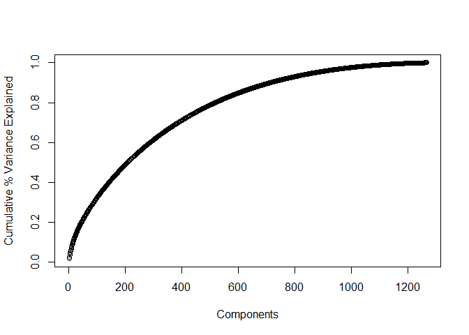

Author Attribution
================

### Loading all the required libraries

``` r
library(tm) 
```

    ## Loading required package: NLP

``` r
library(magrittr)
library(slam)
library(proxy)
```

    ## 
    ## Attaching package: 'proxy'

    ## The following objects are masked from 'package:stats':
    ## 
    ##     as.dist, dist

    ## The following object is masked from 'package:base':
    ## 
    ##     as.matrix

``` r
library(kknn)
library(caret)
```

    ## Loading required package: lattice

    ## Loading required package: ggplot2

    ## 
    ## Attaching package: 'ggplot2'

    ## The following object is masked from 'package:NLP':
    ## 
    ##     annotate

    ## 
    ## Attaching package: 'caret'

    ## The following object is masked from 'package:kknn':
    ## 
    ##     contr.dummy

``` r
library(randomForest)
```

    ## randomForest 4.6-14

    ## Type rfNews() to see new features/changes/bug fixes.

    ## 
    ## Attaching package: 'randomForest'

    ## The following object is masked from 'package:ggplot2':
    ## 
    ##     margin

### Reading both train and test files together and performing transformations together to deal with the uniformity issue between test and train data.

#### Since transformations are performed on the combined wordlist, and then split later into the initial test and train sets, it alleviates the issue of dealing with words in the test set that we never saw in the training set.

``` r
readerPlain = function(fname){
  readPlain(elem=list(content=readLines(fname)), 
            id=fname, language='en') }

file_list = Sys.glob('C:/Users/nithi/Downloads/STA380-master/STA380-master/data/ReutersC50/*/*/*.txt')
reuters=lapply(file_list, readerPlain) 


mynames = file_list %>%
  { strsplit(., '/', fixed=TRUE) } %>%
  { lapply(., tail, n=2) } %>%
  { lapply(., paste0, collapse = '') } %>%
  unlist

# Rename the articles
names(reuters) = mynames

#Getting the author name to be used later for classification.
first.word <- function(my.string){
  unlist(strsplit(my.string, '[0-9]'))[1]
}
reuter_name=sapply(mynames, first.word)
```

### Content Transformations and creating a doc-term-matrix

#### 1\. Convert all words to lower case

#### 2\. Remove words

#### 3\. Remove punctuation

#### 4\. Remove any excess white spaces

#### 5\. Remove stop words

#### 6\. Stemming the words to get word roots.

### Removing all words that doesnt occur in 97% of the documents.

``` r
documents_raw = Corpus(VectorSource(reuters))

my_documents = documents_raw
my_documents = tm_map(my_documents, content_transformer(tolower)) # make everything lowercase
my_documents = tm_map(my_documents, content_transformer(removeNumbers)) # remove numbers
my_documents = tm_map(my_documents, content_transformer(removePunctuation)) # remove punctuation
my_documents = tm_map(my_documents, content_transformer(stripWhitespace)) ## remove excess white-space
my_documents = tm_map(my_documents, content_transformer(removeWords), stopwords("en")) # remove stop words
my_documents = tm_map(my_documents, content_transformer(stemDocument)) # stemming the document


## create a doc-term-matrix
DTM_reuters = DocumentTermMatrix(my_documents)

DTM_reuters = removeSparseTerms(DTM_reuters, 0.97) # Remove all words that doesnt occur in 97% of the documents.
```

### Calculating TF-IDF weights of the words and storing the matrix as a data frame object to be fed into a model.

### Assigning the author names extracted earlier as the final column of the dataframe “y\_train”

### Splitting the dataframe into the intial test and train data sets.

``` r
tfidf_reuters = weightTfIdf(DTM_reuters) # Calculating TF-IDF

df = as.data.frame(as.matrix(tfidf_reuters)) #Converting to a dataframe object to be fed into a model

#Assigning the author names as the class for each document.
df$y_train=reuter_name
df$y_train = factor(df$y_train)

#Splitting into train and test dataframes.
df_train <- df[1:2500, ]
df_test <- df[2501:5000, ]
```

### Principal component Analysis to get most important features.

#### Almost 75% of variance is explained by taking the 400 components. Hence subsetting the output of PCA to select only 400 componenets.

``` r
X = as.matrix(tfidf_reuters)
X=X[c(1:2500),]

scrub_cols = which(colSums(X) == 0)
X = X[,-scrub_cols]

set.seed(123)
pca_reuters = prcomp(X, scale=TRUE)
plot(summary(pca_reuters)$importance[3,], xlab = "Components",
     ylab = "Cumulative % Variance Explained")
```

<!-- -->

``` r
train_pca = data.frame(pca_reuters$x)
train_pca = train_pca[,1:400]
train_pca$y_train=df_train$y_train
```

### Using KNN model. Input train dataframe has features selected through PCA

#### Optimum value of k selected through cross-validation. Here k=2 obtained.

#### Model gives an accuracy of 40.4% on the test data.

#### KNN using cosine yielded lower accuracy. Hence, went for the default measurement of the KNN function.

``` r
set.seed(123)
#Choosing the optimum k for KNN using cross validation. We get k=1.
trControl <- trainControl(method  = "cv",
                          number  = 5)
fit <- train(y_train~.,
             method     = "knn",
             tuneGrid   = expand.grid(k = c(2,5,8,10)),
             trControl  = trControl,
             metric     = "Accuracy",
             data       = train_pca)

y_test <- df_test$y_train
df_test$y_train <- NULL

fit
```

    ## k-Nearest Neighbors 
    ## 
    ## 2500 samples
    ##  400 predictor
    ##   50 classes: 'AaronPressman', 'AlanCrosby', 'AlexanderSmith', 'BenjaminKangLim', 'BernardHickey', 'BradDorfman', 'DarrenSchuettler', 'DavidLawder', 'EdnaFernandes', 'EricAuchard', 'FumikoFujisaki', 'GrahamEarnshaw', 'HeatherScoffield', 'JaneMacartney', 'JanLopatka', 'JimGilchrist', 'JoeOrtiz', 'JohnMastrini', 'JonathanBirt', 'JoWinterbottom', 'KarlPenhaul', 'KeithWeir', 'KevinDrawbaugh', 'KevinMorrison', 'KirstinRidley', 'KouroshKarimkhany', 'LydiaZajc', 'LynneO'Donnell', 'LynnleyBrowning', 'MarcelMichelson', 'MarkBendeich', 'MartinWolk', 'MatthewBunce', 'MichaelConnor', 'MureDickie', 'NickLouth', 'PatriciaCommins', 'PeterHumphrey', 'PierreTran', 'RobinSidel', 'RogerFillion', 'SamuelPerry', 'SarahDavison', 'ScottHillis', 'SimonCowell', 'TanEeLyn', 'TheresePoletti', 'TimFarrand', 'ToddNissen', 'WilliamKazer' 
    ## 
    ## No pre-processing
    ## Resampling: Cross-Validated (5 fold) 
    ## Summary of sample sizes: 2000, 2000, 2000, 2000, 2000 
    ## Resampling results across tuning parameters:
    ## 
    ##   k   Accuracy  Kappa    
    ##    2  0.6148    0.6069388
    ##    5  0.6132    0.6053061
    ##    8  0.5868    0.5783673
    ##   10  0.5836    0.5751020
    ## 
    ## Accuracy was used to select the optimal model using the largest value.
    ## The final value used for the model was k = 2.

``` r
test_pca_knn = predict(pca_reuters, newdata = df_test)
pca_predicted_knn = predict(fit, test_pca_knn)

conf=confusionMatrix(pca_predicted_knn, y_test )
conf$overall #Accuracy of the model = 40.4%
```

    ##       Accuracy          Kappa  AccuracyLower  AccuracyUpper   AccuracyNull 
    ##      0.4068000      0.3946939      0.3874626      0.4263561      0.0200000 
    ## AccuracyPValue  McnemarPValue 
    ##      0.0000000            NaN

### Running Random Forest model on the training set with features selected through PCA.

#### Accuracy obtained is 54.52%

``` r
set.seed(123)
pca_classifier = randomForest(train_pca[-401], df_train$y_train)

test_pca = predict(pca_reuters, newdata = df_test)
pca_predicted = predict(pca_classifier, test_pca)

conf_pca=confusionMatrix(pca_predicted, y_test )
conf_pca$overall
```

    ##       Accuracy          Kappa  AccuracyLower  AccuracyUpper   AccuracyNull 
    ##      0.5452000      0.5359184      0.5254372      0.5648567      0.0200000 
    ## AccuracyPValue  McnemarPValue 
    ##      0.0000000            NaN

### Running Random Forest Model on the full features and then doing variable selection.

#### Random Forest re-run using the selected features yields an accuracy of 63.12%.

``` r
set.seed(123)
fit_rf <- randomForest(x = df_train[-1282],
                          y = df_train$y_train)
predicted_values = predict(fit_rf, df_test)

cf_gen=confusionMatrix(predicted_values, y_test, dnn = c("Predicted", "Actual"))

#Selecting the first 400 important features.
importanceOrder=order(-fit_rf$importance)
names=rownames(fit_rf$importance)[importanceOrder]
names=names[c(1:400)]


classifier_new <- randomForest(x = df_train[names],
                          y = df_train$y_train)
predicted_values = predict(classifier_new, df_test[names])
cf=confusionMatrix(predicted_values, y_test, dnn = c("Predicted", "Actual"))
cf$overall
```

    ##       Accuracy          Kappa  AccuracyLower  AccuracyUpper   AccuracyNull 
    ##      0.6312000      0.6236735      0.6119422      0.6501499      0.0200000 
    ## AccuracyPValue  McnemarPValue 
    ##      0.0000000            NaN

## Conclusion

##### We tried different models using both feature reduction through PCA and feature selection through Random Forest. Out of KNN, Random Forest using PCA feature reduction and Random Forest through feature selection, the final one - “Random Forest model through feature selection” yielded the best result with an **accuracy of 63.12%.**
