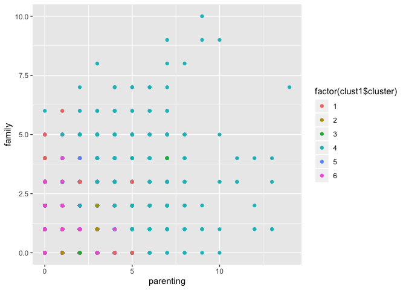
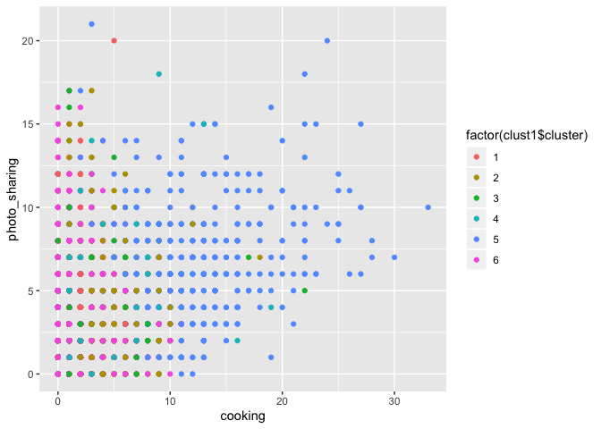
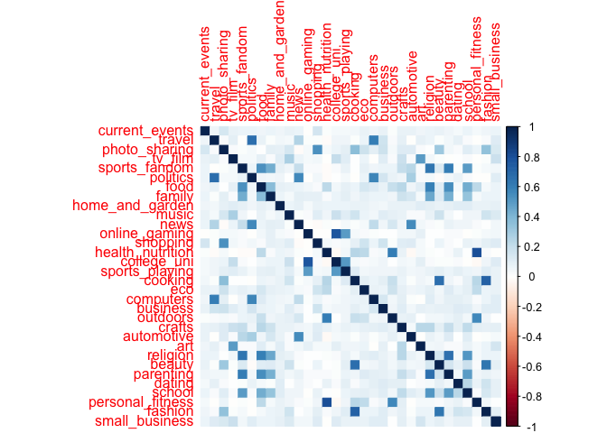
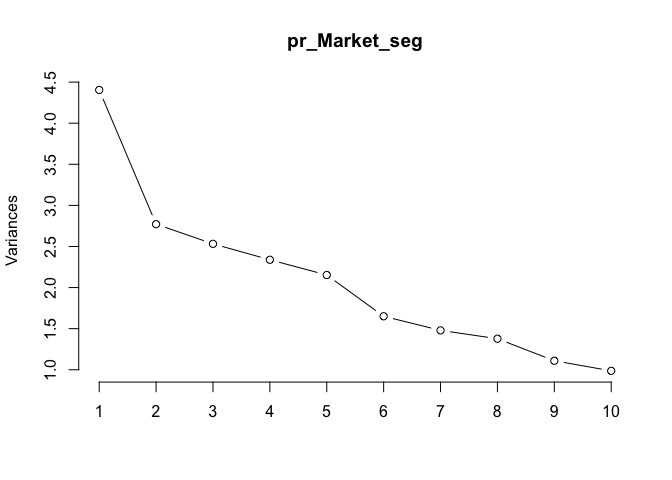
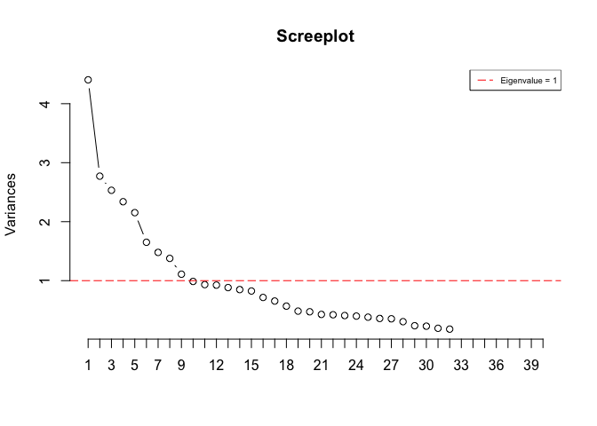
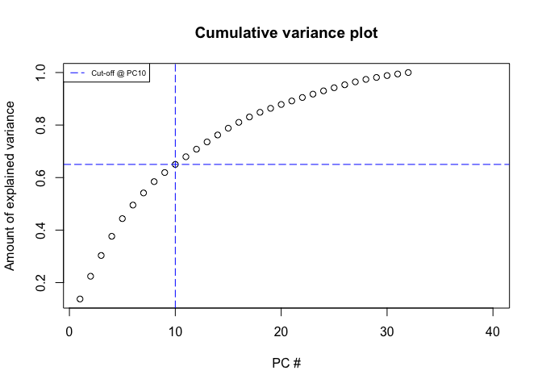
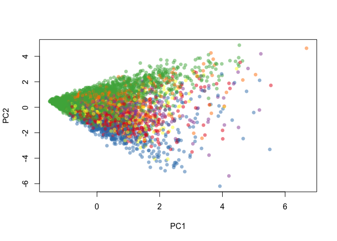

Market segmentation
================

### Removing Spam, Adult, Chatter and Uncategorized as these columns are introducing noise into the Data

``` r
Market_seg = subset(Market_seg, select = -c(spam,adult ,chatter, uncategorized))
head(Market_seg)
```

### Running K-means on the Data

``` r
set.seed(12)

# Center and scale the data
X = scale(Market_seg, center=TRUE, scale=TRUE)

# Extract the centers and scales from the rescaled data (which are named attributes)
mu = attr(X,"scaled:center")
sigma = attr(X,"scaled:scale")

# Run k-means with 6 clusters and 25 starts
clust1 = kmeans(X, 6, nstart=25)
```

### Cluster 1 Importance

``` r
#Sorted values of importance of each cluster

sort(clust1$center[1,]*sigma + mu,decreasing=TRUE)
```

    ##         politics           travel             news    photo_sharing 
    ##        8.9330422        5.6084425        5.2940320        2.5429403 
    ##        computers       automotive    sports_fandom health_nutrition 
    ##        2.4745269        2.3362445        2.0101892        1.6652111 
    ##   current_events             food         shopping      college_uni 
    ##        1.6622999        1.4425036        1.3857351        1.3318777 
    ##          cooking          tv_film           dating         religion 
    ##        1.2605531        1.2110626        1.0655022        1.0291121 
    ## personal_fitness        parenting         outdoors           family 
    ##        1.0072780        0.9432314        0.9184862        0.9126638 
    ##    online_gaming              art           school          fashion 
    ##        0.8558952        0.7510917        0.7248908        0.6768559 
    ##         business           crafts            music   sports_playing 
    ##        0.6710335        0.6433770        0.6390102        0.6273654 
    ##  home_and_garden              eco   small_business           beauty 
    ##        0.6128093        0.5997089        0.4861718        0.4759825

``` r
length(which(clust1$cluster == 1))
```

    ## [1] 687

### Cluster 2 Importance

``` r
sort(clust1$center[2,]*sigma + mu, decreasing=TRUE)
```

    ## health_nutrition personal_fitness          cooking         outdoors 
    ##       12.0067720        6.4537246        3.2663657        2.7415350 
    ##    photo_sharing             food   current_events         shopping 
    ##        2.6896163        2.1331828        1.5519187        1.4683973 
    ##         politics           travel    sports_fandom             news 
    ##        1.2550790        1.2381490        1.1659142        1.1038375 
    ##           dating          tv_film      college_uni              eco 
    ##        1.0349887        0.9887133        0.9480813        0.9209932 
    ##    online_gaming          fashion           family        parenting 
    ##        0.8510158        0.7945824        0.7787810        0.7652370 
    ##         religion              art            music       automotive 
    ##        0.7607223        0.7449210        0.7347630        0.6625282 
    ##  home_and_garden   sports_playing           school           crafts 
    ##        0.6467269        0.6151242        0.5959368        0.5936795 
    ##        computers         business           beauty   small_business 
    ##        0.5575621        0.4683973        0.4243792        0.2945824

``` r
length(which(clust1$cluster == 2))
```

    ## [1] 886

### Cluster 3 Importance

``` r
sort(clust1$center[3,]*sigma + mu,decreasing=TRUE)
```

    ##      college_uni    online_gaming    photo_sharing   sports_playing 
    ##       10.3554084        9.2516556        2.8697572        2.5673289 
    ##          tv_film health_nutrition           travel   current_events 
    ##        1.9403974        1.7262693        1.5452539        1.5298013 
    ##          cooking         shopping    sports_fandom         politics 
    ##        1.4746137        1.4017660        1.3421634        1.2737307 
    ##             food              art            music           family 
    ##        1.2693157        1.1876380        1.1368653        1.0551876 
    ## personal_fitness          fashion       automotive         religion 
    ##        0.9955850        0.8962472        0.8896247        0.8476821 
    ##             news           dating        parenting         outdoors 
    ##        0.7902870        0.7373068        0.6732892        0.6710817 
    ##  home_and_garden           crafts        computers           school 
    ##        0.6158940        0.5960265        0.5717439        0.5253863 
    ##   small_business              eco           beauty         business 
    ##        0.4944812        0.4856512        0.4547461        0.4503311

``` r
length(which(clust1$cluster == 3))
```

    ## [1] 453

### Cluster 4 Importance

``` r
sort(clust1$center[4,]*sigma + mu,decreasing=TRUE)
```

    ##    sports_fandom         religion             food        parenting 
    ##        5.8951507        5.2555701        4.5661861        4.0589777 
    ##           school    photo_sharing           family health_nutrition 
    ##        2.7090433        2.6304063        2.4980341        1.8505898 
    ##   current_events          cooking         shopping           travel 
    ##        1.6802097        1.6159895        1.4823067        1.3446920 
    ##      college_uni personal_fitness         politics           beauty 
    ##        1.2005242        1.1887287        1.1677588        1.1009174 
    ##           crafts          tv_film       automotive             news 
    ##        1.0825688        1.0498034        1.0498034        1.0340760 
    ##          fashion    online_gaming              art           dating 
    ##        1.0275229        1.0117955        0.8754915        0.7942333 
    ##   sports_playing        computers            music         outdoors 
    ##        0.7391874        0.7313237        0.7313237        0.6815203 
    ##              eco  home_and_garden         business   small_business 
    ##        0.6605505        0.6461337        0.5032765        0.4010485

``` r
length(which(clust1$cluster == 4))
```

    ## [1] 763

### Cluster 5 Importance

``` r
sort(clust1$center[5,]*sigma + mu,decreasing=TRUE)
```

    ##          cooking    photo_sharing          fashion           beauty 
    ##       10.9057592        6.1169284        5.5305410        3.8935428 
    ## health_nutrition         shopping   current_events           travel 
    ##        2.2844677        2.0209424        1.7591623        1.4938918 
    ##      college_uni         politics personal_fitness            music 
    ##        1.4607330        1.4048866        1.3560209        1.2146597 
    ##    sports_fandom             news    online_gaming             food 
    ##        1.1326353        1.0506108        1.0471204        1.0453752 
    ##          tv_film           school           dating           family 
    ##        1.0226876        0.9842932        0.9441536        0.9109948 
    ##              art       automotive         religion         outdoors 
    ##        0.9057592        0.9057592        0.8446771        0.8132635 
    ##   sports_playing        parenting        computers           crafts 
    ##        0.8080279        0.8062827        0.7277487        0.6352531 
    ##  home_and_garden         business              eco   small_business 
    ##        0.6212914        0.6125654        0.5776614        0.4851658

``` r
length(which(clust1$cluster == 5))
```

    ## [1] 573

### Cluster 6 Importance

``` r
sort(clust1$center[6,]*sigma + mu,decreasing=TRUE)
```

    ##    photo_sharing   current_events         shopping           travel 
    ##        2.2818584        1.4446903        1.2774336        1.0975664 
    ## health_nutrition         politics          tv_film    sports_fandom 
    ##        1.0951327        1.0123894        0.9871681        0.9723451 
    ##      college_uni          cooking             food             news 
    ##        0.8880531        0.8495575        0.7690265        0.6942478 
    ## personal_fitness              art       automotive    online_gaming 
    ##        0.6590708        0.6221239        0.5809735        0.5803097 
    ##           family            music           dating         religion 
    ##        0.5721239        0.5519912        0.5471239        0.5254425 
    ##          fashion           school        parenting  home_and_garden 
    ##        0.5148230        0.4769912        0.4584071        0.4384956 
    ##   sports_playing         outdoors              eco        computers 
    ##        0.4141593        0.4024336        0.3882743        0.3734513 
    ##           crafts           beauty         business   small_business 
    ##        0.3623894        0.3491150        0.3365044        0.2761062

``` r
length(which(clust1$cluster == 6))
```

    ## [1] 4520

``` r
# qplot is in the ggplot2 library
qplot(parenting,family , data=Market_seg, color=factor(clust1$cluster))
```

<!-- -->

``` r
qplot(cooking, photo_sharing, data=Market_seg, color=factor(clust1$cluster))
```

<!-- -->

### Running K-Means++

``` r
X = scale(Market_seg, center=TRUE, scale=TRUE)

# Extract the centers and scales from the rescaled data (which are named attributes)
mu = attr(X,"scaled:center")
sigma = attr(X,"scaled:scale")


clust2 = kmeanspp(X, k=6, nstart=25)
```

### Cluster 1 Importance

``` r
sort(clust2$center[1,]*sigma + mu,decreasing=TRUE)
```

    ## health_nutrition personal_fitness          cooking         outdoors 
    ##       12.0067720        6.4537246        3.2663657        2.7415350 
    ##    photo_sharing             food   current_events         shopping 
    ##        2.6896163        2.1331828        1.5519187        1.4683973 
    ##         politics           travel    sports_fandom             news 
    ##        1.2550790        1.2381490        1.1659142        1.1038375 
    ##           dating          tv_film      college_uni              eco 
    ##        1.0349887        0.9887133        0.9480813        0.9209932 
    ##    online_gaming          fashion           family        parenting 
    ##        0.8510158        0.7945824        0.7787810        0.7652370 
    ##         religion              art            music       automotive 
    ##        0.7607223        0.7449210        0.7347630        0.6625282 
    ##  home_and_garden   sports_playing           school           crafts 
    ##        0.6467269        0.6151242        0.5959368        0.5936795 
    ##        computers         business           beauty   small_business 
    ##        0.5575621        0.4683973        0.4243792        0.2945824

``` r
length(which(clust2$cluster == 1))
```

    ## [1] 886

### Cluster 2 Importance

``` r
sort(clust2$center[2,]*sigma + mu,decreasing=TRUE)
```

    ##         politics           travel             news    photo_sharing 
    ##        8.9330422        5.6084425        5.2940320        2.5429403 
    ##        computers       automotive    sports_fandom health_nutrition 
    ##        2.4745269        2.3362445        2.0101892        1.6652111 
    ##   current_events             food         shopping      college_uni 
    ##        1.6622999        1.4425036        1.3857351        1.3318777 
    ##          cooking          tv_film           dating         religion 
    ##        1.2605531        1.2110626        1.0655022        1.0291121 
    ## personal_fitness        parenting         outdoors           family 
    ##        1.0072780        0.9432314        0.9184862        0.9126638 
    ##    online_gaming              art           school          fashion 
    ##        0.8558952        0.7510917        0.7248908        0.6768559 
    ##         business           crafts            music   sports_playing 
    ##        0.6710335        0.6433770        0.6390102        0.6273654 
    ##  home_and_garden              eco   small_business           beauty 
    ##        0.6128093        0.5997089        0.4861718        0.4759825

``` r
length(which(clust2$cluster == 2))
```

    ## [1] 687

### Cluster 3 Importance

``` r
sort(clust2$center[3,]*sigma + mu,decreasing=TRUE)
```

    ##    photo_sharing   current_events         shopping           travel 
    ##        2.2818584        1.4446903        1.2774336        1.0975664 
    ## health_nutrition         politics          tv_film    sports_fandom 
    ##        1.0951327        1.0123894        0.9871681        0.9723451 
    ##      college_uni          cooking             food             news 
    ##        0.8880531        0.8495575        0.7690265        0.6942478 
    ## personal_fitness              art       automotive    online_gaming 
    ##        0.6590708        0.6221239        0.5809735        0.5803097 
    ##           family            music           dating         religion 
    ##        0.5721239        0.5519912        0.5471239        0.5254425 
    ##          fashion           school        parenting  home_and_garden 
    ##        0.5148230        0.4769912        0.4584071        0.4384956 
    ##   sports_playing         outdoors              eco        computers 
    ##        0.4141593        0.4024336        0.3882743        0.3734513 
    ##           crafts           beauty         business   small_business 
    ##        0.3623894        0.3491150        0.3365044        0.2761062

``` r
length(which(clust2$cluster == 3))
```

    ## [1] 4520

### Cluster 4 Importance

``` r
sort(clust2$center[4,]*sigma + mu,decreasing=TRUE)
```

    ##      college_uni    online_gaming    photo_sharing   sports_playing 
    ##       10.3554084        9.2516556        2.8697572        2.5673289 
    ##          tv_film health_nutrition           travel   current_events 
    ##        1.9403974        1.7262693        1.5452539        1.5298013 
    ##          cooking         shopping    sports_fandom         politics 
    ##        1.4746137        1.4017660        1.3421634        1.2737307 
    ##             food              art            music           family 
    ##        1.2693157        1.1876380        1.1368653        1.0551876 
    ## personal_fitness          fashion       automotive         religion 
    ##        0.9955850        0.8962472        0.8896247        0.8476821 
    ##             news           dating        parenting         outdoors 
    ##        0.7902870        0.7373068        0.6732892        0.6710817 
    ##  home_and_garden           crafts        computers           school 
    ##        0.6158940        0.5960265        0.5717439        0.5253863 
    ##   small_business              eco           beauty         business 
    ##        0.4944812        0.4856512        0.4547461        0.4503311

``` r
length(which(clust2$cluster == 4))
```

    ## [1] 453

### Cluster 5 Importance

``` r
sort(clust2$center[5,]*sigma + mu,decreasing=TRUE)
```

    ##    sports_fandom         religion             food        parenting 
    ##        5.8951507        5.2555701        4.5661861        4.0589777 
    ##           school    photo_sharing           family health_nutrition 
    ##        2.7090433        2.6304063        2.4980341        1.8505898 
    ##   current_events          cooking         shopping           travel 
    ##        1.6802097        1.6159895        1.4823067        1.3446920 
    ##      college_uni personal_fitness         politics           beauty 
    ##        1.2005242        1.1887287        1.1677588        1.1009174 
    ##           crafts          tv_film       automotive             news 
    ##        1.0825688        1.0498034        1.0498034        1.0340760 
    ##          fashion    online_gaming              art           dating 
    ##        1.0275229        1.0117955        0.8754915        0.7942333 
    ##   sports_playing        computers            music         outdoors 
    ##        0.7391874        0.7313237        0.7313237        0.6815203 
    ##              eco  home_and_garden         business   small_business 
    ##        0.6605505        0.6461337        0.5032765        0.4010485

``` r
length(which(clust2$cluster == 5))
```

    ## [1] 763

### Cluster 6 Importance

``` r
sort(clust2$center[6,]*sigma + mu,decreasing=TRUE)
```

    ##          cooking    photo_sharing          fashion           beauty 
    ##       10.9057592        6.1169284        5.5305410        3.8935428 
    ## health_nutrition         shopping   current_events           travel 
    ##        2.2844677        2.0209424        1.7591623        1.4938918 
    ##      college_uni         politics personal_fitness            music 
    ##        1.4607330        1.4048866        1.3560209        1.2146597 
    ##    sports_fandom             news    online_gaming             food 
    ##        1.1326353        1.0506108        1.0471204        1.0453752 
    ##          tv_film           school           dating           family 
    ##        1.0226876        0.9842932        0.9441536        0.9109948 
    ##              art       automotive         religion         outdoors 
    ##        0.9057592        0.9057592        0.8446771        0.8132635 
    ##   sports_playing        parenting        computers           crafts 
    ##        0.8080279        0.8062827        0.7277487        0.6352531 
    ##  home_and_garden         business              eco   small_business 
    ##        0.6212914        0.6125654        0.5776614        0.4851658

``` r
length(which(clust2$cluster == 6))
```

    ## [1] 573

``` r
# Compare versus within-cluster average distances from the first run
clust1$withinss
```

    ## [1] 27155.47 23304.05 15249.75 27035.57 19526.55 70904.67

``` r
clust2$withinss
```

    ## [1] 23304.05 27155.47 70904.67 15249.75 27035.57 19526.55

``` r
sum(clust1$withinss)
```

    ## [1] 183176.1

``` r
sum(clust2$withinss)
```

    ## [1] 183176.1

``` r
clust1$tot.withinss
```

    ## [1] 183176.1

``` r
clust2$tot.withinss
```

    ## [1] 183176.1

``` r
clust1$betweenss
```

    ## [1] 69015.94

``` r
clust2$betweenss
```

    ## [1] 69015.94

\#PC Correlation

``` r
M=cor(Market_seg)
corrplot(M, method="color")
```

<!-- -->

``` r
#we can see the correlations are quite high and positive hence we can proceed with PCA
```

### We can see the correlation is high so we can run PC to get good results

``` r
dim(Market_seg)  
```

    ## [1] 7882   32

``` r
pr_Market_seg = prcomp(Market_seg, center = TRUE,scale=TRUE)

summary(pr_Market_seg)
```

    ## Importance of components:
    ##                           PC1     PC2     PC3     PC4     PC5     PC6
    ## Standard deviation     2.0987 1.66483 1.59119 1.52912 1.46728 1.28477
    ## Proportion of Variance 0.1376 0.08661 0.07912 0.07307 0.06728 0.05158
    ## Cumulative Proportion  0.1376 0.22426 0.30338 0.37645 0.44372 0.49531
    ##                            PC7     PC8     PC9    PC10    PC11    PC12
    ## Standard deviation     1.21616 1.17377 1.05325 0.99329 0.96596 0.96133
    ## Proportion of Variance 0.04622 0.04305 0.03467 0.03083 0.02916 0.02888
    ## Cumulative Proportion  0.54153 0.58458 0.61925 0.65008 0.67924 0.70812
    ##                           PC13    PC14    PC15    PC16    PC17    PC18
    ## Standard deviation     0.93945 0.92125 0.90796 0.84582 0.80888 0.75382
    ## Proportion of Variance 0.02758 0.02652 0.02576 0.02236 0.02045 0.01776
    ## Cumulative Proportion  0.73570 0.76222 0.78798 0.81034 0.83079 0.84854
    ##                           PC19    PC20    PC21    PC22    PC23    PC24
    ## Standard deviation     0.69548 0.68732 0.65389 0.64963 0.63916 0.63190
    ## Proportion of Variance 0.01512 0.01476 0.01336 0.01319 0.01277 0.01248
    ## Cumulative Proportion  0.86366 0.87842 0.89178 0.90497 0.91774 0.93022
    ##                           PC25    PC26    PC27    PC28    PC29    PC30
    ## Standard deviation     0.61729 0.59925 0.59437 0.55190 0.48581 0.47790
    ## Proportion of Variance 0.01191 0.01122 0.01104 0.00952 0.00738 0.00714
    ## Cumulative Proportion  0.94212 0.95335 0.96439 0.97390 0.98128 0.98842
    ##                           PC31    PC32
    ## Standard deviation     0.43861 0.42223
    ## Proportion of Variance 0.00601 0.00557
    ## Cumulative Proportion  0.99443 1.00000

``` r
plot(pr_Market_seg, type='l')
```

<!-- -->

``` r
screeplot(pr_Market_seg, type = "l", npcs = 40, main = "Screeplot")
abline(h = 1, col="red", lty=5)
legend("topright", legend=c("Eigenvalue = 1"),
       col=c("red"), lty=5, cex=0.6)
```

<!-- -->

``` r
#We see that it is eigen value=1 at 10

cumpro <- cumsum(pr_Market_seg$sdev^2 / sum(pr_Market_seg$sdev^2))
plot(cumpro[0:40], xlab = "PC #", ylab = "Amount of explained variance", main = "Cumulative variance plot")
abline(v =10, col="blue", lty=5)
abline(h = 0.65008, col="blue", lty=5)
legend("topleft", legend=c("Cut-off @ PC10"),
       col=c("blue"), lty=5, cex=0.6)
```

<!-- -->

``` r
#changed h= 0.65008 (Cumulative Proportion of PC10 and c=10)
```

``` r
scores = pr_Market_seg$x


# first, what are PCs themselves?
loadings = pr_Market_seg$rotation
```

Obtain value of Scores\[1:10\]

``` r
scores = pr_Market_seg$x

# First for principal components
comp <- data.frame(scores[,1:10])
```

### Running PCA with Kmeans++

``` r
X = scale(comp, center=TRUE, scale=TRUE)

k <- kmeanspp(X, 6, nstart=25, iter.max=1000)

palette(alpha(brewer.pal(9,'Set1'), 0.5))

mu = attr(X,"scaled:center")
sigma = attr(X,"scaled:scale")


plot(X, col=k$clust, pch=16)
```

<!-- -->

### Compare within-cluster average distances of K-means, K-means++ and PCA & K-means++

``` r
clust1$withinss
```

    ## [1] 27155.47 23304.05 15249.75 27035.57 19526.55 70904.67

``` r
clust2$withinss
```

    ## [1] 23304.05 27155.47 70904.67 15249.75 27035.57 19526.55

``` r
k$withinss
```

    ## [1]  6480.758  5297.841 30014.482  3743.047  4077.147  3485.892

``` r
sum(clust1$withinss)
```

    ## [1] 183176.1

``` r
sum(clust2$withinss)
```

    ## [1] 183176.1

``` r
sum(k$withinss)
```

    ## [1] 53099.17

``` r
clust1$tot.withinss
```

    ## [1] 183176.1

``` r
clust2$tot.withinss
```

    ## [1] 183176.1

``` r
k$tot.withinss
```

    ## [1] 53099.17

``` r
clust1$betweenss
```

    ## [1] 69015.94

``` r
clust2$betweenss
```

    ## [1] 69015.94

``` r
k$betweenss
```

    ## [1] 25710.83

### We see that PC and k-means++ has the least Sum of Squares Value.

### Hence we can group clusters as the following :

### Cluster 1 Importance

``` r
sort(k$center[1,]*sigma + mu,decreasing=TRUE)
```

    ##         PC4         PC1        PC10         PC9         PC6         PC7 
    ##  2.51540595  0.71683506  0.02872280 -0.01176949 -0.03754623 -0.08232453 
    ##         PC8         PC2         PC5         PC3 
    ## -0.14263836 -1.12568746 -1.19550541 -1.28578460

``` r
loadings[,4] %>% sort %>% tail(5)
```

    ##             news         politics         outdoors personal_fitness 
    ##        0.1561362        0.1674941        0.3859715        0.4206180 
    ## health_nutrition 
    ##        0.4371116

``` r
loadings[,1] %>% sort %>% tail(5)
```

    ##        school sports_fandom     parenting          food      religion 
    ##     0.2891255     0.3048968     0.3103991     0.3129646     0.3155037

``` r
length(which(k$cluster == 1))
```

    ## [1] 965

### Cluster 2 Importance

``` r
sort(k$center[2,]*sigma + mu,decreasing=TRUE)
```

    ##        PC5        PC1        PC8        PC6        PC9       PC10 
    ##  2.1624513  1.6671991  0.8022032  0.7715380  0.4171705 -0.2251113 
    ##        PC7        PC3        PC4        PC2 
    ## -0.6717882 -1.2026610 -1.3193694 -2.6328090

``` r
loadings[,5] %>% sort %>% tail(5)
```

    ##      shopping photo_sharing       cooking       fashion        beauty 
    ##     0.1095403     0.1987926     0.2164123     0.2763861     0.2913377

``` r
loadings[,1] %>% sort %>% tail(5)
```

    ##        school sports_fandom     parenting          food      religion 
    ##     0.2891255     0.3048968     0.3103991     0.3129646     0.3155037

``` r
loadings[,8] %>% sort %>% tail(5)
```

    ##     beauty        art    tv_film automotive       news 
    ##  0.1904156  0.2859857  0.2958033  0.3486988  0.3868053

``` r
loadings[,6] %>% sort %>% tail(5)
```

    ##     automotive        cooking    college_uni sports_playing  online_gaming 
    ##      0.1648397      0.1675754      0.1716209      0.2148155      0.2748557

``` r
length(which(k$cluster == 2))
```

    ## [1] 620

### Cluster 3 Importance

``` r
sort(k$center[3,]*sigma + mu,decreasing=TRUE)
```

    ##          PC2          PC5         PC10          PC7          PC9 
    ##  0.538192377  0.172525413  0.065860292 -0.003610533 -0.049342701 
    ##          PC8          PC3          PC4          PC6          PC1 
    ## -0.174906362 -0.208343578 -0.290116224 -0.355169288 -0.631608809

``` r
loadings[,2] %>% sort %>% tail(5)
```

    ##        school          food     parenting      religion sports_fandom 
    ##     0.1919208     0.2029964     0.2758494     0.2954711     0.3022585

``` r
loadings[,5] %>% sort %>% tail(5)
```

    ##      shopping photo_sharing       cooking       fashion        beauty 
    ##     0.1095403     0.1987926     0.2164123     0.2763861     0.2913377

``` r
length(which(k$cluster == 3))
```

    ## [1] 4897

### Cluster 4 Importance

``` r
sort(k$center[4,]*sigma + mu,decreasing=TRUE)
```

    ##         PC3         PC1         PC4         PC5         PC9         PC6 
    ##  4.34207984  1.44618607  1.31650395  0.73142392  0.50122778  0.31957726 
    ##        PC10         PC2         PC8         PC7 
    ## -0.08361426 -0.09851091 -1.02804478 -1.66380780

``` r
loadings[,3] %>% sort %>% tail(5)
```

    ## automotive       news  computers     travel   politics 
    ##  0.1856782  0.3469595  0.3786674  0.4407475  0.5030263

``` r
loadings[,1] %>% sort %>% tail(5)
```

    ##        school sports_fandom     parenting          food      religion 
    ##     0.2891255     0.3048968     0.3103991     0.3129646     0.3155037

``` r
loadings[,4] %>% sort %>% tail(5)
```

    ##             news         politics         outdoors personal_fitness 
    ##        0.1561362        0.1674941        0.3859715        0.4206180 
    ## health_nutrition 
    ##        0.4371116

``` r
loadings[,5] %>% sort %>% tail(5)
```

    ##      shopping photo_sharing       cooking       fashion        beauty 
    ##     0.1095403     0.1987926     0.2164123     0.2763861     0.2913377

``` r
length(which(k$cluster == 4))
```

    ## [1] 417

### Cluster 5 Importance

``` r
sort(k$center[5,]*sigma + mu,decreasing=TRUE)
```

    ##        PC7        PC8        PC3        PC6        PC1        PC2 
    ##  2.0968303  1.9526960  1.6363461  0.8944689  0.8537379  0.8210315 
    ##        PC4        PC5       PC10        PC9 
    ##  0.7207142  0.3635357  0.0656516 -0.3349882

``` r
loadings[,7] %>% sort %>% tail(5)
```

    ## current_events           news  photo_sharing       shopping     automotive 
    ##      0.1941290      0.2699245      0.3117548      0.4291261      0.5138149

``` r
loadings[,8] %>% sort %>% tail(5)
```

    ##     beauty        art    tv_film automotive       news 
    ##  0.1904156  0.2859857  0.2958033  0.3486988  0.3868053

``` r
loadings[,3] %>% sort %>% tail(5)
```

    ## automotive       news  computers     travel   politics 
    ##  0.1856782  0.3469595  0.3786674  0.4407475  0.5030263

``` r
length(which(k$cluster == 5))
```

    ## [1] 566

### Cluster 6 Importance

``` r
sort(k$center[6,]*sigma + mu,decreasing=TRUE)
```

    ##         PC6         PC1         PC3         PC7         PC9         PC8 
    ##  1.57700105  0.67458958  0.64717332  0.04948332 -0.06010930 -0.43101869 
    ##        PC10         PC2         PC4         PC5 
    ## -0.51069062 -0.81660164 -2.74715813 -3.69946995

``` r
loadings[,6] %>% sort %>% tail(5)
```

    ##     automotive        cooking    college_uni sports_playing  online_gaming 
    ##      0.1648397      0.1675754      0.1716209      0.2148155      0.2748557

``` r
loadings[,1] %>% sort %>% tail(5)
```

    ##        school sports_fandom     parenting          food      religion 
    ##     0.2891255     0.3048968     0.3103991     0.3129646     0.3155037

``` r
loadings[,3] %>% sort %>% tail(5)
```

    ## automotive       news  computers     travel   politics 
    ##  0.1856782  0.3469595  0.3786674  0.4407475  0.5030263

``` r
length(which(k$cluster == 6))
```

    ## [1] 417

### Conclusion

After running K means on PC, we see that there is high correlation
between the six clusters. Here is what we gathered from the results of
running a K-means ++ algorithm on the subset of data obtained from PC
Analysis.

**Middle aged Parents:** In the first cluster, we see that News and
Politics pops up as well as personal fitness and health nutrition. Some
other features include parenting, sports\_fandom and school. This led us
to believe that this cluster could consist mostly of adults who are
probably parents and those who follow the news and politics
consistently. They tend to focus on nutritional welfare of their kids
and are constantly on the look out for new recipes to experiement for
their kids. People in this assumed age bracket also tend to be middle
aged and hence more conscious about their health & fitness.

**Stay at home Mums:** In the second cluster, we see a high importance
for beauty, fashion,cooking ,shopping,photo-sharing and art. We can
assume that this cluster caters to young women and mothers. People in
this cluster also follow the news, watch films on tv and are interested
in art. Online gaming is an interesting topic to have surfaced in this
cluster as well.

**Working mothers:** In the third cluster, we see a high importance for
religion, parenting and food and school. The same can also be observed
for shopping, cooking, fashion and beauty. Thus, we believe that the
third cluster is an equally representative mix of the above two
clusters. This would fit the role of a working mom whose attention is
split usually between her own needs and that of her family.

**Media person:** In the fourth cluster, travel, computers ,politics ,
automotive have high importance. Fashion, beauty, cooking and
photo-sharing also make the list. Thus, this cluster could represent a
person who is mostly in the limelight and would like to stay abreast on
global trends. They probably travel a lot for their work and hence are
on the constant look out for new places and food to explore.

**Gen Z young-gun:** In cluster five, we see a high importance for
automotive, current events, tv\_film. We also see significant weights
for fashion, beauty and photo-sharing. This would appear to be the
subset of people who are young and are constantly on social media. They
need to know what’s happening in the world around and make their
presence felt on the internet.

**College students:** In cluster six, we see a high impportance for
online\_gaming, sports\_playing, college\_uni, school, sports\_fandom,
cooking and automotive. These are mostly viable topics of interest for
students in College. Hence, we believe that this cluster would be an
ideal match for College students.
