STA 380, Part 2: Exercises - Namita Ramesh, Nithin Saseendran, Prathik
Ullur
================

# Visual story telling part 1: Green Buildings

### Let us take a look at the Data by running str(Building\_Data).

We also ran is.na(Building\_Data) to take a look at any null values. We
see that empl\_gr has 71 null values.

    ## 'data.frame':    7894 obs. of  23 variables:
    ##  $ CS_PropertyID    : int  379105 122151 379839 94614 379285 94765 236739 234578 42087 233989 ...
    ##  $ cluster          : int  1 1 1 1 1 1 6 6 6 6 ...
    ##  $ size             : int  260300 67861 164848 93372 174307 231633 210038 225895 912011 518578 ...
    ##  $ empl_gr          : num  2.22 2.22 2.22 2.22 2.22 2.22 4.01 4.01 4.01 4.01 ...
    ##  $ Rent             : num  38.6 28.6 33.3 35 40.7 ...
    ##  $ leasing_rate     : num  91.4 87.1 88.9 97 96.6 ...
    ##  $ stories          : int  14 5 13 13 16 14 11 15 31 21 ...
    ##  $ age              : int  16 27 36 46 5 20 38 24 34 36 ...
    ##  $ renovated        : int  0 0 1 1 0 0 0 0 0 1 ...
    ##  $ class_a          : int  1 0 0 0 1 1 0 1 1 1 ...
    ##  $ class_b          : int  0 1 1 1 0 0 1 0 0 0 ...
    ##  $ LEED             : int  0 0 0 0 0 0 0 0 0 0 ...
    ##  $ Energystar       : int  1 0 0 0 0 0 1 0 0 0 ...
    ##  $ green_rating     : int  1 0 0 0 0 0 1 0 0 0 ...
    ##  $ net              : int  0 0 0 0 0 0 0 0 0 0 ...
    ##  $ amenities        : int  1 1 1 0 1 1 1 1 1 1 ...
    ##  $ cd_total_07      : int  4988 4988 4988 4988 4988 4988 2746 2746 2746 2746 ...
    ##  $ hd_total07       : int  58 58 58 58 58 58 1670 1670 1670 1670 ...
    ##  $ total_dd_07      : int  5046 5046 5046 5046 5046 5046 4416 4416 4416 4416 ...
    ##  $ Precipitation    : num  42.6 42.6 42.6 42.6 42.6 ...
    ##  $ Gas_Costs        : num  0.0137 0.0137 0.0137 0.0137 0.0137 ...
    ##  $ Electricity_Costs: num  0.029 0.029 0.029 0.029 0.029 ...
    ##  $ cluster_rent     : num  36.8 36.8 36.8 36.8 36.8 ...

    ##  CS_PropertyID    cluster           size          empl_gr       
    ##  Mode :logical   Mode :logical   Mode :logical   Mode :logical  
    ##  FALSE:7894      FALSE:7894      FALSE:7894      FALSE:7820     
    ##                                                  TRUE :74       
    ##     Rent         leasing_rate     stories           age         
    ##  Mode :logical   Mode :logical   Mode :logical   Mode :logical  
    ##  FALSE:7894      FALSE:7894      FALSE:7894      FALSE:7894     
    ##                                                                 
    ##  renovated        class_a         class_b           LEED        
    ##  Mode :logical   Mode :logical   Mode :logical   Mode :logical  
    ##  FALSE:7894      FALSE:7894      FALSE:7894      FALSE:7894     
    ##                                                                 
    ##  Energystar      green_rating       net          amenities      
    ##  Mode :logical   Mode :logical   Mode :logical   Mode :logical  
    ##  FALSE:7894      FALSE:7894      FALSE:7894      FALSE:7894     
    ##                                                                 
    ##  cd_total_07     hd_total07      total_dd_07     Precipitation  
    ##  Mode :logical   Mode :logical   Mode :logical   Mode :logical  
    ##  FALSE:7894      FALSE:7894      FALSE:7894      FALSE:7894     
    ##                                                                 
    ##  Gas_Costs       Electricity_Costs cluster_rent   
    ##  Mode :logical   Mode :logical     Mode :logical  
    ##  FALSE:7894      FALSE:7894        FALSE:7894     
    ## 

### We see that the leasing rate is 0 for a few buildings and hence we shall not be considering them in our dataset.

We shall now remove all buildings with Leasing Rate less than
15%.

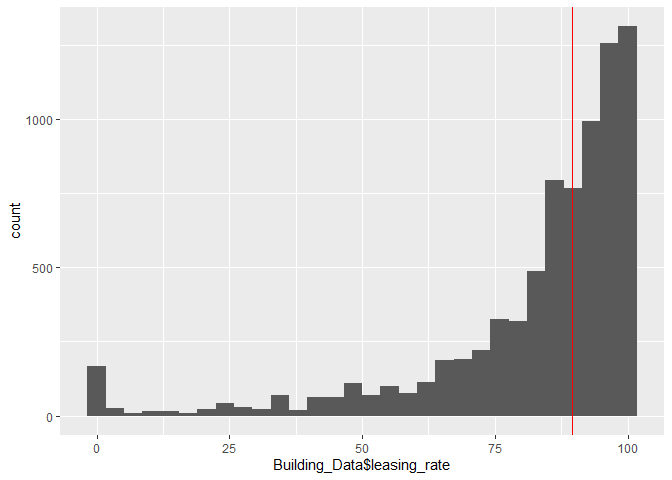<!-- -->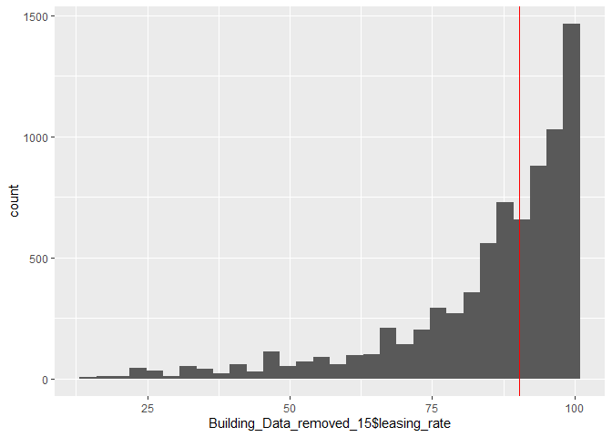<!-- -->

``` r
median(Building_Data$leasing_rate)
```

    ## [1] 89.53

``` r
median(Building_Data_removed_15$leasing_rate)
```

    ## [1] 90.25

### Now let us consider green and non-green buildings seperately

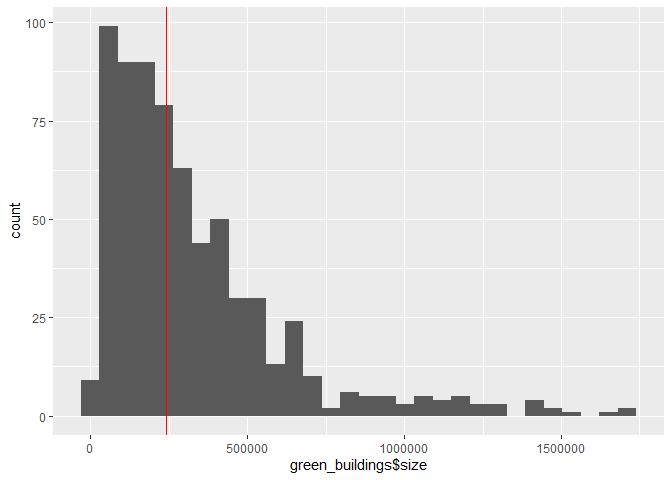<!-- -->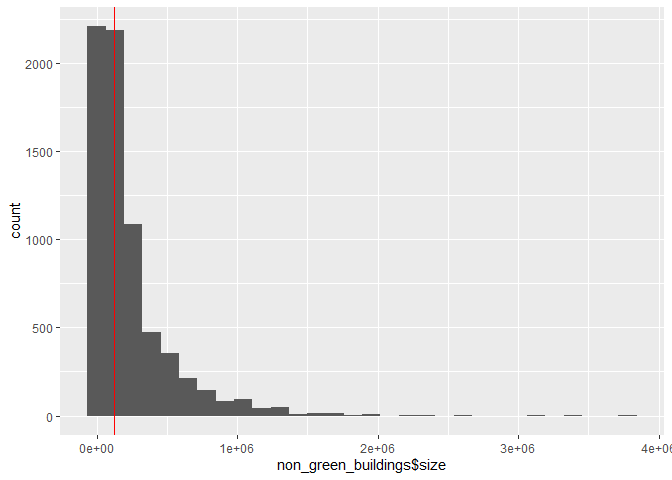<!-- -->

    ## [1] "The median size for green buildings is : "
    ## [2] "241199"

    ## [1] "The median size for non-green buildings is : "
    ## [2] "123442"

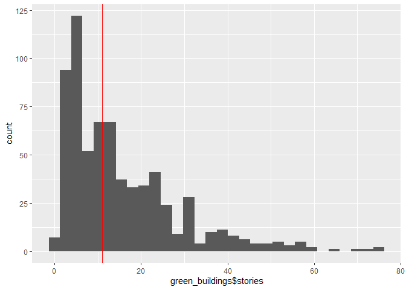<!-- -->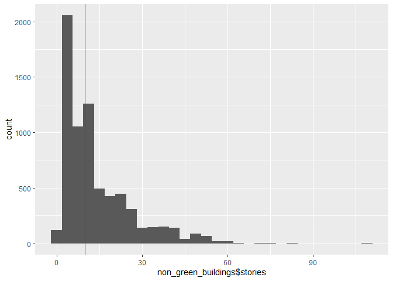<!-- -->

    ## [1] "The median stories for green buildings is : "

    ## [1] 11

    ## [1] "The median stories for non-green buildings is : "

    ## [1] 10

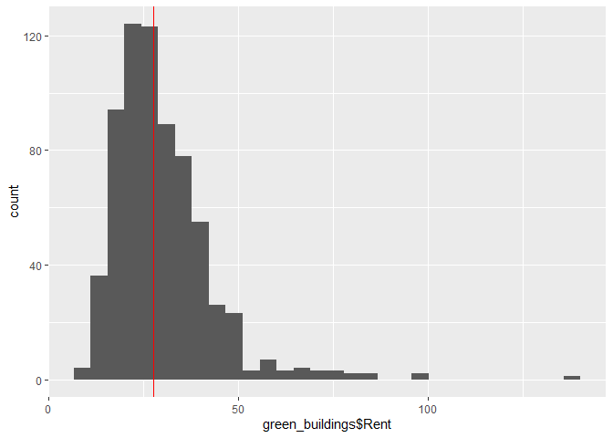<!-- -->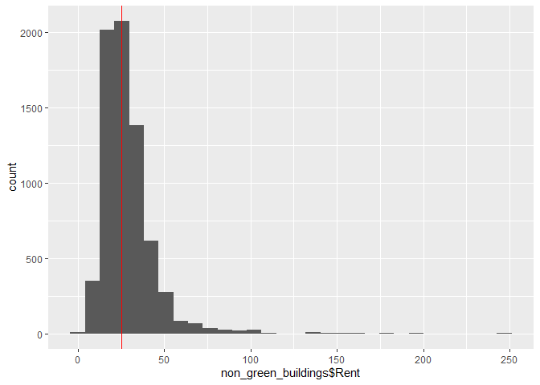<!-- -->

    ## [1] "The median rent for green buildings is : "

    ## [1] 27.6

    ## [1] "The median rent for non-green buildings is : "

    ## [1] 25.06

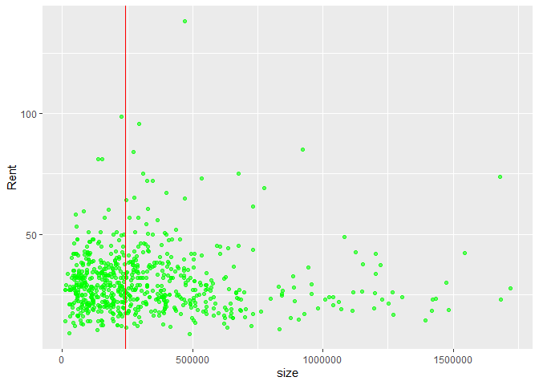<!-- -->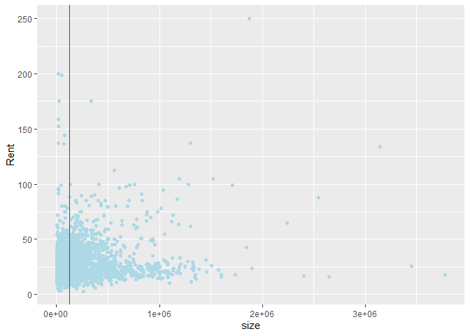<!-- -->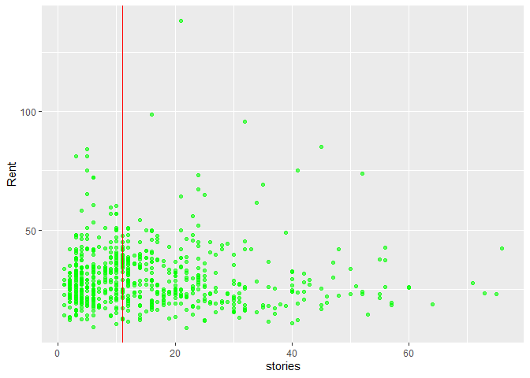<!-- -->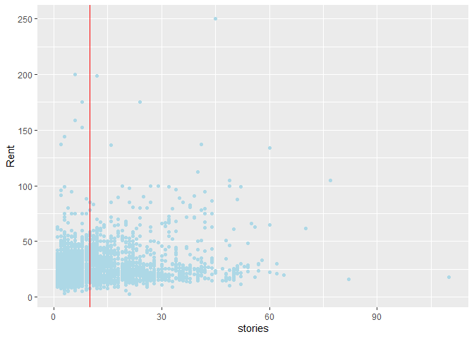<!-- -->

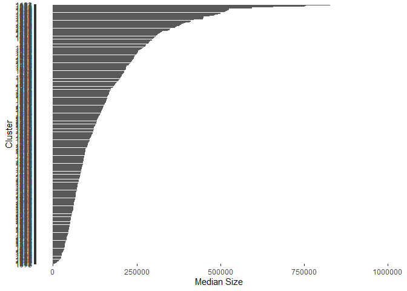<!-- -->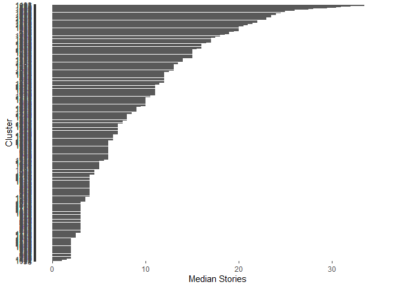<!-- -->

From our initial analysis, we believe that it wouldnt be an accurate
representation of the data to pick the median value of the entire
dataset. This is because the question in context only refers to a
building of size 250,000 sq.feet and 15 stories and hence it makes more
sense to consider only clusters with median size and stories around
those values while calculating the Rent

With this in mind, let us shrink the data to obtain buildings in
clusters with median height to be around 250,000 and stories 15. From
the problem statement, we know that the building is a new 15-story
mixed-use building on East Cesar Chavez, just across I-35 from downtown.
given that downtown is known to have more high rise buildings than the
other parts of Austin, we beileive we should include only the subset of
clusters with this median size and storey
height.

### Finding average median among green buildings of stories and size

``` r
BD3=green_buildings[(average_median[2]>150000) & (average_median[2]<350000) & (average_median_stories[2]>11) & (average_median_stories[2]<30), ] 
```

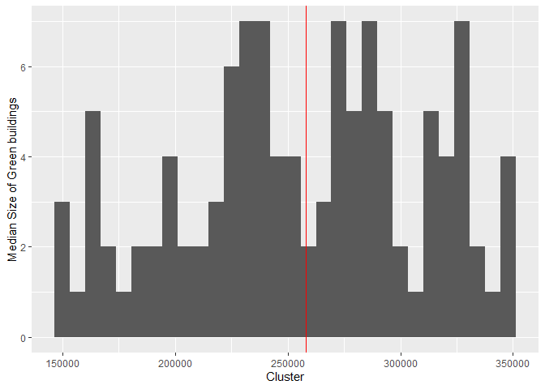<!-- -->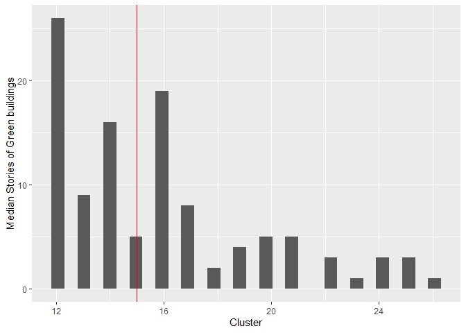<!-- -->
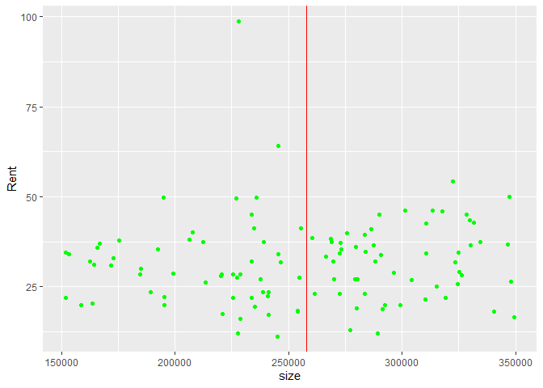<!-- -->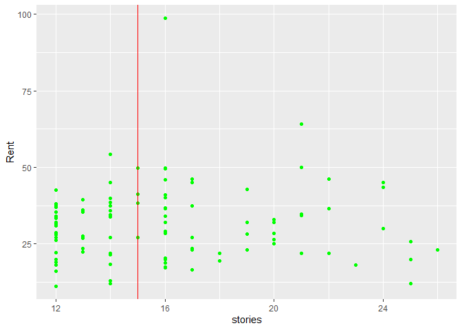<!-- -->

``` r
ggplot(data=BD3, aes(BD3$Rent)) + 
  geom_histogram() +
geom_vline(data=BD3, aes(xintercept = median(BD3$Rent)), colour="red") 
```

    ## `stat_bin()` using `bins = 30`. Pick better value with `binwidth`.

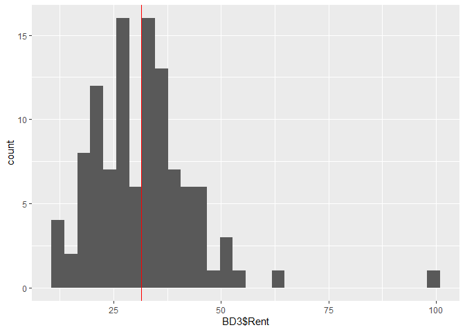<!-- -->

``` r
median(BD3$Rent)
```

    ## [1] 31.45

#### From this we see that the rent is 31.45

### Now let us calculate for non-green buildings in the same cluster.

``` r
BD2_non_green=Building_Data[which(!Building_Data$green_rating == 1), ] 


BD3_non_green=BD2_non_green[(average_median[2]>150000) & (average_median[2]<350000) & (average_median_stories[2]>11) & (average_median_stories[2]<30), ] 
```

We are now calculating the median Rent price for Non-green buildings in
the clusters present with average size 250,000 and storey height
15.

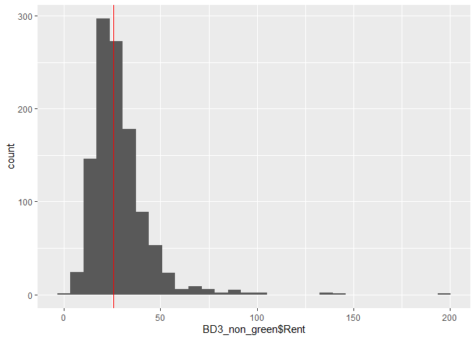<!-- -->

    ## [1] 25.48

### Conclusion :

Median Rent for green buildings in clusters with median size = 250000
and median stories 15: 31.45

Median Rent for non-green buildings in clusters with median size =
250000 and median stories 15: 25.48

Hence difference is : 31.45-25.48 = 5.97; 5.97\*250,000=1,492,500

Amount taken to construct 5,000,000; Hence it is : 5,000,000/1,492,500  
**3.35 years to gain the money back**

But let us see the median leasing rate :
\#92.285

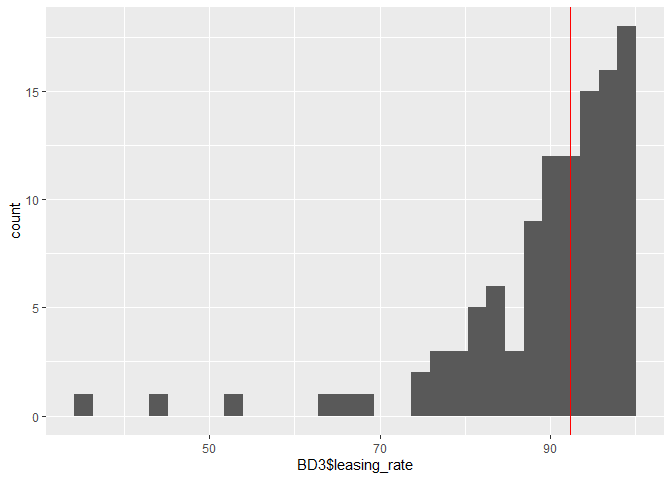<!-- -->

3.35/92.285 = 3.63 years

Even with a leasing rate of 92%, it shall take 3.63 years to earn back
the money and the building will have an extra profit of $1,492,500 per
year

# Flights at ABIA

Dataset contains all incoming and outgoing Flights flying in and out of
the Austin-Bergstrom Interational Airport.

## Reading in the data

Here’s a peak into the dataset: 1. 99260 rows of data mapped to 29
columns  
2\. Missing values - It can be observed from the table given below that
the number of missing values for certain columns such as
CarrierDelay,WeatherDelay,NASDelay,SecurityDelay,LateAircraftDelay are
way too high (i.e 79513). Hence it may not be very helpful to use these
in our analysis.

    ## [1] 99260    29

    ##          Column Name Missing_Count
    ## 1               Year             0
    ## 2              Month             0
    ## 3         DayofMonth             0
    ## 4          DayOfWeek             0
    ## 5            DepTime          1413
    ## 6         CRSDepTime             0
    ## 7            ArrTime          1567
    ## 8         CRSArrTime             0
    ## 9      UniqueCarrier             0
    ## 10         FlightNum             0
    ## 11           TailNum             0
    ## 12 ActualElapsedTime          1601
    ## 13    CRSElapsedTime            11
    ## 14           AirTime          1601
    ## 15          ArrDelay          1601
    ## 16          DepDelay          1413
    ## 17            Origin             0
    ## 18              Dest             0
    ## 19          Distance             0
    ## 20            TaxiIn          1567
    ## 21           TaxiOut          1419
    ## 22         Cancelled             0
    ## 23  CancellationCode             0
    ## 24          Diverted             0
    ## 25      CarrierDelay         79513
    ## 26      WeatherDelay         79513
    ## 27          NASDelay         79513
    ## 28     SecurityDelay         79513
    ## 29 LateAircraftDelay         79513

# Overview of Insights

Here’s a list of interesting insights we’d like to gather from the
dataset:  
1\. What are the top 5 destinations that people tend to fly to from
Austin?  
2\. What times of the year get most traffic to the top 5 destinations
from Austin?  
3\. Arrival and Departure Delays by Carrier  
4\. Delays by time of the day vs Month  
5\. Visualization of incoming and outgoing Air traffic from ABIA

### Top 5 Destinations from Austin

The top 5 destinations people fly out to from Austin are Dallas,
Dallas(again\!), Houston, Phoenix and Denver. There are over 11000
flights from Austin to Dallas in 2008, which is almost a staggering 900
outgoing flights to Dallas from Austin\!  
Dallas-Forth Worth International Airport (DFW) serves as headquarters to
the world’s largest carrier, American Airlines, while Dallas Love (DAL)
is home to the world’s biggest low-cost carrier, Southwest. Dallas could
arguably be considered the most important city in the U.S. aviation
industry.  
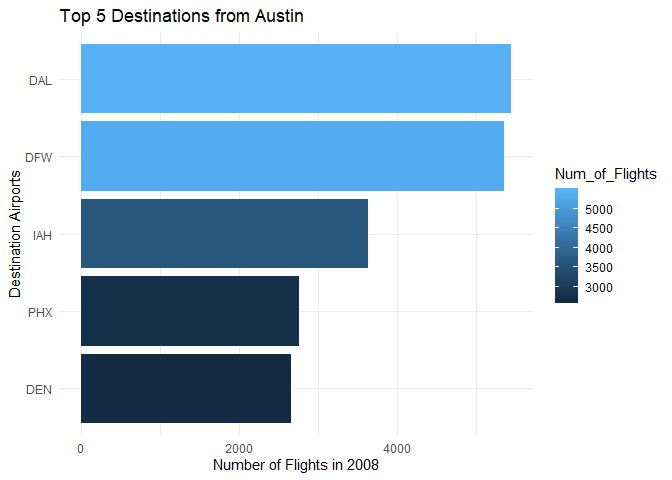<!-- -->

    ## [1] "DAL" "DFW" "IAH" "PHX" "DEN"

### Monthwise trends in departures to Top 5 Destinations

Digging deeper to see if there are any interesting trends in frequency
of flights to these top 5 destinations, we found that there was a
noticeable change in the number of departures to the aiports in Dallas -
DFW and DAL. This was peculiar because we would expect the distribution
to be remotely similar to both these airports with the end destinations
being the same\!  
What is important to note here is the period in context. 2008 was a
tough year for global economies. The impact on businesses was also
evident. We figured that 2008, especially the latter part of the year,
must have been a tough year for Southwest Airlines (DAL is home to this
low-cost budget airlines company). Our intuition turned out to be true
as can be seen in this interview with the CEO from 2008 -
<https://www.sfgate.com/business/article/Southwest-CEO-describes-2008-s-challenges-3292577.php>

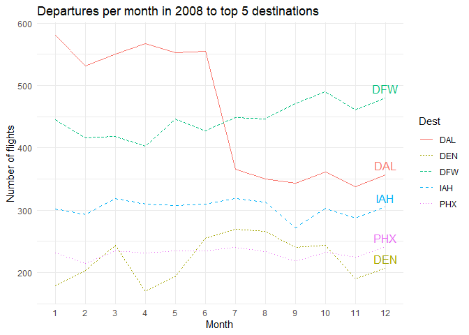<!-- -->

### Delay Analysis

“Research in consumer psychology shows that customers seek reasons for
service failures and that attributions of blame moderate the effects of
failure on the level of customer satisfaction” - Quoted in a journal
titled “The Impact of Service Operations Failures on Customer
Satisfaction: Evidence on How Failures and Their Source Affect What
Matters to Customers”
(<https://pdfs.semanticscholar.org/1487/dc65b163be21554246aac9b9884c7916d671.pdf>)

Delays in arrival or departure thus contribute significantly to customer
experience while flying in a particular airline. Thus, we decided to
look into average delays in departure and
arrival.  
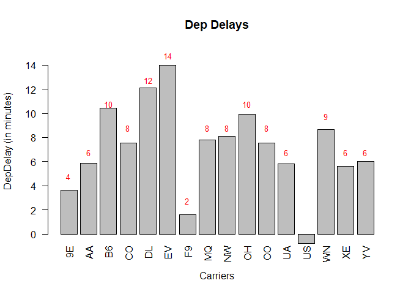<!-- -->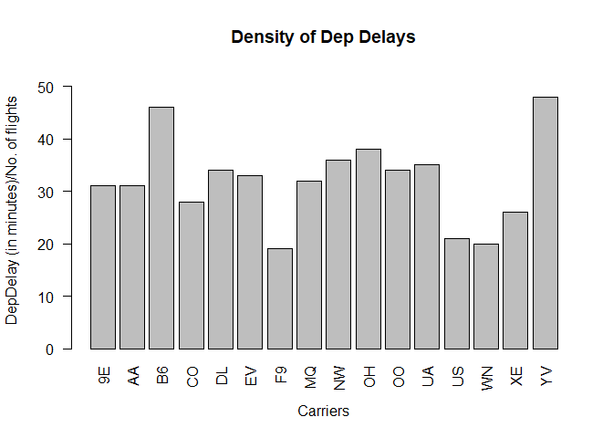<!-- -->

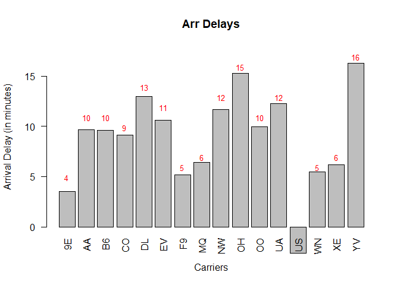<!-- -->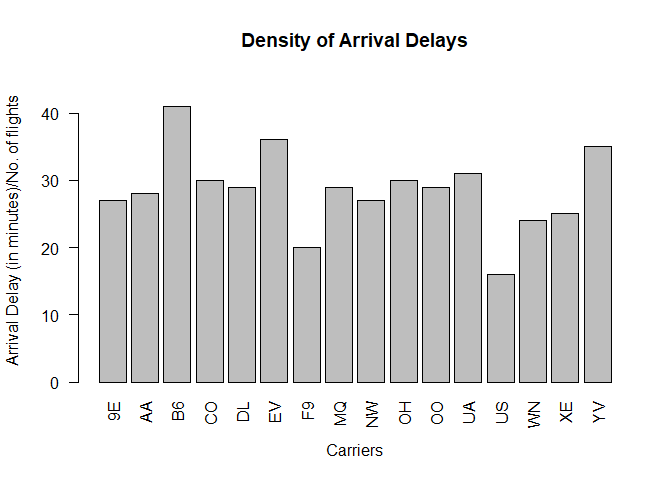<!-- -->

First we plotted the Delay in minutes for both Departure and Arrival
with respect to the Carrier. However, the data was not conclusive. This
was because the number of flights per airlines in this given dataset
varies considerably. Hence to get a more accurate representation of the
airline carriers who tend to have the most delays, we calculated the
delay densities of each airline by computing the total delay by the
number of flights departed/arrived for each carrier.

### Delay by time of the day

To find out the times of the day when delays are most likely, we
bucketed the Scheduled Departure time into 7 buckets as follows:  
1\. Early Morning (12am - 6am)  
2\. Morning (6am - 9am)  
3\. Pre-Afternoon (9am - 12pm)  
4\. Affternoon (12pm - 3pm)  
5\. Evening (3pm - 6pm)  
6\. Night (6pm- 9pm)  
7\. Late Night (9pm - 12am)

We are now plotting the most likely zones of delay in a day by
month.

    ## Joining, by = c("Month", "CRSDepTimeCategory")

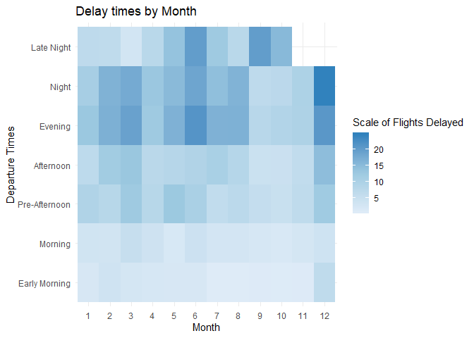<!-- -->
It can be seen from the graph above that the upper half of the graph
depecting the latter parts of a day have more darker shaded squares
implying that ***more delays happen in the second half of the day***.
*Highest delays can be observed in the month of December* given the
obvious weather conditions, especially at Night.

### Visualization depicting Flights out of Austin

    ## The following objects are masked from abia (pos = 3):
    ## 
    ##     ActualElapsedTime, AirTime, ArrDelay, ArrTime,
    ##     CancellationCode, Cancelled, CarrierDelay, CRSArrTime,
    ##     CRSDepTime, CRSElapsedTime, DayofMonth, DayOfWeek, DepDelay,
    ##     DepTime, Dest, Distance, Diverted, FlightNum, ï..Year,
    ##     LateAircraftDelay, Month, NASDelay, Origin, SecurityDelay,
    ##     TailNum, TaxiIn, TaxiOut, UniqueCarrier, WeatherDelay
    ## 
    ## The following objects are masked from abia (pos = 3):
    ## 
    ##     ActualElapsedTime, AirTime, ArrDelay, ArrTime,
    ##     CancellationCode, Cancelled, CarrierDelay, CRSArrTime,
    ##     CRSDepTime, CRSElapsedTime, DayofMonth, DayOfWeek, DepDelay,
    ##     DepTime, Dest, Distance, Diverted, FlightNum, ï..Year,
    ##     LateAircraftDelay, Month, NASDelay, Origin, SecurityDelay,
    ##     TailNum, TaxiIn, TaxiOut, UniqueCarrier, WeatherDelay

    ## The following objects are masked from abia (pos = 4):
    ## 
    ##     ActualElapsedTime, AirTime, ArrDelay, ArrTime,
    ##     CancellationCode, Cancelled, CarrierDelay, CRSArrTime,
    ##     CRSDepTime, CRSElapsedTime, DayofMonth, DayOfWeek, DepDelay,
    ##     DepTime, Dest, Distance, Diverted, FlightNum, ï..Year,
    ##     LateAircraftDelay, Month, NASDelay, Origin, SecurityDelay,
    ##     TailNum, TaxiIn, TaxiOut, UniqueCarrier, WeatherDelay

<!-- -->

# Portfolio Modeling

### Loading all required libraries

``` r
library(mosaic)
library(quantmod)
```

    ## Loading required package: xts

    ## Loading required package: zoo

    ## 
    ## Attaching package: 'zoo'

    ## The following objects are masked from 'package:base':
    ## 
    ##     as.Date, as.Date.numeric

    ## Registered S3 method overwritten by 'xts':
    ##   method     from
    ##   as.zoo.xts zoo

    ## 
    ## Attaching package: 'xts'

    ## The following objects are masked from 'package:dplyr':
    ## 
    ##     first, last

    ## Loading required package: TTR

    ## Registered S3 method overwritten by 'quantmod':
    ##   method            from
    ##   as.zoo.data.frame zoo

    ## Version 0.4-0 included new data defaults. See ?getSymbols.

``` r
library(foreach)
```

    ## 
    ## Attaching package: 'foreach'

    ## The following objects are masked from 'package:purrr':
    ## 
    ##     accumulate, when

### 1\. Importing top 3 oil & gas ETF’s - last 5 yrs data - Portfolio 1

### 2\. Importing top 3 Building\&Construction & top 2 Commodities ETF’s - last 5 yrs data - Portfolio 2

### 3\. Import top 7 Diversified Portfolio ETF’s - last 5 yrs data - Portfolio 3

### Creating an all return matrix for all the 3 portfolios

``` r
# Import top 3 oil & gas ETF's - last 5 yrs data
etf1 = c("USO", "UNG", "DBO")

# Import top 3 Building&Construction & top 2 Commodities ETF's - last 5 yrs data
etf2 = c("ITB", "XHB", "PKB","PDBC","DBC")

# Import top 7 Diversified Portfolio ETF's - last 5 yrs data
etf3 = c("AOR", "AOM", "AOA", "MDIV", "AOK", "IYLD", "GAL")

#Getting data for past 5 years
getSymbols(etf1, from = "2014-08-01")
```

    ## 'getSymbols' currently uses auto.assign=TRUE by default, but will
    ## use auto.assign=FALSE in 0.5-0. You will still be able to use
    ## 'loadSymbols' to automatically load data. getOption("getSymbols.env")
    ## and getOption("getSymbols.auto.assign") will still be checked for
    ## alternate defaults.
    ## 
    ## This message is shown once per session and may be disabled by setting 
    ## options("getSymbols.warning4.0"=FALSE). See ?getSymbols for details.

    ## [1] "USO" "UNG" "DBO"

``` r
getSymbols(etf2, from = "2014-08-01")
```

    ## [1] "ITB"  "XHB"  "PKB"  "PDBC" "DBC"

``` r
getSymbols(etf3, from = "2014-08-01")
```

    ## pausing 1 second between requests for more than 5 symbols

    ## pausing 1 second between requests for more than 5 symbols
    ## pausing 1 second between requests for more than 5 symbols

    ## [1] "AOR"  "AOM"  "AOA"  "MDIV" "AOK"  "IYLD" "GAL"

``` r
for(ticker in etf1) {
    expr = paste0(ticker, "a = adjustOHLC(", ticker, ")")
    eval(parse(text=expr))
}

all_returns1 = cbind(   ClCl(USOa),
                                ClCl(UNGa),
                                ClCl(DBOa))

# Creating all return matrix for Portfolio 1
all_returns1 = as.matrix(na.omit(all_returns1))
summary(all_returns1)
```

    ##    ClCl.USOa            ClCl.UNGa           ClCl.DBOa         
    ##  Min.   :-0.0831541   Min.   :-0.756614   Min.   :-0.0870556  
    ##  1st Qu.:-0.0124779   1st Qu.:-0.014690   1st Qu.:-0.0112771  
    ##  Median : 0.0002980   Median :-0.001302   Median : 0.0009195  
    ##  Mean   :-0.0006534   Mean   :-0.001416   Mean   :-0.0006600  
    ##  3rd Qu.: 0.0120503   3rd Qu.: 0.012868   3rd Qu.: 0.0105080  
    ##  Max.   : 0.0924041   Max.   : 0.188993   Max.   : 0.0890411

``` r
for(ticker in etf2) {
    expr = paste0(ticker, "a = adjustOHLC(", ticker, ")")
    eval(parse(text=expr))
}

all_returns2 = cbind(   ClCl(ITBa),
                                ClCl(XHBa),
                                ClCl(PKBa),
                                ClCl(PDBCa),
                                ClCl(DBCa))

# Creating all return matrix for Portfolio 2
all_returns2 = as.matrix(na.omit(all_returns2))
summary(all_returns2)
```

    ##    ClCl.ITBa            ClCl.XHBa            ClCl.PKBa         
    ##  Min.   :-0.0501931   Min.   :-0.0465761   Min.   :-0.0478842  
    ##  1st Qu.:-0.0069297   1st Qu.:-0.0063134   1st Qu.:-0.0065789  
    ##  Median : 0.0008004   Median : 0.0005689   Median : 0.0012680  
    ##  Mean   : 0.0005021   Mean   : 0.0003140   Mean   : 0.0003718  
    ##  3rd Qu.: 0.0084590   3rd Qu.: 0.0073877   3rd Qu.: 0.0075040  
    ##  Max.   : 0.0464876   Max.   : 0.0503418   Max.   : 0.0482122  
    ##    ClCl.PDBCa           ClCl.DBCa         
    ##  Min.   :-0.0493328   Min.   :-0.0457944  
    ##  1st Qu.:-0.0055831   1st Qu.:-0.0059568  
    ##  Median : 0.0000000   Median : 0.0000000  
    ##  Mean   :-0.0002593   Mean   :-0.0002639  
    ##  3rd Qu.: 0.0057179   3rd Qu.: 0.0055215  
    ##  Max.   : 0.0476750   Max.   : 0.0360861

``` r
for(ticker in etf3) {
    expr = paste0(ticker, "a = adjustOHLC(", ticker, ")")
    eval(parse(text=expr))
}

all_returns3 = cbind(   ClCl(AORa),
                                ClCl(AOMa),
                                ClCl(AOAa),
                                ClCl(MDIVa),
                                ClCl(AOKa),
                                ClCl(IYLDa),
                                ClCl(GALa))
# Creating all return matrix for Portfolio 3
all_returns3 = as.matrix(na.omit(all_returns3))
summary(all_returns3)
```

    ##    ClCl.AORa            ClCl.AOMa            ClCl.AOAa         
    ##  Min.   :-0.0314434   Min.   :-0.0200057   Min.   :-0.0437299  
    ##  1st Qu.:-0.0022689   1st Qu.:-0.0019459   1st Qu.:-0.0028063  
    ##  Median : 0.0002597   Median : 0.0002751   Median : 0.0005639  
    ##  Mean   : 0.0002259   Mean   : 0.0001857   Mean   : 0.0002596  
    ##  3rd Qu.: 0.0030133   3rd Qu.: 0.0024087   3rd Qu.: 0.0039806  
    ##  Max.   : 0.0205751   Max.   : 0.0158020   Max.   : 0.0284864  
    ##    ClCl.MDIVa           ClCl.AOKa            ClCl.IYLDa        
    ##  Min.   :-0.0307452   Min.   :-0.0143162   Min.   :-0.0173639  
    ##  1st Qu.:-0.0027056   1st Qu.:-0.0014490   1st Qu.:-0.0018668  
    ##  Median : 0.0000000   Median : 0.0002996   Median : 0.0004001  
    ##  Mean   : 0.0001174   Mean   : 0.0001648   Mean   : 0.0001530  
    ##  3rd Qu.: 0.0033227   3rd Qu.: 0.0018016   3rd Qu.: 0.0024075  
    ##  Max.   : 0.0326959   Max.   : 0.0100794   Max.   : 0.0130293  
    ##    ClCl.GALa         
    ##  Min.   :-0.0313433  
    ##  1st Qu.:-0.0026262  
    ##  Median : 0.0002952  
    ##  Mean   : 0.0001732  
    ##  3rd Qu.: 0.0033881  
    ##  Max.   : 0.0209423

### Calculating VAR for Portfolio 1

#### From the summary of returns, it seems ETF “UNG” has a neagtive mean and median return. Hence assigning weights as (0.4,0.2,0.4) to have lesser weights on “UNG”

``` r
# Monte Carlo Simulation to Calculate VAR for Portfolio 1
initial_wealth = 100000
# 5000 simulations
sim1 = foreach(i=1:5000, .combine='rbind') %do% {
    total_wealth = initial_wealth
    weights = c(0.4, 0.2, 0.4)
    holdings = weights * total_wealth
    n_days = 20
    wealthtracker1 = rep(0, n_days)
    for(today in 1:n_days) {
        return.today = resample(all_returns1, 1, orig.ids=FALSE)
        holdings = holdings + holdings*return.today
        total_wealth = sum(holdings)
        wealthtracker1[today] = total_wealth
        holdings = weights * total_wealth #re-balancing each day
        
    }
    ((wealthtracker1[20]-initial_wealth)*100)/initial_wealth
    
}
sorted_sim_1=sort(sim1)
VAR1=sorted_sim_1[250]
VAR1
```

    ## [1] -14.45913

### Calculating VAR for Portfolio 2

#### From the summary of returns, it seems ETF “PDBC” and “DBC” hvae neagtive mean returns. Hence assigning the weights accordingly as (0.2,0.3,0.3,0.1,0.1) to have lesser weights on “PDBC” and “DBC”

``` r
# Monte Carlo Simulation to Calculate VAR for Portfolio 2
initial_wealth = 100000
#5000 Simulations
sim2 = foreach(i=1:5000, .combine='rbind') %do% {
    total_wealth = initial_wealth
    weights = c(0.2, 0.3, 0.3, 0.1, 0.1)
    holdings = weights * total_wealth
    n_days = 20 #20 trading day
    wealthtracker2 = rep(0, n_days)
    for(today in 1:n_days) {
        return.today = resample(all_returns2, 1, orig.ids=FALSE)
        holdings = holdings + holdings*return.today
        total_wealth = sum(holdings)
        wealthtracker2[today] = total_wealth
        holdings = weights * total_wealth #re-balancing each day
        
    }
    ((wealthtracker2[20]-initial_wealth)*100)/initial_wealth
    
}
sorted_sim_2=sort(sim2)
VAR2=sorted_sim_2[250]
VAR2
```

    ## [1] -6.41525

### Calculating VAR for Portfolio 3

#### From the summary of returns, all ETF’s have comparable returns. Hence assigning almost equal weights to them.

``` r
# Monte Carlo Simulation to Calculate VAR for Portfolio 3
initial_wealth = 100000
#5000 simulations
sim3 = foreach(i=1:5000, .combine='rbind') %do% {
    total_wealth = initial_wealth
    weights = c(0.15, 0.15, 0.15, 0.15,0.15,0.15,0.1)
    holdings = weights * total_wealth
    n_days = 20
    wealthtracker3 = rep(0, n_days)
    for(today in 1:n_days) {
        return.today = resample(all_returns3, 1, orig.ids=FALSE)
        holdings = holdings + holdings*return.today
        total_wealth = sum(holdings)
        wealthtracker3[today] = total_wealth
        holdings = weights * total_wealth #re-balancing each day
        
    }
    ((wealthtracker3[20]-initial_wealth)*100)/initial_wealth
    
}
sorted_sim_3=sort(sim3)
VAR3=sorted_sim_3[250]
VAR3
```

    ## [1] -2.907506

``` r
print("Final Report")
```

    ## [1] "Final Report"

``` r
cat("\nPortfolio 1 containing top 3 oil & gas ETF's - ",etf1, "\n4-week (20 trading day) VAR at the 5% level = ", VAR1,"%")
```

    ## 
    ## Portfolio 1 containing top 3 oil & gas ETF's -  USO UNG DBO 
    ## 4-week (20 trading day) VAR at the 5% level =  -14.45913 %

``` r
cat("\n\nPortfolio 2 containing top 3 Building&Construction & top 2 Commodities ETF's - ",etf2, "\n4-week (20 trading day) VAR at the 5% level = ", VAR2,"%")
```

    ## 
    ## 
    ## Portfolio 2 containing top 3 Building&Construction & top 2 Commodities ETF's -  ITB XHB PKB PDBC DBC 
    ## 4-week (20 trading day) VAR at the 5% level =  -6.41525 %

``` r
cat("\n\nPortfolio 3 containing top 7 Diversified Portfolio ETF's - ",etf3, "\n4-week (20 trading day) VAR at the 5% level = ", VAR3,"%")
```

    ## 
    ## 
    ## Portfolio 3 containing top 7 Diversified Portfolio ETF's -  AOR AOM AOA MDIV AOK IYLD GAL 
    ## 4-week (20 trading day) VAR at the 5% level =  -2.907506 %

### **Final Report**

| Portfolio | ETF List                                          | ETF Category                                     | 4-week VAR |
| --------- | ------------------------------------------------- | ------------------------------------------------ | ---------- |
| 1         | “USO”, “UNG”, “DBO”                               | Top 3 oil & gas                                  | \-14.64 %  |
| 2         | “ITB”, “XHB”, “PKB”,“PDBC”,“DBC”                  | Top 3 Building\&Construction & top 2 Commodities | \-6.68 %   |
| 3         | “AOR”, “AOM”, “AOA”, “MDIV”, “AOK”, “IYLD”, “GAL” | Top 7 Diversified Portfolios                     | \-2.79 %   |

# Market segmentation

### Removing Spam, Adult, Chatter and Uncategorized as these columns are introducing noise into the Data

``` r
Market_seg = subset(Market_seg, select = -c(spam,adult ,chatter, uncategorized))
head(Market_seg)
```

### Running K-means on the Data

``` r
set.seed(12)

# Center and scale the data
X = scale(Market_seg, center=TRUE, scale=TRUE)

# Extract the centers and scales from the rescaled data (which are named attributes)
mu = attr(X,"scaled:center")
sigma = attr(X,"scaled:scale")

# Run k-means with 6 clusters and 25 starts
clust1 = kmeans(X, 6, nstart=25)
```

### Cluster 1 Importance

``` r
#Sorted values of importance of each cluster

sort(clust1$center[1,]*sigma + mu,decreasing=TRUE)
```

    ##         politics           travel             news    photo_sharing 
    ##        8.9330422        5.6084425        5.2940320        2.5429403 
    ##        computers       automotive    sports_fandom health_nutrition 
    ##        2.4745269        2.3362445        2.0101892        1.6652111 
    ##   current_events             food         shopping      college_uni 
    ##        1.6622999        1.4425036        1.3857351        1.3318777 
    ##          cooking          tv_film           dating         religion 
    ##        1.2605531        1.2110626        1.0655022        1.0291121 
    ## personal_fitness        parenting         outdoors           family 
    ##        1.0072780        0.9432314        0.9184862        0.9126638 
    ##    online_gaming              art           school          fashion 
    ##        0.8558952        0.7510917        0.7248908        0.6768559 
    ##         business           crafts            music   sports_playing 
    ##        0.6710335        0.6433770        0.6390102        0.6273654 
    ##  home_and_garden              eco   small_business           beauty 
    ##        0.6128093        0.5997089        0.4861718        0.4759825

``` r
length(which(clust1$cluster == 1))
```

    ## [1] 687

### Cluster 2 Importance

``` r
sort(clust1$center[2,]*sigma + mu, decreasing=TRUE)
```

    ## health_nutrition personal_fitness          cooking         outdoors 
    ##       12.0067720        6.4537246        3.2663657        2.7415350 
    ##    photo_sharing             food   current_events         shopping 
    ##        2.6896163        2.1331828        1.5519187        1.4683973 
    ##         politics           travel    sports_fandom             news 
    ##        1.2550790        1.2381490        1.1659142        1.1038375 
    ##           dating          tv_film      college_uni              eco 
    ##        1.0349887        0.9887133        0.9480813        0.9209932 
    ##    online_gaming          fashion           family        parenting 
    ##        0.8510158        0.7945824        0.7787810        0.7652370 
    ##         religion              art            music       automotive 
    ##        0.7607223        0.7449210        0.7347630        0.6625282 
    ##  home_and_garden   sports_playing           school           crafts 
    ##        0.6467269        0.6151242        0.5959368        0.5936795 
    ##        computers         business           beauty   small_business 
    ##        0.5575621        0.4683973        0.4243792        0.2945824

``` r
length(which(clust1$cluster == 2))
```

    ## [1] 886

### Cluster 3 Importance

``` r
sort(clust1$center[3,]*sigma + mu,decreasing=TRUE)
```

    ##      college_uni    online_gaming    photo_sharing   sports_playing 
    ##       10.3554084        9.2516556        2.8697572        2.5673289 
    ##          tv_film health_nutrition           travel   current_events 
    ##        1.9403974        1.7262693        1.5452539        1.5298013 
    ##          cooking         shopping    sports_fandom         politics 
    ##        1.4746137        1.4017660        1.3421634        1.2737307 
    ##             food              art            music           family 
    ##        1.2693157        1.1876380        1.1368653        1.0551876 
    ## personal_fitness          fashion       automotive         religion 
    ##        0.9955850        0.8962472        0.8896247        0.8476821 
    ##             news           dating        parenting         outdoors 
    ##        0.7902870        0.7373068        0.6732892        0.6710817 
    ##  home_and_garden           crafts        computers           school 
    ##        0.6158940        0.5960265        0.5717439        0.5253863 
    ##   small_business              eco           beauty         business 
    ##        0.4944812        0.4856512        0.4547461        0.4503311

``` r
length(which(clust1$cluster == 3))
```

    ## [1] 453

### Cluster 4 Importance

``` r
sort(clust1$center[4,]*sigma + mu,decreasing=TRUE)
```

    ##    sports_fandom         religion             food        parenting 
    ##        5.8951507        5.2555701        4.5661861        4.0589777 
    ##           school    photo_sharing           family health_nutrition 
    ##        2.7090433        2.6304063        2.4980341        1.8505898 
    ##   current_events          cooking         shopping           travel 
    ##        1.6802097        1.6159895        1.4823067        1.3446920 
    ##      college_uni personal_fitness         politics           beauty 
    ##        1.2005242        1.1887287        1.1677588        1.1009174 
    ##           crafts          tv_film       automotive             news 
    ##        1.0825688        1.0498034        1.0498034        1.0340760 
    ##          fashion    online_gaming              art           dating 
    ##        1.0275229        1.0117955        0.8754915        0.7942333 
    ##   sports_playing        computers            music         outdoors 
    ##        0.7391874        0.7313237        0.7313237        0.6815203 
    ##              eco  home_and_garden         business   small_business 
    ##        0.6605505        0.6461337        0.5032765        0.4010485

``` r
length(which(clust1$cluster == 4))
```

    ## [1] 763

### Cluster 5 Importance

``` r
sort(clust1$center[5,]*sigma + mu,decreasing=TRUE)
```

    ##          cooking    photo_sharing          fashion           beauty 
    ##       10.9057592        6.1169284        5.5305410        3.8935428 
    ## health_nutrition         shopping   current_events           travel 
    ##        2.2844677        2.0209424        1.7591623        1.4938918 
    ##      college_uni         politics personal_fitness            music 
    ##        1.4607330        1.4048866        1.3560209        1.2146597 
    ##    sports_fandom             news    online_gaming             food 
    ##        1.1326353        1.0506108        1.0471204        1.0453752 
    ##          tv_film           school           dating           family 
    ##        1.0226876        0.9842932        0.9441536        0.9109948 
    ##              art       automotive         religion         outdoors 
    ##        0.9057592        0.9057592        0.8446771        0.8132635 
    ##   sports_playing        parenting        computers           crafts 
    ##        0.8080279        0.8062827        0.7277487        0.6352531 
    ##  home_and_garden         business              eco   small_business 
    ##        0.6212914        0.6125654        0.5776614        0.4851658

``` r
length(which(clust1$cluster == 5))
```

    ## [1] 573

### Cluster 6 Importance

``` r
sort(clust1$center[6,]*sigma + mu,decreasing=TRUE)
```

    ##    photo_sharing   current_events         shopping           travel 
    ##        2.2818584        1.4446903        1.2774336        1.0975664 
    ## health_nutrition         politics          tv_film    sports_fandom 
    ##        1.0951327        1.0123894        0.9871681        0.9723451 
    ##      college_uni          cooking             food             news 
    ##        0.8880531        0.8495575        0.7690265        0.6942478 
    ## personal_fitness              art       automotive    online_gaming 
    ##        0.6590708        0.6221239        0.5809735        0.5803097 
    ##           family            music           dating         religion 
    ##        0.5721239        0.5519912        0.5471239        0.5254425 
    ##          fashion           school        parenting  home_and_garden 
    ##        0.5148230        0.4769912        0.4584071        0.4384956 
    ##   sports_playing         outdoors              eco        computers 
    ##        0.4141593        0.4024336        0.3882743        0.3734513 
    ##           crafts           beauty         business   small_business 
    ##        0.3623894        0.3491150        0.3365044        0.2761062

``` r
length(which(clust1$cluster == 6))
```

    ## [1] 4520

``` r
# qplot is in the ggplot2 library
qplot(parenting,family , data=Market_seg, color=factor(clust1$cluster))
```

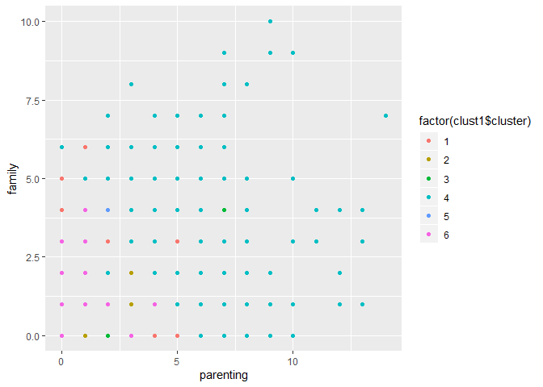<!-- -->

``` r
qplot(cooking, photo_sharing, data=Market_seg, color=factor(clust1$cluster))
```

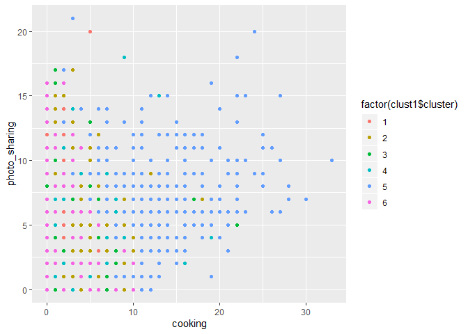<!-- -->

### Running K-Means++

``` r
X = scale(Market_seg, center=TRUE, scale=TRUE)

# Extract the centers and scales from the rescaled data (which are named attributes)
mu = attr(X,"scaled:center")
sigma = attr(X,"scaled:scale")


clust2 = kmeanspp(X, k=6, nstart=25)
```

### Cluster 1 Importance

``` r
sort(clust2$center[1,]*sigma + mu,decreasing=TRUE)
```

    ## health_nutrition personal_fitness          cooking         outdoors 
    ##       12.0067720        6.4537246        3.2663657        2.7415350 
    ##    photo_sharing             food   current_events         shopping 
    ##        2.6896163        2.1331828        1.5519187        1.4683973 
    ##         politics           travel    sports_fandom             news 
    ##        1.2550790        1.2381490        1.1659142        1.1038375 
    ##           dating          tv_film      college_uni              eco 
    ##        1.0349887        0.9887133        0.9480813        0.9209932 
    ##    online_gaming          fashion           family        parenting 
    ##        0.8510158        0.7945824        0.7787810        0.7652370 
    ##         religion              art            music       automotive 
    ##        0.7607223        0.7449210        0.7347630        0.6625282 
    ##  home_and_garden   sports_playing           school           crafts 
    ##        0.6467269        0.6151242        0.5959368        0.5936795 
    ##        computers         business           beauty   small_business 
    ##        0.5575621        0.4683973        0.4243792        0.2945824

``` r
length(which(clust2$cluster == 1))
```

    ## [1] 886

### Cluster 2 Importance

``` r
sort(clust2$center[2,]*sigma + mu,decreasing=TRUE)
```

    ##         politics           travel             news    photo_sharing 
    ##        8.9330422        5.6084425        5.2940320        2.5429403 
    ##        computers       automotive    sports_fandom health_nutrition 
    ##        2.4745269        2.3362445        2.0101892        1.6652111 
    ##   current_events             food         shopping      college_uni 
    ##        1.6622999        1.4425036        1.3857351        1.3318777 
    ##          cooking          tv_film           dating         religion 
    ##        1.2605531        1.2110626        1.0655022        1.0291121 
    ## personal_fitness        parenting         outdoors           family 
    ##        1.0072780        0.9432314        0.9184862        0.9126638 
    ##    online_gaming              art           school          fashion 
    ##        0.8558952        0.7510917        0.7248908        0.6768559 
    ##         business           crafts            music   sports_playing 
    ##        0.6710335        0.6433770        0.6390102        0.6273654 
    ##  home_and_garden              eco   small_business           beauty 
    ##        0.6128093        0.5997089        0.4861718        0.4759825

``` r
length(which(clust2$cluster == 2))
```

    ## [1] 687

### Cluster 3 Importance

``` r
sort(clust2$center[3,]*sigma + mu,decreasing=TRUE)
```

    ##    photo_sharing   current_events         shopping           travel 
    ##        2.2818584        1.4446903        1.2774336        1.0975664 
    ## health_nutrition         politics          tv_film    sports_fandom 
    ##        1.0951327        1.0123894        0.9871681        0.9723451 
    ##      college_uni          cooking             food             news 
    ##        0.8880531        0.8495575        0.7690265        0.6942478 
    ## personal_fitness              art       automotive    online_gaming 
    ##        0.6590708        0.6221239        0.5809735        0.5803097 
    ##           family            music           dating         religion 
    ##        0.5721239        0.5519912        0.5471239        0.5254425 
    ##          fashion           school        parenting  home_and_garden 
    ##        0.5148230        0.4769912        0.4584071        0.4384956 
    ##   sports_playing         outdoors              eco        computers 
    ##        0.4141593        0.4024336        0.3882743        0.3734513 
    ##           crafts           beauty         business   small_business 
    ##        0.3623894        0.3491150        0.3365044        0.2761062

``` r
length(which(clust2$cluster == 3))
```

    ## [1] 4520

### Cluster 4 Importance

``` r
sort(clust2$center[4,]*sigma + mu,decreasing=TRUE)
```

    ##      college_uni    online_gaming    photo_sharing   sports_playing 
    ##       10.3554084        9.2516556        2.8697572        2.5673289 
    ##          tv_film health_nutrition           travel   current_events 
    ##        1.9403974        1.7262693        1.5452539        1.5298013 
    ##          cooking         shopping    sports_fandom         politics 
    ##        1.4746137        1.4017660        1.3421634        1.2737307 
    ##             food              art            music           family 
    ##        1.2693157        1.1876380        1.1368653        1.0551876 
    ## personal_fitness          fashion       automotive         religion 
    ##        0.9955850        0.8962472        0.8896247        0.8476821 
    ##             news           dating        parenting         outdoors 
    ##        0.7902870        0.7373068        0.6732892        0.6710817 
    ##  home_and_garden           crafts        computers           school 
    ##        0.6158940        0.5960265        0.5717439        0.5253863 
    ##   small_business              eco           beauty         business 
    ##        0.4944812        0.4856512        0.4547461        0.4503311

``` r
length(which(clust2$cluster == 4))
```

    ## [1] 453

### Cluster 5 Importance

``` r
sort(clust2$center[5,]*sigma + mu,decreasing=TRUE)
```

    ##    sports_fandom         religion             food        parenting 
    ##        5.8951507        5.2555701        4.5661861        4.0589777 
    ##           school    photo_sharing           family health_nutrition 
    ##        2.7090433        2.6304063        2.4980341        1.8505898 
    ##   current_events          cooking         shopping           travel 
    ##        1.6802097        1.6159895        1.4823067        1.3446920 
    ##      college_uni personal_fitness         politics           beauty 
    ##        1.2005242        1.1887287        1.1677588        1.1009174 
    ##           crafts          tv_film       automotive             news 
    ##        1.0825688        1.0498034        1.0498034        1.0340760 
    ##          fashion    online_gaming              art           dating 
    ##        1.0275229        1.0117955        0.8754915        0.7942333 
    ##   sports_playing        computers            music         outdoors 
    ##        0.7391874        0.7313237        0.7313237        0.6815203 
    ##              eco  home_and_garden         business   small_business 
    ##        0.6605505        0.6461337        0.5032765        0.4010485

``` r
length(which(clust2$cluster == 5))
```

    ## [1] 763

### Cluster 6 Importance

``` r
sort(clust2$center[6,]*sigma + mu,decreasing=TRUE)
```

    ##          cooking    photo_sharing          fashion           beauty 
    ##       10.9057592        6.1169284        5.5305410        3.8935428 
    ## health_nutrition         shopping   current_events           travel 
    ##        2.2844677        2.0209424        1.7591623        1.4938918 
    ##      college_uni         politics personal_fitness            music 
    ##        1.4607330        1.4048866        1.3560209        1.2146597 
    ##    sports_fandom             news    online_gaming             food 
    ##        1.1326353        1.0506108        1.0471204        1.0453752 
    ##          tv_film           school           dating           family 
    ##        1.0226876        0.9842932        0.9441536        0.9109948 
    ##              art       automotive         religion         outdoors 
    ##        0.9057592        0.9057592        0.8446771        0.8132635 
    ##   sports_playing        parenting        computers           crafts 
    ##        0.8080279        0.8062827        0.7277487        0.6352531 
    ##  home_and_garden         business              eco   small_business 
    ##        0.6212914        0.6125654        0.5776614        0.4851658

``` r
length(which(clust2$cluster == 6))
```

    ## [1] 573

``` r
# Compare versus within-cluster average distances from the first run
clust1$withinss
```

    ## [1] 27155.47 23304.05 15249.75 27035.57 19526.55 70904.67

``` r
clust2$withinss
```

    ## [1] 23304.05 27155.47 70904.67 15249.75 27035.57 19526.55

``` r
sum(clust1$withinss)
```

    ## [1] 183176.1

``` r
sum(clust2$withinss)
```

    ## [1] 183176.1

``` r
clust1$tot.withinss
```

    ## [1] 183176.1

``` r
clust2$tot.withinss
```

    ## [1] 183176.1

``` r
clust1$betweenss
```

    ## [1] 69015.94

``` r
clust2$betweenss
```

    ## [1] 69015.94

\#PC Correlation

``` r
M=cor(Market_seg)
corrplot(M, method="color")
```

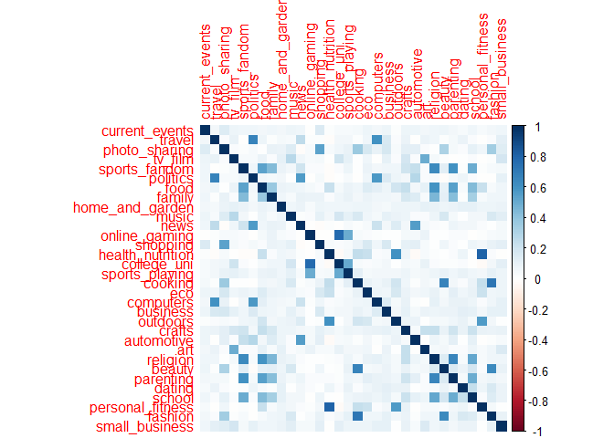<!-- -->

``` r
#we can see the correlations are quite high and positive hence we can proceed with PCA
```

### We can see the correlation is high so we can run PC to get good results

``` r
dim(Market_seg)  
```

    ## [1] 7882   32

``` r
pr_Market_seg = prcomp(Market_seg, center = TRUE,scale=TRUE)

summary(pr_Market_seg)
```

    ## Importance of components:
    ##                           PC1     PC2     PC3     PC4     PC5     PC6
    ## Standard deviation     2.0987 1.66483 1.59119 1.52912 1.46728 1.28477
    ## Proportion of Variance 0.1376 0.08661 0.07912 0.07307 0.06728 0.05158
    ## Cumulative Proportion  0.1376 0.22426 0.30338 0.37645 0.44372 0.49531
    ##                            PC7     PC8     PC9    PC10    PC11    PC12
    ## Standard deviation     1.21616 1.17377 1.05325 0.99329 0.96596 0.96133
    ## Proportion of Variance 0.04622 0.04305 0.03467 0.03083 0.02916 0.02888
    ## Cumulative Proportion  0.54153 0.58458 0.61925 0.65008 0.67924 0.70812
    ##                           PC13    PC14    PC15    PC16    PC17    PC18
    ## Standard deviation     0.93945 0.92125 0.90796 0.84582 0.80888 0.75382
    ## Proportion of Variance 0.02758 0.02652 0.02576 0.02236 0.02045 0.01776
    ## Cumulative Proportion  0.73570 0.76222 0.78798 0.81034 0.83079 0.84854
    ##                           PC19    PC20    PC21    PC22    PC23    PC24
    ## Standard deviation     0.69548 0.68732 0.65389 0.64963 0.63916 0.63190
    ## Proportion of Variance 0.01512 0.01476 0.01336 0.01319 0.01277 0.01248
    ## Cumulative Proportion  0.86366 0.87842 0.89178 0.90497 0.91774 0.93022
    ##                           PC25    PC26    PC27    PC28    PC29    PC30
    ## Standard deviation     0.61729 0.59925 0.59437 0.55190 0.48581 0.47790
    ## Proportion of Variance 0.01191 0.01122 0.01104 0.00952 0.00738 0.00714
    ## Cumulative Proportion  0.94212 0.95335 0.96439 0.97390 0.98128 0.98842
    ##                           PC31    PC32
    ## Standard deviation     0.43861 0.42223
    ## Proportion of Variance 0.00601 0.00557
    ## Cumulative Proportion  0.99443 1.00000

``` r
plot(pr_Market_seg, type='l')
```

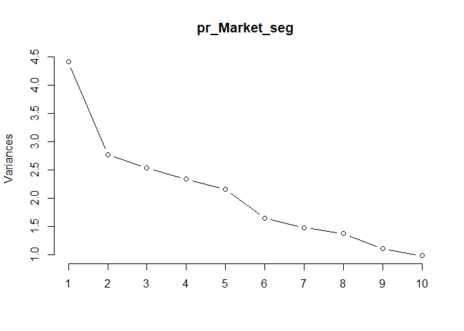<!-- -->

``` r
screeplot(pr_Market_seg, type = "l", npcs = 40, main = "Screeplot")
abline(h = 1, col="red", lty=5)
legend("topright", legend=c("Eigenvalue = 1"),
       col=c("red"), lty=5, cex=0.6)
```

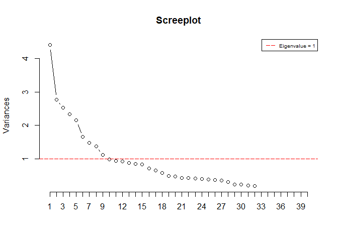<!-- -->

``` r
#We see that it is eigen value=1 at 10

cumpro <- cumsum(pr_Market_seg$sdev^2 / sum(pr_Market_seg$sdev^2))
plot(cumpro[0:40], xlab = "PC #", ylab = "Amount of explained variance", main = "Cumulative variance plot")
abline(v =10, col="blue", lty=5)
abline(h = 0.65008, col="blue", lty=5)
legend("topleft", legend=c("Cut-off @ PC10"),
       col=c("blue"), lty=5, cex=0.6)
```

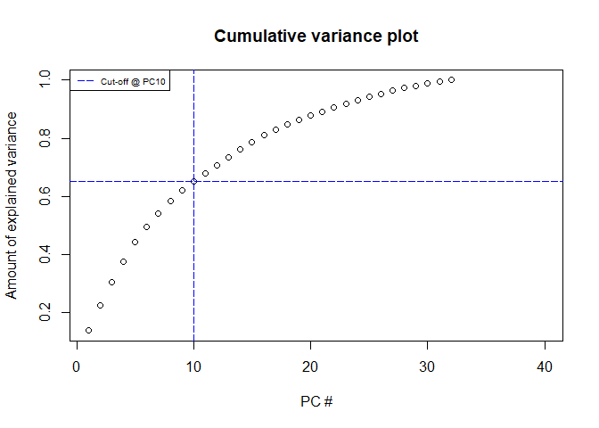<!-- -->

``` r
#changed h= 0.65008 (Cumulative Proportion of PC10 and c=10)
```

``` r
scores = pr_Market_seg$x


# first, what are PCs themselves?
loadings = pr_Market_seg$rotation
```

Obtain value of Scores\[1:10\]

``` r
scores = pr_Market_seg$x

# First for principal components
comp <- data.frame(scores[,1:10])
```

### Running PCA with Kmeans++

``` r
X = scale(comp, center=TRUE, scale=TRUE)

k <- kmeanspp(X, 6, nstart=25, iter.max=1000)

palette(alpha(brewer.pal(9,'Set1'), 0.5))

mu = attr(X,"scaled:center")
sigma = attr(X,"scaled:scale")


plot(X, col=k$clust, pch=16)
```

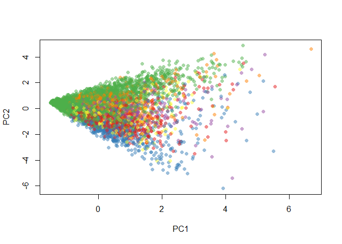<!-- -->

### Compare within-cluster average distances of K-means, K-means++ and PCA & K-means++

``` r
clust1$withinss
```

    ## [1] 27155.47 23304.05 15249.75 27035.57 19526.55 70904.67

``` r
clust2$withinss
```

    ## [1] 23304.05 27155.47 70904.67 15249.75 27035.57 19526.55

``` r
k$withinss
```

    ## [1]  6480.758  5297.841 30014.482  3743.047  4077.147  3485.892

``` r
sum(clust1$withinss)
```

    ## [1] 183176.1

``` r
sum(clust2$withinss)
```

    ## [1] 183176.1

``` r
sum(k$withinss)
```

    ## [1] 53099.17

``` r
clust1$tot.withinss
```

    ## [1] 183176.1

``` r
clust2$tot.withinss
```

    ## [1] 183176.1

``` r
k$tot.withinss
```

    ## [1] 53099.17

``` r
clust1$betweenss
```

    ## [1] 69015.94

``` r
clust2$betweenss
```

    ## [1] 69015.94

``` r
k$betweenss
```

    ## [1] 25710.83

### We see that PC and k-means++ has the least Sum of Squares Value.

### Hence we can group clusters as the following :

### Cluster 1 Importance

``` r
sort(k$center[1,]*sigma + mu,decreasing=TRUE)
```

    ##         PC4         PC1        PC10         PC9         PC6         PC7 
    ##  2.51540595  0.71683506  0.02872280 -0.01176949 -0.03754623 -0.08232453 
    ##         PC8         PC2         PC5         PC3 
    ## -0.14263836 -1.12568746 -1.19550541 -1.28578460

``` r
loadings[,4] %>% sort %>% tail(5)
```

    ##             news         politics         outdoors personal_fitness 
    ##        0.1561362        0.1674941        0.3859715        0.4206180 
    ## health_nutrition 
    ##        0.4371116

``` r
loadings[,1] %>% sort %>% tail(5)
```

    ##        school sports_fandom     parenting          food      religion 
    ##     0.2891255     0.3048968     0.3103991     0.3129646     0.3155037

``` r
length(which(k$cluster == 1))
```

    ## [1] 965

### Cluster 2 Importance

``` r
sort(k$center[2,]*sigma + mu,decreasing=TRUE)
```

    ##        PC5        PC1        PC8        PC6        PC9       PC10 
    ##  2.1624513  1.6671991  0.8022032  0.7715380  0.4171705 -0.2251113 
    ##        PC7        PC3        PC4        PC2 
    ## -0.6717882 -1.2026610 -1.3193694 -2.6328090

``` r
loadings[,5] %>% sort %>% tail(5)
```

    ##      shopping photo_sharing       cooking       fashion        beauty 
    ##     0.1095403     0.1987926     0.2164123     0.2763861     0.2913377

``` r
loadings[,1] %>% sort %>% tail(5)
```

    ##        school sports_fandom     parenting          food      religion 
    ##     0.2891255     0.3048968     0.3103991     0.3129646     0.3155037

``` r
loadings[,8] %>% sort %>% tail(5)
```

    ##     beauty        art    tv_film automotive       news 
    ##  0.1904156  0.2859857  0.2958033  0.3486988  0.3868053

``` r
loadings[,6] %>% sort %>% tail(5)
```

    ##     automotive        cooking    college_uni sports_playing  online_gaming 
    ##      0.1648397      0.1675754      0.1716209      0.2148155      0.2748557

``` r
length(which(k$cluster == 2))
```

    ## [1] 620

### Cluster 3 Importance

``` r
sort(k$center[3,]*sigma + mu,decreasing=TRUE)
```

    ##          PC2          PC5         PC10          PC7          PC9 
    ##  0.538192377  0.172525413  0.065860292 -0.003610533 -0.049342701 
    ##          PC8          PC3          PC4          PC6          PC1 
    ## -0.174906362 -0.208343578 -0.290116224 -0.355169288 -0.631608809

``` r
loadings[,2] %>% sort %>% tail(5)
```

    ##        school          food     parenting      religion sports_fandom 
    ##     0.1919208     0.2029964     0.2758494     0.2954711     0.3022585

``` r
loadings[,5] %>% sort %>% tail(5)
```

    ##      shopping photo_sharing       cooking       fashion        beauty 
    ##     0.1095403     0.1987926     0.2164123     0.2763861     0.2913377

``` r
length(which(k$cluster == 3))
```

    ## [1] 4897

### Cluster 4 Importance

``` r
sort(k$center[4,]*sigma + mu,decreasing=TRUE)
```

    ##         PC3         PC1         PC4         PC5         PC9         PC6 
    ##  4.34207984  1.44618607  1.31650395  0.73142392  0.50122778  0.31957726 
    ##        PC10         PC2         PC8         PC7 
    ## -0.08361426 -0.09851091 -1.02804478 -1.66380780

``` r
loadings[,3] %>% sort %>% tail(5)
```

    ## automotive       news  computers     travel   politics 
    ##  0.1856782  0.3469595  0.3786674  0.4407475  0.5030263

``` r
loadings[,1] %>% sort %>% tail(5)
```

    ##        school sports_fandom     parenting          food      religion 
    ##     0.2891255     0.3048968     0.3103991     0.3129646     0.3155037

``` r
loadings[,4] %>% sort %>% tail(5)
```

    ##             news         politics         outdoors personal_fitness 
    ##        0.1561362        0.1674941        0.3859715        0.4206180 
    ## health_nutrition 
    ##        0.4371116

``` r
loadings[,5] %>% sort %>% tail(5)
```

    ##      shopping photo_sharing       cooking       fashion        beauty 
    ##     0.1095403     0.1987926     0.2164123     0.2763861     0.2913377

``` r
length(which(k$cluster == 4))
```

    ## [1] 417

### Cluster 5 Importance

``` r
sort(k$center[5,]*sigma + mu,decreasing=TRUE)
```

    ##        PC7        PC8        PC3        PC6        PC1        PC2 
    ##  2.0968303  1.9526960  1.6363461  0.8944689  0.8537379  0.8210315 
    ##        PC4        PC5       PC10        PC9 
    ##  0.7207142  0.3635357  0.0656516 -0.3349882

``` r
loadings[,7] %>% sort %>% tail(5)
```

    ## current_events           news  photo_sharing       shopping     automotive 
    ##      0.1941290      0.2699245      0.3117548      0.4291261      0.5138149

``` r
loadings[,8] %>% sort %>% tail(5)
```

    ##     beauty        art    tv_film automotive       news 
    ##  0.1904156  0.2859857  0.2958033  0.3486988  0.3868053

``` r
loadings[,3] %>% sort %>% tail(5)
```

    ## automotive       news  computers     travel   politics 
    ##  0.1856782  0.3469595  0.3786674  0.4407475  0.5030263

``` r
length(which(k$cluster == 5))
```

    ## [1] 566

### Cluster 6 Importance

``` r
sort(k$center[6,]*sigma + mu,decreasing=TRUE)
```

    ##         PC6         PC1         PC3         PC7         PC9         PC8 
    ##  1.57700105  0.67458958  0.64717332  0.04948332 -0.06010930 -0.43101869 
    ##        PC10         PC2         PC4         PC5 
    ## -0.51069062 -0.81660164 -2.74715813 -3.69946995

``` r
loadings[,6] %>% sort %>% tail(5)
```

    ##     automotive        cooking    college_uni sports_playing  online_gaming 
    ##      0.1648397      0.1675754      0.1716209      0.2148155      0.2748557

``` r
loadings[,1] %>% sort %>% tail(5)
```

    ##        school sports_fandom     parenting          food      religion 
    ##     0.2891255     0.3048968     0.3103991     0.3129646     0.3155037

``` r
loadings[,3] %>% sort %>% tail(5)
```

    ## automotive       news  computers     travel   politics 
    ##  0.1856782  0.3469595  0.3786674  0.4407475  0.5030263

``` r
length(which(k$cluster == 6))
```

    ## [1] 417

### Conclusion

After running K means on PC, we see that there is high correlation
between the six clusters. Here is what we gathered from the results of
running a K-means ++ algorithm on the subset of data obtained from PC
Analysis.

**Middle aged Parents:** In the first cluster, we see that News and
Politics pops up as well as personal fitness and health nutrition. Some
other features include parenting, sports\_fandom and school. This led us
to believe that this cluster could consist mostly of adults who are
probably parents and those who follow the news and politics
consistently. They tend to focus on nutritional welfare of their kids
and are constantly on the look out for new recipes to experiement for
their kids. People in this assumed age bracket also tend to be middle
aged and hence more conscious about their health & fitness.

**Stay at home Mums:** In the second cluster, we see a high importance
for beauty, fashion,cooking ,shopping,photo-sharing and art. We can
assume that this cluster caters to young women and mothers. People in
this cluster also follow the news, watch films on tv and are interested
in art. Online gaming is an interesting topic to have surfaced in this
cluster as well.

**Working mothers:** In the third cluster, we see a high importance for
religion, parenting and food and school. The same can also be observed
for shopping, cooking, fashion and beauty. Thus, we believe that the
third cluster is an equally representative mix of the above two
clusters. This would fit the role of a working mom whose attention is
split usually between her own needs and that of her family.

**Media person:** In the fourth cluster, travel, computers ,politics ,
automotive have high importance. Fashion, beauty, cooking and
photo-sharing also make the list. Thus, this cluster could represent a
person who is mostly in the limelight and would like to stay abreast on
global trends. They probably travel a lot for their work and hence are
on the constant look out for new places and food to explore.

**Gen Z young-gun:** In cluster five, we see a high importance for
automotive, current events, tv\_film. We also see significant weights
for fashion, beauty and photo-sharing. This would appear to be the
subset of people who are young and are constantly on social media. They
need to know what’s happening in the world around and make their
presence felt on the internet.

**College students:** In cluster six, we see a high impportance for
online\_gaming, sports\_playing, college\_uni, school, sports\_fandom,
cooking and automotive. These are mostly viable topics of interest for
students in College. Hence, we believe that this cluster would be an
ideal match for College students.

# "Author Attribution

### Loading all the required libraries

``` r
library(tm) 
```

    ## Loading required package: NLP

    ## 
    ## Attaching package: 'NLP'

    ## The following object is masked from 'package:ggplot2':
    ## 
    ##     annotate

    ## 
    ## Attaching package: 'tm'

    ## The following object is masked from 'package:mosaic':
    ## 
    ##     inspect

``` r
library(magrittr)
```

    ## 
    ## Attaching package: 'magrittr'

    ## The following object is masked from 'package:ggmap':
    ## 
    ##     inset

    ## The following object is masked from 'package:purrr':
    ## 
    ##     set_names

    ## The following object is masked from 'package:tidyr':
    ## 
    ##     extract

``` r
library(slam)
library(proxy)
```

    ## 
    ## Attaching package: 'proxy'

    ## The following object is masked from 'package:Matrix':
    ## 
    ##     as.matrix

    ## The following objects are masked from 'package:stats':
    ## 
    ##     as.dist, dist

    ## The following object is masked from 'package:base':
    ## 
    ##     as.matrix

``` r
library(kknn)
library(caret)
```

    ## 
    ## Attaching package: 'caret'

    ## The following object is masked from 'package:kknn':
    ## 
    ##     contr.dummy

    ## The following object is masked from 'package:purrr':
    ## 
    ##     lift

    ## The following object is masked from 'package:mosaic':
    ## 
    ##     dotPlot

``` r
library(randomForest)
```

    ## randomForest 4.6-14

    ## Type rfNews() to see new features/changes/bug fixes.

    ## 
    ## Attaching package: 'randomForest'

    ## The following object is masked from 'package:ggplot2':
    ## 
    ##     margin

    ## The following object is masked from 'package:dplyr':
    ## 
    ##     combine

### Reading both train and test files together and performing transformations together to deal with the uniformity issue between test and train data.

#### Since transformations are performed on the combined wordlist, and then split later into the initial test and train sets, it alleviates the issue of dealing with words in the test set that we never saw in the training set.

``` r
readerPlain = function(fname){
  readPlain(elem=list(content=readLines(fname)), 
            id=fname, language='en') }

file_list = Sys.glob('C:/Users/nithi/Downloads/STA380-master/STA380-master/data/ReutersC50/*/*/*.txt')
reuters=lapply(file_list, readerPlain) 


mynames = file_list %>%
  { strsplit(., '/', fixed=TRUE) } %>%
  { lapply(., tail, n=2) } %>%
  { lapply(., paste0, collapse = '') } %>%
  unlist

# Rename the articles
names(reuters) = mynames

#Getting the author name to be used later for classification.
first.word <- function(my.string){
  unlist(strsplit(my.string, '[0-9]'))[1]
}
reuter_name=sapply(mynames, first.word)
```

### Content Transformations and creating a doc-term-matrix

#### 1\. Convert all words to lower case

#### 2\. Remove words

#### 3\. Remove punctuation

#### 4\. Remove any excess white spaces

#### 5\. Remove stop words

#### 6\. Stemming the words to get word roots.

### Removing all words that doesnt occur in 97% of the documents.

``` r
documents_raw = Corpus(VectorSource(reuters))

my_documents = documents_raw
my_documents = tm_map(my_documents, content_transformer(tolower)) # make everything lowercase
my_documents = tm_map(my_documents, content_transformer(removeNumbers)) # remove numbers
my_documents = tm_map(my_documents, content_transformer(removePunctuation)) # remove punctuation
my_documents = tm_map(my_documents, content_transformer(stripWhitespace)) ## remove excess white-space
my_documents = tm_map(my_documents, content_transformer(removeWords), stopwords("en")) # remove stop words
my_documents = tm_map(my_documents, content_transformer(stemDocument)) # stemming the document


## create a doc-term-matrix
DTM_reuters = DocumentTermMatrix(my_documents)

DTM_reuters = removeSparseTerms(DTM_reuters, 0.97) # Remove all words that doesnt occur in 97% of the documents.
```

### Calculating TF-IDF weights of the words and storing the matrix as a data frame object to be fed into a model.

### Assigning the author names extracted earlier as the final column of the dataframe “y\_train”

### Splitting the dataframe into the intial test and train data sets.

``` r
tfidf_reuters = weightTfIdf(DTM_reuters) # Calculating TF-IDF

df = as.data.frame(as.matrix(tfidf_reuters)) #Converting to a dataframe object to be fed into a model

#Assigning the author names as the class for each document.
df$y_train=reuter_name
df$y_train = factor(df$y_train)

#Splitting into train and test dataframes.
df_train <- df[1:2500, ]
df_test <- df[2501:5000, ]
```

### Principal component Analysis to get most important features.

#### Almost 75% of variance is explained by taking the 400 components. Hence subsetting the output of PCA to select only 400 componenets.

``` r
X = as.matrix(tfidf_reuters)
X=X[c(1:2500),]

scrub_cols = which(colSums(X) == 0)
X = X[,-scrub_cols]

set.seed(123)
pca_reuters = prcomp(X, scale=TRUE)
plot(summary(pca_reuters)$importance[3,], xlab = "Components",
     ylab = "Cumulative % Variance Explained")
```

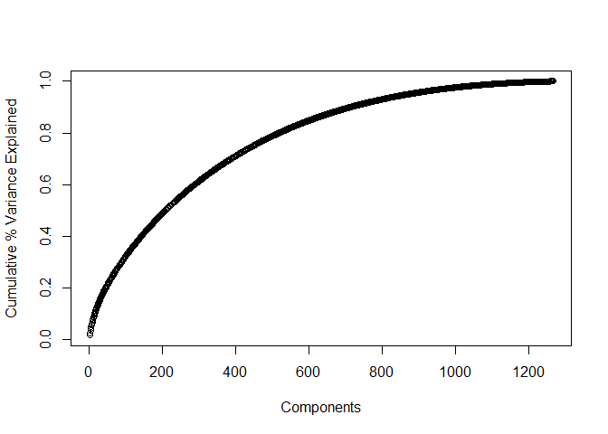<!-- -->

``` r
train_pca = data.frame(pca_reuters$x)
train_pca = train_pca[,1:400]
train_pca$y_train=df_train$y_train
```

### Using KNN model. Input train dataframe has features selected through PCA

#### Optimum value of k selected through cross-validation. Here k=2 obtained.

#### Model gives an accuracy of 40.4% on the test data.

#### KNN using cosine yielded lower accuracy. Hence, went for the default measurement of the KNN function.

``` r
set.seed(123)
#Choosing the optimum k for KNN using cross validation. We get k=1.
trControl <- trainControl(method  = "cv",
                          number  = 5)
fit <- train(y_train~.,
             method     = "knn",
             tuneGrid   = expand.grid(k = c(2,5,8,10)),
             trControl  = trControl,
             metric     = "Accuracy",
             data       = train_pca)

y_test <- df_test$y_train
df_test$y_train <- NULL

fit
```

    ## k-Nearest Neighbors 
    ## 
    ## 2500 samples
    ##  400 predictor
    ##   50 classes: 'AaronPressman', 'AlanCrosby', 'AlexanderSmith', 'BenjaminKangLim', 'BernardHickey', 'BradDorfman', 'DarrenSchuettler', 'DavidLawder', 'EdnaFernandes', 'EricAuchard', 'FumikoFujisaki', 'GrahamEarnshaw', 'HeatherScoffield', 'JaneMacartney', 'JanLopatka', 'JimGilchrist', 'JoeOrtiz', 'JohnMastrini', 'JonathanBirt', 'JoWinterbottom', 'KarlPenhaul', 'KeithWeir', 'KevinDrawbaugh', 'KevinMorrison', 'KirstinRidley', 'KouroshKarimkhany', 'LydiaZajc', 'LynneO'Donnell', 'LynnleyBrowning', 'MarcelMichelson', 'MarkBendeich', 'MartinWolk', 'MatthewBunce', 'MichaelConnor', 'MureDickie', 'NickLouth', 'PatriciaCommins', 'PeterHumphrey', 'PierreTran', 'RobinSidel', 'RogerFillion', 'SamuelPerry', 'SarahDavison', 'ScottHillis', 'SimonCowell', 'TanEeLyn', 'TheresePoletti', 'TimFarrand', 'ToddNissen', 'WilliamKazer' 
    ## 
    ## No pre-processing
    ## Resampling: Cross-Validated (5 fold) 
    ## Summary of sample sizes: 2000, 2000, 2000, 2000, 2000 
    ## Resampling results across tuning parameters:
    ## 
    ##   k   Accuracy  Kappa    
    ##    2  0.6148    0.6069388
    ##    5  0.6132    0.6053061
    ##    8  0.5868    0.5783673
    ##   10  0.5836    0.5751020
    ## 
    ## Accuracy was used to select the optimal model using the largest value.
    ## The final value used for the model was k = 2.

``` r
test_pca_knn = predict(pca_reuters, newdata = df_test)
pca_predicted_knn = predict(fit, test_pca_knn)

conf=confusionMatrix(pca_predicted_knn, y_test )
conf$overall #Accuracy of the model = 40.4%
```

    ##       Accuracy          Kappa  AccuracyLower  AccuracyUpper   AccuracyNull 
    ##      0.4068000      0.3946939      0.3874626      0.4263561      0.0200000 
    ## AccuracyPValue  McnemarPValue 
    ##      0.0000000            NaN

### Running Random Forest model on the training set with features selected through PCA.

#### Accuracy obtained is 54.52%

``` r
set.seed(123)
pca_classifier = randomForest(train_pca[-401], df_train$y_train)

test_pca = predict(pca_reuters, newdata = df_test)
pca_predicted = predict(pca_classifier, test_pca)

conf_pca=confusionMatrix(pca_predicted, y_test )
conf_pca$overall
```

    ##       Accuracy          Kappa  AccuracyLower  AccuracyUpper   AccuracyNull 
    ##      0.5452000      0.5359184      0.5254372      0.5648567      0.0200000 
    ## AccuracyPValue  McnemarPValue 
    ##      0.0000000            NaN

### Running Random Forest Model on the full features and then doing variable selection.

#### Random Forest re-run using the selected features yields an accuracy of 63.12%.

``` r
set.seed(123)
fit_rf <- randomForest(x = df_train[-1282],
                          y = df_train$y_train)
predicted_values = predict(fit_rf, df_test)

cf_gen=confusionMatrix(predicted_values, y_test, dnn = c("Predicted", "Actual"))

#Selecting the first 400 important features.
importanceOrder=order(-fit_rf$importance)
names=rownames(fit_rf$importance)[importanceOrder]
names=names[c(1:400)]


classifier_new <- randomForest(x = df_train[names],
                          y = df_train$y_train)
predicted_values = predict(classifier_new, df_test[names])
cf=confusionMatrix(predicted_values, y_test, dnn = c("Predicted", "Actual"))
cf$overall
```

    ##       Accuracy          Kappa  AccuracyLower  AccuracyUpper   AccuracyNull 
    ##      0.6312000      0.6236735      0.6119422      0.6501499      0.0200000 
    ## AccuracyPValue  McnemarPValue 
    ##      0.0000000            NaN

## Conclusion

##### We tried different models using both feature reduction through PCA and feature selection through Random Forest. Out of KNN, Random Forest using PCA feature reduction and Random Forest through feature selection, the final one - “Random Forest model through feature selection” yielded the best result with an **accuracy of 63.12%.**

# Association Rule Mining

The dataset “Groceries” contains all transactions that consists of items
bought in the store by several customers over a period of time. As
business analysts, we hope to identify trends in customer purchase
behavior by analyzing their basket data.

**Association Rule Mining**  
Association Rule Mining is used when you want to find an association
between different objects in a set, find frequent patterns in a
transaction database, relational databases or any other information
repository. The applications of Association Rule Mining are found in
Marketing, Basket Data Analysis (or Market Basket Analysis) in
retailing, clustering and classification. It can tell you what items do
customers frequently buy together by generating a set of rules called
Association Rules. In simple words, it gives you output as rules in form
of this then
that.

## Pre-processing data to make the data readable for the Association Rules Mining.

The functions in the *arules* package only accept transaction data.
Hence the flat file needs to processed to ensure that the input to the
functions is as expected.

``` r
retail = scan('groceries.txt',what="", sep='\n')
head(retail)
```

    ## [1] "citrus fruit,semi-finished bread,margarine,ready soups"             
    ## [2] "tropical fruit,yogurt,coffee"                                       
    ## [3] "whole milk"                                                         
    ## [4] "pip fruit,yogurt,cream cheese ,meat spreads"                        
    ## [5] "other vegetables,whole milk,condensed milk,long life bakery product"
    ## [6] "whole milk,butter,yogurt,rice,abrasive cleaner"

``` r
str(retail)
```

    ##  chr [1:9835] "citrus fruit,semi-finished bread,margarine,ready soups" ...

``` r
summary(retail)
```

    ##    Length     Class      Mode 
    ##      9835 character character

``` r
groceries = strsplit(retail,",")

groctrans=as(groceries, "transactions")
summary(groctrans)
```

    ## transactions as itemMatrix in sparse format with
    ##  9835 rows (elements/itemsets/transactions) and
    ##  169 columns (items) and a density of 0.02609146 
    ## 
    ## most frequent items:
    ##       whole milk other vegetables       rolls/buns             soda 
    ##             2513             1903             1809             1715 
    ##           yogurt          (Other) 
    ##             1372            34055 
    ## 
    ## element (itemset/transaction) length distribution:
    ## sizes
    ##    1    2    3    4    5    6    7    8    9   10   11   12   13   14   15 
    ## 2159 1643 1299 1005  855  645  545  438  350  246  182  117   78   77   55 
    ##   16   17   18   19   20   21   22   23   24   26   27   28   29   32 
    ##   46   29   14   14    9   11    4    6    1    1    1    1    3    1 
    ## 
    ##    Min. 1st Qu.  Median    Mean 3rd Qu.    Max. 
    ##   1.000   2.000   3.000   4.409   6.000  32.000 
    ## 
    ## includes extended item information - examples:
    ##             labels
    ## 1 abrasive cleaner
    ## 2 artif. sweetener
    ## 3   baby cosmetics

Now we want to try to understand which items in the baskets are most
frequently purchased. For this, we plot the itemFrequencyPlot calculated
with type ‘absolute’ and ‘relative’. If absolute it will plot numeric
frequencies of each item independently. If relative it will plot how
many times these items have appeared as compared to others.

``` r
# Create an item frequency plot for the top 20 items
if (!require("RColorBrewer")) {
  # install color package of R
install.packages("RColorBrewer")
#include library RColorBrewer
library(RColorBrewer)
}
itemFrequencyPlot(groctrans,topN=20,type="absolute",col=brewer.pal(8,'Pastel2'), main="Absolute Item Frequency Plot")
```

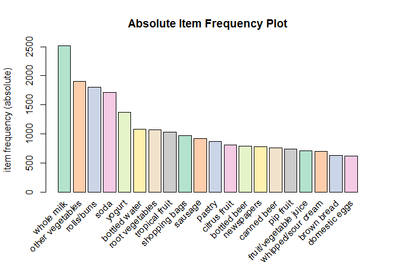<!-- -->

``` r
itemFrequencyPlot(groctrans,topN=20,type="relative",col=brewer.pal(8,'Pastel2'),main="Relative Item Frequency Plot")
```

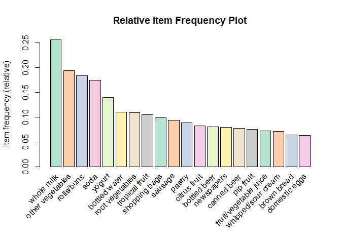<!-- -->

From the graphs above, it is evident that the top 5 items being
purchased are:  
1\. whole milk  
2\. vegetables  
3\. rolls/buns  
4\. soda  
5\. yogurt

(Basic survival kit\!)

The next step is generating rules using the Apriori Algorithm\! We can
mine rules using **apriori()** function from the **arules** package.

The apriori will take ‘groctrans’ as the transaction object on which
mining is to be applied. parameter will allow you to set min\_sup and
min\_confidence. The default values for parameter are minimum support of
0.001, the minimum confidence of 0.8, maximum of 10 items (maxlen).

We arrived at these values by trial and error. While a lower confidence
value helped result in more number of mining rules, we wanted to make
sure that we are confident with the predictions we were making from the
rules.

``` r
association.rules <- apriori(groctrans, parameter = list(supp=0.001, conf=0.8,maxlen=10))
```

    ## Apriori
    ## 
    ## Parameter specification:
    ##  confidence minval smax arem  aval originalSupport maxtime support minlen
    ##         0.8    0.1    1 none FALSE            TRUE       5   0.001      1
    ##  maxlen target   ext
    ##      10  rules FALSE
    ## 
    ## Algorithmic control:
    ##  filter tree heap memopt load sort verbose
    ##     0.1 TRUE TRUE  FALSE TRUE    2    TRUE
    ## 
    ## Absolute minimum support count: 9 
    ## 
    ## set item appearances ...[0 item(s)] done [0.00s].
    ## set transactions ...[169 item(s), 9835 transaction(s)] done [0.00s].
    ## sorting and recoding items ... [157 item(s)] done [0.00s].
    ## creating transaction tree ... done [0.00s].
    ## checking subsets of size 1 2 3 4 5 6 done [0.01s].
    ## writing ... [410 rule(s)] done [0.00s].
    ## creating S4 object  ... done [0.00s].

``` r
summary(association.rules)
```

    ## set of 410 rules
    ## 
    ## rule length distribution (lhs + rhs):sizes
    ##   3   4   5   6 
    ##  29 229 140  12 
    ## 
    ##    Min. 1st Qu.  Median    Mean 3rd Qu.    Max. 
    ##   3.000   4.000   4.000   4.329   5.000   6.000 
    ## 
    ## summary of quality measures:
    ##     support           confidence          lift            count      
    ##  Min.   :0.001017   Min.   :0.8000   Min.   : 3.131   Min.   :10.00  
    ##  1st Qu.:0.001017   1st Qu.:0.8333   1st Qu.: 3.312   1st Qu.:10.00  
    ##  Median :0.001220   Median :0.8462   Median : 3.588   Median :12.00  
    ##  Mean   :0.001247   Mean   :0.8663   Mean   : 3.951   Mean   :12.27  
    ##  3rd Qu.:0.001322   3rd Qu.:0.9091   3rd Qu.: 4.341   3rd Qu.:13.00  
    ##  Max.   :0.003152   Max.   :1.0000   Max.   :11.235   Max.   :31.00  
    ## 
    ## mining info:
    ##       data ntransactions support confidence
    ##  groctrans          9835   0.001        0.8

``` r
inspect(association.rules[1:10])
```

    ##      lhs                         rhs                    support confidence      lift count
    ## [1]  {liquor,                                                                             
    ##       red/blush wine}         => {bottled beer}     0.001931876  0.9047619 11.235269    19
    ## [2]  {cereals,                                                                            
    ##       curd}                   => {whole milk}       0.001016777  0.9090909  3.557863    10
    ## [3]  {cereals,                                                                            
    ##       yogurt}                 => {whole milk}       0.001728521  0.8095238  3.168192    17
    ## [4]  {butter,                                                                             
    ##       jam}                    => {whole milk}       0.001016777  0.8333333  3.261374    10
    ## [5]  {bottled beer,                                                                       
    ##       soups}                  => {whole milk}       0.001118454  0.9166667  3.587512    11
    ## [6]  {house keeping products,                                                             
    ##       napkins}                => {whole milk}       0.001321810  0.8125000  3.179840    13
    ## [7]  {house keeping products,                                                             
    ##       whipped/sour cream}     => {whole milk}       0.001220132  0.9230769  3.612599    12
    ## [8]  {pastry,                                                                             
    ##       sweet spreads}          => {whole milk}       0.001016777  0.9090909  3.557863    10
    ## [9]  {curd,                                                                               
    ##       turkey}                 => {other vegetables} 0.001220132  0.8000000  4.134524    12
    ## [10] {rice,                                                                               
    ##       sugar}                  => {whole milk}       0.001220132  1.0000000  3.913649    12

From the above information, we can deduce that 100% of the customers who
bought Rice and sugar also bought Whole Milk.  
The confidence values of other rules in the above summary are also
pretty high (\>0.8).

You can also remove redundant rules by creating a subset of unique
rules.

``` r
# Min Support as 0.005, confidence as 0.8.
association.rules <- apriori(groctrans, parameter = list(supp=0.001, conf=0.8,maxlen=10))
```

    ## Apriori
    ## 
    ## Parameter specification:
    ##  confidence minval smax arem  aval originalSupport maxtime support minlen
    ##         0.8    0.1    1 none FALSE            TRUE       5   0.001      1
    ##  maxlen target   ext
    ##      10  rules FALSE
    ## 
    ## Algorithmic control:
    ##  filter tree heap memopt load sort verbose
    ##     0.1 TRUE TRUE  FALSE TRUE    2    TRUE
    ## 
    ## Absolute minimum support count: 9 
    ## 
    ## set item appearances ...[0 item(s)] done [0.00s].
    ## set transactions ...[169 item(s), 9835 transaction(s)] done [0.00s].
    ## sorting and recoding items ... [157 item(s)] done [0.00s].
    ## creating transaction tree ... done [0.00s].
    ## checking subsets of size 1 2 3 4 5 6 done [0.01s].
    ## writing ... [410 rule(s)] done [0.00s].
    ## creating S4 object  ... done [0.00s].

``` r
summary(association.rules)
```

    ## set of 410 rules
    ## 
    ## rule length distribution (lhs + rhs):sizes
    ##   3   4   5   6 
    ##  29 229 140  12 
    ## 
    ##    Min. 1st Qu.  Median    Mean 3rd Qu.    Max. 
    ##   3.000   4.000   4.000   4.329   5.000   6.000 
    ## 
    ## summary of quality measures:
    ##     support           confidence          lift            count      
    ##  Min.   :0.001017   Min.   :0.8000   Min.   : 3.131   Min.   :10.00  
    ##  1st Qu.:0.001017   1st Qu.:0.8333   1st Qu.: 3.312   1st Qu.:10.00  
    ##  Median :0.001220   Median :0.8462   Median : 3.588   Median :12.00  
    ##  Mean   :0.001247   Mean   :0.8663   Mean   : 3.951   Mean   :12.27  
    ##  3rd Qu.:0.001322   3rd Qu.:0.9091   3rd Qu.: 4.341   3rd Qu.:13.00  
    ##  Max.   :0.003152   Max.   :1.0000   Max.   :11.235   Max.   :31.00  
    ## 
    ## mining info:
    ##       data ntransactions support confidence
    ##  groctrans          9835   0.001        0.8

``` r
inspect(association.rules[1:10])
```

    ##      lhs                         rhs                    support confidence      lift count
    ## [1]  {liquor,                                                                             
    ##       red/blush wine}         => {bottled beer}     0.001931876  0.9047619 11.235269    19
    ## [2]  {cereals,                                                                            
    ##       curd}                   => {whole milk}       0.001016777  0.9090909  3.557863    10
    ## [3]  {cereals,                                                                            
    ##       yogurt}                 => {whole milk}       0.001728521  0.8095238  3.168192    17
    ## [4]  {butter,                                                                             
    ##       jam}                    => {whole milk}       0.001016777  0.8333333  3.261374    10
    ## [5]  {bottled beer,                                                                       
    ##       soups}                  => {whole milk}       0.001118454  0.9166667  3.587512    11
    ## [6]  {house keeping products,                                                             
    ##       napkins}                => {whole milk}       0.001321810  0.8125000  3.179840    13
    ## [7]  {house keeping products,                                                             
    ##       whipped/sour cream}     => {whole milk}       0.001220132  0.9230769  3.612599    12
    ## [8]  {pastry,                                                                             
    ##       sweet spreads}          => {whole milk}       0.001016777  0.9090909  3.557863    10
    ## [9]  {curd,                                                                               
    ##       turkey}                 => {other vegetables} 0.001220132  0.8000000  4.134524    12
    ## [10] {rice,                                                                               
    ##       sugar}                  => {whole milk}       0.001220132  1.0000000  3.913649    12

``` r
subset.rules <- which(colSums(is.subset(association.rules, association.rules)) > 1) # get subset rules in vector
length(subset.rules)  #410 ----> 91
```

    ## [1] 91

``` r
subset.association.rules. <- association.rules[-subset.rules] # remove subset rules.
```

## Finding rules related to a given item:

We can find trends in the way people shop ingredients by finding
relationships between the different association rules.

``` r
# What did people buy before buying beer?
beer.association.rules <- apriori(groctrans, parameter = list(supp=0.001, conf=0.8),appearance = list(default="lhs",rhs="bottled beer"))
```

    ## Apriori
    ## 
    ## Parameter specification:
    ##  confidence minval smax arem  aval originalSupport maxtime support minlen
    ##         0.8    0.1    1 none FALSE            TRUE       5   0.001      1
    ##  maxlen target   ext
    ##      10  rules FALSE
    ## 
    ## Algorithmic control:
    ##  filter tree heap memopt load sort verbose
    ##     0.1 TRUE TRUE  FALSE TRUE    2    TRUE
    ## 
    ## Absolute minimum support count: 9 
    ## 
    ## set item appearances ...[1 item(s)] done [0.00s].
    ## set transactions ...[169 item(s), 9835 transaction(s)] done [0.00s].
    ## sorting and recoding items ... [157 item(s)] done [0.00s].
    ## creating transaction tree ... done [0.02s].
    ## checking subsets of size 1 2 3 4 5 6 done [0.00s].
    ## writing ... [1 rule(s)] done [0.00s].
    ## creating S4 object  ... done [0.00s].

``` r
inspect(head(beer.association.rules))
```

    ##     lhs                        rhs            support     confidence
    ## [1] {liquor,red/blush wine} => {bottled beer} 0.001931876 0.9047619 
    ##     lift     count
    ## [1] 11.23527 19

``` r
# What did people buy before buying milk?
wholemilk.association.rules <- apriori(groctrans, parameter = list(supp=0.001, conf=0.6),appearance = list(default="lhs",rhs="whole milk"))
```

    ## Apriori
    ## 
    ## Parameter specification:
    ##  confidence minval smax arem  aval originalSupport maxtime support minlen
    ##         0.6    0.1    1 none FALSE            TRUE       5   0.001      1
    ##  maxlen target   ext
    ##      10  rules FALSE
    ## 
    ## Algorithmic control:
    ##  filter tree heap memopt load sort verbose
    ##     0.1 TRUE TRUE  FALSE TRUE    2    TRUE
    ## 
    ## Absolute minimum support count: 9 
    ## 
    ## set item appearances ...[1 item(s)] done [0.00s].
    ## set transactions ...[169 item(s), 9835 transaction(s)] done [0.01s].
    ## sorting and recoding items ... [157 item(s)] done [0.00s].
    ## creating transaction tree ... done [0.00s].
    ## checking subsets of size 1 2 3 4 5 6 done [0.01s].
    ## writing ... [1585 rule(s)] done [0.00s].
    ## creating S4 object  ... done [0.00s].

``` r
inspect(head(wholemilk.association.rules))
```

    ##     lhs                           rhs          support     confidence
    ## [1] {honey}                    => {whole milk} 0.001118454 0.7333333 
    ## [2] {cereals}                  => {whole milk} 0.003660397 0.6428571 
    ## [3] {rice}                     => {whole milk} 0.004677173 0.6133333 
    ## [4] {liver loaf,yogurt}        => {whole milk} 0.001016777 0.6666667 
    ## [5] {curd cheese,rolls/buns}   => {whole milk} 0.001016777 0.6250000 
    ## [6] {cleaner,other vegetables} => {whole milk} 0.001016777 0.6250000 
    ##     lift     count
    ## [1] 2.870009 11   
    ## [2] 2.515917 36   
    ## [3] 2.400371 46   
    ## [4] 2.609099 10   
    ## [5] 2.446031 10   
    ## [6] 2.446031 10

``` r
# What did people buy along with milk?
milk.association.rules <- apriori(groctrans, parameter = list(supp=0.001, conf=0.8),appearance = list(lhs="butter",default="rhs"))
```

    ## Apriori
    ## 
    ## Parameter specification:
    ##  confidence minval smax arem  aval originalSupport maxtime support minlen
    ##         0.8    0.1    1 none FALSE            TRUE       5   0.001      1
    ##  maxlen target   ext
    ##      10  rules FALSE
    ## 
    ## Algorithmic control:
    ##  filter tree heap memopt load sort verbose
    ##     0.1 TRUE TRUE  FALSE TRUE    2    TRUE
    ## 
    ## Absolute minimum support count: 9 
    ## 
    ## set item appearances ...[1 item(s)] done [0.00s].
    ## set transactions ...[169 item(s), 9835 transaction(s)] done [0.00s].
    ## sorting and recoding items ... [157 item(s)] done [0.00s].
    ## creating transaction tree ... done [0.00s].
    ## checking subsets of size 1 2 done [0.00s].
    ## writing ... [0 rule(s)] done [0.00s].
    ## creating S4 object  ... done [0.00s].

``` r
inspect(head(milk.association.rules))
```

## Visualizations

A straight-forward visualization of association rules is to use a
scatter plot using plot() of the arulesViz package. It uses Support and
Confidence on the axes. In addition, third measure Lift is used by
default to color (grey levels) of the points.

``` r
subRules<-association.rules[quality(association.rules)$confidence>0.4]
#Plot SubRules
plot(subRules)
```

    ## To reduce overplotting, jitter is added! Use jitter = 0 to prevent jitter.

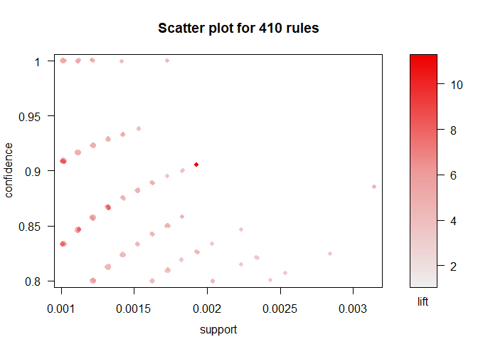<!-- -->

Rules with high lift tend to have low
    support.

``` r
plot(subRules,method="two-key plot")
```

    ## To reduce overplotting, jitter is added! Use jitter = 0 to prevent jitter.

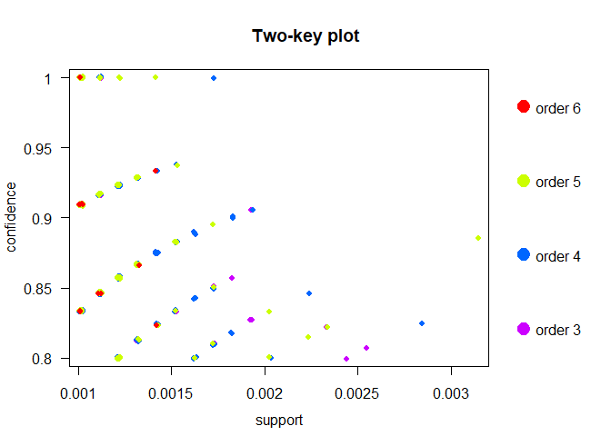<!-- -->

The two-key plot uses support and confidence on x and y-axis
respectively. It uses order for coloring. The order is the number of
items in the rule.

### Filtering rules with the highest lift

Here is a parallel coordinates plot for 20 rules. For example, the arrow
in red denotes that if a customer purchases red/blush wine they will
also buy bottled beer.

``` r
# Filter top 20 rules with highest lift
subRules2<-head(subRules, n=20, by="lift")
plot(subRules2, method="paracoord")
```

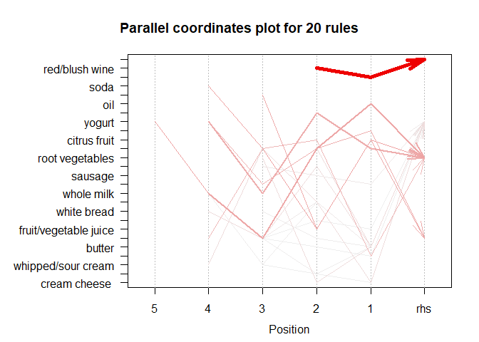<!-- -->

Given below are a few interactive visualizations to see more details
between the rules and the items.

``` r
plotly_arules(subRules)
```

    ## Warning: 'plotly_arules' is deprecated.
    ## Use 'plot' instead.
    ## See help("Deprecated")

    ## To reduce overplotting, jitter is added! Use jitter = 0 to prevent jitter.

<!--html_preserve-->

<div id="htmlwidget-ca2e67774748c249a7aa" class="plotly html-widget" style="width:672px;height:480px;">

</div>

<script type="application/json" data-for="htmlwidget-ca2e67774748c249a7aa">{"x":{"visdat":{"27885a404eae":["function () ","plotlyVisDat"]},"cur_data":"27885a404eae","attrs":{"27885a404eae":{"x":[0.00244173362030686,0.00121948434170849,0.00121928893078024,0.00162567677958381,0.00162768973361777,0.00122128927915255,0.00121820556774499,0.00122200833326319,0.00122062863505511,0.0012183118685086,0.00122041667111436,0.00122196304040965,0.00162854912219465,0.00122107071455498,0.00121985361396845,0.00122123105381156,0.00122093519646386,0.00121863321161482,0.00122151674797511,0.00121954361616881,0.00253996863577171,0.00172824522182262,0.00172734264135023,0.00173029731274923,0.00172961169696486,0.00172733636235511,0.0013220287543833,0.00132274155173263,0.00132030714537399,0.0013224660625805,0.00132058042723391,0.00131984640465221,0.00132119456067614,0.00132147528849995,0.00132187577743328,0.00132160446748744,0.00132043919782702,0.00132072984663349,0.0013229504262962,0.00132141008673977,0.00132316880273369,0.00132226397207798,0.00132319340645425,0.00131998441255551,0.00132376854690135,0.00223608045381147,0.00182936271323516,0.00182980380448236,0.00233775250306701,0.00233743312408078,0.00142146937225034,0.0014226982486922,0.00284713116183919,0.00142208103649067,0.00142384693660651,0.00142320545627412,0.00142281048785328,0.00142508844042178,0.00142258741720105,0.00101863179354776,0.0015267086792251,0.00101793609671178,0.00101497648978262,0.0010186421758916,0.00101644438980685,0.0015252009819405,0.00101622420752922,0.00101725499179623,0.00101531390663706,0.00101802622667988,0.0010180297564129,0.00101555217690185,0.0010152885157332,0.00101553755700408,0.0010173333666679,0.00101500008126335,0.0010156714195207,0.0010181577594702,0.00101555068841718,0.00101554220951291,0.00101623648307757,0.00101811315947675,0.00101775986249361,0.00101842911186787,0.00152511778171911,0.00101635453648255,0.00101750295560925,0.00101747244996154,0.00101548938893448,0.00101713628006,0.0010175556466245,0.00101672921593851,0.00101745267636161,0.00101692275278067,0.00152505634699744,0.00203178068232491,0.00101871182736611,0.00162742387141121,0.00162658396016785,0.0016254793773324,0.00111653166135832,0.00111687929007859,0.00111816927483774,0.00111844359666084,0.00111811662979982,0.00111716258669881,0.00111816261517296,0.0011194207924802,0.00111928482432306,0.00111869074985461,0.00111952095827038,0.00111663216499196,0.00111822082595197,0.00111992160592095,0.00111950535501124,0.00223670698764417,0.0011186432520755,0.00111679859418903,0.00112016655967495,0.00111716278861757,0.00111904273604578,0.00111684949832172,0.00111850576458931,0.00111857596841551,0.00111923365589522,0.00111758195063423,0.00172905677003142,0.00173049145659684,0.00121899784383314,0.00122078887545275,0.0012209802424814,0.00121839825186787,0.0012202398036884,0.00121929400472213,0.00122129252128336,0.00122065375025862,0.0012206535691486,0.00121838666617712,0.00122183635888169,0.0012199477112035,0.00121866210590918,0.00121893483107921,0.00122148914796079,0.0012217211599395,0.00122022692868885,0.00122003958197053,0.00121873103626878,0.00121899990157084,0.00122205084931188,0.00122176843299884,0.00121909209579807,0.00132063787228458,0.00132354502910848,0.0013209585928912,0.0013212910739935,0.00132231739149244,0.00132103325428699,0.00142344868998431,0.0014247292239169,0.00142308999276401,0.00152685037810427,0.00152570114367961,0.00152327767473869,0.0015262871765924,0.00162638706330689,0.00162566401798261,0.00172891219256308,0.00183091319299414,0.00182837805766879,0.00101845739251872,0.00101768530263099,0.00101875865045068,0.00101870501428928,0.0010171455276368,0.0010150535254805,0.00101731786154342,0.00101703264984891,0.00101496277800569,0.00101536590047846,0.00101728399981629,0.00101572184237897,0.0010154941302177,0.00101609153403175,0.00101579000053865,0.00101487857703435,0.00101639212960937,0.00101689597903495,0.00101626038232588,0.00101753444820684,0.00101514027815502,0.00101694115929909,0.00101553660960981,0.00101877723014768,0.00101700238000073,0.00101533396398166,0.00101867091922709,0.00101798658791194,0.001119648794774,0.00111730226484301,0.00111941206880932,0.00111948489401536,0.00112002182154884,0.00111786946729657,0.00111891292662159,0.00111798832574377,0.0011182120641242,0.00111943585981302,0.00111734346572388,0.00111692346304596,0.00111649526316066,0.00111759617708098,0.00122067519876877,0.00122077775767564,0.00122050000128834,0.00122040580928895,0.00121848977781852,0.00122186688129622,0.00122086730610036,0.00122075210023698,0.00122163137978163,0.00122068576185295,0.00121968039229165,0.00122044844930215,0.00121984075211523,0.00121866581013579,0.0013236622855184,0.00132343806925266,0.00132325411941573,0.00142257078018129,0.00142472372143639,0.00152710868330583,0.00152379261466107,0.00122168605218223,0.00111952816457625,0.00101746619506645,0.00173027279052536,0.00101643898926586,0.00101487384304294,0.00101805915294,0.00101533924787441,0.0011179944062732,0.00101694828582212,0.00111805994871943,0.00111662614608076,0.0014242539783183,0.00101727653900071,0.00101766855758486,0.00121972146682444,0.0010148687695629,0.00111994893685416,0.00101813131659877,0.00101552644295658,0.00122084092674631,0.00122073962786436,0.00121929154985553,0.00121974597963631,0.00121914933897983,0.00121848701437539,0.00203459535108483,0.0012199827108535,0.00121852269294245,0.0012221205616841,0.00121901510240246,0.00121842495382803,0.0012194576436642,0.00203546458282652,0.00162740459537469,0.00121886747025322,0.00122191437297343,0.00172951113055225,0.0013222391354861,0.00132326994103405,0.00132286955272147,0.00132129195107994,0.00132179030313737,0.00132279267176758,0.00132066272889884,0.00132264787246346,0.00131989454952291,0.00142177925942652,0.00142550274612675,0.00142175588864527,0.00193248478680952,0.00193075218867008,0.00152418671737339,0.00101825099942388,0.00101648789939082,0.00101807910307282,0.00101664181549796,0.00101668227931732,0.00101830230474433,0.00101746335708265,0.0010162063862283,0.0010149219399619,0.00101501706509083,0.00101793519500137,0.00101612111045451,0.00101878966390721,0.00101786001918314,0.00101768438334386,0.00101841516230197,0.00101818940734324,0.00101644933357415,0.0010168158367547,0.00101677411235451,0.00101680238554048,0.00101650792331745,0.0016267538220723,0.00112040183322928,0.00111847453246224,0.00111843290695955,0.00111646918510636,0.00111894097882022,0.00111755577790776,0.0011197928192971,0.00111984246641491,0.00111859431025394,0.00111680069415281,0.00111892120902704,0.00111823131712266,0.00111977818998545,0.001117596153614,0.00112029283728073,0.00111916109597199,0.00172985950367288,0.00172655454651708,0.00172888014212519,0.001726851360054,0.00182980417451343,0.00122168118789866,0.00122037613398749,0.00121872478872194,0.00122108402176633,0.00122086163766442,0.0012188622143839,0.00122140012498463,0.00121838272942252,0.00132133708717183,0.0013198575036279,0.00142220754982355,0.00142409537233838,0.00142505589977719,0.00142481244254089,0.00152347319243004,0.00152413196030992,0.00152672413811263,0.00315025836038614,0.00162510245070128,0.0016256641327223,0.00193353348063355,0.00101742801338005,0.00101616305549588,0.00101668704187301,0.00101775117517831,0.00101853497473823,0.00101612671473909,0.00101508087451437,0.00101835701145463,0.00101778989147131,0.00101751485171546,0.00101570546462477,0.00101847074056589,0.00101575503069364,0.00101780363814394,0.00101549825610875,0.00111926416791197,0.00111654105604303,0.00111852020516239,0.00111958226244309,0.00111919975305478,0.00121889989933182,0.00121955616558326,0.00121929175062765,0.00132266051893084,0.00132027462703657,0.00132024471039431,0.0014238147633197,0.00142513588647251,0.00101739263601775,0.00112003473912815,0.00101546102900872,0.00101557361524749,0.00111936811035301,0.00101848865330696,0.00101865364060248,0.00121851873331442,0.00122072585065963,0.00122076804567214,0.00101511399409114,0.00101703247488971,0.00101567583112706,0.00101848629403999,0.00101759177483899,0.00111712152815024,0.00111927886355444,0.00111966174897132,0.00122056884538505,0.00121999656770939,0.00101736363033046,0.00101704197074075,0.0010166349407267,0.00101497234535445,0.0010171346353536,0.00101759241111232,0.00132052125182442,0.00132294378974284,0.00111815821587011,0.00101500819562893,0.00101821794887379,0.00193103569636616],"y":[0.79995932085999,0.800005563937752,0.800007626647288,0.80003580818125,0.799966819062438,0.799983566129377,0.799973979720979,0.799979480327568,0.799987769852966,0.799997127947039,0.799975713262832,0.799982155409923,0.799997715501961,0.799978247869714,0.800033083932352,0.799973302600565,0.79996064732516,0.799987472703177,0.79997331259095,0.799962831126987,0.806477905342872,0.809525105989877,0.809548478325791,0.809558188987152,0.80954880839499,0.80952353439494,0.812510506244171,0.812466221249463,0.812461658032102,0.812533782583861,0.812473945146687,0.812472527092696,0.812531597194666,0.81253204454061,0.812535766049541,0.812483521920652,0.812495527521616,0.812502480400654,0.812514349820132,0.81247034327843,0.812498839400948,0.812462199669165,0.81250570996153,0.812517113815375,0.812464607225578,0.814851322160788,0.818180870082108,0.818188370864187,0.821441233247128,0.821437392420736,0.823561376100664,0.823559510708278,0.823488394615138,0.823518362521996,0.823512315589426,0.823556530774029,0.823552932581949,0.823527206554372,0.823521338268163,0.833354234001648,0.833347326789582,0.833357042780751,0.833314267756213,0.833308964588619,0.833326765029173,0.833331616912669,0.833335758674159,0.833296269980653,0.833314855919734,0.833304378012958,0.83336774982144,0.833331641076045,0.83335385586916,0.833296858202867,0.833369295781317,0.833324867081268,0.833358590973364,0.83330874398258,0.833313154077591,0.833339803541919,0.833345149289172,0.833303382594114,0.833343214815873,0.833368954853857,0.833345461025521,0.833296648086835,0.833364441559846,0.833318132862154,0.833326125799071,0.833351478701401,0.833352297195556,0.833342719929831,0.833364534808829,0.833311644854918,0.833304724335254,0.833301650223576,0.833309826669093,0.842084348637943,0.842079809511828,0.842103175558646,0.846172000622987,0.846142640560345,0.846175572208084,0.846120751771071,0.846136205463851,0.846113626164403,0.846138471216898,0.846112427489318,0.846160017753437,0.846155505268746,0.846148059608493,0.846186798360405,0.846156969001327,0.846119076395896,0.846142629099196,0.84613460798025,0.846195290472072,0.846115601974407,0.84616401747851,0.846179503104226,0.846131871817949,0.846168795332976,0.846134784733359,0.846191396108874,0.846175914059395,0.846154272640485,0.850014671109456,0.850022422173973,0.857132443678575,0.857124032087966,0.857180380098319,0.857159843797105,0.857117756750909,0.857149949045985,0.857103772609285,0.857171603372536,0.857183007313648,0.857119029536248,0.857153522931917,0.857138477591418,0.857150558406984,0.857143793258913,0.857136857123833,0.8571635490582,0.857129553425072,0.857163268930598,0.857122873097756,0.857169259285344,0.857131167719851,0.857135286932343,0.857173505703514,0.86663065371474,0.86663484753703,0.866653786517501,0.866649802588382,0.86666890679987,0.866672994839343,0.87499752919001,0.87498113925219,0.87502058244258,0.88237406728623,0.882365800901375,0.882391108043305,0.882388013401479,0.888860336942871,0.888875489019062,0.894707225349144,0.900034636204052,0.899982006852415,0.909087460227206,0.90911003227074,0.909071243665436,0.909109475023639,0.909128361262406,0.909094394547774,0.909123174991217,0.909079383534219,0.909091147556521,0.909061664754335,0.909084883685523,0.909050065301373,0.909125355558951,0.909124556399299,0.909049813815466,0.909080030222717,0.909084888300375,0.909115792509439,0.909124240457658,0.909098189941536,0.90907192937359,0.909118805224649,0.909052334085542,0.909084147955154,0.909058024299626,0.909056927687841,0.909073968794746,0.909084291702192,0.916657404945207,0.916649562023145,0.916681591502998,0.916645487302497,0.91664920928232,0.916683168451934,0.916682370301189,0.916653823354411,0.916654794823452,0.916686208679495,0.916657433880778,0.916640597099004,0.916672150771814,0.91670428822517,0.923063373750812,0.923050189540648,0.923069469237413,0.923062844343948,0.923044532670221,0.923106556644944,0.923068899642649,0.923051076348309,0.923056987774586,0.923081815038112,0.923058544977251,0.923035302360151,0.923045295925654,0.923056481690525,0.928565298451647,0.928583325176604,0.92860692393856,0.933330949994568,0.933346413820348,0.937539705163272,0.937472418580044,0.999992724130171,0.999984536046703,0.999972339587427,0.999980268791504,0.999988376148539,0.99997851568779,1.00002337089525,1.00001099787201,1.00004152492512,1.00003828137214,0.999993363221862,1.00003974559287,1.00002521351826,0.999999107993257,0.999999527383397,0.999996404526881,0.999984820658355,1.00003672145866,1.00002348567695,1.00002173229176,0.799992215783158,0.799988942285723,0.800001122369882,0.799980940450586,0.800004454038396,0.800035853046627,0.799993498149674,0.799979081659124,0.80001646392836,0.799978352248107,0.799982710965745,0.799983921416468,0.799983490946751,0.799987709616352,0.800013614503078,0.800009681813371,0.799985817417494,0.809553354094785,0.812481354859889,0.812489523484349,0.812491619240324,0.812502510346285,0.812522705887962,0.812521106328811,0.812519305812906,0.812482278635732,0.812501033563584,0.823559980525929,0.823532979772334,0.823518628459357,0.826060499833227,0.826066435357694,0.833324951001799,0.833335225146414,0.833328098704707,0.833349819976835,0.833319496259305,0.833297876067034,0.833345081448046,0.833311091944422,0.83330740416829,0.833334047426545,0.833315851288824,0.833353321576843,0.833330363712485,0.833312815653389,0.83334225985156,0.833344624037026,0.833357072366461,0.83335784984544,0.833338358887301,0.833311093158432,0.833335565168584,0.833331868852062,0.833306544417989,0.842136796108285,0.846160312770881,0.846177925630496,0.84612955539294,0.846112077264894,0.846154168050614,0.846130081758647,0.846157972941142,0.846128776702082,0.846169366844304,0.846146666790778,0.846180361109172,0.84614162343464,0.846139203944014,0.846112113236295,0.846160096008863,0.846148415136673,0.849995546397919,0.849980375796467,0.849993974686476,0.849958627679534,0.857102642383789,0.857156419792076,0.857173617198179,0.857138958881697,0.857146608841676,0.857165331870134,0.857161669732034,0.857126179686925,0.857132811125771,0.866679033477461,0.86670299855938,0.875022376120266,0.875015617440067,0.875026131696237,0.875030348164376,0.882315991310297,0.882384739599333,0.882312123430262,0.885732363699974,0.888866007077849,0.88892276440918,0.904756929631516,0.90905951802554,0.909129455816048,0.909071073065672,0.909051785682486,0.909127528455363,0.909081701080006,0.909059794011079,0.909056149916531,0.909123924556149,0.909064949463225,0.909124166252725,0.909089070540258,0.90907116072475,0.909076379850965,0.909085944797405,0.916642409927955,0.916706897420728,0.916697464353063,0.916683587807222,0.916691124095834,0.923089416986806,0.923097738801268,0.923057352325373,0.928580265262305,0.92855411453031,0.928557549841493,0.933302974902006,0.93335779720354,1.00003591286249,0.999974677698057,0.999961066645733,0.999990633523719,1.00001071724148,0.999976345309793,1.00000562137821,1.00000268409113,0.80000428204162,0.799976407976187,0.833318236463751,0.833363017945364,0.833374712541167,0.83331300468702,0.833292192191272,0.846113475532207,0.846167358301177,0.846152177898112,0.857103683456736,0.857117562730359,0.90909635927916,0.909054713668901,0.909071424274458,0.909130855371006,0.833362093389987,0.833298413961795,0.86666912630469,0.866633709771073,0.84618890956,0.909102746372408,0.909112214371001,0.904794181411303],"hoverinfo":"text","text":["[20]<BR> <B>{herbs,<BR>&nbsp;&nbsp;rolls/buns}<\/B><BR>&nbsp;&nbsp; => <B>{whole milk}<\/B> <BR><BR>support: 0.00244 <BR>confidence: 0.8 <BR>lift: 3.13","[63]<BR> <B>{butter,<BR>&nbsp;&nbsp;soft cheese,<BR>&nbsp;&nbsp;yogurt}<\/B><BR>&nbsp;&nbsp; => <B>{whole milk}<\/B> <BR><BR>support: 0.00122 <BR>confidence: 0.8 <BR>lift: 3.13","[79]<BR> <B>{frankfurter,<BR>&nbsp;&nbsp;frozen meals,<BR>&nbsp;&nbsp;other vegetables}<\/B><BR>&nbsp;&nbsp; => <B>{whole milk}<\/B> <BR><BR>support: 0.00122 <BR>confidence: 0.8 <BR>lift: 3.13","[82]<BR> <B>{frozen meals,<BR>&nbsp;&nbsp;tropical fruit,<BR>&nbsp;&nbsp;yogurt}<\/B><BR>&nbsp;&nbsp; => <B>{whole milk}<\/B> <BR><BR>support: 0.00163 <BR>confidence: 0.8 <BR>lift: 3.13","[119]<BR> <B>{curd,<BR>&nbsp;&nbsp;hamburger meat,<BR>&nbsp;&nbsp;other vegetables}<\/B><BR>&nbsp;&nbsp; => <B>{whole milk}<\/B> <BR><BR>support: 0.00163 <BR>confidence: 0.8 <BR>lift: 3.13","[120]<BR> <B>{butter,<BR>&nbsp;&nbsp;hamburger meat,<BR>&nbsp;&nbsp;whipped/sour cream}<\/B><BR>&nbsp;&nbsp; => <B>{whole milk}<\/B> <BR><BR>support: 0.00122 <BR>confidence: 0.8 <BR>lift: 3.13","[124]<BR> <B>{hygiene articles,<BR>&nbsp;&nbsp;napkins,<BR>&nbsp;&nbsp;tropical fruit}<\/B><BR>&nbsp;&nbsp; => <B>{whole milk}<\/B> <BR><BR>support: 0.00122 <BR>confidence: 0.8 <BR>lift: 3.13","[185]<BR> <B>{butter,<BR>&nbsp;&nbsp;chicken,<BR>&nbsp;&nbsp;whipped/sour cream}<\/B><BR>&nbsp;&nbsp; => <B>{whole milk}<\/B> <BR><BR>support: 0.00122 <BR>confidence: 0.8 <BR>lift: 3.13","[195]<BR> <B>{chocolate,<BR>&nbsp;&nbsp;napkins,<BR>&nbsp;&nbsp;root vegetables}<\/B><BR>&nbsp;&nbsp; => <B>{whole milk}<\/B> <BR><BR>support: 0.00122 <BR>confidence: 0.8 <BR>lift: 3.13","[211]<BR> <B>{butter,<BR>&nbsp;&nbsp;curd,<BR>&nbsp;&nbsp;pip fruit}<\/B><BR>&nbsp;&nbsp; => <B>{whole milk}<\/B> <BR><BR>support: 0.00122 <BR>confidence: 0.8 <BR>lift: 3.13","[215]<BR> <B>{bottled beer,<BR>&nbsp;&nbsp;napkins,<BR>&nbsp;&nbsp;rolls/buns}<\/B><BR>&nbsp;&nbsp; => <B>{whole milk}<\/B> <BR><BR>support: 0.00122 <BR>confidence: 0.8 <BR>lift: 3.13","[234]<BR> <B>{domestic eggs,<BR>&nbsp;&nbsp;margarine,<BR>&nbsp;&nbsp;whipped/sour cream}<\/B><BR>&nbsp;&nbsp; => <B>{whole milk}<\/B> <BR><BR>support: 0.00122 <BR>confidence: 0.8 <BR>lift: 3.13","[245]<BR> <B>{butter,<BR>&nbsp;&nbsp;citrus fruit,<BR>&nbsp;&nbsp;tropical fruit}<\/B><BR>&nbsp;&nbsp; => <B>{whole milk}<\/B> <BR><BR>support: 0.00163 <BR>confidence: 0.8 <BR>lift: 3.13","[254]<BR> <B>{pip fruit,<BR>&nbsp;&nbsp;sausage,<BR>&nbsp;&nbsp;whipped/sour cream}<\/B><BR>&nbsp;&nbsp; => <B>{whole milk}<\/B> <BR><BR>support: 0.00122 <BR>confidence: 0.8 <BR>lift: 3.13","[294]<BR> <B>{chicken,<BR>&nbsp;&nbsp;domestic eggs,<BR>&nbsp;&nbsp;other vegetables,<BR>&nbsp;&nbsp;root vegetables}<\/B><BR>&nbsp;&nbsp; => <B>{whole milk}<\/B> <BR><BR>support: 0.00122 <BR>confidence: 0.8 <BR>lift: 3.13","[317]<BR> <B>{butter,<BR>&nbsp;&nbsp;curd,<BR>&nbsp;&nbsp;tropical fruit,<BR>&nbsp;&nbsp;yogurt}<\/B><BR>&nbsp;&nbsp; => <B>{whole milk}<\/B> <BR><BR>support: 0.00122 <BR>confidence: 0.8 <BR>lift: 3.13","[349]<BR> <B>{butter,<BR>&nbsp;&nbsp;tropical fruit,<BR>&nbsp;&nbsp;whipped/sour cream,<BR>&nbsp;&nbsp;yogurt}<\/B><BR>&nbsp;&nbsp; => <B>{whole milk}<\/B> <BR><BR>support: 0.00122 <BR>confidence: 0.8 <BR>lift: 3.13","[352]<BR> <B>{butter,<BR>&nbsp;&nbsp;other vegetables,<BR>&nbsp;&nbsp;rolls/buns,<BR>&nbsp;&nbsp;whipped/sour cream}<\/B><BR>&nbsp;&nbsp; => <B>{whole milk}<\/B> <BR><BR>support: 0.00122 <BR>confidence: 0.8 <BR>lift: 3.13","[381]<BR> <B>{citrus fruit,<BR>&nbsp;&nbsp;other vegetables,<BR>&nbsp;&nbsp;sausage,<BR>&nbsp;&nbsp;whipped/sour cream}<\/B><BR>&nbsp;&nbsp; => <B>{whole milk}<\/B> <BR><BR>support: 0.00122 <BR>confidence: 0.8 <BR>lift: 3.13","[384]<BR> <B>{citrus fruit,<BR>&nbsp;&nbsp;tropical fruit,<BR>&nbsp;&nbsp;whipped/sour cream,<BR>&nbsp;&nbsp;yogurt}<\/B><BR>&nbsp;&nbsp; => <B>{whole milk}<\/B> <BR><BR>support: 0.00122 <BR>confidence: 0.8 <BR>lift: 3.13","[28]<BR> <B>{curd,<BR>&nbsp;&nbsp;hamburger meat}<\/B><BR>&nbsp;&nbsp; => <B>{whole milk}<\/B> <BR><BR>support: 0.00254 <BR>confidence: 0.806 <BR>lift: 3.16","[3]<BR> <B>{cereals,<BR>&nbsp;&nbsp;yogurt}<\/B><BR>&nbsp;&nbsp; => <B>{whole milk}<\/B> <BR><BR>support: 0.00173 <BR>confidence: 0.81 <BR>lift: 3.17","[29]<BR> <B>{bottled beer,<BR>&nbsp;&nbsp;hamburger meat}<\/B><BR>&nbsp;&nbsp; => <B>{whole milk}<\/B> <BR><BR>support: 0.00173 <BR>confidence: 0.81 <BR>lift: 3.17","[156]<BR> <B>{rolls/buns,<BR>&nbsp;&nbsp;waffles,<BR>&nbsp;&nbsp;whipped/sour cream}<\/B><BR>&nbsp;&nbsp; => <B>{whole milk}<\/B> <BR><BR>support: 0.00173 <BR>confidence: 0.81 <BR>lift: 3.17","[164]<BR> <B>{long life bakery product,<BR>&nbsp;&nbsp;whipped/sour cream,<BR>&nbsp;&nbsp;yogurt}<\/B><BR>&nbsp;&nbsp; => <B>{whole milk}<\/B> <BR><BR>support: 0.00173 <BR>confidence: 0.81 <BR>lift: 3.17","[244]<BR> <B>{butter,<BR>&nbsp;&nbsp;pip fruit,<BR>&nbsp;&nbsp;root vegetables}<\/B><BR>&nbsp;&nbsp; => <B>{whole milk}<\/B> <BR><BR>support: 0.00173 <BR>confidence: 0.81 <BR>lift: 3.17","[6]<BR> <B>{house keeping products,<BR>&nbsp;&nbsp;napkins}<\/B><BR>&nbsp;&nbsp; => <B>{whole milk}<\/B> <BR><BR>support: 0.00132 <BR>confidence: 0.812 <BR>lift: 3.18","[30]<BR> <B>{other vegetables,<BR>&nbsp;&nbsp;specialty cheese,<BR>&nbsp;&nbsp;yogurt}<\/B><BR>&nbsp;&nbsp; => <B>{whole milk}<\/B> <BR><BR>support: 0.00132 <BR>confidence: 0.812 <BR>lift: 3.18","[50]<BR> <B>{citrus fruit,<BR>&nbsp;&nbsp;herbs,<BR>&nbsp;&nbsp;root vegetables}<\/B><BR>&nbsp;&nbsp; => <B>{whole milk}<\/B> <BR><BR>support: 0.00132 <BR>confidence: 0.812 <BR>lift: 3.18","[54]<BR> <B>{herbs,<BR>&nbsp;&nbsp;other vegetables,<BR>&nbsp;&nbsp;tropical fruit}<\/B><BR>&nbsp;&nbsp; => <B>{whole milk}<\/B> <BR><BR>support: 0.00132 <BR>confidence: 0.812 <BR>lift: 3.18","[83]<BR> <B>{butter,<BR>&nbsp;&nbsp;hard cheese,<BR>&nbsp;&nbsp;yogurt}<\/B><BR>&nbsp;&nbsp; => <B>{whole milk}<\/B> <BR><BR>support: 0.00132 <BR>confidence: 0.812 <BR>lift: 3.18","[87]<BR> <B>{butter milk,<BR>&nbsp;&nbsp;dessert,<BR>&nbsp;&nbsp;yogurt}<\/B><BR>&nbsp;&nbsp; => <B>{whole milk}<\/B> <BR><BR>support: 0.00132 <BR>confidence: 0.812 <BR>lift: 3.18","[114]<BR> <B>{butter,<BR>&nbsp;&nbsp;onions,<BR>&nbsp;&nbsp;yogurt}<\/B><BR>&nbsp;&nbsp; => <B>{whole milk}<\/B> <BR><BR>support: 0.00132 <BR>confidence: 0.812 <BR>lift: 3.18","[134]<BR> <B>{hygiene articles,<BR>&nbsp;&nbsp;pip fruit,<BR>&nbsp;&nbsp;sausage}<\/B><BR>&nbsp;&nbsp; => <B>{whole milk}<\/B> <BR><BR>support: 0.00132 <BR>confidence: 0.812 <BR>lift: 3.18","[154]<BR> <B>{bottled water,<BR>&nbsp;&nbsp;other vegetables,<BR>&nbsp;&nbsp;sugar}<\/B><BR>&nbsp;&nbsp; => <B>{whole milk}<\/B> <BR><BR>support: 0.00132 <BR>confidence: 0.812 <BR>lift: 3.18","[179]<BR> <B>{cream cheese ,<BR>&nbsp;&nbsp;domestic eggs,<BR>&nbsp;&nbsp;yogurt}<\/B><BR>&nbsp;&nbsp; => <B>{whole milk}<\/B> <BR><BR>support: 0.00132 <BR>confidence: 0.812 <BR>lift: 3.18","[194]<BR> <B>{root vegetables,<BR>&nbsp;&nbsp;whipped/sour cream,<BR>&nbsp;&nbsp;white bread}<\/B><BR>&nbsp;&nbsp; => <B>{whole milk}<\/B> <BR><BR>support: 0.00132 <BR>confidence: 0.812 <BR>lift: 3.18","[201]<BR> <B>{frozen vegetables,<BR>&nbsp;&nbsp;napkins,<BR>&nbsp;&nbsp;other vegetables}<\/B><BR>&nbsp;&nbsp; => <B>{whole milk}<\/B> <BR><BR>support: 0.00132 <BR>confidence: 0.812 <BR>lift: 3.18","[207]<BR> <B>{beef,<BR>&nbsp;&nbsp;tropical fruit,<BR>&nbsp;&nbsp;whipped/sour cream}<\/B><BR>&nbsp;&nbsp; => <B>{whole milk}<\/B> <BR><BR>support: 0.00132 <BR>confidence: 0.812 <BR>lift: 3.18","[208]<BR> <B>{curd,<BR>&nbsp;&nbsp;margarine,<BR>&nbsp;&nbsp;rolls/buns}<\/B><BR>&nbsp;&nbsp; => <B>{whole milk}<\/B> <BR><BR>support: 0.00132 <BR>confidence: 0.812 <BR>lift: 3.18","[219]<BR> <B>{domestic eggs,<BR>&nbsp;&nbsp;napkins,<BR>&nbsp;&nbsp;tropical fruit}<\/B><BR>&nbsp;&nbsp; => <B>{whole milk}<\/B> <BR><BR>support: 0.00132 <BR>confidence: 0.812 <BR>lift: 3.18","[243]<BR> <B>{bottled water,<BR>&nbsp;&nbsp;butter,<BR>&nbsp;&nbsp;pip fruit}<\/B><BR>&nbsp;&nbsp; => <B>{whole milk}<\/B> <BR><BR>support: 0.00132 <BR>confidence: 0.812 <BR>lift: 3.18","[250]<BR> <B>{domestic eggs,<BR>&nbsp;&nbsp;pastry,<BR>&nbsp;&nbsp;tropical fruit}<\/B><BR>&nbsp;&nbsp; => <B>{whole milk}<\/B> <BR><BR>support: 0.00132 <BR>confidence: 0.812 <BR>lift: 3.18","[304]<BR> <B>{frozen vegetables,<BR>&nbsp;&nbsp;other vegetables,<BR>&nbsp;&nbsp;root vegetables,<BR>&nbsp;&nbsp;whipped/sour cream}<\/B><BR>&nbsp;&nbsp; => <B>{whole milk}<\/B> <BR><BR>support: 0.00132 <BR>confidence: 0.812 <BR>lift: 3.18","[388]<BR> <B>{other vegetables,<BR>&nbsp;&nbsp;pip fruit,<BR>&nbsp;&nbsp;root vegetables,<BR>&nbsp;&nbsp;soda}<\/B><BR>&nbsp;&nbsp; => <B>{whole milk}<\/B> <BR><BR>support: 0.00132 <BR>confidence: 0.812 <BR>lift: 3.18","[398]<BR> <B>{rolls/buns,<BR>&nbsp;&nbsp;root vegetables,<BR>&nbsp;&nbsp;tropical fruit,<BR>&nbsp;&nbsp;yogurt}<\/B><BR>&nbsp;&nbsp; => <B>{whole milk}<\/B> <BR><BR>support: 0.00224 <BR>confidence: 0.815 <BR>lift: 3.19","[37]<BR> <B>{other vegetables,<BR>&nbsp;&nbsp;rice,<BR>&nbsp;&nbsp;root vegetables}<\/B><BR>&nbsp;&nbsp; => <B>{whole milk}<\/B> <BR><BR>support: 0.00183 <BR>confidence: 0.818 <BR>lift: 3.2","[214]<BR> <B>{curd,<BR>&nbsp;&nbsp;pip fruit,<BR>&nbsp;&nbsp;whipped/sour cream}<\/B><BR>&nbsp;&nbsp; => <B>{whole milk}<\/B> <BR><BR>support: 0.00183 <BR>confidence: 0.818 <BR>lift: 3.2","[19]<BR> <B>{herbs,<BR>&nbsp;&nbsp;tropical fruit}<\/B><BR>&nbsp;&nbsp; => <B>{whole milk}<\/B> <BR><BR>support: 0.00234 <BR>confidence: 0.821 <BR>lift: 3.21","[394]<BR> <B>{citrus fruit,<BR>&nbsp;&nbsp;other vegetables,<BR>&nbsp;&nbsp;root vegetables,<BR>&nbsp;&nbsp;yogurt}<\/B><BR>&nbsp;&nbsp; => <B>{whole milk}<\/B> <BR><BR>support: 0.00234 <BR>confidence: 0.821 <BR>lift: 3.21","[86]<BR> <B>{hard cheese,<BR>&nbsp;&nbsp;tropical fruit,<BR>&nbsp;&nbsp;yogurt}<\/B><BR>&nbsp;&nbsp; => <B>{whole milk}<\/B> <BR><BR>support: 0.00142 <BR>confidence: 0.824 <BR>lift: 3.22","[130]<BR> <B>{butter,<BR>&nbsp;&nbsp;hygiene articles,<BR>&nbsp;&nbsp;root vegetables}<\/B><BR>&nbsp;&nbsp; => <B>{whole milk}<\/B> <BR><BR>support: 0.00142 <BR>confidence: 0.824 <BR>lift: 3.22","[213]<BR> <B>{curd,<BR>&nbsp;&nbsp;domestic eggs,<BR>&nbsp;&nbsp;other vegetables}<\/B><BR>&nbsp;&nbsp; => <B>{whole milk}<\/B> <BR><BR>support: 0.00285 <BR>confidence: 0.824 <BR>lift: 3.22","[216]<BR> <B>{butter,<BR>&nbsp;&nbsp;napkins,<BR>&nbsp;&nbsp;whipped/sour cream}<\/B><BR>&nbsp;&nbsp; => <B>{whole milk}<\/B> <BR><BR>support: 0.00142 <BR>confidence: 0.824 <BR>lift: 3.22","[222]<BR> <B>{butter,<BR>&nbsp;&nbsp;pork,<BR>&nbsp;&nbsp;yogurt}<\/B><BR>&nbsp;&nbsp; => <B>{whole milk}<\/B> <BR><BR>support: 0.00142 <BR>confidence: 0.824 <BR>lift: 3.22","[249]<BR> <B>{domestic eggs,<BR>&nbsp;&nbsp;pip fruit,<BR>&nbsp;&nbsp;sausage}<\/B><BR>&nbsp;&nbsp; => <B>{whole milk}<\/B> <BR><BR>support: 0.00142 <BR>confidence: 0.824 <BR>lift: 3.22","[313]<BR> <B>{beef,<BR>&nbsp;&nbsp;rolls/buns,<BR>&nbsp;&nbsp;root vegetables,<BR>&nbsp;&nbsp;tropical fruit}<\/B><BR>&nbsp;&nbsp; => <B>{whole milk}<\/B> <BR><BR>support: 0.00142 <BR>confidence: 0.824 <BR>lift: 3.22","[331]<BR> <B>{frankfurter,<BR>&nbsp;&nbsp;other vegetables,<BR>&nbsp;&nbsp;tropical fruit,<BR>&nbsp;&nbsp;yogurt}<\/B><BR>&nbsp;&nbsp; => <B>{whole milk}<\/B> <BR><BR>support: 0.00142 <BR>confidence: 0.824 <BR>lift: 3.22","[409]<BR> <B>{citrus fruit,<BR>&nbsp;&nbsp;other vegetables,<BR>&nbsp;&nbsp;root vegetables,<BR>&nbsp;&nbsp;tropical fruit,<BR>&nbsp;&nbsp;yogurt}<\/B><BR>&nbsp;&nbsp; => <B>{whole milk}<\/B> <BR><BR>support: 0.00142 <BR>confidence: 0.824 <BR>lift: 3.22","[4]<BR> <B>{butter,<BR>&nbsp;&nbsp;jam}<\/B><BR>&nbsp;&nbsp; => <B>{whole milk}<\/B> <BR><BR>support: 0.00102 <BR>confidence: 0.833 <BR>lift: 3.26","[11]<BR> <B>{butter,<BR>&nbsp;&nbsp;rice}<\/B><BR>&nbsp;&nbsp; => <B>{whole milk}<\/B> <BR><BR>support: 0.00153 <BR>confidence: 0.833 <BR>lift: 3.26","[34]<BR> <B>{other vegetables,<BR>&nbsp;&nbsp;rice,<BR>&nbsp;&nbsp;tropical fruit}<\/B><BR>&nbsp;&nbsp; => <B>{whole milk}<\/B> <BR><BR>support: 0.00102 <BR>confidence: 0.833 <BR>lift: 3.26","[44]<BR> <B>{domestic eggs,<BR>&nbsp;&nbsp;herbs,<BR>&nbsp;&nbsp;other vegetables}<\/B><BR>&nbsp;&nbsp; => <B>{whole milk}<\/B> <BR><BR>support: 0.00102 <BR>confidence: 0.833 <BR>lift: 3.26","[45]<BR> <B>{fruit/vegetable juice,<BR>&nbsp;&nbsp;herbs,<BR>&nbsp;&nbsp;other vegetables}<\/B><BR>&nbsp;&nbsp; => <B>{whole milk}<\/B> <BR><BR>support: 0.00102 <BR>confidence: 0.833 <BR>lift: 3.26","[53]<BR> <B>{herbs,<BR>&nbsp;&nbsp;tropical fruit,<BR>&nbsp;&nbsp;yogurt}<\/B><BR>&nbsp;&nbsp; => <B>{whole milk}<\/B> <BR><BR>support: 0.00102 <BR>confidence: 0.833 <BR>lift: 3.26","[55]<BR> <B>{herbs,<BR>&nbsp;&nbsp;rolls/buns,<BR>&nbsp;&nbsp;root vegetables}<\/B><BR>&nbsp;&nbsp; => <B>{whole milk}<\/B> <BR><BR>support: 0.00153 <BR>confidence: 0.833 <BR>lift: 3.26","[57]<BR> <B>{detergent,<BR>&nbsp;&nbsp;other vegetables,<BR>&nbsp;&nbsp;whipped/sour cream}<\/B><BR>&nbsp;&nbsp; => <B>{whole milk}<\/B> <BR><BR>support: 0.00102 <BR>confidence: 0.833 <BR>lift: 3.26","[65]<BR> <B>{domestic eggs,<BR>&nbsp;&nbsp;root vegetables,<BR>&nbsp;&nbsp;soft cheese}<\/B><BR>&nbsp;&nbsp; => <B>{whole milk}<\/B> <BR><BR>support: 0.00102 <BR>confidence: 0.833 <BR>lift: 3.26","[98]<BR> <B>{frankfurter,<BR>&nbsp;&nbsp;sliced cheese,<BR>&nbsp;&nbsp;yogurt}<\/B><BR>&nbsp;&nbsp; => <B>{whole milk}<\/B> <BR><BR>support: 0.00102 <BR>confidence: 0.833 <BR>lift: 3.26","[104]<BR> <B>{oil,<BR>&nbsp;&nbsp;root vegetables,<BR>&nbsp;&nbsp;shopping bags}<\/B><BR>&nbsp;&nbsp; => <B>{whole milk}<\/B> <BR><BR>support: 0.00102 <BR>confidence: 0.833 <BR>lift: 3.26","[111]<BR> <B>{bottled water,<BR>&nbsp;&nbsp;butter,<BR>&nbsp;&nbsp;onions}<\/B><BR>&nbsp;&nbsp; => <B>{whole milk}<\/B> <BR><BR>support: 0.00102 <BR>confidence: 0.833 <BR>lift: 3.26","[117]<BR> <B>{berries,<BR>&nbsp;&nbsp;butter,<BR>&nbsp;&nbsp;whipped/sour cream}<\/B><BR>&nbsp;&nbsp; => <B>{whole milk}<\/B> <BR><BR>support: 0.00102 <BR>confidence: 0.833 <BR>lift: 3.26","[122]<BR> <B>{hamburger meat,<BR>&nbsp;&nbsp;root vegetables,<BR>&nbsp;&nbsp;whipped/sour cream}<\/B><BR>&nbsp;&nbsp; => <B>{whole milk}<\/B> <BR><BR>support: 0.00102 <BR>confidence: 0.833 <BR>lift: 3.26","[125]<BR> <B>{hygiene articles,<BR>&nbsp;&nbsp;margarine,<BR>&nbsp;&nbsp;rolls/buns}<\/B><BR>&nbsp;&nbsp; => <B>{whole milk}<\/B> <BR><BR>support: 0.00102 <BR>confidence: 0.833 <BR>lift: 3.26","[127]<BR> <B>{butter,<BR>&nbsp;&nbsp;citrus fruit,<BR>&nbsp;&nbsp;hygiene articles}<\/B><BR>&nbsp;&nbsp; => <B>{whole milk}<\/B> <BR><BR>support: 0.00102 <BR>confidence: 0.833 <BR>lift: 3.26","[132]<BR> <B>{hygiene articles,<BR>&nbsp;&nbsp;tropical fruit,<BR>&nbsp;&nbsp;whipped/sour cream}<\/B><BR>&nbsp;&nbsp; => <B>{whole milk}<\/B> <BR><BR>support: 0.00102 <BR>confidence: 0.833 <BR>lift: 3.26","[138]<BR> <B>{long life bakery product,<BR>&nbsp;&nbsp;other vegetables,<BR>&nbsp;&nbsp;salty snack}<\/B><BR>&nbsp;&nbsp; => <B>{whole milk}<\/B> <BR><BR>support: 0.00102 <BR>confidence: 0.833 <BR>lift: 3.26","[148]<BR> <B>{butter,<BR>&nbsp;&nbsp;sugar,<BR>&nbsp;&nbsp;whipped/sour cream}<\/B><BR>&nbsp;&nbsp; => <B>{whole milk}<\/B> <BR><BR>support: 0.00102 <BR>confidence: 0.833 <BR>lift: 3.26","[163]<BR> <B>{long life bakery product,<BR>&nbsp;&nbsp;sausage,<BR>&nbsp;&nbsp;whipped/sour cream}<\/B><BR>&nbsp;&nbsp; => <B>{whole milk}<\/B> <BR><BR>support: 0.00102 <BR>confidence: 0.833 <BR>lift: 3.26","[170]<BR> <B>{cream cheese ,<BR>&nbsp;&nbsp;pork,<BR>&nbsp;&nbsp;yogurt}<\/B><BR>&nbsp;&nbsp; => <B>{whole milk}<\/B> <BR><BR>support: 0.00102 <BR>confidence: 0.833 <BR>lift: 3.26","[171]<BR> <B>{cream cheese ,<BR>&nbsp;&nbsp;frankfurter,<BR>&nbsp;&nbsp;yogurt}<\/B><BR>&nbsp;&nbsp; => <B>{whole milk}<\/B> <BR><BR>support: 0.00102 <BR>confidence: 0.833 <BR>lift: 3.26","[196]<BR> <B>{chocolate,<BR>&nbsp;&nbsp;domestic eggs,<BR>&nbsp;&nbsp;sausage}<\/B><BR>&nbsp;&nbsp; => <B>{whole milk}<\/B> <BR><BR>support: 0.00102 <BR>confidence: 0.833 <BR>lift: 3.26","[197]<BR> <B>{bottled beer,<BR>&nbsp;&nbsp;coffee,<BR>&nbsp;&nbsp;yogurt}<\/B><BR>&nbsp;&nbsp; => <B>{whole milk}<\/B> <BR><BR>support: 0.00102 <BR>confidence: 0.833 <BR>lift: 3.26","[204]<BR> <B>{beef,<BR>&nbsp;&nbsp;butter,<BR>&nbsp;&nbsp;curd}<\/B><BR>&nbsp;&nbsp; => <B>{whole milk}<\/B> <BR><BR>support: 0.00102 <BR>confidence: 0.833 <BR>lift: 3.26","[227]<BR> <B>{brown bread,<BR>&nbsp;&nbsp;domestic eggs,<BR>&nbsp;&nbsp;root vegetables}<\/B><BR>&nbsp;&nbsp; => <B>{whole milk}<\/B> <BR><BR>support: 0.00153 <BR>confidence: 0.833 <BR>lift: 3.26","[235]<BR> <B>{bottled water,<BR>&nbsp;&nbsp;margarine,<BR>&nbsp;&nbsp;whipped/sour cream}<\/B><BR>&nbsp;&nbsp; => <B>{whole milk}<\/B> <BR><BR>support: 0.00102 <BR>confidence: 0.833 <BR>lift: 3.26","[263]<BR> <B>{herbs,<BR>&nbsp;&nbsp;other vegetables,<BR>&nbsp;&nbsp;rolls/buns,<BR>&nbsp;&nbsp;root vegetables}<\/B><BR>&nbsp;&nbsp; => <B>{whole milk}<\/B> <BR><BR>support: 0.00102 <BR>confidence: 0.833 <BR>lift: 3.26","[268]<BR> <B>{butter milk,<BR>&nbsp;&nbsp;other vegetables,<BR>&nbsp;&nbsp;root vegetables,<BR>&nbsp;&nbsp;yogurt}<\/B><BR>&nbsp;&nbsp; => <B>{whole milk}<\/B> <BR><BR>support: 0.00102 <BR>confidence: 0.833 <BR>lift: 3.26","[274]<BR> <B>{root vegetables,<BR>&nbsp;&nbsp;sliced cheese,<BR>&nbsp;&nbsp;tropical fruit,<BR>&nbsp;&nbsp;yogurt}<\/B><BR>&nbsp;&nbsp; => <B>{whole milk}<\/B> <BR><BR>support: 0.00102 <BR>confidence: 0.833 <BR>lift: 3.26","[301]<BR> <B>{pip fruit,<BR>&nbsp;&nbsp;root vegetables,<BR>&nbsp;&nbsp;white bread,<BR>&nbsp;&nbsp;yogurt}<\/B><BR>&nbsp;&nbsp; => <B>{whole milk}<\/B> <BR><BR>support: 0.00102 <BR>confidence: 0.833 <BR>lift: 3.26","[302]<BR> <B>{citrus fruit,<BR>&nbsp;&nbsp;frozen vegetables,<BR>&nbsp;&nbsp;fruit/vegetable juice,<BR>&nbsp;&nbsp;other vegetables}<\/B><BR>&nbsp;&nbsp; => <B>{whole milk}<\/B> <BR><BR>support: 0.00102 <BR>confidence: 0.833 <BR>lift: 3.26","[307]<BR> <B>{bottled water,<BR>&nbsp;&nbsp;frozen vegetables,<BR>&nbsp;&nbsp;other vegetables,<BR>&nbsp;&nbsp;root vegetables}<\/B><BR>&nbsp;&nbsp; => <B>{whole milk}<\/B> <BR><BR>support: 0.00102 <BR>confidence: 0.833 <BR>lift: 3.26","[321]<BR> <B>{curd,<BR>&nbsp;&nbsp;other vegetables,<BR>&nbsp;&nbsp;pip fruit,<BR>&nbsp;&nbsp;whipped/sour cream}<\/B><BR>&nbsp;&nbsp; => <B>{whole milk}<\/B> <BR><BR>support: 0.00102 <BR>confidence: 0.833 <BR>lift: 3.26","[328]<BR> <B>{frankfurter,<BR>&nbsp;&nbsp;other vegetables,<BR>&nbsp;&nbsp;pip fruit,<BR>&nbsp;&nbsp;root vegetables}<\/B><BR>&nbsp;&nbsp; => <B>{whole milk}<\/B> <BR><BR>support: 0.00102 <BR>confidence: 0.833 <BR>lift: 3.26","[367]<BR> <B>{domestic eggs,<BR>&nbsp;&nbsp;root vegetables,<BR>&nbsp;&nbsp;tropical fruit,<BR>&nbsp;&nbsp;yogurt}<\/B><BR>&nbsp;&nbsp; => <B>{whole milk}<\/B> <BR><BR>support: 0.00153 <BR>confidence: 0.833 <BR>lift: 3.26","[376]<BR> <B>{fruit/vegetable juice,<BR>&nbsp;&nbsp;other vegetables,<BR>&nbsp;&nbsp;root vegetables,<BR>&nbsp;&nbsp;yogurt}<\/B><BR>&nbsp;&nbsp; => <B>{whole milk}<\/B> <BR><BR>support: 0.00203 <BR>confidence: 0.833 <BR>lift: 3.26","[406]<BR> <B>{citrus fruit,<BR>&nbsp;&nbsp;other vegetables,<BR>&nbsp;&nbsp;root vegetables,<BR>&nbsp;&nbsp;whipped/sour cream,<BR>&nbsp;&nbsp;yogurt}<\/B><BR>&nbsp;&nbsp; => <B>{whole milk}<\/B> <BR><BR>support: 0.00102 <BR>confidence: 0.833 <BR>lift: 3.26","[157]<BR> <B>{rolls/buns,<BR>&nbsp;&nbsp;root vegetables,<BR>&nbsp;&nbsp;waffles}<\/B><BR>&nbsp;&nbsp; => <B>{whole milk}<\/B> <BR><BR>support: 0.00163 <BR>confidence: 0.842 <BR>lift: 3.3","[203]<BR> <B>{citrus fruit,<BR>&nbsp;&nbsp;frozen vegetables,<BR>&nbsp;&nbsp;fruit/vegetable juice}<\/B><BR>&nbsp;&nbsp; => <B>{whole milk}<\/B> <BR><BR>support: 0.00163 <BR>confidence: 0.842 <BR>lift: 3.3","[237]<BR> <B>{butter,<BR>&nbsp;&nbsp;domestic eggs,<BR>&nbsp;&nbsp;whipped/sour cream}<\/B><BR>&nbsp;&nbsp; => <B>{whole milk}<\/B> <BR><BR>support: 0.00163 <BR>confidence: 0.842 <BR>lift: 3.3","[12]<BR> <B>{domestic eggs,<BR>&nbsp;&nbsp;rice}<\/B><BR>&nbsp;&nbsp; => <B>{whole milk}<\/B> <BR><BR>support: 0.00112 <BR>confidence: 0.846 <BR>lift: 3.31","[58]<BR> <B>{baking powder,<BR>&nbsp;&nbsp;tropical fruit,<BR>&nbsp;&nbsp;yogurt}<\/B><BR>&nbsp;&nbsp; => <B>{whole milk}<\/B> <BR><BR>support: 0.00112 <BR>confidence: 0.846 <BR>lift: 3.31","[76]<BR> <B>{curd,<BR>&nbsp;&nbsp;frozen meals,<BR>&nbsp;&nbsp;yogurt}<\/B><BR>&nbsp;&nbsp; => <B>{whole milk}<\/B> <BR><BR>support: 0.00112 <BR>confidence: 0.846 <BR>lift: 3.31","[81]<BR> <B>{frozen meals,<BR>&nbsp;&nbsp;root vegetables,<BR>&nbsp;&nbsp;tropical fruit}<\/B><BR>&nbsp;&nbsp; => <B>{whole milk}<\/B> <BR><BR>support: 0.00112 <BR>confidence: 0.846 <BR>lift: 3.31","[92]<BR> <B>{butter milk,<BR>&nbsp;&nbsp;sausage,<BR>&nbsp;&nbsp;yogurt}<\/B><BR>&nbsp;&nbsp; => <B>{whole milk}<\/B> <BR><BR>support: 0.00112 <BR>confidence: 0.846 <BR>lift: 3.31","[107]<BR> <B>{curd,<BR>&nbsp;&nbsp;onions,<BR>&nbsp;&nbsp;yogurt}<\/B><BR>&nbsp;&nbsp; => <B>{whole milk}<\/B> <BR><BR>support: 0.00112 <BR>confidence: 0.846 <BR>lift: 3.31","[110]<BR> <B>{butter,<BR>&nbsp;&nbsp;domestic eggs,<BR>&nbsp;&nbsp;onions}<\/B><BR>&nbsp;&nbsp; => <B>{whole milk}<\/B> <BR><BR>support: 0.00112 <BR>confidence: 0.846 <BR>lift: 3.31","[140]<BR> <B>{pip fruit,<BR>&nbsp;&nbsp;salty snack,<BR>&nbsp;&nbsp;yogurt}<\/B><BR>&nbsp;&nbsp; => <B>{whole milk}<\/B> <BR><BR>support: 0.00112 <BR>confidence: 0.846 <BR>lift: 3.31","[152]<BR> <B>{citrus fruit,<BR>&nbsp;&nbsp;sugar,<BR>&nbsp;&nbsp;whipped/sour cream}<\/B><BR>&nbsp;&nbsp; => <B>{whole milk}<\/B> <BR><BR>support: 0.00112 <BR>confidence: 0.846 <BR>lift: 3.31","[173]<BR> <B>{butter,<BR>&nbsp;&nbsp;cream cheese ,<BR>&nbsp;&nbsp;whipped/sour cream}<\/B><BR>&nbsp;&nbsp; => <B>{whole milk}<\/B> <BR><BR>support: 0.00112 <BR>confidence: 0.846 <BR>lift: 3.31","[177]<BR> <B>{cream cheese ,<BR>&nbsp;&nbsp;domestic eggs,<BR>&nbsp;&nbsp;pip fruit}<\/B><BR>&nbsp;&nbsp; => <B>{whole milk}<\/B> <BR><BR>support: 0.00112 <BR>confidence: 0.846 <BR>lift: 3.31","[200]<BR> <B>{citrus fruit,<BR>&nbsp;&nbsp;frozen vegetables,<BR>&nbsp;&nbsp;napkins}<\/B><BR>&nbsp;&nbsp; => <B>{whole milk}<\/B> <BR><BR>support: 0.00112 <BR>confidence: 0.846 <BR>lift: 3.31","[217]<BR> <B>{bottled water,<BR>&nbsp;&nbsp;butter,<BR>&nbsp;&nbsp;napkins}<\/B><BR>&nbsp;&nbsp; => <B>{whole milk}<\/B> <BR><BR>support: 0.00112 <BR>confidence: 0.846 <BR>lift: 3.31","[218]<BR> <B>{butter,<BR>&nbsp;&nbsp;napkins,<BR>&nbsp;&nbsp;yogurt}<\/B><BR>&nbsp;&nbsp; => <B>{whole milk}<\/B> <BR><BR>support: 0.00112 <BR>confidence: 0.846 <BR>lift: 3.31","[220]<BR> <B>{bottled beer,<BR>&nbsp;&nbsp;pork,<BR>&nbsp;&nbsp;rolls/buns}<\/B><BR>&nbsp;&nbsp; => <B>{whole milk}<\/B> <BR><BR>support: 0.00112 <BR>confidence: 0.846 <BR>lift: 3.31","[223]<BR> <B>{butter,<BR>&nbsp;&nbsp;other vegetables,<BR>&nbsp;&nbsp;pork}<\/B><BR>&nbsp;&nbsp; => <B>{whole milk}<\/B> <BR><BR>support: 0.00224 <BR>confidence: 0.846 <BR>lift: 3.31","[286]<BR> <B>{cream cheese ,<BR>&nbsp;&nbsp;curd,<BR>&nbsp;&nbsp;whipped/sour cream,<BR>&nbsp;&nbsp;yogurt}<\/B><BR>&nbsp;&nbsp; => <B>{whole milk}<\/B> <BR><BR>support: 0.00112 <BR>confidence: 0.846 <BR>lift: 3.31","[288]<BR> <B>{citrus fruit,<BR>&nbsp;&nbsp;cream cheese ,<BR>&nbsp;&nbsp;domestic eggs,<BR>&nbsp;&nbsp;other vegetables}<\/B><BR>&nbsp;&nbsp; => <B>{whole milk}<\/B> <BR><BR>support: 0.00112 <BR>confidence: 0.846 <BR>lift: 3.31","[289]<BR> <B>{citrus fruit,<BR>&nbsp;&nbsp;cream cheese ,<BR>&nbsp;&nbsp;other vegetables,<BR>&nbsp;&nbsp;whipped/sour cream}<\/B><BR>&nbsp;&nbsp; => <B>{whole milk}<\/B> <BR><BR>support: 0.00112 <BR>confidence: 0.846 <BR>lift: 3.31","[332]<BR> <B>{brown bread,<BR>&nbsp;&nbsp;pip fruit,<BR>&nbsp;&nbsp;tropical fruit,<BR>&nbsp;&nbsp;yogurt}<\/B><BR>&nbsp;&nbsp; => <B>{whole milk}<\/B> <BR><BR>support: 0.00112 <BR>confidence: 0.846 <BR>lift: 3.31","[337]<BR> <B>{brown bread,<BR>&nbsp;&nbsp;other vegetables,<BR>&nbsp;&nbsp;soda,<BR>&nbsp;&nbsp;yogurt}<\/B><BR>&nbsp;&nbsp; => <B>{whole milk}<\/B> <BR><BR>support: 0.00112 <BR>confidence: 0.846 <BR>lift: 3.31","[339]<BR> <B>{margarine,<BR>&nbsp;&nbsp;rolls/buns,<BR>&nbsp;&nbsp;root vegetables,<BR>&nbsp;&nbsp;yogurt}<\/B><BR>&nbsp;&nbsp; => <B>{whole milk}<\/B> <BR><BR>support: 0.00112 <BR>confidence: 0.846 <BR>lift: 3.31","[340]<BR> <B>{margarine,<BR>&nbsp;&nbsp;other vegetables,<BR>&nbsp;&nbsp;rolls/buns,<BR>&nbsp;&nbsp;root vegetables}<\/B><BR>&nbsp;&nbsp; => <B>{whole milk}<\/B> <BR><BR>support: 0.00112 <BR>confidence: 0.846 <BR>lift: 3.31","[350]<BR> <B>{butter,<BR>&nbsp;&nbsp;root vegetables,<BR>&nbsp;&nbsp;whipped/sour cream,<BR>&nbsp;&nbsp;yogurt}<\/B><BR>&nbsp;&nbsp; => <B>{whole milk}<\/B> <BR><BR>support: 0.00112 <BR>confidence: 0.846 <BR>lift: 3.31","[402]<BR> <B>{beef,<BR>&nbsp;&nbsp;other vegetables,<BR>&nbsp;&nbsp;rolls/buns,<BR>&nbsp;&nbsp;root vegetables,<BR>&nbsp;&nbsp;tropical fruit}<\/B><BR>&nbsp;&nbsp; => <B>{whole milk}<\/B> <BR><BR>support: 0.00112 <BR>confidence: 0.846 <BR>lift: 3.31","[405]<BR> <B>{butter,<BR>&nbsp;&nbsp;other vegetables,<BR>&nbsp;&nbsp;root vegetables,<BR>&nbsp;&nbsp;tropical fruit,<BR>&nbsp;&nbsp;yogurt}<\/B><BR>&nbsp;&nbsp; => <B>{whole milk}<\/B> <BR><BR>support: 0.00112 <BR>confidence: 0.846 <BR>lift: 3.31","[113]<BR> <B>{butter,<BR>&nbsp;&nbsp;onions,<BR>&nbsp;&nbsp;root vegetables}<\/B><BR>&nbsp;&nbsp; => <B>{whole milk}<\/B> <BR><BR>support: 0.00173 <BR>confidence: 0.85 <BR>lift: 3.33","[379]<BR> <B>{other vegetables,<BR>&nbsp;&nbsp;pip fruit,<BR>&nbsp;&nbsp;root vegetables,<BR>&nbsp;&nbsp;whipped/sour cream}<\/B><BR>&nbsp;&nbsp; => <B>{whole milk}<\/B> <BR><BR>support: 0.00173 <BR>confidence: 0.85 <BR>lift: 3.33","[15]<BR> <B>{mustard,<BR>&nbsp;&nbsp;oil}<\/B><BR>&nbsp;&nbsp; => <B>{whole milk}<\/B> <BR><BR>support: 0.00122 <BR>confidence: 0.857 <BR>lift: 3.35","[21]<BR> <B>{chocolate,<BR>&nbsp;&nbsp;pickled vegetables}<\/B><BR>&nbsp;&nbsp; => <B>{whole milk}<\/B> <BR><BR>support: 0.00122 <BR>confidence: 0.857 <BR>lift: 3.35","[41]<BR> <B>{frozen fish,<BR>&nbsp;&nbsp;root vegetables,<BR>&nbsp;&nbsp;yogurt}<\/B><BR>&nbsp;&nbsp; => <B>{whole milk}<\/B> <BR><BR>support: 0.00122 <BR>confidence: 0.857 <BR>lift: 3.35","[42]<BR> <B>{frozen fish,<BR>&nbsp;&nbsp;other vegetables,<BR>&nbsp;&nbsp;yogurt}<\/B><BR>&nbsp;&nbsp; => <B>{whole milk}<\/B> <BR><BR>support: 0.00122 <BR>confidence: 0.857 <BR>lift: 3.35","[43]<BR> <B>{curd,<BR>&nbsp;&nbsp;herbs,<BR>&nbsp;&nbsp;root vegetables}<\/B><BR>&nbsp;&nbsp; => <B>{whole milk}<\/B> <BR><BR>support: 0.00122 <BR>confidence: 0.857 <BR>lift: 3.35","[59]<BR> <B>{flour,<BR>&nbsp;&nbsp;other vegetables,<BR>&nbsp;&nbsp;sugar}<\/B><BR>&nbsp;&nbsp; => <B>{whole milk}<\/B> <BR><BR>support: 0.00122 <BR>confidence: 0.857 <BR>lift: 3.35","[112]<BR> <B>{butter,<BR>&nbsp;&nbsp;onions,<BR>&nbsp;&nbsp;tropical fruit}<\/B><BR>&nbsp;&nbsp; => <B>{whole milk}<\/B> <BR><BR>support: 0.00122 <BR>confidence: 0.857 <BR>lift: 3.35","[128]<BR> <B>{bottled water,<BR>&nbsp;&nbsp;butter,<BR>&nbsp;&nbsp;hygiene articles}<\/B><BR>&nbsp;&nbsp; => <B>{whole milk}<\/B> <BR><BR>support: 0.00122 <BR>confidence: 0.857 <BR>lift: 3.35","[136]<BR> <B>{citrus fruit,<BR>&nbsp;&nbsp;hygiene articles,<BR>&nbsp;&nbsp;root vegetables}<\/B><BR>&nbsp;&nbsp; => <B>{whole milk}<\/B> <BR><BR>support: 0.00122 <BR>confidence: 0.857 <BR>lift: 3.35","[137]<BR> <B>{hygiene articles,<BR>&nbsp;&nbsp;root vegetables,<BR>&nbsp;&nbsp;yogurt}<\/B><BR>&nbsp;&nbsp; => <B>{whole milk}<\/B> <BR><BR>support: 0.00122 <BR>confidence: 0.857 <BR>lift: 3.35","[160]<BR> <B>{long life bakery product,<BR>&nbsp;&nbsp;napkins,<BR>&nbsp;&nbsp;other vegetables}<\/B><BR>&nbsp;&nbsp; => <B>{whole milk}<\/B> <BR><BR>support: 0.00122 <BR>confidence: 0.857 <BR>lift: 3.35","[176]<BR> <B>{cream cheese ,<BR>&nbsp;&nbsp;domestic eggs,<BR>&nbsp;&nbsp;whipped/sour cream}<\/B><BR>&nbsp;&nbsp; => <B>{whole milk}<\/B> <BR><BR>support: 0.00122 <BR>confidence: 0.857 <BR>lift: 3.35","[186]<BR> <B>{chicken,<BR>&nbsp;&nbsp;domestic eggs,<BR>&nbsp;&nbsp;sausage}<\/B><BR>&nbsp;&nbsp; => <B>{whole milk}<\/B> <BR><BR>support: 0.00122 <BR>confidence: 0.857 <BR>lift: 3.35","[238]<BR> <B>{butter,<BR>&nbsp;&nbsp;domestic eggs,<BR>&nbsp;&nbsp;pip fruit}<\/B><BR>&nbsp;&nbsp; => <B>{whole milk}<\/B> <BR><BR>support: 0.00122 <BR>confidence: 0.857 <BR>lift: 3.35","[240]<BR> <B>{bottled water,<BR>&nbsp;&nbsp;butter,<BR>&nbsp;&nbsp;whipped/sour cream}<\/B><BR>&nbsp;&nbsp; => <B>{whole milk}<\/B> <BR><BR>support: 0.00122 <BR>confidence: 0.857 <BR>lift: 3.35","[284]<BR> <B>{long life bakery product,<BR>&nbsp;&nbsp;other vegetables,<BR>&nbsp;&nbsp;whipped/sour cream,<BR>&nbsp;&nbsp;yogurt}<\/B><BR>&nbsp;&nbsp; => <B>{whole milk}<\/B> <BR><BR>support: 0.00122 <BR>confidence: 0.857 <BR>lift: 3.35","[303]<BR> <B>{frozen vegetables,<BR>&nbsp;&nbsp;fruit/vegetable juice,<BR>&nbsp;&nbsp;other vegetables,<BR>&nbsp;&nbsp;root vegetables}<\/B><BR>&nbsp;&nbsp; => <B>{whole milk}<\/B> <BR><BR>support: 0.00122 <BR>confidence: 0.857 <BR>lift: 3.35","[320]<BR> <B>{curd,<BR>&nbsp;&nbsp;domestic eggs,<BR>&nbsp;&nbsp;other vegetables,<BR>&nbsp;&nbsp;root vegetables}<\/B><BR>&nbsp;&nbsp; => <B>{whole milk}<\/B> <BR><BR>support: 0.00122 <BR>confidence: 0.857 <BR>lift: 3.35","[324]<BR> <B>{citrus fruit,<BR>&nbsp;&nbsp;curd,<BR>&nbsp;&nbsp;other vegetables,<BR>&nbsp;&nbsp;yogurt}<\/B><BR>&nbsp;&nbsp; => <B>{whole milk}<\/B> <BR><BR>support: 0.00122 <BR>confidence: 0.857 <BR>lift: 3.35","[335]<BR> <B>{brown bread,<BR>&nbsp;&nbsp;citrus fruit,<BR>&nbsp;&nbsp;other vegetables,<BR>&nbsp;&nbsp;root vegetables}<\/B><BR>&nbsp;&nbsp; => <B>{whole milk}<\/B> <BR><BR>support: 0.00122 <BR>confidence: 0.857 <BR>lift: 3.35","[360]<BR> <B>{citrus fruit,<BR>&nbsp;&nbsp;domestic eggs,<BR>&nbsp;&nbsp;other vegetables,<BR>&nbsp;&nbsp;whipped/sour cream}<\/B><BR>&nbsp;&nbsp; => <B>{whole milk}<\/B> <BR><BR>support: 0.00122 <BR>confidence: 0.857 <BR>lift: 3.35","[364]<BR> <B>{domestic eggs,<BR>&nbsp;&nbsp;other vegetables,<BR>&nbsp;&nbsp;pip fruit,<BR>&nbsp;&nbsp;root vegetables}<\/B><BR>&nbsp;&nbsp; => <B>{whole milk}<\/B> <BR><BR>support: 0.00122 <BR>confidence: 0.857 <BR>lift: 3.35","[387]<BR> <B>{pip fruit,<BR>&nbsp;&nbsp;root vegetables,<BR>&nbsp;&nbsp;soda,<BR>&nbsp;&nbsp;yogurt}<\/B><BR>&nbsp;&nbsp; => <B>{whole milk}<\/B> <BR><BR>support: 0.00122 <BR>confidence: 0.857 <BR>lift: 3.35","[202]<BR> <B>{frozen vegetables,<BR>&nbsp;&nbsp;margarine,<BR>&nbsp;&nbsp;rolls/buns}<\/B><BR>&nbsp;&nbsp; => <B>{whole milk}<\/B> <BR><BR>support: 0.00132 <BR>confidence: 0.867 <BR>lift: 3.39","[281]<BR> <B>{butter,<BR>&nbsp;&nbsp;onions,<BR>&nbsp;&nbsp;other vegetables,<BR>&nbsp;&nbsp;root vegetables}<\/B><BR>&nbsp;&nbsp; => <B>{whole milk}<\/B> <BR><BR>support: 0.00132 <BR>confidence: 0.867 <BR>lift: 3.39","[346]<BR> <B>{butter,<BR>&nbsp;&nbsp;other vegetables,<BR>&nbsp;&nbsp;pip fruit,<BR>&nbsp;&nbsp;whipped/sour cream}<\/B><BR>&nbsp;&nbsp; => <B>{whole milk}<\/B> <BR><BR>support: 0.00132 <BR>confidence: 0.867 <BR>lift: 3.39","[371]<BR> <B>{fruit/vegetable juice,<BR>&nbsp;&nbsp;other vegetables,<BR>&nbsp;&nbsp;pip fruit,<BR>&nbsp;&nbsp;root vegetables}<\/B><BR>&nbsp;&nbsp; => <B>{whole milk}<\/B> <BR><BR>support: 0.00132 <BR>confidence: 0.867 <BR>lift: 3.39","[390]<BR> <B>{bottled water,<BR>&nbsp;&nbsp;citrus fruit,<BR>&nbsp;&nbsp;other vegetables,<BR>&nbsp;&nbsp;tropical fruit}<\/B><BR>&nbsp;&nbsp; => <B>{whole milk}<\/B> <BR><BR>support: 0.00132 <BR>confidence: 0.867 <BR>lift: 3.39","[408]<BR> <B>{other vegetables,<BR>&nbsp;&nbsp;pip fruit,<BR>&nbsp;&nbsp;root vegetables,<BR>&nbsp;&nbsp;tropical fruit,<BR>&nbsp;&nbsp;yogurt}<\/B><BR>&nbsp;&nbsp; => <B>{whole milk}<\/B> <BR><BR>support: 0.00132 <BR>confidence: 0.867 <BR>lift: 3.39","[36]<BR> <B>{rice,<BR>&nbsp;&nbsp;root vegetables,<BR>&nbsp;&nbsp;yogurt}<\/B><BR>&nbsp;&nbsp; => <B>{whole milk}<\/B> <BR><BR>support: 0.00142 <BR>confidence: 0.875 <BR>lift: 3.42","[221]<BR> <B>{butter,<BR>&nbsp;&nbsp;pork,<BR>&nbsp;&nbsp;whipped/sour cream}<\/B><BR>&nbsp;&nbsp; => <B>{whole milk}<\/B> <BR><BR>support: 0.00142 <BR>confidence: 0.875 <BR>lift: 3.42","[231]<BR> <B>{brown bread,<BR>&nbsp;&nbsp;pip fruit,<BR>&nbsp;&nbsp;root vegetables}<\/B><BR>&nbsp;&nbsp; => <B>{whole milk}<\/B> <BR><BR>support: 0.00142 <BR>confidence: 0.875 <BR>lift: 3.42","[52]<BR> <B>{herbs,<BR>&nbsp;&nbsp;root vegetables,<BR>&nbsp;&nbsp;tropical fruit}<\/B><BR>&nbsp;&nbsp; => <B>{whole milk}<\/B> <BR><BR>support: 0.00153 <BR>confidence: 0.882 <BR>lift: 3.45","[93]<BR> <B>{butter milk,<BR>&nbsp;&nbsp;root vegetables,<BR>&nbsp;&nbsp;yogurt}<\/B><BR>&nbsp;&nbsp; => <B>{whole milk}<\/B> <BR><BR>support: 0.00153 <BR>confidence: 0.882 <BR>lift: 3.45","[255]<BR> <B>{citrus fruit,<BR>&nbsp;&nbsp;pastry,<BR>&nbsp;&nbsp;whipped/sour cream}<\/B><BR>&nbsp;&nbsp; => <B>{whole milk}<\/B> <BR><BR>support: 0.00153 <BR>confidence: 0.882 <BR>lift: 3.45","[315]<BR> <B>{beef,<BR>&nbsp;&nbsp;other vegetables,<BR>&nbsp;&nbsp;rolls/buns,<BR>&nbsp;&nbsp;tropical fruit}<\/B><BR>&nbsp;&nbsp; => <B>{whole milk}<\/B> <BR><BR>support: 0.00153 <BR>confidence: 0.882 <BR>lift: 3.45","[178]<BR> <B>{citrus fruit,<BR>&nbsp;&nbsp;cream cheese ,<BR>&nbsp;&nbsp;domestic eggs}<\/B><BR>&nbsp;&nbsp; => <B>{whole milk}<\/B> <BR><BR>support: 0.00163 <BR>confidence: 0.889 <BR>lift: 3.48","[236]<BR> <B>{margarine,<BR>&nbsp;&nbsp;rolls/buns,<BR>&nbsp;&nbsp;whipped/sour cream}<\/B><BR>&nbsp;&nbsp; => <B>{whole milk}<\/B> <BR><BR>support: 0.00163 <BR>confidence: 0.889 <BR>lift: 3.48","[354]<BR> <B>{butter,<BR>&nbsp;&nbsp;root vegetables,<BR>&nbsp;&nbsp;tropical fruit,<BR>&nbsp;&nbsp;yogurt}<\/B><BR>&nbsp;&nbsp; => <B>{whole milk}<\/B> <BR><BR>support: 0.00173 <BR>confidence: 0.895 <BR>lift: 3.5","[239]<BR> <B>{butter,<BR>&nbsp;&nbsp;pip fruit,<BR>&nbsp;&nbsp;whipped/sour cream}<\/B><BR>&nbsp;&nbsp; => <B>{whole milk}<\/B> <BR><BR>support: 0.00183 <BR>confidence: 0.9 <BR>lift: 3.52","[248]<BR> <B>{domestic eggs,<BR>&nbsp;&nbsp;tropical fruit,<BR>&nbsp;&nbsp;whipped/sour cream}<\/B><BR>&nbsp;&nbsp; => <B>{whole milk}<\/B> <BR><BR>support: 0.00183 <BR>confidence: 0.9 <BR>lift: 3.52","[2]<BR> <B>{cereals,<BR>&nbsp;&nbsp;curd}<\/B><BR>&nbsp;&nbsp; => <B>{whole milk}<\/B> <BR><BR>support: 0.00102 <BR>confidence: 0.909 <BR>lift: 3.56","[8]<BR> <B>{pastry,<BR>&nbsp;&nbsp;sweet spreads}<\/B><BR>&nbsp;&nbsp; => <B>{whole milk}<\/B> <BR><BR>support: 0.00102 <BR>confidence: 0.909 <BR>lift: 3.56","[78]<BR> <B>{frankfurter,<BR>&nbsp;&nbsp;frozen meals,<BR>&nbsp;&nbsp;tropical fruit}<\/B><BR>&nbsp;&nbsp; => <B>{whole milk}<\/B> <BR><BR>support: 0.00102 <BR>confidence: 0.909 <BR>lift: 3.56","[80]<BR> <B>{butter,<BR>&nbsp;&nbsp;frozen meals,<BR>&nbsp;&nbsp;tropical fruit}<\/B><BR>&nbsp;&nbsp; => <B>{whole milk}<\/B> <BR><BR>support: 0.00102 <BR>confidence: 0.909 <BR>lift: 3.56","[97]<BR> <B>{frankfurter,<BR>&nbsp;&nbsp;root vegetables,<BR>&nbsp;&nbsp;sliced cheese}<\/B><BR>&nbsp;&nbsp; => <B>{whole milk}<\/B> <BR><BR>support: 0.00102 <BR>confidence: 0.909 <BR>lift: 3.56","[118]<BR> <B>{berries,<BR>&nbsp;&nbsp;butter,<BR>&nbsp;&nbsp;sausage}<\/B><BR>&nbsp;&nbsp; => <B>{whole milk}<\/B> <BR><BR>support: 0.00102 <BR>confidence: 0.909 <BR>lift: 3.56","[123]<BR> <B>{butter,<BR>&nbsp;&nbsp;hygiene articles,<BR>&nbsp;&nbsp;napkins}<\/B><BR>&nbsp;&nbsp; => <B>{whole milk}<\/B> <BR><BR>support: 0.00102 <BR>confidence: 0.909 <BR>lift: 3.56","[155]<BR> <B>{pork,<BR>&nbsp;&nbsp;rolls/buns,<BR>&nbsp;&nbsp;waffles}<\/B><BR>&nbsp;&nbsp; => <B>{whole milk}<\/B> <BR><BR>support: 0.00102 <BR>confidence: 0.909 <BR>lift: 3.56","[158]<BR> <B>{long life bakery product,<BR>&nbsp;&nbsp;napkins,<BR>&nbsp;&nbsp;whipped/sour cream}<\/B><BR>&nbsp;&nbsp; => <B>{whole milk}<\/B> <BR><BR>support: 0.00102 <BR>confidence: 0.909 <BR>lift: 3.56","[162]<BR> <B>{butter,<BR>&nbsp;&nbsp;long life bakery product,<BR>&nbsp;&nbsp;sausage}<\/B><BR>&nbsp;&nbsp; => <B>{whole milk}<\/B> <BR><BR>support: 0.00102 <BR>confidence: 0.909 <BR>lift: 3.56","[175]<BR> <B>{butter,<BR>&nbsp;&nbsp;cream cheese ,<BR>&nbsp;&nbsp;root vegetables}<\/B><BR>&nbsp;&nbsp; => <B>{whole milk}<\/B> <BR><BR>support: 0.00102 <BR>confidence: 0.909 <BR>lift: 3.56","[183]<BR> <B>{cream cheese ,<BR>&nbsp;&nbsp;pip fruit,<BR>&nbsp;&nbsp;sausage}<\/B><BR>&nbsp;&nbsp; => <B>{whole milk}<\/B> <BR><BR>support: 0.00102 <BR>confidence: 0.909 <BR>lift: 3.56","[199]<BR> <B>{coffee,<BR>&nbsp;&nbsp;domestic eggs,<BR>&nbsp;&nbsp;root vegetables}<\/B><BR>&nbsp;&nbsp; => <B>{whole milk}<\/B> <BR><BR>support: 0.00102 <BR>confidence: 0.909 <BR>lift: 3.56","[226]<BR> <B>{bottled beer,<BR>&nbsp;&nbsp;domestic eggs,<BR>&nbsp;&nbsp;margarine}<\/B><BR>&nbsp;&nbsp; => <B>{whole milk}<\/B> <BR><BR>support: 0.00102 <BR>confidence: 0.909 <BR>lift: 3.56","[262]<BR> <B>{herbs,<BR>&nbsp;&nbsp;other vegetables,<BR>&nbsp;&nbsp;root vegetables,<BR>&nbsp;&nbsp;tropical fruit}<\/B><BR>&nbsp;&nbsp; => <B>{whole milk}<\/B> <BR><BR>support: 0.00102 <BR>confidence: 0.909 <BR>lift: 3.56","[265]<BR> <B>{frozen meals,<BR>&nbsp;&nbsp;pip fruit,<BR>&nbsp;&nbsp;tropical fruit,<BR>&nbsp;&nbsp;yogurt}<\/B><BR>&nbsp;&nbsp; => <B>{whole milk}<\/B> <BR><BR>support: 0.00102 <BR>confidence: 0.909 <BR>lift: 3.56","[272]<BR> <B>{butter,<BR>&nbsp;&nbsp;sliced cheese,<BR>&nbsp;&nbsp;tropical fruit,<BR>&nbsp;&nbsp;yogurt}<\/B><BR>&nbsp;&nbsp; => <B>{whole milk}<\/B> <BR><BR>support: 0.00102 <BR>confidence: 0.909 <BR>lift: 3.56","[283]<BR> <B>{other vegetables,<BR>&nbsp;&nbsp;root vegetables,<BR>&nbsp;&nbsp;waffles,<BR>&nbsp;&nbsp;yogurt}<\/B><BR>&nbsp;&nbsp; => <B>{whole milk}<\/B> <BR><BR>support: 0.00102 <BR>confidence: 0.909 <BR>lift: 3.56","[291]<BR> <B>{cream cheese ,<BR>&nbsp;&nbsp;other vegetables,<BR>&nbsp;&nbsp;pip fruit,<BR>&nbsp;&nbsp;root vegetables}<\/B><BR>&nbsp;&nbsp; => <B>{whole milk}<\/B> <BR><BR>support: 0.00102 <BR>confidence: 0.909 <BR>lift: 3.56","[306]<BR> <B>{citrus fruit,<BR>&nbsp;&nbsp;frozen vegetables,<BR>&nbsp;&nbsp;other vegetables,<BR>&nbsp;&nbsp;yogurt}<\/B><BR>&nbsp;&nbsp; => <B>{whole milk}<\/B> <BR><BR>support: 0.00102 <BR>confidence: 0.909 <BR>lift: 3.56","[322]<BR> <B>{citrus fruit,<BR>&nbsp;&nbsp;curd,<BR>&nbsp;&nbsp;tropical fruit,<BR>&nbsp;&nbsp;yogurt}<\/B><BR>&nbsp;&nbsp; => <B>{whole milk}<\/B> <BR><BR>support: 0.00102 <BR>confidence: 0.909 <BR>lift: 3.56","[325]<BR> <B>{butter,<BR>&nbsp;&nbsp;napkins,<BR>&nbsp;&nbsp;other vegetables,<BR>&nbsp;&nbsp;whipped/sour cream}<\/B><BR>&nbsp;&nbsp; => <B>{whole milk}<\/B> <BR><BR>support: 0.00102 <BR>confidence: 0.909 <BR>lift: 3.56","[327]<BR> <B>{butter,<BR>&nbsp;&nbsp;other vegetables,<BR>&nbsp;&nbsp;pork,<BR>&nbsp;&nbsp;root vegetables}<\/B><BR>&nbsp;&nbsp; => <B>{whole milk}<\/B> <BR><BR>support: 0.00102 <BR>confidence: 0.909 <BR>lift: 3.56","[336]<BR> <B>{brown bread,<BR>&nbsp;&nbsp;other vegetables,<BR>&nbsp;&nbsp;rolls/buns,<BR>&nbsp;&nbsp;root vegetables}<\/B><BR>&nbsp;&nbsp; => <B>{whole milk}<\/B> <BR><BR>support: 0.00102 <BR>confidence: 0.909 <BR>lift: 3.56","[353]<BR> <B>{bottled water,<BR>&nbsp;&nbsp;butter,<BR>&nbsp;&nbsp;citrus fruit,<BR>&nbsp;&nbsp;other vegetables}<\/B><BR>&nbsp;&nbsp; => <B>{whole milk}<\/B> <BR><BR>support: 0.00102 <BR>confidence: 0.909 <BR>lift: 3.56","[365]<BR> <B>{citrus fruit,<BR>&nbsp;&nbsp;domestic eggs,<BR>&nbsp;&nbsp;other vegetables,<BR>&nbsp;&nbsp;tropical fruit}<\/B><BR>&nbsp;&nbsp; => <B>{whole milk}<\/B> <BR><BR>support: 0.00102 <BR>confidence: 0.909 <BR>lift: 3.56","[389]<BR> <B>{pastry,<BR>&nbsp;&nbsp;root vegetables,<BR>&nbsp;&nbsp;tropical fruit,<BR>&nbsp;&nbsp;yogurt}<\/B><BR>&nbsp;&nbsp; => <B>{whole milk}<\/B> <BR><BR>support: 0.00102 <BR>confidence: 0.909 <BR>lift: 3.56","[403]<BR> <B>{butter,<BR>&nbsp;&nbsp;domestic eggs,<BR>&nbsp;&nbsp;other vegetables,<BR>&nbsp;&nbsp;tropical fruit,<BR>&nbsp;&nbsp;yogurt}<\/B><BR>&nbsp;&nbsp; => <B>{whole milk}<\/B> <BR><BR>support: 0.00102 <BR>confidence: 0.909 <BR>lift: 3.56","[5]<BR> <B>{bottled beer,<BR>&nbsp;&nbsp;soups}<\/B><BR>&nbsp;&nbsp; => <B>{whole milk}<\/B> <BR><BR>support: 0.00112 <BR>confidence: 0.917 <BR>lift: 3.59","[48]<BR> <B>{citrus fruit,<BR>&nbsp;&nbsp;herbs,<BR>&nbsp;&nbsp;tropical fruit}<\/B><BR>&nbsp;&nbsp; => <B>{whole milk}<\/B> <BR><BR>support: 0.00112 <BR>confidence: 0.917 <BR>lift: 3.59","[150]<BR> <B>{domestic eggs,<BR>&nbsp;&nbsp;sugar,<BR>&nbsp;&nbsp;tropical fruit}<\/B><BR>&nbsp;&nbsp; => <B>{whole milk}<\/B> <BR><BR>support: 0.00112 <BR>confidence: 0.917 <BR>lift: 3.59","[191]<BR> <B>{butter,<BR>&nbsp;&nbsp;root vegetables,<BR>&nbsp;&nbsp;white bread}<\/B><BR>&nbsp;&nbsp; => <B>{whole milk}<\/B> <BR><BR>support: 0.00112 <BR>confidence: 0.917 <BR>lift: 3.59","[210]<BR> <B>{butter,<BR>&nbsp;&nbsp;curd,<BR>&nbsp;&nbsp;domestic eggs}<\/B><BR>&nbsp;&nbsp; => <B>{whole milk}<\/B> <BR><BR>support: 0.00112 <BR>confidence: 0.917 <BR>lift: 3.59","[212]<BR> <B>{butter,<BR>&nbsp;&nbsp;citrus fruit,<BR>&nbsp;&nbsp;curd}<\/B><BR>&nbsp;&nbsp; => <B>{whole milk}<\/B> <BR><BR>support: 0.00112 <BR>confidence: 0.917 <BR>lift: 3.59","[233]<BR> <B>{domestic eggs,<BR>&nbsp;&nbsp;fruit/vegetable juice,<BR>&nbsp;&nbsp;margarine}<\/B><BR>&nbsp;&nbsp; => <B>{whole milk}<\/B> <BR><BR>support: 0.00112 <BR>confidence: 0.917 <BR>lift: 3.59","[292]<BR> <B>{cream cheese ,<BR>&nbsp;&nbsp;other vegetables,<BR>&nbsp;&nbsp;pip fruit,<BR>&nbsp;&nbsp;yogurt}<\/B><BR>&nbsp;&nbsp; => <B>{whole milk}<\/B> <BR><BR>support: 0.00112 <BR>confidence: 0.917 <BR>lift: 3.59","[319]<BR> <B>{curd,<BR>&nbsp;&nbsp;domestic eggs,<BR>&nbsp;&nbsp;tropical fruit,<BR>&nbsp;&nbsp;yogurt}<\/B><BR>&nbsp;&nbsp; => <B>{whole milk}<\/B> <BR><BR>support: 0.00112 <BR>confidence: 0.917 <BR>lift: 3.59","[344]<BR> <B>{butter,<BR>&nbsp;&nbsp;domestic eggs,<BR>&nbsp;&nbsp;root vegetables,<BR>&nbsp;&nbsp;yogurt}<\/B><BR>&nbsp;&nbsp; => <B>{whole milk}<\/B> <BR><BR>support: 0.00112 <BR>confidence: 0.917 <BR>lift: 3.59","[362]<BR> <B>{domestic eggs,<BR>&nbsp;&nbsp;tropical fruit,<BR>&nbsp;&nbsp;whipped/sour cream,<BR>&nbsp;&nbsp;yogurt}<\/B><BR>&nbsp;&nbsp; => <B>{whole milk}<\/B> <BR><BR>support: 0.00112 <BR>confidence: 0.917 <BR>lift: 3.59","[363]<BR> <B>{domestic eggs,<BR>&nbsp;&nbsp;other vegetables,<BR>&nbsp;&nbsp;tropical fruit,<BR>&nbsp;&nbsp;whipped/sour cream}<\/B><BR>&nbsp;&nbsp; => <B>{whole milk}<\/B> <BR><BR>support: 0.00112 <BR>confidence: 0.917 <BR>lift: 3.59","[370]<BR> <B>{fruit/vegetable juice,<BR>&nbsp;&nbsp;pip fruit,<BR>&nbsp;&nbsp;root vegetables,<BR>&nbsp;&nbsp;yogurt}<\/B><BR>&nbsp;&nbsp; => <B>{whole milk}<\/B> <BR><BR>support: 0.00112 <BR>confidence: 0.917 <BR>lift: 3.59","[397]<BR> <B>{bottled water,<BR>&nbsp;&nbsp;rolls/buns,<BR>&nbsp;&nbsp;root vegetables,<BR>&nbsp;&nbsp;tropical fruit}<\/B><BR>&nbsp;&nbsp; => <B>{whole milk}<\/B> <BR><BR>support: 0.00112 <BR>confidence: 0.917 <BR>lift: 3.59","[7]<BR> <B>{house keeping products,<BR>&nbsp;&nbsp;whipped/sour cream}<\/B><BR>&nbsp;&nbsp; => <B>{whole milk}<\/B> <BR><BR>support: 0.00122 <BR>confidence: 0.923 <BR>lift: 3.61","[13]<BR> <B>{bottled water,<BR>&nbsp;&nbsp;rice}<\/B><BR>&nbsp;&nbsp; => <B>{whole milk}<\/B> <BR><BR>support: 0.00122 <BR>confidence: 0.923 <BR>lift: 3.61","[67]<BR> <B>{root vegetables,<BR>&nbsp;&nbsp;soft cheese,<BR>&nbsp;&nbsp;whipped/sour cream}<\/B><BR>&nbsp;&nbsp; => <B>{whole milk}<\/B> <BR><BR>support: 0.00122 <BR>confidence: 0.923 <BR>lift: 3.61","[99]<BR> <B>{butter,<BR>&nbsp;&nbsp;sliced cheese,<BR>&nbsp;&nbsp;whipped/sour cream}<\/B><BR>&nbsp;&nbsp; => <B>{whole milk}<\/B> <BR><BR>support: 0.00122 <BR>confidence: 0.923 <BR>lift: 3.61","[129]<BR> <B>{butter,<BR>&nbsp;&nbsp;hygiene articles,<BR>&nbsp;&nbsp;tropical fruit}<\/B><BR>&nbsp;&nbsp; => <B>{whole milk}<\/B> <BR><BR>support: 0.00122 <BR>confidence: 0.923 <BR>lift: 3.61","[131]<BR> <B>{domestic eggs,<BR>&nbsp;&nbsp;hygiene articles,<BR>&nbsp;&nbsp;tropical fruit}<\/B><BR>&nbsp;&nbsp; => <B>{whole milk}<\/B> <BR><BR>support: 0.00122 <BR>confidence: 0.923 <BR>lift: 3.61","[153]<BR> <B>{root vegetables,<BR>&nbsp;&nbsp;sugar,<BR>&nbsp;&nbsp;whipped/sour cream}<\/B><BR>&nbsp;&nbsp; => <B>{whole milk}<\/B> <BR><BR>support: 0.00122 <BR>confidence: 0.923 <BR>lift: 3.61","[159]<BR> <B>{long life bakery product,<BR>&nbsp;&nbsp;napkins,<BR>&nbsp;&nbsp;tropical fruit}<\/B><BR>&nbsp;&nbsp; => <B>{whole milk}<\/B> <BR><BR>support: 0.00122 <BR>confidence: 0.923 <BR>lift: 3.61","[198]<BR> <B>{butter,<BR>&nbsp;&nbsp;coffee,<BR>&nbsp;&nbsp;whipped/sour cream}<\/B><BR>&nbsp;&nbsp; => <B>{whole milk}<\/B> <BR><BR>support: 0.00122 <BR>confidence: 0.923 <BR>lift: 3.61","[267]<BR> <B>{hard cheese,<BR>&nbsp;&nbsp;other vegetables,<BR>&nbsp;&nbsp;root vegetables,<BR>&nbsp;&nbsp;yogurt}<\/B><BR>&nbsp;&nbsp; => <B>{whole milk}<\/B> <BR><BR>support: 0.00122 <BR>confidence: 0.923 <BR>lift: 3.61","[330]<BR> <B>{frankfurter,<BR>&nbsp;&nbsp;root vegetables,<BR>&nbsp;&nbsp;tropical fruit,<BR>&nbsp;&nbsp;yogurt}<\/B><BR>&nbsp;&nbsp; => <B>{whole milk}<\/B> <BR><BR>support: 0.00122 <BR>confidence: 0.923 <BR>lift: 3.61","[333]<BR> <B>{brown bread,<BR>&nbsp;&nbsp;other vegetables,<BR>&nbsp;&nbsp;pip fruit,<BR>&nbsp;&nbsp;root vegetables}<\/B><BR>&nbsp;&nbsp; => <B>{whole milk}<\/B> <BR><BR>support: 0.00122 <BR>confidence: 0.923 <BR>lift: 3.61","[343]<BR> <B>{butter,<BR>&nbsp;&nbsp;domestic eggs,<BR>&nbsp;&nbsp;tropical fruit,<BR>&nbsp;&nbsp;yogurt}<\/B><BR>&nbsp;&nbsp; => <B>{whole milk}<\/B> <BR><BR>support: 0.00122 <BR>confidence: 0.923 <BR>lift: 3.61","[358]<BR> <B>{domestic eggs,<BR>&nbsp;&nbsp;other vegetables,<BR>&nbsp;&nbsp;pip fruit,<BR>&nbsp;&nbsp;whipped/sour cream}<\/B><BR>&nbsp;&nbsp; => <B>{whole milk}<\/B> <BR><BR>support: 0.00122 <BR>confidence: 0.923 <BR>lift: 3.61","[180]<BR> <B>{cream cheese ,<BR>&nbsp;&nbsp;pip fruit,<BR>&nbsp;&nbsp;whipped/sour cream}<\/B><BR>&nbsp;&nbsp; => <B>{whole milk}<\/B> <BR><BR>support: 0.00132 <BR>confidence: 0.929 <BR>lift: 3.63","[259]<BR> <B>{other vegetables,<BR>&nbsp;&nbsp;rice,<BR>&nbsp;&nbsp;root vegetables,<BR>&nbsp;&nbsp;yogurt}<\/B><BR>&nbsp;&nbsp; => <B>{whole milk}<\/B> <BR><BR>support: 0.00132 <BR>confidence: 0.929 <BR>lift: 3.63","[314]<BR> <B>{beef,<BR>&nbsp;&nbsp;rolls/buns,<BR>&nbsp;&nbsp;tropical fruit,<BR>&nbsp;&nbsp;yogurt}<\/B><BR>&nbsp;&nbsp; => <B>{whole milk}<\/B> <BR><BR>support: 0.00132 <BR>confidence: 0.929 <BR>lift: 3.63","[149]<BR> <B>{citrus fruit,<BR>&nbsp;&nbsp;domestic eggs,<BR>&nbsp;&nbsp;sugar}<\/B><BR>&nbsp;&nbsp; => <B>{whole milk}<\/B> <BR><BR>support: 0.00142 <BR>confidence: 0.933 <BR>lift: 3.65","[151]<BR> <B>{domestic eggs,<BR>&nbsp;&nbsp;sugar,<BR>&nbsp;&nbsp;yogurt}<\/B><BR>&nbsp;&nbsp; => <B>{whole milk}<\/B> <BR><BR>support: 0.00142 <BR>confidence: 0.933 <BR>lift: 3.65","[144]<BR> <B>{cream cheese ,<BR>&nbsp;&nbsp;other vegetables,<BR>&nbsp;&nbsp;sugar}<\/B><BR>&nbsp;&nbsp; => <B>{whole milk}<\/B> <BR><BR>support: 0.00153 <BR>confidence: 0.938 <BR>lift: 3.67","[395]<BR> <B>{root vegetables,<BR>&nbsp;&nbsp;sausage,<BR>&nbsp;&nbsp;tropical fruit,<BR>&nbsp;&nbsp;yogurt}<\/B><BR>&nbsp;&nbsp; => <B>{whole milk}<\/B> <BR><BR>support: 0.00153 <BR>confidence: 0.938 <BR>lift: 3.67","[10]<BR> <B>{rice,<BR>&nbsp;&nbsp;sugar}<\/B><BR>&nbsp;&nbsp; => <B>{whole milk}<\/B> <BR><BR>support: 0.00122 <BR>confidence: 1 <BR>lift: 3.91","[16]<BR> <B>{canned fish,<BR>&nbsp;&nbsp;hygiene articles}<\/B><BR>&nbsp;&nbsp; => <B>{whole milk}<\/B> <BR><BR>support: 0.00112 <BR>confidence: 1 <BR>lift: 3.91","[33]<BR> <B>{butter,<BR>&nbsp;&nbsp;rice,<BR>&nbsp;&nbsp;root vegetables}<\/B><BR>&nbsp;&nbsp; => <B>{whole milk}<\/B> <BR><BR>support: 0.00102 <BR>confidence: 1 <BR>lift: 3.91","[60]<BR> <B>{flour,<BR>&nbsp;&nbsp;root vegetables,<BR>&nbsp;&nbsp;whipped/sour cream}<\/B><BR>&nbsp;&nbsp; => <B>{whole milk}<\/B> <BR><BR>support: 0.00173 <BR>confidence: 1 <BR>lift: 3.91","[62]<BR> <B>{butter,<BR>&nbsp;&nbsp;domestic eggs,<BR>&nbsp;&nbsp;soft cheese}<\/B><BR>&nbsp;&nbsp; => <B>{whole milk}<\/B> <BR><BR>support: 0.00102 <BR>confidence: 1 <BR>lift: 3.91","[126]<BR> <B>{butter,<BR>&nbsp;&nbsp;hygiene articles,<BR>&nbsp;&nbsp;pip fruit}<\/B><BR>&nbsp;&nbsp; => <B>{whole milk}<\/B> <BR><BR>support: 0.00102 <BR>confidence: 1 <BR>lift: 3.91","[133]<BR> <B>{hygiene articles,<BR>&nbsp;&nbsp;root vegetables,<BR>&nbsp;&nbsp;whipped/sour cream}<\/B><BR>&nbsp;&nbsp; => <B>{whole milk}<\/B> <BR><BR>support: 0.00102 <BR>confidence: 1 <BR>lift: 3.91","[135]<BR> <B>{hygiene articles,<BR>&nbsp;&nbsp;pip fruit,<BR>&nbsp;&nbsp;root vegetables}<\/B><BR>&nbsp;&nbsp; => <B>{whole milk}<\/B> <BR><BR>support: 0.00102 <BR>confidence: 1 <BR>lift: 3.91","[143]<BR> <B>{cream cheese ,<BR>&nbsp;&nbsp;domestic eggs,<BR>&nbsp;&nbsp;sugar}<\/B><BR>&nbsp;&nbsp; => <B>{whole milk}<\/B> <BR><BR>support: 0.00112 <BR>confidence: 1 <BR>lift: 3.91","[146]<BR> <B>{curd,<BR>&nbsp;&nbsp;domestic eggs,<BR>&nbsp;&nbsp;sugar}<\/B><BR>&nbsp;&nbsp; => <B>{whole milk}<\/B> <BR><BR>support: 0.00102 <BR>confidence: 1 <BR>lift: 3.91","[169]<BR> <B>{cream cheese ,<BR>&nbsp;&nbsp;domestic eggs,<BR>&nbsp;&nbsp;napkins}<\/B><BR>&nbsp;&nbsp; => <B>{whole milk}<\/B> <BR><BR>support: 0.00112 <BR>confidence: 1 <BR>lift: 3.91","[276]<BR> <B>{oil,<BR>&nbsp;&nbsp;root vegetables,<BR>&nbsp;&nbsp;tropical fruit,<BR>&nbsp;&nbsp;yogurt}<\/B><BR>&nbsp;&nbsp; => <B>{whole milk}<\/B> <BR><BR>support: 0.00112 <BR>confidence: 1 <BR>lift: 3.91","[279]<BR> <B>{oil,<BR>&nbsp;&nbsp;other vegetables,<BR>&nbsp;&nbsp;root vegetables,<BR>&nbsp;&nbsp;yogurt}<\/B><BR>&nbsp;&nbsp; => <B>{whole milk}<\/B> <BR><BR>support: 0.00142 <BR>confidence: 1 <BR>lift: 3.91","[297]<BR> <B>{butter,<BR>&nbsp;&nbsp;other vegetables,<BR>&nbsp;&nbsp;root vegetables,<BR>&nbsp;&nbsp;white bread}<\/B><BR>&nbsp;&nbsp; => <B>{whole milk}<\/B> <BR><BR>support: 0.00102 <BR>confidence: 1 <BR>lift: 3.91","[326]<BR> <B>{butter,<BR>&nbsp;&nbsp;other vegetables,<BR>&nbsp;&nbsp;pork,<BR>&nbsp;&nbsp;whipped/sour cream}<\/B><BR>&nbsp;&nbsp; => <B>{whole milk}<\/B> <BR><BR>support: 0.00102 <BR>confidence: 1 <BR>lift: 3.91","[341]<BR> <B>{butter,<BR>&nbsp;&nbsp;domestic eggs,<BR>&nbsp;&nbsp;other vegetables,<BR>&nbsp;&nbsp;whipped/sour cream}<\/B><BR>&nbsp;&nbsp; => <B>{whole milk}<\/B> <BR><BR>support: 0.00122 <BR>confidence: 1 <BR>lift: 3.91","[380]<BR> <B>{citrus fruit,<BR>&nbsp;&nbsp;pastry,<BR>&nbsp;&nbsp;rolls/buns,<BR>&nbsp;&nbsp;whipped/sour cream}<\/B><BR>&nbsp;&nbsp; => <B>{whole milk}<\/B> <BR><BR>support: 0.00102 <BR>confidence: 1 <BR>lift: 3.91","[386]<BR> <B>{bottled water,<BR>&nbsp;&nbsp;other vegetables,<BR>&nbsp;&nbsp;pip fruit,<BR>&nbsp;&nbsp;root vegetables}<\/B><BR>&nbsp;&nbsp; => <B>{whole milk}<\/B> <BR><BR>support: 0.00112 <BR>confidence: 1 <BR>lift: 3.91","[396]<BR> <B>{rolls/buns,<BR>&nbsp;&nbsp;root vegetables,<BR>&nbsp;&nbsp;sausage,<BR>&nbsp;&nbsp;tropical fruit}<\/B><BR>&nbsp;&nbsp; => <B>{whole milk}<\/B> <BR><BR>support: 0.00102 <BR>confidence: 1 <BR>lift: 3.91","[399]<BR> <B>{oil,<BR>&nbsp;&nbsp;other vegetables,<BR>&nbsp;&nbsp;root vegetables,<BR>&nbsp;&nbsp;tropical fruit,<BR>&nbsp;&nbsp;yogurt}<\/B><BR>&nbsp;&nbsp; => <B>{whole milk}<\/B> <BR><BR>support: 0.00102 <BR>confidence: 1 <BR>lift: 3.91","[9]<BR> <B>{curd,<BR>&nbsp;&nbsp;turkey}<\/B><BR>&nbsp;&nbsp; => <B>{other vegetables}<\/B> <BR><BR>support: 0.00122 <BR>confidence: 0.8 <BR>lift: 4.13","[17]<BR> <B>{fruit/vegetable juice,<BR>&nbsp;&nbsp;herbs}<\/B><BR>&nbsp;&nbsp; => <B>{other vegetables}<\/B> <BR><BR>support: 0.00122 <BR>confidence: 0.8 <BR>lift: 4.13","[27]<BR> <B>{onions,<BR>&nbsp;&nbsp;waffles}<\/B><BR>&nbsp;&nbsp; => <B>{other vegetables}<\/B> <BR><BR>support: 0.00122 <BR>confidence: 0.8 <BR>lift: 4.13","[31]<BR> <B>{root vegetables,<BR>&nbsp;&nbsp;tropical fruit,<BR>&nbsp;&nbsp;turkey}<\/B><BR>&nbsp;&nbsp; => <B>{other vegetables}<\/B> <BR><BR>support: 0.00122 <BR>confidence: 0.8 <BR>lift: 4.13","[32]<BR> <B>{root vegetables,<BR>&nbsp;&nbsp;turkey,<BR>&nbsp;&nbsp;whole milk}<\/B><BR>&nbsp;&nbsp; => <B>{other vegetables}<\/B> <BR><BR>support: 0.00122 <BR>confidence: 0.8 <BR>lift: 4.13","[71]<BR> <B>{grapes,<BR>&nbsp;&nbsp;root vegetables,<BR>&nbsp;&nbsp;tropical fruit}<\/B><BR>&nbsp;&nbsp; => <B>{other vegetables}<\/B> <BR><BR>support: 0.00122 <BR>confidence: 0.8 <BR>lift: 4.13","[73]<BR> <B>{grapes,<BR>&nbsp;&nbsp;tropical fruit,<BR>&nbsp;&nbsp;whole milk}<\/B><BR>&nbsp;&nbsp; => <B>{other vegetables}<\/B> <BR><BR>support: 0.00203 <BR>confidence: 0.8 <BR>lift: 4.13","[109]<BR> <B>{napkins,<BR>&nbsp;&nbsp;onions,<BR>&nbsp;&nbsp;whole milk}<\/B><BR>&nbsp;&nbsp; => <B>{other vegetables}<\/B> <BR><BR>support: 0.00122 <BR>confidence: 0.8 <BR>lift: 4.13","[139]<BR> <B>{salty snack,<BR>&nbsp;&nbsp;tropical fruit,<BR>&nbsp;&nbsp;whipped/sour cream}<\/B><BR>&nbsp;&nbsp; => <B>{other vegetables}<\/B> <BR><BR>support: 0.00122 <BR>confidence: 0.8 <BR>lift: 4.13","[161]<BR> <B>{butter,<BR>&nbsp;&nbsp;long life bakery product,<BR>&nbsp;&nbsp;whipped/sour cream}<\/B><BR>&nbsp;&nbsp; => <B>{other vegetables}<\/B> <BR><BR>support: 0.00122 <BR>confidence: 0.8 <BR>lift: 4.13","[293]<BR> <B>{cream cheese ,<BR>&nbsp;&nbsp;tropical fruit,<BR>&nbsp;&nbsp;whole milk,<BR>&nbsp;&nbsp;yogurt}<\/B><BR>&nbsp;&nbsp; => <B>{other vegetables}<\/B> <BR><BR>support: 0.00122 <BR>confidence: 0.8 <BR>lift: 4.13","[348]<BR> <B>{butter,<BR>&nbsp;&nbsp;tropical fruit,<BR>&nbsp;&nbsp;whipped/sour cream,<BR>&nbsp;&nbsp;yogurt}<\/B><BR>&nbsp;&nbsp; => <B>{other vegetables}<\/B> <BR><BR>support: 0.00122 <BR>confidence: 0.8 <BR>lift: 4.13","[359]<BR> <B>{domestic eggs,<BR>&nbsp;&nbsp;pip fruit,<BR>&nbsp;&nbsp;whipped/sour cream,<BR>&nbsp;&nbsp;whole milk}<\/B><BR>&nbsp;&nbsp; => <B>{other vegetables}<\/B> <BR><BR>support: 0.00122 <BR>confidence: 0.8 <BR>lift: 4.13","[377]<BR> <B>{fruit/vegetable juice,<BR>&nbsp;&nbsp;root vegetables,<BR>&nbsp;&nbsp;whole milk,<BR>&nbsp;&nbsp;yogurt}<\/B><BR>&nbsp;&nbsp; => <B>{other vegetables}<\/B> <BR><BR>support: 0.00203 <BR>confidence: 0.8 <BR>lift: 4.13","[378]<BR> <B>{pip fruit,<BR>&nbsp;&nbsp;tropical fruit,<BR>&nbsp;&nbsp;whipped/sour cream,<BR>&nbsp;&nbsp;whole milk}<\/B><BR>&nbsp;&nbsp; => <B>{other vegetables}<\/B> <BR><BR>support: 0.00163 <BR>confidence: 0.8 <BR>lift: 4.13","[382]<BR> <B>{citrus fruit,<BR>&nbsp;&nbsp;sausage,<BR>&nbsp;&nbsp;whipped/sour cream,<BR>&nbsp;&nbsp;whole milk}<\/B><BR>&nbsp;&nbsp; => <B>{other vegetables}<\/B> <BR><BR>support: 0.00122 <BR>confidence: 0.8 <BR>lift: 4.13","[385]<BR> <B>{rolls/buns,<BR>&nbsp;&nbsp;root vegetables,<BR>&nbsp;&nbsp;tropical fruit,<BR>&nbsp;&nbsp;whipped/sour cream}<\/B><BR>&nbsp;&nbsp; => <B>{other vegetables}<\/B> <BR><BR>support: 0.00122 <BR>confidence: 0.8 <BR>lift: 4.13","[391]<BR> <B>{citrus fruit,<BR>&nbsp;&nbsp;root vegetables,<BR>&nbsp;&nbsp;tropical fruit,<BR>&nbsp;&nbsp;yogurt}<\/B><BR>&nbsp;&nbsp; => <B>{other vegetables}<\/B> <BR><BR>support: 0.00173 <BR>confidence: 0.81 <BR>lift: 4.18","[25]<BR> <B>{butter milk,<BR>&nbsp;&nbsp;onions}<\/B><BR>&nbsp;&nbsp; => <B>{other vegetables}<\/B> <BR><BR>support: 0.00132 <BR>confidence: 0.812 <BR>lift: 4.2","[49]<BR> <B>{citrus fruit,<BR>&nbsp;&nbsp;herbs,<BR>&nbsp;&nbsp;root vegetables}<\/B><BR>&nbsp;&nbsp; => <B>{other vegetables}<\/B> <BR><BR>support: 0.00132 <BR>confidence: 0.812 <BR>lift: 4.2","[56]<BR> <B>{semi-finished bread,<BR>&nbsp;&nbsp;tropical fruit,<BR>&nbsp;&nbsp;yogurt}<\/B><BR>&nbsp;&nbsp; => <B>{other vegetables}<\/B> <BR><BR>support: 0.00132 <BR>confidence: 0.812 <BR>lift: 4.2","[85]<BR> <B>{hard cheese,<BR>&nbsp;&nbsp;root vegetables,<BR>&nbsp;&nbsp;whipped/sour cream}<\/B><BR>&nbsp;&nbsp; => <B>{other vegetables}<\/B> <BR><BR>support: 0.00132 <BR>confidence: 0.812 <BR>lift: 4.2","[141]<BR> <B>{salty snack,<BR>&nbsp;&nbsp;tropical fruit,<BR>&nbsp;&nbsp;yogurt}<\/B><BR>&nbsp;&nbsp; => <B>{other vegetables}<\/B> <BR><BR>support: 0.00132 <BR>confidence: 0.812 <BR>lift: 4.2","[181]<BR> <B>{citrus fruit,<BR>&nbsp;&nbsp;cream cheese ,<BR>&nbsp;&nbsp;whipped/sour cream}<\/B><BR>&nbsp;&nbsp; => <B>{other vegetables}<\/B> <BR><BR>support: 0.00132 <BR>confidence: 0.812 <BR>lift: 4.2","[230]<BR> <B>{brown bread,<BR>&nbsp;&nbsp;pip fruit,<BR>&nbsp;&nbsp;root vegetables}<\/B><BR>&nbsp;&nbsp; => <B>{other vegetables}<\/B> <BR><BR>support: 0.00132 <BR>confidence: 0.812 <BR>lift: 4.2","[256]<BR> <B>{bottled water,<BR>&nbsp;&nbsp;sausage,<BR>&nbsp;&nbsp;whipped/sour cream}<\/B><BR>&nbsp;&nbsp; => <B>{other vegetables}<\/B> <BR><BR>support: 0.00132 <BR>confidence: 0.812 <BR>lift: 4.2","[372]<BR> <B>{citrus fruit,<BR>&nbsp;&nbsp;fruit/vegetable juice,<BR>&nbsp;&nbsp;tropical fruit,<BR>&nbsp;&nbsp;whole milk}<\/B><BR>&nbsp;&nbsp; => <B>{other vegetables}<\/B> <BR><BR>support: 0.00132 <BR>confidence: 0.812 <BR>lift: 4.2","[72]<BR> <B>{grapes,<BR>&nbsp;&nbsp;tropical fruit,<BR>&nbsp;&nbsp;yogurt}<\/B><BR>&nbsp;&nbsp; => <B>{other vegetables}<\/B> <BR><BR>support: 0.00142 <BR>confidence: 0.824 <BR>lift: 4.26","[115]<BR> <B>{citrus fruit,<BR>&nbsp;&nbsp;onions,<BR>&nbsp;&nbsp;root vegetables}<\/B><BR>&nbsp;&nbsp; => <B>{other vegetables}<\/B> <BR><BR>support: 0.00142 <BR>confidence: 0.824 <BR>lift: 4.26","[374]<BR> <B>{citrus fruit,<BR>&nbsp;&nbsp;fruit/vegetable juice,<BR>&nbsp;&nbsp;whole milk,<BR>&nbsp;&nbsp;yogurt}<\/B><BR>&nbsp;&nbsp; => <B>{other vegetables}<\/B> <BR><BR>support: 0.00142 <BR>confidence: 0.824 <BR>lift: 4.26","[14]<BR> <B>{rice,<BR>&nbsp;&nbsp;yogurt}<\/B><BR>&nbsp;&nbsp; => <B>{other vegetables}<\/B> <BR><BR>support: 0.00193 <BR>confidence: 0.826 <BR>lift: 4.27","[18]<BR> <B>{herbs,<BR>&nbsp;&nbsp;shopping bags}<\/B><BR>&nbsp;&nbsp; => <B>{other vegetables}<\/B> <BR><BR>support: 0.00193 <BR>confidence: 0.826 <BR>lift: 4.27","[38]<BR> <B>{rice,<BR>&nbsp;&nbsp;whole milk,<BR>&nbsp;&nbsp;yogurt}<\/B><BR>&nbsp;&nbsp; => <B>{other vegetables}<\/B> <BR><BR>support: 0.00153 <BR>confidence: 0.833 <BR>lift: 4.31","[39]<BR> <B>{frozen fish,<BR>&nbsp;&nbsp;pip fruit,<BR>&nbsp;&nbsp;tropical fruit}<\/B><BR>&nbsp;&nbsp; => <B>{other vegetables}<\/B> <BR><BR>support: 0.00102 <BR>confidence: 0.833 <BR>lift: 4.31","[47]<BR> <B>{citrus fruit,<BR>&nbsp;&nbsp;herbs,<BR>&nbsp;&nbsp;tropical fruit}<\/B><BR>&nbsp;&nbsp; => <B>{other vegetables}<\/B> <BR><BR>support: 0.00102 <BR>confidence: 0.833 <BR>lift: 4.31","[61]<BR> <B>{flour,<BR>&nbsp;&nbsp;rolls/buns,<BR>&nbsp;&nbsp;root vegetables}<\/B><BR>&nbsp;&nbsp; => <B>{other vegetables}<\/B> <BR><BR>support: 0.00102 <BR>confidence: 0.833 <BR>lift: 4.31","[64]<BR> <B>{domestic eggs,<BR>&nbsp;&nbsp;root vegetables,<BR>&nbsp;&nbsp;soft cheese}<\/B><BR>&nbsp;&nbsp; => <B>{other vegetables}<\/B> <BR><BR>support: 0.00102 <BR>confidence: 0.833 <BR>lift: 4.31","[69]<BR> <B>{grapes,<BR>&nbsp;&nbsp;pork,<BR>&nbsp;&nbsp;whole milk}<\/B><BR>&nbsp;&nbsp; => <B>{other vegetables}<\/B> <BR><BR>support: 0.00102 <BR>confidence: 0.833 <BR>lift: 4.31","[74]<BR> <B>{meat,<BR>&nbsp;&nbsp;tropical fruit,<BR>&nbsp;&nbsp;whole milk}<\/B><BR>&nbsp;&nbsp; => <B>{other vegetables}<\/B> <BR><BR>support: 0.00102 <BR>confidence: 0.833 <BR>lift: 4.31","[94]<BR> <B>{candy,<BR>&nbsp;&nbsp;rolls/buns,<BR>&nbsp;&nbsp;root vegetables}<\/B><BR>&nbsp;&nbsp; => <B>{other vegetables}<\/B> <BR><BR>support: 0.00102 <BR>confidence: 0.833 <BR>lift: 4.31","[95]<BR> <B>{frozen vegetables,<BR>&nbsp;&nbsp;ham,<BR>&nbsp;&nbsp;whole milk}<\/B><BR>&nbsp;&nbsp; => <B>{other vegetables}<\/B> <BR><BR>support: 0.00102 <BR>confidence: 0.833 <BR>lift: 4.31","[147]<BR> <B>{butter,<BR>&nbsp;&nbsp;sugar,<BR>&nbsp;&nbsp;whipped/sour cream}<\/B><BR>&nbsp;&nbsp; => <B>{other vegetables}<\/B> <BR><BR>support: 0.00102 <BR>confidence: 0.833 <BR>lift: 4.31","[166]<BR> <B>{dessert,<BR>&nbsp;&nbsp;sausage,<BR>&nbsp;&nbsp;whipped/sour cream}<\/B><BR>&nbsp;&nbsp; => <B>{other vegetables}<\/B> <BR><BR>support: 0.00102 <BR>confidence: 0.833 <BR>lift: 4.31","[187]<BR> <B>{chicken,<BR>&nbsp;&nbsp;pastry,<BR>&nbsp;&nbsp;root vegetables}<\/B><BR>&nbsp;&nbsp; => <B>{other vegetables}<\/B> <BR><BR>support: 0.00102 <BR>confidence: 0.833 <BR>lift: 4.31","[190]<BR> <B>{butter,<BR>&nbsp;&nbsp;root vegetables,<BR>&nbsp;&nbsp;white bread}<\/B><BR>&nbsp;&nbsp; => <B>{other vegetables}<\/B> <BR><BR>support: 0.00102 <BR>confidence: 0.833 <BR>lift: 4.31","[209]<BR> <B>{butter,<BR>&nbsp;&nbsp;curd,<BR>&nbsp;&nbsp;domestic eggs}<\/B><BR>&nbsp;&nbsp; => <B>{other vegetables}<\/B> <BR><BR>support: 0.00102 <BR>confidence: 0.833 <BR>lift: 4.31","[229]<BR> <B>{brown bread,<BR>&nbsp;&nbsp;sausage,<BR>&nbsp;&nbsp;whipped/sour cream}<\/B><BR>&nbsp;&nbsp; => <B>{other vegetables}<\/B> <BR><BR>support: 0.00102 <BR>confidence: 0.833 <BR>lift: 4.31","[266]<BR> <B>{hard cheese,<BR>&nbsp;&nbsp;root vegetables,<BR>&nbsp;&nbsp;whipped/sour cream,<BR>&nbsp;&nbsp;whole milk}<\/B><BR>&nbsp;&nbsp; => <B>{other vegetables}<\/B> <BR><BR>support: 0.00102 <BR>confidence: 0.833 <BR>lift: 4.31","[282]<BR> <B>{onions,<BR>&nbsp;&nbsp;root vegetables,<BR>&nbsp;&nbsp;tropical fruit,<BR>&nbsp;&nbsp;whole milk}<\/B><BR>&nbsp;&nbsp; => <B>{other vegetables}<\/B> <BR><BR>support: 0.00102 <BR>confidence: 0.833 <BR>lift: 4.31","[299]<BR> <B>{butter,<BR>&nbsp;&nbsp;white bread,<BR>&nbsp;&nbsp;whole milk,<BR>&nbsp;&nbsp;yogurt}<\/B><BR>&nbsp;&nbsp; => <B>{other vegetables}<\/B> <BR><BR>support: 0.00102 <BR>confidence: 0.833 <BR>lift: 4.31","[308]<BR> <B>{bottled water,<BR>&nbsp;&nbsp;frozen vegetables,<BR>&nbsp;&nbsp;root vegetables,<BR>&nbsp;&nbsp;whole milk}<\/B><BR>&nbsp;&nbsp; => <B>{other vegetables}<\/B> <BR><BR>support: 0.00102 <BR>confidence: 0.833 <BR>lift: 4.31","[311]<BR> <B>{beef,<BR>&nbsp;&nbsp;citrus fruit,<BR>&nbsp;&nbsp;root vegetables,<BR>&nbsp;&nbsp;tropical fruit}<\/B><BR>&nbsp;&nbsp; => <B>{other vegetables}<\/B> <BR><BR>support: 0.00102 <BR>confidence: 0.833 <BR>lift: 4.31","[329]<BR> <B>{frankfurter,<BR>&nbsp;&nbsp;pip fruit,<BR>&nbsp;&nbsp;root vegetables,<BR>&nbsp;&nbsp;whole milk}<\/B><BR>&nbsp;&nbsp; => <B>{other vegetables}<\/B> <BR><BR>support: 0.00102 <BR>confidence: 0.833 <BR>lift: 4.31","[355]<BR> <B>{citrus fruit,<BR>&nbsp;&nbsp;newspapers,<BR>&nbsp;&nbsp;root vegetables,<BR>&nbsp;&nbsp;whole milk}<\/B><BR>&nbsp;&nbsp; => <B>{other vegetables}<\/B> <BR><BR>support: 0.00102 <BR>confidence: 0.833 <BR>lift: 4.31","[404]<BR> <B>{butter,<BR>&nbsp;&nbsp;domestic eggs,<BR>&nbsp;&nbsp;tropical fruit,<BR>&nbsp;&nbsp;whole milk,<BR>&nbsp;&nbsp;yogurt}<\/B><BR>&nbsp;&nbsp; => <B>{other vegetables}<\/B> <BR><BR>support: 0.00102 <BR>confidence: 0.833 <BR>lift: 4.31","[246]<BR> <B>{citrus fruit,<BR>&nbsp;&nbsp;newspapers,<BR>&nbsp;&nbsp;root vegetables}<\/B><BR>&nbsp;&nbsp; => <B>{other vegetables}<\/B> <BR><BR>support: 0.00163 <BR>confidence: 0.842 <BR>lift: 4.35","[40]<BR> <B>{frozen fish,<BR>&nbsp;&nbsp;pip fruit,<BR>&nbsp;&nbsp;whole milk}<\/B><BR>&nbsp;&nbsp; => <B>{other vegetables}<\/B> <BR><BR>support: 0.00112 <BR>confidence: 0.846 <BR>lift: 4.37","[51]<BR> <B>{herbs,<BR>&nbsp;&nbsp;root vegetables,<BR>&nbsp;&nbsp;shopping bags}<\/B><BR>&nbsp;&nbsp; => <B>{other vegetables}<\/B> <BR><BR>support: 0.00112 <BR>confidence: 0.846 <BR>lift: 4.37","[102]<BR> <B>{citrus fruit,<BR>&nbsp;&nbsp;fruit/vegetable juice,<BR>&nbsp;&nbsp;oil}<\/B><BR>&nbsp;&nbsp; => <B>{other vegetables}<\/B> <BR><BR>support: 0.00112 <BR>confidence: 0.846 <BR>lift: 4.37","[145]<BR> <B>{beef,<BR>&nbsp;&nbsp;root vegetables,<BR>&nbsp;&nbsp;sugar}<\/B><BR>&nbsp;&nbsp; => <B>{other vegetables}<\/B> <BR><BR>support: 0.00112 <BR>confidence: 0.846 <BR>lift: 4.37","[165]<BR> <B>{long life bakery product,<BR>&nbsp;&nbsp;root vegetables,<BR>&nbsp;&nbsp;tropical fruit}<\/B><BR>&nbsp;&nbsp; => <B>{other vegetables}<\/B> <BR><BR>support: 0.00112 <BR>confidence: 0.846 <BR>lift: 4.37","[189]<BR> <B>{butter,<BR>&nbsp;&nbsp;tropical fruit,<BR>&nbsp;&nbsp;white bread}<\/B><BR>&nbsp;&nbsp; => <B>{other vegetables}<\/B> <BR><BR>support: 0.00112 <BR>confidence: 0.846 <BR>lift: 4.37","[225]<BR> <B>{pip fruit,<BR>&nbsp;&nbsp;pork,<BR>&nbsp;&nbsp;soda}<\/B><BR>&nbsp;&nbsp; => <B>{other vegetables}<\/B> <BR><BR>support: 0.00112 <BR>confidence: 0.846 <BR>lift: 4.37","[258]<BR> <B>{pastry,<BR>&nbsp;&nbsp;root vegetables,<BR>&nbsp;&nbsp;shopping bags}<\/B><BR>&nbsp;&nbsp; => <B>{other vegetables}<\/B> <BR><BR>support: 0.00112 <BR>confidence: 0.846 <BR>lift: 4.37","[300]<BR> <B>{root vegetables,<BR>&nbsp;&nbsp;whipped/sour cream,<BR>&nbsp;&nbsp;white bread,<BR>&nbsp;&nbsp;whole milk}<\/B><BR>&nbsp;&nbsp; => <B>{other vegetables}<\/B> <BR><BR>support: 0.00112 <BR>confidence: 0.846 <BR>lift: 4.37","[310]<BR> <B>{beef,<BR>&nbsp;&nbsp;tropical fruit,<BR>&nbsp;&nbsp;whipped/sour cream,<BR>&nbsp;&nbsp;whole milk}<\/B><BR>&nbsp;&nbsp; => <B>{other vegetables}<\/B> <BR><BR>support: 0.00112 <BR>confidence: 0.846 <BR>lift: 4.37","[323]<BR> <B>{citrus fruit,<BR>&nbsp;&nbsp;curd,<BR>&nbsp;&nbsp;root vegetables,<BR>&nbsp;&nbsp;whole milk}<\/B><BR>&nbsp;&nbsp; => <B>{other vegetables}<\/B> <BR><BR>support: 0.00112 <BR>confidence: 0.846 <BR>lift: 4.37","[342]<BR> <B>{butter,<BR>&nbsp;&nbsp;domestic eggs,<BR>&nbsp;&nbsp;tropical fruit,<BR>&nbsp;&nbsp;yogurt}<\/B><BR>&nbsp;&nbsp; => <B>{other vegetables}<\/B> <BR><BR>support: 0.00112 <BR>confidence: 0.846 <BR>lift: 4.37","[347]<BR> <B>{butter,<BR>&nbsp;&nbsp;root vegetables,<BR>&nbsp;&nbsp;tropical fruit,<BR>&nbsp;&nbsp;whipped/sour cream}<\/B><BR>&nbsp;&nbsp; => <B>{other vegetables}<\/B> <BR><BR>support: 0.00112 <BR>confidence: 0.846 <BR>lift: 4.37","[356]<BR> <B>{newspapers,<BR>&nbsp;&nbsp;soda,<BR>&nbsp;&nbsp;tropical fruit,<BR>&nbsp;&nbsp;whole milk}<\/B><BR>&nbsp;&nbsp; => <B>{other vegetables}<\/B> <BR><BR>support: 0.00112 <BR>confidence: 0.846 <BR>lift: 4.37","[375]<BR> <B>{fruit/vegetable juice,<BR>&nbsp;&nbsp;root vegetables,<BR>&nbsp;&nbsp;tropical fruit,<BR>&nbsp;&nbsp;yogurt}<\/B><BR>&nbsp;&nbsp; => <B>{other vegetables}<\/B> <BR><BR>support: 0.00112 <BR>confidence: 0.846 <BR>lift: 4.37","[392]<BR> <B>{citrus fruit,<BR>&nbsp;&nbsp;rolls/buns,<BR>&nbsp;&nbsp;root vegetables,<BR>&nbsp;&nbsp;tropical fruit}<\/B><BR>&nbsp;&nbsp; => <B>{other vegetables}<\/B> <BR><BR>support: 0.00112 <BR>confidence: 0.846 <BR>lift: 4.37","[23]<BR> <B>{margarine,<BR>&nbsp;&nbsp;meat}<\/B><BR>&nbsp;&nbsp; => <B>{other vegetables}<\/B> <BR><BR>support: 0.00173 <BR>confidence: 0.85 <BR>lift: 4.39","[105]<BR> <B>{oil,<BR>&nbsp;&nbsp;root vegetables,<BR>&nbsp;&nbsp;tropical fruit}<\/B><BR>&nbsp;&nbsp; => <B>{other vegetables}<\/B> <BR><BR>support: 0.00173 <BR>confidence: 0.85 <BR>lift: 4.39","[168]<BR> <B>{cream cheese ,<BR>&nbsp;&nbsp;curd,<BR>&nbsp;&nbsp;root vegetables}<\/B><BR>&nbsp;&nbsp; => <B>{other vegetables}<\/B> <BR><BR>support: 0.00173 <BR>confidence: 0.85 <BR>lift: 4.39","[192]<BR> <B>{tropical fruit,<BR>&nbsp;&nbsp;whipped/sour cream,<BR>&nbsp;&nbsp;white bread}<\/B><BR>&nbsp;&nbsp; => <B>{other vegetables}<\/B> <BR><BR>support: 0.00173 <BR>confidence: 0.85 <BR>lift: 4.39","[26]<BR> <B>{butter milk,<BR>&nbsp;&nbsp;pork}<\/B><BR>&nbsp;&nbsp; => <B>{other vegetables}<\/B> <BR><BR>support: 0.00183 <BR>confidence: 0.857 <BR>lift: 4.43","[75]<BR> <B>{meat,<BR>&nbsp;&nbsp;root vegetables,<BR>&nbsp;&nbsp;yogurt}<\/B><BR>&nbsp;&nbsp; => <B>{other vegetables}<\/B> <BR><BR>support: 0.00122 <BR>confidence: 0.857 <BR>lift: 4.43","[90]<BR> <B>{butter milk,<BR>&nbsp;&nbsp;pip fruit,<BR>&nbsp;&nbsp;root vegetables}<\/B><BR>&nbsp;&nbsp; => <B>{other vegetables}<\/B> <BR><BR>support: 0.00122 <BR>confidence: 0.857 <BR>lift: 4.43","[103]<BR> <B>{fruit/vegetable juice,<BR>&nbsp;&nbsp;oil,<BR>&nbsp;&nbsp;tropical fruit}<\/B><BR>&nbsp;&nbsp; => <B>{other vegetables}<\/B> <BR><BR>support: 0.00122 <BR>confidence: 0.857 <BR>lift: 4.43","[142]<BR> <B>{root vegetables,<BR>&nbsp;&nbsp;salty snack,<BR>&nbsp;&nbsp;yogurt}<\/B><BR>&nbsp;&nbsp; => <B>{other vegetables}<\/B> <BR><BR>support: 0.00122 <BR>confidence: 0.857 <BR>lift: 4.43","[247]<BR> <B>{domestic eggs,<BR>&nbsp;&nbsp;pastry,<BR>&nbsp;&nbsp;whipped/sour cream}<\/B><BR>&nbsp;&nbsp; => <B>{other vegetables}<\/B> <BR><BR>support: 0.00122 <BR>confidence: 0.857 <BR>lift: 4.43","[251]<BR> <B>{domestic eggs,<BR>&nbsp;&nbsp;pastry,<BR>&nbsp;&nbsp;root vegetables}<\/B><BR>&nbsp;&nbsp; => <B>{other vegetables}<\/B> <BR><BR>support: 0.00122 <BR>confidence: 0.857 <BR>lift: 4.43","[334]<BR> <B>{brown bread,<BR>&nbsp;&nbsp;pip fruit,<BR>&nbsp;&nbsp;root vegetables,<BR>&nbsp;&nbsp;whole milk}<\/B><BR>&nbsp;&nbsp; => <B>{other vegetables}<\/B> <BR><BR>support: 0.00122 <BR>confidence: 0.857 <BR>lift: 4.43","[366]<BR> <B>{citrus fruit,<BR>&nbsp;&nbsp;domestic eggs,<BR>&nbsp;&nbsp;root vegetables,<BR>&nbsp;&nbsp;whole milk}<\/B><BR>&nbsp;&nbsp; => <B>{other vegetables}<\/B> <BR><BR>support: 0.00122 <BR>confidence: 0.857 <BR>lift: 4.43","[106]<BR> <B>{frozen vegetables,<BR>&nbsp;&nbsp;onions,<BR>&nbsp;&nbsp;root vegetables}<\/B><BR>&nbsp;&nbsp; => <B>{other vegetables}<\/B> <BR><BR>support: 0.00132 <BR>confidence: 0.867 <BR>lift: 4.48","[277]<BR> <B>{oil,<BR>&nbsp;&nbsp;root vegetables,<BR>&nbsp;&nbsp;tropical fruit,<BR>&nbsp;&nbsp;whole milk}<\/B><BR>&nbsp;&nbsp; => <B>{other vegetables}<\/B> <BR><BR>support: 0.00132 <BR>confidence: 0.867 <BR>lift: 4.48","[35]<BR> <B>{rice,<BR>&nbsp;&nbsp;root vegetables,<BR>&nbsp;&nbsp;yogurt}<\/B><BR>&nbsp;&nbsp; => <B>{other vegetables}<\/B> <BR><BR>support: 0.00142 <BR>confidence: 0.875 <BR>lift: 4.52","[182]<BR> <B>{cream cheese ,<BR>&nbsp;&nbsp;tropical fruit,<BR>&nbsp;&nbsp;whipped/sour cream}<\/B><BR>&nbsp;&nbsp; => <B>{other vegetables}<\/B> <BR><BR>support: 0.00142 <BR>confidence: 0.875 <BR>lift: 4.52","[193]<BR> <B>{root vegetables,<BR>&nbsp;&nbsp;whipped/sour cream,<BR>&nbsp;&nbsp;white bread}<\/B><BR>&nbsp;&nbsp; => <B>{other vegetables}<\/B> <BR><BR>support: 0.00142 <BR>confidence: 0.875 <BR>lift: 4.52","[206]<BR> <B>{beef,<BR>&nbsp;&nbsp;tropical fruit,<BR>&nbsp;&nbsp;whipped/sour cream}<\/B><BR>&nbsp;&nbsp; => <B>{other vegetables}<\/B> <BR><BR>support: 0.00142 <BR>confidence: 0.875 <BR>lift: 4.52","[257]<BR> <B>{citrus fruit,<BR>&nbsp;&nbsp;pastry,<BR>&nbsp;&nbsp;root vegetables}<\/B><BR>&nbsp;&nbsp; => <B>{other vegetables}<\/B> <BR><BR>support: 0.00153 <BR>confidence: 0.882 <BR>lift: 4.56","[305]<BR> <B>{frozen vegetables,<BR>&nbsp;&nbsp;whipped/sour cream,<BR>&nbsp;&nbsp;whole milk,<BR>&nbsp;&nbsp;yogurt}<\/B><BR>&nbsp;&nbsp; => <B>{other vegetables}<\/B> <BR><BR>support: 0.00153 <BR>confidence: 0.882 <BR>lift: 4.56","[309]<BR> <B>{frozen vegetables,<BR>&nbsp;&nbsp;root vegetables,<BR>&nbsp;&nbsp;whole milk,<BR>&nbsp;&nbsp;yogurt}<\/B><BR>&nbsp;&nbsp; => <B>{other vegetables}<\/B> <BR><BR>support: 0.00153 <BR>confidence: 0.882 <BR>lift: 4.56","[393]<BR> <B>{citrus fruit,<BR>&nbsp;&nbsp;root vegetables,<BR>&nbsp;&nbsp;tropical fruit,<BR>&nbsp;&nbsp;whole milk}<\/B><BR>&nbsp;&nbsp; => <B>{other vegetables}<\/B> <BR><BR>support: 0.00315 <BR>confidence: 0.886 <BR>lift: 4.58","[96]<BR> <B>{ham,<BR>&nbsp;&nbsp;pip fruit,<BR>&nbsp;&nbsp;tropical fruit}<\/B><BR>&nbsp;&nbsp; => <B>{other vegetables}<\/B> <BR><BR>support: 0.00163 <BR>confidence: 0.889 <BR>lift: 4.59","[116]<BR> <B>{onions,<BR>&nbsp;&nbsp;root vegetables,<BR>&nbsp;&nbsp;tropical fruit}<\/B><BR>&nbsp;&nbsp; => <B>{other vegetables}<\/B> <BR><BR>support: 0.00163 <BR>confidence: 0.889 <BR>lift: 4.59","[253]<BR> <B>{fruit/vegetable juice,<BR>&nbsp;&nbsp;tropical fruit,<BR>&nbsp;&nbsp;whipped/sour cream}<\/B><BR>&nbsp;&nbsp; => <B>{other vegetables}<\/B> <BR><BR>support: 0.00193 <BR>confidence: 0.905 <BR>lift: 4.68","[46]<BR> <B>{fruit/vegetable juice,<BR>&nbsp;&nbsp;herbs,<BR>&nbsp;&nbsp;whole milk}<\/B><BR>&nbsp;&nbsp; => <B>{other vegetables}<\/B> <BR><BR>support: 0.00102 <BR>confidence: 0.909 <BR>lift: 4.7","[77]<BR> <B>{frankfurter,<BR>&nbsp;&nbsp;frozen meals,<BR>&nbsp;&nbsp;tropical fruit}<\/B><BR>&nbsp;&nbsp; => <B>{other vegetables}<\/B> <BR><BR>support: 0.00102 <BR>confidence: 0.909 <BR>lift: 4.7","[84]<BR> <B>{hard cheese,<BR>&nbsp;&nbsp;tropical fruit,<BR>&nbsp;&nbsp;whipped/sour cream}<\/B><BR>&nbsp;&nbsp; => <B>{other vegetables}<\/B> <BR><BR>support: 0.00102 <BR>confidence: 0.909 <BR>lift: 4.7","[88]<BR> <B>{butter milk,<BR>&nbsp;&nbsp;pork,<BR>&nbsp;&nbsp;whole milk}<\/B><BR>&nbsp;&nbsp; => <B>{other vegetables}<\/B> <BR><BR>support: 0.00102 <BR>confidence: 0.909 <BR>lift: 4.7","[89]<BR> <B>{butter milk,<BR>&nbsp;&nbsp;fruit/vegetable juice,<BR>&nbsp;&nbsp;pip fruit}<\/B><BR>&nbsp;&nbsp; => <B>{other vegetables}<\/B> <BR><BR>support: 0.00102 <BR>confidence: 0.909 <BR>lift: 4.7","[101]<BR> <B>{coffee,<BR>&nbsp;&nbsp;oil,<BR>&nbsp;&nbsp;yogurt}<\/B><BR>&nbsp;&nbsp; => <B>{other vegetables}<\/B> <BR><BR>support: 0.00102 <BR>confidence: 0.909 <BR>lift: 4.7","[108]<BR> <B>{napkins,<BR>&nbsp;&nbsp;onions,<BR>&nbsp;&nbsp;root vegetables}<\/B><BR>&nbsp;&nbsp; => <B>{other vegetables}<\/B> <BR><BR>support: 0.00102 <BR>confidence: 0.909 <BR>lift: 4.7","[121]<BR> <B>{hamburger meat,<BR>&nbsp;&nbsp;tropical fruit,<BR>&nbsp;&nbsp;whipped/sour cream}<\/B><BR>&nbsp;&nbsp; => <B>{other vegetables}<\/B> <BR><BR>support: 0.00102 <BR>confidence: 0.909 <BR>lift: 4.7","[275]<BR> <B>{oil,<BR>&nbsp;&nbsp;root vegetables,<BR>&nbsp;&nbsp;tropical fruit,<BR>&nbsp;&nbsp;yogurt}<\/B><BR>&nbsp;&nbsp; => <B>{other vegetables}<\/B> <BR><BR>support: 0.00102 <BR>confidence: 0.909 <BR>lift: 4.7","[295]<BR> <B>{butter,<BR>&nbsp;&nbsp;tropical fruit,<BR>&nbsp;&nbsp;white bread,<BR>&nbsp;&nbsp;yogurt}<\/B><BR>&nbsp;&nbsp; => <B>{other vegetables}<\/B> <BR><BR>support: 0.00102 <BR>confidence: 0.909 <BR>lift: 4.7","[298]<BR> <B>{butter,<BR>&nbsp;&nbsp;root vegetables,<BR>&nbsp;&nbsp;white bread,<BR>&nbsp;&nbsp;whole milk}<\/B><BR>&nbsp;&nbsp; => <B>{other vegetables}<\/B> <BR><BR>support: 0.00102 <BR>confidence: 0.909 <BR>lift: 4.7","[351]<BR> <B>{butter,<BR>&nbsp;&nbsp;soda,<BR>&nbsp;&nbsp;whipped/sour cream,<BR>&nbsp;&nbsp;whole milk}<\/B><BR>&nbsp;&nbsp; => <B>{other vegetables}<\/B> <BR><BR>support: 0.00102 <BR>confidence: 0.909 <BR>lift: 4.7","[369]<BR> <B>{fruit/vegetable juice,<BR>&nbsp;&nbsp;tropical fruit,<BR>&nbsp;&nbsp;whipped/sour cream,<BR>&nbsp;&nbsp;whole milk}<\/B><BR>&nbsp;&nbsp; => <B>{other vegetables}<\/B> <BR><BR>support: 0.00102 <BR>confidence: 0.909 <BR>lift: 4.7","[400]<BR> <B>{oil,<BR>&nbsp;&nbsp;root vegetables,<BR>&nbsp;&nbsp;tropical fruit,<BR>&nbsp;&nbsp;whole milk,<BR>&nbsp;&nbsp;yogurt}<\/B><BR>&nbsp;&nbsp; => <B>{other vegetables}<\/B> <BR><BR>support: 0.00102 <BR>confidence: 0.909 <BR>lift: 4.7","[407]<BR> <B>{citrus fruit,<BR>&nbsp;&nbsp;root vegetables,<BR>&nbsp;&nbsp;whipped/sour cream,<BR>&nbsp;&nbsp;whole milk,<BR>&nbsp;&nbsp;yogurt}<\/B><BR>&nbsp;&nbsp; => <B>{other vegetables}<\/B> <BR><BR>support: 0.00102 <BR>confidence: 0.909 <BR>lift: 4.7","[22]<BR> <B>{grapes,<BR>&nbsp;&nbsp;onions}<\/B><BR>&nbsp;&nbsp; => <B>{other vegetables}<\/B> <BR><BR>support: 0.00112 <BR>confidence: 0.917 <BR>lift: 4.74","[24]<BR> <B>{hard cheese,<BR>&nbsp;&nbsp;oil}<\/B><BR>&nbsp;&nbsp; => <B>{other vegetables}<\/B> <BR><BR>support: 0.00112 <BR>confidence: 0.917 <BR>lift: 4.74","[167]<BR> <B>{dessert,<BR>&nbsp;&nbsp;tropical fruit,<BR>&nbsp;&nbsp;whipped/sour cream}<\/B><BR>&nbsp;&nbsp; => <B>{other vegetables}<\/B> <BR><BR>support: 0.00112 <BR>confidence: 0.917 <BR>lift: 4.74","[290]<BR> <B>{citrus fruit,<BR>&nbsp;&nbsp;cream cheese ,<BR>&nbsp;&nbsp;whipped/sour cream,<BR>&nbsp;&nbsp;whole milk}<\/B><BR>&nbsp;&nbsp; => <B>{other vegetables}<\/B> <BR><BR>support: 0.00112 <BR>confidence: 0.917 <BR>lift: 4.74","[368]<BR> <B>{fruit/vegetable juice,<BR>&nbsp;&nbsp;tropical fruit,<BR>&nbsp;&nbsp;whipped/sour cream,<BR>&nbsp;&nbsp;yogurt}<\/B><BR>&nbsp;&nbsp; => <B>{other vegetables}<\/B> <BR><BR>support: 0.00112 <BR>confidence: 0.917 <BR>lift: 4.74","[66]<BR> <B>{soft cheese,<BR>&nbsp;&nbsp;tropical fruit,<BR>&nbsp;&nbsp;whipped/sour cream}<\/B><BR>&nbsp;&nbsp; => <B>{other vegetables}<\/B> <BR><BR>support: 0.00122 <BR>confidence: 0.923 <BR>lift: 4.77","[184]<BR> <B>{citrus fruit,<BR>&nbsp;&nbsp;cream cheese ,<BR>&nbsp;&nbsp;root vegetables}<\/B><BR>&nbsp;&nbsp; => <B>{other vegetables}<\/B> <BR><BR>support: 0.00122 <BR>confidence: 0.923 <BR>lift: 4.77","[361]<BR> <B>{citrus fruit,<BR>&nbsp;&nbsp;domestic eggs,<BR>&nbsp;&nbsp;whipped/sour cream,<BR>&nbsp;&nbsp;whole milk}<\/B><BR>&nbsp;&nbsp; => <B>{other vegetables}<\/B> <BR><BR>support: 0.00122 <BR>confidence: 0.923 <BR>lift: 4.77","[241]<BR> <B>{butter,<BR>&nbsp;&nbsp;soda,<BR>&nbsp;&nbsp;whipped/sour cream}<\/B><BR>&nbsp;&nbsp; => <B>{other vegetables}<\/B> <BR><BR>support: 0.00132 <BR>confidence: 0.929 <BR>lift: 4.8","[242]<BR> <B>{butter,<BR>&nbsp;&nbsp;pastry,<BR>&nbsp;&nbsp;pip fruit}<\/B><BR>&nbsp;&nbsp; => <B>{other vegetables}<\/B> <BR><BR>support: 0.00132 <BR>confidence: 0.929 <BR>lift: 4.8","[260]<BR> <B>{rice,<BR>&nbsp;&nbsp;root vegetables,<BR>&nbsp;&nbsp;whole milk,<BR>&nbsp;&nbsp;yogurt}<\/B><BR>&nbsp;&nbsp; => <B>{other vegetables}<\/B> <BR><BR>support: 0.00132 <BR>confidence: 0.929 <BR>lift: 4.8","[280]<BR> <B>{oil,<BR>&nbsp;&nbsp;root vegetables,<BR>&nbsp;&nbsp;whole milk,<BR>&nbsp;&nbsp;yogurt}<\/B><BR>&nbsp;&nbsp; => <B>{other vegetables}<\/B> <BR><BR>support: 0.00142 <BR>confidence: 0.933 <BR>lift: 4.82","[410]<BR> <B>{citrus fruit,<BR>&nbsp;&nbsp;root vegetables,<BR>&nbsp;&nbsp;tropical fruit,<BR>&nbsp;&nbsp;whole milk,<BR>&nbsp;&nbsp;yogurt}<\/B><BR>&nbsp;&nbsp; => <B>{other vegetables}<\/B> <BR><BR>support: 0.00142 <BR>confidence: 0.933 <BR>lift: 4.82","[68]<BR> <B>{citrus fruit,<BR>&nbsp;&nbsp;root vegetables,<BR>&nbsp;&nbsp;soft cheese}<\/B><BR>&nbsp;&nbsp; => <B>{other vegetables}<\/B> <BR><BR>support: 0.00102 <BR>confidence: 1 <BR>lift: 5.17","[228]<BR> <B>{brown bread,<BR>&nbsp;&nbsp;pip fruit,<BR>&nbsp;&nbsp;whipped/sour cream}<\/B><BR>&nbsp;&nbsp; => <B>{other vegetables}<\/B> <BR><BR>support: 0.00112 <BR>confidence: 1 <BR>lift: 5.17","[264]<BR> <B>{grapes,<BR>&nbsp;&nbsp;tropical fruit,<BR>&nbsp;&nbsp;whole milk,<BR>&nbsp;&nbsp;yogurt}<\/B><BR>&nbsp;&nbsp; => <B>{other vegetables}<\/B> <BR><BR>support: 0.00102 <BR>confidence: 1 <BR>lift: 5.17","[269]<BR> <B>{ham,<BR>&nbsp;&nbsp;pip fruit,<BR>&nbsp;&nbsp;tropical fruit,<BR>&nbsp;&nbsp;yogurt}<\/B><BR>&nbsp;&nbsp; => <B>{other vegetables}<\/B> <BR><BR>support: 0.00102 <BR>confidence: 1 <BR>lift: 5.17","[271]<BR> <B>{ham,<BR>&nbsp;&nbsp;pip fruit,<BR>&nbsp;&nbsp;tropical fruit,<BR>&nbsp;&nbsp;whole milk}<\/B><BR>&nbsp;&nbsp; => <B>{other vegetables}<\/B> <BR><BR>support: 0.00112 <BR>confidence: 1 <BR>lift: 5.17","[345]<BR> <B>{butter,<BR>&nbsp;&nbsp;fruit/vegetable juice,<BR>&nbsp;&nbsp;tropical fruit,<BR>&nbsp;&nbsp;whipped/sour cream}<\/B><BR>&nbsp;&nbsp; => <B>{other vegetables}<\/B> <BR><BR>support: 0.00102 <BR>confidence: 1 <BR>lift: 5.17","[357]<BR> <B>{newspapers,<BR>&nbsp;&nbsp;rolls/buns,<BR>&nbsp;&nbsp;soda,<BR>&nbsp;&nbsp;whole milk}<\/B><BR>&nbsp;&nbsp; => <B>{other vegetables}<\/B> <BR><BR>support: 0.00102 <BR>confidence: 1 <BR>lift: 5.17","[383]<BR> <B>{citrus fruit,<BR>&nbsp;&nbsp;root vegetables,<BR>&nbsp;&nbsp;tropical fruit,<BR>&nbsp;&nbsp;whipped/sour cream}<\/B><BR>&nbsp;&nbsp; => <B>{other vegetables}<\/B> <BR><BR>support: 0.00122 <BR>confidence: 1 <BR>lift: 5.17","[91]<BR> <B>{butter milk,<BR>&nbsp;&nbsp;other vegetables,<BR>&nbsp;&nbsp;pastry}<\/B><BR>&nbsp;&nbsp; => <B>{yogurt}<\/B> <BR><BR>support: 0.00122 <BR>confidence: 0.8 <BR>lift: 5.73","[252]<BR> <B>{fruit/vegetable juice,<BR>&nbsp;&nbsp;pastry,<BR>&nbsp;&nbsp;whipped/sour cream}<\/B><BR>&nbsp;&nbsp; => <B>{yogurt}<\/B> <BR><BR>support: 0.00122 <BR>confidence: 0.8 <BR>lift: 5.73","[172]<BR> <B>{cream cheese ,<BR>&nbsp;&nbsp;margarine,<BR>&nbsp;&nbsp;whipped/sour cream}<\/B><BR>&nbsp;&nbsp; => <B>{yogurt}<\/B> <BR><BR>support: 0.00102 <BR>confidence: 0.833 <BR>lift: 5.97","[205]<BR> <B>{beef,<BR>&nbsp;&nbsp;butter,<BR>&nbsp;&nbsp;tropical fruit}<\/B><BR>&nbsp;&nbsp; => <B>{yogurt}<\/B> <BR><BR>support: 0.00102 <BR>confidence: 0.833 <BR>lift: 5.97","[224]<BR> <B>{fruit/vegetable juice,<BR>&nbsp;&nbsp;pork,<BR>&nbsp;&nbsp;tropical fruit}<\/B><BR>&nbsp;&nbsp; => <B>{yogurt}<\/B> <BR><BR>support: 0.00102 <BR>confidence: 0.833 <BR>lift: 5.97","[316]<BR> <B>{butter,<BR>&nbsp;&nbsp;curd,<BR>&nbsp;&nbsp;other vegetables,<BR>&nbsp;&nbsp;tropical fruit}<\/B><BR>&nbsp;&nbsp; => <B>{yogurt}<\/B> <BR><BR>support: 0.00102 <BR>confidence: 0.833 <BR>lift: 5.97","[338]<BR> <B>{margarine,<BR>&nbsp;&nbsp;root vegetables,<BR>&nbsp;&nbsp;tropical fruit,<BR>&nbsp;&nbsp;whole milk}<\/B><BR>&nbsp;&nbsp; => <B>{yogurt}<\/B> <BR><BR>support: 0.00102 <BR>confidence: 0.833 <BR>lift: 5.97","[188]<BR> <B>{butter,<BR>&nbsp;&nbsp;tropical fruit,<BR>&nbsp;&nbsp;white bread}<\/B><BR>&nbsp;&nbsp; => <B>{yogurt}<\/B> <BR><BR>support: 0.00112 <BR>confidence: 0.846 <BR>lift: 6.07","[232]<BR> <B>{butter,<BR>&nbsp;&nbsp;margarine,<BR>&nbsp;&nbsp;tropical fruit}<\/B><BR>&nbsp;&nbsp; => <B>{yogurt}<\/B> <BR><BR>support: 0.00112 <BR>confidence: 0.846 <BR>lift: 6.07","[287]<BR> <B>{cream cheese ,<BR>&nbsp;&nbsp;curd,<BR>&nbsp;&nbsp;whipped/sour cream,<BR>&nbsp;&nbsp;whole milk}<\/B><BR>&nbsp;&nbsp; => <B>{yogurt}<\/B> <BR><BR>support: 0.00112 <BR>confidence: 0.846 <BR>lift: 6.07","[100]<BR> <B>{pip fruit,<BR>&nbsp;&nbsp;sausage,<BR>&nbsp;&nbsp;sliced cheese}<\/B><BR>&nbsp;&nbsp; => <B>{yogurt}<\/B> <BR><BR>support: 0.00122 <BR>confidence: 0.857 <BR>lift: 6.14","[318]<BR> <B>{butter,<BR>&nbsp;&nbsp;curd,<BR>&nbsp;&nbsp;tropical fruit,<BR>&nbsp;&nbsp;whole milk}<\/B><BR>&nbsp;&nbsp; => <B>{yogurt}<\/B> <BR><BR>support: 0.00122 <BR>confidence: 0.857 <BR>lift: 6.14","[174]<BR> <B>{butter,<BR>&nbsp;&nbsp;cream cheese ,<BR>&nbsp;&nbsp;root vegetables}<\/B><BR>&nbsp;&nbsp; => <B>{yogurt}<\/B> <BR><BR>support: 0.00102 <BR>confidence: 0.909 <BR>lift: 6.52","[273]<BR> <B>{butter,<BR>&nbsp;&nbsp;sliced cheese,<BR>&nbsp;&nbsp;tropical fruit,<BR>&nbsp;&nbsp;whole milk}<\/B><BR>&nbsp;&nbsp; => <B>{yogurt}<\/B> <BR><BR>support: 0.00102 <BR>confidence: 0.909 <BR>lift: 6.52","[285]<BR> <B>{cream cheese ,<BR>&nbsp;&nbsp;curd,<BR>&nbsp;&nbsp;other vegetables,<BR>&nbsp;&nbsp;whipped/sour cream}<\/B><BR>&nbsp;&nbsp; => <B>{yogurt}<\/B> <BR><BR>support: 0.00102 <BR>confidence: 0.909 <BR>lift: 6.52","[296]<BR> <B>{butter,<BR>&nbsp;&nbsp;other vegetables,<BR>&nbsp;&nbsp;tropical fruit,<BR>&nbsp;&nbsp;white bread}<\/B><BR>&nbsp;&nbsp; => <B>{yogurt}<\/B> <BR><BR>support: 0.00102 <BR>confidence: 0.909 <BR>lift: 6.52","[312]<BR> <B>{beef,<BR>&nbsp;&nbsp;citrus fruit,<BR>&nbsp;&nbsp;other vegetables,<BR>&nbsp;&nbsp;tropical fruit}<\/B><BR>&nbsp;&nbsp; => <B>{root vegetables}<\/B> <BR><BR>support: 0.00102 <BR>confidence: 0.833 <BR>lift: 7.65","[270]<BR> <B>{ham,<BR>&nbsp;&nbsp;other vegetables,<BR>&nbsp;&nbsp;pip fruit,<BR>&nbsp;&nbsp;yogurt}<\/B><BR>&nbsp;&nbsp; => <B>{tropical fruit}<\/B> <BR><BR>support: 0.00102 <BR>confidence: 0.833 <BR>lift: 7.94","[261]<BR> <B>{other vegetables,<BR>&nbsp;&nbsp;rice,<BR>&nbsp;&nbsp;whole milk,<BR>&nbsp;&nbsp;yogurt}<\/B><BR>&nbsp;&nbsp; => <B>{root vegetables}<\/B> <BR><BR>support: 0.00132 <BR>confidence: 0.867 <BR>lift: 7.95","[278]<BR> <B>{oil,<BR>&nbsp;&nbsp;other vegetables,<BR>&nbsp;&nbsp;tropical fruit,<BR>&nbsp;&nbsp;whole milk}<\/B><BR>&nbsp;&nbsp; => <B>{root vegetables}<\/B> <BR><BR>support: 0.00132 <BR>confidence: 0.867 <BR>lift: 7.95","[70]<BR> <B>{citrus fruit,<BR>&nbsp;&nbsp;fruit/vegetable juice,<BR>&nbsp;&nbsp;grapes}<\/B><BR>&nbsp;&nbsp; => <B>{tropical fruit}<\/B> <BR><BR>support: 0.00112 <BR>confidence: 0.846 <BR>lift: 8.06","[373]<BR> <B>{citrus fruit,<BR>&nbsp;&nbsp;fruit/vegetable juice,<BR>&nbsp;&nbsp;other vegetables,<BR>&nbsp;&nbsp;soda}<\/B><BR>&nbsp;&nbsp; => <B>{root vegetables}<\/B> <BR><BR>support: 0.00102 <BR>confidence: 0.909 <BR>lift: 8.34","[401]<BR> <B>{oil,<BR>&nbsp;&nbsp;other vegetables,<BR>&nbsp;&nbsp;tropical fruit,<BR>&nbsp;&nbsp;whole milk,<BR>&nbsp;&nbsp;yogurt}<\/B><BR>&nbsp;&nbsp; => <B>{root vegetables}<\/B> <BR><BR>support: 0.00102 <BR>confidence: 0.909 <BR>lift: 8.34","[1]<BR> <B>{liquor,<BR>&nbsp;&nbsp;red/blush wine}<\/B><BR>&nbsp;&nbsp; => <B>{bottled beer}<\/B> <BR><BR>support: 0.00193 <BR>confidence: 0.905 <BR>lift: 11.2"],"mode":"markers","marker":[],"color":[3.13091922005571,3.13091922005571,3.13091922005571,3.13091922005571,3.13091922005571,3.13091922005571,3.13091922005571,3.13091922005571,3.13091922005571,3.13091922005571,3.13091922005571,3.13091922005571,3.13091922005571,3.13091922005571,3.13091922005571,3.13091922005571,3.13091922005571,3.13091922005571,3.13091922005571,3.13091922005571,3.15616856860455,3.16819206791352,3.16819206791352,3.16819206791352,3.16819206791352,3.16819206791352,3.17983983286908,3.17983983286908,3.17983983286908,3.17983983286908,3.17983983286908,3.17983983286908,3.17983983286908,3.17983983286908,3.17983983286908,3.17983983286908,3.17983983286908,3.17983983286908,3.17983983286908,3.17983983286908,3.17983983286908,3.17983983286908,3.17983983286908,3.17983983286908,3.17983983286908,3.1888992056123,3.20207647505698,3.20207647505698,3.21478312773577,3.21478312773577,3.22300507946911,3.22300507946911,3.22300507946911,3.22300507946911,3.22300507946911,3.22300507946911,3.22300507946911,3.22300507946911,3.22300507946911,3.26137418755803,3.26137418755803,3.26137418755803,3.26137418755803,3.26137418755803,3.26137418755803,3.26137418755803,3.26137418755803,3.26137418755803,3.26137418755803,3.26137418755803,3.26137418755803,3.26137418755803,3.26137418755803,3.26137418755803,3.26137418755803,3.26137418755803,3.26137418755803,3.26137418755803,3.26137418755803,3.26137418755803,3.26137418755803,3.26137418755803,3.26137418755803,3.26137418755803,3.26137418755803,3.26137418755803,3.26137418755803,3.26137418755803,3.26137418755803,3.26137418755803,3.26137418755803,3.26137418755803,3.26137418755803,3.26137418755803,3.26137418755803,3.26137418755803,3.26137418755803,3.29570444216391,3.29570444216391,3.29570444216391,3.31154917505892,3.31154917505892,3.31154917505892,3.31154917505892,3.31154917505892,3.31154917505892,3.31154917505892,3.31154917505892,3.31154917505892,3.31154917505892,3.31154917505892,3.31154917505892,3.31154917505892,3.31154917505892,3.31154917505892,3.31154917505892,3.31154917505892,3.31154917505892,3.31154917505892,3.31154917505892,3.31154917505892,3.31154917505892,3.31154917505892,3.31154917505892,3.31154917505892,3.31154917505892,3.32660167130919,3.32660167130919,3.35455630720255,3.35455630720255,3.35455630720255,3.35455630720255,3.35455630720255,3.35455630720255,3.35455630720255,3.35455630720255,3.35455630720255,3.35455630720255,3.35455630720255,3.35455630720255,3.35455630720255,3.35455630720255,3.35455630720255,3.35455630720255,3.35455630720255,3.35455630720255,3.35455630720255,3.35455630720255,3.35455630720255,3.35455630720255,3.35455630720255,3.39182915506035,3.39182915506035,3.39182915506035,3.39182915506035,3.39182915506035,3.39182915506035,3.42444289693593,3.42444289693593,3.42444289693593,3.45321972800262,3.45321972800262,3.45321972800262,3.45321972800262,3.47879913339523,3.47879913339523,3.50168596979915,3.52228412256267,3.52228412256267,3.55786275006331,3.55786275006331,3.55786275006331,3.55786275006331,3.55786275006331,3.55786275006331,3.55786275006331,3.55786275006331,3.55786275006331,3.55786275006331,3.55786275006331,3.55786275006331,3.55786275006331,3.55786275006331,3.55786275006331,3.55786275006331,3.55786275006331,3.55786275006331,3.55786275006331,3.55786275006331,3.55786275006331,3.55786275006331,3.55786275006331,3.55786275006331,3.55786275006331,3.55786275006331,3.55786275006331,3.55786275006331,3.58751160631383,3.58751160631383,3.58751160631383,3.58751160631383,3.58751160631383,3.58751160631383,3.58751160631383,3.58751160631383,3.58751160631383,3.58751160631383,3.58751160631383,3.58751160631383,3.58751160631383,3.58751160631383,3.61259910006428,3.61259910006428,3.61259910006428,3.61259910006428,3.61259910006428,3.61259910006428,3.61259910006428,3.61259910006428,3.61259910006428,3.61259910006428,3.61259910006428,3.61259910006428,3.61259910006428,3.61259910006428,3.63410266613609,3.63410266613609,3.63410266613609,3.652739090065,3.652739090065,3.66904596100279,3.66904596100279,3.91364902506964,3.91364902506964,3.91364902506964,3.91364902506964,3.91364902506964,3.91364902506964,3.91364902506964,3.91364902506964,3.91364902506964,3.91364902506964,3.91364902506964,3.91364902506964,3.91364902506964,3.91364902506964,3.91364902506964,3.91364902506964,3.91364902506964,3.91364902506964,3.91364902506964,3.91364902506964,4.13452443510247,4.13452443510247,4.13452443510247,4.13452443510247,4.13452443510247,4.13452443510247,4.13452443510247,4.13452443510247,4.13452443510247,4.13452443510247,4.13452443510247,4.13452443510247,4.13452443510247,4.13452443510247,4.13452443510247,4.13452443510247,4.13452443510247,4.18374496409178,4.19912637940095,4.19912637940095,4.19912637940095,4.19912637940095,4.19912637940095,4.19912637940095,4.19912637940095,4.19912637940095,4.19912637940095,4.25612809495842,4.25612809495842,4.25612809495842,4.2693458840732,4.2693458840732,4.30679628656507,4.30679628656507,4.30679628656507,4.30679628656507,4.30679628656507,4.30679628656507,4.30679628656507,4.30679628656507,4.30679628656507,4.30679628656507,4.30679628656507,4.30679628656507,4.30679628656507,4.30679628656507,4.30679628656507,4.30679628656507,4.30679628656507,4.30679628656507,4.30679628656507,4.30679628656507,4.30679628656507,4.30679628656507,4.30679628656507,4.35213098431839,4.37305469097377,4.37305469097377,4.37305469097377,4.37305469097377,4.37305469097377,4.37305469097377,4.37305469097377,4.37305469097377,4.37305469097377,4.37305469097377,4.37305469097377,4.37305469097377,4.37305469097377,4.37305469097377,4.37305469097377,4.37305469097377,4.39293221229637,4.39293221229637,4.39293221229637,4.39293221229637,4.42984760903836,4.42984760903836,4.42984760903836,4.42984760903836,4.42984760903836,4.42984760903836,4.42984760903836,4.42984760903836,4.42984760903836,4.47906813802768,4.47906813802768,4.52213610089333,4.52213610089333,4.52213610089333,4.52213610089333,4.56013724459831,4.56013724459831,4.56013724459831,4.57750919600631,4.59391603900274,4.59391603900274,4.67595025398494,4.69832322170735,4.69832322170735,4.69832322170735,4.69832322170735,4.69832322170735,4.69832322170735,4.69832322170735,4.69832322170735,4.69832322170735,4.69832322170735,4.69832322170735,4.69832322170735,4.69832322170735,4.69832322170735,4.69832322170735,4.73747591522158,4.73747591522158,4.73747591522158,4.73747591522158,4.73747591522158,4.77060511742593,4.77060511742593,4.77060511742593,4.79900157645822,4.79900157645822,4.79900157645822,4.82361184095288,4.82361184095288,5.16815554387809,5.16815554387809,5.16815554387809,5.16815554387809,5.16815554387809,5.16815554387809,5.16815554387809,5.16815554387809,5.73469387755102,5.73469387755102,5.97363945578231,5.97363945578231,5.97363945578231,5.97363945578231,5.97363945578231,6.06554160125589,6.06554160125589,6.06554160125589,6.14431486880467,6.14431486880467,6.51669758812616,6.51669758812616,6.51669758812616,6.51669758812616,7.64536691542289,7.94169896640827,7.9511815920398,7.9511815920398,8.06387895050686,8.34040027137042,8.34040027137042,11.2352693602694],"colors":["#EEEEEEFF","#EE0000FF"],"alpha_stroke":1,"sizes":[10,100],"spans":[1,20],"type":"scatter"}},"layout":{"margin":{"b":40,"l":60,"t":25,"r":10},"xaxis":{"domain":[0,1],"automargin":true,"title":"support"},"yaxis":{"domain":[0,1],"automargin":true,"title":"confidence"},"hovermode":"closest","showlegend":false,"legend":{"yanchor":"top","y":0.5}},"source":"A","config":{"showSendToCloud":false},"data":[{"x":[0.00244173362030686,0.00121948434170849,0.00121928893078024,0.00162567677958381,0.00162768973361777,0.00122128927915255,0.00121820556774499,0.00122200833326319,0.00122062863505511,0.0012183118685086,0.00122041667111436,0.00122196304040965,0.00162854912219465,0.00122107071455498,0.00121985361396845,0.00122123105381156,0.00122093519646386,0.00121863321161482,0.00122151674797511,0.00121954361616881,0.00253996863577171,0.00172824522182262,0.00172734264135023,0.00173029731274923,0.00172961169696486,0.00172733636235511,0.0013220287543833,0.00132274155173263,0.00132030714537399,0.0013224660625805,0.00132058042723391,0.00131984640465221,0.00132119456067614,0.00132147528849995,0.00132187577743328,0.00132160446748744,0.00132043919782702,0.00132072984663349,0.0013229504262962,0.00132141008673977,0.00132316880273369,0.00132226397207798,0.00132319340645425,0.00131998441255551,0.00132376854690135,0.00223608045381147,0.00182936271323516,0.00182980380448236,0.00233775250306701,0.00233743312408078,0.00142146937225034,0.0014226982486922,0.00284713116183919,0.00142208103649067,0.00142384693660651,0.00142320545627412,0.00142281048785328,0.00142508844042178,0.00142258741720105,0.00101863179354776,0.0015267086792251,0.00101793609671178,0.00101497648978262,0.0010186421758916,0.00101644438980685,0.0015252009819405,0.00101622420752922,0.00101725499179623,0.00101531390663706,0.00101802622667988,0.0010180297564129,0.00101555217690185,0.0010152885157332,0.00101553755700408,0.0010173333666679,0.00101500008126335,0.0010156714195207,0.0010181577594702,0.00101555068841718,0.00101554220951291,0.00101623648307757,0.00101811315947675,0.00101775986249361,0.00101842911186787,0.00152511778171911,0.00101635453648255,0.00101750295560925,0.00101747244996154,0.00101548938893448,0.00101713628006,0.0010175556466245,0.00101672921593851,0.00101745267636161,0.00101692275278067,0.00152505634699744,0.00203178068232491,0.00101871182736611,0.00162742387141121,0.00162658396016785,0.0016254793773324,0.00111653166135832,0.00111687929007859,0.00111816927483774,0.00111844359666084,0.00111811662979982,0.00111716258669881,0.00111816261517296,0.0011194207924802,0.00111928482432306,0.00111869074985461,0.00111952095827038,0.00111663216499196,0.00111822082595197,0.00111992160592095,0.00111950535501124,0.00223670698764417,0.0011186432520755,0.00111679859418903,0.00112016655967495,0.00111716278861757,0.00111904273604578,0.00111684949832172,0.00111850576458931,0.00111857596841551,0.00111923365589522,0.00111758195063423,0.00172905677003142,0.00173049145659684,0.00121899784383314,0.00122078887545275,0.0012209802424814,0.00121839825186787,0.0012202398036884,0.00121929400472213,0.00122129252128336,0.00122065375025862,0.0012206535691486,0.00121838666617712,0.00122183635888169,0.0012199477112035,0.00121866210590918,0.00121893483107921,0.00122148914796079,0.0012217211599395,0.00122022692868885,0.00122003958197053,0.00121873103626878,0.00121899990157084,0.00122205084931188,0.00122176843299884,0.00121909209579807,0.00132063787228458,0.00132354502910848,0.0013209585928912,0.0013212910739935,0.00132231739149244,0.00132103325428699,0.00142344868998431,0.0014247292239169,0.00142308999276401,0.00152685037810427,0.00152570114367961,0.00152327767473869,0.0015262871765924,0.00162638706330689,0.00162566401798261,0.00172891219256308,0.00183091319299414,0.00182837805766879,0.00101845739251872,0.00101768530263099,0.00101875865045068,0.00101870501428928,0.0010171455276368,0.0010150535254805,0.00101731786154342,0.00101703264984891,0.00101496277800569,0.00101536590047846,0.00101728399981629,0.00101572184237897,0.0010154941302177,0.00101609153403175,0.00101579000053865,0.00101487857703435,0.00101639212960937,0.00101689597903495,0.00101626038232588,0.00101753444820684,0.00101514027815502,0.00101694115929909,0.00101553660960981,0.00101877723014768,0.00101700238000073,0.00101533396398166,0.00101867091922709,0.00101798658791194,0.001119648794774,0.00111730226484301,0.00111941206880932,0.00111948489401536,0.00112002182154884,0.00111786946729657,0.00111891292662159,0.00111798832574377,0.0011182120641242,0.00111943585981302,0.00111734346572388,0.00111692346304596,0.00111649526316066,0.00111759617708098,0.00122067519876877,0.00122077775767564,0.00122050000128834,0.00122040580928895,0.00121848977781852,0.00122186688129622,0.00122086730610036,0.00122075210023698,0.00122163137978163,0.00122068576185295,0.00121968039229165,0.00122044844930215,0.00121984075211523,0.00121866581013579,0.0013236622855184,0.00132343806925266,0.00132325411941573,0.00142257078018129,0.00142472372143639,0.00152710868330583,0.00152379261466107,0.00122168605218223,0.00111952816457625,0.00101746619506645,0.00173027279052536,0.00101643898926586,0.00101487384304294,0.00101805915294,0.00101533924787441,0.0011179944062732,0.00101694828582212,0.00111805994871943,0.00111662614608076,0.0014242539783183,0.00101727653900071,0.00101766855758486,0.00121972146682444,0.0010148687695629,0.00111994893685416,0.00101813131659877,0.00101552644295658,0.00122084092674631,0.00122073962786436,0.00121929154985553,0.00121974597963631,0.00121914933897983,0.00121848701437539,0.00203459535108483,0.0012199827108535,0.00121852269294245,0.0012221205616841,0.00121901510240246,0.00121842495382803,0.0012194576436642,0.00203546458282652,0.00162740459537469,0.00121886747025322,0.00122191437297343,0.00172951113055225,0.0013222391354861,0.00132326994103405,0.00132286955272147,0.00132129195107994,0.00132179030313737,0.00132279267176758,0.00132066272889884,0.00132264787246346,0.00131989454952291,0.00142177925942652,0.00142550274612675,0.00142175588864527,0.00193248478680952,0.00193075218867008,0.00152418671737339,0.00101825099942388,0.00101648789939082,0.00101807910307282,0.00101664181549796,0.00101668227931732,0.00101830230474433,0.00101746335708265,0.0010162063862283,0.0010149219399619,0.00101501706509083,0.00101793519500137,0.00101612111045451,0.00101878966390721,0.00101786001918314,0.00101768438334386,0.00101841516230197,0.00101818940734324,0.00101644933357415,0.0010168158367547,0.00101677411235451,0.00101680238554048,0.00101650792331745,0.0016267538220723,0.00112040183322928,0.00111847453246224,0.00111843290695955,0.00111646918510636,0.00111894097882022,0.00111755577790776,0.0011197928192971,0.00111984246641491,0.00111859431025394,0.00111680069415281,0.00111892120902704,0.00111823131712266,0.00111977818998545,0.001117596153614,0.00112029283728073,0.00111916109597199,0.00172985950367288,0.00172655454651708,0.00172888014212519,0.001726851360054,0.00182980417451343,0.00122168118789866,0.00122037613398749,0.00121872478872194,0.00122108402176633,0.00122086163766442,0.0012188622143839,0.00122140012498463,0.00121838272942252,0.00132133708717183,0.0013198575036279,0.00142220754982355,0.00142409537233838,0.00142505589977719,0.00142481244254089,0.00152347319243004,0.00152413196030992,0.00152672413811263,0.00315025836038614,0.00162510245070128,0.0016256641327223,0.00193353348063355,0.00101742801338005,0.00101616305549588,0.00101668704187301,0.00101775117517831,0.00101853497473823,0.00101612671473909,0.00101508087451437,0.00101835701145463,0.00101778989147131,0.00101751485171546,0.00101570546462477,0.00101847074056589,0.00101575503069364,0.00101780363814394,0.00101549825610875,0.00111926416791197,0.00111654105604303,0.00111852020516239,0.00111958226244309,0.00111919975305478,0.00121889989933182,0.00121955616558326,0.00121929175062765,0.00132266051893084,0.00132027462703657,0.00132024471039431,0.0014238147633197,0.00142513588647251,0.00101739263601775,0.00112003473912815,0.00101546102900872,0.00101557361524749,0.00111936811035301,0.00101848865330696,0.00101865364060248,0.00121851873331442,0.00122072585065963,0.00122076804567214,0.00101511399409114,0.00101703247488971,0.00101567583112706,0.00101848629403999,0.00101759177483899,0.00111712152815024,0.00111927886355444,0.00111966174897132,0.00122056884538505,0.00121999656770939,0.00101736363033046,0.00101704197074075,0.0010166349407267,0.00101497234535445,0.0010171346353536,0.00101759241111232,0.00132052125182442,0.00132294378974284,0.00111815821587011,0.00101500819562893,0.00101821794887379,0.00193103569636616],"y":[0.79995932085999,0.800005563937752,0.800007626647288,0.80003580818125,0.799966819062438,0.799983566129377,0.799973979720979,0.799979480327568,0.799987769852966,0.799997127947039,0.799975713262832,0.799982155409923,0.799997715501961,0.799978247869714,0.800033083932352,0.799973302600565,0.79996064732516,0.799987472703177,0.79997331259095,0.799962831126987,0.806477905342872,0.809525105989877,0.809548478325791,0.809558188987152,0.80954880839499,0.80952353439494,0.812510506244171,0.812466221249463,0.812461658032102,0.812533782583861,0.812473945146687,0.812472527092696,0.812531597194666,0.81253204454061,0.812535766049541,0.812483521920652,0.812495527521616,0.812502480400654,0.812514349820132,0.81247034327843,0.812498839400948,0.812462199669165,0.81250570996153,0.812517113815375,0.812464607225578,0.814851322160788,0.818180870082108,0.818188370864187,0.821441233247128,0.821437392420736,0.823561376100664,0.823559510708278,0.823488394615138,0.823518362521996,0.823512315589426,0.823556530774029,0.823552932581949,0.823527206554372,0.823521338268163,0.833354234001648,0.833347326789582,0.833357042780751,0.833314267756213,0.833308964588619,0.833326765029173,0.833331616912669,0.833335758674159,0.833296269980653,0.833314855919734,0.833304378012958,0.83336774982144,0.833331641076045,0.83335385586916,0.833296858202867,0.833369295781317,0.833324867081268,0.833358590973364,0.83330874398258,0.833313154077591,0.833339803541919,0.833345149289172,0.833303382594114,0.833343214815873,0.833368954853857,0.833345461025521,0.833296648086835,0.833364441559846,0.833318132862154,0.833326125799071,0.833351478701401,0.833352297195556,0.833342719929831,0.833364534808829,0.833311644854918,0.833304724335254,0.833301650223576,0.833309826669093,0.842084348637943,0.842079809511828,0.842103175558646,0.846172000622987,0.846142640560345,0.846175572208084,0.846120751771071,0.846136205463851,0.846113626164403,0.846138471216898,0.846112427489318,0.846160017753437,0.846155505268746,0.846148059608493,0.846186798360405,0.846156969001327,0.846119076395896,0.846142629099196,0.84613460798025,0.846195290472072,0.846115601974407,0.84616401747851,0.846179503104226,0.846131871817949,0.846168795332976,0.846134784733359,0.846191396108874,0.846175914059395,0.846154272640485,0.850014671109456,0.850022422173973,0.857132443678575,0.857124032087966,0.857180380098319,0.857159843797105,0.857117756750909,0.857149949045985,0.857103772609285,0.857171603372536,0.857183007313648,0.857119029536248,0.857153522931917,0.857138477591418,0.857150558406984,0.857143793258913,0.857136857123833,0.8571635490582,0.857129553425072,0.857163268930598,0.857122873097756,0.857169259285344,0.857131167719851,0.857135286932343,0.857173505703514,0.86663065371474,0.86663484753703,0.866653786517501,0.866649802588382,0.86666890679987,0.866672994839343,0.87499752919001,0.87498113925219,0.87502058244258,0.88237406728623,0.882365800901375,0.882391108043305,0.882388013401479,0.888860336942871,0.888875489019062,0.894707225349144,0.900034636204052,0.899982006852415,0.909087460227206,0.90911003227074,0.909071243665436,0.909109475023639,0.909128361262406,0.909094394547774,0.909123174991217,0.909079383534219,0.909091147556521,0.909061664754335,0.909084883685523,0.909050065301373,0.909125355558951,0.909124556399299,0.909049813815466,0.909080030222717,0.909084888300375,0.909115792509439,0.909124240457658,0.909098189941536,0.90907192937359,0.909118805224649,0.909052334085542,0.909084147955154,0.909058024299626,0.909056927687841,0.909073968794746,0.909084291702192,0.916657404945207,0.916649562023145,0.916681591502998,0.916645487302497,0.91664920928232,0.916683168451934,0.916682370301189,0.916653823354411,0.916654794823452,0.916686208679495,0.916657433880778,0.916640597099004,0.916672150771814,0.91670428822517,0.923063373750812,0.923050189540648,0.923069469237413,0.923062844343948,0.923044532670221,0.923106556644944,0.923068899642649,0.923051076348309,0.923056987774586,0.923081815038112,0.923058544977251,0.923035302360151,0.923045295925654,0.923056481690525,0.928565298451647,0.928583325176604,0.92860692393856,0.933330949994568,0.933346413820348,0.937539705163272,0.937472418580044,0.999992724130171,0.999984536046703,0.999972339587427,0.999980268791504,0.999988376148539,0.99997851568779,1.00002337089525,1.00001099787201,1.00004152492512,1.00003828137214,0.999993363221862,1.00003974559287,1.00002521351826,0.999999107993257,0.999999527383397,0.999996404526881,0.999984820658355,1.00003672145866,1.00002348567695,1.00002173229176,0.799992215783158,0.799988942285723,0.800001122369882,0.799980940450586,0.800004454038396,0.800035853046627,0.799993498149674,0.799979081659124,0.80001646392836,0.799978352248107,0.799982710965745,0.799983921416468,0.799983490946751,0.799987709616352,0.800013614503078,0.800009681813371,0.799985817417494,0.809553354094785,0.812481354859889,0.812489523484349,0.812491619240324,0.812502510346285,0.812522705887962,0.812521106328811,0.812519305812906,0.812482278635732,0.812501033563584,0.823559980525929,0.823532979772334,0.823518628459357,0.826060499833227,0.826066435357694,0.833324951001799,0.833335225146414,0.833328098704707,0.833349819976835,0.833319496259305,0.833297876067034,0.833345081448046,0.833311091944422,0.83330740416829,0.833334047426545,0.833315851288824,0.833353321576843,0.833330363712485,0.833312815653389,0.83334225985156,0.833344624037026,0.833357072366461,0.83335784984544,0.833338358887301,0.833311093158432,0.833335565168584,0.833331868852062,0.833306544417989,0.842136796108285,0.846160312770881,0.846177925630496,0.84612955539294,0.846112077264894,0.846154168050614,0.846130081758647,0.846157972941142,0.846128776702082,0.846169366844304,0.846146666790778,0.846180361109172,0.84614162343464,0.846139203944014,0.846112113236295,0.846160096008863,0.846148415136673,0.849995546397919,0.849980375796467,0.849993974686476,0.849958627679534,0.857102642383789,0.857156419792076,0.857173617198179,0.857138958881697,0.857146608841676,0.857165331870134,0.857161669732034,0.857126179686925,0.857132811125771,0.866679033477461,0.86670299855938,0.875022376120266,0.875015617440067,0.875026131696237,0.875030348164376,0.882315991310297,0.882384739599333,0.882312123430262,0.885732363699974,0.888866007077849,0.88892276440918,0.904756929631516,0.90905951802554,0.909129455816048,0.909071073065672,0.909051785682486,0.909127528455363,0.909081701080006,0.909059794011079,0.909056149916531,0.909123924556149,0.909064949463225,0.909124166252725,0.909089070540258,0.90907116072475,0.909076379850965,0.909085944797405,0.916642409927955,0.916706897420728,0.916697464353063,0.916683587807222,0.916691124095834,0.923089416986806,0.923097738801268,0.923057352325373,0.928580265262305,0.92855411453031,0.928557549841493,0.933302974902006,0.93335779720354,1.00003591286249,0.999974677698057,0.999961066645733,0.999990633523719,1.00001071724148,0.999976345309793,1.00000562137821,1.00000268409113,0.80000428204162,0.799976407976187,0.833318236463751,0.833363017945364,0.833374712541167,0.83331300468702,0.833292192191272,0.846113475532207,0.846167358301177,0.846152177898112,0.857103683456736,0.857117562730359,0.90909635927916,0.909054713668901,0.909071424274458,0.909130855371006,0.833362093389987,0.833298413961795,0.86666912630469,0.866633709771073,0.84618890956,0.909102746372408,0.909112214371001,0.904794181411303],"hoverinfo":["text","text","text","text","text","text","text","text","text","text","text","text","text","text","text","text","text","text","text","text","text","text","text","text","text","text","text","text","text","text","text","text","text","text","text","text","text","text","text","text","text","text","text","text","text","text","text","text","text","text","text","text","text","text","text","text","text","text","text","text","text","text","text","text","text","text","text","text","text","text","text","text","text","text","text","text","text","text","text","text","text","text","text","text","text","text","text","text","text","text","text","text","text","text","text","text","text","text","text","text","text","text","text","text","text","text","text","text","text","text","text","text","text","text","text","text","text","text","text","text","text","text","text","text","text","text","text","text","text","text","text","text","text","text","text","text","text","text","text","text","text","text","text","text","text","text","text","text","text","text","text","text","text","text","text","text","text","text","text","text","text","text","text","text","text","text","text","text","text","text","text","text","text","text","text","text","text","text","text","text","text","text","text","text","text","text","text","text","text","text","text","text","text","text","text","text","text","text","text","text","text","text","text","text","text","text","text","text","text","text","text","text","text","text","text","text","text","text","text","text","text","text","text","text","text","text","text","text","text","text","text","text","text","text","text","text","text","text","text","text","text","text","text","text","text","text","text","text","text","text","text","text","text","text","text","text","text","text","text","text","text","text","text","text","text","text","text","text","text","text","text","text","text","text","text","text","text","text","text","text","text","text","text","text","text","text","text","text","text","text","text","text","text","text","text","text","text","text","text","text","text","text","text","text","text","text","text","text","text","text","text","text","text","text","text","text","text","text","text","text","text","text","text","text","text","text","text","text","text","text","text","text","text","text","text","text","text","text","text","text","text","text","text","text","text","text","text","text","text","text","text","text","text","text","text","text","text","text","text","text","text","text","text","text","text","text","text","text","text","text","text","text","text","text","text","text","text","text","text","text","text","text","text","text","text","text","text","text","text","text","text","text","text","text","text","text","text","text","text","text","text","text","text","text","text","text","text","text","text","text"],"text":["[20]<BR> <B>{herbs,<BR>&nbsp;&nbsp;rolls/buns}<\/B><BR>&nbsp;&nbsp; => <B>{whole milk}<\/B> <BR><BR>support: 0.00244 <BR>confidence: 0.8 <BR>lift: 3.13","[63]<BR> <B>{butter,<BR>&nbsp;&nbsp;soft cheese,<BR>&nbsp;&nbsp;yogurt}<\/B><BR>&nbsp;&nbsp; => <B>{whole milk}<\/B> <BR><BR>support: 0.00122 <BR>confidence: 0.8 <BR>lift: 3.13","[79]<BR> <B>{frankfurter,<BR>&nbsp;&nbsp;frozen meals,<BR>&nbsp;&nbsp;other vegetables}<\/B><BR>&nbsp;&nbsp; => <B>{whole milk}<\/B> <BR><BR>support: 0.00122 <BR>confidence: 0.8 <BR>lift: 3.13","[82]<BR> <B>{frozen meals,<BR>&nbsp;&nbsp;tropical fruit,<BR>&nbsp;&nbsp;yogurt}<\/B><BR>&nbsp;&nbsp; => <B>{whole milk}<\/B> <BR><BR>support: 0.00163 <BR>confidence: 0.8 <BR>lift: 3.13","[119]<BR> <B>{curd,<BR>&nbsp;&nbsp;hamburger meat,<BR>&nbsp;&nbsp;other vegetables}<\/B><BR>&nbsp;&nbsp; => <B>{whole milk}<\/B> <BR><BR>support: 0.00163 <BR>confidence: 0.8 <BR>lift: 3.13","[120]<BR> <B>{butter,<BR>&nbsp;&nbsp;hamburger meat,<BR>&nbsp;&nbsp;whipped/sour cream}<\/B><BR>&nbsp;&nbsp; => <B>{whole milk}<\/B> <BR><BR>support: 0.00122 <BR>confidence: 0.8 <BR>lift: 3.13","[124]<BR> <B>{hygiene articles,<BR>&nbsp;&nbsp;napkins,<BR>&nbsp;&nbsp;tropical fruit}<\/B><BR>&nbsp;&nbsp; => <B>{whole milk}<\/B> <BR><BR>support: 0.00122 <BR>confidence: 0.8 <BR>lift: 3.13","[185]<BR> <B>{butter,<BR>&nbsp;&nbsp;chicken,<BR>&nbsp;&nbsp;whipped/sour cream}<\/B><BR>&nbsp;&nbsp; => <B>{whole milk}<\/B> <BR><BR>support: 0.00122 <BR>confidence: 0.8 <BR>lift: 3.13","[195]<BR> <B>{chocolate,<BR>&nbsp;&nbsp;napkins,<BR>&nbsp;&nbsp;root vegetables}<\/B><BR>&nbsp;&nbsp; => <B>{whole milk}<\/B> <BR><BR>support: 0.00122 <BR>confidence: 0.8 <BR>lift: 3.13","[211]<BR> <B>{butter,<BR>&nbsp;&nbsp;curd,<BR>&nbsp;&nbsp;pip fruit}<\/B><BR>&nbsp;&nbsp; => <B>{whole milk}<\/B> <BR><BR>support: 0.00122 <BR>confidence: 0.8 <BR>lift: 3.13","[215]<BR> <B>{bottled beer,<BR>&nbsp;&nbsp;napkins,<BR>&nbsp;&nbsp;rolls/buns}<\/B><BR>&nbsp;&nbsp; => <B>{whole milk}<\/B> <BR><BR>support: 0.00122 <BR>confidence: 0.8 <BR>lift: 3.13","[234]<BR> <B>{domestic eggs,<BR>&nbsp;&nbsp;margarine,<BR>&nbsp;&nbsp;whipped/sour cream}<\/B><BR>&nbsp;&nbsp; => <B>{whole milk}<\/B> <BR><BR>support: 0.00122 <BR>confidence: 0.8 <BR>lift: 3.13","[245]<BR> <B>{butter,<BR>&nbsp;&nbsp;citrus fruit,<BR>&nbsp;&nbsp;tropical fruit}<\/B><BR>&nbsp;&nbsp; => <B>{whole milk}<\/B> <BR><BR>support: 0.00163 <BR>confidence: 0.8 <BR>lift: 3.13","[254]<BR> <B>{pip fruit,<BR>&nbsp;&nbsp;sausage,<BR>&nbsp;&nbsp;whipped/sour cream}<\/B><BR>&nbsp;&nbsp; => <B>{whole milk}<\/B> <BR><BR>support: 0.00122 <BR>confidence: 0.8 <BR>lift: 3.13","[294]<BR> <B>{chicken,<BR>&nbsp;&nbsp;domestic eggs,<BR>&nbsp;&nbsp;other vegetables,<BR>&nbsp;&nbsp;root vegetables}<\/B><BR>&nbsp;&nbsp; => <B>{whole milk}<\/B> <BR><BR>support: 0.00122 <BR>confidence: 0.8 <BR>lift: 3.13","[317]<BR> <B>{butter,<BR>&nbsp;&nbsp;curd,<BR>&nbsp;&nbsp;tropical fruit,<BR>&nbsp;&nbsp;yogurt}<\/B><BR>&nbsp;&nbsp; => <B>{whole milk}<\/B> <BR><BR>support: 0.00122 <BR>confidence: 0.8 <BR>lift: 3.13","[349]<BR> <B>{butter,<BR>&nbsp;&nbsp;tropical fruit,<BR>&nbsp;&nbsp;whipped/sour cream,<BR>&nbsp;&nbsp;yogurt}<\/B><BR>&nbsp;&nbsp; => <B>{whole milk}<\/B> <BR><BR>support: 0.00122 <BR>confidence: 0.8 <BR>lift: 3.13","[352]<BR> <B>{butter,<BR>&nbsp;&nbsp;other vegetables,<BR>&nbsp;&nbsp;rolls/buns,<BR>&nbsp;&nbsp;whipped/sour cream}<\/B><BR>&nbsp;&nbsp; => <B>{whole milk}<\/B> <BR><BR>support: 0.00122 <BR>confidence: 0.8 <BR>lift: 3.13","[381]<BR> <B>{citrus fruit,<BR>&nbsp;&nbsp;other vegetables,<BR>&nbsp;&nbsp;sausage,<BR>&nbsp;&nbsp;whipped/sour cream}<\/B><BR>&nbsp;&nbsp; => <B>{whole milk}<\/B> <BR><BR>support: 0.00122 <BR>confidence: 0.8 <BR>lift: 3.13","[384]<BR> <B>{citrus fruit,<BR>&nbsp;&nbsp;tropical fruit,<BR>&nbsp;&nbsp;whipped/sour cream,<BR>&nbsp;&nbsp;yogurt}<\/B><BR>&nbsp;&nbsp; => <B>{whole milk}<\/B> <BR><BR>support: 0.00122 <BR>confidence: 0.8 <BR>lift: 3.13","[28]<BR> <B>{curd,<BR>&nbsp;&nbsp;hamburger meat}<\/B><BR>&nbsp;&nbsp; => <B>{whole milk}<\/B> <BR><BR>support: 0.00254 <BR>confidence: 0.806 <BR>lift: 3.16","[3]<BR> <B>{cereals,<BR>&nbsp;&nbsp;yogurt}<\/B><BR>&nbsp;&nbsp; => <B>{whole milk}<\/B> <BR><BR>support: 0.00173 <BR>confidence: 0.81 <BR>lift: 3.17","[29]<BR> <B>{bottled beer,<BR>&nbsp;&nbsp;hamburger meat}<\/B><BR>&nbsp;&nbsp; => <B>{whole milk}<\/B> <BR><BR>support: 0.00173 <BR>confidence: 0.81 <BR>lift: 3.17","[156]<BR> <B>{rolls/buns,<BR>&nbsp;&nbsp;waffles,<BR>&nbsp;&nbsp;whipped/sour cream}<\/B><BR>&nbsp;&nbsp; => <B>{whole milk}<\/B> <BR><BR>support: 0.00173 <BR>confidence: 0.81 <BR>lift: 3.17","[164]<BR> <B>{long life bakery product,<BR>&nbsp;&nbsp;whipped/sour cream,<BR>&nbsp;&nbsp;yogurt}<\/B><BR>&nbsp;&nbsp; => <B>{whole milk}<\/B> <BR><BR>support: 0.00173 <BR>confidence: 0.81 <BR>lift: 3.17","[244]<BR> <B>{butter,<BR>&nbsp;&nbsp;pip fruit,<BR>&nbsp;&nbsp;root vegetables}<\/B><BR>&nbsp;&nbsp; => <B>{whole milk}<\/B> <BR><BR>support: 0.00173 <BR>confidence: 0.81 <BR>lift: 3.17","[6]<BR> <B>{house keeping products,<BR>&nbsp;&nbsp;napkins}<\/B><BR>&nbsp;&nbsp; => <B>{whole milk}<\/B> <BR><BR>support: 0.00132 <BR>confidence: 0.812 <BR>lift: 3.18","[30]<BR> <B>{other vegetables,<BR>&nbsp;&nbsp;specialty cheese,<BR>&nbsp;&nbsp;yogurt}<\/B><BR>&nbsp;&nbsp; => <B>{whole milk}<\/B> <BR><BR>support: 0.00132 <BR>confidence: 0.812 <BR>lift: 3.18","[50]<BR> <B>{citrus fruit,<BR>&nbsp;&nbsp;herbs,<BR>&nbsp;&nbsp;root vegetables}<\/B><BR>&nbsp;&nbsp; => <B>{whole milk}<\/B> <BR><BR>support: 0.00132 <BR>confidence: 0.812 <BR>lift: 3.18","[54]<BR> <B>{herbs,<BR>&nbsp;&nbsp;other vegetables,<BR>&nbsp;&nbsp;tropical fruit}<\/B><BR>&nbsp;&nbsp; => <B>{whole milk}<\/B> <BR><BR>support: 0.00132 <BR>confidence: 0.812 <BR>lift: 3.18","[83]<BR> <B>{butter,<BR>&nbsp;&nbsp;hard cheese,<BR>&nbsp;&nbsp;yogurt}<\/B><BR>&nbsp;&nbsp; => <B>{whole milk}<\/B> <BR><BR>support: 0.00132 <BR>confidence: 0.812 <BR>lift: 3.18","[87]<BR> <B>{butter milk,<BR>&nbsp;&nbsp;dessert,<BR>&nbsp;&nbsp;yogurt}<\/B><BR>&nbsp;&nbsp; => <B>{whole milk}<\/B> <BR><BR>support: 0.00132 <BR>confidence: 0.812 <BR>lift: 3.18","[114]<BR> <B>{butter,<BR>&nbsp;&nbsp;onions,<BR>&nbsp;&nbsp;yogurt}<\/B><BR>&nbsp;&nbsp; => <B>{whole milk}<\/B> <BR><BR>support: 0.00132 <BR>confidence: 0.812 <BR>lift: 3.18","[134]<BR> <B>{hygiene articles,<BR>&nbsp;&nbsp;pip fruit,<BR>&nbsp;&nbsp;sausage}<\/B><BR>&nbsp;&nbsp; => <B>{whole milk}<\/B> <BR><BR>support: 0.00132 <BR>confidence: 0.812 <BR>lift: 3.18","[154]<BR> <B>{bottled water,<BR>&nbsp;&nbsp;other vegetables,<BR>&nbsp;&nbsp;sugar}<\/B><BR>&nbsp;&nbsp; => <B>{whole milk}<\/B> <BR><BR>support: 0.00132 <BR>confidence: 0.812 <BR>lift: 3.18","[179]<BR> <B>{cream cheese ,<BR>&nbsp;&nbsp;domestic eggs,<BR>&nbsp;&nbsp;yogurt}<\/B><BR>&nbsp;&nbsp; => <B>{whole milk}<\/B> <BR><BR>support: 0.00132 <BR>confidence: 0.812 <BR>lift: 3.18","[194]<BR> <B>{root vegetables,<BR>&nbsp;&nbsp;whipped/sour cream,<BR>&nbsp;&nbsp;white bread}<\/B><BR>&nbsp;&nbsp; => <B>{whole milk}<\/B> <BR><BR>support: 0.00132 <BR>confidence: 0.812 <BR>lift: 3.18","[201]<BR> <B>{frozen vegetables,<BR>&nbsp;&nbsp;napkins,<BR>&nbsp;&nbsp;other vegetables}<\/B><BR>&nbsp;&nbsp; => <B>{whole milk}<\/B> <BR><BR>support: 0.00132 <BR>confidence: 0.812 <BR>lift: 3.18","[207]<BR> <B>{beef,<BR>&nbsp;&nbsp;tropical fruit,<BR>&nbsp;&nbsp;whipped/sour cream}<\/B><BR>&nbsp;&nbsp; => <B>{whole milk}<\/B> <BR><BR>support: 0.00132 <BR>confidence: 0.812 <BR>lift: 3.18","[208]<BR> <B>{curd,<BR>&nbsp;&nbsp;margarine,<BR>&nbsp;&nbsp;rolls/buns}<\/B><BR>&nbsp;&nbsp; => <B>{whole milk}<\/B> <BR><BR>support: 0.00132 <BR>confidence: 0.812 <BR>lift: 3.18","[219]<BR> <B>{domestic eggs,<BR>&nbsp;&nbsp;napkins,<BR>&nbsp;&nbsp;tropical fruit}<\/B><BR>&nbsp;&nbsp; => <B>{whole milk}<\/B> <BR><BR>support: 0.00132 <BR>confidence: 0.812 <BR>lift: 3.18","[243]<BR> <B>{bottled water,<BR>&nbsp;&nbsp;butter,<BR>&nbsp;&nbsp;pip fruit}<\/B><BR>&nbsp;&nbsp; => <B>{whole milk}<\/B> <BR><BR>support: 0.00132 <BR>confidence: 0.812 <BR>lift: 3.18","[250]<BR> <B>{domestic eggs,<BR>&nbsp;&nbsp;pastry,<BR>&nbsp;&nbsp;tropical fruit}<\/B><BR>&nbsp;&nbsp; => <B>{whole milk}<\/B> <BR><BR>support: 0.00132 <BR>confidence: 0.812 <BR>lift: 3.18","[304]<BR> <B>{frozen vegetables,<BR>&nbsp;&nbsp;other vegetables,<BR>&nbsp;&nbsp;root vegetables,<BR>&nbsp;&nbsp;whipped/sour cream}<\/B><BR>&nbsp;&nbsp; => <B>{whole milk}<\/B> <BR><BR>support: 0.00132 <BR>confidence: 0.812 <BR>lift: 3.18","[388]<BR> <B>{other vegetables,<BR>&nbsp;&nbsp;pip fruit,<BR>&nbsp;&nbsp;root vegetables,<BR>&nbsp;&nbsp;soda}<\/B><BR>&nbsp;&nbsp; => <B>{whole milk}<\/B> <BR><BR>support: 0.00132 <BR>confidence: 0.812 <BR>lift: 3.18","[398]<BR> <B>{rolls/buns,<BR>&nbsp;&nbsp;root vegetables,<BR>&nbsp;&nbsp;tropical fruit,<BR>&nbsp;&nbsp;yogurt}<\/B><BR>&nbsp;&nbsp; => <B>{whole milk}<\/B> <BR><BR>support: 0.00224 <BR>confidence: 0.815 <BR>lift: 3.19","[37]<BR> <B>{other vegetables,<BR>&nbsp;&nbsp;rice,<BR>&nbsp;&nbsp;root vegetables}<\/B><BR>&nbsp;&nbsp; => <B>{whole milk}<\/B> <BR><BR>support: 0.00183 <BR>confidence: 0.818 <BR>lift: 3.2","[214]<BR> <B>{curd,<BR>&nbsp;&nbsp;pip fruit,<BR>&nbsp;&nbsp;whipped/sour cream}<\/B><BR>&nbsp;&nbsp; => <B>{whole milk}<\/B> <BR><BR>support: 0.00183 <BR>confidence: 0.818 <BR>lift: 3.2","[19]<BR> <B>{herbs,<BR>&nbsp;&nbsp;tropical fruit}<\/B><BR>&nbsp;&nbsp; => <B>{whole milk}<\/B> <BR><BR>support: 0.00234 <BR>confidence: 0.821 <BR>lift: 3.21","[394]<BR> <B>{citrus fruit,<BR>&nbsp;&nbsp;other vegetables,<BR>&nbsp;&nbsp;root vegetables,<BR>&nbsp;&nbsp;yogurt}<\/B><BR>&nbsp;&nbsp; => <B>{whole milk}<\/B> <BR><BR>support: 0.00234 <BR>confidence: 0.821 <BR>lift: 3.21","[86]<BR> <B>{hard cheese,<BR>&nbsp;&nbsp;tropical fruit,<BR>&nbsp;&nbsp;yogurt}<\/B><BR>&nbsp;&nbsp; => <B>{whole milk}<\/B> <BR><BR>support: 0.00142 <BR>confidence: 0.824 <BR>lift: 3.22","[130]<BR> <B>{butter,<BR>&nbsp;&nbsp;hygiene articles,<BR>&nbsp;&nbsp;root vegetables}<\/B><BR>&nbsp;&nbsp; => <B>{whole milk}<\/B> <BR><BR>support: 0.00142 <BR>confidence: 0.824 <BR>lift: 3.22","[213]<BR> <B>{curd,<BR>&nbsp;&nbsp;domestic eggs,<BR>&nbsp;&nbsp;other vegetables}<\/B><BR>&nbsp;&nbsp; => <B>{whole milk}<\/B> <BR><BR>support: 0.00285 <BR>confidence: 0.824 <BR>lift: 3.22","[216]<BR> <B>{butter,<BR>&nbsp;&nbsp;napkins,<BR>&nbsp;&nbsp;whipped/sour cream}<\/B><BR>&nbsp;&nbsp; => <B>{whole milk}<\/B> <BR><BR>support: 0.00142 <BR>confidence: 0.824 <BR>lift: 3.22","[222]<BR> <B>{butter,<BR>&nbsp;&nbsp;pork,<BR>&nbsp;&nbsp;yogurt}<\/B><BR>&nbsp;&nbsp; => <B>{whole milk}<\/B> <BR><BR>support: 0.00142 <BR>confidence: 0.824 <BR>lift: 3.22","[249]<BR> <B>{domestic eggs,<BR>&nbsp;&nbsp;pip fruit,<BR>&nbsp;&nbsp;sausage}<\/B><BR>&nbsp;&nbsp; => <B>{whole milk}<\/B> <BR><BR>support: 0.00142 <BR>confidence: 0.824 <BR>lift: 3.22","[313]<BR> <B>{beef,<BR>&nbsp;&nbsp;rolls/buns,<BR>&nbsp;&nbsp;root vegetables,<BR>&nbsp;&nbsp;tropical fruit}<\/B><BR>&nbsp;&nbsp; => <B>{whole milk}<\/B> <BR><BR>support: 0.00142 <BR>confidence: 0.824 <BR>lift: 3.22","[331]<BR> <B>{frankfurter,<BR>&nbsp;&nbsp;other vegetables,<BR>&nbsp;&nbsp;tropical fruit,<BR>&nbsp;&nbsp;yogurt}<\/B><BR>&nbsp;&nbsp; => <B>{whole milk}<\/B> <BR><BR>support: 0.00142 <BR>confidence: 0.824 <BR>lift: 3.22","[409]<BR> <B>{citrus fruit,<BR>&nbsp;&nbsp;other vegetables,<BR>&nbsp;&nbsp;root vegetables,<BR>&nbsp;&nbsp;tropical fruit,<BR>&nbsp;&nbsp;yogurt}<\/B><BR>&nbsp;&nbsp; => <B>{whole milk}<\/B> <BR><BR>support: 0.00142 <BR>confidence: 0.824 <BR>lift: 3.22","[4]<BR> <B>{butter,<BR>&nbsp;&nbsp;jam}<\/B><BR>&nbsp;&nbsp; => <B>{whole milk}<\/B> <BR><BR>support: 0.00102 <BR>confidence: 0.833 <BR>lift: 3.26","[11]<BR> <B>{butter,<BR>&nbsp;&nbsp;rice}<\/B><BR>&nbsp;&nbsp; => <B>{whole milk}<\/B> <BR><BR>support: 0.00153 <BR>confidence: 0.833 <BR>lift: 3.26","[34]<BR> <B>{other vegetables,<BR>&nbsp;&nbsp;rice,<BR>&nbsp;&nbsp;tropical fruit}<\/B><BR>&nbsp;&nbsp; => <B>{whole milk}<\/B> <BR><BR>support: 0.00102 <BR>confidence: 0.833 <BR>lift: 3.26","[44]<BR> <B>{domestic eggs,<BR>&nbsp;&nbsp;herbs,<BR>&nbsp;&nbsp;other vegetables}<\/B><BR>&nbsp;&nbsp; => <B>{whole milk}<\/B> <BR><BR>support: 0.00102 <BR>confidence: 0.833 <BR>lift: 3.26","[45]<BR> <B>{fruit/vegetable juice,<BR>&nbsp;&nbsp;herbs,<BR>&nbsp;&nbsp;other vegetables}<\/B><BR>&nbsp;&nbsp; => <B>{whole milk}<\/B> <BR><BR>support: 0.00102 <BR>confidence: 0.833 <BR>lift: 3.26","[53]<BR> <B>{herbs,<BR>&nbsp;&nbsp;tropical fruit,<BR>&nbsp;&nbsp;yogurt}<\/B><BR>&nbsp;&nbsp; => <B>{whole milk}<\/B> <BR><BR>support: 0.00102 <BR>confidence: 0.833 <BR>lift: 3.26","[55]<BR> <B>{herbs,<BR>&nbsp;&nbsp;rolls/buns,<BR>&nbsp;&nbsp;root vegetables}<\/B><BR>&nbsp;&nbsp; => <B>{whole milk}<\/B> <BR><BR>support: 0.00153 <BR>confidence: 0.833 <BR>lift: 3.26","[57]<BR> <B>{detergent,<BR>&nbsp;&nbsp;other vegetables,<BR>&nbsp;&nbsp;whipped/sour cream}<\/B><BR>&nbsp;&nbsp; => <B>{whole milk}<\/B> <BR><BR>support: 0.00102 <BR>confidence: 0.833 <BR>lift: 3.26","[65]<BR> <B>{domestic eggs,<BR>&nbsp;&nbsp;root vegetables,<BR>&nbsp;&nbsp;soft cheese}<\/B><BR>&nbsp;&nbsp; => <B>{whole milk}<\/B> <BR><BR>support: 0.00102 <BR>confidence: 0.833 <BR>lift: 3.26","[98]<BR> <B>{frankfurter,<BR>&nbsp;&nbsp;sliced cheese,<BR>&nbsp;&nbsp;yogurt}<\/B><BR>&nbsp;&nbsp; => <B>{whole milk}<\/B> <BR><BR>support: 0.00102 <BR>confidence: 0.833 <BR>lift: 3.26","[104]<BR> <B>{oil,<BR>&nbsp;&nbsp;root vegetables,<BR>&nbsp;&nbsp;shopping bags}<\/B><BR>&nbsp;&nbsp; => <B>{whole milk}<\/B> <BR><BR>support: 0.00102 <BR>confidence: 0.833 <BR>lift: 3.26","[111]<BR> <B>{bottled water,<BR>&nbsp;&nbsp;butter,<BR>&nbsp;&nbsp;onions}<\/B><BR>&nbsp;&nbsp; => <B>{whole milk}<\/B> <BR><BR>support: 0.00102 <BR>confidence: 0.833 <BR>lift: 3.26","[117]<BR> <B>{berries,<BR>&nbsp;&nbsp;butter,<BR>&nbsp;&nbsp;whipped/sour cream}<\/B><BR>&nbsp;&nbsp; => <B>{whole milk}<\/B> <BR><BR>support: 0.00102 <BR>confidence: 0.833 <BR>lift: 3.26","[122]<BR> <B>{hamburger meat,<BR>&nbsp;&nbsp;root vegetables,<BR>&nbsp;&nbsp;whipped/sour cream}<\/B><BR>&nbsp;&nbsp; => <B>{whole milk}<\/B> <BR><BR>support: 0.00102 <BR>confidence: 0.833 <BR>lift: 3.26","[125]<BR> <B>{hygiene articles,<BR>&nbsp;&nbsp;margarine,<BR>&nbsp;&nbsp;rolls/buns}<\/B><BR>&nbsp;&nbsp; => <B>{whole milk}<\/B> <BR><BR>support: 0.00102 <BR>confidence: 0.833 <BR>lift: 3.26","[127]<BR> <B>{butter,<BR>&nbsp;&nbsp;citrus fruit,<BR>&nbsp;&nbsp;hygiene articles}<\/B><BR>&nbsp;&nbsp; => <B>{whole milk}<\/B> <BR><BR>support: 0.00102 <BR>confidence: 0.833 <BR>lift: 3.26","[132]<BR> <B>{hygiene articles,<BR>&nbsp;&nbsp;tropical fruit,<BR>&nbsp;&nbsp;whipped/sour cream}<\/B><BR>&nbsp;&nbsp; => <B>{whole milk}<\/B> <BR><BR>support: 0.00102 <BR>confidence: 0.833 <BR>lift: 3.26","[138]<BR> <B>{long life bakery product,<BR>&nbsp;&nbsp;other vegetables,<BR>&nbsp;&nbsp;salty snack}<\/B><BR>&nbsp;&nbsp; => <B>{whole milk}<\/B> <BR><BR>support: 0.00102 <BR>confidence: 0.833 <BR>lift: 3.26","[148]<BR> <B>{butter,<BR>&nbsp;&nbsp;sugar,<BR>&nbsp;&nbsp;whipped/sour cream}<\/B><BR>&nbsp;&nbsp; => <B>{whole milk}<\/B> <BR><BR>support: 0.00102 <BR>confidence: 0.833 <BR>lift: 3.26","[163]<BR> <B>{long life bakery product,<BR>&nbsp;&nbsp;sausage,<BR>&nbsp;&nbsp;whipped/sour cream}<\/B><BR>&nbsp;&nbsp; => <B>{whole milk}<\/B> <BR><BR>support: 0.00102 <BR>confidence: 0.833 <BR>lift: 3.26","[170]<BR> <B>{cream cheese ,<BR>&nbsp;&nbsp;pork,<BR>&nbsp;&nbsp;yogurt}<\/B><BR>&nbsp;&nbsp; => <B>{whole milk}<\/B> <BR><BR>support: 0.00102 <BR>confidence: 0.833 <BR>lift: 3.26","[171]<BR> <B>{cream cheese ,<BR>&nbsp;&nbsp;frankfurter,<BR>&nbsp;&nbsp;yogurt}<\/B><BR>&nbsp;&nbsp; => <B>{whole milk}<\/B> <BR><BR>support: 0.00102 <BR>confidence: 0.833 <BR>lift: 3.26","[196]<BR> <B>{chocolate,<BR>&nbsp;&nbsp;domestic eggs,<BR>&nbsp;&nbsp;sausage}<\/B><BR>&nbsp;&nbsp; => <B>{whole milk}<\/B> <BR><BR>support: 0.00102 <BR>confidence: 0.833 <BR>lift: 3.26","[197]<BR> <B>{bottled beer,<BR>&nbsp;&nbsp;coffee,<BR>&nbsp;&nbsp;yogurt}<\/B><BR>&nbsp;&nbsp; => <B>{whole milk}<\/B> <BR><BR>support: 0.00102 <BR>confidence: 0.833 <BR>lift: 3.26","[204]<BR> <B>{beef,<BR>&nbsp;&nbsp;butter,<BR>&nbsp;&nbsp;curd}<\/B><BR>&nbsp;&nbsp; => <B>{whole milk}<\/B> <BR><BR>support: 0.00102 <BR>confidence: 0.833 <BR>lift: 3.26","[227]<BR> <B>{brown bread,<BR>&nbsp;&nbsp;domestic eggs,<BR>&nbsp;&nbsp;root vegetables}<\/B><BR>&nbsp;&nbsp; => <B>{whole milk}<\/B> <BR><BR>support: 0.00153 <BR>confidence: 0.833 <BR>lift: 3.26","[235]<BR> <B>{bottled water,<BR>&nbsp;&nbsp;margarine,<BR>&nbsp;&nbsp;whipped/sour cream}<\/B><BR>&nbsp;&nbsp; => <B>{whole milk}<\/B> <BR><BR>support: 0.00102 <BR>confidence: 0.833 <BR>lift: 3.26","[263]<BR> <B>{herbs,<BR>&nbsp;&nbsp;other vegetables,<BR>&nbsp;&nbsp;rolls/buns,<BR>&nbsp;&nbsp;root vegetables}<\/B><BR>&nbsp;&nbsp; => <B>{whole milk}<\/B> <BR><BR>support: 0.00102 <BR>confidence: 0.833 <BR>lift: 3.26","[268]<BR> <B>{butter milk,<BR>&nbsp;&nbsp;other vegetables,<BR>&nbsp;&nbsp;root vegetables,<BR>&nbsp;&nbsp;yogurt}<\/B><BR>&nbsp;&nbsp; => <B>{whole milk}<\/B> <BR><BR>support: 0.00102 <BR>confidence: 0.833 <BR>lift: 3.26","[274]<BR> <B>{root vegetables,<BR>&nbsp;&nbsp;sliced cheese,<BR>&nbsp;&nbsp;tropical fruit,<BR>&nbsp;&nbsp;yogurt}<\/B><BR>&nbsp;&nbsp; => <B>{whole milk}<\/B> <BR><BR>support: 0.00102 <BR>confidence: 0.833 <BR>lift: 3.26","[301]<BR> <B>{pip fruit,<BR>&nbsp;&nbsp;root vegetables,<BR>&nbsp;&nbsp;white bread,<BR>&nbsp;&nbsp;yogurt}<\/B><BR>&nbsp;&nbsp; => <B>{whole milk}<\/B> <BR><BR>support: 0.00102 <BR>confidence: 0.833 <BR>lift: 3.26","[302]<BR> <B>{citrus fruit,<BR>&nbsp;&nbsp;frozen vegetables,<BR>&nbsp;&nbsp;fruit/vegetable juice,<BR>&nbsp;&nbsp;other vegetables}<\/B><BR>&nbsp;&nbsp; => <B>{whole milk}<\/B> <BR><BR>support: 0.00102 <BR>confidence: 0.833 <BR>lift: 3.26","[307]<BR> <B>{bottled water,<BR>&nbsp;&nbsp;frozen vegetables,<BR>&nbsp;&nbsp;other vegetables,<BR>&nbsp;&nbsp;root vegetables}<\/B><BR>&nbsp;&nbsp; => <B>{whole milk}<\/B> <BR><BR>support: 0.00102 <BR>confidence: 0.833 <BR>lift: 3.26","[321]<BR> <B>{curd,<BR>&nbsp;&nbsp;other vegetables,<BR>&nbsp;&nbsp;pip fruit,<BR>&nbsp;&nbsp;whipped/sour cream}<\/B><BR>&nbsp;&nbsp; => <B>{whole milk}<\/B> <BR><BR>support: 0.00102 <BR>confidence: 0.833 <BR>lift: 3.26","[328]<BR> <B>{frankfurter,<BR>&nbsp;&nbsp;other vegetables,<BR>&nbsp;&nbsp;pip fruit,<BR>&nbsp;&nbsp;root vegetables}<\/B><BR>&nbsp;&nbsp; => <B>{whole milk}<\/B> <BR><BR>support: 0.00102 <BR>confidence: 0.833 <BR>lift: 3.26","[367]<BR> <B>{domestic eggs,<BR>&nbsp;&nbsp;root vegetables,<BR>&nbsp;&nbsp;tropical fruit,<BR>&nbsp;&nbsp;yogurt}<\/B><BR>&nbsp;&nbsp; => <B>{whole milk}<\/B> <BR><BR>support: 0.00153 <BR>confidence: 0.833 <BR>lift: 3.26","[376]<BR> <B>{fruit/vegetable juice,<BR>&nbsp;&nbsp;other vegetables,<BR>&nbsp;&nbsp;root vegetables,<BR>&nbsp;&nbsp;yogurt}<\/B><BR>&nbsp;&nbsp; => <B>{whole milk}<\/B> <BR><BR>support: 0.00203 <BR>confidence: 0.833 <BR>lift: 3.26","[406]<BR> <B>{citrus fruit,<BR>&nbsp;&nbsp;other vegetables,<BR>&nbsp;&nbsp;root vegetables,<BR>&nbsp;&nbsp;whipped/sour cream,<BR>&nbsp;&nbsp;yogurt}<\/B><BR>&nbsp;&nbsp; => <B>{whole milk}<\/B> <BR><BR>support: 0.00102 <BR>confidence: 0.833 <BR>lift: 3.26","[157]<BR> <B>{rolls/buns,<BR>&nbsp;&nbsp;root vegetables,<BR>&nbsp;&nbsp;waffles}<\/B><BR>&nbsp;&nbsp; => <B>{whole milk}<\/B> <BR><BR>support: 0.00163 <BR>confidence: 0.842 <BR>lift: 3.3","[203]<BR> <B>{citrus fruit,<BR>&nbsp;&nbsp;frozen vegetables,<BR>&nbsp;&nbsp;fruit/vegetable juice}<\/B><BR>&nbsp;&nbsp; => <B>{whole milk}<\/B> <BR><BR>support: 0.00163 <BR>confidence: 0.842 <BR>lift: 3.3","[237]<BR> <B>{butter,<BR>&nbsp;&nbsp;domestic eggs,<BR>&nbsp;&nbsp;whipped/sour cream}<\/B><BR>&nbsp;&nbsp; => <B>{whole milk}<\/B> <BR><BR>support: 0.00163 <BR>confidence: 0.842 <BR>lift: 3.3","[12]<BR> <B>{domestic eggs,<BR>&nbsp;&nbsp;rice}<\/B><BR>&nbsp;&nbsp; => <B>{whole milk}<\/B> <BR><BR>support: 0.00112 <BR>confidence: 0.846 <BR>lift: 3.31","[58]<BR> <B>{baking powder,<BR>&nbsp;&nbsp;tropical fruit,<BR>&nbsp;&nbsp;yogurt}<\/B><BR>&nbsp;&nbsp; => <B>{whole milk}<\/B> <BR><BR>support: 0.00112 <BR>confidence: 0.846 <BR>lift: 3.31","[76]<BR> <B>{curd,<BR>&nbsp;&nbsp;frozen meals,<BR>&nbsp;&nbsp;yogurt}<\/B><BR>&nbsp;&nbsp; => <B>{whole milk}<\/B> <BR><BR>support: 0.00112 <BR>confidence: 0.846 <BR>lift: 3.31","[81]<BR> <B>{frozen meals,<BR>&nbsp;&nbsp;root vegetables,<BR>&nbsp;&nbsp;tropical fruit}<\/B><BR>&nbsp;&nbsp; => <B>{whole milk}<\/B> <BR><BR>support: 0.00112 <BR>confidence: 0.846 <BR>lift: 3.31","[92]<BR> <B>{butter milk,<BR>&nbsp;&nbsp;sausage,<BR>&nbsp;&nbsp;yogurt}<\/B><BR>&nbsp;&nbsp; => <B>{whole milk}<\/B> <BR><BR>support: 0.00112 <BR>confidence: 0.846 <BR>lift: 3.31","[107]<BR> <B>{curd,<BR>&nbsp;&nbsp;onions,<BR>&nbsp;&nbsp;yogurt}<\/B><BR>&nbsp;&nbsp; => <B>{whole milk}<\/B> <BR><BR>support: 0.00112 <BR>confidence: 0.846 <BR>lift: 3.31","[110]<BR> <B>{butter,<BR>&nbsp;&nbsp;domestic eggs,<BR>&nbsp;&nbsp;onions}<\/B><BR>&nbsp;&nbsp; => <B>{whole milk}<\/B> <BR><BR>support: 0.00112 <BR>confidence: 0.846 <BR>lift: 3.31","[140]<BR> <B>{pip fruit,<BR>&nbsp;&nbsp;salty snack,<BR>&nbsp;&nbsp;yogurt}<\/B><BR>&nbsp;&nbsp; => <B>{whole milk}<\/B> <BR><BR>support: 0.00112 <BR>confidence: 0.846 <BR>lift: 3.31","[152]<BR> <B>{citrus fruit,<BR>&nbsp;&nbsp;sugar,<BR>&nbsp;&nbsp;whipped/sour cream}<\/B><BR>&nbsp;&nbsp; => <B>{whole milk}<\/B> <BR><BR>support: 0.00112 <BR>confidence: 0.846 <BR>lift: 3.31","[173]<BR> <B>{butter,<BR>&nbsp;&nbsp;cream cheese ,<BR>&nbsp;&nbsp;whipped/sour cream}<\/B><BR>&nbsp;&nbsp; => <B>{whole milk}<\/B> <BR><BR>support: 0.00112 <BR>confidence: 0.846 <BR>lift: 3.31","[177]<BR> <B>{cream cheese ,<BR>&nbsp;&nbsp;domestic eggs,<BR>&nbsp;&nbsp;pip fruit}<\/B><BR>&nbsp;&nbsp; => <B>{whole milk}<\/B> <BR><BR>support: 0.00112 <BR>confidence: 0.846 <BR>lift: 3.31","[200]<BR> <B>{citrus fruit,<BR>&nbsp;&nbsp;frozen vegetables,<BR>&nbsp;&nbsp;napkins}<\/B><BR>&nbsp;&nbsp; => <B>{whole milk}<\/B> <BR><BR>support: 0.00112 <BR>confidence: 0.846 <BR>lift: 3.31","[217]<BR> <B>{bottled water,<BR>&nbsp;&nbsp;butter,<BR>&nbsp;&nbsp;napkins}<\/B><BR>&nbsp;&nbsp; => <B>{whole milk}<\/B> <BR><BR>support: 0.00112 <BR>confidence: 0.846 <BR>lift: 3.31","[218]<BR> <B>{butter,<BR>&nbsp;&nbsp;napkins,<BR>&nbsp;&nbsp;yogurt}<\/B><BR>&nbsp;&nbsp; => <B>{whole milk}<\/B> <BR><BR>support: 0.00112 <BR>confidence: 0.846 <BR>lift: 3.31","[220]<BR> <B>{bottled beer,<BR>&nbsp;&nbsp;pork,<BR>&nbsp;&nbsp;rolls/buns}<\/B><BR>&nbsp;&nbsp; => <B>{whole milk}<\/B> <BR><BR>support: 0.00112 <BR>confidence: 0.846 <BR>lift: 3.31","[223]<BR> <B>{butter,<BR>&nbsp;&nbsp;other vegetables,<BR>&nbsp;&nbsp;pork}<\/B><BR>&nbsp;&nbsp; => <B>{whole milk}<\/B> <BR><BR>support: 0.00224 <BR>confidence: 0.846 <BR>lift: 3.31","[286]<BR> <B>{cream cheese ,<BR>&nbsp;&nbsp;curd,<BR>&nbsp;&nbsp;whipped/sour cream,<BR>&nbsp;&nbsp;yogurt}<\/B><BR>&nbsp;&nbsp; => <B>{whole milk}<\/B> <BR><BR>support: 0.00112 <BR>confidence: 0.846 <BR>lift: 3.31","[288]<BR> <B>{citrus fruit,<BR>&nbsp;&nbsp;cream cheese ,<BR>&nbsp;&nbsp;domestic eggs,<BR>&nbsp;&nbsp;other vegetables}<\/B><BR>&nbsp;&nbsp; => <B>{whole milk}<\/B> <BR><BR>support: 0.00112 <BR>confidence: 0.846 <BR>lift: 3.31","[289]<BR> <B>{citrus fruit,<BR>&nbsp;&nbsp;cream cheese ,<BR>&nbsp;&nbsp;other vegetables,<BR>&nbsp;&nbsp;whipped/sour cream}<\/B><BR>&nbsp;&nbsp; => <B>{whole milk}<\/B> <BR><BR>support: 0.00112 <BR>confidence: 0.846 <BR>lift: 3.31","[332]<BR> <B>{brown bread,<BR>&nbsp;&nbsp;pip fruit,<BR>&nbsp;&nbsp;tropical fruit,<BR>&nbsp;&nbsp;yogurt}<\/B><BR>&nbsp;&nbsp; => <B>{whole milk}<\/B> <BR><BR>support: 0.00112 <BR>confidence: 0.846 <BR>lift: 3.31","[337]<BR> <B>{brown bread,<BR>&nbsp;&nbsp;other vegetables,<BR>&nbsp;&nbsp;soda,<BR>&nbsp;&nbsp;yogurt}<\/B><BR>&nbsp;&nbsp; => <B>{whole milk}<\/B> <BR><BR>support: 0.00112 <BR>confidence: 0.846 <BR>lift: 3.31","[339]<BR> <B>{margarine,<BR>&nbsp;&nbsp;rolls/buns,<BR>&nbsp;&nbsp;root vegetables,<BR>&nbsp;&nbsp;yogurt}<\/B><BR>&nbsp;&nbsp; => <B>{whole milk}<\/B> <BR><BR>support: 0.00112 <BR>confidence: 0.846 <BR>lift: 3.31","[340]<BR> <B>{margarine,<BR>&nbsp;&nbsp;other vegetables,<BR>&nbsp;&nbsp;rolls/buns,<BR>&nbsp;&nbsp;root vegetables}<\/B><BR>&nbsp;&nbsp; => <B>{whole milk}<\/B> <BR><BR>support: 0.00112 <BR>confidence: 0.846 <BR>lift: 3.31","[350]<BR> <B>{butter,<BR>&nbsp;&nbsp;root vegetables,<BR>&nbsp;&nbsp;whipped/sour cream,<BR>&nbsp;&nbsp;yogurt}<\/B><BR>&nbsp;&nbsp; => <B>{whole milk}<\/B> <BR><BR>support: 0.00112 <BR>confidence: 0.846 <BR>lift: 3.31","[402]<BR> <B>{beef,<BR>&nbsp;&nbsp;other vegetables,<BR>&nbsp;&nbsp;rolls/buns,<BR>&nbsp;&nbsp;root vegetables,<BR>&nbsp;&nbsp;tropical fruit}<\/B><BR>&nbsp;&nbsp; => <B>{whole milk}<\/B> <BR><BR>support: 0.00112 <BR>confidence: 0.846 <BR>lift: 3.31","[405]<BR> <B>{butter,<BR>&nbsp;&nbsp;other vegetables,<BR>&nbsp;&nbsp;root vegetables,<BR>&nbsp;&nbsp;tropical fruit,<BR>&nbsp;&nbsp;yogurt}<\/B><BR>&nbsp;&nbsp; => <B>{whole milk}<\/B> <BR><BR>support: 0.00112 <BR>confidence: 0.846 <BR>lift: 3.31","[113]<BR> <B>{butter,<BR>&nbsp;&nbsp;onions,<BR>&nbsp;&nbsp;root vegetables}<\/B><BR>&nbsp;&nbsp; => <B>{whole milk}<\/B> <BR><BR>support: 0.00173 <BR>confidence: 0.85 <BR>lift: 3.33","[379]<BR> <B>{other vegetables,<BR>&nbsp;&nbsp;pip fruit,<BR>&nbsp;&nbsp;root vegetables,<BR>&nbsp;&nbsp;whipped/sour cream}<\/B><BR>&nbsp;&nbsp; => <B>{whole milk}<\/B> <BR><BR>support: 0.00173 <BR>confidence: 0.85 <BR>lift: 3.33","[15]<BR> <B>{mustard,<BR>&nbsp;&nbsp;oil}<\/B><BR>&nbsp;&nbsp; => <B>{whole milk}<\/B> <BR><BR>support: 0.00122 <BR>confidence: 0.857 <BR>lift: 3.35","[21]<BR> <B>{chocolate,<BR>&nbsp;&nbsp;pickled vegetables}<\/B><BR>&nbsp;&nbsp; => <B>{whole milk}<\/B> <BR><BR>support: 0.00122 <BR>confidence: 0.857 <BR>lift: 3.35","[41]<BR> <B>{frozen fish,<BR>&nbsp;&nbsp;root vegetables,<BR>&nbsp;&nbsp;yogurt}<\/B><BR>&nbsp;&nbsp; => <B>{whole milk}<\/B> <BR><BR>support: 0.00122 <BR>confidence: 0.857 <BR>lift: 3.35","[42]<BR> <B>{frozen fish,<BR>&nbsp;&nbsp;other vegetables,<BR>&nbsp;&nbsp;yogurt}<\/B><BR>&nbsp;&nbsp; => <B>{whole milk}<\/B> <BR><BR>support: 0.00122 <BR>confidence: 0.857 <BR>lift: 3.35","[43]<BR> <B>{curd,<BR>&nbsp;&nbsp;herbs,<BR>&nbsp;&nbsp;root vegetables}<\/B><BR>&nbsp;&nbsp; => <B>{whole milk}<\/B> <BR><BR>support: 0.00122 <BR>confidence: 0.857 <BR>lift: 3.35","[59]<BR> <B>{flour,<BR>&nbsp;&nbsp;other vegetables,<BR>&nbsp;&nbsp;sugar}<\/B><BR>&nbsp;&nbsp; => <B>{whole milk}<\/B> <BR><BR>support: 0.00122 <BR>confidence: 0.857 <BR>lift: 3.35","[112]<BR> <B>{butter,<BR>&nbsp;&nbsp;onions,<BR>&nbsp;&nbsp;tropical fruit}<\/B><BR>&nbsp;&nbsp; => <B>{whole milk}<\/B> <BR><BR>support: 0.00122 <BR>confidence: 0.857 <BR>lift: 3.35","[128]<BR> <B>{bottled water,<BR>&nbsp;&nbsp;butter,<BR>&nbsp;&nbsp;hygiene articles}<\/B><BR>&nbsp;&nbsp; => <B>{whole milk}<\/B> <BR><BR>support: 0.00122 <BR>confidence: 0.857 <BR>lift: 3.35","[136]<BR> <B>{citrus fruit,<BR>&nbsp;&nbsp;hygiene articles,<BR>&nbsp;&nbsp;root vegetables}<\/B><BR>&nbsp;&nbsp; => <B>{whole milk}<\/B> <BR><BR>support: 0.00122 <BR>confidence: 0.857 <BR>lift: 3.35","[137]<BR> <B>{hygiene articles,<BR>&nbsp;&nbsp;root vegetables,<BR>&nbsp;&nbsp;yogurt}<\/B><BR>&nbsp;&nbsp; => <B>{whole milk}<\/B> <BR><BR>support: 0.00122 <BR>confidence: 0.857 <BR>lift: 3.35","[160]<BR> <B>{long life bakery product,<BR>&nbsp;&nbsp;napkins,<BR>&nbsp;&nbsp;other vegetables}<\/B><BR>&nbsp;&nbsp; => <B>{whole milk}<\/B> <BR><BR>support: 0.00122 <BR>confidence: 0.857 <BR>lift: 3.35","[176]<BR> <B>{cream cheese ,<BR>&nbsp;&nbsp;domestic eggs,<BR>&nbsp;&nbsp;whipped/sour cream}<\/B><BR>&nbsp;&nbsp; => <B>{whole milk}<\/B> <BR><BR>support: 0.00122 <BR>confidence: 0.857 <BR>lift: 3.35","[186]<BR> <B>{chicken,<BR>&nbsp;&nbsp;domestic eggs,<BR>&nbsp;&nbsp;sausage}<\/B><BR>&nbsp;&nbsp; => <B>{whole milk}<\/B> <BR><BR>support: 0.00122 <BR>confidence: 0.857 <BR>lift: 3.35","[238]<BR> <B>{butter,<BR>&nbsp;&nbsp;domestic eggs,<BR>&nbsp;&nbsp;pip fruit}<\/B><BR>&nbsp;&nbsp; => <B>{whole milk}<\/B> <BR><BR>support: 0.00122 <BR>confidence: 0.857 <BR>lift: 3.35","[240]<BR> <B>{bottled water,<BR>&nbsp;&nbsp;butter,<BR>&nbsp;&nbsp;whipped/sour cream}<\/B><BR>&nbsp;&nbsp; => <B>{whole milk}<\/B> <BR><BR>support: 0.00122 <BR>confidence: 0.857 <BR>lift: 3.35","[284]<BR> <B>{long life bakery product,<BR>&nbsp;&nbsp;other vegetables,<BR>&nbsp;&nbsp;whipped/sour cream,<BR>&nbsp;&nbsp;yogurt}<\/B><BR>&nbsp;&nbsp; => <B>{whole milk}<\/B> <BR><BR>support: 0.00122 <BR>confidence: 0.857 <BR>lift: 3.35","[303]<BR> <B>{frozen vegetables,<BR>&nbsp;&nbsp;fruit/vegetable juice,<BR>&nbsp;&nbsp;other vegetables,<BR>&nbsp;&nbsp;root vegetables}<\/B><BR>&nbsp;&nbsp; => <B>{whole milk}<\/B> <BR><BR>support: 0.00122 <BR>confidence: 0.857 <BR>lift: 3.35","[320]<BR> <B>{curd,<BR>&nbsp;&nbsp;domestic eggs,<BR>&nbsp;&nbsp;other vegetables,<BR>&nbsp;&nbsp;root vegetables}<\/B><BR>&nbsp;&nbsp; => <B>{whole milk}<\/B> <BR><BR>support: 0.00122 <BR>confidence: 0.857 <BR>lift: 3.35","[324]<BR> <B>{citrus fruit,<BR>&nbsp;&nbsp;curd,<BR>&nbsp;&nbsp;other vegetables,<BR>&nbsp;&nbsp;yogurt}<\/B><BR>&nbsp;&nbsp; => <B>{whole milk}<\/B> <BR><BR>support: 0.00122 <BR>confidence: 0.857 <BR>lift: 3.35","[335]<BR> <B>{brown bread,<BR>&nbsp;&nbsp;citrus fruit,<BR>&nbsp;&nbsp;other vegetables,<BR>&nbsp;&nbsp;root vegetables}<\/B><BR>&nbsp;&nbsp; => <B>{whole milk}<\/B> <BR><BR>support: 0.00122 <BR>confidence: 0.857 <BR>lift: 3.35","[360]<BR> <B>{citrus fruit,<BR>&nbsp;&nbsp;domestic eggs,<BR>&nbsp;&nbsp;other vegetables,<BR>&nbsp;&nbsp;whipped/sour cream}<\/B><BR>&nbsp;&nbsp; => <B>{whole milk}<\/B> <BR><BR>support: 0.00122 <BR>confidence: 0.857 <BR>lift: 3.35","[364]<BR> <B>{domestic eggs,<BR>&nbsp;&nbsp;other vegetables,<BR>&nbsp;&nbsp;pip fruit,<BR>&nbsp;&nbsp;root vegetables}<\/B><BR>&nbsp;&nbsp; => <B>{whole milk}<\/B> <BR><BR>support: 0.00122 <BR>confidence: 0.857 <BR>lift: 3.35","[387]<BR> <B>{pip fruit,<BR>&nbsp;&nbsp;root vegetables,<BR>&nbsp;&nbsp;soda,<BR>&nbsp;&nbsp;yogurt}<\/B><BR>&nbsp;&nbsp; => <B>{whole milk}<\/B> <BR><BR>support: 0.00122 <BR>confidence: 0.857 <BR>lift: 3.35","[202]<BR> <B>{frozen vegetables,<BR>&nbsp;&nbsp;margarine,<BR>&nbsp;&nbsp;rolls/buns}<\/B><BR>&nbsp;&nbsp; => <B>{whole milk}<\/B> <BR><BR>support: 0.00132 <BR>confidence: 0.867 <BR>lift: 3.39","[281]<BR> <B>{butter,<BR>&nbsp;&nbsp;onions,<BR>&nbsp;&nbsp;other vegetables,<BR>&nbsp;&nbsp;root vegetables}<\/B><BR>&nbsp;&nbsp; => <B>{whole milk}<\/B> <BR><BR>support: 0.00132 <BR>confidence: 0.867 <BR>lift: 3.39","[346]<BR> <B>{butter,<BR>&nbsp;&nbsp;other vegetables,<BR>&nbsp;&nbsp;pip fruit,<BR>&nbsp;&nbsp;whipped/sour cream}<\/B><BR>&nbsp;&nbsp; => <B>{whole milk}<\/B> <BR><BR>support: 0.00132 <BR>confidence: 0.867 <BR>lift: 3.39","[371]<BR> <B>{fruit/vegetable juice,<BR>&nbsp;&nbsp;other vegetables,<BR>&nbsp;&nbsp;pip fruit,<BR>&nbsp;&nbsp;root vegetables}<\/B><BR>&nbsp;&nbsp; => <B>{whole milk}<\/B> <BR><BR>support: 0.00132 <BR>confidence: 0.867 <BR>lift: 3.39","[390]<BR> <B>{bottled water,<BR>&nbsp;&nbsp;citrus fruit,<BR>&nbsp;&nbsp;other vegetables,<BR>&nbsp;&nbsp;tropical fruit}<\/B><BR>&nbsp;&nbsp; => <B>{whole milk}<\/B> <BR><BR>support: 0.00132 <BR>confidence: 0.867 <BR>lift: 3.39","[408]<BR> <B>{other vegetables,<BR>&nbsp;&nbsp;pip fruit,<BR>&nbsp;&nbsp;root vegetables,<BR>&nbsp;&nbsp;tropical fruit,<BR>&nbsp;&nbsp;yogurt}<\/B><BR>&nbsp;&nbsp; => <B>{whole milk}<\/B> <BR><BR>support: 0.00132 <BR>confidence: 0.867 <BR>lift: 3.39","[36]<BR> <B>{rice,<BR>&nbsp;&nbsp;root vegetables,<BR>&nbsp;&nbsp;yogurt}<\/B><BR>&nbsp;&nbsp; => <B>{whole milk}<\/B> <BR><BR>support: 0.00142 <BR>confidence: 0.875 <BR>lift: 3.42","[221]<BR> <B>{butter,<BR>&nbsp;&nbsp;pork,<BR>&nbsp;&nbsp;whipped/sour cream}<\/B><BR>&nbsp;&nbsp; => <B>{whole milk}<\/B> <BR><BR>support: 0.00142 <BR>confidence: 0.875 <BR>lift: 3.42","[231]<BR> <B>{brown bread,<BR>&nbsp;&nbsp;pip fruit,<BR>&nbsp;&nbsp;root vegetables}<\/B><BR>&nbsp;&nbsp; => <B>{whole milk}<\/B> <BR><BR>support: 0.00142 <BR>confidence: 0.875 <BR>lift: 3.42","[52]<BR> <B>{herbs,<BR>&nbsp;&nbsp;root vegetables,<BR>&nbsp;&nbsp;tropical fruit}<\/B><BR>&nbsp;&nbsp; => <B>{whole milk}<\/B> <BR><BR>support: 0.00153 <BR>confidence: 0.882 <BR>lift: 3.45","[93]<BR> <B>{butter milk,<BR>&nbsp;&nbsp;root vegetables,<BR>&nbsp;&nbsp;yogurt}<\/B><BR>&nbsp;&nbsp; => <B>{whole milk}<\/B> <BR><BR>support: 0.00153 <BR>confidence: 0.882 <BR>lift: 3.45","[255]<BR> <B>{citrus fruit,<BR>&nbsp;&nbsp;pastry,<BR>&nbsp;&nbsp;whipped/sour cream}<\/B><BR>&nbsp;&nbsp; => <B>{whole milk}<\/B> <BR><BR>support: 0.00153 <BR>confidence: 0.882 <BR>lift: 3.45","[315]<BR> <B>{beef,<BR>&nbsp;&nbsp;other vegetables,<BR>&nbsp;&nbsp;rolls/buns,<BR>&nbsp;&nbsp;tropical fruit}<\/B><BR>&nbsp;&nbsp; => <B>{whole milk}<\/B> <BR><BR>support: 0.00153 <BR>confidence: 0.882 <BR>lift: 3.45","[178]<BR> <B>{citrus fruit,<BR>&nbsp;&nbsp;cream cheese ,<BR>&nbsp;&nbsp;domestic eggs}<\/B><BR>&nbsp;&nbsp; => <B>{whole milk}<\/B> <BR><BR>support: 0.00163 <BR>confidence: 0.889 <BR>lift: 3.48","[236]<BR> <B>{margarine,<BR>&nbsp;&nbsp;rolls/buns,<BR>&nbsp;&nbsp;whipped/sour cream}<\/B><BR>&nbsp;&nbsp; => <B>{whole milk}<\/B> <BR><BR>support: 0.00163 <BR>confidence: 0.889 <BR>lift: 3.48","[354]<BR> <B>{butter,<BR>&nbsp;&nbsp;root vegetables,<BR>&nbsp;&nbsp;tropical fruit,<BR>&nbsp;&nbsp;yogurt}<\/B><BR>&nbsp;&nbsp; => <B>{whole milk}<\/B> <BR><BR>support: 0.00173 <BR>confidence: 0.895 <BR>lift: 3.5","[239]<BR> <B>{butter,<BR>&nbsp;&nbsp;pip fruit,<BR>&nbsp;&nbsp;whipped/sour cream}<\/B><BR>&nbsp;&nbsp; => <B>{whole milk}<\/B> <BR><BR>support: 0.00183 <BR>confidence: 0.9 <BR>lift: 3.52","[248]<BR> <B>{domestic eggs,<BR>&nbsp;&nbsp;tropical fruit,<BR>&nbsp;&nbsp;whipped/sour cream}<\/B><BR>&nbsp;&nbsp; => <B>{whole milk}<\/B> <BR><BR>support: 0.00183 <BR>confidence: 0.9 <BR>lift: 3.52","[2]<BR> <B>{cereals,<BR>&nbsp;&nbsp;curd}<\/B><BR>&nbsp;&nbsp; => <B>{whole milk}<\/B> <BR><BR>support: 0.00102 <BR>confidence: 0.909 <BR>lift: 3.56","[8]<BR> <B>{pastry,<BR>&nbsp;&nbsp;sweet spreads}<\/B><BR>&nbsp;&nbsp; => <B>{whole milk}<\/B> <BR><BR>support: 0.00102 <BR>confidence: 0.909 <BR>lift: 3.56","[78]<BR> <B>{frankfurter,<BR>&nbsp;&nbsp;frozen meals,<BR>&nbsp;&nbsp;tropical fruit}<\/B><BR>&nbsp;&nbsp; => <B>{whole milk}<\/B> <BR><BR>support: 0.00102 <BR>confidence: 0.909 <BR>lift: 3.56","[80]<BR> <B>{butter,<BR>&nbsp;&nbsp;frozen meals,<BR>&nbsp;&nbsp;tropical fruit}<\/B><BR>&nbsp;&nbsp; => <B>{whole milk}<\/B> <BR><BR>support: 0.00102 <BR>confidence: 0.909 <BR>lift: 3.56","[97]<BR> <B>{frankfurter,<BR>&nbsp;&nbsp;root vegetables,<BR>&nbsp;&nbsp;sliced cheese}<\/B><BR>&nbsp;&nbsp; => <B>{whole milk}<\/B> <BR><BR>support: 0.00102 <BR>confidence: 0.909 <BR>lift: 3.56","[118]<BR> <B>{berries,<BR>&nbsp;&nbsp;butter,<BR>&nbsp;&nbsp;sausage}<\/B><BR>&nbsp;&nbsp; => <B>{whole milk}<\/B> <BR><BR>support: 0.00102 <BR>confidence: 0.909 <BR>lift: 3.56","[123]<BR> <B>{butter,<BR>&nbsp;&nbsp;hygiene articles,<BR>&nbsp;&nbsp;napkins}<\/B><BR>&nbsp;&nbsp; => <B>{whole milk}<\/B> <BR><BR>support: 0.00102 <BR>confidence: 0.909 <BR>lift: 3.56","[155]<BR> <B>{pork,<BR>&nbsp;&nbsp;rolls/buns,<BR>&nbsp;&nbsp;waffles}<\/B><BR>&nbsp;&nbsp; => <B>{whole milk}<\/B> <BR><BR>support: 0.00102 <BR>confidence: 0.909 <BR>lift: 3.56","[158]<BR> <B>{long life bakery product,<BR>&nbsp;&nbsp;napkins,<BR>&nbsp;&nbsp;whipped/sour cream}<\/B><BR>&nbsp;&nbsp; => <B>{whole milk}<\/B> <BR><BR>support: 0.00102 <BR>confidence: 0.909 <BR>lift: 3.56","[162]<BR> <B>{butter,<BR>&nbsp;&nbsp;long life bakery product,<BR>&nbsp;&nbsp;sausage}<\/B><BR>&nbsp;&nbsp; => <B>{whole milk}<\/B> <BR><BR>support: 0.00102 <BR>confidence: 0.909 <BR>lift: 3.56","[175]<BR> <B>{butter,<BR>&nbsp;&nbsp;cream cheese ,<BR>&nbsp;&nbsp;root vegetables}<\/B><BR>&nbsp;&nbsp; => <B>{whole milk}<\/B> <BR><BR>support: 0.00102 <BR>confidence: 0.909 <BR>lift: 3.56","[183]<BR> <B>{cream cheese ,<BR>&nbsp;&nbsp;pip fruit,<BR>&nbsp;&nbsp;sausage}<\/B><BR>&nbsp;&nbsp; => <B>{whole milk}<\/B> <BR><BR>support: 0.00102 <BR>confidence: 0.909 <BR>lift: 3.56","[199]<BR> <B>{coffee,<BR>&nbsp;&nbsp;domestic eggs,<BR>&nbsp;&nbsp;root vegetables}<\/B><BR>&nbsp;&nbsp; => <B>{whole milk}<\/B> <BR><BR>support: 0.00102 <BR>confidence: 0.909 <BR>lift: 3.56","[226]<BR> <B>{bottled beer,<BR>&nbsp;&nbsp;domestic eggs,<BR>&nbsp;&nbsp;margarine}<\/B><BR>&nbsp;&nbsp; => <B>{whole milk}<\/B> <BR><BR>support: 0.00102 <BR>confidence: 0.909 <BR>lift: 3.56","[262]<BR> <B>{herbs,<BR>&nbsp;&nbsp;other vegetables,<BR>&nbsp;&nbsp;root vegetables,<BR>&nbsp;&nbsp;tropical fruit}<\/B><BR>&nbsp;&nbsp; => <B>{whole milk}<\/B> <BR><BR>support: 0.00102 <BR>confidence: 0.909 <BR>lift: 3.56","[265]<BR> <B>{frozen meals,<BR>&nbsp;&nbsp;pip fruit,<BR>&nbsp;&nbsp;tropical fruit,<BR>&nbsp;&nbsp;yogurt}<\/B><BR>&nbsp;&nbsp; => <B>{whole milk}<\/B> <BR><BR>support: 0.00102 <BR>confidence: 0.909 <BR>lift: 3.56","[272]<BR> <B>{butter,<BR>&nbsp;&nbsp;sliced cheese,<BR>&nbsp;&nbsp;tropical fruit,<BR>&nbsp;&nbsp;yogurt}<\/B><BR>&nbsp;&nbsp; => <B>{whole milk}<\/B> <BR><BR>support: 0.00102 <BR>confidence: 0.909 <BR>lift: 3.56","[283]<BR> <B>{other vegetables,<BR>&nbsp;&nbsp;root vegetables,<BR>&nbsp;&nbsp;waffles,<BR>&nbsp;&nbsp;yogurt}<\/B><BR>&nbsp;&nbsp; => <B>{whole milk}<\/B> <BR><BR>support: 0.00102 <BR>confidence: 0.909 <BR>lift: 3.56","[291]<BR> <B>{cream cheese ,<BR>&nbsp;&nbsp;other vegetables,<BR>&nbsp;&nbsp;pip fruit,<BR>&nbsp;&nbsp;root vegetables}<\/B><BR>&nbsp;&nbsp; => <B>{whole milk}<\/B> <BR><BR>support: 0.00102 <BR>confidence: 0.909 <BR>lift: 3.56","[306]<BR> <B>{citrus fruit,<BR>&nbsp;&nbsp;frozen vegetables,<BR>&nbsp;&nbsp;other vegetables,<BR>&nbsp;&nbsp;yogurt}<\/B><BR>&nbsp;&nbsp; => <B>{whole milk}<\/B> <BR><BR>support: 0.00102 <BR>confidence: 0.909 <BR>lift: 3.56","[322]<BR> <B>{citrus fruit,<BR>&nbsp;&nbsp;curd,<BR>&nbsp;&nbsp;tropical fruit,<BR>&nbsp;&nbsp;yogurt}<\/B><BR>&nbsp;&nbsp; => <B>{whole milk}<\/B> <BR><BR>support: 0.00102 <BR>confidence: 0.909 <BR>lift: 3.56","[325]<BR> <B>{butter,<BR>&nbsp;&nbsp;napkins,<BR>&nbsp;&nbsp;other vegetables,<BR>&nbsp;&nbsp;whipped/sour cream}<\/B><BR>&nbsp;&nbsp; => <B>{whole milk}<\/B> <BR><BR>support: 0.00102 <BR>confidence: 0.909 <BR>lift: 3.56","[327]<BR> <B>{butter,<BR>&nbsp;&nbsp;other vegetables,<BR>&nbsp;&nbsp;pork,<BR>&nbsp;&nbsp;root vegetables}<\/B><BR>&nbsp;&nbsp; => <B>{whole milk}<\/B> <BR><BR>support: 0.00102 <BR>confidence: 0.909 <BR>lift: 3.56","[336]<BR> <B>{brown bread,<BR>&nbsp;&nbsp;other vegetables,<BR>&nbsp;&nbsp;rolls/buns,<BR>&nbsp;&nbsp;root vegetables}<\/B><BR>&nbsp;&nbsp; => <B>{whole milk}<\/B> <BR><BR>support: 0.00102 <BR>confidence: 0.909 <BR>lift: 3.56","[353]<BR> <B>{bottled water,<BR>&nbsp;&nbsp;butter,<BR>&nbsp;&nbsp;citrus fruit,<BR>&nbsp;&nbsp;other vegetables}<\/B><BR>&nbsp;&nbsp; => <B>{whole milk}<\/B> <BR><BR>support: 0.00102 <BR>confidence: 0.909 <BR>lift: 3.56","[365]<BR> <B>{citrus fruit,<BR>&nbsp;&nbsp;domestic eggs,<BR>&nbsp;&nbsp;other vegetables,<BR>&nbsp;&nbsp;tropical fruit}<\/B><BR>&nbsp;&nbsp; => <B>{whole milk}<\/B> <BR><BR>support: 0.00102 <BR>confidence: 0.909 <BR>lift: 3.56","[389]<BR> <B>{pastry,<BR>&nbsp;&nbsp;root vegetables,<BR>&nbsp;&nbsp;tropical fruit,<BR>&nbsp;&nbsp;yogurt}<\/B><BR>&nbsp;&nbsp; => <B>{whole milk}<\/B> <BR><BR>support: 0.00102 <BR>confidence: 0.909 <BR>lift: 3.56","[403]<BR> <B>{butter,<BR>&nbsp;&nbsp;domestic eggs,<BR>&nbsp;&nbsp;other vegetables,<BR>&nbsp;&nbsp;tropical fruit,<BR>&nbsp;&nbsp;yogurt}<\/B><BR>&nbsp;&nbsp; => <B>{whole milk}<\/B> <BR><BR>support: 0.00102 <BR>confidence: 0.909 <BR>lift: 3.56","[5]<BR> <B>{bottled beer,<BR>&nbsp;&nbsp;soups}<\/B><BR>&nbsp;&nbsp; => <B>{whole milk}<\/B> <BR><BR>support: 0.00112 <BR>confidence: 0.917 <BR>lift: 3.59","[48]<BR> <B>{citrus fruit,<BR>&nbsp;&nbsp;herbs,<BR>&nbsp;&nbsp;tropical fruit}<\/B><BR>&nbsp;&nbsp; => <B>{whole milk}<\/B> <BR><BR>support: 0.00112 <BR>confidence: 0.917 <BR>lift: 3.59","[150]<BR> <B>{domestic eggs,<BR>&nbsp;&nbsp;sugar,<BR>&nbsp;&nbsp;tropical fruit}<\/B><BR>&nbsp;&nbsp; => <B>{whole milk}<\/B> <BR><BR>support: 0.00112 <BR>confidence: 0.917 <BR>lift: 3.59","[191]<BR> <B>{butter,<BR>&nbsp;&nbsp;root vegetables,<BR>&nbsp;&nbsp;white bread}<\/B><BR>&nbsp;&nbsp; => <B>{whole milk}<\/B> <BR><BR>support: 0.00112 <BR>confidence: 0.917 <BR>lift: 3.59","[210]<BR> <B>{butter,<BR>&nbsp;&nbsp;curd,<BR>&nbsp;&nbsp;domestic eggs}<\/B><BR>&nbsp;&nbsp; => <B>{whole milk}<\/B> <BR><BR>support: 0.00112 <BR>confidence: 0.917 <BR>lift: 3.59","[212]<BR> <B>{butter,<BR>&nbsp;&nbsp;citrus fruit,<BR>&nbsp;&nbsp;curd}<\/B><BR>&nbsp;&nbsp; => <B>{whole milk}<\/B> <BR><BR>support: 0.00112 <BR>confidence: 0.917 <BR>lift: 3.59","[233]<BR> <B>{domestic eggs,<BR>&nbsp;&nbsp;fruit/vegetable juice,<BR>&nbsp;&nbsp;margarine}<\/B><BR>&nbsp;&nbsp; => <B>{whole milk}<\/B> <BR><BR>support: 0.00112 <BR>confidence: 0.917 <BR>lift: 3.59","[292]<BR> <B>{cream cheese ,<BR>&nbsp;&nbsp;other vegetables,<BR>&nbsp;&nbsp;pip fruit,<BR>&nbsp;&nbsp;yogurt}<\/B><BR>&nbsp;&nbsp; => <B>{whole milk}<\/B> <BR><BR>support: 0.00112 <BR>confidence: 0.917 <BR>lift: 3.59","[319]<BR> <B>{curd,<BR>&nbsp;&nbsp;domestic eggs,<BR>&nbsp;&nbsp;tropical fruit,<BR>&nbsp;&nbsp;yogurt}<\/B><BR>&nbsp;&nbsp; => <B>{whole milk}<\/B> <BR><BR>support: 0.00112 <BR>confidence: 0.917 <BR>lift: 3.59","[344]<BR> <B>{butter,<BR>&nbsp;&nbsp;domestic eggs,<BR>&nbsp;&nbsp;root vegetables,<BR>&nbsp;&nbsp;yogurt}<\/B><BR>&nbsp;&nbsp; => <B>{whole milk}<\/B> <BR><BR>support: 0.00112 <BR>confidence: 0.917 <BR>lift: 3.59","[362]<BR> <B>{domestic eggs,<BR>&nbsp;&nbsp;tropical fruit,<BR>&nbsp;&nbsp;whipped/sour cream,<BR>&nbsp;&nbsp;yogurt}<\/B><BR>&nbsp;&nbsp; => <B>{whole milk}<\/B> <BR><BR>support: 0.00112 <BR>confidence: 0.917 <BR>lift: 3.59","[363]<BR> <B>{domestic eggs,<BR>&nbsp;&nbsp;other vegetables,<BR>&nbsp;&nbsp;tropical fruit,<BR>&nbsp;&nbsp;whipped/sour cream}<\/B><BR>&nbsp;&nbsp; => <B>{whole milk}<\/B> <BR><BR>support: 0.00112 <BR>confidence: 0.917 <BR>lift: 3.59","[370]<BR> <B>{fruit/vegetable juice,<BR>&nbsp;&nbsp;pip fruit,<BR>&nbsp;&nbsp;root vegetables,<BR>&nbsp;&nbsp;yogurt}<\/B><BR>&nbsp;&nbsp; => <B>{whole milk}<\/B> <BR><BR>support: 0.00112 <BR>confidence: 0.917 <BR>lift: 3.59","[397]<BR> <B>{bottled water,<BR>&nbsp;&nbsp;rolls/buns,<BR>&nbsp;&nbsp;root vegetables,<BR>&nbsp;&nbsp;tropical fruit}<\/B><BR>&nbsp;&nbsp; => <B>{whole milk}<\/B> <BR><BR>support: 0.00112 <BR>confidence: 0.917 <BR>lift: 3.59","[7]<BR> <B>{house keeping products,<BR>&nbsp;&nbsp;whipped/sour cream}<\/B><BR>&nbsp;&nbsp; => <B>{whole milk}<\/B> <BR><BR>support: 0.00122 <BR>confidence: 0.923 <BR>lift: 3.61","[13]<BR> <B>{bottled water,<BR>&nbsp;&nbsp;rice}<\/B><BR>&nbsp;&nbsp; => <B>{whole milk}<\/B> <BR><BR>support: 0.00122 <BR>confidence: 0.923 <BR>lift: 3.61","[67]<BR> <B>{root vegetables,<BR>&nbsp;&nbsp;soft cheese,<BR>&nbsp;&nbsp;whipped/sour cream}<\/B><BR>&nbsp;&nbsp; => <B>{whole milk}<\/B> <BR><BR>support: 0.00122 <BR>confidence: 0.923 <BR>lift: 3.61","[99]<BR> <B>{butter,<BR>&nbsp;&nbsp;sliced cheese,<BR>&nbsp;&nbsp;whipped/sour cream}<\/B><BR>&nbsp;&nbsp; => <B>{whole milk}<\/B> <BR><BR>support: 0.00122 <BR>confidence: 0.923 <BR>lift: 3.61","[129]<BR> <B>{butter,<BR>&nbsp;&nbsp;hygiene articles,<BR>&nbsp;&nbsp;tropical fruit}<\/B><BR>&nbsp;&nbsp; => <B>{whole milk}<\/B> <BR><BR>support: 0.00122 <BR>confidence: 0.923 <BR>lift: 3.61","[131]<BR> <B>{domestic eggs,<BR>&nbsp;&nbsp;hygiene articles,<BR>&nbsp;&nbsp;tropical fruit}<\/B><BR>&nbsp;&nbsp; => <B>{whole milk}<\/B> <BR><BR>support: 0.00122 <BR>confidence: 0.923 <BR>lift: 3.61","[153]<BR> <B>{root vegetables,<BR>&nbsp;&nbsp;sugar,<BR>&nbsp;&nbsp;whipped/sour cream}<\/B><BR>&nbsp;&nbsp; => <B>{whole milk}<\/B> <BR><BR>support: 0.00122 <BR>confidence: 0.923 <BR>lift: 3.61","[159]<BR> <B>{long life bakery product,<BR>&nbsp;&nbsp;napkins,<BR>&nbsp;&nbsp;tropical fruit}<\/B><BR>&nbsp;&nbsp; => <B>{whole milk}<\/B> <BR><BR>support: 0.00122 <BR>confidence: 0.923 <BR>lift: 3.61","[198]<BR> <B>{butter,<BR>&nbsp;&nbsp;coffee,<BR>&nbsp;&nbsp;whipped/sour cream}<\/B><BR>&nbsp;&nbsp; => <B>{whole milk}<\/B> <BR><BR>support: 0.00122 <BR>confidence: 0.923 <BR>lift: 3.61","[267]<BR> <B>{hard cheese,<BR>&nbsp;&nbsp;other vegetables,<BR>&nbsp;&nbsp;root vegetables,<BR>&nbsp;&nbsp;yogurt}<\/B><BR>&nbsp;&nbsp; => <B>{whole milk}<\/B> <BR><BR>support: 0.00122 <BR>confidence: 0.923 <BR>lift: 3.61","[330]<BR> <B>{frankfurter,<BR>&nbsp;&nbsp;root vegetables,<BR>&nbsp;&nbsp;tropical fruit,<BR>&nbsp;&nbsp;yogurt}<\/B><BR>&nbsp;&nbsp; => <B>{whole milk}<\/B> <BR><BR>support: 0.00122 <BR>confidence: 0.923 <BR>lift: 3.61","[333]<BR> <B>{brown bread,<BR>&nbsp;&nbsp;other vegetables,<BR>&nbsp;&nbsp;pip fruit,<BR>&nbsp;&nbsp;root vegetables}<\/B><BR>&nbsp;&nbsp; => <B>{whole milk}<\/B> <BR><BR>support: 0.00122 <BR>confidence: 0.923 <BR>lift: 3.61","[343]<BR> <B>{butter,<BR>&nbsp;&nbsp;domestic eggs,<BR>&nbsp;&nbsp;tropical fruit,<BR>&nbsp;&nbsp;yogurt}<\/B><BR>&nbsp;&nbsp; => <B>{whole milk}<\/B> <BR><BR>support: 0.00122 <BR>confidence: 0.923 <BR>lift: 3.61","[358]<BR> <B>{domestic eggs,<BR>&nbsp;&nbsp;other vegetables,<BR>&nbsp;&nbsp;pip fruit,<BR>&nbsp;&nbsp;whipped/sour cream}<\/B><BR>&nbsp;&nbsp; => <B>{whole milk}<\/B> <BR><BR>support: 0.00122 <BR>confidence: 0.923 <BR>lift: 3.61","[180]<BR> <B>{cream cheese ,<BR>&nbsp;&nbsp;pip fruit,<BR>&nbsp;&nbsp;whipped/sour cream}<\/B><BR>&nbsp;&nbsp; => <B>{whole milk}<\/B> <BR><BR>support: 0.00132 <BR>confidence: 0.929 <BR>lift: 3.63","[259]<BR> <B>{other vegetables,<BR>&nbsp;&nbsp;rice,<BR>&nbsp;&nbsp;root vegetables,<BR>&nbsp;&nbsp;yogurt}<\/B><BR>&nbsp;&nbsp; => <B>{whole milk}<\/B> <BR><BR>support: 0.00132 <BR>confidence: 0.929 <BR>lift: 3.63","[314]<BR> <B>{beef,<BR>&nbsp;&nbsp;rolls/buns,<BR>&nbsp;&nbsp;tropical fruit,<BR>&nbsp;&nbsp;yogurt}<\/B><BR>&nbsp;&nbsp; => <B>{whole milk}<\/B> <BR><BR>support: 0.00132 <BR>confidence: 0.929 <BR>lift: 3.63","[149]<BR> <B>{citrus fruit,<BR>&nbsp;&nbsp;domestic eggs,<BR>&nbsp;&nbsp;sugar}<\/B><BR>&nbsp;&nbsp; => <B>{whole milk}<\/B> <BR><BR>support: 0.00142 <BR>confidence: 0.933 <BR>lift: 3.65","[151]<BR> <B>{domestic eggs,<BR>&nbsp;&nbsp;sugar,<BR>&nbsp;&nbsp;yogurt}<\/B><BR>&nbsp;&nbsp; => <B>{whole milk}<\/B> <BR><BR>support: 0.00142 <BR>confidence: 0.933 <BR>lift: 3.65","[144]<BR> <B>{cream cheese ,<BR>&nbsp;&nbsp;other vegetables,<BR>&nbsp;&nbsp;sugar}<\/B><BR>&nbsp;&nbsp; => <B>{whole milk}<\/B> <BR><BR>support: 0.00153 <BR>confidence: 0.938 <BR>lift: 3.67","[395]<BR> <B>{root vegetables,<BR>&nbsp;&nbsp;sausage,<BR>&nbsp;&nbsp;tropical fruit,<BR>&nbsp;&nbsp;yogurt}<\/B><BR>&nbsp;&nbsp; => <B>{whole milk}<\/B> <BR><BR>support: 0.00153 <BR>confidence: 0.938 <BR>lift: 3.67","[10]<BR> <B>{rice,<BR>&nbsp;&nbsp;sugar}<\/B><BR>&nbsp;&nbsp; => <B>{whole milk}<\/B> <BR><BR>support: 0.00122 <BR>confidence: 1 <BR>lift: 3.91","[16]<BR> <B>{canned fish,<BR>&nbsp;&nbsp;hygiene articles}<\/B><BR>&nbsp;&nbsp; => <B>{whole milk}<\/B> <BR><BR>support: 0.00112 <BR>confidence: 1 <BR>lift: 3.91","[33]<BR> <B>{butter,<BR>&nbsp;&nbsp;rice,<BR>&nbsp;&nbsp;root vegetables}<\/B><BR>&nbsp;&nbsp; => <B>{whole milk}<\/B> <BR><BR>support: 0.00102 <BR>confidence: 1 <BR>lift: 3.91","[60]<BR> <B>{flour,<BR>&nbsp;&nbsp;root vegetables,<BR>&nbsp;&nbsp;whipped/sour cream}<\/B><BR>&nbsp;&nbsp; => <B>{whole milk}<\/B> <BR><BR>support: 0.00173 <BR>confidence: 1 <BR>lift: 3.91","[62]<BR> <B>{butter,<BR>&nbsp;&nbsp;domestic eggs,<BR>&nbsp;&nbsp;soft cheese}<\/B><BR>&nbsp;&nbsp; => <B>{whole milk}<\/B> <BR><BR>support: 0.00102 <BR>confidence: 1 <BR>lift: 3.91","[126]<BR> <B>{butter,<BR>&nbsp;&nbsp;hygiene articles,<BR>&nbsp;&nbsp;pip fruit}<\/B><BR>&nbsp;&nbsp; => <B>{whole milk}<\/B> <BR><BR>support: 0.00102 <BR>confidence: 1 <BR>lift: 3.91","[133]<BR> <B>{hygiene articles,<BR>&nbsp;&nbsp;root vegetables,<BR>&nbsp;&nbsp;whipped/sour cream}<\/B><BR>&nbsp;&nbsp; => <B>{whole milk}<\/B> <BR><BR>support: 0.00102 <BR>confidence: 1 <BR>lift: 3.91","[135]<BR> <B>{hygiene articles,<BR>&nbsp;&nbsp;pip fruit,<BR>&nbsp;&nbsp;root vegetables}<\/B><BR>&nbsp;&nbsp; => <B>{whole milk}<\/B> <BR><BR>support: 0.00102 <BR>confidence: 1 <BR>lift: 3.91","[143]<BR> <B>{cream cheese ,<BR>&nbsp;&nbsp;domestic eggs,<BR>&nbsp;&nbsp;sugar}<\/B><BR>&nbsp;&nbsp; => <B>{whole milk}<\/B> <BR><BR>support: 0.00112 <BR>confidence: 1 <BR>lift: 3.91","[146]<BR> <B>{curd,<BR>&nbsp;&nbsp;domestic eggs,<BR>&nbsp;&nbsp;sugar}<\/B><BR>&nbsp;&nbsp; => <B>{whole milk}<\/B> <BR><BR>support: 0.00102 <BR>confidence: 1 <BR>lift: 3.91","[169]<BR> <B>{cream cheese ,<BR>&nbsp;&nbsp;domestic eggs,<BR>&nbsp;&nbsp;napkins}<\/B><BR>&nbsp;&nbsp; => <B>{whole milk}<\/B> <BR><BR>support: 0.00112 <BR>confidence: 1 <BR>lift: 3.91","[276]<BR> <B>{oil,<BR>&nbsp;&nbsp;root vegetables,<BR>&nbsp;&nbsp;tropical fruit,<BR>&nbsp;&nbsp;yogurt}<\/B><BR>&nbsp;&nbsp; => <B>{whole milk}<\/B> <BR><BR>support: 0.00112 <BR>confidence: 1 <BR>lift: 3.91","[279]<BR> <B>{oil,<BR>&nbsp;&nbsp;other vegetables,<BR>&nbsp;&nbsp;root vegetables,<BR>&nbsp;&nbsp;yogurt}<\/B><BR>&nbsp;&nbsp; => <B>{whole milk}<\/B> <BR><BR>support: 0.00142 <BR>confidence: 1 <BR>lift: 3.91","[297]<BR> <B>{butter,<BR>&nbsp;&nbsp;other vegetables,<BR>&nbsp;&nbsp;root vegetables,<BR>&nbsp;&nbsp;white bread}<\/B><BR>&nbsp;&nbsp; => <B>{whole milk}<\/B> <BR><BR>support: 0.00102 <BR>confidence: 1 <BR>lift: 3.91","[326]<BR> <B>{butter,<BR>&nbsp;&nbsp;other vegetables,<BR>&nbsp;&nbsp;pork,<BR>&nbsp;&nbsp;whipped/sour cream}<\/B><BR>&nbsp;&nbsp; => <B>{whole milk}<\/B> <BR><BR>support: 0.00102 <BR>confidence: 1 <BR>lift: 3.91","[341]<BR> <B>{butter,<BR>&nbsp;&nbsp;domestic eggs,<BR>&nbsp;&nbsp;other vegetables,<BR>&nbsp;&nbsp;whipped/sour cream}<\/B><BR>&nbsp;&nbsp; => <B>{whole milk}<\/B> <BR><BR>support: 0.00122 <BR>confidence: 1 <BR>lift: 3.91","[380]<BR> <B>{citrus fruit,<BR>&nbsp;&nbsp;pastry,<BR>&nbsp;&nbsp;rolls/buns,<BR>&nbsp;&nbsp;whipped/sour cream}<\/B><BR>&nbsp;&nbsp; => <B>{whole milk}<\/B> <BR><BR>support: 0.00102 <BR>confidence: 1 <BR>lift: 3.91","[386]<BR> <B>{bottled water,<BR>&nbsp;&nbsp;other vegetables,<BR>&nbsp;&nbsp;pip fruit,<BR>&nbsp;&nbsp;root vegetables}<\/B><BR>&nbsp;&nbsp; => <B>{whole milk}<\/B> <BR><BR>support: 0.00112 <BR>confidence: 1 <BR>lift: 3.91","[396]<BR> <B>{rolls/buns,<BR>&nbsp;&nbsp;root vegetables,<BR>&nbsp;&nbsp;sausage,<BR>&nbsp;&nbsp;tropical fruit}<\/B><BR>&nbsp;&nbsp; => <B>{whole milk}<\/B> <BR><BR>support: 0.00102 <BR>confidence: 1 <BR>lift: 3.91","[399]<BR> <B>{oil,<BR>&nbsp;&nbsp;other vegetables,<BR>&nbsp;&nbsp;root vegetables,<BR>&nbsp;&nbsp;tropical fruit,<BR>&nbsp;&nbsp;yogurt}<\/B><BR>&nbsp;&nbsp; => <B>{whole milk}<\/B> <BR><BR>support: 0.00102 <BR>confidence: 1 <BR>lift: 3.91","[9]<BR> <B>{curd,<BR>&nbsp;&nbsp;turkey}<\/B><BR>&nbsp;&nbsp; => <B>{other vegetables}<\/B> <BR><BR>support: 0.00122 <BR>confidence: 0.8 <BR>lift: 4.13","[17]<BR> <B>{fruit/vegetable juice,<BR>&nbsp;&nbsp;herbs}<\/B><BR>&nbsp;&nbsp; => <B>{other vegetables}<\/B> <BR><BR>support: 0.00122 <BR>confidence: 0.8 <BR>lift: 4.13","[27]<BR> <B>{onions,<BR>&nbsp;&nbsp;waffles}<\/B><BR>&nbsp;&nbsp; => <B>{other vegetables}<\/B> <BR><BR>support: 0.00122 <BR>confidence: 0.8 <BR>lift: 4.13","[31]<BR> <B>{root vegetables,<BR>&nbsp;&nbsp;tropical fruit,<BR>&nbsp;&nbsp;turkey}<\/B><BR>&nbsp;&nbsp; => <B>{other vegetables}<\/B> <BR><BR>support: 0.00122 <BR>confidence: 0.8 <BR>lift: 4.13","[32]<BR> <B>{root vegetables,<BR>&nbsp;&nbsp;turkey,<BR>&nbsp;&nbsp;whole milk}<\/B><BR>&nbsp;&nbsp; => <B>{other vegetables}<\/B> <BR><BR>support: 0.00122 <BR>confidence: 0.8 <BR>lift: 4.13","[71]<BR> <B>{grapes,<BR>&nbsp;&nbsp;root vegetables,<BR>&nbsp;&nbsp;tropical fruit}<\/B><BR>&nbsp;&nbsp; => <B>{other vegetables}<\/B> <BR><BR>support: 0.00122 <BR>confidence: 0.8 <BR>lift: 4.13","[73]<BR> <B>{grapes,<BR>&nbsp;&nbsp;tropical fruit,<BR>&nbsp;&nbsp;whole milk}<\/B><BR>&nbsp;&nbsp; => <B>{other vegetables}<\/B> <BR><BR>support: 0.00203 <BR>confidence: 0.8 <BR>lift: 4.13","[109]<BR> <B>{napkins,<BR>&nbsp;&nbsp;onions,<BR>&nbsp;&nbsp;whole milk}<\/B><BR>&nbsp;&nbsp; => <B>{other vegetables}<\/B> <BR><BR>support: 0.00122 <BR>confidence: 0.8 <BR>lift: 4.13","[139]<BR> <B>{salty snack,<BR>&nbsp;&nbsp;tropical fruit,<BR>&nbsp;&nbsp;whipped/sour cream}<\/B><BR>&nbsp;&nbsp; => <B>{other vegetables}<\/B> <BR><BR>support: 0.00122 <BR>confidence: 0.8 <BR>lift: 4.13","[161]<BR> <B>{butter,<BR>&nbsp;&nbsp;long life bakery product,<BR>&nbsp;&nbsp;whipped/sour cream}<\/B><BR>&nbsp;&nbsp; => <B>{other vegetables}<\/B> <BR><BR>support: 0.00122 <BR>confidence: 0.8 <BR>lift: 4.13","[293]<BR> <B>{cream cheese ,<BR>&nbsp;&nbsp;tropical fruit,<BR>&nbsp;&nbsp;whole milk,<BR>&nbsp;&nbsp;yogurt}<\/B><BR>&nbsp;&nbsp; => <B>{other vegetables}<\/B> <BR><BR>support: 0.00122 <BR>confidence: 0.8 <BR>lift: 4.13","[348]<BR> <B>{butter,<BR>&nbsp;&nbsp;tropical fruit,<BR>&nbsp;&nbsp;whipped/sour cream,<BR>&nbsp;&nbsp;yogurt}<\/B><BR>&nbsp;&nbsp; => <B>{other vegetables}<\/B> <BR><BR>support: 0.00122 <BR>confidence: 0.8 <BR>lift: 4.13","[359]<BR> <B>{domestic eggs,<BR>&nbsp;&nbsp;pip fruit,<BR>&nbsp;&nbsp;whipped/sour cream,<BR>&nbsp;&nbsp;whole milk}<\/B><BR>&nbsp;&nbsp; => <B>{other vegetables}<\/B> <BR><BR>support: 0.00122 <BR>confidence: 0.8 <BR>lift: 4.13","[377]<BR> <B>{fruit/vegetable juice,<BR>&nbsp;&nbsp;root vegetables,<BR>&nbsp;&nbsp;whole milk,<BR>&nbsp;&nbsp;yogurt}<\/B><BR>&nbsp;&nbsp; => <B>{other vegetables}<\/B> <BR><BR>support: 0.00203 <BR>confidence: 0.8 <BR>lift: 4.13","[378]<BR> <B>{pip fruit,<BR>&nbsp;&nbsp;tropical fruit,<BR>&nbsp;&nbsp;whipped/sour cream,<BR>&nbsp;&nbsp;whole milk}<\/B><BR>&nbsp;&nbsp; => <B>{other vegetables}<\/B> <BR><BR>support: 0.00163 <BR>confidence: 0.8 <BR>lift: 4.13","[382]<BR> <B>{citrus fruit,<BR>&nbsp;&nbsp;sausage,<BR>&nbsp;&nbsp;whipped/sour cream,<BR>&nbsp;&nbsp;whole milk}<\/B><BR>&nbsp;&nbsp; => <B>{other vegetables}<\/B> <BR><BR>support: 0.00122 <BR>confidence: 0.8 <BR>lift: 4.13","[385]<BR> <B>{rolls/buns,<BR>&nbsp;&nbsp;root vegetables,<BR>&nbsp;&nbsp;tropical fruit,<BR>&nbsp;&nbsp;whipped/sour cream}<\/B><BR>&nbsp;&nbsp; => <B>{other vegetables}<\/B> <BR><BR>support: 0.00122 <BR>confidence: 0.8 <BR>lift: 4.13","[391]<BR> <B>{citrus fruit,<BR>&nbsp;&nbsp;root vegetables,<BR>&nbsp;&nbsp;tropical fruit,<BR>&nbsp;&nbsp;yogurt}<\/B><BR>&nbsp;&nbsp; => <B>{other vegetables}<\/B> <BR><BR>support: 0.00173 <BR>confidence: 0.81 <BR>lift: 4.18","[25]<BR> <B>{butter milk,<BR>&nbsp;&nbsp;onions}<\/B><BR>&nbsp;&nbsp; => <B>{other vegetables}<\/B> <BR><BR>support: 0.00132 <BR>confidence: 0.812 <BR>lift: 4.2","[49]<BR> <B>{citrus fruit,<BR>&nbsp;&nbsp;herbs,<BR>&nbsp;&nbsp;root vegetables}<\/B><BR>&nbsp;&nbsp; => <B>{other vegetables}<\/B> <BR><BR>support: 0.00132 <BR>confidence: 0.812 <BR>lift: 4.2","[56]<BR> <B>{semi-finished bread,<BR>&nbsp;&nbsp;tropical fruit,<BR>&nbsp;&nbsp;yogurt}<\/B><BR>&nbsp;&nbsp; => <B>{other vegetables}<\/B> <BR><BR>support: 0.00132 <BR>confidence: 0.812 <BR>lift: 4.2","[85]<BR> <B>{hard cheese,<BR>&nbsp;&nbsp;root vegetables,<BR>&nbsp;&nbsp;whipped/sour cream}<\/B><BR>&nbsp;&nbsp; => <B>{other vegetables}<\/B> <BR><BR>support: 0.00132 <BR>confidence: 0.812 <BR>lift: 4.2","[141]<BR> <B>{salty snack,<BR>&nbsp;&nbsp;tropical fruit,<BR>&nbsp;&nbsp;yogurt}<\/B><BR>&nbsp;&nbsp; => <B>{other vegetables}<\/B> <BR><BR>support: 0.00132 <BR>confidence: 0.812 <BR>lift: 4.2","[181]<BR> <B>{citrus fruit,<BR>&nbsp;&nbsp;cream cheese ,<BR>&nbsp;&nbsp;whipped/sour cream}<\/B><BR>&nbsp;&nbsp; => <B>{other vegetables}<\/B> <BR><BR>support: 0.00132 <BR>confidence: 0.812 <BR>lift: 4.2","[230]<BR> <B>{brown bread,<BR>&nbsp;&nbsp;pip fruit,<BR>&nbsp;&nbsp;root vegetables}<\/B><BR>&nbsp;&nbsp; => <B>{other vegetables}<\/B> <BR><BR>support: 0.00132 <BR>confidence: 0.812 <BR>lift: 4.2","[256]<BR> <B>{bottled water,<BR>&nbsp;&nbsp;sausage,<BR>&nbsp;&nbsp;whipped/sour cream}<\/B><BR>&nbsp;&nbsp; => <B>{other vegetables}<\/B> <BR><BR>support: 0.00132 <BR>confidence: 0.812 <BR>lift: 4.2","[372]<BR> <B>{citrus fruit,<BR>&nbsp;&nbsp;fruit/vegetable juice,<BR>&nbsp;&nbsp;tropical fruit,<BR>&nbsp;&nbsp;whole milk}<\/B><BR>&nbsp;&nbsp; => <B>{other vegetables}<\/B> <BR><BR>support: 0.00132 <BR>confidence: 0.812 <BR>lift: 4.2","[72]<BR> <B>{grapes,<BR>&nbsp;&nbsp;tropical fruit,<BR>&nbsp;&nbsp;yogurt}<\/B><BR>&nbsp;&nbsp; => <B>{other vegetables}<\/B> <BR><BR>support: 0.00142 <BR>confidence: 0.824 <BR>lift: 4.26","[115]<BR> <B>{citrus fruit,<BR>&nbsp;&nbsp;onions,<BR>&nbsp;&nbsp;root vegetables}<\/B><BR>&nbsp;&nbsp; => <B>{other vegetables}<\/B> <BR><BR>support: 0.00142 <BR>confidence: 0.824 <BR>lift: 4.26","[374]<BR> <B>{citrus fruit,<BR>&nbsp;&nbsp;fruit/vegetable juice,<BR>&nbsp;&nbsp;whole milk,<BR>&nbsp;&nbsp;yogurt}<\/B><BR>&nbsp;&nbsp; => <B>{other vegetables}<\/B> <BR><BR>support: 0.00142 <BR>confidence: 0.824 <BR>lift: 4.26","[14]<BR> <B>{rice,<BR>&nbsp;&nbsp;yogurt}<\/B><BR>&nbsp;&nbsp; => <B>{other vegetables}<\/B> <BR><BR>support: 0.00193 <BR>confidence: 0.826 <BR>lift: 4.27","[18]<BR> <B>{herbs,<BR>&nbsp;&nbsp;shopping bags}<\/B><BR>&nbsp;&nbsp; => <B>{other vegetables}<\/B> <BR><BR>support: 0.00193 <BR>confidence: 0.826 <BR>lift: 4.27","[38]<BR> <B>{rice,<BR>&nbsp;&nbsp;whole milk,<BR>&nbsp;&nbsp;yogurt}<\/B><BR>&nbsp;&nbsp; => <B>{other vegetables}<\/B> <BR><BR>support: 0.00153 <BR>confidence: 0.833 <BR>lift: 4.31","[39]<BR> <B>{frozen fish,<BR>&nbsp;&nbsp;pip fruit,<BR>&nbsp;&nbsp;tropical fruit}<\/B><BR>&nbsp;&nbsp; => <B>{other vegetables}<\/B> <BR><BR>support: 0.00102 <BR>confidence: 0.833 <BR>lift: 4.31","[47]<BR> <B>{citrus fruit,<BR>&nbsp;&nbsp;herbs,<BR>&nbsp;&nbsp;tropical fruit}<\/B><BR>&nbsp;&nbsp; => <B>{other vegetables}<\/B> <BR><BR>support: 0.00102 <BR>confidence: 0.833 <BR>lift: 4.31","[61]<BR> <B>{flour,<BR>&nbsp;&nbsp;rolls/buns,<BR>&nbsp;&nbsp;root vegetables}<\/B><BR>&nbsp;&nbsp; => <B>{other vegetables}<\/B> <BR><BR>support: 0.00102 <BR>confidence: 0.833 <BR>lift: 4.31","[64]<BR> <B>{domestic eggs,<BR>&nbsp;&nbsp;root vegetables,<BR>&nbsp;&nbsp;soft cheese}<\/B><BR>&nbsp;&nbsp; => <B>{other vegetables}<\/B> <BR><BR>support: 0.00102 <BR>confidence: 0.833 <BR>lift: 4.31","[69]<BR> <B>{grapes,<BR>&nbsp;&nbsp;pork,<BR>&nbsp;&nbsp;whole milk}<\/B><BR>&nbsp;&nbsp; => <B>{other vegetables}<\/B> <BR><BR>support: 0.00102 <BR>confidence: 0.833 <BR>lift: 4.31","[74]<BR> <B>{meat,<BR>&nbsp;&nbsp;tropical fruit,<BR>&nbsp;&nbsp;whole milk}<\/B><BR>&nbsp;&nbsp; => <B>{other vegetables}<\/B> <BR><BR>support: 0.00102 <BR>confidence: 0.833 <BR>lift: 4.31","[94]<BR> <B>{candy,<BR>&nbsp;&nbsp;rolls/buns,<BR>&nbsp;&nbsp;root vegetables}<\/B><BR>&nbsp;&nbsp; => <B>{other vegetables}<\/B> <BR><BR>support: 0.00102 <BR>confidence: 0.833 <BR>lift: 4.31","[95]<BR> <B>{frozen vegetables,<BR>&nbsp;&nbsp;ham,<BR>&nbsp;&nbsp;whole milk}<\/B><BR>&nbsp;&nbsp; => <B>{other vegetables}<\/B> <BR><BR>support: 0.00102 <BR>confidence: 0.833 <BR>lift: 4.31","[147]<BR> <B>{butter,<BR>&nbsp;&nbsp;sugar,<BR>&nbsp;&nbsp;whipped/sour cream}<\/B><BR>&nbsp;&nbsp; => <B>{other vegetables}<\/B> <BR><BR>support: 0.00102 <BR>confidence: 0.833 <BR>lift: 4.31","[166]<BR> <B>{dessert,<BR>&nbsp;&nbsp;sausage,<BR>&nbsp;&nbsp;whipped/sour cream}<\/B><BR>&nbsp;&nbsp; => <B>{other vegetables}<\/B> <BR><BR>support: 0.00102 <BR>confidence: 0.833 <BR>lift: 4.31","[187]<BR> <B>{chicken,<BR>&nbsp;&nbsp;pastry,<BR>&nbsp;&nbsp;root vegetables}<\/B><BR>&nbsp;&nbsp; => <B>{other vegetables}<\/B> <BR><BR>support: 0.00102 <BR>confidence: 0.833 <BR>lift: 4.31","[190]<BR> <B>{butter,<BR>&nbsp;&nbsp;root vegetables,<BR>&nbsp;&nbsp;white bread}<\/B><BR>&nbsp;&nbsp; => <B>{other vegetables}<\/B> <BR><BR>support: 0.00102 <BR>confidence: 0.833 <BR>lift: 4.31","[209]<BR> <B>{butter,<BR>&nbsp;&nbsp;curd,<BR>&nbsp;&nbsp;domestic eggs}<\/B><BR>&nbsp;&nbsp; => <B>{other vegetables}<\/B> <BR><BR>support: 0.00102 <BR>confidence: 0.833 <BR>lift: 4.31","[229]<BR> <B>{brown bread,<BR>&nbsp;&nbsp;sausage,<BR>&nbsp;&nbsp;whipped/sour cream}<\/B><BR>&nbsp;&nbsp; => <B>{other vegetables}<\/B> <BR><BR>support: 0.00102 <BR>confidence: 0.833 <BR>lift: 4.31","[266]<BR> <B>{hard cheese,<BR>&nbsp;&nbsp;root vegetables,<BR>&nbsp;&nbsp;whipped/sour cream,<BR>&nbsp;&nbsp;whole milk}<\/B><BR>&nbsp;&nbsp; => <B>{other vegetables}<\/B> <BR><BR>support: 0.00102 <BR>confidence: 0.833 <BR>lift: 4.31","[282]<BR> <B>{onions,<BR>&nbsp;&nbsp;root vegetables,<BR>&nbsp;&nbsp;tropical fruit,<BR>&nbsp;&nbsp;whole milk}<\/B><BR>&nbsp;&nbsp; => <B>{other vegetables}<\/B> <BR><BR>support: 0.00102 <BR>confidence: 0.833 <BR>lift: 4.31","[299]<BR> <B>{butter,<BR>&nbsp;&nbsp;white bread,<BR>&nbsp;&nbsp;whole milk,<BR>&nbsp;&nbsp;yogurt}<\/B><BR>&nbsp;&nbsp; => <B>{other vegetables}<\/B> <BR><BR>support: 0.00102 <BR>confidence: 0.833 <BR>lift: 4.31","[308]<BR> <B>{bottled water,<BR>&nbsp;&nbsp;frozen vegetables,<BR>&nbsp;&nbsp;root vegetables,<BR>&nbsp;&nbsp;whole milk}<\/B><BR>&nbsp;&nbsp; => <B>{other vegetables}<\/B> <BR><BR>support: 0.00102 <BR>confidence: 0.833 <BR>lift: 4.31","[311]<BR> <B>{beef,<BR>&nbsp;&nbsp;citrus fruit,<BR>&nbsp;&nbsp;root vegetables,<BR>&nbsp;&nbsp;tropical fruit}<\/B><BR>&nbsp;&nbsp; => <B>{other vegetables}<\/B> <BR><BR>support: 0.00102 <BR>confidence: 0.833 <BR>lift: 4.31","[329]<BR> <B>{frankfurter,<BR>&nbsp;&nbsp;pip fruit,<BR>&nbsp;&nbsp;root vegetables,<BR>&nbsp;&nbsp;whole milk}<\/B><BR>&nbsp;&nbsp; => <B>{other vegetables}<\/B> <BR><BR>support: 0.00102 <BR>confidence: 0.833 <BR>lift: 4.31","[355]<BR> <B>{citrus fruit,<BR>&nbsp;&nbsp;newspapers,<BR>&nbsp;&nbsp;root vegetables,<BR>&nbsp;&nbsp;whole milk}<\/B><BR>&nbsp;&nbsp; => <B>{other vegetables}<\/B> <BR><BR>support: 0.00102 <BR>confidence: 0.833 <BR>lift: 4.31","[404]<BR> <B>{butter,<BR>&nbsp;&nbsp;domestic eggs,<BR>&nbsp;&nbsp;tropical fruit,<BR>&nbsp;&nbsp;whole milk,<BR>&nbsp;&nbsp;yogurt}<\/B><BR>&nbsp;&nbsp; => <B>{other vegetables}<\/B> <BR><BR>support: 0.00102 <BR>confidence: 0.833 <BR>lift: 4.31","[246]<BR> <B>{citrus fruit,<BR>&nbsp;&nbsp;newspapers,<BR>&nbsp;&nbsp;root vegetables}<\/B><BR>&nbsp;&nbsp; => <B>{other vegetables}<\/B> <BR><BR>support: 0.00163 <BR>confidence: 0.842 <BR>lift: 4.35","[40]<BR> <B>{frozen fish,<BR>&nbsp;&nbsp;pip fruit,<BR>&nbsp;&nbsp;whole milk}<\/B><BR>&nbsp;&nbsp; => <B>{other vegetables}<\/B> <BR><BR>support: 0.00112 <BR>confidence: 0.846 <BR>lift: 4.37","[51]<BR> <B>{herbs,<BR>&nbsp;&nbsp;root vegetables,<BR>&nbsp;&nbsp;shopping bags}<\/B><BR>&nbsp;&nbsp; => <B>{other vegetables}<\/B> <BR><BR>support: 0.00112 <BR>confidence: 0.846 <BR>lift: 4.37","[102]<BR> <B>{citrus fruit,<BR>&nbsp;&nbsp;fruit/vegetable juice,<BR>&nbsp;&nbsp;oil}<\/B><BR>&nbsp;&nbsp; => <B>{other vegetables}<\/B> <BR><BR>support: 0.00112 <BR>confidence: 0.846 <BR>lift: 4.37","[145]<BR> <B>{beef,<BR>&nbsp;&nbsp;root vegetables,<BR>&nbsp;&nbsp;sugar}<\/B><BR>&nbsp;&nbsp; => <B>{other vegetables}<\/B> <BR><BR>support: 0.00112 <BR>confidence: 0.846 <BR>lift: 4.37","[165]<BR> <B>{long life bakery product,<BR>&nbsp;&nbsp;root vegetables,<BR>&nbsp;&nbsp;tropical fruit}<\/B><BR>&nbsp;&nbsp; => <B>{other vegetables}<\/B> <BR><BR>support: 0.00112 <BR>confidence: 0.846 <BR>lift: 4.37","[189]<BR> <B>{butter,<BR>&nbsp;&nbsp;tropical fruit,<BR>&nbsp;&nbsp;white bread}<\/B><BR>&nbsp;&nbsp; => <B>{other vegetables}<\/B> <BR><BR>support: 0.00112 <BR>confidence: 0.846 <BR>lift: 4.37","[225]<BR> <B>{pip fruit,<BR>&nbsp;&nbsp;pork,<BR>&nbsp;&nbsp;soda}<\/B><BR>&nbsp;&nbsp; => <B>{other vegetables}<\/B> <BR><BR>support: 0.00112 <BR>confidence: 0.846 <BR>lift: 4.37","[258]<BR> <B>{pastry,<BR>&nbsp;&nbsp;root vegetables,<BR>&nbsp;&nbsp;shopping bags}<\/B><BR>&nbsp;&nbsp; => <B>{other vegetables}<\/B> <BR><BR>support: 0.00112 <BR>confidence: 0.846 <BR>lift: 4.37","[300]<BR> <B>{root vegetables,<BR>&nbsp;&nbsp;whipped/sour cream,<BR>&nbsp;&nbsp;white bread,<BR>&nbsp;&nbsp;whole milk}<\/B><BR>&nbsp;&nbsp; => <B>{other vegetables}<\/B> <BR><BR>support: 0.00112 <BR>confidence: 0.846 <BR>lift: 4.37","[310]<BR> <B>{beef,<BR>&nbsp;&nbsp;tropical fruit,<BR>&nbsp;&nbsp;whipped/sour cream,<BR>&nbsp;&nbsp;whole milk}<\/B><BR>&nbsp;&nbsp; => <B>{other vegetables}<\/B> <BR><BR>support: 0.00112 <BR>confidence: 0.846 <BR>lift: 4.37","[323]<BR> <B>{citrus fruit,<BR>&nbsp;&nbsp;curd,<BR>&nbsp;&nbsp;root vegetables,<BR>&nbsp;&nbsp;whole milk}<\/B><BR>&nbsp;&nbsp; => <B>{other vegetables}<\/B> <BR><BR>support: 0.00112 <BR>confidence: 0.846 <BR>lift: 4.37","[342]<BR> <B>{butter,<BR>&nbsp;&nbsp;domestic eggs,<BR>&nbsp;&nbsp;tropical fruit,<BR>&nbsp;&nbsp;yogurt}<\/B><BR>&nbsp;&nbsp; => <B>{other vegetables}<\/B> <BR><BR>support: 0.00112 <BR>confidence: 0.846 <BR>lift: 4.37","[347]<BR> <B>{butter,<BR>&nbsp;&nbsp;root vegetables,<BR>&nbsp;&nbsp;tropical fruit,<BR>&nbsp;&nbsp;whipped/sour cream}<\/B><BR>&nbsp;&nbsp; => <B>{other vegetables}<\/B> <BR><BR>support: 0.00112 <BR>confidence: 0.846 <BR>lift: 4.37","[356]<BR> <B>{newspapers,<BR>&nbsp;&nbsp;soda,<BR>&nbsp;&nbsp;tropical fruit,<BR>&nbsp;&nbsp;whole milk}<\/B><BR>&nbsp;&nbsp; => <B>{other vegetables}<\/B> <BR><BR>support: 0.00112 <BR>confidence: 0.846 <BR>lift: 4.37","[375]<BR> <B>{fruit/vegetable juice,<BR>&nbsp;&nbsp;root vegetables,<BR>&nbsp;&nbsp;tropical fruit,<BR>&nbsp;&nbsp;yogurt}<\/B><BR>&nbsp;&nbsp; => <B>{other vegetables}<\/B> <BR><BR>support: 0.00112 <BR>confidence: 0.846 <BR>lift: 4.37","[392]<BR> <B>{citrus fruit,<BR>&nbsp;&nbsp;rolls/buns,<BR>&nbsp;&nbsp;root vegetables,<BR>&nbsp;&nbsp;tropical fruit}<\/B><BR>&nbsp;&nbsp; => <B>{other vegetables}<\/B> <BR><BR>support: 0.00112 <BR>confidence: 0.846 <BR>lift: 4.37","[23]<BR> <B>{margarine,<BR>&nbsp;&nbsp;meat}<\/B><BR>&nbsp;&nbsp; => <B>{other vegetables}<\/B> <BR><BR>support: 0.00173 <BR>confidence: 0.85 <BR>lift: 4.39","[105]<BR> <B>{oil,<BR>&nbsp;&nbsp;root vegetables,<BR>&nbsp;&nbsp;tropical fruit}<\/B><BR>&nbsp;&nbsp; => <B>{other vegetables}<\/B> <BR><BR>support: 0.00173 <BR>confidence: 0.85 <BR>lift: 4.39","[168]<BR> <B>{cream cheese ,<BR>&nbsp;&nbsp;curd,<BR>&nbsp;&nbsp;root vegetables}<\/B><BR>&nbsp;&nbsp; => <B>{other vegetables}<\/B> <BR><BR>support: 0.00173 <BR>confidence: 0.85 <BR>lift: 4.39","[192]<BR> <B>{tropical fruit,<BR>&nbsp;&nbsp;whipped/sour cream,<BR>&nbsp;&nbsp;white bread}<\/B><BR>&nbsp;&nbsp; => <B>{other vegetables}<\/B> <BR><BR>support: 0.00173 <BR>confidence: 0.85 <BR>lift: 4.39","[26]<BR> <B>{butter milk,<BR>&nbsp;&nbsp;pork}<\/B><BR>&nbsp;&nbsp; => <B>{other vegetables}<\/B> <BR><BR>support: 0.00183 <BR>confidence: 0.857 <BR>lift: 4.43","[75]<BR> <B>{meat,<BR>&nbsp;&nbsp;root vegetables,<BR>&nbsp;&nbsp;yogurt}<\/B><BR>&nbsp;&nbsp; => <B>{other vegetables}<\/B> <BR><BR>support: 0.00122 <BR>confidence: 0.857 <BR>lift: 4.43","[90]<BR> <B>{butter milk,<BR>&nbsp;&nbsp;pip fruit,<BR>&nbsp;&nbsp;root vegetables}<\/B><BR>&nbsp;&nbsp; => <B>{other vegetables}<\/B> <BR><BR>support: 0.00122 <BR>confidence: 0.857 <BR>lift: 4.43","[103]<BR> <B>{fruit/vegetable juice,<BR>&nbsp;&nbsp;oil,<BR>&nbsp;&nbsp;tropical fruit}<\/B><BR>&nbsp;&nbsp; => <B>{other vegetables}<\/B> <BR><BR>support: 0.00122 <BR>confidence: 0.857 <BR>lift: 4.43","[142]<BR> <B>{root vegetables,<BR>&nbsp;&nbsp;salty snack,<BR>&nbsp;&nbsp;yogurt}<\/B><BR>&nbsp;&nbsp; => <B>{other vegetables}<\/B> <BR><BR>support: 0.00122 <BR>confidence: 0.857 <BR>lift: 4.43","[247]<BR> <B>{domestic eggs,<BR>&nbsp;&nbsp;pastry,<BR>&nbsp;&nbsp;whipped/sour cream}<\/B><BR>&nbsp;&nbsp; => <B>{other vegetables}<\/B> <BR><BR>support: 0.00122 <BR>confidence: 0.857 <BR>lift: 4.43","[251]<BR> <B>{domestic eggs,<BR>&nbsp;&nbsp;pastry,<BR>&nbsp;&nbsp;root vegetables}<\/B><BR>&nbsp;&nbsp; => <B>{other vegetables}<\/B> <BR><BR>support: 0.00122 <BR>confidence: 0.857 <BR>lift: 4.43","[334]<BR> <B>{brown bread,<BR>&nbsp;&nbsp;pip fruit,<BR>&nbsp;&nbsp;root vegetables,<BR>&nbsp;&nbsp;whole milk}<\/B><BR>&nbsp;&nbsp; => <B>{other vegetables}<\/B> <BR><BR>support: 0.00122 <BR>confidence: 0.857 <BR>lift: 4.43","[366]<BR> <B>{citrus fruit,<BR>&nbsp;&nbsp;domestic eggs,<BR>&nbsp;&nbsp;root vegetables,<BR>&nbsp;&nbsp;whole milk}<\/B><BR>&nbsp;&nbsp; => <B>{other vegetables}<\/B> <BR><BR>support: 0.00122 <BR>confidence: 0.857 <BR>lift: 4.43","[106]<BR> <B>{frozen vegetables,<BR>&nbsp;&nbsp;onions,<BR>&nbsp;&nbsp;root vegetables}<\/B><BR>&nbsp;&nbsp; => <B>{other vegetables}<\/B> <BR><BR>support: 0.00132 <BR>confidence: 0.867 <BR>lift: 4.48","[277]<BR> <B>{oil,<BR>&nbsp;&nbsp;root vegetables,<BR>&nbsp;&nbsp;tropical fruit,<BR>&nbsp;&nbsp;whole milk}<\/B><BR>&nbsp;&nbsp; => <B>{other vegetables}<\/B> <BR><BR>support: 0.00132 <BR>confidence: 0.867 <BR>lift: 4.48","[35]<BR> <B>{rice,<BR>&nbsp;&nbsp;root vegetables,<BR>&nbsp;&nbsp;yogurt}<\/B><BR>&nbsp;&nbsp; => <B>{other vegetables}<\/B> <BR><BR>support: 0.00142 <BR>confidence: 0.875 <BR>lift: 4.52","[182]<BR> <B>{cream cheese ,<BR>&nbsp;&nbsp;tropical fruit,<BR>&nbsp;&nbsp;whipped/sour cream}<\/B><BR>&nbsp;&nbsp; => <B>{other vegetables}<\/B> <BR><BR>support: 0.00142 <BR>confidence: 0.875 <BR>lift: 4.52","[193]<BR> <B>{root vegetables,<BR>&nbsp;&nbsp;whipped/sour cream,<BR>&nbsp;&nbsp;white bread}<\/B><BR>&nbsp;&nbsp; => <B>{other vegetables}<\/B> <BR><BR>support: 0.00142 <BR>confidence: 0.875 <BR>lift: 4.52","[206]<BR> <B>{beef,<BR>&nbsp;&nbsp;tropical fruit,<BR>&nbsp;&nbsp;whipped/sour cream}<\/B><BR>&nbsp;&nbsp; => <B>{other vegetables}<\/B> <BR><BR>support: 0.00142 <BR>confidence: 0.875 <BR>lift: 4.52","[257]<BR> <B>{citrus fruit,<BR>&nbsp;&nbsp;pastry,<BR>&nbsp;&nbsp;root vegetables}<\/B><BR>&nbsp;&nbsp; => <B>{other vegetables}<\/B> <BR><BR>support: 0.00153 <BR>confidence: 0.882 <BR>lift: 4.56","[305]<BR> <B>{frozen vegetables,<BR>&nbsp;&nbsp;whipped/sour cream,<BR>&nbsp;&nbsp;whole milk,<BR>&nbsp;&nbsp;yogurt}<\/B><BR>&nbsp;&nbsp; => <B>{other vegetables}<\/B> <BR><BR>support: 0.00153 <BR>confidence: 0.882 <BR>lift: 4.56","[309]<BR> <B>{frozen vegetables,<BR>&nbsp;&nbsp;root vegetables,<BR>&nbsp;&nbsp;whole milk,<BR>&nbsp;&nbsp;yogurt}<\/B><BR>&nbsp;&nbsp; => <B>{other vegetables}<\/B> <BR><BR>support: 0.00153 <BR>confidence: 0.882 <BR>lift: 4.56","[393]<BR> <B>{citrus fruit,<BR>&nbsp;&nbsp;root vegetables,<BR>&nbsp;&nbsp;tropical fruit,<BR>&nbsp;&nbsp;whole milk}<\/B><BR>&nbsp;&nbsp; => <B>{other vegetables}<\/B> <BR><BR>support: 0.00315 <BR>confidence: 0.886 <BR>lift: 4.58","[96]<BR> <B>{ham,<BR>&nbsp;&nbsp;pip fruit,<BR>&nbsp;&nbsp;tropical fruit}<\/B><BR>&nbsp;&nbsp; => <B>{other vegetables}<\/B> <BR><BR>support: 0.00163 <BR>confidence: 0.889 <BR>lift: 4.59","[116]<BR> <B>{onions,<BR>&nbsp;&nbsp;root vegetables,<BR>&nbsp;&nbsp;tropical fruit}<\/B><BR>&nbsp;&nbsp; => <B>{other vegetables}<\/B> <BR><BR>support: 0.00163 <BR>confidence: 0.889 <BR>lift: 4.59","[253]<BR> <B>{fruit/vegetable juice,<BR>&nbsp;&nbsp;tropical fruit,<BR>&nbsp;&nbsp;whipped/sour cream}<\/B><BR>&nbsp;&nbsp; => <B>{other vegetables}<\/B> <BR><BR>support: 0.00193 <BR>confidence: 0.905 <BR>lift: 4.68","[46]<BR> <B>{fruit/vegetable juice,<BR>&nbsp;&nbsp;herbs,<BR>&nbsp;&nbsp;whole milk}<\/B><BR>&nbsp;&nbsp; => <B>{other vegetables}<\/B> <BR><BR>support: 0.00102 <BR>confidence: 0.909 <BR>lift: 4.7","[77]<BR> <B>{frankfurter,<BR>&nbsp;&nbsp;frozen meals,<BR>&nbsp;&nbsp;tropical fruit}<\/B><BR>&nbsp;&nbsp; => <B>{other vegetables}<\/B> <BR><BR>support: 0.00102 <BR>confidence: 0.909 <BR>lift: 4.7","[84]<BR> <B>{hard cheese,<BR>&nbsp;&nbsp;tropical fruit,<BR>&nbsp;&nbsp;whipped/sour cream}<\/B><BR>&nbsp;&nbsp; => <B>{other vegetables}<\/B> <BR><BR>support: 0.00102 <BR>confidence: 0.909 <BR>lift: 4.7","[88]<BR> <B>{butter milk,<BR>&nbsp;&nbsp;pork,<BR>&nbsp;&nbsp;whole milk}<\/B><BR>&nbsp;&nbsp; => <B>{other vegetables}<\/B> <BR><BR>support: 0.00102 <BR>confidence: 0.909 <BR>lift: 4.7","[89]<BR> <B>{butter milk,<BR>&nbsp;&nbsp;fruit/vegetable juice,<BR>&nbsp;&nbsp;pip fruit}<\/B><BR>&nbsp;&nbsp; => <B>{other vegetables}<\/B> <BR><BR>support: 0.00102 <BR>confidence: 0.909 <BR>lift: 4.7","[101]<BR> <B>{coffee,<BR>&nbsp;&nbsp;oil,<BR>&nbsp;&nbsp;yogurt}<\/B><BR>&nbsp;&nbsp; => <B>{other vegetables}<\/B> <BR><BR>support: 0.00102 <BR>confidence: 0.909 <BR>lift: 4.7","[108]<BR> <B>{napkins,<BR>&nbsp;&nbsp;onions,<BR>&nbsp;&nbsp;root vegetables}<\/B><BR>&nbsp;&nbsp; => <B>{other vegetables}<\/B> <BR><BR>support: 0.00102 <BR>confidence: 0.909 <BR>lift: 4.7","[121]<BR> <B>{hamburger meat,<BR>&nbsp;&nbsp;tropical fruit,<BR>&nbsp;&nbsp;whipped/sour cream}<\/B><BR>&nbsp;&nbsp; => <B>{other vegetables}<\/B> <BR><BR>support: 0.00102 <BR>confidence: 0.909 <BR>lift: 4.7","[275]<BR> <B>{oil,<BR>&nbsp;&nbsp;root vegetables,<BR>&nbsp;&nbsp;tropical fruit,<BR>&nbsp;&nbsp;yogurt}<\/B><BR>&nbsp;&nbsp; => <B>{other vegetables}<\/B> <BR><BR>support: 0.00102 <BR>confidence: 0.909 <BR>lift: 4.7","[295]<BR> <B>{butter,<BR>&nbsp;&nbsp;tropical fruit,<BR>&nbsp;&nbsp;white bread,<BR>&nbsp;&nbsp;yogurt}<\/B><BR>&nbsp;&nbsp; => <B>{other vegetables}<\/B> <BR><BR>support: 0.00102 <BR>confidence: 0.909 <BR>lift: 4.7","[298]<BR> <B>{butter,<BR>&nbsp;&nbsp;root vegetables,<BR>&nbsp;&nbsp;white bread,<BR>&nbsp;&nbsp;whole milk}<\/B><BR>&nbsp;&nbsp; => <B>{other vegetables}<\/B> <BR><BR>support: 0.00102 <BR>confidence: 0.909 <BR>lift: 4.7","[351]<BR> <B>{butter,<BR>&nbsp;&nbsp;soda,<BR>&nbsp;&nbsp;whipped/sour cream,<BR>&nbsp;&nbsp;whole milk}<\/B><BR>&nbsp;&nbsp; => <B>{other vegetables}<\/B> <BR><BR>support: 0.00102 <BR>confidence: 0.909 <BR>lift: 4.7","[369]<BR> <B>{fruit/vegetable juice,<BR>&nbsp;&nbsp;tropical fruit,<BR>&nbsp;&nbsp;whipped/sour cream,<BR>&nbsp;&nbsp;whole milk}<\/B><BR>&nbsp;&nbsp; => <B>{other vegetables}<\/B> <BR><BR>support: 0.00102 <BR>confidence: 0.909 <BR>lift: 4.7","[400]<BR> <B>{oil,<BR>&nbsp;&nbsp;root vegetables,<BR>&nbsp;&nbsp;tropical fruit,<BR>&nbsp;&nbsp;whole milk,<BR>&nbsp;&nbsp;yogurt}<\/B><BR>&nbsp;&nbsp; => <B>{other vegetables}<\/B> <BR><BR>support: 0.00102 <BR>confidence: 0.909 <BR>lift: 4.7","[407]<BR> <B>{citrus fruit,<BR>&nbsp;&nbsp;root vegetables,<BR>&nbsp;&nbsp;whipped/sour cream,<BR>&nbsp;&nbsp;whole milk,<BR>&nbsp;&nbsp;yogurt}<\/B><BR>&nbsp;&nbsp; => <B>{other vegetables}<\/B> <BR><BR>support: 0.00102 <BR>confidence: 0.909 <BR>lift: 4.7","[22]<BR> <B>{grapes,<BR>&nbsp;&nbsp;onions}<\/B><BR>&nbsp;&nbsp; => <B>{other vegetables}<\/B> <BR><BR>support: 0.00112 <BR>confidence: 0.917 <BR>lift: 4.74","[24]<BR> <B>{hard cheese,<BR>&nbsp;&nbsp;oil}<\/B><BR>&nbsp;&nbsp; => <B>{other vegetables}<\/B> <BR><BR>support: 0.00112 <BR>confidence: 0.917 <BR>lift: 4.74","[167]<BR> <B>{dessert,<BR>&nbsp;&nbsp;tropical fruit,<BR>&nbsp;&nbsp;whipped/sour cream}<\/B><BR>&nbsp;&nbsp; => <B>{other vegetables}<\/B> <BR><BR>support: 0.00112 <BR>confidence: 0.917 <BR>lift: 4.74","[290]<BR> <B>{citrus fruit,<BR>&nbsp;&nbsp;cream cheese ,<BR>&nbsp;&nbsp;whipped/sour cream,<BR>&nbsp;&nbsp;whole milk}<\/B><BR>&nbsp;&nbsp; => <B>{other vegetables}<\/B> <BR><BR>support: 0.00112 <BR>confidence: 0.917 <BR>lift: 4.74","[368]<BR> <B>{fruit/vegetable juice,<BR>&nbsp;&nbsp;tropical fruit,<BR>&nbsp;&nbsp;whipped/sour cream,<BR>&nbsp;&nbsp;yogurt}<\/B><BR>&nbsp;&nbsp; => <B>{other vegetables}<\/B> <BR><BR>support: 0.00112 <BR>confidence: 0.917 <BR>lift: 4.74","[66]<BR> <B>{soft cheese,<BR>&nbsp;&nbsp;tropical fruit,<BR>&nbsp;&nbsp;whipped/sour cream}<\/B><BR>&nbsp;&nbsp; => <B>{other vegetables}<\/B> <BR><BR>support: 0.00122 <BR>confidence: 0.923 <BR>lift: 4.77","[184]<BR> <B>{citrus fruit,<BR>&nbsp;&nbsp;cream cheese ,<BR>&nbsp;&nbsp;root vegetables}<\/B><BR>&nbsp;&nbsp; => <B>{other vegetables}<\/B> <BR><BR>support: 0.00122 <BR>confidence: 0.923 <BR>lift: 4.77","[361]<BR> <B>{citrus fruit,<BR>&nbsp;&nbsp;domestic eggs,<BR>&nbsp;&nbsp;whipped/sour cream,<BR>&nbsp;&nbsp;whole milk}<\/B><BR>&nbsp;&nbsp; => <B>{other vegetables}<\/B> <BR><BR>support: 0.00122 <BR>confidence: 0.923 <BR>lift: 4.77","[241]<BR> <B>{butter,<BR>&nbsp;&nbsp;soda,<BR>&nbsp;&nbsp;whipped/sour cream}<\/B><BR>&nbsp;&nbsp; => <B>{other vegetables}<\/B> <BR><BR>support: 0.00132 <BR>confidence: 0.929 <BR>lift: 4.8","[242]<BR> <B>{butter,<BR>&nbsp;&nbsp;pastry,<BR>&nbsp;&nbsp;pip fruit}<\/B><BR>&nbsp;&nbsp; => <B>{other vegetables}<\/B> <BR><BR>support: 0.00132 <BR>confidence: 0.929 <BR>lift: 4.8","[260]<BR> <B>{rice,<BR>&nbsp;&nbsp;root vegetables,<BR>&nbsp;&nbsp;whole milk,<BR>&nbsp;&nbsp;yogurt}<\/B><BR>&nbsp;&nbsp; => <B>{other vegetables}<\/B> <BR><BR>support: 0.00132 <BR>confidence: 0.929 <BR>lift: 4.8","[280]<BR> <B>{oil,<BR>&nbsp;&nbsp;root vegetables,<BR>&nbsp;&nbsp;whole milk,<BR>&nbsp;&nbsp;yogurt}<\/B><BR>&nbsp;&nbsp; => <B>{other vegetables}<\/B> <BR><BR>support: 0.00142 <BR>confidence: 0.933 <BR>lift: 4.82","[410]<BR> <B>{citrus fruit,<BR>&nbsp;&nbsp;root vegetables,<BR>&nbsp;&nbsp;tropical fruit,<BR>&nbsp;&nbsp;whole milk,<BR>&nbsp;&nbsp;yogurt}<\/B><BR>&nbsp;&nbsp; => <B>{other vegetables}<\/B> <BR><BR>support: 0.00142 <BR>confidence: 0.933 <BR>lift: 4.82","[68]<BR> <B>{citrus fruit,<BR>&nbsp;&nbsp;root vegetables,<BR>&nbsp;&nbsp;soft cheese}<\/B><BR>&nbsp;&nbsp; => <B>{other vegetables}<\/B> <BR><BR>support: 0.00102 <BR>confidence: 1 <BR>lift: 5.17","[228]<BR> <B>{brown bread,<BR>&nbsp;&nbsp;pip fruit,<BR>&nbsp;&nbsp;whipped/sour cream}<\/B><BR>&nbsp;&nbsp; => <B>{other vegetables}<\/B> <BR><BR>support: 0.00112 <BR>confidence: 1 <BR>lift: 5.17","[264]<BR> <B>{grapes,<BR>&nbsp;&nbsp;tropical fruit,<BR>&nbsp;&nbsp;whole milk,<BR>&nbsp;&nbsp;yogurt}<\/B><BR>&nbsp;&nbsp; => <B>{other vegetables}<\/B> <BR><BR>support: 0.00102 <BR>confidence: 1 <BR>lift: 5.17","[269]<BR> <B>{ham,<BR>&nbsp;&nbsp;pip fruit,<BR>&nbsp;&nbsp;tropical fruit,<BR>&nbsp;&nbsp;yogurt}<\/B><BR>&nbsp;&nbsp; => <B>{other vegetables}<\/B> <BR><BR>support: 0.00102 <BR>confidence: 1 <BR>lift: 5.17","[271]<BR> <B>{ham,<BR>&nbsp;&nbsp;pip fruit,<BR>&nbsp;&nbsp;tropical fruit,<BR>&nbsp;&nbsp;whole milk}<\/B><BR>&nbsp;&nbsp; => <B>{other vegetables}<\/B> <BR><BR>support: 0.00112 <BR>confidence: 1 <BR>lift: 5.17","[345]<BR> <B>{butter,<BR>&nbsp;&nbsp;fruit/vegetable juice,<BR>&nbsp;&nbsp;tropical fruit,<BR>&nbsp;&nbsp;whipped/sour cream}<\/B><BR>&nbsp;&nbsp; => <B>{other vegetables}<\/B> <BR><BR>support: 0.00102 <BR>confidence: 1 <BR>lift: 5.17","[357]<BR> <B>{newspapers,<BR>&nbsp;&nbsp;rolls/buns,<BR>&nbsp;&nbsp;soda,<BR>&nbsp;&nbsp;whole milk}<\/B><BR>&nbsp;&nbsp; => <B>{other vegetables}<\/B> <BR><BR>support: 0.00102 <BR>confidence: 1 <BR>lift: 5.17","[383]<BR> <B>{citrus fruit,<BR>&nbsp;&nbsp;root vegetables,<BR>&nbsp;&nbsp;tropical fruit,<BR>&nbsp;&nbsp;whipped/sour cream}<\/B><BR>&nbsp;&nbsp; => <B>{other vegetables}<\/B> <BR><BR>support: 0.00122 <BR>confidence: 1 <BR>lift: 5.17","[91]<BR> <B>{butter milk,<BR>&nbsp;&nbsp;other vegetables,<BR>&nbsp;&nbsp;pastry}<\/B><BR>&nbsp;&nbsp; => <B>{yogurt}<\/B> <BR><BR>support: 0.00122 <BR>confidence: 0.8 <BR>lift: 5.73","[252]<BR> <B>{fruit/vegetable juice,<BR>&nbsp;&nbsp;pastry,<BR>&nbsp;&nbsp;whipped/sour cream}<\/B><BR>&nbsp;&nbsp; => <B>{yogurt}<\/B> <BR><BR>support: 0.00122 <BR>confidence: 0.8 <BR>lift: 5.73","[172]<BR> <B>{cream cheese ,<BR>&nbsp;&nbsp;margarine,<BR>&nbsp;&nbsp;whipped/sour cream}<\/B><BR>&nbsp;&nbsp; => <B>{yogurt}<\/B> <BR><BR>support: 0.00102 <BR>confidence: 0.833 <BR>lift: 5.97","[205]<BR> <B>{beef,<BR>&nbsp;&nbsp;butter,<BR>&nbsp;&nbsp;tropical fruit}<\/B><BR>&nbsp;&nbsp; => <B>{yogurt}<\/B> <BR><BR>support: 0.00102 <BR>confidence: 0.833 <BR>lift: 5.97","[224]<BR> <B>{fruit/vegetable juice,<BR>&nbsp;&nbsp;pork,<BR>&nbsp;&nbsp;tropical fruit}<\/B><BR>&nbsp;&nbsp; => <B>{yogurt}<\/B> <BR><BR>support: 0.00102 <BR>confidence: 0.833 <BR>lift: 5.97","[316]<BR> <B>{butter,<BR>&nbsp;&nbsp;curd,<BR>&nbsp;&nbsp;other vegetables,<BR>&nbsp;&nbsp;tropical fruit}<\/B><BR>&nbsp;&nbsp; => <B>{yogurt}<\/B> <BR><BR>support: 0.00102 <BR>confidence: 0.833 <BR>lift: 5.97","[338]<BR> <B>{margarine,<BR>&nbsp;&nbsp;root vegetables,<BR>&nbsp;&nbsp;tropical fruit,<BR>&nbsp;&nbsp;whole milk}<\/B><BR>&nbsp;&nbsp; => <B>{yogurt}<\/B> <BR><BR>support: 0.00102 <BR>confidence: 0.833 <BR>lift: 5.97","[188]<BR> <B>{butter,<BR>&nbsp;&nbsp;tropical fruit,<BR>&nbsp;&nbsp;white bread}<\/B><BR>&nbsp;&nbsp; => <B>{yogurt}<\/B> <BR><BR>support: 0.00112 <BR>confidence: 0.846 <BR>lift: 6.07","[232]<BR> <B>{butter,<BR>&nbsp;&nbsp;margarine,<BR>&nbsp;&nbsp;tropical fruit}<\/B><BR>&nbsp;&nbsp; => <B>{yogurt}<\/B> <BR><BR>support: 0.00112 <BR>confidence: 0.846 <BR>lift: 6.07","[287]<BR> <B>{cream cheese ,<BR>&nbsp;&nbsp;curd,<BR>&nbsp;&nbsp;whipped/sour cream,<BR>&nbsp;&nbsp;whole milk}<\/B><BR>&nbsp;&nbsp; => <B>{yogurt}<\/B> <BR><BR>support: 0.00112 <BR>confidence: 0.846 <BR>lift: 6.07","[100]<BR> <B>{pip fruit,<BR>&nbsp;&nbsp;sausage,<BR>&nbsp;&nbsp;sliced cheese}<\/B><BR>&nbsp;&nbsp; => <B>{yogurt}<\/B> <BR><BR>support: 0.00122 <BR>confidence: 0.857 <BR>lift: 6.14","[318]<BR> <B>{butter,<BR>&nbsp;&nbsp;curd,<BR>&nbsp;&nbsp;tropical fruit,<BR>&nbsp;&nbsp;whole milk}<\/B><BR>&nbsp;&nbsp; => <B>{yogurt}<\/B> <BR><BR>support: 0.00122 <BR>confidence: 0.857 <BR>lift: 6.14","[174]<BR> <B>{butter,<BR>&nbsp;&nbsp;cream cheese ,<BR>&nbsp;&nbsp;root vegetables}<\/B><BR>&nbsp;&nbsp; => <B>{yogurt}<\/B> <BR><BR>support: 0.00102 <BR>confidence: 0.909 <BR>lift: 6.52","[273]<BR> <B>{butter,<BR>&nbsp;&nbsp;sliced cheese,<BR>&nbsp;&nbsp;tropical fruit,<BR>&nbsp;&nbsp;whole milk}<\/B><BR>&nbsp;&nbsp; => <B>{yogurt}<\/B> <BR><BR>support: 0.00102 <BR>confidence: 0.909 <BR>lift: 6.52","[285]<BR> <B>{cream cheese ,<BR>&nbsp;&nbsp;curd,<BR>&nbsp;&nbsp;other vegetables,<BR>&nbsp;&nbsp;whipped/sour cream}<\/B><BR>&nbsp;&nbsp; => <B>{yogurt}<\/B> <BR><BR>support: 0.00102 <BR>confidence: 0.909 <BR>lift: 6.52","[296]<BR> <B>{butter,<BR>&nbsp;&nbsp;other vegetables,<BR>&nbsp;&nbsp;tropical fruit,<BR>&nbsp;&nbsp;white bread}<\/B><BR>&nbsp;&nbsp; => <B>{yogurt}<\/B> <BR><BR>support: 0.00102 <BR>confidence: 0.909 <BR>lift: 6.52","[312]<BR> <B>{beef,<BR>&nbsp;&nbsp;citrus fruit,<BR>&nbsp;&nbsp;other vegetables,<BR>&nbsp;&nbsp;tropical fruit}<\/B><BR>&nbsp;&nbsp; => <B>{root vegetables}<\/B> <BR><BR>support: 0.00102 <BR>confidence: 0.833 <BR>lift: 7.65","[270]<BR> <B>{ham,<BR>&nbsp;&nbsp;other vegetables,<BR>&nbsp;&nbsp;pip fruit,<BR>&nbsp;&nbsp;yogurt}<\/B><BR>&nbsp;&nbsp; => <B>{tropical fruit}<\/B> <BR><BR>support: 0.00102 <BR>confidence: 0.833 <BR>lift: 7.94","[261]<BR> <B>{other vegetables,<BR>&nbsp;&nbsp;rice,<BR>&nbsp;&nbsp;whole milk,<BR>&nbsp;&nbsp;yogurt}<\/B><BR>&nbsp;&nbsp; => <B>{root vegetables}<\/B> <BR><BR>support: 0.00132 <BR>confidence: 0.867 <BR>lift: 7.95","[278]<BR> <B>{oil,<BR>&nbsp;&nbsp;other vegetables,<BR>&nbsp;&nbsp;tropical fruit,<BR>&nbsp;&nbsp;whole milk}<\/B><BR>&nbsp;&nbsp; => <B>{root vegetables}<\/B> <BR><BR>support: 0.00132 <BR>confidence: 0.867 <BR>lift: 7.95","[70]<BR> <B>{citrus fruit,<BR>&nbsp;&nbsp;fruit/vegetable juice,<BR>&nbsp;&nbsp;grapes}<\/B><BR>&nbsp;&nbsp; => <B>{tropical fruit}<\/B> <BR><BR>support: 0.00112 <BR>confidence: 0.846 <BR>lift: 8.06","[373]<BR> <B>{citrus fruit,<BR>&nbsp;&nbsp;fruit/vegetable juice,<BR>&nbsp;&nbsp;other vegetables,<BR>&nbsp;&nbsp;soda}<\/B><BR>&nbsp;&nbsp; => <B>{root vegetables}<\/B> <BR><BR>support: 0.00102 <BR>confidence: 0.909 <BR>lift: 8.34","[401]<BR> <B>{oil,<BR>&nbsp;&nbsp;other vegetables,<BR>&nbsp;&nbsp;tropical fruit,<BR>&nbsp;&nbsp;whole milk,<BR>&nbsp;&nbsp;yogurt}<\/B><BR>&nbsp;&nbsp; => <B>{root vegetables}<\/B> <BR><BR>support: 0.00102 <BR>confidence: 0.909 <BR>lift: 8.34","[1]<BR> <B>{liquor,<BR>&nbsp;&nbsp;red/blush wine}<\/B><BR>&nbsp;&nbsp; => <B>{bottled beer}<\/B> <BR><BR>support: 0.00193 <BR>confidence: 0.905 <BR>lift: 11.2"],"mode":"markers","type":"scatter","marker":{"colorbar":{"title":"","ticklen":2},"cmin":3.13091922005571,"cmax":11.2352693602694,"colorscale":[["0","rgba(238,238,238,1)"],["0.0416666666666667","rgba(241,231,228,1)"],["0.0833333333333334","rgba(244,223,218,1)"],["0.125","rgba(247,216,208,1)"],["0.166666666666667","rgba(249,208,198,1)"],["0.208333333333333","rgba(251,201,188,1)"],["0.25","rgba(252,193,178,1)"],["0.291666666666667","rgba(253,186,168,1)"],["0.333333333333333","rgba(254,178,158,1)"],["0.375","rgba(255,171,149,1)"],["0.416666666666667","rgba(255,163,139,1)"],["0.458333333333333","rgba(255,155,130,1)"],["0.5","rgba(255,147,120,1)"],["0.541666666666667","rgba(254,139,111,1)"],["0.583333333333333","rgba(254,131,102,1)"],["0.625","rgba(253,123,92,1)"],["0.666666666666667","rgba(252,114,83,1)"],["0.708333333333333","rgba(251,106,74,1)"],["0.75","rgba(249,96,65,1)"],["0.791666666666667","rgba(248,87,56,1)"],["0.833333333333333","rgba(246,76,46,1)"],["0.875","rgba(244,65,37,1)"],["0.916666666666667","rgba(242,51,26,1)"],["0.958333333333333","rgba(240,34,14,1)"],["1","rgba(238,0,0,1)"]],"showscale":false,"color":[3.13091922005571,3.13091922005571,3.13091922005571,3.13091922005571,3.13091922005571,3.13091922005571,3.13091922005571,3.13091922005571,3.13091922005571,3.13091922005571,3.13091922005571,3.13091922005571,3.13091922005571,3.13091922005571,3.13091922005571,3.13091922005571,3.13091922005571,3.13091922005571,3.13091922005571,3.13091922005571,3.15616856860455,3.16819206791352,3.16819206791352,3.16819206791352,3.16819206791352,3.16819206791352,3.17983983286908,3.17983983286908,3.17983983286908,3.17983983286908,3.17983983286908,3.17983983286908,3.17983983286908,3.17983983286908,3.17983983286908,3.17983983286908,3.17983983286908,3.17983983286908,3.17983983286908,3.17983983286908,3.17983983286908,3.17983983286908,3.17983983286908,3.17983983286908,3.17983983286908,3.1888992056123,3.20207647505698,3.20207647505698,3.21478312773577,3.21478312773577,3.22300507946911,3.22300507946911,3.22300507946911,3.22300507946911,3.22300507946911,3.22300507946911,3.22300507946911,3.22300507946911,3.22300507946911,3.26137418755803,3.26137418755803,3.26137418755803,3.26137418755803,3.26137418755803,3.26137418755803,3.26137418755803,3.26137418755803,3.26137418755803,3.26137418755803,3.26137418755803,3.26137418755803,3.26137418755803,3.26137418755803,3.26137418755803,3.26137418755803,3.26137418755803,3.26137418755803,3.26137418755803,3.26137418755803,3.26137418755803,3.26137418755803,3.26137418755803,3.26137418755803,3.26137418755803,3.26137418755803,3.26137418755803,3.26137418755803,3.26137418755803,3.26137418755803,3.26137418755803,3.26137418755803,3.26137418755803,3.26137418755803,3.26137418755803,3.26137418755803,3.26137418755803,3.26137418755803,3.29570444216391,3.29570444216391,3.29570444216391,3.31154917505892,3.31154917505892,3.31154917505892,3.31154917505892,3.31154917505892,3.31154917505892,3.31154917505892,3.31154917505892,3.31154917505892,3.31154917505892,3.31154917505892,3.31154917505892,3.31154917505892,3.31154917505892,3.31154917505892,3.31154917505892,3.31154917505892,3.31154917505892,3.31154917505892,3.31154917505892,3.31154917505892,3.31154917505892,3.31154917505892,3.31154917505892,3.31154917505892,3.31154917505892,3.32660167130919,3.32660167130919,3.35455630720255,3.35455630720255,3.35455630720255,3.35455630720255,3.35455630720255,3.35455630720255,3.35455630720255,3.35455630720255,3.35455630720255,3.35455630720255,3.35455630720255,3.35455630720255,3.35455630720255,3.35455630720255,3.35455630720255,3.35455630720255,3.35455630720255,3.35455630720255,3.35455630720255,3.35455630720255,3.35455630720255,3.35455630720255,3.35455630720255,3.39182915506035,3.39182915506035,3.39182915506035,3.39182915506035,3.39182915506035,3.39182915506035,3.42444289693593,3.42444289693593,3.42444289693593,3.45321972800262,3.45321972800262,3.45321972800262,3.45321972800262,3.47879913339523,3.47879913339523,3.50168596979915,3.52228412256267,3.52228412256267,3.55786275006331,3.55786275006331,3.55786275006331,3.55786275006331,3.55786275006331,3.55786275006331,3.55786275006331,3.55786275006331,3.55786275006331,3.55786275006331,3.55786275006331,3.55786275006331,3.55786275006331,3.55786275006331,3.55786275006331,3.55786275006331,3.55786275006331,3.55786275006331,3.55786275006331,3.55786275006331,3.55786275006331,3.55786275006331,3.55786275006331,3.55786275006331,3.55786275006331,3.55786275006331,3.55786275006331,3.55786275006331,3.58751160631383,3.58751160631383,3.58751160631383,3.58751160631383,3.58751160631383,3.58751160631383,3.58751160631383,3.58751160631383,3.58751160631383,3.58751160631383,3.58751160631383,3.58751160631383,3.58751160631383,3.58751160631383,3.61259910006428,3.61259910006428,3.61259910006428,3.61259910006428,3.61259910006428,3.61259910006428,3.61259910006428,3.61259910006428,3.61259910006428,3.61259910006428,3.61259910006428,3.61259910006428,3.61259910006428,3.61259910006428,3.63410266613609,3.63410266613609,3.63410266613609,3.652739090065,3.652739090065,3.66904596100279,3.66904596100279,3.91364902506964,3.91364902506964,3.91364902506964,3.91364902506964,3.91364902506964,3.91364902506964,3.91364902506964,3.91364902506964,3.91364902506964,3.91364902506964,3.91364902506964,3.91364902506964,3.91364902506964,3.91364902506964,3.91364902506964,3.91364902506964,3.91364902506964,3.91364902506964,3.91364902506964,3.91364902506964,4.13452443510247,4.13452443510247,4.13452443510247,4.13452443510247,4.13452443510247,4.13452443510247,4.13452443510247,4.13452443510247,4.13452443510247,4.13452443510247,4.13452443510247,4.13452443510247,4.13452443510247,4.13452443510247,4.13452443510247,4.13452443510247,4.13452443510247,4.18374496409178,4.19912637940095,4.19912637940095,4.19912637940095,4.19912637940095,4.19912637940095,4.19912637940095,4.19912637940095,4.19912637940095,4.19912637940095,4.25612809495842,4.25612809495842,4.25612809495842,4.2693458840732,4.2693458840732,4.30679628656507,4.30679628656507,4.30679628656507,4.30679628656507,4.30679628656507,4.30679628656507,4.30679628656507,4.30679628656507,4.30679628656507,4.30679628656507,4.30679628656507,4.30679628656507,4.30679628656507,4.30679628656507,4.30679628656507,4.30679628656507,4.30679628656507,4.30679628656507,4.30679628656507,4.30679628656507,4.30679628656507,4.30679628656507,4.30679628656507,4.35213098431839,4.37305469097377,4.37305469097377,4.37305469097377,4.37305469097377,4.37305469097377,4.37305469097377,4.37305469097377,4.37305469097377,4.37305469097377,4.37305469097377,4.37305469097377,4.37305469097377,4.37305469097377,4.37305469097377,4.37305469097377,4.37305469097377,4.39293221229637,4.39293221229637,4.39293221229637,4.39293221229637,4.42984760903836,4.42984760903836,4.42984760903836,4.42984760903836,4.42984760903836,4.42984760903836,4.42984760903836,4.42984760903836,4.42984760903836,4.47906813802768,4.47906813802768,4.52213610089333,4.52213610089333,4.52213610089333,4.52213610089333,4.56013724459831,4.56013724459831,4.56013724459831,4.57750919600631,4.59391603900274,4.59391603900274,4.67595025398494,4.69832322170735,4.69832322170735,4.69832322170735,4.69832322170735,4.69832322170735,4.69832322170735,4.69832322170735,4.69832322170735,4.69832322170735,4.69832322170735,4.69832322170735,4.69832322170735,4.69832322170735,4.69832322170735,4.69832322170735,4.73747591522158,4.73747591522158,4.73747591522158,4.73747591522158,4.73747591522158,4.77060511742593,4.77060511742593,4.77060511742593,4.79900157645822,4.79900157645822,4.79900157645822,4.82361184095288,4.82361184095288,5.16815554387809,5.16815554387809,5.16815554387809,5.16815554387809,5.16815554387809,5.16815554387809,5.16815554387809,5.16815554387809,5.73469387755102,5.73469387755102,5.97363945578231,5.97363945578231,5.97363945578231,5.97363945578231,5.97363945578231,6.06554160125589,6.06554160125589,6.06554160125589,6.14431486880467,6.14431486880467,6.51669758812616,6.51669758812616,6.51669758812616,6.51669758812616,7.64536691542289,7.94169896640827,7.9511815920398,7.9511815920398,8.06387895050686,8.34040027137042,8.34040027137042,11.2352693602694],"line":{"colorbar":{"title":"","ticklen":2},"cmin":3.13091922005571,"cmax":11.2352693602694,"colorscale":[["0","rgba(238,238,238,1)"],["0.0416666666666667","rgba(241,231,228,1)"],["0.0833333333333334","rgba(244,223,218,1)"],["0.125","rgba(247,216,208,1)"],["0.166666666666667","rgba(249,208,198,1)"],["0.208333333333333","rgba(251,201,188,1)"],["0.25","rgba(252,193,178,1)"],["0.291666666666667","rgba(253,186,168,1)"],["0.333333333333333","rgba(254,178,158,1)"],["0.375","rgba(255,171,149,1)"],["0.416666666666667","rgba(255,163,139,1)"],["0.458333333333333","rgba(255,155,130,1)"],["0.5","rgba(255,147,120,1)"],["0.541666666666667","rgba(254,139,111,1)"],["0.583333333333333","rgba(254,131,102,1)"],["0.625","rgba(253,123,92,1)"],["0.666666666666667","rgba(252,114,83,1)"],["0.708333333333333","rgba(251,106,74,1)"],["0.75","rgba(249,96,65,1)"],["0.791666666666667","rgba(248,87,56,1)"],["0.833333333333333","rgba(246,76,46,1)"],["0.875","rgba(244,65,37,1)"],["0.916666666666667","rgba(242,51,26,1)"],["0.958333333333333","rgba(240,34,14,1)"],["1","rgba(238,0,0,1)"]],"showscale":false,"color":[3.13091922005571,3.13091922005571,3.13091922005571,3.13091922005571,3.13091922005571,3.13091922005571,3.13091922005571,3.13091922005571,3.13091922005571,3.13091922005571,3.13091922005571,3.13091922005571,3.13091922005571,3.13091922005571,3.13091922005571,3.13091922005571,3.13091922005571,3.13091922005571,3.13091922005571,3.13091922005571,3.15616856860455,3.16819206791352,3.16819206791352,3.16819206791352,3.16819206791352,3.16819206791352,3.17983983286908,3.17983983286908,3.17983983286908,3.17983983286908,3.17983983286908,3.17983983286908,3.17983983286908,3.17983983286908,3.17983983286908,3.17983983286908,3.17983983286908,3.17983983286908,3.17983983286908,3.17983983286908,3.17983983286908,3.17983983286908,3.17983983286908,3.17983983286908,3.17983983286908,3.1888992056123,3.20207647505698,3.20207647505698,3.21478312773577,3.21478312773577,3.22300507946911,3.22300507946911,3.22300507946911,3.22300507946911,3.22300507946911,3.22300507946911,3.22300507946911,3.22300507946911,3.22300507946911,3.26137418755803,3.26137418755803,3.26137418755803,3.26137418755803,3.26137418755803,3.26137418755803,3.26137418755803,3.26137418755803,3.26137418755803,3.26137418755803,3.26137418755803,3.26137418755803,3.26137418755803,3.26137418755803,3.26137418755803,3.26137418755803,3.26137418755803,3.26137418755803,3.26137418755803,3.26137418755803,3.26137418755803,3.26137418755803,3.26137418755803,3.26137418755803,3.26137418755803,3.26137418755803,3.26137418755803,3.26137418755803,3.26137418755803,3.26137418755803,3.26137418755803,3.26137418755803,3.26137418755803,3.26137418755803,3.26137418755803,3.26137418755803,3.26137418755803,3.26137418755803,3.29570444216391,3.29570444216391,3.29570444216391,3.31154917505892,3.31154917505892,3.31154917505892,3.31154917505892,3.31154917505892,3.31154917505892,3.31154917505892,3.31154917505892,3.31154917505892,3.31154917505892,3.31154917505892,3.31154917505892,3.31154917505892,3.31154917505892,3.31154917505892,3.31154917505892,3.31154917505892,3.31154917505892,3.31154917505892,3.31154917505892,3.31154917505892,3.31154917505892,3.31154917505892,3.31154917505892,3.31154917505892,3.31154917505892,3.32660167130919,3.32660167130919,3.35455630720255,3.35455630720255,3.35455630720255,3.35455630720255,3.35455630720255,3.35455630720255,3.35455630720255,3.35455630720255,3.35455630720255,3.35455630720255,3.35455630720255,3.35455630720255,3.35455630720255,3.35455630720255,3.35455630720255,3.35455630720255,3.35455630720255,3.35455630720255,3.35455630720255,3.35455630720255,3.35455630720255,3.35455630720255,3.35455630720255,3.39182915506035,3.39182915506035,3.39182915506035,3.39182915506035,3.39182915506035,3.39182915506035,3.42444289693593,3.42444289693593,3.42444289693593,3.45321972800262,3.45321972800262,3.45321972800262,3.45321972800262,3.47879913339523,3.47879913339523,3.50168596979915,3.52228412256267,3.52228412256267,3.55786275006331,3.55786275006331,3.55786275006331,3.55786275006331,3.55786275006331,3.55786275006331,3.55786275006331,3.55786275006331,3.55786275006331,3.55786275006331,3.55786275006331,3.55786275006331,3.55786275006331,3.55786275006331,3.55786275006331,3.55786275006331,3.55786275006331,3.55786275006331,3.55786275006331,3.55786275006331,3.55786275006331,3.55786275006331,3.55786275006331,3.55786275006331,3.55786275006331,3.55786275006331,3.55786275006331,3.55786275006331,3.58751160631383,3.58751160631383,3.58751160631383,3.58751160631383,3.58751160631383,3.58751160631383,3.58751160631383,3.58751160631383,3.58751160631383,3.58751160631383,3.58751160631383,3.58751160631383,3.58751160631383,3.58751160631383,3.61259910006428,3.61259910006428,3.61259910006428,3.61259910006428,3.61259910006428,3.61259910006428,3.61259910006428,3.61259910006428,3.61259910006428,3.61259910006428,3.61259910006428,3.61259910006428,3.61259910006428,3.61259910006428,3.63410266613609,3.63410266613609,3.63410266613609,3.652739090065,3.652739090065,3.66904596100279,3.66904596100279,3.91364902506964,3.91364902506964,3.91364902506964,3.91364902506964,3.91364902506964,3.91364902506964,3.91364902506964,3.91364902506964,3.91364902506964,3.91364902506964,3.91364902506964,3.91364902506964,3.91364902506964,3.91364902506964,3.91364902506964,3.91364902506964,3.91364902506964,3.91364902506964,3.91364902506964,3.91364902506964,4.13452443510247,4.13452443510247,4.13452443510247,4.13452443510247,4.13452443510247,4.13452443510247,4.13452443510247,4.13452443510247,4.13452443510247,4.13452443510247,4.13452443510247,4.13452443510247,4.13452443510247,4.13452443510247,4.13452443510247,4.13452443510247,4.13452443510247,4.18374496409178,4.19912637940095,4.19912637940095,4.19912637940095,4.19912637940095,4.19912637940095,4.19912637940095,4.19912637940095,4.19912637940095,4.19912637940095,4.25612809495842,4.25612809495842,4.25612809495842,4.2693458840732,4.2693458840732,4.30679628656507,4.30679628656507,4.30679628656507,4.30679628656507,4.30679628656507,4.30679628656507,4.30679628656507,4.30679628656507,4.30679628656507,4.30679628656507,4.30679628656507,4.30679628656507,4.30679628656507,4.30679628656507,4.30679628656507,4.30679628656507,4.30679628656507,4.30679628656507,4.30679628656507,4.30679628656507,4.30679628656507,4.30679628656507,4.30679628656507,4.35213098431839,4.37305469097377,4.37305469097377,4.37305469097377,4.37305469097377,4.37305469097377,4.37305469097377,4.37305469097377,4.37305469097377,4.37305469097377,4.37305469097377,4.37305469097377,4.37305469097377,4.37305469097377,4.37305469097377,4.37305469097377,4.37305469097377,4.39293221229637,4.39293221229637,4.39293221229637,4.39293221229637,4.42984760903836,4.42984760903836,4.42984760903836,4.42984760903836,4.42984760903836,4.42984760903836,4.42984760903836,4.42984760903836,4.42984760903836,4.47906813802768,4.47906813802768,4.52213610089333,4.52213610089333,4.52213610089333,4.52213610089333,4.56013724459831,4.56013724459831,4.56013724459831,4.57750919600631,4.59391603900274,4.59391603900274,4.67595025398494,4.69832322170735,4.69832322170735,4.69832322170735,4.69832322170735,4.69832322170735,4.69832322170735,4.69832322170735,4.69832322170735,4.69832322170735,4.69832322170735,4.69832322170735,4.69832322170735,4.69832322170735,4.69832322170735,4.69832322170735,4.73747591522158,4.73747591522158,4.73747591522158,4.73747591522158,4.73747591522158,4.77060511742593,4.77060511742593,4.77060511742593,4.79900157645822,4.79900157645822,4.79900157645822,4.82361184095288,4.82361184095288,5.16815554387809,5.16815554387809,5.16815554387809,5.16815554387809,5.16815554387809,5.16815554387809,5.16815554387809,5.16815554387809,5.73469387755102,5.73469387755102,5.97363945578231,5.97363945578231,5.97363945578231,5.97363945578231,5.97363945578231,6.06554160125589,6.06554160125589,6.06554160125589,6.14431486880467,6.14431486880467,6.51669758812616,6.51669758812616,6.51669758812616,6.51669758812616,7.64536691542289,7.94169896640827,7.9511815920398,7.9511815920398,8.06387895050686,8.34040027137042,8.34040027137042,11.2352693602694]}},"xaxis":"x","yaxis":"y","frame":null},{"x":[0.0010148687695629,0.00315025836038614],"y":[0.79995932085999,1.00004152492512],"type":"scatter","mode":"markers","opacity":0,"hoverinfo":"none","showlegend":false,"marker":{"colorbar":{"title":"lift","ticklen":2,"len":0.5,"lenmode":"fraction","y":1,"yanchor":"top"},"cmin":3.13091922005571,"cmax":11.2352693602694,"colorscale":[["0","rgba(238,238,238,1)"],["0.0416666666666667","rgba(241,231,228,1)"],["0.0833333333333334","rgba(244,223,218,1)"],["0.125","rgba(247,216,208,1)"],["0.166666666666667","rgba(249,208,198,1)"],["0.208333333333333","rgba(251,201,188,1)"],["0.25","rgba(252,193,178,1)"],["0.291666666666667","rgba(253,186,168,1)"],["0.333333333333333","rgba(254,178,158,1)"],["0.375","rgba(255,171,149,1)"],["0.416666666666667","rgba(255,163,139,1)"],["0.458333333333333","rgba(255,155,130,1)"],["0.5","rgba(255,147,120,1)"],["0.541666666666667","rgba(254,139,111,1)"],["0.583333333333333","rgba(254,131,102,1)"],["0.625","rgba(253,123,92,1)"],["0.666666666666667","rgba(252,114,83,1)"],["0.708333333333333","rgba(251,106,74,1)"],["0.75","rgba(249,96,65,1)"],["0.791666666666667","rgba(248,87,56,1)"],["0.833333333333333","rgba(246,76,46,1)"],["0.875","rgba(244,65,37,1)"],["0.916666666666667","rgba(242,51,26,1)"],["0.958333333333333","rgba(240,34,14,1)"],["1","rgba(238,0,0,1)"]],"showscale":true,"color":[3.13091922005571,11.2352693602694],"line":{"color":"rgba(255,127,14,1)"}},"xaxis":"x","yaxis":"y","frame":null}],"highlight":{"on":"plotly_click","persistent":false,"dynamic":false,"selectize":false,"opacityDim":0.2,"selected":{"opacity":1},"debounce":0},"shinyEvents":["plotly_hover","plotly_click","plotly_selected","plotly_relayout","plotly_brushed","plotly_brushing","plotly_clickannotation","plotly_doubleclick","plotly_deselect","plotly_afterplot"],"base_url":"https://plot.ly"},"evals":[],"jsHooks":[]}</script>

<!--/html_preserve-->

``` r
top10subRules <- head(subRules, n = 10, by = "confidence")

plot(top10subRules, method = "graph",  engine = "htmlwidget")
```

<!--html_preserve-->

<div id="htmlwidget-c4da0dd637d507758598" class="visNetwork html-widget" style="width:672px;height:480px;">

</div>

<script type="application/json" data-for="htmlwidget-c4da0dd637d507758598">{"x":{"nodes":{"id":[1,2,3,4,5,6,7,8,9,10,11,12,13,14,15,16,17,18,19,20,21,22,23,24,25],"label":["rice","sugar","canned fish","hygiene articles","butter","root vegetables","flour","whipped/sour cream","domestic eggs","soft cheese","citrus fruit","pip fruit","cream cheese ","whole milk","other vegetables","rule 1","rule 2","rule 3","rule 4","rule 5","rule 6","rule 7","rule 8","rule 9","rule 10"],"group":["item","item","item","item","item","item","item","item","item","item","item","item","item","item","item","rule","rule","rule","rule","rule","rule","rule","rule","rule","rule"],"value":[1,1,1,1,1,1,1,1,1,1,1,1,1,1,1,29.2857142857143,15.1428571428571,1,100,1,1,1,1,1,15.1428571428571],"color":["#CBD2FC","#CBD2FC","#CBD2FC","#CBD2FC","#CBD2FC","#CBD2FC","#CBD2FC","#CBD2FC","#CBD2FC","#CBD2FC","#CBD2FC","#CBD2FC","#CBD2FC","#CBD2FC","#CBD2FC","#EEDCDC","#EEDCDC","#EEDCDC","#EEDCDC","#EEDCDC","#EE1B1B","#EEDCDC","#EEDCDC","#EEDCDC","#EEDCDC"],"title":["rice","sugar","canned fish","hygiene articles","butter","root vegetables","flour","whipped/sour cream","domestic eggs","soft cheese","citrus fruit","pip fruit","cream cheese ","whole milk","other vegetables","<B>[1]<\/B><BR><B>{rice,<BR>&nbsp;&nbsp;sugar}<\/B><BR>&nbsp;&nbsp; => <B>{whole milk}<\/B><BR><BR>support = 0.00122<BR>confidence = 1<BR>lift = 3.91<BR>count = 12<BR>order = 3","<B>[2]<\/B><BR><B>{canned fish,<BR>&nbsp;&nbsp;hygiene articles}<\/B><BR>&nbsp;&nbsp; => <B>{whole milk}<\/B><BR><BR>support = 0.00112<BR>confidence = 1<BR>lift = 3.91<BR>count = 11<BR>order = 3","<B>[3]<\/B><BR><B>{butter,<BR>&nbsp;&nbsp;rice,<BR>&nbsp;&nbsp;root vegetables}<\/B><BR>&nbsp;&nbsp; => <B>{whole milk}<\/B><BR><BR>support = 0.00102<BR>confidence = 1<BR>lift = 3.91<BR>count = 10<BR>order = 4","<B>[4]<\/B><BR><B>{flour,<BR>&nbsp;&nbsp;root vegetables,<BR>&nbsp;&nbsp;whipped/sour cream}<\/B><BR>&nbsp;&nbsp; => <B>{whole milk}<\/B><BR><BR>support = 0.00173<BR>confidence = 1<BR>lift = 3.91<BR>count = 17<BR>order = 4","<B>[5]<\/B><BR><B>{butter,<BR>&nbsp;&nbsp;domestic eggs,<BR>&nbsp;&nbsp;soft cheese}<\/B><BR>&nbsp;&nbsp; => <B>{whole milk}<\/B><BR><BR>support = 0.00102<BR>confidence = 1<BR>lift = 3.91<BR>count = 10<BR>order = 4","<B>[6]<\/B><BR><B>{citrus fruit,<BR>&nbsp;&nbsp;root vegetables,<BR>&nbsp;&nbsp;soft cheese}<\/B><BR>&nbsp;&nbsp; => <B>{other vegetables}<\/B><BR><BR>support = 0.00102<BR>confidence = 1<BR>lift = 5.17<BR>count = 10<BR>order = 4","<B>[7]<\/B><BR><B>{butter,<BR>&nbsp;&nbsp;hygiene articles,<BR>&nbsp;&nbsp;pip fruit}<\/B><BR>&nbsp;&nbsp; => <B>{whole milk}<\/B><BR><BR>support = 0.00102<BR>confidence = 1<BR>lift = 3.91<BR>count = 10<BR>order = 4","<B>[8]<\/B><BR><B>{hygiene articles,<BR>&nbsp;&nbsp;root vegetables,<BR>&nbsp;&nbsp;whipped/sour cream}<\/B><BR>&nbsp;&nbsp; => <B>{whole milk}<\/B><BR><BR>support = 0.00102<BR>confidence = 1<BR>lift = 3.91<BR>count = 10<BR>order = 4","<B>[9]<\/B><BR><B>{hygiene articles,<BR>&nbsp;&nbsp;pip fruit,<BR>&nbsp;&nbsp;root vegetables}<\/B><BR>&nbsp;&nbsp; => <B>{whole milk}<\/B><BR><BR>support = 0.00102<BR>confidence = 1<BR>lift = 3.91<BR>count = 10<BR>order = 4","<B>[10]<\/B><BR><B>{cream cheese ,<BR>&nbsp;&nbsp;domestic eggs,<BR>&nbsp;&nbsp;sugar}<\/B><BR>&nbsp;&nbsp; => <B>{whole milk}<\/B><BR><BR>support = 0.00112<BR>confidence = 1<BR>lift = 3.91<BR>count = 11<BR>order = 4"],"shape":["box","box","box","box","box","box","box","box","box","box","box","box","box","box","box","circle","circle","circle","circle","circle","circle","circle","circle","circle","circle"],"x":[0.19172134315979,0.466783728792193,1,0.448285068608671,-0.0125017004676418,-0.163276786640709,-0.137308989789078,0.101380483386627,-0.0931752428580437,-0.541286935878338,-0.942472083572226,0.437960498564103,0.259028842136129,0.209338764290123,-1,0.400198590162012,0.64896767704897,0.00996174117434334,-0.0145321913032492,-0.17724049365644,-0.664763701284549,0.313297820698189,0.139549851450458,0.212188220034764,0.213024371177679],"y":[-0.333842943911966,-0.688506465452641,0.216721684171119,0.387227907637673,0.0762034359667425,0.352351190382587,1,0.835843907726708,-0.572083926361345,-0.00875186705690967,0.559885921904415,0.572489618782607,-1,0.0434565951807797,0.307331578294647,-0.360966618968866,0.17875971336557,-0.0438751744907964,0.588312930436105,-0.176424538767829,0.335708050013927,0.251989561412353,0.479978694804455,0.376910895949678,-0.57527275625868]},"edges":{"from":[1,2,3,4,5,1,6,7,6,8,5,9,10,11,6,10,5,4,12,4,6,8,4,12,6,13,9,2,16,17,18,19,20,21,22,23,24,25],"to":[16,16,17,17,18,18,18,19,19,19,20,20,20,21,21,21,22,22,22,23,23,23,24,24,24,25,25,25,14,14,14,14,14,15,14,14,14,14],"arrows":["to","to","to","to","to","to","to","to","to","to","to","to","to","to","to","to","to","to","to","to","to","to","to","to","to","to","to","to","to","to","to","to","to","to","to","to","to","to"]},"nodesToDataframe":true,"edgesToDataframe":true,"options":{"width":"100%","height":"100%","nodes":{"shape":"dot","scaling":{"label":{"enabled":true}},"physics":false},"manipulation":{"enabled":false},"edges":{"smooth":false},"physics":{"stabilization":false},"interaction":{"hover":true}},"groups":["item","rule"],"width":null,"height":null,"idselection":{"enabled":true,"style":"width: 150px; height: 26px","useLabels":true,"main":"Select by id"},"byselection":{"enabled":false,"style":"width: 150px; height: 26px","multiple":false,"hideColor":"rgba(200,200,200,0.5)"},"main":null,"submain":null,"footer":null,"background":"rgba(0, 0, 0, 0)","igraphlayout":{"type":"square"},"tooltipStay":300,"tooltipStyle":"position: fixed;visibility:hidden;padding: 5px;white-space: nowrap;font-family: verdana;font-size:14px;font-color:#000000;background-color: #f5f4ed;-moz-border-radius: 3px;-webkit-border-radius: 3px;border-radius: 3px;border: 1px solid #808074;box-shadow: 3px 3px 10px rgba(0, 0, 0, 0.2);","highlight":{"enabled":true,"hoverNearest":true,"degree":1,"algorithm":"all","hideColor":"rgba(200,200,200,0.5)","labelOnly":true},"collapse":{"enabled":false,"fit":false,"resetHighlight":true,"clusterOptions":null,"keepCoord":true,"labelSuffix":"(cluster)"}},"evals":[],"jsHooks":[]}</script>

<!--/html_preserve-->
