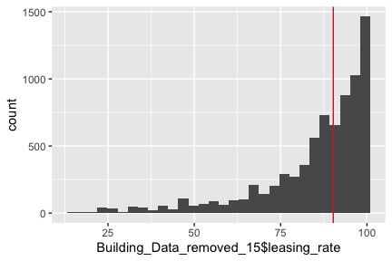
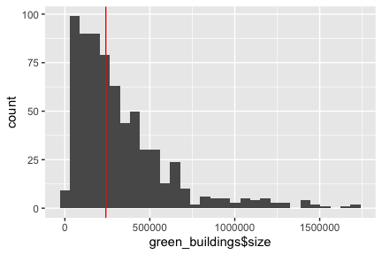
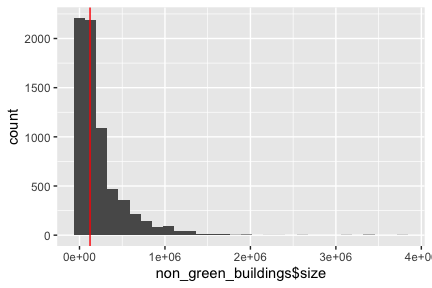
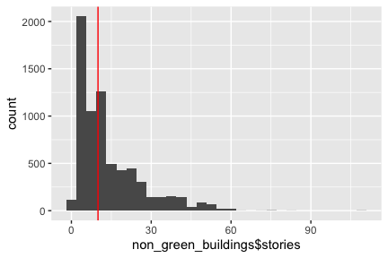
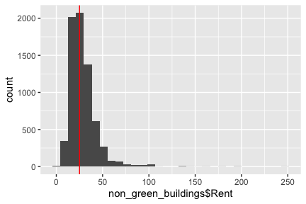
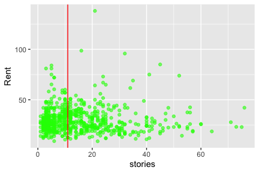
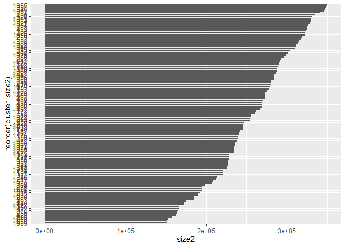

Visual story telling part 1: Green Buildings
================

### Let us take a look at the Data by running str(Building\_Data). Also ran is.na(Building\_Data) to take a look at any null values. We see that empl\_gr has 71 null values.

    ## 'data.frame':    7894 obs. of  23 variables:
    ##  $ CS_PropertyID    : int  379105 122151 379839 94614 379285 94765 236739 234578 42087 233989 ...
    ##  $ cluster          : int  1 1 1 1 1 1 6 6 6 6 ...
    ##  $ size             : int  260300 67861 164848 93372 174307 231633 210038 225895 912011 518578 ...
    ##  $ empl_gr          : num  2.22 2.22 2.22 2.22 2.22 2.22 4.01 4.01 4.01 4.01 ...
    ##  $ Rent             : num  38.6 28.6 33.3 35 40.7 ...
    ##  $ leasing_rate     : num  91.4 87.1 88.9 97 96.6 ...
    ##  $ stories          : int  14 5 13 13 16 14 11 15 31 21 ...
    ##  $ age              : int  16 27 36 46 5 20 38 24 34 36 ...
    ##  $ renovated        : int  0 0 1 1 0 0 0 0 0 1 ...
    ##  $ class_a          : int  1 0 0 0 1 1 0 1 1 1 ...
    ##  $ class_b          : int  0 1 1 1 0 0 1 0 0 0 ...
    ##  $ LEED             : int  0 0 0 0 0 0 0 0 0 0 ...
    ##  $ Energystar       : int  1 0 0 0 0 0 1 0 0 0 ...
    ##  $ green_rating     : int  1 0 0 0 0 0 1 0 0 0 ...
    ##  $ net              : int  0 0 0 0 0 0 0 0 0 0 ...
    ##  $ amenities        : int  1 1 1 0 1 1 1 1 1 1 ...
    ##  $ cd_total_07      : int  4988 4988 4988 4988 4988 4988 2746 2746 2746 2746 ...
    ##  $ hd_total07       : int  58 58 58 58 58 58 1670 1670 1670 1670 ...
    ##  $ total_dd_07      : int  5046 5046 5046 5046 5046 5046 4416 4416 4416 4416 ...
    ##  $ Precipitation    : num  42.6 42.6 42.6 42.6 42.6 ...
    ##  $ Gas_Costs        : num  0.0137 0.0137 0.0137 0.0137 0.0137 ...
    ##  $ Electricity_Costs: num  0.029 0.029 0.029 0.029 0.029 ...
    ##  $ cluster_rent     : num  36.8 36.8 36.8 36.8 36.8 ...

    ##  CS_PropertyID    cluster           size          empl_gr       
    ##  Mode :logical   Mode :logical   Mode :logical   Mode :logical  
    ##  FALSE:7894      FALSE:7894      FALSE:7894      FALSE:7820     
    ##                                                  TRUE :74       
    ##     Rent         leasing_rate     stories           age         
    ##  Mode :logical   Mode :logical   Mode :logical   Mode :logical  
    ##  FALSE:7894      FALSE:7894      FALSE:7894      FALSE:7894     
    ##                                                                 
    ##  renovated        class_a         class_b           LEED        
    ##  Mode :logical   Mode :logical   Mode :logical   Mode :logical  
    ##  FALSE:7894      FALSE:7894      FALSE:7894      FALSE:7894     
    ##                                                                 
    ##  Energystar      green_rating       net          amenities      
    ##  Mode :logical   Mode :logical   Mode :logical   Mode :logical  
    ##  FALSE:7894      FALSE:7894      FALSE:7894      FALSE:7894     
    ##                                                                 
    ##  cd_total_07     hd_total07      total_dd_07     Precipitation  
    ##  Mode :logical   Mode :logical   Mode :logical   Mode :logical  
    ##  FALSE:7894      FALSE:7894      FALSE:7894      FALSE:7894     
    ##                                                                 
    ##  Gas_Costs       Electricity_Costs cluster_rent   
    ##  Mode :logical   Mode :logical     Mode :logical  
    ##  FALSE:7894      FALSE:7894        FALSE:7894     
    ## 

### We see that the leasing rate is 0 for many buildings which is weird since these are the buildings with less occupancy. Let us remove all these buildings with Leasing Rate less than 15%.

<!-- --><!-- -->

``` r
median(Building_Data$leasing_rate)
```

    ## [1] 89.53

``` r
median(Building_Data_removed_15$leasing_rate)
```

    ## [1] 90.25

### Now let us consider green and non-green buildings seperately

### We see that the size is not equal among the data, hence we cannot take this data to perform our analysis.

<!-- --><!-- -->

    ## [1] "The median size for green buildings is : "
    ## [2] "241199"

    ## [1] "The median size for non-green buildings is : "
    ## [2] "123442"

### It is not accurate to calculate the median rent value from this data since it considers all buildings.

### We should consider buildings only with size close to 250,000 and stories close to 15. Also we should consider the fact that the building will be constructed near downtown. Hence must consider only clusters in downtown.

### With this in mind, let us shrink the data to obtain buildings in clusters with median height to be around 250,000 and stories 15.

<!-- --><!-- -->

    ## [1] "The median stories for green buildings is : "

    ## [1] 11

    ## [1] "The median stories for non-green buildings is : "

    ## [1] 10

<!-- --><!-- -->

    ## [1] "The median rent for green buildings is : "

    ## [1] 27.6

    ## [1] "The median rent for non-green buildings is : "

    ## [1] 25.06

### We cannot consider this graph where the median Rent is 25 since it is for the entire data. Let us slice the data to obtain buildings in clusters of median size=250000 and storey height 15. But first, some more visualization graphs

<!-- --><!-- --><!-- --><!-- -->

<!-- --><!-- -->

### We see that not all clusters have a median size of 250,000 and stories 15. We should consider that as a factor and shrink our data

### Finding average median among green buildings of stories and size

``` r
BD3=green_buildings[(average_median[2]>150000) & (average_median[2]<350000) & (average_median_stories[2]>11) & (average_median_stories[2]<30), ] 
```

<!-- --><!-- -->
<!-- --><!-- -->

``` r
ggplot(data=BD3, aes(BD3$Rent)) + 
  geom_histogram() +
geom_vline(data=BD3, aes(xintercept = median(BD3$Rent)), colour="red") 
```

    ## `stat_bin()` using `bins = 30`. Pick better value with `binwidth`.

<!-- -->

``` r
median(BD3$Rent)
```

    ## [1] 31.45

#### From this we see that the rent is 31.45

### Now let us calculate for non-green buildings in the same clusters

``` r
size_sum = BD3 %>%
  group_by(cluster)  %>%  # group the data points by model name
  summarize(size2 = median(size))  


ggplot(size_sum, aes(x=reorder(cluster, size2), y=size2)) + 
  geom_bar(stat='identity') + 
  coord_flip()
```

<!-- -->

### We see that the stories is 15, size is 250,00 hence this is appropriate data to figure out the RENT

### The median rent is 31.45

<!-- -->

    ## [1] 25.48

## Calculating :

### Median Rent for green buildings in clusters with median size = 250000 and median stories 15: 31.45

### Median Rent for non-green buildings in clusters with median size = 250000 and median stories 15: 25.48

### Hence difference is : 31.45-25.48 = 5.97; 5.97\*250,000=1,492,500

### Amount taken to construct 5,000,000; Hence it is : 5,000,000/1,492,500

### **3.35 years to gain the money back**

### But let us see the median leasing rate : \#92.285

<!-- -->

### 3.35/92.285

### \= 3.63 years
