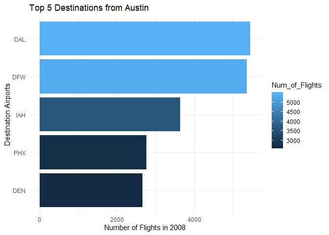
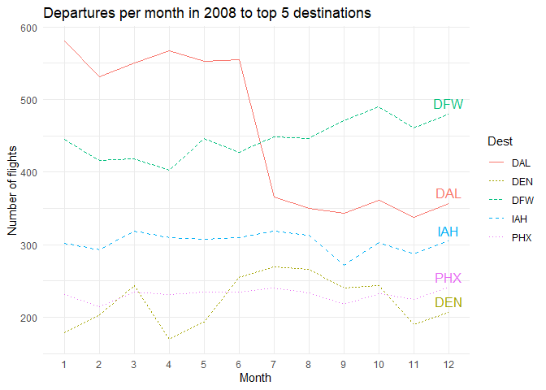
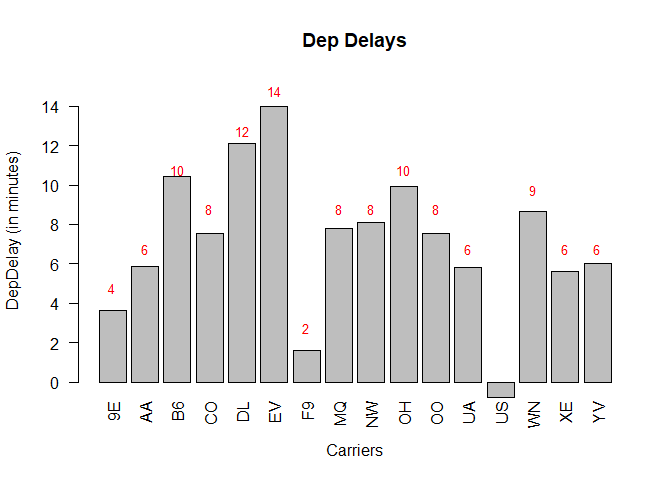
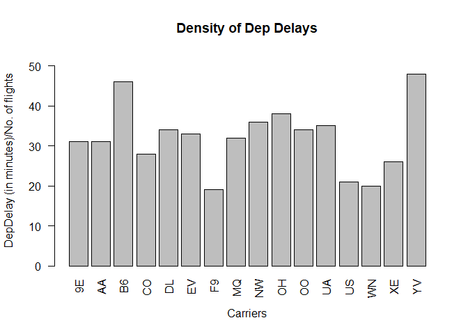
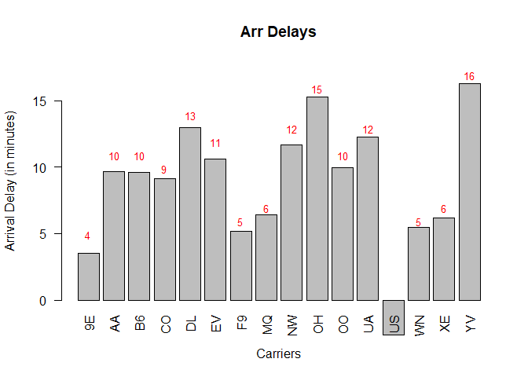
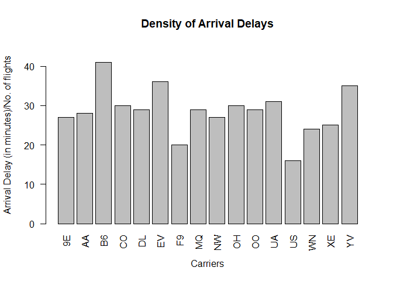
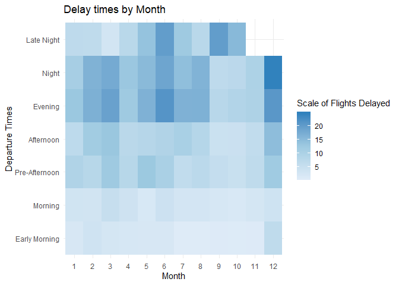
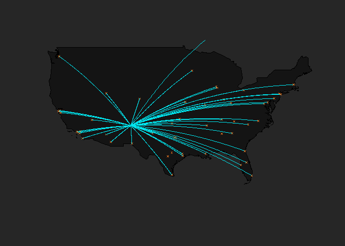

ABIA Flights Dataset
================

# Flights at ABIA

Dataset contains all incoming and outgoing Flights flying in and out of
the Austin-Bergstrom Interational Airport.

## Reading in the data

Here’s a peak into the dataset: 1. 99260 rows of data mapped to 29
columns  
2\. Missing values - It can be observed from the table given below that
the number of missing values for certain columns such as
CarrierDelay,WeatherDelay,NASDelay,SecurityDelay,LateAircraftDelay are
way too high (i.e 79513). Hence it may not be very helpful to use these
in our analysis.

    ## [1] 99260    29

    ##          Column Name Missing_Count
    ## 1               Year             0
    ## 2              Month             0
    ## 3         DayofMonth             0
    ## 4          DayOfWeek             0
    ## 5            DepTime          1413
    ## 6         CRSDepTime             0
    ## 7            ArrTime          1567
    ## 8         CRSArrTime             0
    ## 9      UniqueCarrier             0
    ## 10         FlightNum             0
    ## 11           TailNum             0
    ## 12 ActualElapsedTime          1601
    ## 13    CRSElapsedTime            11
    ## 14           AirTime          1601
    ## 15          ArrDelay          1601
    ## 16          DepDelay          1413
    ## 17            Origin             0
    ## 18              Dest             0
    ## 19          Distance             0
    ## 20            TaxiIn          1567
    ## 21           TaxiOut          1419
    ## 22         Cancelled             0
    ## 23  CancellationCode             0
    ## 24          Diverted             0
    ## 25      CarrierDelay         79513
    ## 26      WeatherDelay         79513
    ## 27          NASDelay         79513
    ## 28     SecurityDelay         79513
    ## 29 LateAircraftDelay         79513

# Overview of Insights

Here’s a list of interesting insights we’d like to gather from the
dataset:  
1\. What are the top 5 destinations that people tend to fly to from
Austin?  
2\. What times of the year get most traffic to the top 5 destinations
from Austin?  
3\. Arrival and Departure Delays by Carrier  
4\. Delays by time of the day vs Month  
5\. Visualization of incoming and outgoing Air traffic from ABIA

### Top 5 Destinations from Austin

The top 5 destinations people fly out to from Austin are Dallas,
Dallas(again\!), Houston, Phoenix and Denver. There are over 11000
flights from Austin to Dallas in 2008, which is almost a staggering 900
outgoing flights to Dallas from Austin\!  
Dallas-Forth Worth International Airport (DFW) serves as headquarters to
the world’s largest carrier, American Airlines, while Dallas Love (DAL)
is home to the world’s biggest low-cost carrier, Southwest. Dallas could
arguably be considered the most important city in the U.S. aviation
industry.  
<!-- -->

    ## [1] "DAL" "DFW" "IAH" "PHX" "DEN"

### Monthwise trends in departures to Top 5 Destinations

Digging deeper to see if there are any interesting trends in frequency
of flights to these top 5 destinations, we found that there was a
noticeable change in the number of departures to the aiports in Dallas -
DFW and DAL. This was peculiar because we would expect the distribution
to be remotely similar to both these airports with the end destinations
being the same\!  
What is important to note here is the period in context. 2008 was a
tough year for global economies. The impact on businesses was also
evident. We figured that 2008, especially the latter part of the year,
must have been a tough year for Southwest Airlines (DAL is home to this
low-cost budget airlines company). Our intuition turned out to be true
as can be seen in this interview with the CEO from 2008 -
<https://www.sfgate.com/business/article/Southwest-CEO-describes-2008-s-challenges-3292577.php>

<!-- -->

### Delay Analysis

“Research in consumer psychology shows that customers seek reasons for
service failures and that attributions of blame moderate the effects of
failure on the level of customer satisfaction” - Quoted in a journal
titled “The Impact of Service Operations Failures on Customer
Satisfaction: Evidence on How Failures and Their Source Affect What
Matters to Customers”
(<https://pdfs.semanticscholar.org/1487/dc65b163be21554246aac9b9884c7916d671.pdf>)

Delays in arrival or departure thus contribute significantly to customer
experience while flying in a particular airline. Thus, we decided to
look into average delays in departure and
arrival.  
<!-- --><!-- -->

<!-- --><!-- -->

First we plotted the Delay in minutes for both Departure and Arrival
with respect to the Carrier. However, the data was not conclusive. This
was because the number of flights per airlines in this given dataset
varies considerably. Hence to get a more accurate representation of the
airline carriers who tend to have the most delays, we calculated the
delay densities of each airline by computing the total delay by the
number of flights departed/arrived for each carrier.

### Delay by time of the day

To find out the times of the day when delays are most likely, we
bucketed the Scheduled Departure time into 7 buckets as follows:  
1\. Early Morning (12am - 6am)  
2\. Morning (6am - 9am)  
3\. Pre-Afternoon (9am - 12pm)  
4\. Affternoon (12pm - 3pm)  
5\. Evening (3pm - 6pm)  
6\. Night (6pm- 9pm)  
7\. Late Night (9pm - 12am)

We are now plotting the most likely zones of delay in a day by month.

    ## Joining, by = c("Month", "CRSDepTimeCategory")

<!-- --> It can be seen
from the graph above that the upper half of the graph depecting the
latter parts of a day have more darker shaded squares implying that
***more delays happen in the second half of the day***. *Highest delays
can be observed in the month of December* given the obvious weather
conditions, especially at Night.

### Visualization depicting Flights out of Austin

    ## The following objects are masked from abia (pos = 3):
    ## 
    ##     ActualElapsedTime, AirTime, ArrDelay, ArrTime,
    ##     CancellationCode, Cancelled, CarrierDelay, CRSArrTime,
    ##     CRSDepTime, CRSElapsedTime, DayofMonth, DayOfWeek, DepDelay,
    ##     DepTime, Dest, Distance, Diverted, FlightNum, ï..Year,
    ##     LateAircraftDelay, Month, NASDelay, Origin, SecurityDelay,
    ##     TailNum, TaxiIn, TaxiOut, UniqueCarrier, WeatherDelay
    ## 
    ## The following objects are masked from abia (pos = 3):
    ## 
    ##     ActualElapsedTime, AirTime, ArrDelay, ArrTime,
    ##     CancellationCode, Cancelled, CarrierDelay, CRSArrTime,
    ##     CRSDepTime, CRSElapsedTime, DayofMonth, DayOfWeek, DepDelay,
    ##     DepTime, Dest, Distance, Diverted, FlightNum, ï..Year,
    ##     LateAircraftDelay, Month, NASDelay, Origin, SecurityDelay,
    ##     TailNum, TaxiIn, TaxiOut, UniqueCarrier, WeatherDelay

    ## The following objects are masked from abia (pos = 4):
    ## 
    ##     ActualElapsedTime, AirTime, ArrDelay, ArrTime,
    ##     CancellationCode, Cancelled, CarrierDelay, CRSArrTime,
    ##     CRSDepTime, CRSElapsedTime, DayofMonth, DayOfWeek, DepDelay,
    ##     DepTime, Dest, Distance, Diverted, FlightNum, ï..Year,
    ##     LateAircraftDelay, Month, NASDelay, Origin, SecurityDelay,
    ##     TailNum, TaxiIn, TaxiOut, UniqueCarrier, WeatherDelay

<!-- -->
